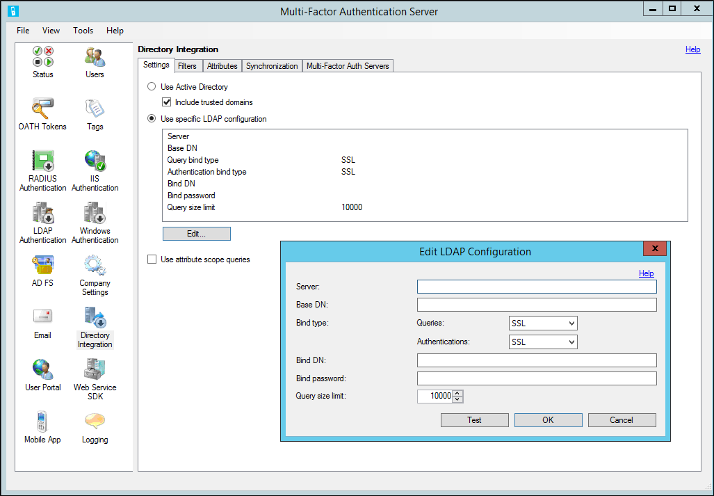

<properties 
    pageTitle="LDAP-Authentifizierung und Azure kombinierte Authentifizierungsserver"
    description="Dies ist der Azure mehrstufige Authentifizierungsseite, die bei der Bereitstellung von LDAP-Authentifizierung und Azure mehrstufige Authentifizierungsserver unterstützt."
    services="multi-factor-authentication"
    documentationCenter=""
    authors="kgremban"
    manager="femila"
    editor="curtand"/>

<tags
    ms.service="multi-factor-authentication"
    ms.workload="identity"
    ms.tgt_pltfrm="na"
    ms.devlang="na"
    ms.topic="get-started-article"
    ms.date="08/04/2016"
    ms.author="kgremban"/>

# LDAP-Authentifizierung und Azure kombinierte Authentifizierungsserver

Standardmäßig ist die Azure mehrstufige Authentifizierung-Server zu importieren oder zu synchronisieren von Benutzern aus Active Directory konfiguriert. Jedoch kann konfiguriert werden, um mit anderen LDAP-Verzeichnissen, wie ein Verzeichnis ADAM, oder einen bestimmten Active Directory-Domänencontroller binden. Wenn die Verbindung für ein Verzeichnis über LDAP konfiguriert, können die Azure mehrstufige Authentifizierungsserver dienen als Proxy LDAP-Authentifizierung ausführen konfiguriert werden. Darüber hinaus können für die Verwendung von LDAP-Bindung als Ziel RADIUS für die Vorabversion Authentifizierung der Benutzer bei Verwendung der IIS-Authentifizierung oder für die primäre Authentifizierung im Portal Azure mehrstufige Authentifizierung Benutzer.

Wenn Azure kombinierte Authentifizierung als einen LDAP-Proxy zu verwenden, wird der Azure mehrstufige Authentifizierungsserver um kombinierte Authentifizierung hinzufügen zwischen dem LDAP-Client (z. B. VPN-Anwendung, Anwendung) und dem LDAP-Verzeichnisserver eingefügt. Für Azure mehrstufige Authentifizierung funktioniert muss der Azure mehrstufige Authentifizierungsserver für die Kommunikation mit die Client-Server und das LDAP-Verzeichnis konfiguriert werden. In dieser Konfiguration der Azure mehrstufige Authentifizierungsserver LDAP-Anfragen Client-Server und Applikationen akzeptiert und weiterleitet auf dem Zielserver LDAP-Verzeichnis, um die primären Anmeldeinformationen überprüfen. Wenn die Antwort aus dem LDAP-Verzeichnis angezeigt wird, dass sie die primäre Anmeldeinformationen gültig sind, Azure kombinierte Authentifizierung führt die Sekunde zweifaktorielle Varianzanalyse Authentifizierung, und sendet eine Antwort an den LDAP-Client. Die gesamte Authentifizierung erfolgreich, nur, wenn sowohl auf dem Server LDAP-Authentifizierung und die kombinierte Authentifizierung erfolgreich ausgeführt werden kann.

## LDAP-Authentifizierungskonfiguration

Um LDAP-Authentifizierung zu konfigurieren, installieren Sie Azure mehrstufige Authentifizierungsserver auf einem WindowsServer aus. Gehen Sie folgendermaßen vor:

1. Klicken Sie auf das Symbol LDAP-Authentifizierung im linken Menü, innerhalb des Azure mehrstufige Authentifizierungsservers.
2. Aktivieren Sie das Kontrollkästchen LDAP-Authentifizierung aktivieren.
3. Ändern Sie auf der Registerkarte Clients die TCP- und SSL-Anschluss ist der Azure mehrstufige Authentifizierung LDAP-Dienst nicht standardmäßige Ports gebunden werden soll, LDAP-Anfragen von Clients zu überwachen, die konfiguriert werden.
4. Wenn Sie beabsichtigen, LDAPS im Desktopclient Azure mehrstufige Authentifizierung Server verwenden, muss ein Zertifikat einer Zertifizierungsstelle auf dem Server installiert sein, die der Server ausgeführt wird, klicken Sie auf. Klicken Sie auf die Schaltfläche Durchsuchen... Schaltfläche Weiter, um das Zertifikat SSL, und wählen Sie das installierte Zertifikat, das für die sichere Verbindung verwendet wird.
5. Klicken Sie auf Hinzufügen... Schaltfläche.
6. Geben Sie im Dialogfeld hinzufügen LDAP-Client die IP-Adresse des Einheit, Server oder der Anwendung, die authentifizieren auf den Server und eine Anwendungsnamen (optional) ein. Der Name der Anwendung wird in Azure kombinierte Authentifizierung Berichte und möglicherweise innerhalb SMS oder Mobile-App-Authentifizierungsnachrichten angezeigt werden.
7. Aktivieren Sie das Übereinstimmung Benutzer Azure kombinierte-Authentifizierung erforderlich aus, wenn alle Benutzer waren oder, in dem Server und unterliegen für Multi-Faktor-Authentifizierung importiert werden. Wenn eine signifikante Anzahl Benutzer noch nicht in den Server importiert wurden und/oder von für Multi-Faktor-Authentifizierung ausgenommen werden, lassen Sie das Kontrollkästchen deaktiviert. Finden Sie in der Hilfedatei für Weitere Informationen zu diesem Feature.
8. Sie können wiederholen Sie die Schritte 5 bis 7, um zusätzliche LDAP-Clients hinzufügen.
9. Wenn die kombinierte Authentifizierung Azure erhalten LDAP-Authentifizierung konfiguriert ist, muss er Proxy diese Authentifizierung dem LDAP-Verzeichnis. Daher das Ziel Registerkarte zeigt nur eine einzelne, grau Option, um ein LDAP-Ziel verwenden. Um die LDAP-Verzeichnis Verbindung konfigurieren möchten, klicken Sie auf das Symbol Verzeichnisintegration.
10. Wählen Sie auf der Registerkarte Einstellungen das Optionsfeld verwenden bestimmte LDAP-Konfiguration aus.
11. Klicken Sie auf Bearbeiten... Schaltfläche.
12. Füllen Sie die Felder mit den Informationen, die Verbindung zum LDAP-Verzeichnis erforderlich, klicken Sie im Dialogfeld LDAP-Konfiguration bearbeiten. In der folgenden Tabelle sind Beschreibungen der Felder enthalten. Hinweis: Diese Informationen sind auch in der Hilfedatei Azure mehrstufige Authentifizierungsserver enthalten.
13. Testen Sie die LDAP-Verbindung durch Klicken auf die Schaltfläche Testen.
14. Wenn die LDAP-Testverbindung erfolgreich war, klicken Sie auf die Schaltfläche OK.
15. Klicken Sie auf die Registerkarte Filter. Der Server ist vorkonfiguriert, Container, Sicherheitsgruppen und Benutzer aus Active Directory laden. Wenn in ein anderes LDAP-Verzeichnis Bindung, müssen Sie wahrscheinlich so bearbeiten Sie die Filter angezeigt. Klicken Sie auf den Link Hilfe für Weitere Informationen zu filtern.
16. Klicken Sie auf der Registerkarte Attribute. Der Server ist vorkonfiguriertes Attribute in Active Directory zuordnen.
17. Klicken Sie auf Bearbeiten, wenn in ein anderes LDAP-Verzeichnis oder ändern die Zuordnungen vorkonfiguriertes Attribut Bindung... Schaltfläche.
18. Ändern Sie im Dialogfeld Attribute bearbeiten im LDAP-Attribut Zuordnungen für Ihr Verzeichnis ein. Attributnamen können eingegeben oder ausgewählt, indem Sie auf die... Schaltfläche neben jedes Feld.
19. Klicken Sie auf den Link Hilfe für Weitere Informationen zu Attributen.
20. Klicken Sie auf die Schaltfläche OK.
21. Klicken Sie auf das Symbol Unternehmen Einstellungen, und wählen Sie die Registerkarte mit einer Auflösung von Benutzernamen.
22. wenn Herstellen einer Verbindung mit Active Directory von einem Server Domänenverbund, sollten Sie behalten Sie mithilfe von Windows-Sicherheits-IDs (SIDs) nach übereinstimmenden Benutzernamen Optionsfeld aktiviert sein. Wählen Sie andernfalls das Attribut LDAP verwenden Eindeutiger Bezeichner für übereinstimmende Benutzernamen Optionsfeld ein. Bei Auswahl dieser Option versucht die Azure mehrstufige Authentifizierungsserver jeder Benutzername auf einen eindeutigen Bezeichner im LDAP-Verzeichnis zu beheben. Eine LDAP-Suche durchgeführt dem Benutzernamen-Attribute definiert, in der Verzeichnisintegration > Registerkarte Attribute. Wenn ein Benutzer authentifiziert, wird der Benutzername für den eindeutigen Bezeichner enthält, im LDAP-Verzeichnis aufgelöst werden und der eindeutige Bezeichner für den Abgleich des Benutzers in der Datendatei Azure kombinierte Authentifizierung verwendet werden. Auf diese Weise können für Vergleiche Groß-und Kleinschreibung, als auch lange und kurze Username dies Formate abgeschlossen ist die Azure mehrstufige Authentifizierungsserver-Konfiguration. Der Server ist jetzt Abhören konfigurierten Ports für LDAP-zugriffsanforderungen von konfigurierten Clients, und legen auf Proxy diese Anforderungen an die LDAP-Verzeichnis für die Authentifizierung.

## LDAP-Client-Konfiguration

Verwenden Sie die Richtlinien zum Konfigurieren des LDAP-Clients:

- Konfigurieren der Anwendung, Server oder eine Anwendung über LDAP Azure mehrstufige Authentifizierung Server authentifizieren, als wäre Ihr LDAP-Verzeichnis. Sie sollten die gleichen Einstellungen verwenden, die Sie normalerweise zum Verbinden mit Ihr LDAP-Verzeichnis, eine Ausnahme bilden jedoch den Servernamen oder die IP-Adresse des Servers Azure mehrstufige Authentifizierung, die sich direkt verwenden.
- Konfigurieren Sie die LDAP-Timeoutfehler auf 30-60 Sekunden an, sodass es Zeit ist, überprüfen Sie die Anmeldeinformationen des Benutzers mit dem LDAP-Verzeichnis, führen Sie die zweite zweifaktorielle Varianzanalyse Authentifizierung, seine Antwort erhalten und klicken Sie dann auf die Access-Anforderung LDAP-Antworten.
- Wenn LDAPS verwenden zu können, muss die Einheit oder einen Server Ausführenden der LDAP-Abfragen das SSL-Zertifikat, das auf dem Azure mehrstufige Authentifizierungsserver installierten vertrauen.
