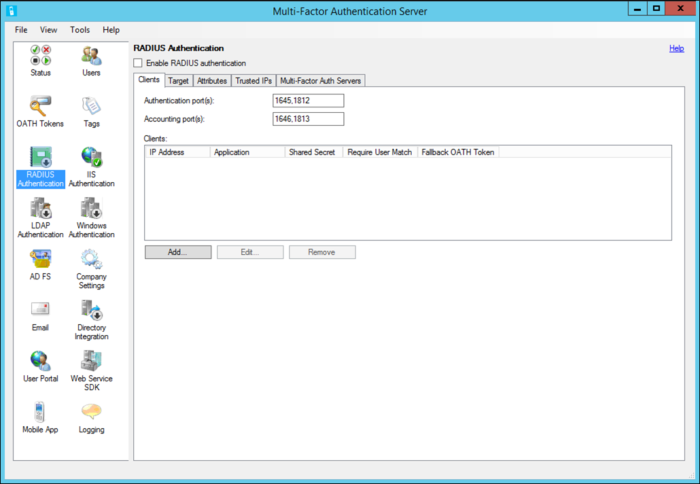

<properties 
    pageTitle="RADIUS-Authentifizierung und Azure kombinierte Authentifizierungsserver"
    description="Dies ist der Azure mehrstufige Authentifizierungsseite, die bei der Bereitstellung von RADIUS-Authentifizierung und Azure mehrstufige Authentifizierungsserver unterstützt."
    services="multi-factor-authentication"
    documentationCenter=""
    authors="kgremban"
    manager="femila"
    editor="curtand"/>

<tags
    ms.service="multi-factor-authentication"
    ms.workload="identity"
    ms.tgt_pltfrm="na"
    ms.devlang="na"
    ms.topic="get-started-article"
    ms.date="08/15/2016"
    ms.author="kgremban"/>

# RADIUS-Authentifizierung und Azure kombinierte Authentifizierungsserver

Im Abschnitt RADIUS-Authentifizierung können Sie aktivieren und Konfigurieren der RADIUS-Authentifizierung für den Server Azure mehrstufige Authentifizierung. RADIUS ist ein standard-Protokoll Authentifizierungsanfragen akzeptieren und diese Anfragen zu bearbeiten. Der Server Azure mehrstufige Authentifizierung fungiert als RADIUS-Server und zwischen der RADIUS-Client (z. B. VPN-Anwendung) und die Authentifizierungsziel-, das Active Directory (AD), einem LDAP-Verzeichnis oder einen anderen RADIUS-Server sein kann, damit Azure kombinierte Authentifizierung hinzufügen eingefügt. Für Azure mehrstufige Authentifizierung funktioniert müssen Sie die Azure mehrstufige Authentifizierungsserver konfigurieren, damit es mit den Clientservern und das Authentifizierungsziel kommunizieren kann. Der Server Azure mehrstufige Authentifizierung RADIUS-Client-Anfragen akzeptiert, überprüft Anmeldeinformationen anhand der Authentifizierung, fügt Azure kombinierte Authentifizierung und sendet eine Antwort an den RADIUS-Client. Die gesamte Authentifizierung erfolgreich, wenn nur die sowohl die primäre Authentifizierung und der Azure kombinierte Authentifizierung erfolgreich ausgeführt werden kann.

>[AZURE.NOTE]
>Die MFA Server unterstützt nur PAP (Password Authentication-Protokoll) und MSCHAPv2 (Microsoft des Herausforderung-Authentication-Protokoll) RADIUS Protokolle, wenn als RADIUS-Server fungiert.  Andere Protokolle wie EAP (extensible Authentication-Protokoll) können verwendet werden, wenn der MFA-Server als RADIUS-Proxy an einen anderen RADIUS-Server fungiert, die dieses Protokoll, beispielsweise Microsoft NPS unterstützt.
> 
>Wenn Sie andere Protokolle in dieser Konfiguration verwenden zu können, funktioniert unidirektionale SMS und Angehörigen Token nicht, da die MFA-Server keine erfolgreiche RADIUS Herausforderung Antwort, die dieses Protokoll einleiten kann.

## Konfiguration von RADIUS-Authentifizierung

Installieren Sie Azure mehrstufige Authentifizierungsserver auf einem WindowsServer, RADIUS-Authentifizierung um zu konfigurieren. Wenn Sie eine Active Directory-Umgebung verfügen, sollte der Server der Domäne innerhalb des Netzwerks hinzugefügt werden. Verwenden Sie das folgende Verfahren, um den Azure mehrstufige Authentifizierungsserver zu konfigurieren:

1. Klicken Sie auf das Symbol RADIUS-Authentifizierung im linken Menü, innerhalb des Azure mehrstufige Authentifizierungsservers.
2. Kontrollkästchen Sie das Aktivieren RADIUS-Authentifizierung.
3. Ändern Sie auf der Registerkarte Clients Authentifizierung Ports und Buchhaltung Ports, wenn Azure mehrstufige Authentifizierung RADIUS-Dienst nicht standardmäßige Ports gebunden werden soll, RADIUS-Anfragen von Clients zu überwachen, die konfiguriert werden.
4. Klicken Sie auf Hinzufügen... Schaltfläche.
5. Geben Sie im Dialogfeld RADIUS-Client hinzufügen die IP-Adresse der Einheit/Server authentifiziert wird dem Azure mehrstufige Authentifizierungsserver, eine Anwendungsnamen (optional) und eine freigegebene geheim. Das gemeinsame Kennwort müssen auf den Azure mehrstufige Authentifizierungsserver und Einheit/Server identisch sein. Der Name der Anwendung wird in Azure kombinierte Authentifizierung Berichte und möglicherweise innerhalb SMS oder Mobile-App-Authentifizierungsnachrichten angezeigt werden.
6. Aktivieren Sie das Übereinstimmung Benutzer mehrstufige Authentifizierung erforderlich aus, wenn alle Benutzer waren oder, in dem Server und unterliegen kombinierte Authentifizierung importiert werden. Wenn eine signifikante Anzahl Benutzer noch nicht in den Server importiert wurden und/oder von kombinierte Authentifizierung ausgenommen werden, lassen Sie das Kontrollkästchen deaktiviert. Finden Sie in der Hilfedatei für Weitere Informationen zu diesem Feature.
7. Aktivieren Sie das Kontrollkästchen fallbackabfragen Angehörigen aktivieren token, wenn Benutzer die Authentifizierung Azure kombinierte Authentifizierung mobile-app verwenden und Angehörigen die Kennungen als eine alternative Authentifizierung auf die Out-of-Band-Telefon anrufen, SMS oder Pushbenachrichtigungen Benachrichtigung verwendet werden soll.
8. Klicken Sie auf die Schaltfläche OK.
9. Sie können wiederholen Sie die Schritte 4 bis 8, um weitere RADIUS-Clients hinzuzufügen.
10. Klicken Sie auf der Registerkarte Ziel.
11. Wenn der Server Azure mehrstufige Authentifizierung auf einem Server Domänenverbund in Active Directory-Umgebung installiert ist, wählen Sie die Windows-Domäne.
12. Wenn Benutzer mit einem LDAP-Verzeichnis authentifiziert werden sollen, aktivieren Sie LDAP-Bindung. Wenn LDAP-Bindung verwenden zu können, müssen Sie klicken Sie auf das Symbol Verzeichnisintegration und bearbeiten die LDAP-Konfiguration auf der Registerkarte Einstellungen aus, damit der Server in Ihrem Verzeichnis gebunden werden kann. Anweisungen zum Konfigurieren von LDAP finden Sie in der LDAP-Proxy-Konfiguration Führungslinie.
13. Wenn der Benutzer für einen anderen RADIUS-Server authentifiziert werden sollen, wählen Sie RADIUS-Servern.
14. Konfigurieren des Servers, dass der Server Proxy wird die RADIUS-Anfragen an durch Klicken auf die hinzufügen... Schaltfläche.
15. Geben Sie im Dialogfeld RADIUS-Server hinzufügen die IP-Adresse des RADIUS-Servers und einer freigegebenen geheim. Das gemeinsame Kennwort müssen auf dem Azure mehrstufige Authentifizierung-Server und dem RADIUS identisch sein. Ändern Sie den Port Authentifizierung und Buchhaltung Port aus, wenn verschiedene Ports vom RADIUS-Server verwendet werden.
16. Klicken Sie auf die Schaltfläche OK.
17. Sie müssen die Azure mehrstufige Authentifizierung-Server als RADIUS-Client in der anderen RADIUS-Server hinzufügen, damit sie damit vom Server Azure mehrstufige Authentifizierung gesendete zugriffsanforderungen verarbeiten wird. Sie müssen den gleichen gemeinsamen geheimen Schlüssel im Azure mehrstufige Authentifizierungsserver konfiguriert verwenden.
18. Möglicherweise wiederholen Sie diesen Schritt, um zusätzliche RADIUS-Server hinzufügen und konfigurieren Sie die Reihenfolge, in der der Server mit den Schaltflächen nach oben und nach unten angerufen werden soll. Damit ist die Azure mehrstufige Authentifizierungsserver-Konfiguration abgeschlossen. Der Server ist nun konfigurierten Ports für RADIUS-Access-Anfragen konfigurierten Clients überwacht.   

## Konfiguration von RADIUS-Clients

Verwenden Sie die Richtlinien zum Konfigurieren des RADIUS-Clients:

- Konfigurieren der Einheit/Authentifizierung über RADIUS Azure mehrstufige Authentifizierungsserver IP-Adresse, die als der RADIUS-Server fungieren sollen.
- Verwenden Sie den gleichen gemeinsamen geheimen Schlüssel, der über konfiguriert wurde.
- Konfigurieren Sie das Timeout RADIUS auf 30-60 Sekunden so, dass es Zeit ist, überprüfen die Anmeldeinformationen des Benutzers, führen Sie die kombinierte Authentifizierung, seine Antwort erhalten und dann zu RADIUS Access Besprechungsanfrage antworten.
