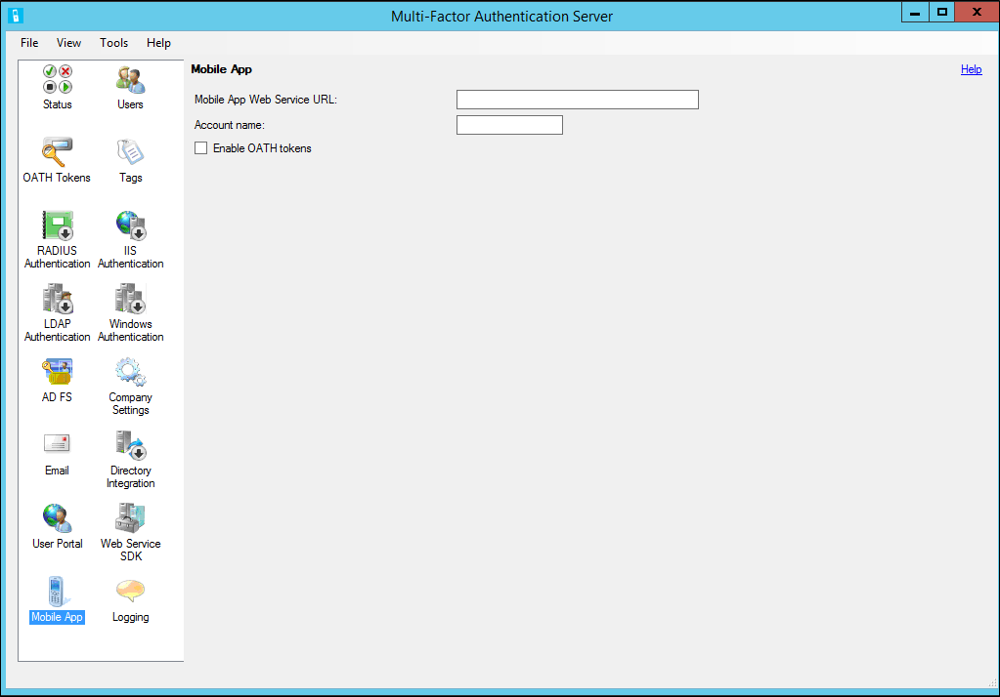

<properties 
    pageTitle="Erste Schritte der MFA Mobile-App-Webdienst"
    description="Die App Azure mehrstufige Authentifizierung bietet eine Option zusätzliche Out-of-Band-Authentifizierung.  Es kann der MFA Server Pushbenachrichtigungen für Benutzer verwenden."
    services="multi-factor-authentication"
    documentationCenter=""
    authors="kgremban"
    manager="femila"
    editor="curtland"/>

<tags
    ms.service="multi-factor-authentication"
    ms.workload="identity"
    ms.tgt_pltfrm="na"
    ms.devlang="na"
    ms.topic="get-started-article"
    ms.date="08/04/2016"
    ms.author="kgremban"/>

# Erste Schritte der MFA Mobile-App-Webdienst

Die App Azure mehrstufige Authentifizierung bietet eine Option zusätzliche Out-of-Band-Authentifizierung. Statt Platzieren eines automatisierten Anruf oder SMS für den Benutzer bei der Anmeldung, legt das Azure kombinierte Authentifizierung eine Benachrichtigung zur Azure mehrstufige Authentifizierung-App auf des Benutzers Smartphone oder Tablet-PC. Der Benutzer tippt einfach "Authentifizieren" (oder eine PIN eingibt und tippt auf "Authentifizieren") in der app anzumelden.

Akzeptieren, um die Azure mehrstufige Authentifizierung-App verwenden zu können, sind die folgenden erforderlich, damit die app erfolgreich mit Mobile-App-Webdienst kommunizieren kann:

- Bitte finden Sie unter Hardware und Software für Hard- und Software Anforderungen
- Sie müssen eine Version von 6.0 oder höher des Servers Azure mehrstufige Authentifizierung
- Mobile-App-Webdienst muss installiert werden, auf einem internetfähigen Webserver mit Microsoft® Internet Information Services (IIS) IIS 7.x oder höher.  Weitere Informationen zu IIS finden Sie unter [IIS.NET](http://www.iis.net/).
- Sicherstellen, dass ASP.NET v4.0.30319 installiert, registriert und setzen auf zulässig
- Erforderliche Rollendiensten gehören ASP.NET und IIS 6 Metabasiskompatibilität
- Mobile-App-Webdienst muss über einen öffentlichen URL zugegriffen werden.
- Mobile-App-Webdiensts muss mit einem Zertifikat SSL geschützt werden.
- Azure mehrstufige Authentifizierung Web Service SDK muss installiert sein, in IIS 7.x oder höher auf dem Server, die dem Azure mehrstufige Authentifizierungsserver
- Azure mehrstufige Authentifizierung Web Service SDK muss mit einem Zertifikat SSL geschützt werden.
- Mobile-App-Webdiensts muss eine Verbindung über SSL zu Azure mehrstufige Authentifizierung Web Service SDK herstellen
- Mobile-App-Webdiensts muss authentifiziert zu Azure mehrstufige Authentifizierung Web Service SDK mit den Anmeldeinformationen eines Dienstkontos, deren Mitglied einer Sicherheitsgruppe namens "PhoneFactor Administratoren" ist. Dieses Dienstkontos und Gruppe vorhanden in Active Directory, wenn der Server Azure mehrstufige Authentifizierung auf einem Server Domänenverbund ausgeführt wird. Dieses Dienstkontos und Gruppe vorhanden lokal auf dem Azure mehrstufige Authentifizierungsserver, wenn es nicht zu einer Domäne gehört.

Installieren des Benutzers-Portals auf einem anderen Server als dem Azure mehrstufige Authentifizierungsserver erfordert die folgenden drei Schritte:

1. Installieren des Webdiensts SDK
2. Installieren des Webdiensts mobile-app
3. Konfigurieren Sie die mobile-app-Einstellungen in den Server Azure mehrstufige Authentifizierung
4. Aktivieren Sie die App Azure mehrstufige Authentifizierung für Endbenutzer

## Installieren des Webdiensts SDK

Wenn Azure mehrstufige Authentifizierung Web Service SDK auf dem Azure mehrstufige Authentifizierung-Server noch nicht installiert ist, wechseln Sie zu diesem Server, und öffnen Sie den Azure mehrstufige Authentifizierungsserver. Klicken Sie auf das Symbol Web Service SDK, klicken Sie auf Installieren Web Service SDK... Schaltfläche, und folgen Sie den Anweisungen präsentiert. Der Web Service SDK muss mit einem Zertifikat SSL geschützt werden. Ein selbst signiertes Zertifikat ist für diesen Zweck kein Problem, aber es wurde in den "vertrauenswürdigen" Serverzertifikat des Kontos auf dem Webserver User Portal lokalen Computer importiert werden sollen, damit sie dieses Zertifikat als vertrauenswürdig einstuft, wenn die SSL-Verbindung initiieren.

## Installieren des Webdiensts mobile-app
Achten Sie vor der Neuinstallation der mobilen app-Webdiensts ein, auf der folgenden Aktionen aus:

- Wenn die Azure mehrstufige Authentifizierung User Portal auf dem Server Internet zugänglichen bereits installiert ist, kann der Benutzername, das Kennwort und die URL der Web Service SDK aus der User Portal Webkonfigurationsdatei kopiert werden.
- Es empfiehlt sich in einem Webbrowser auf das Internet zugängliche Webserver öffnen, und navigieren Sie zu der URL des Web Service SDK, die in der Datei web.config eingegeben wurde. Wenn Sie der Browser erfolgreich an den Webdienst aufrufen kann, sollten sie Sie zur Eingabe von Anmeldeinformationen. Geben Sie den Benutzernamen und das Kennwort, das in der Datei web.config eingegeben wurden, genau wie in der Datei angezeigt. Stellen Sie sicher, dass keine Warnungen Zertifikat oder ein Fehler angezeigt werden.
- Wenn ein reverse Proxy oder Firewall vor dem Webserver Mobile-App-Webdienst sitzt und SSL Verschiebung ausführen, können Sie Mobile-App-Webdiensts Standardinstanzennamen bearbeiten und hinzufügen die folgende-Taste, um die <appSettings> Abschnitt, damit die Mobile-App-Webdienst http statt Https verwenden können. SSL ist jedoch weiterhin aus der Mobile-App an den Firewall/Reverse Proxy erforderlich. <add key="SSL_REQUIRED" value="false"/>

### So installieren Sie den Webdienst mobile-app

<ol>
<li>Öffnen Sie Windows-Explorer auf die Server Azure mehrstufige Authentifizierung, und navigieren Sie zu dem Ordner, in dem die Azure mehrstufige Authentifizierungsserver installiert ist (z. B. c:\Programme Files\Azure mehrstufige Authentifizierung). Wählen Sie die 32-Bit- oder 64-Bit-Version der Azure mehrstufige AuthenticationPhoneAppWebServiceSetup Installationsdatei je nach dem Server, der auf Mobile-App-Webdienst installiert werden. Kopieren Sie die Installationsdatei auf dem Server Internet zugänglichen aus.</li>

<li>Klicken Sie auf das Internet zugängliche Webserver muss die Setupdatei mit Administratorrechten ausgeführt werden. Die einfachste Möglichkeit hierzu ist, öffnen Sie ein Eingabeaufforderungsfenster als Administrator aus, und navigieren Sie zu dem Speicherort, in dem die Installationsdatei kopiert wurde.</li>  

<li>Führen Sie die Datei kombinierte AuthenticationMobileAppWebServiceSetup installieren, ändern Sie die Website aus, falls gewünscht, und wechseln Sie zum virtuellen Verzeichnis für einen kurzen Namen ein, beispielsweise "PA". Name eines kurzen virtuellen Verzeichnisses wird empfohlen, da Benutzer bei der Aktivierung der Mobile-App Webdienst-URL in der mobilen Gerät eingeben müssen.</li>

<li>Nach dem Beenden der Installation von der Azure mehrstufige AuthenticationMobileAppWebServiceSetup, navigieren Sie zu C:\inetpub\wwwroot\PA (oder das entsprechende Verzeichnis basierend auf den Namen des virtuellen Verzeichnisses), und bearbeiten Sie die Datei web.config.</li>  

<li>Suchen Sie nach der WEB_SERVICE_SDK_AUTHENTICATION_USERNAME und WEB_SERVICE_SDK_AUTHENTICATION_PASSWORD-Taste, und legen Sie die Werte in der Benutzername und das Kennwort für das Dienstkonto, deren Mitglied der Sicherheit PhoneFactor Admins ist (siehe Abschnitt Anforderungen) gruppieren. Dies möglicherweise dasselbe Konto als die Identität des Benutzers Portals Azure mehrstufige Authentifizierung verwendet wird, wenn die zuvor installiert wurde. Achten Sie darauf, um zwischen den Anführungszeichen am Ende der Zeile, geben Sie den Benutzernamen und das Kennwort (Wert = "" / >). Es wird empfohlen, einen qualifizierten Benutzernamen (z. B. domaene\benutzername oder Computer\Benutzername) verwenden.</li>  

<li>Suchen Sie die PfMobile App Web Service_pfwssdk_PfWsSdk-Einstellung, und ändern Sie den Wert von "Http://localhost:4898/PfWsSdk.asmx" die URL des Web Service SDK, die auf dem Azure mehrstufige Authentifizierungsserver (z. B. https://computer1.domain.local/MultiFactorAuthWebServiceSdk/PfWsSdk.asmx) ausgeführt wird. Da SSL für diese Verbindung verwendet wird, müssen Sie die Web Service SDK nach Servername und nicht IP-Adresse verweisen, da das SSL-Zertifikat wurde für den Servernamen ausgestellt wird und die URL verwendet, muss der Name des Zertifikats übereinstimmen. Wenn Sie der Servernamen nicht in eine IP-Adresse aus dem Internet zugänglichen Server behoben wird, fügen Sie einen Eintrag zur Hosts-Datei auf dem Server, den Namen des Servers Azure mehrstufige Authentifizierung seiner IP-Adresse zuzuordnen. Speichern Sie die Datei web.config nach Änderungen vorgenommen wurden.</li>  

<li>Wenn die Website, dass Mobile-App-Webdienst unter (z. B. Standardwebsite) installiert wurde bereits wurde nicht mit einem öffentlich signiertes Zertifikat eine, installieren Sie das Zertifikat auf dem Server, wenn Sie nicht bereits installiert, IIS-Manager zu öffnen und das Zertifikat der Website binden.</li>  

<li>Öffnen Sie einen Webbrowser von einem beliebigen Computer, und navigieren Sie zu der URL, auf dem Webdienst für Mobile-App installiert wurde (z. B. https://www.publicwebsite.com/PA). Stellen Sie sicher, dass keine Warnungen Zertifikat oder ein Fehler angezeigt werden.</li>

### Konfigurieren Sie die mobile-app-Einstellungen in den Server Azure mehrstufige Authentifizierung
Jetzt, da der Webdienst mobile-app installiert ist, müssen Sie den Azure mehrstufige Authentifizierungsserver für die Arbeit mit dem Portal zu konfigurieren.

#### So konfigurieren Sie die mobile-app-Einstellungen in den Server Azure mehrstufige Authentifizierung

1. Server den Eintrag Azure mehrstufige Authentifizierung klicken Sie auf das Symbol User Portal. Wenn Benutzer dürfen, deren Authentifizierungsmethoden, zu steuern, aktivieren Sie auf der Registerkarte Einstellungen unter Benutzern erlauben, wählen Sie Methode, Mobile-App. Dieses Feature deaktiviert Endbenutzer müssen, wenden Sie sich an Ihr Helpdesk, um für die Mobile-App Aktivierung abzuschließen.
2. Markieren Sie die Benutzern erlauben zum Feld Mobile-App zu aktivieren.
3. Aktivieren Sie das Kontrollkästchen für die Benutzer Registrierung zulassen.
4. Klicken Sie auf das Symbol Mobile-App.
5. Geben Sie die URL, die mit dem virtuellen Verzeichnis die erstellt wurde, bei der Installation der Azure mehrstufige AuthenticationMobileAppWebServiceSetup von verwendet wird. Einen Kontonamen ein möglicherweise in das bereitgestellte Feld eingegeben werden. Dieser Firmenname wird in der mobilen Anwendung angezeigt. Wenn leer, wird der Namen Ihres im Verwaltungsportal Azure erstellt kombinierte Authentifizierung-Anbieters angezeigt.

