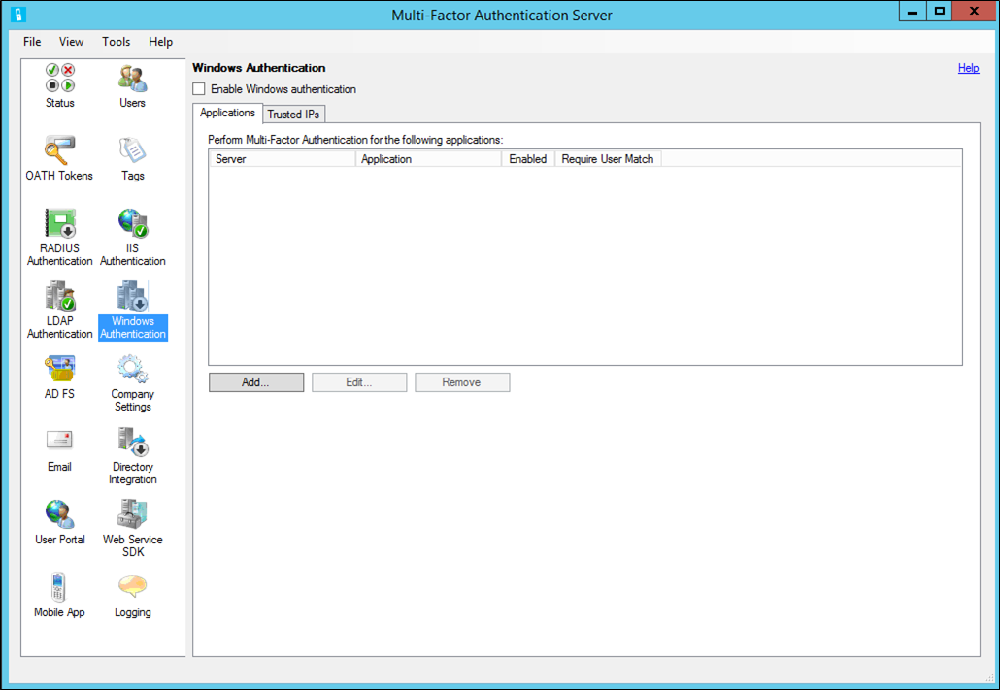

<properties 
    pageTitle="Windows-Authentifizierung und Azure kombinierte Authentifizierungsserver"
    description="Dies ist der Azure mehrstufige Authentifizierungsseite, die bei der Bereitstellung von Windows-Authentifizierung und Azure mehrstufige Authentifizierungsserver unterstützt."
    services="multi-factor-authentication"
    documentationCenter=""
    authors="kgremban"
    manager="femila"
    editor="curtand"/>

<tags
    ms.service="multi-factor-authentication"
    ms.workload="identity"
    ms.tgt_pltfrm="na"
    ms.devlang="na"
    ms.topic="get-started-article"
    ms.date="08/04/2016"
    ms.author="kgremban"/>

# Windows-Authentifizierung und Azure kombinierte Authentifizierungsserver

Im Abschnitt Windows-Authentifizierung kann den Administrator aktivieren und Konfigurieren der Windows-Authentifizierung für eine oder mehrere Applikationen.  Im folgenden finden eine Liste der Dinge zu beachten Sie vor dem Einrichten von Windows-Authentifizierung.

-  Neustart ist erforderlich, bevor die Azure kombinierte Authentifizierung für Terminaldienste gelten soll.
-  Wenn 'Erfordern Azure kombinierte Authentifizierung Benutzer Match' aktiviert ist, und Sie nicht in der Benutzerliste sind, werden Sie nicht nach einem Neustart des Computers angemeldet sein.
-  Vertrauenswürdigen IP-Adressen ist abhängig davon, ob die Anwendung Client-IP-mit der Authentifizierung bereitgestellt werden. Derzeit nur Terminal Services wird unterstützt.  

>[AZURE.NOTE]Dieses Feature ist in secure Terminal Services unter Windows Server 2012 R2 nicht unterstützt.

## Gehen Sie folgendermaßen vor, um eine Anwendung mit Windows-Authentifizierung zu sichern.

1. Klicken Sie auf das Symbol für die Windows-Authentifizierung, in dem Azure mehrstufige Authentifizierungsserver.

2. Aktivieren Sie das Kontrollkästchen Aktivieren von Windows-Authentifizierung ein. Dieses Kontrollkästchen ist standardmäßig deaktiviert.
3. Die Registerkarte Applications kann der Administrator einer oder mehrerer Anmeldungen für Windows-Authentifizierung konfigurieren.
4. Wählen Sie aus einem Server oder einer Anwendung – geben an, ob die Server-Anwendung aktiviert ist. Klicken Sie auf OK.
5. Klicken Sie auf Hinzufügen... Schaltfläche.
6. Die Registerkarte Vertrauenswürdige IP-Adressen ermöglicht es Ihnen Azure mehrstufige Authentifizierung für Windows-Sitzungen aus bestimmten IP-Adressen zu überspringen. Wenn Mitarbeiter die Anwendung im Büro und zu Hause verwenden, können Sie beispielsweise festlegen, dass Sie nicht möchten, dass ihre Telefone Klingeln für Azure mehrstufige Authentifizierung, während Sie sich an Ihrem Arbeitsplatz. Zu diesem Zweck würden Sie im Office-Subnetz als Eintrag Vertrauenswürdige IP-Adressen angeben.
7. Klicken Sie auf Hinzufügen... Schaltfläche.
8. Wählen Sie einzelne IP-Adresse, wenn Sie eine einzelne IP-Adresse überspringen möchten.
9. Wählen Sie IP-Bereich, wenn Sie einen gesamten IP-Bereich überspringen möchten. Beispiel für 10.63.193.1-10.63.193.100.
10. Wenn Sie einen Bereich von IP-Adressen mit Subnetz-Notation angeben möchten, wählen Sie Subnetz gehören. Geben Sie das Subnetz des Start-IP-, und wählen Sie die geeignete Netzmaske aus der Dropdownliste aus.
11. Klicken Sie auf die Schaltfläche OK.
