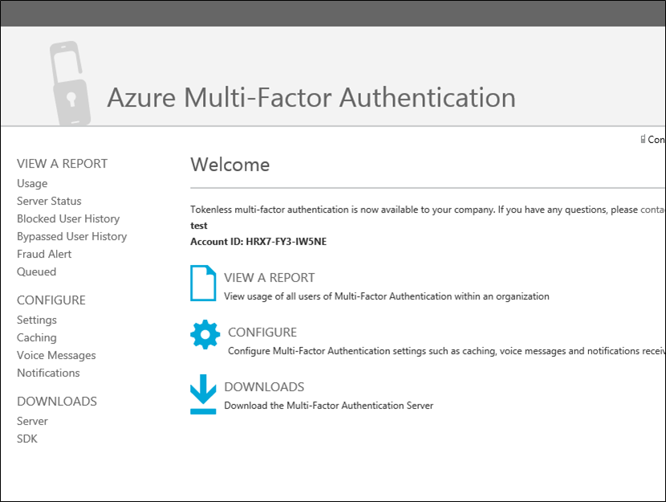

<properties 
    pageTitle="Erste Schritte mit dem Azure mehrstufige Authentifizierungsserver"
    description="Dies ist die Seite, die beschreibt, wie Sie erste Schritte mit Azure MFA Server mehrstufige Azure-Authentifizierung."
    services="multi-factor-authentication"
    keywords="Authentifizierung, Azure Multi Faktor Authentifizierung app Aktivierungsseite Server Authentifizierung Server herunterladen"
    documentationCenter=""
    authors="kgremban"
    manager="femila"
    editor="curtand"/>

<tags
    ms.service="multi-factor-authentication"
    ms.workload="identity"
    ms.tgt_pltfrm="na"
    ms.devlang="na"
    ms.topic="get-started-article"
    ms.date="08/15/2016"
    ms.author="kgremban"/>

# Erste Schritte mit dem Azure mehrstufige Authentifizierungsserver

Jetzt, da wir, ob mit kombinierte Authentifizierung lokalen ermittelt haben, erhalten Sie uns übergeht. Auf dieser Seite wird eine neue Installation des Servers und die erste sie Setup mit lokalen Active Directory behandelt. Wenn Sie bereits im PhoneFactor Server installiert haben und zu aktualisieren, finden Sie unter [Aktualisieren auf dem Azure mehrstufige Server](multi-factor-authentication-get-started-server-upgrade.md) gefunden werden oder wenn Sie weitere Informationen zum Installieren gefunden werden nur der Webdienst finden Sie unter [Bereitstellen Azure mehrstufige Authentifizierung Server Mobile App-Webdienst](multi-factor-authentication-get-started-server-webservice.md).

## Herunterladen des Servers Azure kombinierte Authentifizierung

Es gibt zwei verschiedene Arten, dass Sie die Azure mehrstufige Authentifizierungsserver herunterladen können. Beide sind über das Azure-Portal fertig. Die erste ist durch die kombinierte Authentifizierung Anbieter direkt verwalten. Die zweite ist über die diensteinstellungen. Die zweite Option ist entweder eine kombinierte Authentifizierung Anbieter oder eine Azure MFA, Azure AD Premium oder Enterprise Mobilität Suite-Lizenz erforderlich.

### Herunterladen den Server Azure kombinierte Authentifizierung vom Azure-portal
--------------------------------------------------------------------------------

1. Melden Sie sich als Administrator Azure-Portal.
2. Wählen Sie auf der linken Seite aus Active Directory.
3. Klicken Sie auf der Seite Active Directory oben **Mehrstufige Authentifizierung Anbieter**
4. Klicken Sie unten auf **Verwalten**
5. Dadurch wird eine neue Seite geöffnet.  Klicken Sie auf **Downloads.** 
 
6. Über die **Aktivierung Anmeldeinformationen generieren**, klicken Sie auf **herunterladen.** 
 
7. Speichern Sie den Download.

### Herunterladen der Azure mehrstufige Authentifizierungsserver über die diensteinstellungen

1. Melden Sie sich als Administrator Azure-Portal.
2. Wählen Sie auf der linken Seite aus Active Directory.
3. Doppelklick auf Ihre Azure AD-Instanz.
4. Klicken Sie oben auf **Konfigurieren**

5. Wählen Sie unter kombinierte Authentifizierung **diensteinstellungen verwalten**
6. Klicken Sie auf der Einstellungsseite Services am unteren Rand des Bildschirms auf **auf das Portal wechseln**.

7. Dadurch wird eine neue Seite geöffnet. Klicken Sie auf **Downloads.**
8. Über die **Aktivierung Anmeldeinformationen generieren**, klicken Sie auf **herunterladen.**
9. Speichern Sie den Download.

## Installieren und Konfigurieren des Servers Azure kombinierte Authentifizierung
Jetzt, da Sie den Server heruntergeladen haben, den können Sie installieren und konfigurieren Sie ihn.  Achten Sie darauf, dass der Server, dem Sie auf installieren die folgenden Anforderungen erfüllt sind:

Serveranforderungen Azure kombinierte Authentifizierung|Beschreibung|
:------------- | :------------- |
Hardware|<li>200 MB freier Festplattenspeicher</li><li>X32 oder X64 in Prozessor</li><li>1 GB oder größer RAM</li>
Software|<li>WindowsServer 2008 oder höher ist der Host einen Server OS</li><li>Windows 7 oder höher ist der Host einem Client-Betriebssystem</li><li>Microsoft .NET 4.0 Framework</li><li>IIS 7.0 oder höher, wenn den Benutzer-Portal oder Web-Dienst installieren SDK</li>

### Azure mehrstufige Authentifizierungsserver Firewall-Anforderungen
--------------------------------------------------------------------------------
Jede MFA-Server muss Port 443 der folgende ausgehende kommunizieren können:

- https://Pfd.phonefactor.NET
- https://pfd2.phonefactor.NET
- https://CSS.phonefactor.NET

Wenn ausgehende Firewalls für Port 443 eingeschränkt sind, müssen die folgenden IP-Adressbereiche geöffnet werden:

IP-Subnetz|Netzmaske|IP-Bereich
:------------- | :------------- | :------------- |
134.170.116.0/25|255.255.255.128|134.170.116.1 – 134.170.116.126
134.170.165.0/25|255.255.255.128|134.170.165.1 – 134.170.165.126
70.37.154.128/25|255.255.255.128|70.37.154.129 – 70.37.154.254

Wenn Sie nicht Azure mehrstufige Authentifizierung Ereignis Bestätigungs-Funktionen verwenden und nicht Benutzer sind können authentifizieren mit der kombinierte Authentifizierung mobile-apps von Geräten auf dem Firmennetzwerk die IP-Adresse Bereiche der folgende reduziert werden:

IP-Subnetz|Netzmaske|IP-Bereich
:------------- | :------------- | :------------- |
134.170.116.72/29|255.255.255.248|134.170.116.72 – 134.170.116.79
134.170.165.72/29|255.255.255.248|134.170.165.72 – 134.170.165.79
70.37.154.200/29|255.255.255.248|70.37.154.201 – 70.37.154.206

### Installieren und Konfigurieren des Servers Azure kombinierte Authentifizierung
--------------------------------------------------------------------------------

1. Doppelklicken Sie auf die ausführbare Datei. Dadurch wird die Installation zu starten.
2. Klicken Sie auf dem Bildschirm Installationsordner auswählen stellen Sie sicher, dass der Ordner korrekt ist, und klicken Sie auf Weiter.
3. Sobald die Installation abgeschlossen ist, klicken Sie auf Fertig stellen.  Der Konfigurations-Assistent wird gestartet.
4. Klicken Sie im Konfigurationsassistenten Willkommen Sie Bildschirm, aktivieren Sie **Überspringen mithilfe des Assistenten Authentifizierung** dieses Kontrollkästchen, und klicken Sie auf **Weiter**.  Dies wird den Assistenten zu schließen, und starten Sie den Server.
    
5. Klicken Sie auf der Seite, der wir auf den Server aus heruntergeladen haben, klicken Sie auf die Schaltfläche **Generieren Aktivierung Anmeldeinformationen** .  Kopieren Sie diese Informationen in den Azure MFA Server in die Textfelder, und klicken Sie auf **Aktivieren**.

Die oben beschriebenen Schritte Anzeigen einer express-Setup mit dem Assistenten  Sie können den Authentifizierung-Assistenten erneut ausführen, indem Sie im Menü Extras auf dem Server auswählen.

##Importieren von Benutzern aus Active Directory

Jetzt, da der Server installiert und konfiguriert ist, können Sie schnell Benutzer in der Azure MFA-Server importieren.

### So importieren Sie Benutzer aus Active Directory
--------------------------------------------------------------------------------

1. Wählen Sie in der Azure MFA-Server, klicken Sie auf der linken Seite **Benutzer**aus.
2. Wählen Sie unten **aus Active Directory importieren**.
3. Jetzt können entweder für einzelne Benutzer suchen oder AD Verzeichnis für Organisationseinheiten für Benutzer in diese suchen.  In diesem Fall werden wir die Benutzer Organisationseinheit angeben.
4. Markieren Sie alle Benutzer auf der rechten Seite, und klicken Sie auf **Importieren**.  Erhalten Sie ein Popupfenster angezeigt, dass Sie erfolgreich waren.  Schließen Sie das Fenster importieren.

## Senden Sie den Benutzern eine e-Mail-Nachricht
Jetzt, da Sie die Benutzer in der Azure kombinierte Authentifizierung Server importiert haben, wird empfohlen, dass die Benutzer eine e-Mail zu senden, die sie darüber informiert, dass sie in die kombinierte Authentifizierung registriert wurden.

Es gibt verschiedene Methoden, mit Ihrer Benutzer für die Verwendung von kombinierte Authentifizierung konfigurieren, mit dem Azure mehrstufige Authentifizierungsserver.  Beispielsweise, wenn Sie der Benutzer Telefonnummern wissen oder wurden die Telefonnummern in den Azure mehrstufige Authentifizierungsserver aus dem Verzeichnis des Unternehmens zu importieren, wird die e-Mail zulassen, dass Benutzer wissen, dass er konfiguriert wurden, um Azure kombinierte Authentifizierung verwenden, bieten einige Anweisungen zur Verwendung von Azure mehrstufige Authentifizierung, und weisen Sie den Benutzer, der die Telefonnummer, die, der Sie auf deren Authentifizierung gewährt werden soll.  

Der Inhalt der e-Mail variieren je nach der Methode der Authentifizierung, die für den Benutzer (z. B. Telefonanruf, SMS, mobile-app) festgelegt wurde.  Beispielsweise, wenn der Benutzer eine PIN verwenden, wenn sie sich authentifizieren erforderlich ist, wird die e-Mail sie feststellen, was seine ursprüngliche PIN so eingerichtet wurde.  Benutzer sind in der Regel so ändern Sie ihre PIN während ihre erste Authentifizierung erforderlich.

Wenn Benutzer Telefonnummern nicht konfiguriert oder in der Azure mehrstufige Authentifizierungsserver importiert oder Benutzer sind vorkonfiguriert mobile-app für Authentifizierung verwendet werden soll, können Sie eine e-Mail-Nachricht senden, in dem sie wissen, dass sie um Azure mehrstufige Authentifizierung verwenden konfiguriert wurden und es sie anweisen wird, deren Registrierung Konto über das Azure mehrstufige Authentifizierung Benutzerportal durchführen können.  Ein Link werden, dass der Benutzer auf klickt, den Zugriff auf das Portal Benutzer einbezogen. Wenn der Benutzer auf den Link klickt, wird im Webbrowser öffnen und ihres Unternehmens Azure mehrstufige Authentifizierung User Portal nutzen können.   

### Konfigurieren von e-Mail- und e-Mail-Vorlagen

Durch Klicken auf das Symbol e-Mail auf der linken Seite können Sie die Einstellungen für diese e-Mails senden einrichten.  Dies ist, können Sie die SMTP-Informationen von Ihrem e-Mail-Server eingeben und die Möglichkeit bietet, eine e-Mail Rahmen breit, indem Sie senden ein Häkchen hinzufügen auf das Kontrollkästchen Benutzer versendet per e-Mail zu senden.

Klicken Sie auf der Registerkarte e-Mail-Inhalte wird alle verschiedene e-Mail-Vorlagen angezeigt, die zur Auswahl verfügbar sind.  Je nachdem, wie Sie Ihre Benutzer verwenden kombinierte Authentifizierung konfiguriert haben, Sie die Vorlage auswählen können ist, die am besten für Sie geeignet.

## Wie dem Azure mehrstufige Authentifizierungsserver Benutzerdaten verarbeitet

Wenn Sie die kombinierte Authentifizierung (MFA) Server lokal verwenden, werden in der lokalen Servern Daten eines Benutzers gespeichert. Keine beständigen Benutzerdaten in der Cloud gespeichert. Wenn der Benutzer eine Authentifizierung mit zwei Faktoren ausführt, sendet der MFA-Server Daten zum Azure MFA Cloud-Dienst, die Authentifizierung durchzuführen. Wenn diese Authentifizierungsanfragen an Cloud-Dienst gesendet werden, werden die folgenden Felder in der Anfrage und Protokolle gesendet, damit sie in der vom Kunden Authentifizierung/Verwendungsberichte verfügbar sind. Einige Felder sind optional, sodass aktiviert oder innerhalb des mehrstufige Authentifizierungsservers deaktiviert werden können. Die Kommunikation vom Server MFA zum MFA Cloud-Dienst verwendet SSL/TLS über Port 443 ausgehenden. Diese Felder sind:

- Eindeutige ID – entweder Benutzernamen oder interne MFA Server-ID
- Erste und Nachname - optional
- E-Mail-Adresse: optional
- Telefonnummer - beim Ausführen einer VoIP-Anruf oder SMS-Authentifizierung
- Gerät Token - beim Ausführen der mobilen app-Authentifizierung
- Authentifizierungsmodus
- Ergebnis der Authentifizierung
- MFA-Servernamens
- MFA Server IP
- Client IP – sofern verfügbar

Zusätzlich zu den oben genannten Feldern ist die Authentifizierungsergebnis (Erfolg/Ablehnung) und dem Grund für alle verweigerte auch mit den Authentifizierungsdaten gespeicherten und über die Authentifizierung/Verwendungsberichte verfügbar.

## Erweiterte Konfigurationen Azure kombinierte Authentifizierung
Verwenden Sie für Weitere Informationen zum erweiterten Setup und Konfigurationsinformationen in der folgenden Tabelle aus.

Methode|Beschreibung
:------------- | :------------- |
[Benutzerportal](multi-factor-authentication-get-started-portal.md)|  Informationen zum Einrichten und Konfigurieren des Benutzers Portals einschließlich Bereitstellung auch Self-service-Benutzer.
[Active Directory Federation Service](multi-factor-authentication-get-started-adfs.md)|Informationen zum Einrichten von Azure kombinierte Authentifizierung mit AD FS.
[RADIUS-Authentifizierung](multi-factor-authentication-get-started-server-radius.md)|  Informationen zum Einrichten und Konfigurieren des Azure MFA-Servers mit RADIUS.
[IIS-Authentifizierung](multi-factor-authentication-get-started-server-iis.md)|Informationen zum Einrichten und Konfigurieren des Azure MFA-Servers mit IIS.
[Windows-Authentifizierung](multi-factor-authentication-get-started-server-windows.md)|  Informationen zum Einrichten und Konfigurieren des Azure MFA-Servers mit Windows-Authentifizierung.
[LDAP-Authentifizierung](multi-factor-authentication-get-started-server-ldap.md)|Informationen zum Einrichten und Konfigurieren des Azure MFA-Servers mit LDAP-Authentifizierung.
[Remote Desktop Gateway und Azure mehrstufige Authentifizierung-Server mit RADIUS](multi-factor-authentication-get-started-server-rdg.md)|  Informationen zum Einrichten und Konfigurieren des Azure MFA-Servers mit Remote Desktop Gateway RADIUS verwenden.
[Synchronisieren mit Windows Server Active Directory](multi-factor-authentication-get-started-server-dirint.md)|Informationen zum Einrichten und Konfigurieren von Synchronisierung zwischen Active Directory und den Azure MFA-Server.
[Bereitstellen von den Azure kombinierte Authentifizierung Server Mobile-App-Web-Dienst](multi-factor-authentication-get-started-server-webservice.md)|Informationen zum Einrichten und Konfigurieren von den Azure MFA Server-Webdienst.
