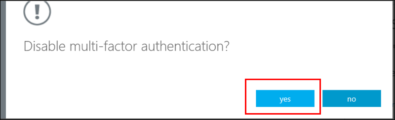

<properties 
    pageTitle="Microsoft Azure mehrstufige Authentifizierung Benutzer Staaten"
    description="Lernen Sie Benutzer Staaten in Azure MFA aus."
    services="multi-factor-authentication"
    documentationCenter=""
    authors="kgremban"
    manager="femila"
    editor="curtand"/>

<tags
    ms.service="multi-factor-authentication"
    ms.workload="identity"
    ms.tgt_pltfrm="na"
    ms.devlang="na"
    ms.topic="article"
    ms.date="08/04/2016"
    ms.author="kgremban"/>

# Benutzer Staaten in Azure kombinierte Authentifizierung

Benutzerkonten in Azure kombinierte Authentifizierung stehen die folgenden drei unterschiedliche Zustände:

Bundesstaat | Beschreibung |Betroffene ohne Browser-apps| Notizen
:-------------: | :-------------: |:-------------: |:-------------: |
Deaktiviert | Der Standardzustand für einen neuen Benutzer nicht registriert in kombinierte Authentifizierung.|Nein|Mehrstufige Authentifizierung verwendet des Benutzers nicht.
Aktiviert |Der Benutzer verfügt über kombinierte Authentifizierung registriert wurde.|Nein.  Sie weiterhin funktionsfähig, wenn die Registrierung abgeschlossen ist.|Der Benutzer ist aktiviert, jedoch die Registrierung zu noch nicht abgeschlossen. Sie werden aufgefordert, bis zum Abschluss der am nächsten Anmelden.
Erzwungen|Der Benutzer hat registriert wurde und die Registrierung zu für die Verwendung von kombinierte Authentifizierung abgeschlossen wurde.|Ja.  Apps sind app Kennwörter erforderlich. | Der Benutzer kann oder möglicherweise nicht Registrierung abgeschlossen haben. Wenn sie die Registrierung abgeschlossen haben, werden diese kombinierte Authentifizierung verwenden. Andernfalls wird der Benutzer aufgefordert werden, bis zum Abschluss der am nächsten Anmelden.

## Ändern der Status eines Benutzers
Ein Benutzer ändert sich, je nachdem, unabhängig davon, ob sie Setup für MFA wurde, und gibt an, ob der Benutzer den Vorgang abgeschlossen hat.  Wenn Sie MFA für einen Benutzer aktivieren, deaktiviert die Benutzer aus, die von Bundesstaat geändert wird aktiviert.  Sobald der Benutzer, deren Status zu aktiviert geändert wurde, anmeldet und schließt den Prozess ab, ändert deren Status sich in erzwungenen.  

### Anzeigen des Status eines Benutzers
--------------------------------------------------------------------------------
1.  Melden Sie sich bei der **Azure klassischen Portal** als Administrator.
2.  Klicken Sie auf der linken Seite auf **Active Directory**.
3.  Klicken Sie unter **Verzeichnis** klicken Sie auf das Verzeichnis für den Benutzer, die Sie aktivieren möchten.

4.  Klicken Sie oben auf **Benutzer**.
5.  Klicken Sie am unteren Rand der Seite auf **Mehrstufige Authentifizierung verwalten**.

6.  Dadurch wird eine neue Browserregisterkarte geöffnet.  Sie werden können den Status der Benutzer anzeigen.

###Zum Ändern des Status von deaktiviert auf aktiviert
1.  Melden Sie sich bei der **Azure klassischen Portal** als Administrator.
2.  Klicken Sie auf der linken Seite auf **Active Directory**.
3.  Klicken Sie unter **Verzeichnis** klicken Sie auf das Verzeichnis für den Benutzer, die Sie aktivieren möchten.

4.  Klicken Sie oben auf **Benutzer**.
5.  Klicken Sie am unteren Rand der Seite auf **Mehrstufige Authentifizierung verwalten**.

6.  Dadurch wird eine neue Browserregisterkarte geöffnet.  Suchen Sie den Benutzer, den Sie für die kombinierte Authentifizierung aktivieren möchten. Möglicherweise müssen zum Ändern der Anzeige oben. Stellen Sie sicher, dass der Status lautet **deaktiviert.** 
 
7.  Platzieren Sie einen **Aktivieren Sie** in das Feld neben dem jeweiligen Namen ein.
7.  Klicken Sie auf der rechten Seite auf **Aktivieren**.

8.  Klicken Sie auf die **kombinierte Authentifizierung aktivieren**.

9.  Beachten Sie, dass den Status des Benutzers aus **deaktiviert** **aktiviert**geändert wurde.

10.  Nachdem Sie Ihre Benutzer aktiviert haben, empfiehlt es sich, dass sie per e-Mail benachrichtigt.  Sie sollten auch diese informieren wie ihre apps nicht-Browser zur Vermeidung er gesperrt wird verwendet werden kann.

### Ändern Sie den Status von aktiviert/erzwungen deaktiviert
1.  Melden Sie sich bei der **Azure klassischen Portal** als Administrator.
2.  Klicken Sie auf der linken Seite auf **Active Directory**.
3.  Klicken Sie unter **Verzeichnis** klicken Sie auf das Verzeichnis für den Benutzer, die Sie aktivieren möchten.

4.  Klicken Sie oben auf **Benutzer**.
5.  Klicken Sie am unteren Rand der Seite auf **Mehrstufige Authentifizierung verwalten**.

6.  Dadurch wird eine neue Browserregisterkarte geöffnet.  Suchen Sie den Benutzer, den Sie deaktivieren möchten. Möglicherweise müssen zum Ändern der Anzeige oben. Stellen Sie sicher, dass der Status entweder **aktiviert ist** oder **erzwungen.**
7.  Platzieren Sie einen **Aktivieren Sie** in das Feld neben dem jeweiligen Namen ein.
7.  Klicken Sie auf der rechten Seite auf **Deaktivieren**.

8.  Sie werden aufgefordert, dies zu bestätigen.  Klicken Sie auf **Ja**.

9.  Klicken Sie dann sollte angezeigt werden, dass diese erfolgreich war.  Klicken Sie auf **Schließen.** 
 
