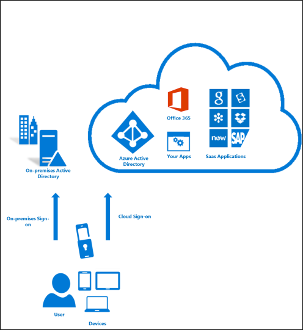

<properties 
    pageTitle="Azure kombinierte Authentifizierung – Funktionsweise"
    description="Mehrstufige Authentifizierung hilft Schutz Zugriff auf Daten und Applikationen während der Besprechung Benutzer bei Bedarf für ein einfacher Vorgang Anmeldung Azure. Es bietet zusätzliche Sicherheit durch eine zweite Form der Authentifizierung anfordern und strenge Authentifizierung über eine Reihe von Überprüfungsoptionen für einfache übermittelt."
    services="multi-factor-authentication"
    documentationCenter=""
    authors="kgremban"
    manager="femila"
    editor="curtland"/>

<tags
    ms.service="multi-factor-authentication"
    ms.workload="identity"
    ms.tgt_pltfrm="na"
    ms.devlang="na"
    ms.topic="article"
    ms.date="08/04/2016"
    ms.author="kgremban"/>

#Funktionsweise von Azure kombinierte Authentifizierung

Die Sicherheit kombinierte Authentifizierung liegt in deren Ebenen. Mehrere Authentifizierungsfaktoren beeinträchtigen stellt eine signifikante Herausforderung Angreifern. Auch wenn ein Angreifer verwaltet werden, wenn Sie das Kennwort des Benutzers wissen, ist es ohne auch Besitz des vertrauenswürdigen Geräts nicht verwendbar. Der Benutzer das Gerät vergessen haben, kann die Person, die es findet nicht mehr zur gemeinsamen Nutzung, es sei denn, er oder sie auch das Kennwort des Benutzers bekannt ist.

Mehrstufige Authentifizierung hilft Schutz Zugriff auf Daten und Applikationen während der Besprechung Benutzer bei Bedarf für ein einfacher Vorgang Anmeldung Azure.  Es bietet zusätzliche Sicherheit durch eine zweite Form der Authentifizierung anfordern und stellt die strenge Authentifizierung über eine Reihe von Überprüfungsoptionen für einfache:

- Anruf
- Textnachricht
- Benachrichtigung für Mobile-app – sofern gewünscht zulassen, dass Benutzer die Methode auswählen
- Mobile-app Überprüfungscode
- 3rd Party Angehörigen Token

Zusätzliche Informationen gut wie es funktioniert finden Sie im folgende Video.

>[AZURE.VIDEO multi-factor-authentication-deep-dive-securing-access-on-premises]

##Verfügbaren Methoden für die kombinierte Authentifizierung
Wenn sich der Benutzer anmeldet, wird eine zusätzliche Prüfung durch den Benutzer gesendet.  Es folgen eine Liste der Methoden, die für diese zweite Überprüfung verwendet werden können.

Überprüfungsmethode  | Beschreibung
------------- | ------------- |
Anruf | Ein Anruf wird an eines Benutzers Smartphone bitten, stellen Sie sicher, dass sie durch Drücken von das Zeichen # Anmeldung sind platziert.  Dadurch wird die Überprüfung abzuschließen.  Diese Option ist konfigurierbare und geändert werden kann, um einen Code, den Sie angeben.
Textnachricht | Textnachricht werden an eines Benutzers Smartphone mit einer Ziffer 6 Code gesendet.  Geben Sie diesen Code in bis zum Abschluss der Überprüfung aus.
Benachrichtigung für Mobile-App | Anforderung einer Überprüfung werden an eines Benutzers Smartphone fragt sie abgeschlossen, indem Sie in der mobilen app überprüfen auswählen die Überprüfung gesendet. Dies ist der Fall bei Auswahl von app-Benachrichtigung als Ihre primäre Überprüfungsmethode.  Wenn sie dies erhalten, wenn sie keine Anmeldung sind, können sie es als Betrug melden.
Überprüfungscode mit Mobile-App | Ein Überprüfungscode wird bei der mobilen app gesendet werden, die auf dem Smartphone eines Benutzers ausgeführt wird.  Dies wird auftreten, wenn Sie einen Überprüfungscode als Ihre primäre Überprüfungsmethode ausgewählt haben.

##Verfügbarer Versionen Azure kombinierte Authentifizierung
Azure kombinierte Authentifizierung ist in drei unterschiedliche Versionen zur Verfügung.  In der folgenden Tabelle werden die einzelnen näher beschrieben.

Version  | Beschreibung
------------- | ------------- |
Mehrstufige Authentifizierung für Office 365 | Diese Version funktioniert ausschließlich mit Office 365-Anwendungen und vom Office 365-Portal verwaltet wird. Administratoren können also jetzt Sichern ihrer Office 365-Ressourcen mithilfe von kombinierte Authentifizierung unterstützt.  Diese Version im Lieferumfang von Office 365-Abonnement.
Mehrstufige Authentifizierung für Azure-Administratoren | Die gleiche Teilmenge der Funktionen, die kombinierte Authentifizierung für Office 365 werden alle Azure Administratoren kostenlos verfügbar. Jeder Administratorkonto Azure-Abonnements kann jetzt zusätzlichen Schutz erhalten, durch das Aktivieren dieser kombinierte Authentifizierung Kernfunktionalität. Damit ein Administrator, der zum Erstellen eines virtuellen Computers, einer Website Azure-Portal zugreifen möchte verwalten Speicher kann mobile Dienste oder einen anderen Azure-Dienst kombinierte Authentifizierung seinem Administratorkonto hinzufügen.
Azure kombinierte Authentifizierung | Azure kombinierte Authentifizierung bietet den meisten Satz von Funktionen.   Es bietet zusätzliche Konfigurationsoptionen über die Azure-Verwaltungsportal, erweiterte reporting und Unterstützung für einen Zellbereich lokal und cloud Applications. Azure kombinierte Authentifizierung kann als eigenständige Lizenz erworben werden und ist in Azure Active Directory Premium und Enterprise Mobilität Suite zusammen.   Auch kann auf Basis Verbrauch erworben werden, durch Erstellen eines Azure-Dienstanbieters mehrstufige Authentifizierung in einem Azure-Abonnement.
##Vergleich der Features von Versionen
Unten in der folgenden Tabelle enthält eine Liste der Features, die in den verschiedenen Versionen von Azure kombinierte Authentifizierung verfügbar sind.

Feature  | Mehrstufige Authentifizierung für Office 365 (enthalten in Office 365-SKUs)|Mehrstufige Authentifizierung für Azure-Administratoren (mit Azure-Abonnement enthalten) | Azure kombinierte Authentifizierung (in Azure AD Premium und Enterprise Mobilität Suite enthalten)
------------- | :-------------: |:-------------: |:-------------: |
Administratoren können Konten mit MFA schützen.| * | * (Nur für Azure Administrator Konten verfügbar)|*
Mobile-app als ein zweites Argument|* | * | *
Anruf als ein zweites Argument|* | * | *
SMS als ein zweites Argument|* | * | *
App Kennwörter für Clients, die nicht MFA unterstützen|* | * | *
Administrator Kontrolle über Authentifizierungsmethoden| *| *| *
PIN-Modus| | | *
Betrug Benachrichtigung| | | *
MFA-Berichte| | | *
Einmalige umgehen| | | *
Benutzerdefinierte Grüße für Telefonanrufe| | | *
Anpassung der Anrufer-ID für Telefonanrufe| | | *
Ereignis Bestätigung| | | *
Vertrauenswürdigen IP-Adressen| | | *
Aussetzen Sie MFA für gespeicherte Geräte (Public Preview)| | | *
MFA SDK| | | *
MFA für lokale Applikationen mit MFA-server| | | *

##So erhalten Sie Azure kombinierte Authentifizierung

Wenn Sie die vollständige Funktionalität von Azure kombinierte Authentifizierung statt nur diejenigen, die für Benutzer von Office 365 und Azure-Administratoren vorgesehen erhalten möchten, gibt es mehrere Optionen, wie Sie ein:

1.  Azure kombinierte Authentifizierung Lizenzen erwerben und Ihre Benutzer zuweisen.
2.  Erwerben von Lizenzen, die darin enthaltenen wie Azure Active Directory Premium oder Enterprise Mobilität Suite gebündelten Azure kombinierte-Authentifizierung aufweisen, und sie Ihre Benutzer zuzuweisen.
3.  Erstellen einer Azure mehrstufige Authentifizierungsanbieter innerhalb eines Azure-Abonnements. Wenn Sie bereits über ein Azure-Abonnement besitzen, können Sie für ein Azure Testabonnement anmelden. Testabonnements in normalen Abonnements vor Ablauf der Testversion konvertiert werden müssen.

Wenn Sie eine Azure mehrstufige Authentifizierungsanbieter verwenden, es gibt zwei Verwendung Modelle zur Verfügung, die über Ihre Azure-Abonnement in Rechnung gestellt werden:

- **Pro Benutzer**. In der Regel für Unternehmen, die kombinierte Authentifizierung für eine bestimmte Anzahl von Mitarbeitern aktivieren möchten, die regelmäßig Authentifizierung benötigen.
- **Pro Authentifizierung**. In der Regel für Unternehmen, die kombinierte Authentifizierung für eine große Gruppe von externen Benutzern aktivieren möchten, die selten Authentifizierung benötigen.

Preise Details finden Sie unter [Azure MFA Preise.](https://azure.microsoft.com/pricing/details/multi-factor-authentication/)

Wählen Sie die pro Arbeitsplatz oder Verbrauch basierendes Modell, die für Ihre Organisation am besten.   Klicken Sie dann auf die erste Schritte finden Sie unter [Erste Schritte](multi-factor-authentication-get-started.md)
