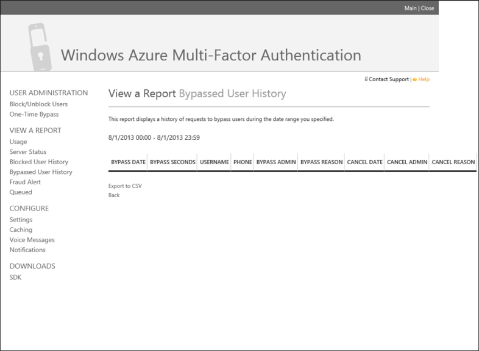

<properties
    pageTitle="Azure kombinierte Authentifizierung Berichte"
    description="Beschreibt, wie das Feature für die kombinierte Authentifizierung Azure - Berichte verwenden."
    services="multi-factor-authentication"
    documentationCenter=""
    authors="kgremban"
    manager="femila"
    editor="curtand"/>

<tags
    ms.service="multi-factor-authentication"
    ms.workload="identity"
    ms.tgt_pltfrm="na"
    ms.devlang="na"
    ms.topic="article"
    ms.date="08/04/2016"
    ms.author="kgremban"/>

# Berichte in Azure kombinierte Authentifizierung

Azure kombinierte Authentifizierung bietet verschiedene Berichte, die von Ihnen und Ihrer Organisation verwendet werden können. Durch die kombinierte Authentifizierung Verwaltungsportal, die erfordert, dass Sie eine Lizenz für Azure MFA Anbieter, oder eine Azure MFA, Azure AD Premium oder Enterprise Mobilität Suite verfügen, können diese Berichte zugegriffen werden. Im folgenden finden eine Liste der verfügbaren Berichte.

Sie können Berichte über das Azure Management-Portal zugreifen.

Namen| Beschreibung
:------------- | :------------- |
Verwendung | Die Verwendungsberichte auf Verwendung des, Zusammenfassung der Benutzer und Benutzerdetails Anzeigeinformationen.
Serverstatus|Dieser Bericht zeigt den Status der kombinierte Authentifizierungsserver mit Ihrem Konto verbunden sind.
Blockierte Benutzer Verlauf|Diese Berichte anzeigen des Verlaufs von Anfragen zu blockieren oder Zulassen von Benutzern.
Umgangene Benutzer Verlauf|Zeigt den Verlauf der Anfragen umgehen kombinierte Authentifizierung für die Telefonnummer des Benutzers an.
Betrug Benachrichtigung|Zeigt einen Verlauf der Betrug Benachrichtigungen gesendet werden, in dem Zeitraum, die, den Sie angegeben haben.
In der Warteschlange|Listen-Berichte in der Warteschlange für die Verarbeitung und deren Status. Nach Abschluss des Berichts, wird eine Verknüpfung zu herunterladen oder zum Anzeigen des Berichts bereitgestellt.

## Zum Anzeigen von Berichten

1.  Melden Sie sich bei http://azure.microsoft.com
2.  Wählen Sie auf der linken Seite aus Active Directory.
3.  Wählen Sie eine der folgenden Optionen aus:
    - **Option 1**: Klicken Sie auf der Registerkarte mehrstufige Authentifizierung Anbieter. Wählen Sie den MFA aus, und klicken Sie auf die Schaltfläche verwalten unten.
    - **Option 2**: Wählen Sie das Verzeichnis aus, und klicken Sie auf die Registerkarte konfigurieren. Wählen Sie unter dem Abschnitt kombinierte Authentifizierung diensteinstellungen verwalten aus. Klicken Sie am unteren Rand der Seite MFA-Dienst auf die im Portal Link.
4.  In der Azure mehrstufige Authentifizierung Verwaltungsportal wird der Ansicht einen Bereich eines Berichts im linken Navigationsbereich angezeigt. Hier können Sie die oben beschriebenen Berichte auswählen.

**Zusätzliche Ressourcen**

* [Für Benutzer](./end-user/multi-factor-authentication-end-user.md)
* [Azure kombinierte Authentifizierung auf MSDN](https://msdn.microsoft.com/library/azure/dn249471.aspx)
