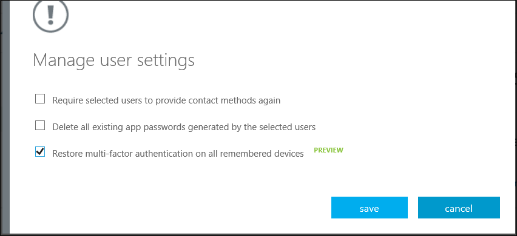

<properties 
    pageTitle="Azure kombinierte Authentifizierung Berichte"
    description="Beschreibt, wie benutzereinstellungen wie erzwingen, dass die Benutzer den Nachweis-Vorgangs erneut ausführen zu ändern."
    documentationCenter=""
    services="multi-factor-authentication"
    authors="kgremban"
    manager="femila"
    editor="curtand"/>

<tags
    ms.service="multi-factor-authentication"
    ms.workload="identity"
    ms.tgt_pltfrm="na"
    ms.devlang="na"
    ms.topic="article"
    ms.date="08/04/2016"
    ms.author="kgremban"/>

# Verwalten von benutzereinstellungen mit Azure kombinierte Authentifizierung in der cloud

Als Administrator können Sie die folgenden Einstellungen für Benutzer und Gerät verwalten.  

- [Festlegen, dass Benutzer ausgewählten Kontakte Methoden erneut bereitstellen](#require-selected-users-to-provide-contact-methods-again)
- [Löschen von Benutzern, die vorhandene Kennwörter app](#delete-users-existing-app-passwords)
- [Wiederherstellen von MFA auf alle angehaltenen Geräten für einen Benutzer](#restore-mfa-on-all-suspended-devices-for-a-user)

Dies ist hilfreich, wenn ein Computer oder Gerät verloren oder gestohlen oder Sie einem Benutzerzugriff zu entfernen müssen.

## Festlegen, dass Benutzer ausgewählten Kontakte Methoden erneut bereitstellen

Wird die folgende Einstellung erzwingt, dass den Benutzer die Registrierung zu erneut ausführen, wenn er sich anmeldet. Achten Sie darauf, dass nicht Browser apps weiterhin funktionsfähig ist, wenn der Benutzer für diese app Kennwörter verfügt.  Sie können die Benutzer app Kennwörter löschen, indem Sie auch **alle vorhandenen app Kennwörter, die auf die ausgewählten Benutzer löschen**.

### Wie Benutzer Kontakte Methoden erneut eingeben müssen

1. Anmelden Sie bei der klassischen Azure-Portal.
2. Klicken Sie auf der linken Seite auf Active Directory.
3. Klicken Sie unter Verzeichnis klicken Sie auf das Verzeichnis für den Benutzer, die Sie benötigen, um ihre Kontakte Methode erneut eingeben möchten.
4. Klicken Sie oben auf Benutzer.
5. Klicken Sie am unteren Rand der Seite auf die kombinierte Authentifizierung verwalten Dadurch wird die Seite kombinierte Authentifizierung geöffnet.
6. Suchen Sie den Benutzer, den Sie verwenden möchten, verwalten und setzen Sie ein Häkchen in das Feld neben dem Namen. Möglicherweise müssen zum Ändern der Anzeige oben.
7. Dadurch wird der Link **benutzereinstellungen verwalten** auf der rechten Seite angezeigt. Klicken Sie darauf.
8. Aktivieren Sie dieses Kontrollkästchen **festlegen, dass Benutzer ausgewählten Kontakte Methoden erneut bereit**.

10. Klicken Sie auf Speichern.
11. Klicken Sie auf Schließen

## Löschen von Benutzern, die vorhandene Kennwörter app

Dies löscht alle Kennwörter app, die ein Benutzer erstellt hat. Nicht-Browser-apps, die diese app Kennwörter zugeordnet wurden nicht mehr funktionieren, bis ein neues Kennwort für die app erstellt wird.

### So löschen Sie vorhandene Kennwörter app Benutzer

1. Anmelden Sie bei der klassischen Azure-Portal.
2. Klicken Sie auf der linken Seite auf Active Directory.
3. Klicken Sie unter Verzeichnis klicken Sie auf das Verzeichnis für den Benutzer, die app Kennwörter für löschen möchten.
4. Klicken Sie oben auf Benutzer.
5. Klicken Sie am unteren Rand der Seite auf die kombinierte Authentifizierung verwalten Dadurch wird die Seite kombinierte Authentifizierung geöffnet.
6. Suchen Sie den Benutzer, den Sie verwenden möchten, verwalten und setzen Sie ein Häkchen in das Feld neben dem Namen. Möglicherweise müssen zum Ändern der Anzeige oben.
7. Dadurch wird der Link **benutzereinstellungen verwalten** auf der rechten Seite angezeigt. Klicken Sie darauf.
8. Aktivieren Sie dieses Kontrollkästchen **, die auf die ausgewählten Benutzer werden alle vorhandenen app Kennwörter löschen**.

10. Klicken Sie auf Speichern.
10. Klicken Sie auf Schließen.

## Wiederherstellen von MFA auf alle gespeicherten Geräten für einen Benutzer

Administratoren haben die Möglichkeit, eine kombinierte Authentifizierung auf Benutzer Geräte sowie Browser wiederherstellen. Wenn diese Aufgabe ausführen, dies entfernt die MFA Speichern von allen des Benutzers Geräte und Browser, und der Benutzer muss MFA verwenden, wenn Sie in das nächste Mal bei der Anmeldung.

### So MFA auf alle angehaltenen Geräten für einen Benutzer wiederherstellen.

1. Anmelden Sie bei der klassischen Azure-Portal.
2. Klicken Sie auf der linken Seite auf Active Directory.
3. Klicken Sie unter Verzeichnis klicken Sie auf das Verzeichnis für den Benutzer, die Sie Mfa auf wiederherstellen möchten.
4. Klicken Sie oben auf Benutzer.
5. Klicken Sie am unteren Rand der Seite auf die kombinierte Authentifizierung verwalten Dadurch wird die Seite kombinierte Authentifizierung geöffnet.
6. Suchen Sie den Benutzer, den Sie verwenden möchten, verwalten und setzen Sie ein Häkchen in das Feld neben dem Namen. Möglicherweise müssen zum Ändern der Anzeige oben.
7. Dadurch wird der Link **benutzereinstellungen verwalten** auf der rechten Seite angezeigt. Klicken Sie darauf.
8. Aktivieren Sie dieses Kontrollkästchen **Wiederherstellen kombinierte Authentifizierung auf alle gespeicherten Geräten**

9. Klicken Sie auf Speichern.
10. Klicken Sie auf Schließen.
