<properties
    pageTitle="Microsoft Authenticator-app für Mobiltelefone | Microsoft Azure"
    description="Erfahren Sie, wie ein Upgrade auf die neueste Version von Azure-Authentifizierung."
    services="multi-factor-authentication"
    documentationCenter=""
    authors="kgremban"
    manager="femila"
    editor="curtland"/>

<tags
    ms.service="multi-factor-authentication"
    ms.workload="identity"
    ms.tgt_pltfrm="na"
    ms.devlang="na"
    ms.topic="article"
    ms.date="08/22/2016"
    ms.author="kgremban"/>

# Microsoft-Authentifizierung

Die app Microsoft Authenticator bietet eine zusätzliche Sicherheitsebene in Ihrem Azure-Konto (z. B. bsimon@contoso.onmicrosoft.com), Ihrer lokalen arbeiten Konto (z. B. bsimon@contoso.com), oder Ihrem Microsoft-Konto (z. B. bsimon@outlook.com).

Die app funktioniert in einem der beiden folgenden Arten:

- **Benachrichtigung**. Die app kann verhindert unbefugten Zugriff auf Konten und gefälschte Transaktionen beenden, indem Sie eine Benachrichtigung auf Ihrem Smartphone oder Tablet drücken unterstützen. Einfach zeigen Sie die Benachrichtigung an, und wenn es seriösen ist, wählen **Sie prüfen**. Andernfalls können Sie **Verweigern**auswählen. Informationen zu Benachrichtigungen verweigern finden Sie unter und mit dem verweigern Bericht Betrug Feature für die kombinierte Authentifizierung.

- **Kennwort mit Überprüfungscode**. Die app kann als Softwaretoken zum Generieren einer OAuth Überprüfung Codes verwendet werden. Sie geben Sie den Code, der von der app in den Bildschirm Anmeldung zusammen mit den Benutzernamen und das Kennwort, bereitgestellt wird, wenn Sie dazu aufgefordert werden. Der Überprüfungscode bietet eine zweite Form der Authentifizierung.

Mit der Version der app Microsoft Authenticator wird die alte Azure-Authentifizierung app ersetzt.  Die app Azure-Authentifizierung entwickelt fortgesetzt, aber wenn Sie mit der neuen Microsoft Authenticator verschieben möchten, in diesem Artikel kann Ihnen helfen.  

## Installieren der app

Die app Microsoft Authenticator steht für [Windows Phone](http://go.microsoft.com/fwlink/?Linkid=825071), [Android](http://go.microsoft.com/fwlink/?Linkid=825072)und [IOS](http://go.microsoft.com/fwlink/?Linkid=825073).

## Hinzufügen von Konten bei der app

Verwenden Sie für jedes Konto, das Sie bei der Microsoft Authenticator app hinzufügen möchten eine der folgenden Verfahren.

### Hinzufügen eines Kontos bei der app mit dem QR Code scanner

1. Wechseln Sie zum Bildschirm Einstellungen Überprüfung Sicherheit.  Informationen zu dieser Bildschirm zu gelangen finden Sie unter [Ändern der Sicherheitseinstellungen für](multi-factor-authentication-end-user-manage-settings.md).

2. Wählen Sie **Konfigurieren**.

    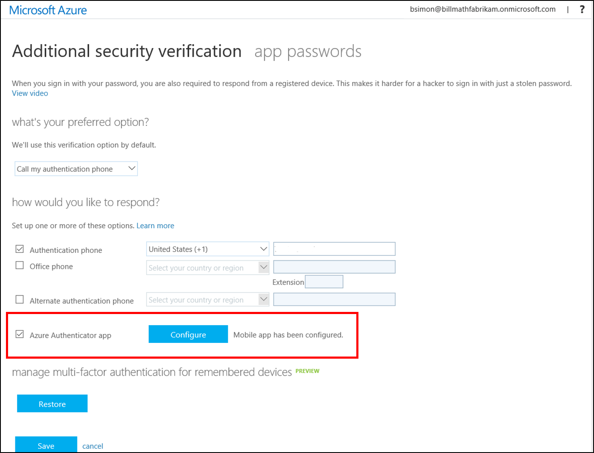

    Dadurch wird ein Bildschirm mit einer QR-Codes daran.

    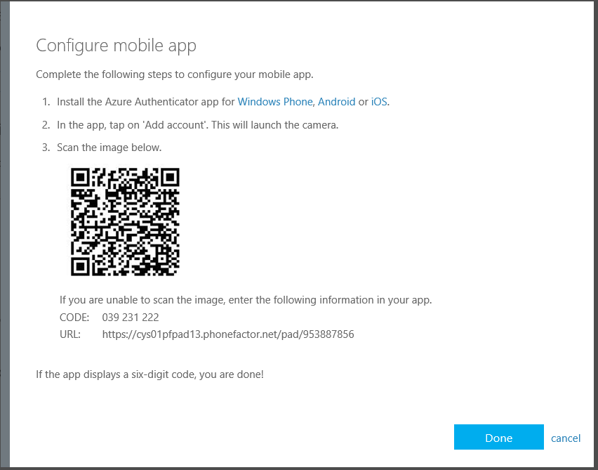

3. Öffnen Sie die Microsoft-Authentifizierung app. Wählen Sie auf dem Bildschirm **Konten** **+**, und klicken Sie dann angeben, dass Sie ein Konto geschäftlichen oder schulnotizbücher hinzufügen möchten.

    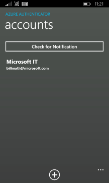

    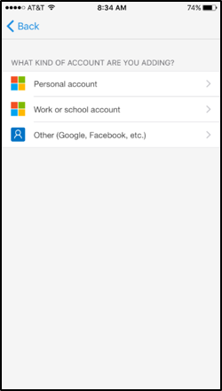

4. Verwenden Sie die Kamera Scannen des QR-Codes, und wählen Sie dann auf **Fertig** , um das QR-Code zu schließen.

    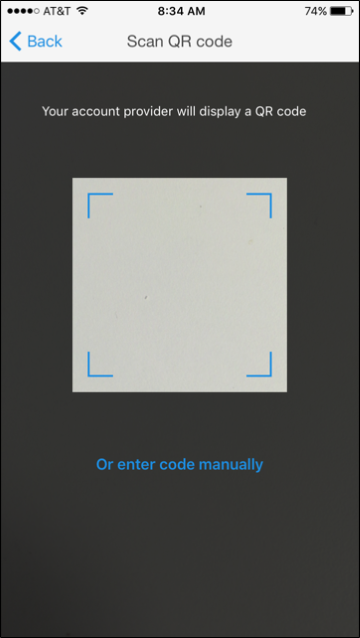

    Wenn die Kamera nicht ordnungsgemäß funktioniert, können Sie die QR-Codes sowie die URL manuell eingeben. Weitere Informationen finden Sie unter [ein Konto bei der app manuell hinzufügen](#add-an-account-to-the-app-manually).

5. Warten Sie, während das Konto aktiviert ist. Bei der Aktivierung abgeschlossen ist, wählen Sie **Kontakt mich**an.  Entweder eine Benachrichtigung oder einen Überprüfungscode an Ihr Mobiltelefon gesendet.  Wählen Sie auf **Überprüfen**.

    

6. Wenn Ihr Unternehmen eine PIN für die Anmeldung Überprüfung Genehmigung erforderlich ist, geben Sie es ein.

    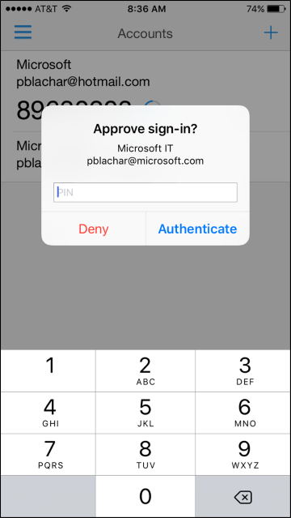

7. Wählen Sie nach Abschluss der PIN-Eintrag **Schließen**. An diesem Punkt sollte Ihre Überprüfung erfolgreich verlaufen.
8. Es empfiehlt sich, dass Sie Ihre Mobiltelefonnummer eingeben, für den Fall, dass Sie Zugriff auf Ihre app verlieren. Geben Sie Ihr Land aus der Dropdown-Liste aus, und geben Sie Ihre Mobiltelefonnummer in das Feld neben dem Landesnamen. Wählen Sie **Weiter**aus.
9. An diesem Punkt haben Ihre Kontakte eingerichtet werden. Nun ist es an der Zeit, die app Kennwörter für ohne Browser apps, wie z. B. Outlook 2010 oder älter einrichten. Wenn Sie diese apps nicht verwenden möchten, wählen Sie **Fertig**. Andernfalls fahren Sie mit dem nächsten Schritt fort.

    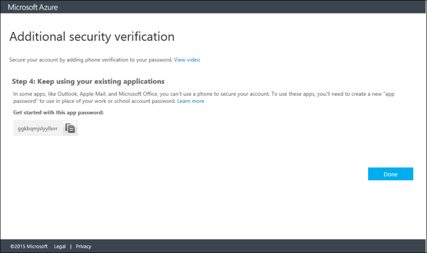

10. Wenn Sie apps nicht Browser verwenden, kopieren Sie das Kennwort bereitgestellten app, und fügen Sie das Kennwort in Ihrer apps. Schritte auf einzelne apps wie Outlook und Lync finden Sie zum Ändern des Kennworts in Ihrer e-Mail auf das app-Kennwort und das Kennwort in der Anwendung auf das app-Kennwort ändern.
11. Wählen Sie auf **Fertig**.

Das neue Konto sollte jetzt auf dem Bildschirm **Konten** angezeigt werden.

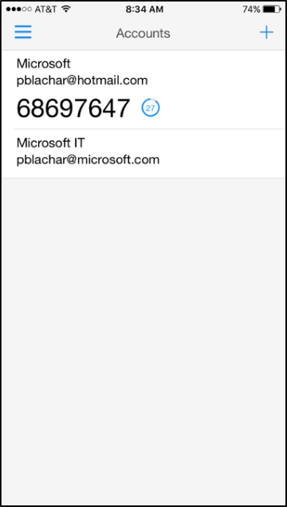

### Manuelles Hinzufügen eines Kontos bei der app

1. Wechseln Sie zum Bildschirm Einstellungen Überprüfung Sicherheit.  Informationen zu dieser Bildschirm zu gelangen finden Sie unter [Ändern der Sicherheitseinstellungen für](multi-factor-authentication-end-user-manage-settings.md).

2. Wählen Sie **Konfigurieren**.

    

    Dadurch wird ein Bildschirm mit einer QR-Codes daran.  Beachten Sie die Code sowie die URL ein.

    

3. Öffnen Sie die Microsoft-Authentifizierung app. Wählen Sie auf dem Bildschirm **Konten** **+**, und klicken Sie dann angeben, dass Sie ein Konto geschäftlichen oder schulnotizbücher hinzufügen möchten.

    

    

4. Wählen Sie in der Scanner **Code manuell eingeben**.

    

5. Geben Sie den Code und die URL in die entsprechenden Felder in der app ein.

    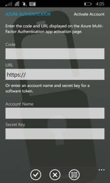

    

6. Warten Sie, während das Konto aktiviert ist. Wenn die Aktivierung abgeschlossen ist, wählen Sie **Kontakt mich**aus. Entweder eine Benachrichtigung oder einen Überprüfungscode an Ihr Mobiltelefon gesendet. Wählen Sie auf **Überprüfen**.

Das neue Konto sollte jetzt auf dem Bildschirm **Konten** angezeigt werden.

### Hinzufügen eines Kontos bei der app mit Touch-ID

Die app Microsoft Authenticator unter iOS unterstützt Touch-ID an.  Azure kombinierte Authentifizierung können Organisationen eine PIN für Geräte erforderlich. Mit Touch-ID müssen nicht iOS Benutzer eine PIN eingeben. Stattdessen können sie ihre Fingerabdruck scannen, und wählen **Genehmigen**.

Einrichten von Touch-ID mit Microsoft Authenticator ist einfach. Sie führen Sie eine normale Überprüfung Herausforderung mit einer PIN. Wenn Ihr Gerät tippen Sie auf ID unterstützt, wird Microsoft Authenticator es automatisch für dieses Konto einrichten.

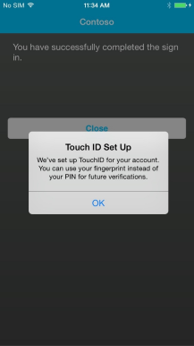

Aus, die auf Dokument ab hier, wenn Sie zur Überprüfung Ihrer Anmeldung erforderlich sind, wählen Sie aus der Pushbenachrichtigung von erhaltenen und Scannen Sie Ihren Fingerabdruck statt die PIN eingeben.

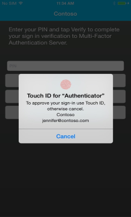

## Deinstallieren Sie die alte Authentifizierung Azure-app

Nachdem Sie alle Konten bei der neuen app hinzugefügt haben, können Sie von Ihrem Telefon aus die alte app deinstallieren.

## Löschen eines Kontos

Entfernen eines Kontos aus der app Microsoft Authenticator, wählen Sie das Konto aus, und wählen Sie dann auf **Löschen**.

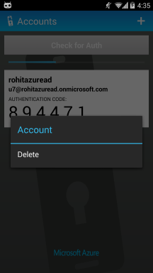
