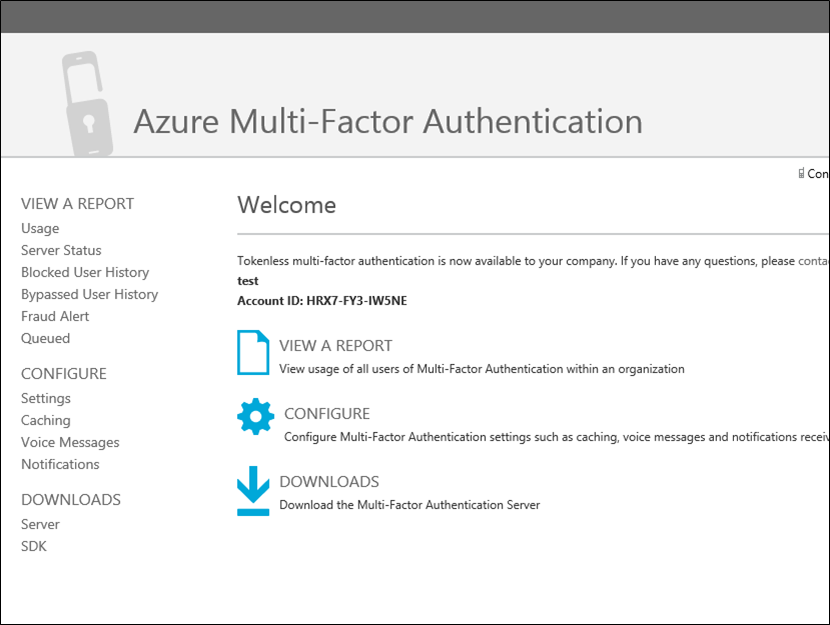
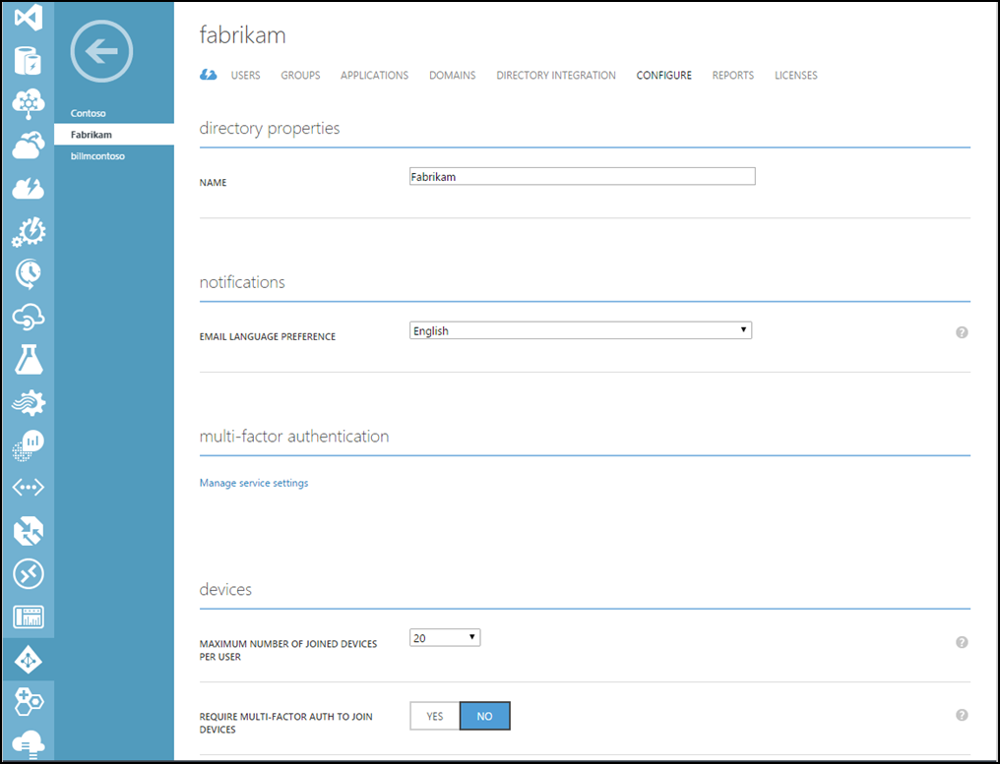
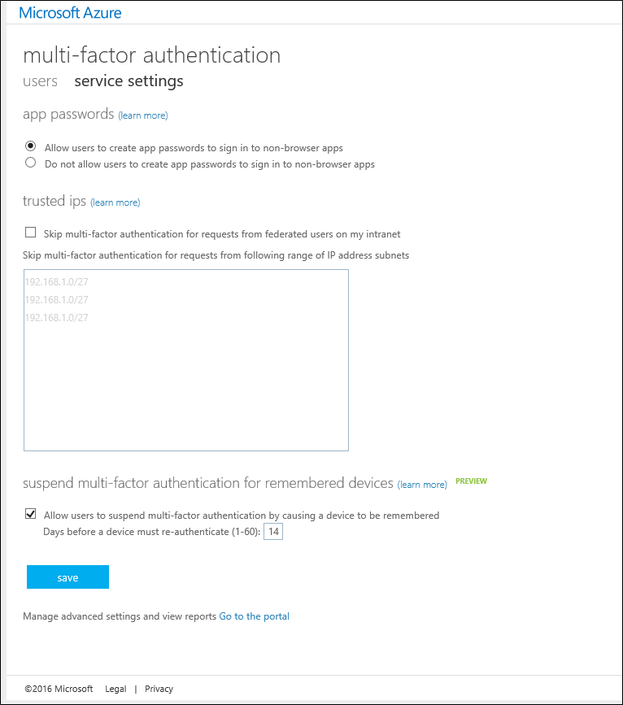

<properties 
    pageTitle="Integrieren von Ihrem lokalen Identitäten in Azure Active Directory aus."
    description="Dies ist Azure AD verbinden, die beschreibt, wie es ist und warum Sie es verwenden möchten."
    services="multi-factor-authentication"
    documentationCenter=""
    authors="kgremban"
    manager="femila"
    editor="curtand"/>

<tags
    ms.service="multi-factor-authentication"
    ms.workload="identity"
    ms.tgt_pltfrm="na"
    ms.devlang="na"
    ms.topic="article"
    ms.date="08/04/2016"
    ms.author="kgremban"/>

# Gebäude kombinierte Authentifizierung in benutzerdefinierte Apps (SDK)

> [AZURE.IMPORTANT]  Wenn Sie das SDK herunterladen möchten, müssen Sie eine Azure mehrstufige Authentifizierung Anbieter zu erstellen, auch wenn Sie Azure MFA, AAD Premium oder EMS Lizenzen haben.  Wenn Sie eine Azure mehrstufige Authentifizierung-Anbieter für diesen Zweck erstellen und bereits Lizenzen, ist es erforderlich, um den Anbieter mit dem Modell **Pro aktivierten Benutzer** erstellen und den Anbieter mit dem Verzeichnis, das die Lizenzen Azure MFA, Azure AD Premium oder EMS enthält, verknüpfen.  Dadurch wird sichergestellt, dass Sie nicht berechnet werden, es sei denn, Sie haben mehrere eindeutige Benutzer mit dem SDK als die Anzahl der Lizenzen an, die Sie besitzen.

Azure mehrstufige Authentifizierung Software Development Kit (SDK) können Sie Telefonanruf und Text Nachricht Überprüfung direkt in die Anmeldung oder Transaktion Prozesse in Ihrem Mandanten Azure AD-Anwendung zu erstellen.

Die kombinierte Authentifizierung SDK steht für c#, Visual Basic (.NET), Java, Perl, PHP und Ruby. Das SDK bietet einen einfachen Wrapper kombinierte Authentifizierung. Er enthält alles, was Sie zum Schreiben von Code, einschließlich kommentierte Quellcode-Dateien, Beispieldateien und eine detaillierte Infodatei benötigen. Jede SDK enthält auch ein Zertifikat und private Schlüssel für die Verschlüsselung der Transaktionen, die an Ihren Anbieter für mehrstufige Authentifizierung eindeutig ist. Solange Sie einen Anbieter haben, können Sie das SDK in viele Sprachen und Formate herunterladen, wie Sie benötigen.

Die Struktur der APIs im mehrstufige Authentifizierung SDK ist ganz einfach. Sie nehmen eine einzelne Funktion aufrufen, um eine API mit die Option mehrstufige Parameter, wie die Überprüfung Modus und Benutzerdaten, wie etwa die Telefonnummer anrufen oder die PIN-Nummer zu überprüfen. Die APIs übersetzen den Anruf Funktion in Web Serviceanfragen an den cloudbasierten Azure mehrstufige-Authentifizierungsdienst. Alle Anrufe müssen einen Verweis auf das private Zertifikat enthalten, die in jeder SDK enthalten ist.

Da die APIs keinen Zugriff für Benutzer in Azure Active Directory registriert haben, müssen Sie die Benutzerinformationen, wie z. B. Telefonnummern und PIN-Codes in einer Datei oder eine Datenbank bereitstellen. Darüber hinaus bieten die APIs keine Registrierung oder Benutzer Verwaltungsfunktionen, sodass Sie diese Prozesse in Ihrer Anwendung erstellen müssen.

## Die kombinierte Authentifizierung Azure SDK herunterladen

Herunterladen der Azure mehrstufige SDK erfordert eine [Azure mehrstufige Authentifizierung Anbieter](multi-factor-authentication-get-started-auth-provider.md).  Dies erfordert eine vollständige Azure-Abonnement, auch wenn Azure MFA, Azure AD Premium oder Enterprise Mobilität Suite Lizenzen gehören.  Wenn das SDK herunterladen möchten, müssen Sie zur Verwaltungsportal mehrstufige durch die Verwaltung von den mehrstufige Authentifizierung Anbieter direkt oder durch Klicken auf den Link **"Wechseln Sie zu dem Portal"** auf der Einstellungsseite der MFA-Dienst navigieren.

### Herunterladen der Azure mehrstufige Authentifizierung SDK vom Azure-portal

1. Melden Sie sich als Administrator Azure-Portal.
2. Wählen Sie auf der linken Seite aus Active Directory.
3. Klicken Sie auf der Seite Active Directory oben **Mehrstufige Authentifizierung Anbieter**
4. Klicken Sie unten auf **Verwalten**
5. Dadurch wird eine neue Seite geöffnet.  Klicken Sie auf der linken Seite, klicken Sie unten auf SDK.

6. Wählen Sie die Sprache, und klicken Sie auf eine der zugeordneten Downloadlinks.
7. Speichern Sie den Download.

### Herunterladen der Azure mehrstufige Authentifizierung SDK über die Service-Einstellungen

1. Melden Sie sich als Administrator Azure-Portal.
2. Wählen Sie auf der linken Seite aus Active Directory.
3. Doppelklick auf Ihre Azure AD-Instanz.
4. Klicken Sie oben auf **Konfigurieren**
5. Wählen Sie unter kombinierte Authentifizierung **Verwalten diensteinstellungen**

6. Klicken Sie auf der Einstellungsseite Services am unteren Rand des Bildschirms auf **auf das Portal wechseln**.

7. Dadurch wird eine neue Seite geöffnet.  Klicken Sie auf der linken Seite, klicken Sie unten auf SDK.
8. Wählen Sie die Sprache, und klicken Sie auf eine der zugeordneten Downloadlinks.
9. Speichern Sie den Download.

## Inhalt der Azure kombinierte Authentifizierung SDK
Innerhalb des SDK finden Sie die folgenden Elemente:

- **Infodatei zu**. Erläutert, wie Sie die kombinierte Authentifizierung APIs in einer neuen oder vorhandenen Anwendung verwenden.
- **Quelldatei** für kombinierte Authentifizierung
- **Client-Zertifikat** , das Sie verwenden, um die Kommunikation mit dem Dienst kombinierte Authentifizierung
- **Privaten Schlüssel** für das Zertifikat
- **Rufen Sie die Ergebnisse.** Eine Liste der Anruf Ergebniscodes. Wenn Sie diese Datei öffnen, verwenden Sie eine Anwendung mit Formatierung, wie z. B. WordPad Text ein. Verwenden Sie die Anruf Ergebnis-Codes zum Testen und Problembehandlung bei der Implementierung von kombinierte Authentifizierung in Ihrer Anwendung ein. Es werden keine Authentifizierung Statuscodes.
- **Beispiele für.** Beispiel-Code für eine grundlegende arbeiten Implementierung kombinierte Authentifizierung.

>[AZURE.WARNING]Das Client-Zertifikat ist ein eindeutiger private Zertifikat, das für Sie erstellt wurde. Freigeben Sie oder verlieren Sie diese Datei nicht. Es ist den Key, um sicherzustellen, dass die Sicherheit Ihrer Kommunikation mit dem Dienst kombinierte Authentifizierung.

## Beispiel: Standardmodus Verifizierung per Telefon

In diesem Codebeispiel wird gezeigt, wie die APIs im Azure mehrstufige Authentifizierung SDK mit Standardmodus VoIP-Anruf Überprüfung an Ihrer Anwendung hinzugefügt werden kann. Standard-Modus ist ein Telefonanruf, den der Benutzer auf reagiert, durch Drücken der Taste #.

In diesem Beispiel wird die c# .NET 2.0 mehrstufige Authentifizierung SDK in einer einfachen ASP.NET-Anwendung mit c# serverseitige Logik, aber der Prozess für einfache Implementierungen in anderen Sprachen sehr ähnlich ist. Da das SDK Quelldateien, nicht Programmdateien umfasst können die Dateien erstellen und darauf verweisen oder direkt in eine Anwendung einbinden.

>[AZURE.NOTE]Beim Implementieren kombinierte Authentifizierung Ihre primäre Authentifizierungsmethode als Ergänzung verwenden Sie die zusätzlichen Faktoren als sekundäre oder dritten Überprüfung. Diese Methoden dienen nicht als Primärschlüssel Authentifizierungsmethoden verwendet werden soll.

### Code Stichprobe (Übersicht)
Dieses Beispielcode für eine sehr einfache Demo Webanwendung mithilfe ein Telefonanrufs mit Reaktionen # Authentifizierung des Benutzers abgeschlossen. Dieser Faktor Telefonanruf wird als Standardmodus in kombinierte Authentifizierung bezeichnet.

Mehrstufige Authentifizierung-spezifische Elemente enthält der clientseitigen Code nicht. Da die zusätzliche Authentifizierungsfaktoren unabhängig von der primären Authentifizierung haben, können Sie diese hinzufügen, ohne die vorhandene Schnittstelle anmelden ändern. Anpassen der Installationsoptionen die APIs im SDK mehrstufige ermöglichen, aber möglicherweise nicht müssen Sie nichts jederzeit ändern.

Der serverseitigen Code addiert Standard-Authentifizierungsmodus in Schritt2. Erstellt ein Objekt PfAuthParams mit den Parametern, die zur Überprüfung der Standard-Modus erforderlich sind: der Benutzername, sich telefonisch mit Zahl und Modus und den Pfad zu dem Client-Zertifikat (CertFilePath), der in jedem Anruf erforderlich ist. Eine Demo aller Parameter in PfAuthParams finden Sie unter der Beispieldatei im SDK.

Als Nächstes übergibt der Code das Objekt PfAuthParams für die Funktion pf_authenticate(). Der Rückgabewert gibt an, die zur erfolgreichen oder nicht der Authentifizierung. Die Out-Parameter CallStatus und Fehler-ID, enthalten weitere Anruf Ergebnis Informationen an. Den Anruf Ergebniscodes werden in der Datei Anruf Ergebnisse im SDK beschrieben.

Diese minimale Implementierung kann in einer nur ein paar Zeilen geschrieben werden. Herstellung Code, möchten Sie jedoch komplexere Fehlerbehandlung, zusätzliche Datenbankcode und verbesserte einbeziehen.

### Web-Client-Code

Im folgenden finden Web-Client-Code für eine Demoseite.

    <%@ Page Language="C#" AutoEventWireup="true" CodeFile="Default.aspx.cs" Inherits="_Default" %>

    <!DOCTYPE html>

    <html xmlns="http://www.w3.org/1999/xhtml">
    <head runat="server">
    <title>Multi-Factor Authentication Demo</title>
    </head>
    <body>
    <h1>Azure Multi-Factor Authentication Demo</h1>
    <form id="form1" runat="server">

    

    Username:&nbsp; 
    Password:&nbsp; 
    

    <div">
    <asp:TextBox id="username" runat="server" width="100px"/> 
    <asp:Textbox id="password" runat="server" width="100px" TextMode="password" /> 
    

    <asp:Button id="btnSubmit" runat="server" Text="Log in" onClick="btnSubmit_Click"/>

    
<asp:Label ID="lblResult" runat="server"></asp:Label>

    </form>
    </body>
    </html>

### Serverseitige Code

In den folgenden serverseitigen Code kombinierte Authentifizierung konfiguriert und in Schritt2 ausführen. Standardmodus (MODE_STANDARD) ist ein Telefonanruf, den der Benutzer durch Drücken der Taste # reagiert.

    using System;
    using System.Collections.Generic;
    using System.Linq;
    using System.Web;
    using System.Web.UI;
    using System.Web.UI.WebControls;

    public partial class _Default : System.Web.UI.Page
    {
        protected void Page_Load(object sender, EventArgs e)
        {
        }

        protected void btnSubmit_Click(object sender, EventArgs e)
        {
            // Step 1: Validate the username and password
            if (username.Text != "Contoso" || password.Text != "password")
            {
                lblResult.ForeColor = System.Drawing.Color.Red;
                lblResult.Text = "Username or password incorrect.";
            }
            else
            {
                // Step 2: Perform multi-factor authentication

                // Add call details from the user database.
                PfAuthParams pfAuthParams = new PfAuthParams();
                pfAuthParams.Username = username.Text;
                pfAuthParams.Phone = "9134884271";
                pfAuthParams.Mode = pf_auth.MODE_STANDARD;

                // Specify a client certificate
                // NOTE: This file contains the private key for the client
                // certificate. It must be stored with appropriate file
                // permissions.
                pfAuthParams.CertFilePath = "c:\\cert_key.p12";

                // Perform phone-based authentication
                int callStatus;
                int errorId;

                if(pf_auth.pf_authenticate(pfAuthParams, out callStatus, out errorId))
                {
                    lblResult.ForeColor = System.Drawing.Color.Green;
                    lblResult.Text = "Multi-Factor Authentication succeeded.";
                }
                else
                {
                    lblResult.ForeColor = System.Drawing.Color.Red;
                    lblResult.Text = " Multi-Factor Authentication failed.";
                }
            }

        }
    }
