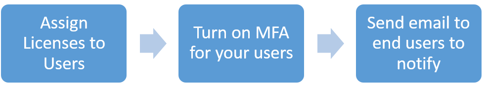
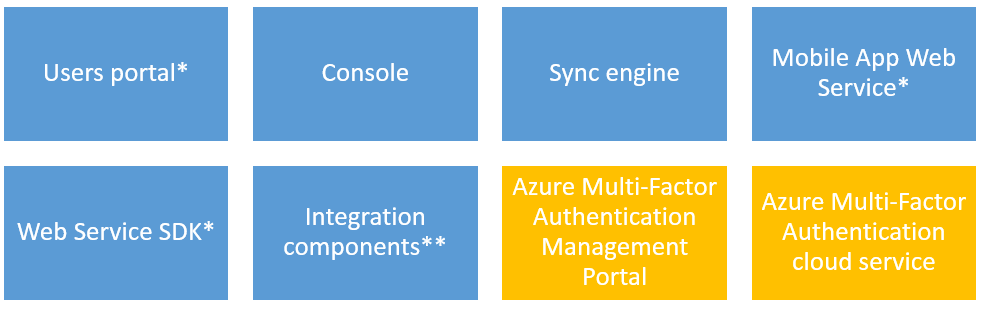

<properties 
    pageTitle="Sicherheit bewährte Methoden für die Verwendung von Azure MFA"
    description="Dieses Dokument enthält bewährte Methoden im Zusammenhang mit Azure MFA mit Azure-Konten"
    services="multi-factor-authentication"
    documentationCenter=""
    authors="kgremban"
    manager="femila"
    editor="curtland"/>

<tags
    ms.service="multi-factor-authentication"
    ms.workload="identity"
    ms.tgt_pltfrm="na"
    ms.devlang="na"
    ms.topic="article"
    ms.date="08/04/2016"
    ms.author="kgremban"/>

# Sicherheit bewährte Methoden für die Verwendung von Azure kombinierte Authentifizierung mit Azure AD-Konten

Wenn es zur Verbesserung der Authentifizierungsprozesses geht, ist kombinierte Authentifizierung die bevorzugte Wahl für die meisten Organisationen aus. Azure mehrstufige Authentifizierung (MFA) ermöglicht Unternehmen, um deren Sicherheit und Einhaltung von Vorschriften zu erfüllen während einer einfachen Anmeldeverhalten für ihre Benutzer bereitstellen. In diesem Artikel werden einige bewährte Methoden behandelt, die Sie bei der Planung für die Annahme Azure MFA berücksichtigen sollten.

## Bewährte Methoden für Azure kombinierte Authentifizierung in der cloud
Um alle Benutzer kombinierte Authentifizierung bieten, und führen Sie die Vorteile der erweiterten Features, die kombinierte Authentifizierung Azure bietet, müssen Sie Azure kombinierte Authentifizierung für alle Benutzer zu aktivieren.  Dies geschieht mithilfe einer der folgenden Aktionen aus:

- Azure AD-Premium- oder die Enterprise-Suite Mobilität
- Mehrstufige Authentifizierung Anbieter

### Azure AD-Premium/Enterprise Mobilität Suite

Im erste empfohlene Schritt für Annahme Azure MFA in der Cloud mit Azure AD Premium oder die Enterprise-Suite Mobilität wird den Benutzern Lizenzen zuweisen.  Azure kombinierte Authentifizierung ist Teil dieser Suites und als solche Ihrer Organisation nicht benötigen Sie nichts zusätzlich zu erweitern die kombinierte Authentifizierung Funktionalität für alle Benutzer.

Einrichten von kombinierte Authentifizierung berücksichtigen Sie bei der folgenden:

- Sie müssen keine kombinierte Authentifizierung Anbieter zu erstellen.  Azure AD-Premium und die Enterprise-Suite Mobilität im Lieferumfang von Azure kombinierte Authentifizierung.  Wenn Sie einen Anbieter autorisierende erstellen Sie doppelte erhalten konnte in Rechnung gestellt.
- Azure AD verbinden ist nur eine Anforderung an, wenn Sie Ihrem lokalen Active Directory-Umgebung mit einem Azure AD-Verzeichnis synchronisieren. Wenn Sie nur ein Verzeichnis Azure AD-, die nicht mit einer lokalen Instanz von Active Directory synchronisiert wird verwenden, benötigen Sie nicht Azure AD verbinden.

### Mehrstufige Authentifizierung Anbieter

Wenn Sie nicht Azure AD Premium oder die Enterprise-Suite Mobilität verfügen ist empfohlene zunächst für Annahme Azure MFA in der Cloud zum Erstellen einer MFA autorisierende Anbieter. Obwohl MFA standardmäßig für globale Administratoren verfügbar Berechtigung Azure Active Directory ist, falls Sie MFA für Ihre Organisation bereitstellen, müssen Sie für alle Benutzer, und führen Sie der kombinierte Authentifizierung-Funktion erweitern, dass Sie eine kombinierte Authentifizierung Anbieter benötigen.
Wenn Sie den Anbieter autorisierende auswählen zu können, müssen Sie wählen Sie ein Verzeichnis und beachten Folgendes:

- Ein Azure AD-Verzeichnis so erstellen Sie eine kombinierte autorisierende Provider benötigen nicht.
- Sie müssen ein Verzeichnis Azure AD-Wunsch erweitern kombinierte Authentifizierung für alle Benutzer und/oder möchten Ihre globalen Administratoren Features wie die Verwaltungsportal, benutzerdefinierte Grüße und Berichte nutzen können die kombinierte Authentifizierung Anbieter zugeordnet.
- DirSync oder AAD synchronisieren sind nur eine Anforderung auf, wenn Sie Ihrem lokalen Active Directory-Umgebung mit einem Azure AD-Verzeichnis synchronisieren. Wenn Sie nur ein Verzeichnis Azure AD-, die nicht mit einer lokalen Instanz von Active Directory synchronisiert wird verwenden, benötigen Sie nicht DirSync oder AAD synchronisieren.
- Wenn Sie Azure AD Premium oder die Enterprise-Suite Mobilität haben, müssen Sie keinen kombinierte Authentifizierung Anbieter zu erstellen. Sie müssen nur einem Benutzer eine Lizenz zuweisen, und klicken Sie dann kann einschalten MFA für Benutzer.
- Vergewissern Sie sich zum Auswählen des richtigen Verwendung Modells für Ihr Unternehmen (pro autorisierende oder pro Benutzer aktiviert), nachdem Sie das Verwendungsmodell auswählen nicht geändert werden.

### Benutzerkonto
Bei der Aktivierung der MFA für Ihre Benutzer können Benutzerkonten in einem der drei Core Zustände werden: deaktiviert, aktiviert oder erzwungen.
Verwenden Sie die folgenden Richtlinien, um sicherzustellen, dass Sie die am besten geeignete Option für die Bereitstellung verwenden:

- Wenn Sie den Status des Benutzers deaktiviert festgelegt ist, wird dieser Benutzer nicht kombinierte Authentifizierung verwendet. Dies ist der Standardzustand.
- Wenn Sie den Status des Benutzers aktiviert festgelegt ist, bedeutet dies, dass der Benutzer ist aktiviert, jedoch die Registrierung zu noch nicht abgeschlossen. Sie werden aufgefordert, bis zum Abschluss der am nächsten Anmelden. Diese Einstellung wirkt sich nicht auf apps nicht Browser aus. Alle apps weiterhin funktionsfähig, wenn die Registrierung abgeschlossen ist.
- Wenn Sie den Status des Benutzers erzwungenen festgelegt ist, bedeutet dies, dass der Benutzer möglicherweise oder möglicherweise nicht Registrierung abgeschlossen haben. Wenn sie die Registrierung abgeschlossen haben werden diese kombinierte Authentifizierung verwenden. Andernfalls wird der Benutzer aufgefordert werden, um die Registrierung am nächsten Anmeldung abzuschließen. Diese Einstellung wirkt sich nicht Browser apps. Diese apps funktionieren nicht bis app Kennwörter erstellt und verwendet werden.
- Verwenden Sie im Artikel [Erste Schritte mit Azure kombinierte Authentifizierung in der Cloud](multi-factor-authentication-get-started-cloud.md) Benutzer Benachrichtigungsvorlage zum Senden einer e-Mail an Ihre Benutzer bezüglich MFA Annahme.

### Unterstützung

Da die meisten Benutzer sind nur Kennwörter verwenden, die zum Authentifizieren vertraut sind, ist es wichtig, dass Ihr Unternehmen Präsenz für alle Benutzer zu diesem Vorgang schalten. Diese Präsenz kann die Wahrscheinlichkeit reduziert, die Benutzer den Helpdesk für kleinere Probleme bei der MFA aufgerufen wird.
Es gibt jedoch einige Szenarien, in denen Vorübergehendes Deaktivieren der MFA erforderlich. Verwenden Sie die folgenden Richtlinien, um zu verstehen, wie diese Szenarien zu behandeln:

- Stellen Sie sicher, dass Ihre Mitarbeiter des technischen Supports angewiesen sind Ziehpunkt Szenarien, die mobile-app oder das Telefon keiner Benachrichtigung oder Anruf erhält, und aus diesem Grund, die der Benutzer nicht anmelden kann. Sie können eine einmalige umgehen Option an, damit einen Benutzer ein einziges Mal authentifiziert, indem Sie kombinierte Authentifizierung "umgehen" aktivieren. Die Umgehung ist vorübergehend und läuft ab nach einer festgelegten Anzahl von Sekunden.
- Bei Bedarf können Sie die Funktion vertrauenswürdige IP-Adressen in Azure MFA nutzen. Dieses Feature ermöglicht Administratoren von einem Mandanten verwalteten oder im Verbund die Möglichkeit, eine kombinierte Authentifizierung für Benutzer umgehen, die von lokales Intranet des Unternehmens anmelden. Die Features sind verfügbar für Azure AD-Mandanten, die Azure AD Premium, Enterprise Mobilität Suite oder Azure kombinierte Authentifizierung Lizenzen haben.

## Bewährte Methoden für Azure kombinierte Authentifizierung lokal
Wenn Ihr Unternehmen entschieden, die eine eigene Infrastruktur MFA aktivieren nutzen, werden muss ein Azure mehrstufige Authentifizierungsserver lokal bereitgestellt. Die MFA Server-Komponenten werden in der folgenden Abbildung dargestellt:

*nicht installiert standardmäßig ** installiert, aber nicht standardmäßig aktiviert

Azure mehrstufige Authentifizierungsserver kann verwendet werden, gesichert Cloud und lokale Ressourcen, die von Azure AD-Konten zugegriffen werden.  Dies kann jedoch nur mithilfe einer Föderation erreicht.  D. h., Sie haben AD FS und Verbund mit Ihrem Azure AD-Mandanten haben.
Einrichten von mehrstufige Authentifizierungsserver berücksichtigen Sie bei der folgenden:

- Wenn Sie sind Sichern von Azure AD-Ressourcen mithilfe von Active Directory Federation Services, und klicken Sie dann der 1st Faktor der Authentifizierung durchgeführt werden lokalen AD FS verwenden, und der 2. Faktor ist ausgeführte lokalen durch den Anspruch berücksichtigt.
- Es ist nicht erforderlich, dass der Server Azure mehrstufige Authentifizierung auf dem ADFS-Server Föderation die kombinierte Authentifizierung Netzwerkadapter für AD FS auf einem Windows Server 2012 R2 ausführen AD FS installiert werden muss installiert sein. Den Server auf einem anderen Computer, installieren, solange sie eine unterstützte Version ist können und die AD FS-Netzwerkadapter separat installieren, auf dem AD FS-Verbund-Server. Finden Sie im Verfahren unter Anweisungen zur Installation von der Netzwerkadapter getrennt ein.
- Der Assistent zum Installieren von kombinierte Authentifizierung AD FS Netzwerkadapter eine Sicherheitsgruppe aufgerufen PhoneFactor Admins in Ihrem Active Directory erstellt und dann AD FS Dienstkonto von Ihrem Dienst Föderation zu dieser Gruppe addiert. Es wird empfohlen, dass Sie auf Ihrem Domänencontroller überprüfen, ob die Gruppe PhoneFactor Admins tatsächlich um erstellt und, dass die AD FS--Konto Service Mitglied dieser Gruppe werden. Falls erforderlich, fügen Sie das AD FS-Dienstkonto der Gruppe PhoneFactor Admins auf Ihre Domänencontroller manuell hinzu.

### Benutzerportal
Dieses Portal wird in einer Website Internet Information Server (IIS), die ermöglicht Self-service-Funktionen und bietet einen vollständigen Satz von Berechtigungen für die Verwaltung von Benutzern ausgeführt werden. Verwenden Sie die folgenden Richtlinien, um diese Komponente zu konfigurieren:

- IIS 6 oder höher ist erforderlich
- ASP.NET v2.0.507207 installiert und registriert werden müssen
- Dieser Server kann in einem Netzwerk Umfang bereitgestellt werden.

### App-Kennwörter
Wenn Ihre Organisation ist Partnersuche über SSO mit Azure AD und Azure MFA verwenden möchten, klicken Sie dann achten Sie auf der folgenden bei Verwendung von app Kennwörter (Denken Sie daran, dass dies nur für partnerverbundkontakte (SSO gilt) wird verwendet):

- Das Kennwort für die App wird überprüft, indem Azure AD und daher Föderation umgangen. Föderation wird nur beim Einrichten des App-Kennwort verwendet.
- Für partnerverbundkontakte (SSO) werden Kennwörter für Benutzer in der Organisations-Id gespeichert. Wenn der Benutzer das Unternehmen verlässt, weist diese Informationen zu Organisations-Id über DirSync in Echtzeit übertragen. Konto deaktivieren und Löschen von kann zu synchronisieren, bis zu 3 Stunden dauern deaktivieren und Löschen von der App Kennwort in Azure AD verzögern.
- Lokale Client Access Control Einstellungen sind, für die App Kennwort nicht berücksichtigt.
- Keine lokalen Authentifizierung Protokollierung / Überwachung Videofunktionen steht für App-Kennwort
- Weitere Endbenutzer Education ist für den Microsoft Lync 2013-Client erforderlich.
- Bestimmte erweiterte Architektur Designs erfordern möglicherweise verwenden eine Kombination aus organisationsinterne Benutzernamen und Kennwörter und app Kennwörter bei Verwendung von kombinierte Authentifizierung mit Clients, je nachdem, wo sie sich authentifizieren. Bei Clients, die Authentifizierung für eine lokale Infrastruktur, verwenden Sie eine organisationsinterne Benutzernamen und Ihr Kennwort ein. Für Clients, die bei Azure AD authentifizieren, verwenden Sie das Kennwort für die app.
- Standardmäßig nicht Benutzer Kennwörter app erstellen, wenn Ihr Unternehmen, die erforderlich ist, oder wenn Sie Benutzer app Kennwort in einigen Szenarien erstellen können müssen, müssen Sie sicherstellen, dass die Option Benutzer können Kennwörter app, melden Sie sich bei ohne Browser Applications erstellen ausgewählt ist.

## Weitere Aspekte
Verwendung der nachstehenden Liste um zu verstehen, dass einige weitere Aspekte und bewährte Methoden für die einzelnen Komponenten, die lokal bereitgestellt:

Methode|Beschreibung
:------------- | :------------- |
[Active Directory Federation Service](multi-factor-authentication-get-started-adfs.md)|Informationen zum Einrichten von Azure kombinierte Authentifizierung mit AD FS.
[RADIUS-Authentifizierung](multi-factor-authentication-get-started-server-radius.md)|  Informationen zum Einrichten und Konfigurieren des Azure MFA-Servers mit RADIUS.
[IIS-Authentifizierung](multi-factor-authentication-get-started-server-iis.md)|Informationen zum Einrichten und Konfigurieren des Azure MFA-Servers mit IIS.
[Windows-Authentifizierung](multi-factor-authentication-get-started-server-windows.md)|  Informationen zum Einrichten und Konfigurieren des Azure MFA-Servers mit Windows-Authentifizierung.
[LDAP-Authentifizierung](multi-factor-authentication-get-started-server-ldap.md)|Informationen zum Einrichten und Konfigurieren des Azure MFA-Servers mit LDAP-Authentifizierung.
[Remote Desktop Gateway und Azure mehrstufige Authentifizierung-Server mit RADIUS](multi-factor-authentication-get-started-server-rdg.md)|  Informationen zum Einrichten und Konfigurieren des Azure MFA-Servers mit Remote Desktop Gateway RADIUS verwenden.
[Synchronisieren mit Windows Server Active Directory](multi-factor-authentication-get-started-server-dirint.md)|Informationen zum Einrichten und Konfigurieren von Synchronisierung zwischen Active Directory und den Azure MFA-Server.
[Bereitstellen von den Azure kombinierte Authentifizierung Server Mobile-App-Web-Dienst](multi-factor-authentication-get-started-server-webservice.md)|Informationen zum Einrichten und Konfigurieren von den Azure MFA Server-Webdienst.
[Erweiterte VPN-Konfiguration mit Azure kombinierte Authentifizierung](multi-factor-authentication-advanced-vpn-configurations.md)|Informationen zum Konfigurieren von Cisco ASA, Citrix Netscaler und Juniper/Pulse Secure VPN Einheiten, die über LDAP oder RADIUS.

## Zusätzliche Ressourcen
Obwohl in diesem Artikel einige bewährte Methoden für Azure MFA hervorgehoben, sind weitere Ressourcen, die Sie auch beim Planen der Bereitstellung MFA verwenden können. Die nachstehenden Liste weist einige wichtigen Artikeln, die Ihnen dabei helfen können:

- [Berichte in Azure kombinierte Authentifizierung](multi-factor-authentication-manage-reports.md)
- [Setup-Benutzeroberfläche für Azure kombinierte Authentifizierung](multi-factor-authentication-end-user-first-time.md)
- [Azure kombinierte Authentifizierung häufig gestellte Fragen](multi-factor-authentication-faq.md)
