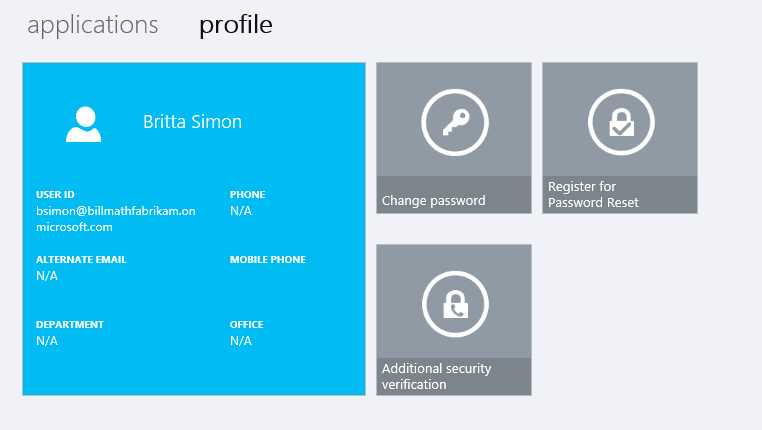

<properties
    pageTitle="Was ist Azure mehrstufige Authentifizierung - weiter"
    description="Dies ist die Seite, die beschreibt, was zu tun ist weiter mit MFA mehrstufige Azure-Authentifizierung.  Dies umfasst Berichte, Betrug Benachrichtigung, einmalige umgehen, benutzerdefinierte Sprachnachrichten, vertrauenswürdigen IP-Adressen und app Kennwörter zwischenspeichern."
    services="multi-factor-authentication"
    documentationCenter=""
    authors="kgremban"
    manager="femila"
    editor="curtand"/>

<tags
    ms.service="multi-factor-authentication"
    ms.workload="identity"
    ms.tgt_pltfrm="na"
    ms.devlang="na"
    ms.topic="article"
    ms.date="09/23/2016"
    ms.author="kgremban"/>

# Konfigurieren von Azure kombinierte Authentifizierung

In diesem Artikel können Sie Azure kombinierte Authentifizierung verwalten, jetzt, da Sie sind einsatzbereit.  Er umfasst eine Vielzahl von Hilfethemen, die Sie optimal nutzen Azure kombinierte Authentifizierung.  Nicht alle dieser Funktionen sind in jeder Version Azure kombinierte Authentifizierung verfügbar.

Die Konfiguration für einige der folgenden Features ist im Verwaltungsportal Azure mehrstufige Authentifizierung gefunden. Es gibt zwei Arten, die Sie im Verwaltungsportal MFA zugreifen können, die beide über das Azure-Portal fertig sind. Die erste ist durch eine kombinierte Authentifizierung Anbieter verwaltet werden, wenn Verbrauch-basierten MFA verwenden. Die zweite erfolgt über die MFA Service-Einstellungen. Die zweite Option ist entweder eine kombinierte Authentifizierung Anbieter oder eine Azure MFA, Azure AD Premium oder Enterprise Mobilität Suite-Lizenz erforderlich.

Um MFA Verwaltungsportal über einen Anbieter, Azure mehrstufige Authentifizierung zugreifen zu können, melden Sie sich bei der Azure-Portal als Administrator aus, und wählen Sie die Option Active Directory. Klicken Sie auf der Registerkarte **Mehrstufige Authentifizierung Anbieter** und dann wählen Sie aus Ihrem Verzeichnis, und klicken Sie auf die Schaltfläche **Verwalten** , klicken Sie unten.

Um MFA Verwaltungsportal über die Einstellungsseite MFA Dienst zuzugreifen, melden Sie sich bei der Azure-Portal als Administrator aus, und wählen Sie die Option Active Directory. Klicken Sie in Ihrem Verzeichnis auf, und klicken Sie dann auf die Registerkarte **Konfigurieren** . Wählen Sie unter dem Abschnitt kombinierte Authentifizierung **diensteinstellungen verwalten**aus. Klicken Sie am unteren Rand der Seite MFA-Dienst auf den Link **Wechseln Sie zu dem Portal** .

Feature| Beschreibung| Was ist abgedeckt
:------------- | :------------- | :------------- |
[Betrug Benachrichtigung](#fraud-alert)|Betrug Benachrichtigung kann konfiguriert und so einrichten, dass Ihre Benutzer gefälschte Versuche Zugriff auf ihre Ressourcen melden zur Verfügung stehen werden.|So einrichten, konfigurieren und Berichte Onlinebetrug
[Einmalige umgehen](#one-time-bypass) |Eine einmalige umgehen kann einen Benutzer ein einziges Mal authentifiziert, indem Sie "umgehen" kombinierte Authentifizierung.|Zum Einrichten und Konfigurieren einer einmaligen umgehen
[Benutzerdefinierte Sprachnachrichten](#custom-voice-messages) |Benutzerdefinierte Sprachnachrichten können Sie eigene Aufzeichnungen oder Grüße mit kombinierte Authentifizierung verwenden. |Zum Einrichten und Konfigurieren von benutzerdefinierten Grüße und Nachrichten
[Zwischenspeichern](#caching-in-azure-multi-factor-authentication)|Zwischenspeichern, können Sie eine bestimmte Uhrzeit festgelegten Zeitraum, sodass die nachfolgende Authentifizierungsversuche erfolgreich automatisch ausgeführt werden. |Informationen zum Einrichten und Konfigurieren der Authentifizierung Zwischenspeichern.
[Vertrauenswürdigen IP-Adressen](#trusted-ips)|Vertrauenswürdige IP-Adressen ein Feature kombinierte Authentifizierung steht, die Administratoren von einem Mandanten verwalteten oder im Verbund die Möglichkeit ermöglicht, eine kombinierte Authentifizierung für Benutzer umgehen, die von lokales Intranet des Unternehmens anmelden.|Konfigurieren und Einrichten von IP-Adressen, die für die kombinierte Authentifizierung ausgenommenen sind
[App-Kennwörter](#app-passwords)|Eine app Kennwort ermöglicht eine Anwendung, der nicht MFA-fähige umgehen kombinierte Authentifizierung und der Bearbeitung fortfahren.|Informationen zu Kennwörtern app.
[Denken Sie daran kombinierte Authentifizierung für gespeicherte Geräte sowie Browser](#remember-multi-factor-authentication-for-devices-users-trust)|Ermöglicht Ihnen, denken Sie daran Geräte für eine festgelegte Anzahl von Tagen, nachdem ein Benutzer erfolgreich mit MFA angemeldet hat.|Informationen zum Aktivieren dieser Funktion und die Anzahl der Tage einrichten.
[Auswählbar Überprüfung Methoden](#selectable-verification-methods)|Ermöglicht Ihnen, wählen Sie die Authentifizierungsmethoden, mit denen Benutzer verwenden können.|Informationen zum Aktivieren oder Deaktivieren von bestimmter Authentifizierungsmethoden, z. B. Anruf oder Text-Nachrichten.

## Betrug Benachrichtigung
Betrug Benachrichtigung kann konfiguriert und so einrichten, dass Ihre Benutzer gefälschte Versuche Zugriff auf ihre Ressourcen melden zur Verfügung stehen werden.  Benutzer können Betrug mit mobile-app oder über deren Telefon melden.

### Zum Einrichten und Konfigurieren von Betrug Benachrichtigung

1.  Melden Sie sich bei http://azure.microsoft.com
2.  Navigieren Sie zu der MFA Verwaltungsportal pro den Anweisungen am oberen Rand dieser Seite.
3.  Klicken Sie in der Azure mehrstufige Authentifizierung Verwaltungsportal auf Einstellungen unter dem Abschnitt konfigurieren.
4.  Aktivieren Sie unter dem Abschnitt Betrug benachrichtigen der Seite Einstellungen zum Übermitteln von Betrug Benachrichtigungen das Kontrollkästchen Benutzern erlauben.
5.  Wenn Sie möchten Benutzern blockiert werden sollen, wenn Betrug gemeldet wird, aktivieren Sie dieses Kontrollkästchen blockieren Benutzer beim Betrug gemeldet wird.
6.  Geben Sie in das Textfeld **Code zu Bericht Betrug während der anfänglichen Grußzeile** ein Zahlencode, die während eines Anrufs Überprüfung verwendet werden kann. Wenn ein Benutzer diese Code plus # anstelle von nur das Zeichen # eingibt, wird eine Warnung Betrug gemeldet werden.
7.  Klicken Sie unten auf Speichern.

>[AZURE.NOTE]
>Microsoft Standard-Voicemail-Grußformeln weisen Sie die Benutzer, und übermitteln Sie eine Benachrichtigung betrug 0 # drücken. Wenn Sie einen anderen Code als 0 verwenden möchten, sollten Sie aufzeichnen und Ihre eigenen benutzerdefinierten Voicemail-Grußformeln mit entsprechenden Anweisungen hochladen.

### Klicken Sie auf Bericht Betrug Benachrichtigung
Benachrichtigung Betrug kann auf zwei Arten gemeldet werden.  Entweder über die mobile-app oder über das Telefon.  

### Klicken Sie auf Bericht Betrug Benachrichtigung mit mobile-app

1. Wenn eine Überprüfung an Ihr Mobiltelefon gesendet wird, wählen Sie auf die Microsoft-Authenticator app starten.
2. Bericht Betrug, klicken Sie auf die Abbrechen und Bericht Betrug. Dadurch wird ein Feld aus, die besagt, dass Ihre Organisation IT-Supportmitarbeiter benachrichtigt werden soll.
3. Klicken Sie auf Bericht Betrug.
4. Klicken Sie auf die app klicken Sie auf Schließen.

### Klicken Sie auf Bericht Betrug Benachrichtigung mit dem Telefon

1. Wenn ein Überprüfung Anruf an Ihr Mobiltelefon eingeht, beantworten.  
2. Melden von Betrug, geben den Code, der für die Berichterstattung über das Telefon, und klicken Sie dann das Zeichen # Betrug entsprechen konfiguriert wurden. Sie werden benachrichtigt, dass eine Benachrichtigung Betrug übermittelt wurde.
3. Beenden Sie den Anruf an.

### Zum Anzeigen des Berichts Onlinebetrug

1. Melden Sie sich bei [http://azure.microsoft.com](https://azure.microsoft.com/)
2. Wählen Sie auf der linken Seite aus Active Directory.
3. Wählen Sie am oberen mehrstufige Authentifizierung Anbieter. Dadurch wird eine Liste der kombinierte Authentifizierung Anbieter.
4. Wenn Sie mehr als eine kombinierte Authentifizierung Anbieter haben, wählen Sie das Element, das Sie Betrug benachrichtigen Bericht anzeigen, und klicken Sie auf am unteren Rand der Seite verwalten möchten. Wenn Sie nur eine haben, klicken Sie auf verwalten. Dadurch wird die Verwaltungsportal Azure mehrstufige Authentifizierung geöffnet.
5. Azure mehrstufige Authentifizierung Verwaltungsportal, klicken Sie auf der linken Seite unter A Bericht anzeigen klicken Sie auf benachrichtigen Betrug.
6. Geben Sie den Datumsbereich aus, den Sie im Bericht anzeigen möchten. Sie können auch eine bestimmten Benutzernamen, Telefonnummern und den Status des Benutzers angeben.
7. Klicken Sie auf ausführen. Dadurch wird ein Bericht ähnlich der folgenden. Sie können auch Exportieren nach CSV klicken, wenn Sie den Bericht exportieren möchten.

## Einmalige umgehen

Eine einmalige umgehen kann einen Benutzer ein einziges Mal authentifiziert, indem Sie "umgehen" kombinierte Authentifizierung. Die Umgehung ist vorübergehend und läuft ab nach einer festgelegten Anzahl von Sekunden.  In Situationen, in dem die mobile-app oder das Telefon keiner Benachrichtigung oder Anruf erhält, können Sie also eine einmalige umgehen aktivieren, damit der Benutzer auf die gewünschte Ressource zugreifen können.

### So erstellen eine einmalige umgehen

1.  Melden Sie sich bei http://azure.microsoft.com
2.  Navigieren Sie zu der MFA Verwaltungsportal pro den Anweisungen am oberen Rand dieser Seite.
3.  Im Azure mehrstufige Authentifizierung Verwaltungsportal, wenn Sie den Namen des Mandanten oder Azure MFA Anbieters finden Sie auf der linken Seite mit einer + neben dem Eintrag, klicken Sie auf das + finden Sie unter verschiedene MFA Server Replikationsgruppen und der Gruppe Azure Standard. Klicken Sie auf die entsprechende Gruppe.
4.  Klicken Sie auf **Einmalig umgehen**, klicken Sie unter Verwaltung Benutzer.

5.  Klicken Sie auf der Seite Einmaliges umgehen auf **Neue einmalig umgehen**.
6.  Geben Sie den Benutzernamen des Benutzers, die Anzahl der Sekunden, die die Umgehung vorhanden sind, werden, den Grund für die umgehen, und klicken Sie auf **umgehen**.

7.  An diesem Punkt muss der Benutzer anmelden, bevor der einmaligen umgangen läuft ab.

### Zum Anzeigen des Berichts einmalige umgehen

1. Melden Sie sich bei [http://azure.microsoft.com](https://azure.microsoft.com/)
2. Wählen Sie auf der linken Seite aus Active Directory.
3. Wählen Sie am oberen mehrstufige Authentifizierung Anbieter. Dadurch wird eine Liste der kombinierte Authentifizierung Anbieter.
4. Wenn Sie mehr als eine kombinierte Authentifizierung Anbieter haben, wählen Sie das Element, das Sie Betrug benachrichtigen Bericht anzeigen, und klicken Sie auf am unteren Rand der Seite verwalten möchten. Wenn Sie nur eine haben, klicken Sie auf verwalten. Dadurch wird die Verwaltungsportal Azure mehrstufige Authentifizierung geöffnet.
5. Klicken Sie auf die Azure mehrstufige Authentifizierung Verwaltungsportal, klicken Sie auf der linken Seite unter A Bericht anzeigen klicken Sie auf einmalig umgehen.
6. Geben Sie den Datumsbereich aus, den Sie im Bericht anzeigen möchten. Sie können auch eine bestimmten Benutzernamen, Telefonnummern und den Status des Benutzers angeben.
7. Klicken Sie auf ausführen. Dadurch wird ein Bericht ähnlich der folgenden. Wenn Sie den Bericht exportieren möchten, können Sie auch Exportieren nach CSV klicken.

## Benutzerdefinierte Sprachnachrichten

Benutzerdefinierte Sprachnachrichten können Sie eigene Aufzeichnungen oder Grüße mit kombinierte Authentifizierung verwenden.  Diese zusätzlich zu verwendet werden können, oder Ersetzen Sie das Microsoft-Einträge.

Vorbemerkung Achten Sie darauf, dass Sie die folgenden Aktionen aus:

- Die aktuelle unterstützte Dateiformate sind WAV- und MP3.
- Die maximale Dateigröße beträgt 5 MB.
- Es wird empfohlen, dass für die Authentifizierung, die Nachrichten nicht länger als 20 Sekunden sein. Einen Wert größer als dies kann bewirken, dass die Überprüfung fehlschlägt, da die Benutzer nicht reagieren können, bevor die Nachricht endet und die Überprüfung Timeout erreicht.

### Einrichten von benutzerdefinierten Sprachnachrichten in Azure kombinierte Authentifizierung
1.  Erstellen einer benutzerdefinierten Sprachnachricht mithilfe einer der unterstützten Formate.
2.  Melden Sie sich bei http://azure.microsoft.com
3.  Navigieren Sie zu der MFA Verwaltungsportal pro den Anweisungen am oberen Rand dieser Seite.
4.  Klicken Sie in der Azure mehrstufige Authentifizierung Verwaltungsportal auf Sprachnachrichten unter dem Abschnitt konfigurieren.
5.  Klicken Sie unter dem Abschnitt Sprachnachrichten auf **Neue Sprachnachricht**.

6.  Klicken Sie auf das konfigurieren: Neue Sprachnachrichten Seite, klicken Sie auf **Sound Dateien verwalten**.

7.  Klicken Sie auf das konfigurieren: Klingeltöne Seite Dateien, klicken Sie auf **Sound-Datei hochladen**.

8.  Klicken Sie auf das konfigurieren: Sound-Datei hochladen, klicken Sie auf **Durchsuchen** , und navigieren Sie zu Ihrem Sprachnachricht, klicken Sie auf **Öffnen**.

9.  Fügen Sie eine Beschreibung hinzu, und klicken Sie auf hochladen.
10. Sobald dies abgeschlossen ist, wird eine Meldung, dass Sie die Datei erfolgreich hochgeladen haben bestätigt.
11. Klicken Sie auf der linken Seite auf Sprachnachrichten.
12. Klicken Sie unter dem Abschnitt Sprachnachrichten auf neue Sprachnachricht.
13. Wählen Sie aus der Dropdownliste Sprache die Sprache aus.
14. Ist diese Nachricht für eine bestimmte Anwendung, geben Sie es im Feld ein.
15. Wählen Sie aus der Nachricht Datentyp den Nachrichtentyp mit unserer neuen benutzerdefinierten Nachricht überschrieben werden.
16. Wählen Sie aus der Dropdownliste Sounddatei eine Sounddatei ein.
17. Klicken Sie auf **Erstellen**. Eine Meldung bestätigt, dass Sie eine Sprachnachricht erfolgreich erstellt haben.

## Zwischenspeichern in Azure kombinierte Authentifizierung

Zwischenspeichern, können Sie eine bestimmte Uhrzeit festgelegten Zeitraum, sodass die nachfolgende Authentifizierungsversuche erfolgreich automatisch ausgeführt werden. Dies wird hauptsächlich beim lokalen bedienen, beispielsweise für die Option VPN mehrere Überprüfung Anfragen zu senden, während die erste Anforderung noch nicht abgeschlossen ist. Dadurch wird die nachfolgenden Anforderungen automatisch erfolgreich ist, nachdem der Benutzer die domänenüberprüfung wird ausgeführt. Beachten Sie, dass Zwischenspeichern nicht vorgesehen, melden Sie sich-ins zu Azure AD verwendet werden.

### Zum Einrichten von Zwischenspeichern in Azure kombinierte Authentifizierung

1.  Melden Sie sich bei http://azure.microsoft.com
2.  Navigieren Sie zu der MFA Verwaltungsportal pro den Anweisungen am oberen Rand dieser Seite.
3.  Klicken Sie in der Azure mehrstufige Authentifizierung Verwaltungsportal unter dem Abschnitt konfigurieren auf Zwischenspeichern.
4.  Klicken Sie auf der Seite zwischenspeichern konfigurieren auf neuen Cache
5.  Wählen Sie den Typ der Cache und den Cache Sekunden ein. Klicken Sie auf erstellen.

## Vertrauenswürdigen IP-Adressen

Vertrauenswürdige IP-Adressen ein Feature kombinierte Authentifizierung steht, die Administratoren von einem Mandanten verwalteten oder im Verbund die Möglichkeit ermöglicht, eine kombinierte Authentifizierung für Benutzer umgehen, die von lokales Intranet des Unternehmens anmelden. Die Features sind verfügbar für Azure AD-Mandanten, die Azure AD Premium, Enterprise Mobilität Suite oder Azure kombinierte Authentifizierung Lizenzen haben.

Typ des Azure AD-Mandanten| Verfügbar vertrauenswürdige IP-Optionen
:------------- | :------------- |
Verwaltete|Bestimmte IP-Adressbereiche – Administratoren können einen Bereich von IP-Adressen angeben, die kombinierte Authentifizierung für Benutzer umgehen können, die von im Intranet des Unternehmens anmelden.
Partnersuche|<li>Alle verbundene Benutzer - alle verbundenen Benutzer bei der Anmeldung-in innerhalb der Organisation können kombinierte Authentifizierung mithilfe einer anfordern ausgestellt von AD FS umgehen.</li><li>Bestimmte IP-Adressbereiche – Administratoren können einen Bereich von IP-Adressen angeben, die kombinierte Authentifizierung für Benutzer umgehen können, die von im Intranet des Unternehmens anmelden.

Die Umgehung funktioniert nur von innerhalb des Unternehmens Intranet. Also beispielsweise, wenn Sie nur alle Benutzer im Verbund ausgewählt und sich der Benutzer anmeldet weist von außerhalb des Unternehmens Intranet-, diesen Benutzer authentifizieren mit mehrstufige Authentifizierung, auch wenn der Benutzer einen AD FS-Anspruch bietet. Die folgende Tabelle beschreibt, wann sind mehrstufige Authentifizierung und app Kennwörter erforderlich innerhalb Ihrer Corpnet und außerhalb Ihrer Corpnet, wenn vertrauenswürdige IP-Adressen aktiviert ist.

|Vertrauenswürdigen IP-Adressen aktiviert| Vertrauenswürdigen IP-Adressen deaktiviert
:------------- | :------------- | :------------- |
Innere corpnet|Für Browser Zahlungen nicht mehrstufige Authentifizierung erforderlich.|Browser Zahlungen mehrstufige Authentifizierung erforderlich
|Für rich Client-apps arbeiten reguläre Kennwörter an, wenn der Benutzer keine Kennwörter app erstellt wurde. Nachdem Sie ein Kennwort für die app erstellt wurde, sind die app Kennwörter erforderlich.|Für rich Client-apps, app Kennwörter erforderlich
Externe corpnet|Für Browser Zahlungen die erforderlichen kombinierte Authentifizierung aus.|Für Browser Zahlungen die erforderlichen kombinierte Authentifizierung aus.
|Für rich Client-apps, app Kennwörter erforderlich.|Für rich Client-apps, app Kennwörter erforderlich.

### So aktivieren Sie vertrauenswürdige IP-Adressen

1. Anmelden Sie bei der klassischen Azure-Portal.
2. Klicken Sie auf der linken Seite auf Active Directory.
3. Klicken Sie unter auf Verzeichnis auf dem Verzeichnis, das Sie auf vertrauenswürdige IPsing einrichten möchten.
4. Klicken Sie auf das Verzeichnis ausgewählt haben, klicken Sie auf konfigurieren.
5. Klicken Sie im Abschnitt kombinierte Authentifizierung auf diensteinstellungen verwalten.
6. Aktivieren Sie auf der Seite Diensteinstellungen unter Vertrauenswürdige IP-Adressen entweder aus:

    - Für Anfragen verbundene Benutzer, die aus meiner Intranet – alle Partnersuche können Benutzer, die aus dem Firmennetzwerk anmelden kombinierte Authentifizierung mithilfe einer anfordern ausgestellt von AD FS umgehen.
    - Geben Sie die IP-Adressen für Anfragen von einem bestimmten Bereich der öffentlichen IP-Adressen – in die Textfelder CIDR-Notation. Beispiel: xxx.xxx.xxx.0/24 für IP-Adressen in den Bereich xxx.xxx.xxx.1 – xxx.xxx.xxx.254 oder xxx.xxx.xxx.xxx/32 für eine einzelne IP-Adresse. Sie können bis zu 50 IP-Adressbereiche eingeben.

7. Klicken Sie auf Speichern.
8. Nachdem die Updates angewendet wurden, klicken Sie auf Schließen.

## App-Kennwörter

Sie können nicht in einigen apps, wie Office 2010 oder älter und Apple Mail kombinierte Authentifizierung verwenden.  Wenn dieser apps verwenden möchten, müssen Sie "app Kennwörter" verwenden anstelle Ihres traditionelle Kennworts.  Das Kennwort für die app kann die Anwendung umgehen kombinierte Authentifizierung und der Bearbeitung fortfahren.

>[AZURE.NOTE] Modernes Authentifizierung für die Office 2013-Clients
>
> Office 2013-Clients (einschließlich Outlook) Protokolle für neue Authentifizierung unterstützt jetzt und zur Unterstützung von kombinierte Authentifizierung aktiviert werden können.  Dies bedeutet, dass nach der Aktivierung app Kennwörter nicht für die Verwendung mit Office 2013-Clients erforderlich sind.  Weitere Informationen finden Sie unter [Office 2013 moderne Authentifizierung public Preview-Version angekündigt](https://blogs.office.com/2015/03/23/office-2013-modern-authentication-public-preview-announced/).

### Wichtige Informationen zu Kennwörtern app

Im folgenden finden eine Liste wichtige Dinge, die Sie die app Kennwörter kennen sollten.

- Benutzer können mehrere app Kennwörter, wodurch sich die Oberfläche für Diebstahl erhöht haben. Da app Kennwörter schwer zu beachten sind, kann es Personen dies Notieren Sie sich wird. Dies wird nicht empfohlen und sollte überfordert werden, weil nur einen Faktor, melden Sie sich mit app Kennwort erforderlich ist.
- Apps für die Kennwörter zwischenspeichern und verwenden es in lokalen Szenarien möglicherweise weiß nicht, da das Kennwort app außerhalb der Organisations-Id bekannt ist nicht gestartet. Ein Beispiel ist die Exchange-e-Mails, die lokal sind, aber der archivierten e-Mail-Nachrichten in der Cloud ist. Dasselbe Kennwort funktioniert nicht.
- Das eigentliche Kennwort wird automatisch generiert und nicht durch den Benutzer bereitgestellt wird. Dies liegt daran, dass das automatisch generierte Kennwort ist für einen Angreifer Raten schwieriger und sicherer.
- Es gibt zurzeit maximal 40 Kennwörter pro Benutzer. Sie werden aufgefordert, eine vorhandene Kennwörter app zum Erstellen ein neues Kontos löschen.
- Nachdem Sie auf Konto eines Benutzers kombinierte Authentifizierung aktiviert ist, app Kennwörter mit den meisten ohne Browser-Clients wie Outlook und Lync verwendet werden können, jedoch administrative Vorgänge können nicht app Kennwörter über nicht-Browser-Anwendungen wie Windows PowerShell verwenden, auch wenn dieser Benutzer mit einem Administratorkonto hat durchgeführt werden.  Stellen Sie sicher, Sie Erstellen eines Dienstkontos durch ein sicheres Kennwort PowerShell-Skripts ausführen, und aktivieren Sie dieses Konto für kombinierte Authentifizierung nicht.

>[AZURE.WARNING]  App Kennwörter funktionieren in nicht-hybridumgebungen, wo Clients Kommunikation mit beide lokalen und cloud AutoErmittlung Endpunkte. Dies liegt daran Domänenkennwörter lokale Authentifizierung erforderlich sind und app Kennwörter mit der Cloud Authentifizierung erforderlich sind.

### Benennen Anleitungen für App-Kennwörter
Es wird empfohlen, dass die Namen der app-Kennwort das Gerät widerspiegelt, auf dem sie verwendet werden. Beispielsweise wenn Sie einen Laptop, der mit nicht-Browser-apps wie Outlook, Word und Excel verfügen, müssen Sie nur eine app Kennwort mit dem Namen Laptop erstellen und dieses Kennwort verwenden, app in allen diesen Anwendungen. Obwohl Sie separate Kennwörter für alle diese Applications erstellen können, empfiehlt es sich nicht. Die empfohlen wird Weise eine app Kennwort pro Gerät zu verwenden.

### Die App Kennwörter partnerverbundkontakte (SSO)
Azure AD unterstützt Föderation mit lokalen Windows Server Active Directory-Domänendiensten (AD DS). Wenn Ihre Organisation federated(SSO) mit Azure AD- und überschreiten verwenden Azure mehrstufige Authentifizierung, und klicken Sie dann die folgenden wichtigen Informationen ist, dass bei Verwendung von app Kennwörter beachtet werden sollten. Dies gilt nur für federated(SSO) Kunden.

- Das Kennwort für die App wird überprüft, indem Azure AD und daher Föderation umgangen. Föderation wird nur aktiv verwendet werden, wenn App Kennwort einrichten.
- Für Benutzer von federated(SSO) wechseln wir nie zu der Identitätsanbieter (IdP) im Gegensatz zu den passiven Fluss Die Kennwörter werden in die Organisations-Id gespeichert. Wenn der Benutzer das Unternehmen verlässt, weist diese Informationen zu Organisations-Id über DirSync in Echtzeit übertragen. Deaktivieren und Löschen von Konto kann bis zu drei Stunden zu synchronisieren, dauern deaktivieren und Löschen von der App Kennwort in Azure AD verzögern.
- Lokale Client Access Control Einstellungen sind, für die App Kennwort nicht berücksichtigt.
- Keine lokalen Authentifizierung Protokollierung / Überwachung Videofunktionen steht für App-Kennwort
- Weitere Endbenutzer Education ist für den Microsoft Lync 2013-Client erforderlich. Die erforderlichen Schritte finden Sie unter So ändern Sie das Kennwort in Ihrer e-Mail auf das app-Kennwort.
- Bestimmte erweiterte Architektur Designs erfordern möglicherweise verwenden eine Kombination aus organisationsinterne Benutzernamen und Kennwörter und app Kennwörter bei Verwendung von kombinierte Authentifizierung mit Clients, je nachdem, wo sie sich authentifizieren. Bei Clients, die Authentifizierung für eine lokale Infrastruktur, verwenden Sie eine Organisations-Benutzernamen und Ihr Kennwort. Für Clients, die bei Azure AD authentifizieren, verwenden Sie das Kennwort für die app.

Angenommen Sie, Sie verfügen über eine Architektur, die die folgenden Aktionen aus:

- Sie sind die lokal Instanz von Active Directory mit Azure AD Partnerverbund.
- Exchange verwenden online
- Lync verwenden, die speziell lokal ist.
- Sie verwenden die Azure kombinierte Authentifizierung

 In diesen Fällen müssen Sie Folgendes ausführen:

- Wenn bei der Anmeldung bei Lync Add-in, verwenden Sie Regeln Ihrer Organisation Benutzernamen und Ihr Kennwort ein.
- Wenn Sie versuchen, das Adressbuch über Outlook-Client zugreifen, die mit Exchange online zu verbindet, verwenden Sie eine app Kennwort ein.

### Ermöglichen der Erstellung von app Kennwort
Standardmäßig können keine Benutzer Kennwörter app erstellen.  Dieses Feature muss aktiviert sein.  Gehen Sie folgendermaßen vor, um Benutzern die Möglichkeit zum Erstellen von Kennwörtern app zu ermöglichen.

#### Damit Benutzer Kennwörter app erstellen können

1. Melden Sie sich zum klassischen Azure-Portal aus.
2. Klicken Sie auf der linken Seite auf Active Directory.
3. Klicken Sie unter Verzeichnis klicken Sie auf das Verzeichnis für den Benutzer, die Sie aktivieren möchten.
4. Klicken Sie oben auf Benutzer.
5. Klicken Sie am unteren Rand der Seite auf die kombinierte Authentifizierung verwalten  
6. Klicken Sie am oberen Rand der Seite mehrstufige Authentifizierung auf Diensteinstellungen.
7. Stellen Sie sicher, dass das Optionsfeld neben den Benutzern erlauben, app Kennwörter melden Sie sich bei ohne Browser Applications erstellen ausgewählt ist.

### Erstellen von Kennwörtern app
Benutzer können während ihrer ersten Registrierung Kennwörter app erstellen.  Sie erhalten eine Option am Ende der Registrierung, die sie erstellen können.

Darüber hinaus können Benutzer auch app Kennwörter höher verändern ihrer Einstellungen für die Azure-Portal Office 365-Portal oder durch Erstellen

### So erstellen Sie die app Kennwörter in Office 365-portal
--------------------------------------------------------------------------------

1. Melden Sie sich bei Office 365-portal
2. Wählen Sie in der oberen rechten Ecke das Widget "Einstellungen"
3. Wählen Sie auf der linken Seite zusätzliche Sicherheit Überprüfung
4. Wählen Sie auf der rechten Seite **Meine Rufnummern für die Sicherheit Konto aktualisieren**
5. Wählen Sie auf der Seite Proofup am oberen app Kennwörter
6. Klicken Sie auf **Erstellen**
7. Geben Sie einen Namen für die app-Kennwort ein, und klicken Sie auf **Weiter**
8. Kopieren Sie das Kennwort für die app in die Zwischenablage zu, und fügen Sie ihn in der app.

### Zum Erstellen von app Kennwörter Azure-Portal
--------------------------------------------------------------------------------
1. Melden Sie sich zum klassischen Azure-Portal aus.
3. Klicken Sie oben mit der rechten Maustaste auf Ihren Benutzernamen ein, und wählen Sie zusätzliche Sicherheit Überprüfung.
5. Wählen Sie auf der Seite Proofup am oberen app Kennwörter
6. Klicken Sie auf **Erstellen**
7. Geben Sie einen Namen für die app-Kennwort ein, und klicken Sie auf **Weiter**
8. Kopieren Sie das Kennwort für die app in die Zwischenablage zu, und fügen Sie ihn in der app.

### App Kennwörter zu erstellen, wenn Sie nicht über ein Office 365 oder Azure-Abonnement verfügen
--------------------------------------------------------------------------------
1. Melden Sie sich bei [https://myapps.microsoft.com](https://myapps.microsoft.com)
2. Wählen Sie im Kopfbereich Profil aus.
3. Klicken Sie auf Ihren Benutzernamen ein, und wählen Sie zusätzliche Sicherheit Überprüfung.
5. Wählen Sie auf der Seite Proofup am oberen app Kennwörter
6. Klicken Sie auf **Erstellen**
7. Geben Sie einen Namen für die app-Kennwort ein, und klicken Sie auf **Weiter**
8. Kopieren Sie das Kennwort für die app in die Zwischenablage zu, und fügen Sie ihn in der app.

## Denken Sie daran kombinierte Authentifizierung für Geräte Benutzer vertrauen

Erinnern Sie kombinierte Authentifizierung für Geräte und Browser, dass Benutzer Vertrauenswürdigkeit einer kostenlosen Feature für alle Benutzer der MFA ist.  Es ermöglicht Benutzern die Möglichkeit, Straße MFA für eine festgelegte Anzahl von Tagen nach Durchführung einer erfolgreichen erteilen Anmeldung MFA verwenden. Dies kann die Verwendungsmöglichkeiten für Ihre Benutzer erweitern.

Da die Benutzer MFA für vertrauenswürdige Geräte Denken Sie daran dürfen, kann dieses Feature Konto Sicherheit verringern. Um das Konto Sicherheit zu gewährleisten, sollten Sie für die folgenden beiden Szenarien kombinierte Authentifizierung für aktivierten Geräte wiederherstellen:

- Wenn ihre Konto Ihres Unternehmens manipuliert wurde
- Wenn eine gespeicherte Gerät verloren gegangen sind oder gestohlen wird

> [AZURE.NOTE] Dieses Feature wird als Cache Cookie Browser implementiert. Es funktioniert nicht, wenn Ihr Browsercookies nicht aktiviert sind.

### So aktivieren/deaktivieren speichern kombinierte Authentifizierung

1. Melden Sie sich zum klassischen Azure-Portal aus.
2. Klicken Sie auf der linken Seite auf Active Directory.
3. Klicken Sie auf Verzeichnis Sie denken Sie daran kombinierte Authentifizierung für Geräte einrichten möchten, klicken Sie unter Active Directory.
4. Klicken Sie auf das Verzeichnis ausgewählt haben, klicken Sie auf konfigurieren.
5. Klicken Sie im Abschnitt kombinierte Authentifizierung auf diensteinstellungen verwalten.
6. Klicken Sie auf der Einstellungsseite Dienst unter Verwalten der Benutzer des Audiogeräts, Aktivieren/Deaktivieren von **Benutzern erlauben, mehrstufige Authentifizierung auf Geräten Denken Sie daran, denen sie vertrauen**.

8. Legen Sie die Anzahl der Tage, die Sie die Unterbrechung zulassen möchten. Die Standardeinstellung ist 14 Tage an.
9. Klicken Sie auf Speichern.
10. Klicken Sie auf Schließen.

## Auswählbar Überprüfung Methoden
Klicken Sie auf die Cloud und die lokale Versionen können Sie auswählen, welche Überprüfung Methoden für Ihre Benutzer verfügbar sind. In der nachfolgenden Tabelle enthält eine kurze Übersicht über jede Methode.

Wenn die Benutzer ihre Konten für MFA registrieren, wählen sie ihre bevorzugten Überprüfungsmethode aus den Optionen, die Sie aktiviert. Die Anleitung für ihre Registrierungsprozess wird in [meinem Konto in zwei Schritten Überprüfung einrichten](multi-factor-authentication-end-user-first-time.md) behandelt.

Methode|Beschreibung
:------------- | :------------- |
Call-to-phone |  Stellen eine automatisierte VoIP-Anruf auf dem Mobiltelefon Authentifizierung. Der Benutzer beantwortet den Anruf und # in dem Tastenfeld Telefon zum Authentifizieren klickt. Diese Telefonnummer ist nicht mit lokalen Active Directory synchronisiert.
Textnachricht auf Telefon | Sendet eine Textnachricht, enthält einen Überprüfungscode an den Benutzer. Der Benutzer wird entweder Antwort auf die Textnachricht mit der Überprüfungscode oder zur Eingabe des Codes für die Überprüfung in die Benutzeroberfläche Anmeldung aufgefordert.
Benachrichtigung über mobile-app | In diesem Modus die app Microsoft Authenticator verhindert den nicht autorisierten Zugriff auf Konten und stoppt gefälschte Transaktionen. Dies wird mithilfe einer Pushbenachrichtigung an Ihrem Telefon oder Gerät registriert. Einfach die Benachrichtigung anzeigen, und ist es seriösen Tippen Sie auf überprüfen. Andernfalls Sie möglicherweise verweigern oder wählen Sie verweigern sowie die gefälschte Benachrichtigung zu melden. Informationen zum Anzeigen von Betrug Benachrichtigungen finden Sie unter Verwendung der verweigern und Bericht Betrug Feature für die kombinierte Authentifizierung.  Die app Microsoft Authenticator steht für [Windows Phone](http://go.microsoft.com/fwlink/?Linkid=825071), [Android](http://go.microsoft.com/fwlink/?Linkid=825072)und [IOS](http://go.microsoft.com/fwlink/?Linkid=825073).|
Überprüfungscode aus mobile-app | In diesem Modus kann die app Microsoft Authenticator als Softwaretoken verwendet werden, einen Angehörigen Überprüfungscode generieren. Diese Überprüfungscode kann dann zusammen mit den Benutzernamen und das Kennwort ein, um die zweite Form der Authentifizierung bereitzustellen eingegeben werden.</li> 
 Die app Microsoft Authenticator steht für [Windows Phone](http://go.microsoft.com/fwlink/?Linkid=825071), [Android](http://go.microsoft.com/fwlink/?Linkid=825072)und [IOS](http://go.microsoft.com/fwlink/?Linkid=825073).

### So aktivieren/deaktivieren von Authentifizierungsmethoden

1. Melden Sie sich zum klassischen Azure-Portal aus.
2. Klicken Sie auf der linken Seite auf Active Directory.
3. Klicken Sie unter Active Directory auf, die, das Sie verwenden möchten, aktivieren oder Deaktivieren von Authentifizierungsmethoden, Verzeichnis.
4. Klicken Sie auf das Verzeichnis ausgewählt haben, klicken Sie auf konfigurieren.
5. Klicken Sie im Abschnitt kombinierte Authentifizierung auf diensteinstellungen verwalten.
6. Auf der Einstellungsseite Dienst, klicken Sie unter Überprüfungsoptionen auswählen/heben Sie die Auswahl der Optionen, die Sie verwenden möchten.  

9. Klicken Sie auf Speichern.
10. Klicken Sie auf Schließen.
