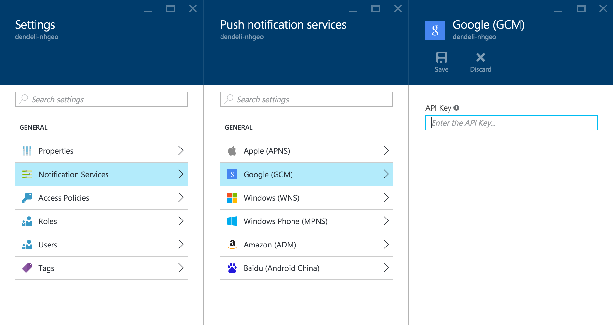
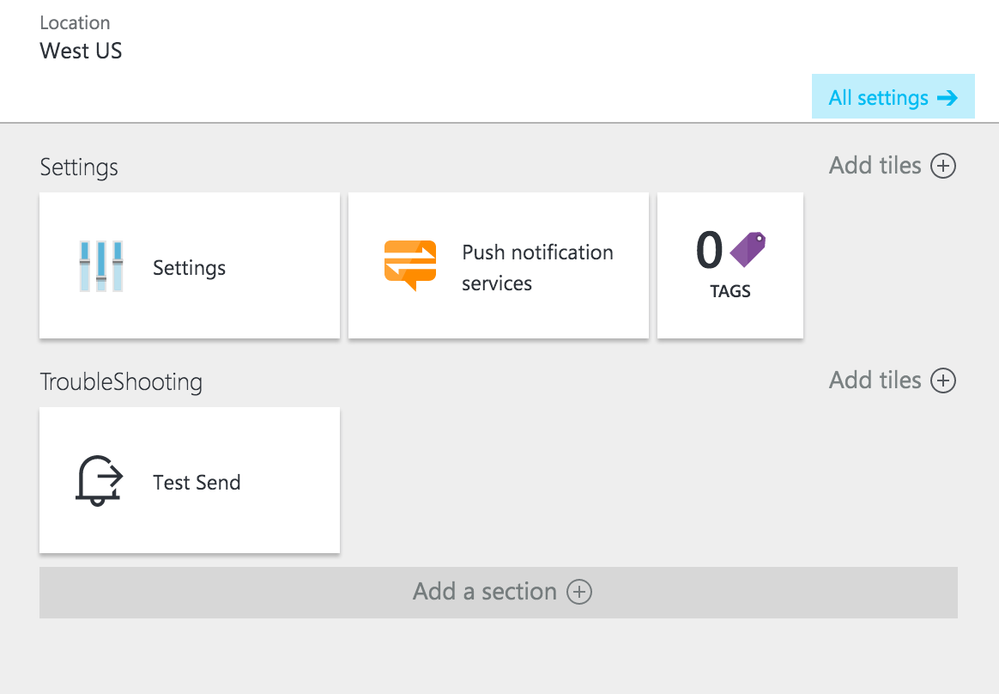

<properties
    pageTitle="Senden von Pushbenachrichtigungen zu Android mit Azure Benachrichtigung Hubs | Microsoft Azure"
    description="In diesem Lernprogramm erfahren Sie, wie Azure Benachrichtigung Hubs um Pushbenachrichtigungen zu Android-Geräten verwenden."
    services="notification-hubs"
    documentationCenter="android"
    keywords="Pushbenachrichtigungen, der Pushbenachrichtigung, android Pushbenachrichtigung"
    authors="ysxu"
    manager="erikre"
    editor=""/>
<tags
    ms.service="notification-hubs"
    ms.workload="mobile"
    ms.tgt_pltfrm="mobile-android"
    ms.devlang="java"
    ms.topic="hero-article"
    ms.date="07/05/2016"
    ms.author="yuaxu"/>

# Senden von Pushbenachrichtigungen zu Android mit Azure Benachrichtigung Hubs

[AZURE.INCLUDE [notification-hubs-selector-get-started](../../includes/notification-hubs-selector-get-started.md)]

##(Übersicht)

> [AZURE.IMPORTANT] Dieses Thema veranschaulicht Pushbenachrichtigungen mit Google Cloud Messaging (GCM). Wenn Sie Google Firebase Cloud Messaging (FCM) verwenden, finden Sie unter [Senden von Pushbenachrichtigungen zu Android mit Azure Benachrichtigung Hubs und FCM](notification-hubs-android-push-notification-google-fcm-get-started.md).

In diesem Lernprogramm erfahren Sie, wie Azure Benachrichtigung Hubs um zur Anwendung Android Pushbenachrichtigungen zu senden.
Erstellen Sie eine leere Android-app, die Pushbenachrichtigungen empfängt mithilfe von Google Cloud Messaging (GCM).

[AZURE.INCLUDE [notification-hubs-hero-slug](../../includes/notification-hubs-hero-slug.md)]

Der vollständige Code für dieses Lernprogramms kann von GitHub heruntergeladen werden [können](https://github.com/Azure/azure-notificationhubs-samples/tree/master/Android/GetStarted).

##Erforderliche Komponenten

> [AZURE.IMPORTANT] Um dieses Lernprogramms abgeschlossen haben, müssen Sie ein aktives Azure-Konto verfügen. Wenn Sie kein Konto haben, können Sie ein kostenloses Testversion Konto nur wenigen Minuten erstellen. Weitere Informationen finden Sie unter [Azure kostenlose Testversion](https://azure.microsoft.com/pricing/free-trial/?WT.mc_id=A643EE910&amp;returnurl=http%3A%2F%2Fazure.microsoft.com%2Fen-us%2Fdocumentation%2Farticles%2Fnotification-hubs-android-get-started).

Zusätzlich zu einem aktiven Azure-Konto weiter oben erwähnten erfordert dieses Lernprogramms nur die neueste Version von [Android Studio](http://go.microsoft.com/fwlink/?LinkId=389797)aus.

In diesem Lernprogramm durchführen ist eine Voraussetzung für alle anderen Benachrichtigung Hubs Lernprogramme für Android-apps.

##Erstellen eines Projekts, die unterstützt Google Cloud Messaging

[AZURE.INCLUDE [mobile-services-enable-Google-cloud-messaging](../../includes/mobile-services-enable-google-cloud-messaging.md)]

##Konfigurieren Sie einen neuen Benachrichtigung hub

[AZURE.INCLUDE [notification-hubs-portal-create-new-hub](../../includes/notification-hubs-portal-create-new-hub.md)]

&emsp;&emsp;6. Wählen Sie in den **Einstellungen** Blade **Benachrichtigungsdienst** und **Google (GCM)**aus. Geben Sie die API-Taste, und klicken Sie auf **Speichern**.

&emsp;&emsp;

Ihre Benachrichtigung Hub ist jetzt so konfiguriert, dass die Arbeit mit GCM, und Sie haben die Verbindungszeichenfolgen zum Registrieren der app, um Pushbenachrichtigungen zu senden und empfangen.

##Herstellen einer Verbindung im Infobereich Hub mit der app

###Erstellen eines neuen Projekts für Android

1. Starten Sie in Android Studio ein neues Android Studio-Projekt aus.

    ![Android Studio - Projekt][13]

2. Wählen Sie das Formularfaktor **Mobiltelefone und Tablets** und das **Minimum SDK** , die unterstützt werden soll. Klicken Sie dann auf **Weiter**.

    ![Android Studio - Erstellung Projektworkflow][14]

3. Wählen Sie die wichtigsten Aktivität **Leere Aktivität** , klicken Sie auf **Weiter**, und klicken Sie dann auf **Fertig stellen**.

###Hinzufügen von Google Play Services zum Projekt

[AZURE.INCLUDE [Add Play Services](../../includes/notification-hubs-android-studio-add-google-play-services.md)]

###Hinzufügen von Azure Benachrichtigung Hubs Bibliotheken

1. In der `Build.Gradle` für die **app**-Datei, fügen Sie die folgenden Zeilen im Abschnitt **Abhängigkeiten** .

        compile 'com.microsoft.azure:notification-hubs-android-sdk:0.4@aar'
        compile 'com.microsoft.azure:azure-notifications-handler:1.0.1@aar'

2. Fügen Sie das folgende Repository nach dem Abschnitt **Abhängigkeiten** hinzu.

        repositories {
            maven {
                url "http://dl.bintray.com/microsoftazuremobile/SDK"
            }
        }

### Aktualisieren der AndroidManifest.xml.

1. Zur Unterstützung von GCM müssen wir einen Instanz-ID-Dienst Zuhörer in unserem Code Implementieren der [Registrierung Token erhalten](https://developers.google.com/cloud-messaging/android/client#sample-register) mithilfe [Googles Instanz-ID-API](https://developers.google.com/instance-id/)verwendet wird. In diesem Lernprogramm werden wir nennen Sie die Klasse `MyInstanceIDService`. 
 
    Fügen Sie die folgende Service-Definition zu der Datei AndroidManifest.xml innerhalb der `<application>` Kategorie. Ersetzen der `<your package>` Platzhalter mit der der ist-Paket Bankname am oberen Rand der `AndroidManifest.xml` Datei.

        <service android:name="<your package>.MyInstanceIDService" android:exported="false">
            <intent-filter>
                <action android:name="com.google.android.gms.iid.InstanceID"/>
            </intent-filter>
        </service>

2. Nachdem wir unsere GCM Registrierung Token aus der Instanz-ID-API erhalten haben, verwenden wir es [mit dem Azure-Hub Benachrichtigung](notification-hubs-push-notification-registration-management.md)registrieren. Werden unterstützt, wir diese Registrierung im Hintergrund mithilfe einer `IntentService` mit dem Namen `RegistrationIntentService`. Dieser Dienst wird auch für die [Aktualisierung unserer GCM Registrierung Token](https://developers.google.com/instance-id/guides/android-implementation#refresh_tokens)verantwortlich sein.
 
    Fügen Sie die folgende Service-Definition zu der Datei AndroidManifest.xml innerhalb der `<application>` Kategorie. Ersetzen der `<your package>` Platzhalter mit der der ist-Paket Bankname am oberen Rand der `AndroidManifest.xml` Datei. 

        <service
            android:name="<your package>.RegistrationIntentService"
            android:exported="false">
        </service>

3. Wir werden auch einen Empfänger, benachrichtigt zu definieren. Fügen Sie die folgende Empfänger-Definition zu der Datei AndroidManifest.xml innerhalb der `<application>` Kategorie. Ersetzen der `<your package>` Platzhalter mit der der ist-Paket Bankname am oberen Rand der `AndroidManifest.xml` Datei.

        <receiver android:name="com.microsoft.windowsazure.notifications.NotificationsBroadcastReceiver"
            android:permission="com.google.android.c2dm.permission.SEND">
            <intent-filter>
                <action android:name="com.google.android.c2dm.intent.RECEIVE" />
                <category android:name="<your package name>" />
            </intent-filter>
        </receiver>

4. Fügen Sie den folgenden erforderlichen GCM Zusammenhang Berechtigungen unten im `</application>` Kategorie. Denken Sie daran `<your package>` mit dem Paketnamen angezeigt, die am oberen Rand der `AndroidManifest.xml` Datei.

    Weitere Informationen zu diesen Berechtigungen finden Sie unter [Einrichten eine GCM-Client-app für Android bestehen](https://developers.google.com/cloud-messaging/android/client#manifest).

        <uses-permission android:name="android.permission.INTERNET"/>
        <uses-permission android:name="android.permission.GET_ACCOUNTS"/>
        <uses-permission android:name="android.permission.WAKE_LOCK"/>
        <uses-permission android:name="com.google.android.c2dm.permission.RECEIVE" />

        <permission android:name="<your package>.permission.C2D_MESSAGE" android:protectionLevel="signature" />
        <uses-permission android:name="<your package>.permission.C2D_MESSAGE"/>

### Hinzufügen von code

1. Erweitern Sie in der Projektansicht **app** > **Src** > **Hauptfenster** > **Java**. Mit der rechten Maustaste in Ihrem Paket Ordners unter **Java**, klicken Sie auf **neu**, und klicken Sie dann auf **Java-Klasse**. Fügen Sie eine neue Klasse mit dem Namen `NotificationSettings`. 

    ![Android Studio - neue Java-Klasse][6]

    Stellen Sie sicher, dass die folgenden drei aktualisiert Platzhaltern in den folgenden Code für die `NotificationSettings` Klasse:
    * **SenderId**: Nummer des Projekts, die Sie zuvor in der [Cloud-Konsole von Google](http://cloud.google.com/console)für Ihren Kunden.
    * **HubListenConnectionString**: die Verbindungszeichenfolge **DefaultListenAccessSignature** für Ihre Hub. Sie können die Verbindungszeichenfolge, indem Sie die **Access-Richtlinien** auf Falz **Einstellungen** der Hub im [Portal Azure]kopieren.
    * **HubName**: Verwenden Sie den Namen der Benachrichtigung Hub das vorher Hub in der [Azure-Portal]angezeigt wird.

    `NotificationSettings`Code:

        public class NotificationSettings {
            public static String SenderId = "<Your project number>";
            public static String HubName = "<Your HubName>";
            public static String HubListenConnectionString = "<Your default listen connection string>";
        }

2. Mit den oben aufgeführten Schritten fügen Sie eine weitere Klasse mit dem Namen `MyInstanceIDService`. Dies wird unsere Implementierung Instanz-ID Zuhörer Service sein.

    Der Code für diese Klasse ruft unsere `IntentService` im Hintergrund [das Token GCM aktualisieren](https://developers.google.com/instance-id/guides/android-implementation#refresh_tokens) .

        import android.content.Intent;
        import android.util.Log;
        import com.google.android.gms.iid.InstanceIDListenerService;
        
        
        public class MyInstanceIDService extends InstanceIDListenerService {
        
            private static final String TAG = "MyInstanceIDService";
        
            @Override
            public void onTokenRefresh() {
        
                Log.i(TAG, "Refreshing GCM Registration Token");
        
                Intent intent = new Intent(this, RegistrationIntentService.class);
                startService(intent);
            }
        };

3. Hinzufügen einer anderen neuen Klasse zu einem Projekt mit dem Namen, `RegistrationIntentService`. Dadurch werden die Implementierung für unsere `IntentService` behandelt, die [das Token GCM aktualisieren](https://developers.google.com/instance-id/guides/android-implementation#refresh_tokens) und [mit dem Hub Benachrichtigung registrieren](notification-hubs-push-notification-registration-management.md).

    Verwenden Sie den folgenden Code für diese Klasse.

        import android.app.IntentService;
        import android.content.Intent;
        import android.content.SharedPreferences;
        import android.preference.PreferenceManager;
        import android.util.Log;
        
        import com.google.android.gms.gcm.GoogleCloudMessaging;
        import com.google.android.gms.iid.InstanceID;
        import com.microsoft.windowsazure.messaging.NotificationHub;
        
        public class RegistrationIntentService extends IntentService {
        
            private static final String TAG = "RegIntentService";
        
            private NotificationHub hub;
        
            public RegistrationIntentService() {
                super(TAG);
            }
        
            @Override
            protected void onHandleIntent(Intent intent) {      
                SharedPreferences sharedPreferences = PreferenceManager.getDefaultSharedPreferences(this);
                String resultString = null;
                String regID = null;
        
                try {
                    InstanceID instanceID = InstanceID.getInstance(this);
                    String token = instanceID.getToken(NotificationSettings.SenderId,
                            GoogleCloudMessaging.INSTANCE_ID_SCOPE);        
                    Log.i(TAG, "Got GCM Registration Token: " + token);
        
                    // Storing the registration id that indicates whether the generated token has been
                    // sent to your server. If it is not stored, send the token to your server,
                    // otherwise your server should have already received the token.
                    if ((regID=sharedPreferences.getString("registrationID", null)) == null) {      
                        NotificationHub hub = new NotificationHub(NotificationSettings.HubName,
                                NotificationSettings.HubListenConnectionString, this);
                        Log.i(TAG, "Attempting to register with NH using token : " + token);

                        regID = hub.register(token).getRegistrationId();

                        // If you want to use tags...
                        // Refer to : https://azure.microsoft.com/en-us/documentation/articles/notification-hubs-routing-tag-expressions/
                        // regID = hub.register(token, "tag1", "tag2").getRegistrationId();

                        resultString = "Registered Successfully - RegId : " + regID;
                        Log.i(TAG, resultString);       
                        sharedPreferences.edit().putString("registrationID", regID ).apply();
                    } else {
                        resultString = "Previously Registered Successfully - RegId : " + regID;
                    }
                } catch (Exception e) {
                    Log.e(TAG, resultString="Failed to complete token refresh", e);
                    // If an exception happens while fetching the new token or updating our registration data
                    // on a third-party server, this ensures that we'll attempt the update at a later time.
                }
        
                // Notify UI that registration has completed.
                if (MainActivity.isVisible) {
                    MainActivity.mainActivity.ToastNotify(resultString);
                }
            }
        }

        
4. In Ihrer `MainActivity` Klasse, fügen Sie den folgenden `import` Aussagen über der Deklaration Class.

        import com.google.android.gms.common.ConnectionResult;
        import com.google.android.gms.common.GoogleApiAvailability;
        import com.google.android.gms.gcm.*;
        import com.microsoft.windowsazure.notifications.NotificationsManager;
        import android.util.Log;
        import android.widget.TextView;
        import android.widget.Toast;

5. Fügen Sie die folgenden privaten Member am oberen Rand der Klasse hinzu. Wir werden diese [überprüfen die Verfügbarkeit von Google wiedergeben Diensten wie von Google empfohlen](https://developers.google.com/android/guides/setup#ensure_devices_have_the_google_play_services_apk)verwenden.

        public static MainActivity mainActivity;
        public static Boolean isVisible = false;    
        private GoogleCloudMessaging gcm;
        private static final int PLAY_SERVICES_RESOLUTION_REQUEST = 9000;

6. In Ihrer `MainActivity` Klasse, fügen Sie die folgende Methode, um die Verfügbarkeit von wiedergeben Google-Diensten. 

        /**
         * Check the device to make sure it has the Google Play Services APK. If
         * it doesn't, display a dialog that allows users to download the APK from
         * the Google Play Store or enable it in the device's system settings.
         */
        private boolean checkPlayServices() {
            GoogleApiAvailability apiAvailability = GoogleApiAvailability.getInstance();
            int resultCode = apiAvailability.isGooglePlayServicesAvailable(this);
            if (resultCode != ConnectionResult.SUCCESS) {
                if (apiAvailability.isUserResolvableError(resultCode)) {
                    apiAvailability.getErrorDialog(this, resultCode, PLAY_SERVICES_RESOLUTION_REQUEST)
                            .show();
                } else {
                    Log.i(TAG, "This device is not supported by Google Play Services.");
                    ToastNotify("This device is not supported by Google Play Services.");
                    finish();
                }
                return false;
            }
            return true;
        }

7. In Ihrer `MainActivity` Klasse, fügen Sie den folgenden Code ein, die für die Wiedergabe Google-Diensten vor dem Aufrufen überprüft Ihre `IntentService` Ihre Registrierung GCM token abrufen und mit Ihrem Hub Benachrichtigung registrieren.

        public void registerWithNotificationHubs()
        {
            Log.i(TAG, " Registering with Notification Hubs");
    
            if (checkPlayServices()) {
                // Start IntentService to register this application with GCM.
                Intent intent = new Intent(this, RegistrationIntentService.class);
                startService(intent);
            }
        }

8. In der `OnCreate` der Methode der `MainActivity` Klasse, fügen Sie den folgenden Code ein, um die Registrierung zu starten, wenn die Aktivität erstellt wird.

        @Override
        protected void onCreate(Bundle savedInstanceState) {
            super.onCreate(savedInstanceState);
            setContentView(R.layout.activity_main);
    
            mainActivity = this;
            NotificationsManager.handleNotifications(this, NotificationSettings.SenderId, MyHandler.class);
            registerWithNotificationHubs();
        }

9. Diese zusätzlichen Methoden zum Hinzufügen der `MainActivity` zur Überprüfung des app-Status und Status in Ihrer app.

        @Override
        protected void onStart() {
            super.onStart();
            isVisible = true;
        }
    
        @Override
        protected void onPause() {
            super.onPause();
            isVisible = false;
        }
    
        @Override
        protected void onResume() {
            super.onResume();
            isVisible = true;
        }
    
        @Override
        protected void onStop() {
            super.onStop();
            isVisible = false;
        }
    
        public void ToastNotify(final String notificationMessage) {
            runOnUiThread(new Runnable() {
                @Override
                public void run() {
                    Toast.makeText(MainActivity.this, notificationMessage, Toast.LENGTH_LONG).show();
                    TextView helloText = (TextView) findViewById(R.id.text_hello);
                    helloText.setText(notificationMessage);
                }
            });
        }

10. Die `ToastNotify` Methode verwendet die *"Hallo Welt"* `TextView` Steuerelements nach Berichtstatus und Benachrichtigungen dauerhaft in der app. Layout activity_main.xml fügen Sie die folgenden Id für dieses Steuerelement hinzu.

        android:id="@+id/text_hello"

11. Als Nächstes werden wir eine Unterklasse für unsere Empfänger hinzufügen, die wir in der AndroidManifest.xml definiert. Hinzufügen einer anderen neuen Klasse zu einem Projekt mit dem Namen `MyHandler`.

12. Fügen Sie am oberen Rand die folgenden Aussagen importieren `MyHandler.java`:

        import android.app.NotificationManager;
        import android.app.PendingIntent;
        import android.content.Context;
        import android.content.Intent;
        import android.os.Bundle;
        import android.support.v4.app.NotificationCompat;
        import com.microsoft.windowsazure.notifications.NotificationsHandler;

13. Fügen Sie den folgenden Code für die `MyHandler` Class, wodurch es eine Unterklasse von `com.microsoft.windowsazure.notifications.NotificationsHandler`.

    Dieser Code überschreibt die `OnReceive` Methode, damit der Ereignishandler Benachrichtigungen Berichten wird, die empfangen werden. Der Ereignishandler sendet auch der Pushbenachrichtigung an die Manager Android Benachrichtigung mithilfe der `sendNotification()` Methode. Die `sendNotification()` Methode ausgeführt werden soll, wenn die app nicht ausgeführt wird und eine Benachrichtigung empfangen wird.

        public class MyHandler extends NotificationsHandler {
            public static final int NOTIFICATION_ID = 1;
            private NotificationManager mNotificationManager;
            NotificationCompat.Builder builder;
            Context ctx;
        
            @Override
            public void onReceive(Context context, Bundle bundle) {
                ctx = context;
                String nhMessage = bundle.getString("message");
                sendNotification(nhMessage);
                if (MainActivity.isVisible) {
                    MainActivity.mainActivity.ToastNotify(nhMessage);
                }
            }
        
            private void sendNotification(String msg) {
        
                Intent intent = new Intent(ctx, MainActivity.class);
                intent.addFlags(Intent.FLAG_ACTIVITY_CLEAR_TOP);
        
                mNotificationManager = (NotificationManager)
                        ctx.getSystemService(Context.NOTIFICATION_SERVICE);
        
                PendingIntent contentIntent = PendingIntent.getActivity(ctx, 0,
                        intent, PendingIntent.FLAG_ONE_SHOT);
        
                Uri defaultSoundUri = RingtoneManager.getDefaultUri(RingtoneManager.TYPE_NOTIFICATION);
                NotificationCompat.Builder mBuilder =
                        new NotificationCompat.Builder(ctx)
                                .setSmallIcon(R.mipmap.ic_launcher)
                                .setContentTitle("Notification Hub Demo")
                                .setStyle(new NotificationCompat.BigTextStyle()
                                        .bigText(msg))
                                .setSound(defaultSoundUri)
                                .setContentText(msg);
        
                mBuilder.setContentIntent(contentIntent);
                mNotificationManager.notify(NOTIFICATION_ID, mBuilder.build());
            }
        }

14. Klicken Sie in Android Studio in der Menüleiste auf **Erstellen** > **Projekt neu zu erstellen** , um sicherzustellen, dass keine Fehler im Code vorhanden sind.

##Senden von Pushbenachrichtigungen

Testen Sie Pushbenachrichtigungen in Ihrer app per, über das [Portal Azure] - Aussehen für den Abschnitt " **Problembehandlung** " in das Blade Hub empfangen, wie unten dargestellt.

[AZURE.INCLUDE [notification-hubs-sending-notifications-from-the-portal](../../includes/notification-hubs-sending-notifications-from-the-portal.md)]

## (Optional) Senden von Pushbenachrichtigungen direkt von der app

In der Regel würden Sie Benachrichtigungen mit einer Back-End-Server senden. In einigen Fällen möchten Sie möglicherweise Pushbenachrichtigungen direkt von der Clientanwendung gesendet werden. In diesem Abschnitt wird erläutert, wie der Client mithilfe der [Azure Benachrichtigung Hub REST-API](https://msdn.microsoft.com/library/azure/dn223264.aspx)Benachrichtigungen senden.

1. Erweitern Sie Android Studio Projektansicht **App** > **Src** > **Hauptfenster** > **Auflösung** > **Layout**. Öffnen der `activity_main.xml` Layout-Datei, und klicken Sie auf den **Text** tab, um den Text-Inhalt der Datei zu aktualisieren. Aktualisieren Sie ihn mit den folgenden Code die neue hinzufügt `Button` und `EditText` Steuerelemente zum Senden von Pushbenachrichtigungen Benachrichtigungsnachrichten an den Hub Benachrichtigung. Fügen Sie diesen Code unmittelbar vor dem unten `</RelativeLayout>`.

        <Button
        android:layout_width="wrap_content"
        android:layout_height="wrap_content"
        android:text="@string/send_button"
        android:id="@+id/sendbutton"
        android:layout_centerVertical="true"
        android:layout_centerHorizontal="true"
        android:onClick="sendNotificationButtonOnClick" />

        <EditText
        android:layout_width="match_parent"
        android:layout_height="wrap_content"
        android:id="@+id/editTextNotificationMessage"
        android:layout_above="@+id/sendbutton"
        android:layout_centerHorizontal="true"
        android:layout_marginBottom="42dp"
        android:hint="@string/notification_message_hint" />

2. Erweitern Sie Android Studio Projektansicht **App** > **Src** > **Hauptfenster** > **Auflösung** > **Werte**. Öffnen der `strings.xml` Datei, und fügen Sie die Zeichenfolgenwerte, die mit dem neuen verwiesen wird, `Button` und `EditText` Steuerelemente. Fügen Sie diese am unteren Rand der Datei unmittelbar vor dem `</resources>`.

        <string name="send_button">Send Notification</string>
        <string name="notification_message_hint">Enter notification message text</string>

3. In Ihre `NotificationSetting.java` ablegen, fügen Sie die folgende Einstellung für die `NotificationSettings` Class.

    Update `HubFullAccess` mit der Verbindungszeichenfolge **DefaultFullSharedAccessSignature** für Ihre Hub. Diese Verbindungszeichenfolge kann vom [Azure-Portal] , indem Sie die **Access-Richtlinien** auf das Blade **Einstellungen** für Ihre Benachrichtigung Hub kopiert werden.

        public static String HubFullAccess = "<Enter Your DefaultFullSharedAccess Connection string>";

4. In Ihre `MainActivity.java` ablegen, fügen Sie den folgenden `import` genannten Aussagen der `MainActivity` Class.

        import java.io.BufferedOutputStream;
        import java.io.BufferedReader;
        import java.io.InputStreamReader;
        import java.io.OutputStream;
        import java.net.HttpURLConnection;
        import java.net.URL;
        import java.net.URLEncoder;
        import javax.crypto.Mac;
        import javax.crypto.spec.SecretKeySpec;
        import android.util.Base64;
        import android.view.View;
        import android.widget.EditText;

6. In Ihre `MainActivity.java` ablegen, fügen Sie die folgenden Mitglieder am Anfang der der `MainActivity` Class.  

        private String HubEndpoint = null;
        private String HubSasKeyName = null;
        private String HubSasKeyValue = null;

6. Sie müssen ein Token Software Access Signatur (SaS) zum Authentifizieren einer Anforderung Beitrag zum Senden von Nachrichten an Ihre Benachrichtigung Verteiler erstellen. Dies ist durch Analyse der wichtigsten Daten aus der Verbindungszeichenfolge klicken und dann das Token SaS erstellen, wie die [Allgemeine Konzepte](http://msdn.microsoft.com/library/azure/dn495627.aspx) REST-API-Referenz angegeben. Der folgende Code ist ein Beispiel für eine Implementierung.

    In `MainActivity.java`, folgende Methode zum Hinzufügen der `MainActivity` Klasse zum Analysieren der Verbindungszeichenfolge.

        /**
         * Example code from http://msdn.microsoft.com/library/azure/dn495627.aspx
         * to parse the connection string so a SaS authentication token can be
         * constructed.
         *
         * @param connectionString This must be the DefaultFullSharedAccess connection
         *                         string for this example.
         */
        private void ParseConnectionString(String connectionString)
        {
            String[] parts = connectionString.split(";");
            if (parts.length != 3)
                throw new RuntimeException("Error parsing connection string: "
                        + connectionString);
    
            for (int i = 0; i < parts.length; i++) {
                if (parts[i].startsWith("Endpoint")) {
                    this.HubEndpoint = "https" + parts[i].substring(11);
                } else if (parts[i].startsWith("SharedAccessKeyName")) {
                    this.HubSasKeyName = parts[i].substring(20);
                } else if (parts[i].startsWith("SharedAccessKey")) {
                    this.HubSasKeyValue = parts[i].substring(16);
                }
            }
        }

7. In `MainActivity.java`, folgende Methode zum Hinzufügen der `MainActivity` Klasse, um ein SAS-Authentifizierungstoken zu erstellen.

        /**
         * Example code from http://msdn.microsoft.com/library/azure/dn495627.aspx to
         * construct a SaS token from the access key to authenticate a request.
         *
         * @param uri The unencoded resource URI string for this operation. The resource
         *            URI is the full URI of the Service Bus resource to which access is
         *            claimed. For example,
         *            "http://<namespace>.servicebus.windows.net/<hubName>"
         */
        private String generateSasToken(String uri) {
    
            String targetUri;
            String token = null;
            try {
                targetUri = URLEncoder
                        .encode(uri.toString().toLowerCase(), "UTF-8")
                        .toLowerCase();
    
                long expiresOnDate = System.currentTimeMillis();
                int expiresInMins = 60; // 1 hour
                expiresOnDate += expiresInMins * 60 * 1000;
                long expires = expiresOnDate / 1000;
                String toSign = targetUri + "\n" + expires;
    
                // Get an hmac_sha1 key from the raw key bytes
                byte[] keyBytes = HubSasKeyValue.getBytes("UTF-8");
                SecretKeySpec signingKey = new SecretKeySpec(keyBytes, "HmacSHA256");
    
                // Get an hmac_sha1 Mac instance and initialize with the signing key
                Mac mac = Mac.getInstance("HmacSHA256");
                mac.init(signingKey);
    
                // Compute the hmac on input data bytes
                byte[] rawHmac = mac.doFinal(toSign.getBytes("UTF-8"));
    
                // Using android.util.Base64 for Android Studio instead of
                // Apache commons codec
                String signature = URLEncoder.encode(
                        Base64.encodeToString(rawHmac, Base64.NO_WRAP).toString(), "UTF-8");
    
                // Construct authorization string
                token = "SharedAccessSignature sr=" + targetUri + "&sig="
                        + signature + "&se=" + expires + "&skn=" + HubSasKeyName;
            } catch (Exception e) {
                if (isVisible) {
                    ToastNotify("Exception Generating SaS : " + e.getMessage().toString());
                }
            }
    
            return token;
        }

8. In `MainActivity.java`, folgende Methode zum Hinzufügen der `MainActivity` Klasse behandeln der **Benachrichtigung senden** -Schaltfläche klicken, und senden Sie die Benachrichtigung Pushbenachrichtigungen an den Hub mithilfe der integrierten REST-API.

        /**
         * Send Notification button click handler. This method parses the
         * DefaultFullSharedAccess connection string and generates a SaS token. The
         * token is added to the Authorization header on the POST request to the
         * notification hub. The text in the editTextNotificationMessage control
         * is added as the JSON body for the request to add a GCM message to the hub.
         *
         * @param v
         */
        public void sendNotificationButtonOnClick(View v) {
            EditText notificationText = (EditText) findViewById(R.id.editTextNotificationMessage);
            final String json = "{\"data\":{\"message\":\"" + notificationText.getText().toString() + "\"}}";
    
            new Thread()
            {
                public void run()
                {
                    try
                    {
                        // Based on reference documentation...
                        // http://msdn.microsoft.com/library/azure/dn223273.aspx
                        ParseConnectionString(NotificationSettings.HubFullAccess);
                        URL url = new URL(HubEndpoint + NotificationSettings.HubName +
                                "/messages/?api-version=2015-01");
    
                        HttpURLConnection urlConnection = (HttpURLConnection)url.openConnection();
    
                        try {
                            // POST request
                            urlConnection.setDoOutput(true);
    
                            // Authenticate the POST request with the SaS token
                            urlConnection.setRequestProperty("Authorization", 
                                generateSasToken(url.toString()));
    
                            // Notification format should be GCM
                            urlConnection.setRequestProperty("ServiceBusNotification-Format", "gcm");
    
                            // Include any tags
                            // Example below targets 3 specific tags
                            // Refer to : https://azure.microsoft.com/en-us/documentation/articles/notification-hubs-routing-tag-expressions/
                            // urlConnection.setRequestProperty("ServiceBusNotification-Tags", 
                            //      "tag1 || tag2 || tag3");
    
                            // Send notification message
                            urlConnection.setFixedLengthStreamingMode(json.length());
                            OutputStream bodyStream = new BufferedOutputStream(urlConnection.getOutputStream());
                            bodyStream.write(json.getBytes());
                            bodyStream.close();
    
                            // Get reponse
                            urlConnection.connect();
                            int responseCode = urlConnection.getResponseCode();
                            if ((responseCode != 200) && (responseCode != 201)) {
                                BufferedReader br = new BufferedReader(new InputStreamReader((urlConnection.getErrorStream())));
                                String line;
                                StringBuilder builder = new StringBuilder("Send Notification returned " +
                                        responseCode + " : ")  ;
                                while ((line = br.readLine()) != null) {
                                    builder.append(line);
                                }

                                ToastNotify(builder.toString());
                            }
                        } finally {
                            urlConnection.disconnect();
                        }
                    }
                    catch(Exception e)
                    {
                        if (isVisible) {
                            ToastNotify("Exception Sending Notification : " + e.getMessage().toString());
                        }
                    }
                }
            }.start();
        }

##Testen Ihre app

####Pushbenachrichtigungen im emulator

Wenn Sie Pushbenachrichtigungen innerhalb eines Emulators testen möchten, stellen Sie sicher, dass Ihre Emulatorabbild Google-API-Ebene unterstützt, die Sie für Ihre app ignoriert. Wenn das Bild einer systemeigenen Google-APIs nicht unterstützt, Sie werden am Ende der **Dienst\_nicht\_verfügbar** Ausnahme.

Stellen Sie sicher, dass Sie Ihre laufenden Emulator unter **Einstellungen für**Ihr Google-Konto hinzugefügt haben, außer den oben genannten > **Konten**. Andernfalls Ihrer Versuche, mit GCM registrieren können dies die **Authentifizierung\_fehlgeschlagen** Ausnahme.

####Ausführen der Anwendung

1. Führen Sie die app, und beachten Sie, dass die Registrierung-ID für eine erfolgreiche Registrierung gemeldet wird.

    ![Klicken Sie auf Android - Registrierung von testen][18]

2. Geben Sie eine Benachrichtigung an alle Android-Geräten gesendet werden, die mit dem Hub registriert haben.

    ![Testen auf Android - Senden einer Nachricht][19]

3. Drücken Sie die **Benachrichtigung senden**. Zeigt alle Geräte, die die app ausgeführt haben ein `AlertDialog` Instanz mit der Benachrichtigung Pushbenachrichtigungen. Geräte, die nicht die app ausgeführt haben, aber wurden bereits registriert für Pushbenachrichtigungen erhalten eine Benachrichtigung in der Benachrichtigung Android-Manager. Personen können durch Wischen nach unten in der oberen linken Ecke angezeigt werden.

    ![Klicken Sie auf Android - Benachrichtigungen testen][21]

##Nächste Schritte

Wir empfehlen des Lernprogramms [Verwenden Benachrichtigung Hubstandorte Pushbenachrichtigungen für Benutzer] im nächsten Schritt aus. Es werden Informationen zum Senden von Benachrichtigungen aus einer ASP.NET Back-End-Verwendung von Tags für bestimmte Benutzer adressieren angezeigt.

Wenn Sie Ihre Benutzer Zinsen gruppenweise segmentieren möchten, schauen Sie sich das Lernprogramm [Verwenden Benachrichtigung Hubs auf dem neusten Stand zu senden] .

Finden Sie weitere allgemeine Informationen zu Benachrichtigung Hubs in der [Benachrichtigung Hubs Anleitungen].

<!-- Images. -->
[6]: ./media/notification-hubs-android-get-started/notification-hub-android-new-class.png

[12]: ./media/notification-hubs-android-get-started/notification-hub-connection-strings.png

[13]: ./media/notification-hubs-android-get-started/notification-hubs-android-studio-new-project.png
[14]: ./media/notification-hubs-android-get-started/notification-hubs-android-studio-choose-form-factor.png
[15]: ./media/notification-hubs-android-get-started/notification-hub-create-android-app4.png
[16]: ./media/notification-hubs-android-get-started/notification-hub-create-android-app5.png
[17]: ./media/notification-hubs-android-get-started/notification-hub-create-android-app6.png

[18]: ./media/notification-hubs-android-get-started/notification-hubs-android-studio-registered.png
[19]: ./media/notification-hubs-android-get-started/notification-hubs-android-studio-set-message.png

[20]: ./media/notification-hubs-android-get-started/notification-hub-create-console-app.png
[21]: ./media/notification-hubs-android-get-started/notification-hubs-android-studio-received-message.png
[22]: ./media/notification-hubs-android-get-started/notification-hub-scheduler1.png
[23]: ./media/notification-hubs-android-get-started/notification-hub-scheduler2.png
[29]: ./media/mobile-services-android-get-started-push/mobile-eclipse-import-Play-library.png

[30]: ./media/notification-hubs-android-get-started/notification-hubs-debug-hub-gcm.png

[31]: ./media/notification-hubs-android-get-started/notification-hubs-android-studio-add-ui.png

<!-- URLs. -->
[Get started with push notifications in Mobile Services]: ../mobile-services-javascript-backend-android-get-started-push.md  
[Mobile Services Android SDK]: https://go.microsoft.com/fwLink/?LinkID=280126&clcid=0x409
[Referencing a library project]: http://go.microsoft.com/fwlink/?LinkId=389800
[Azure Classic Portal]: https://manage.windowsazure.com/
[Benachrichtigung Hubs Anleitungen]: http://msdn.microsoft.com/library/jj927170.aspx
[Verwenden Sie die Benachrichtigung Hubs um Pushbenachrichtigungen für Benutzer]: notification-hubs-aspnet-backend-gcm-android-push-to-user-google-notification.md
[Verwenden Sie die Benachrichtigung Hubs auf dem neusten Stand zu senden]: notification-hubs-aspnet-backend-android-xplat-segmented-gcm-push-notification.md
[Azure-Portal]: https://portal.azure.com
