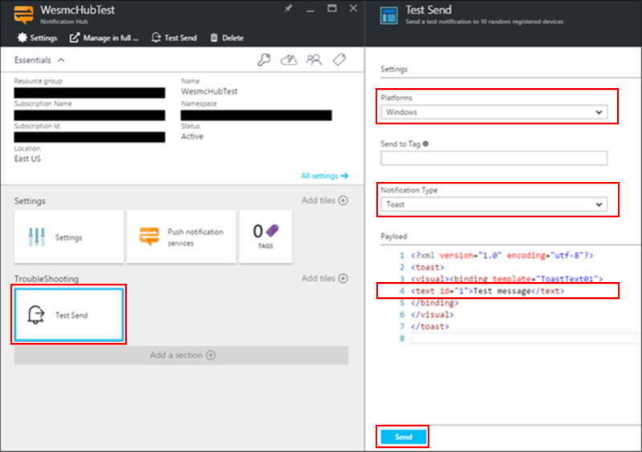

<properties
    pageTitle="Erste Schritte mit Azure Benachrichtigung Hubs mit Baidu | Microsoft Azure"
    description="In diesem Lernprogramm erfahren Sie, wie Azure Benachrichtigung Hubs um Pushbenachrichtigungen zu Android-Geräten mit Baidu verwenden."
    services="notification-hubs"
    documentationCenter="android"
    authors="ysxu"
    manager="dwrede"
    editor=""/>

<tags
    ms.service="notification-hubs"
    ms.devlang="java"
    ms.topic="hero-article"
    ms.tgt_pltfrm="mobile-baidu"
    ms.workload="mobile"
    ms.date="08/19/2016"
    ms.author="yuaxu"/>

# Erste Schritte mit Benachrichtigung Hubs mit Baidu

[AZURE.INCLUDE [notification-hubs-selector-get-started](../../includes/notification-hubs-selector-get-started.md)]

##(Übersicht)

Baidu Cloud Pushbenachrichtigungen ist eine Chinesisch Cloud-Dienst, den Sie zum Senden von Pushbenachrichtigungen für mobile Geräte verwenden können. Dieser Dienst ist besonders hilfreich, China, wobei Bereitstellung von Pushbenachrichtigungen für Android ist komplexer aufgrund von verschiedenen app Stores und Pushbenachrichtigungen Services, über die Verfügbarkeit von Android-Geräten, die nicht in der Regel mit GCM (Google Cloud Messaging) verbunden sind.

##Erforderliche Komponenten

In diesem Lernprogramm benötigen Sie Folgendes:

+ Android SDK (davon ausgegangen, dass die Ellipse verwendet werden soll), das von der <a href="http://go.microsoft.com/fwlink/?LinkId=389797">Android-Website</a> heruntergeladen werden kann
+ [Android SDK Mobile-Diensten]
+ [Android SDK Baidu Pushbenachrichtigungen]

>[AZURE.NOTE] Um dieses Lernprogramms abgeschlossen haben, müssen Sie ein aktives Azure-Konto verfügen. Wenn Sie kein Konto haben, können Sie ein kostenloses Testversion Konto nur wenigen Minuten erstellen. Weitere Informationen finden Sie unter [Azure kostenlose Testversion](https://azure.microsoft.com/pricing/free-trial/?WT.mc_id=A0E0E5C02&amp;returnurl=http%3A%2F%2Fazure.microsoft.com%2Fen-us%2Fdocumentation%2Farticles%2Fnotification-hubs-baidu-get-started%2F).

##Erstellen Sie ein Konto Baidu

Um Baidu verwenden zu können, müssen Sie ein Konto Baidu verfügen. Wenn Sie bereits eine haben, melden Sie sich mit dem [Portal Baidu] , und fahren Sie mit dem nächsten Schritt fort. Andernfalls finden Sie die folgenden Schritte zum Erstellen eines Baidu-Konto ein.  

1. Wechseln Sie zum [Baidu Portal] , und klicken Sie auf den Link**登录**(**Login**). Klicken Sie auf**立即注册**, um das Konto Registrierung zu starten.

    ![][1]

2. Geben Sie die erforderlichen Informationen – Telefon/e-Mail-Adresse, Kennwort und Überprüfen von Code –, und klicken Sie auf **Anmeldung**.

    ![][2]

3. Sie können eine e-Mail-Nachricht an die e-Mail-Adresse gesendet werden, dass Sie mit einem Link zu Ihrem Konto Baidu aktivieren eingegeben haben.

    ![][3]

4. Melden Sie sich bei Ihrem e-Mail-Konto, öffnen Sie die Aktivierung Baidu, e-Mail-Nachrichten, und klicken Sie auf den Aktivierungshyperlink, um Ihr Konto Baidu aktivieren.

    ![][4]

Nachdem Sie ein aktivierten Baidu-Konto verfügen, melden Sie sich mit dem [Portal Baidu].

##Registrieren Sie sich als Entwickler Baidu

1. Nachdem Sie sich mit dem [Baidu Portal]angemeldet haben, klicken Sie auf**更多 >>** (**Weitere**).

    ![][5]

2. Führen Sie einen Bildlauf nach unten im Abschnitt**站长与开发者服务 (Webmastertools und Developer Services)** , und klicken Sie auf**百度开放云平台**(**Baidu öffnen Cloud-Plattform**).

    ![][6]

3. Klicken Sie auf der nächsten Seite auf**开发者服务**(**Developer Services**) in der oberen rechten Ecke.

    ![][7]

4. Klicken Sie auf der nächsten Seite aus dem Menü in der oberen rechten Ecke auf**注册开发者**(**Entwickler registriert**).

    ![][8]

5. Geben Sie Ihren Namen, einer Beschreibung und einer Rufnummer für den Empfang von Textnachricht Überprüfung, und klicken Sie dann auf**送验证码**(**Senden Überprüfungscode**). Beachten Sie, dass für internationale Telefonnummern zu erhalten, Sie den Ländercode in Klammern setzen müssen. Zum Beispiel für eine Anzahl Vereinigten Staaten werden **(1) 1234567890**.

    ![][9]

6. Sie sollten mit einer Zahl Überprüfung, klicken Sie dann eine Textnachricht erhalten, wie im folgenden Beispiel gezeigt:

    ![][10]

7. Geben Sie die Anzahl der Überprüfung aus der Nachricht in**验证码**(**Bestätigungscode**) ein.

8. Führen Sie schließlich die Registrierung Entwicklertools indem der Baidu Zustimmung, und dann auf**提交**(**Absenden**). Sie sehen die folgende Seite auf erfolgreichen Abschluss der Registrierung:

    ![][11]

##Erstellen eines Baidu Cloud Pushbenachrichtigungen-Projekts

Wenn Sie ein Baidu Cloud Pushbenachrichtigungen Projekt erstellen, erhalten Sie Ihre app-ID-API-Taste gedrückt, und geheimen Schlüssel.

1. Nachdem Sie sich mit dem [Baidu Portal]angemeldet haben, klicken Sie auf**更多 >>** (**Weitere**).

    ![][5]

2. Führen Sie einen Bildlauf nach unten im Abschnitt**站长与开发者服务**(**Webmastertools und Developer Services**), und klicken Sie auf**百度开放云平台**(**Baidu öffnen Cloud-Plattform**).

    ![][6]

3. Klicken Sie auf der nächsten Seite auf**开发者服务**(**Developer Services**) in der oberen rechten Ecke.

    ![][7]

4. Klicken Sie auf der nächsten Seite auf**云推送**(**Cloud Pushbenachrichtigungen**) aus dem Abschnitt**云服务**(**Cloud Services**).

    ![][12]

5. Nachdem Sie ein Entwickler registriert sind, sehen Sie**管理控制台**(**Management Console**) am oberen Menü. Klicken Sie auf**开发者服务管理**(**Entwickler Servicemanagement**).

    ![][13]

6. Klicken Sie auf der nächsten Seite auf**创建工程**(**Projekt erstellen**).

    ![][14]

7. Geben Sie einen Anwendungsnamen, und klicken Sie auf**创建**(**Erstellen**).

    ![][15]

8. Nach der erfolgreichen Erstellung eines Projekts Pushbenachrichtigungen Cloud Baidu wird eine Seite mit **AppID**, **API-Schlüssel**und **Geheim Key**angezeigt. Notieren Sie die API und geheimen Schlüssel, den wir später verwenden möchten.

    ![][16]

9. Konfigurieren Sie das Projekt für Pushbenachrichtigungen, indem Sie**云推送**(**Cloud Pushbenachrichtigungen**) im linken Bereich auf.

    ![][31]

10. Klicken Sie auf der nächsten Seite klicken Sie auf die Schaltfläche**推送设置**(**Pushbenachrichtigungen Einstellungen**).

    ![][32]  

11. Fügen Sie auf der Konfigurationsseite der Paketname, werden im Projekt Android im Feld**应用包名**(**Paket Anwendung**) verwenden, und klicken Sie dann auf**保存设置**(**Speichern**).  

    ![][33]

Sie sehen die**保存成功!** (**erfolgreich gespeicherten!**) Nachricht.

##Konfigurieren Sie den Benachrichtigung hub

1. Melden Sie sich bei der [Klassischen Azure-Portal], und klicken Sie dann auf **+ neue** am unteren Rand des Bildschirms.

2. Klicken Sie auf **App-Dienste**, klicken Sie auf **Dienstbus**, klicken Sie auf die **Benachrichtigung Hub**und klicken Sie auf der **Symbolleiste erstellen**.

3. Geben Sie einen Namen für Ihre **Benachrichtigung Hub**, wählen Sie die **Region** und den **Namespace** , wo diese Benachrichtigung Hub erstellt werden, und klicken Sie dann auf **Erstellen einer neuen Benachrichtigung Hub**.  

    ![][17]

4. Klicken Sie auf den Namespace, in dem Sie Ihre Hub Benachrichtigung erstellt haben, und klicken Sie dann oben auf **Benachrichtigung Hubs** .

    ![][18]

5. Wählen Sie den Benachrichtigung Hub, den Sie erstellt haben, und klicken Sie dann im oberen Menü auf **Konfigurieren** .

    ![][19]

6. Führen Sie einen Bildlauf nach unten bis zum Abschnitt **Baidu Benachrichtigungseinstellungen** , und geben Sie die API und geheimen Schlüssel, den Sie von der Konsole Baidu zuvor für Projekt Pushbenachrichtigungen Cloud Baidu erzielt. Klicken Sie auf **Speichern**.

    ![][20]

7. Klicken Sie auf die Registerkarte **Dashboard** für den Hub Benachrichtigung oben, und klicken Sie dann auf **View Verbindungszeichenfolge**.

    ![][21]

8. Notieren Sie die **DefaultListenSharedAccessSignature** und **DefaultFullSharedAccessSignature** aus dem Fenster **Access-Verbindungsinformationen** .

    ![][22]

##Herstellen einer Verbindung im Infobereich Hub mit der app

1. In "Ellipse" ADT, erstellen Sie ein neues Projekt für Android (**Datei** > **neu** > **Projekt für Android-Anwendung**).

    ![][23]

2. Geben Sie einen **Namen der Anwendung** , und stellen Sie sicher, dass die **Minimal erforderlichen SDK** Version festgelegt wurde, **API 16: Android 4.1**.

    ![][24]

3. Klicken Sie auf **Weiter** , und führen Sie die folgenden Assistenten, bis das Fenster **Aktivität erstellen** wird angezeigt. Stellen Sie sicher, dass **Leere Aktivität** ausgewählt ist, und wählen Sie schließlich zum Erstellen einer neuen Android Anwendung **Fertig stellen** .

    ![][25]

4. Stellen Sie sicher, dass das **Projekt erstellen Ziel** richtig eingestellt ist.

    ![][26]

5. Laden Sie die Benachrichtigung-Hubs-0.4.jar-Datei aus der [Benachrichtigung-Hubs-Android-SDK Bintray klicken Sie auf](https://bintray.com/microsoftazuremobile/SDK/Notification-Hubs-Android-SDK/0.4)der Registerkarte **Dateien** . Fügen Sie die Datei in den Ordner **Bibliotheken** Ihres Projekts "Ellipse", und aktualisieren Sie den Ordner *Bibliotheken* .

6. Herunterladen und Entzippen Sie ihn der [Baidu Pushbenachrichtigungen Android SDK], öffnen Sie den Ordner für **Bibliotheken** und kopieren Sie dann die **Pushservice-x.y.z** JAR-Datei und die **Armeabi** & **Mips** Ordner in den Ordner **Bibliotheken** der Android Anwendung.

7. Öffnen Sie die Datei **AndroidManifest.xml** Ihres Projekts Android, und fügen Sie die Berechtigungen, die vom Baidu SDK erforderlich sind.

        <uses-permission android:name="android.permission.INTERNET" />
        <uses-permission android:name="android.permission.READ_PHONE_STATE" />
        <uses-permission android:name="android.permission.ACCESS_NETWORK_STATE" />
        <uses-permission android:name="android.permission.RECEIVE_BOOT_COMPLETED" />
        <uses-permission android:name="android.permission.WRITE_SETTINGS" />
        <uses-permission android:name="android.permission.VIBRATE" />
        <uses-permission android:name="android.permission.WRITE_EXTERNAL_STORAGE" />
        <uses-permission android:name="android.permission.DISABLE_KEYGUARD" />
        <uses-permission android:name="android.permission.ACCESS_COARSE_LOCATION" />
        <uses-permission android:name="android.permission.ACCESS_WIFI_STATE" />
        <uses-permission android:name="android.permission.ACCESS_DOWNLOAD_MANAGER" />
        <uses-permission android:name="android.permission.DOWNLOAD_WITHOUT_NOTIFICATION" />

8. Hinzufügen der **Android: Name** -Eigenschaft auf Ihrer **Anwendung** Element in **AndroidManifest.xml**, ersetzen *Ihr Projektname* (z. B. **com.example.BaiduTest**). Stellen Sie sicher, dass dieser Projektname entspricht, die Sie in der Verwaltungskonsole Baidu konfiguriert.

        <application android:name="yourprojectname.DemoApplication"

9. Fügen Sie die folgende Konfiguration innerhalb des Anwendungselements nach dem **hinzu. MainActivity** Aktivität Element, ersetzen *Ihr Projektname* (z. B. **com.example.BaiduTest**):

        <receiver android:name="yourprojectname.MyPushMessageReceiver">
            <intent-filter>
                <action android:name="com.baidu.android.pushservice.action.MESSAGE" />
                <action android:name="com.baidu.android.pushservice.action.RECEIVE" />
                <action android:name="com.baidu.android.pushservice.action.notification.CLICK" />
            </intent-filter>
        </receiver>

        <receiver android:name="com.baidu.android.pushservice.PushServiceReceiver"
            android:process=":bdservice_v1">
            <intent-filter>
                <action android:name="android.intent.action.BOOT_COMPLETED" />
                <action android:name="android.net.conn.CONNECTIVITY_CHANGE" />
                <action android:name="com.baidu.android.pushservice.action.notification.SHOW" />
            </intent-filter>
        </receiver>

        <receiver android:name="com.baidu.android.pushservice.RegistrationReceiver"
            android:process=":bdservice_v1">
            <intent-filter>
                <action android:name="com.baidu.android.pushservice.action.METHOD" />
                <action android:name="com.baidu.android.pushservice.action.BIND_SYNC" />
            </intent-filter>
            <intent-filter>
                <action android:name="android.intent.action.PACKAGE_REMOVED"/>
                <data android:scheme="package" />
            </intent-filter>
        </receiver>

        <service
            android:name="com.baidu.android.pushservice.PushService"
            android:exported="true"
            android:process=":bdservice_v1"  >
            <intent-filter>
                <action android:name="com.baidu.android.pushservice.action.PUSH_SERVICE" />
            </intent-filter>
        </service>

9. Fügen Sie eine neue Klasse namens **ConfigurationSettings.java** des Projekts hinzu.

    ![][28]

    ![][29]

10. Fügen Sie den folgenden Code zu:

        public class ConfigurationSettings {
                public static String API_KEY = "...";
                public static String NotificationHubName = "...";
                public static String NotificationHubConnectionString = "...";
            }

    Legen Sie den Wert von **API_KEY** mit, was Sie aus dem Baidu Cloud Projekt zuvor, **NotificationHubName** durch den Namen Ihrer Benachrichtigung Hub vom klassischen Azure-Portal und **NotificationHubConnectionString** mit DefaultListenSharedAccessSignature vom klassischen Azure-Portal abgerufen.

11. Fügen Sie eine neue Klasse namens **DemoApplication.java**hinzu, und fügen Sie den folgenden Code hinzu:

        import com.baidu.frontia.FrontiaApplication;

        public class DemoApplication extends FrontiaApplication {
            @Override
            public void onCreate() {
                super.onCreate();
            }
        }

12. Fügen Sie eine andere neue Klasse mit dem Namen **MyPushMessageReceiver.java**hinzu, und fügen Sie den folgenden Code hinzu. Dies ist der Klasse, die die Pushbenachrichtigungen behandelt, die vom Server Pushbenachrichtigungen Baidu empfangen werden.

        import java.util.List;
        import android.content.Context;
        import android.os.AsyncTask;
        import android.util.Log;
        import com.baidu.frontia.api.FrontiaPushMessageReceiver;
        import com.microsoft.windowsazure.messaging.NotificationHub;

        public class MyPushMessageReceiver extends FrontiaPushMessageReceiver {
            /** TAG to Log */
            public static NotificationHub hub = null;
            public static String mChannelId, mUserId;
            public static final String TAG = MyPushMessageReceiver.class
                    .getSimpleName();

            @Override
            public void onBind(Context context, int errorCode, String appid,
                    String userId, String channelId, String requestId) {
                String responseString = "onBind errorCode=" + errorCode + " appid="
                        + appid + " userId=" + userId + " channelId=" + channelId
                        + " requestId=" + requestId;
                Log.d(TAG, responseString);
                mChannelId = channelId;
                mUserId = userId;

                try {
                 if (hub == null) {
                        hub = new NotificationHub(
                                ConfigurationSettings.NotificationHubName,
                                ConfigurationSettings.NotificationHubConnectionString,
                                context);
                        Log.i(TAG, "Notification hub initialized");
                    }
                } catch (Exception e) {
                   Log.e(TAG, e.getMessage());
                }

                registerWithNotificationHubs();
            }

            private void registerWithNotificationHubs() {
               new AsyncTask<Void, Void, Void>() {
                  @Override
                  protected Void doInBackground(Void... params) {
                     try {
                         hub.registerBaidu(mUserId, mChannelId);
                         Log.i(TAG, "Registered with Notification Hub - '"
                                + ConfigurationSettings.NotificationHubName + "'"
                                + " with UserId - '"
                                + mUserId + "' and Channel Id - '"
                                + mChannelId + "'");
                     } catch (Exception e) {
                         Log.e(TAG, e.getMessage());
                     }
                     return null;
                 }
               }.execute(null, null, null);
            }

            @Override
            public void onSetTags(Context context, int errorCode,
                    List<String> sucessTags, List<String> failTags, String requestId) {
                String responseString = "onSetTags errorCode=" + errorCode
                        + " sucessTags=" + sucessTags + " failTags=" + failTags
                        + " requestId=" + requestId;
                Log.d(TAG, responseString);
            }

            @Override
            public void onDelTags(Context context, int errorCode,
                    List<String> sucessTags, List<String> failTags, String requestId) {
                String responseString = "onDelTags errorCode=" + errorCode
                        + " sucessTags=" + sucessTags + " failTags=" + failTags
                        + " requestId=" + requestId;
                Log.d(TAG, responseString);
            }

            @Override
            public void onListTags(Context context, int errorCode, List<String> tags,
                    String requestId) {
                String responseString = "onListTags errorCode=" + errorCode + " tags="
                        + tags;
                Log.d(TAG, responseString);
            }

            @Override
            public void onUnbind(Context context, int errorCode, String requestId) {
                String responseString = "onUnbind errorCode=" + errorCode
                        + " requestId = " + requestId;
                Log.d(TAG, responseString);
            }

            @Override
            public void onNotificationClicked(Context context, String title,
                    String description, String customContentString) {
                String notifyString = "title=\"" + title + "\" description=\""
                        + description + "\" customContent=" + customContentString;
                Log.d(TAG, notifyString);
            }

            @Override
            public void onMessage(Context context, String message,
                    String customContentString) {
                String messageString = "message=\"" + message + "\" customContentString=" + customContentString;
                Log.d(TAG, messageString);
            }
        }

13. Öffnen Sie **MainActivity.java**, und fügen Sie die folgenden **OnCreate** -Methode:

            PushManager.startWork(getApplicationContext(),
                    PushConstants.LOGIN_TYPE_API_KEY, ConfigurationSettings.API_KEY);

14. Öffnen Sie folgenden Aussagen oben importieren:

            import com.baidu.android.pushservice.PushConstants;
            import com.baidu.android.pushservice.PushManager;

##Senden von Benachrichtigungen zu Ihrer Anwendung

Sie können schnell testen Empfang von Benachrichtigungen per Textnachricht im [Azure-Portal](https://portal.azure.com/) auf die Benachrichtigung-Hub mit der Schaltfläche **Senden testen** , wie in der nachstehenden Abbildung gezeigt in Ihrer app.

Pushbenachrichtigungen werden normalerweise in einer Back-End-Service wie Mobile Services oder ASP.NET mithilfe einer kompatiblen Bibliothek geleitet. Die REST-API können Sie auch direkt zum Senden von Nachrichten, wenn eine Bibliothek nicht für Ihre Back-End verfügbar ist.

In diesem Lernprogramm wir die Würze und einfach veranschaulichen, Testen Ihre app Client durch Senden von Benachrichtigungen über .NET SDK für Benachrichtigung Hubs in einer Console-Anwendung kein Back-End-Dienst. Wir empfehlen des Lernprogramms [Verwenden Benachrichtigung Hubstandorte Pushbenachrichtigungen für Benutzer](notification-hubs-aspnet-backend-windows-dotnet-wns-notification.md) im nächsten Schritt für das Senden von Benachrichtigungen über eine ASP.NET Back-End. Die folgenden Vorgehensweisen können jedoch für das Senden von Benachrichtigungen verwendet werden:

* **REST-Schnittstelle**: Benachrichtigung können Sie auf einer beliebigen Back-End-Plattform über die [REST-Schnittstelle](http://msdn.microsoft.com/library/windowsazure/dn223264.aspx)unterstützen.

* **Microsoft Azure Benachrichtigung Hubs .NET SDK**: In der Nuget Package Manager für Visual Studio ausführen [Microsoft.Azure.NotificationHubs Paket installieren](https://www.nuget.org/packages/Microsoft.Azure.NotificationHubs/).

* **Node.js** : [wie Benachrichtigung Hubs von Node.js verwendet](notification-hubs-nodejs-push-notification-tutorial.md).

* **Mobile-Apps**: ein Beispiel für so eine Azure App Dienst Mobile-Apps Back-End-Benachrichtigungen senden, die in der Benachrichtigung Hubs integriert ist, finden Sie unter [Hinzufügen von Pushbenachrichtigungen zu Ihrer mobilen Anwendung](../app-service-mobile/app-service-mobile-windows-store-dotnet-get-started-push.md).

* **Java / PHP**: ein Beispiel für Benachrichtigungen senden mithilfe der REST-APIs, finden Sie unter "How to Benachrichtigung Hubs von Java/PHP verwenden" ([Java](notification-hubs-java-push-notification-tutorial.md) | [PHP](notification-hubs-php-push-notification-tutorial.md)).

##(Optional) Senden von Benachrichtigungen in einer .NET Console-app.

In diesem Abschnitt zeigen wir Senden einer Benachrichtigung, die mit einer .NET Console-app.

1. Erstellen Sie eine neue Visual c#:

    ![][30]

2. Klicken Sie im Paket-Manager-Konsole zum Projekt Anwendung Console festlegen Sie der **Standard-Projekt** , und klicken Sie dann im Fenster Konsole führen Sie den folgenden Befehl aus:

        Install-Package Microsoft.Azure.NotificationHubs

    Dadurch wird einen Verweis auf die mit dem <a href="http://www.nuget.org/packages/Microsoft.Azure.NotificationHubs/">Microsoft.Azure.Notification Hubs NuGet-Paket</a>Azure Benachrichtigung Hubs SDK hinzugefügt.

    

3. Öffnen Sie die Datei **Program.cs** , und fügen Sie die folgende Anweisung verwenden:

        using Microsoft.Azure.NotificationHubs;

4. In Ihrer `Program` Klasse, fügen Sie die folgende Methode aus, und Ersetzen Sie *DefaultFullSharedAccessSignatureSASConnectionString* und *NotificationHubName* mit den Werten, die Sie besitzen.

        private static async void SendNotificationAsync()
        {
            NotificationHubClient hub = NotificationHubClient.CreateClientFromConnectionString("DefaultFullSharedAccessSignatureSASConnectionString", "NotificationHubName");
            string message = "{\"title\":\"((Notification title))\",\"description\":\"Hello from Azure\"}";
            var result = await hub.SendBaiduNativeNotificationAsync(message);
        }

5. Fügen Sie die folgenden Zeilen in der **Main** -Methode hinzu:

         SendNotificationAsync();
         Console.ReadLine();

##Testen Sie Ihre app

Klicken Sie zum Testen dieser app mit einem tatsächlichen Smartphone nur das Telefon Herstellen einer Verbindung mit Ihrem Computer mit einem USB-Kabel. Dadurch wird die app auf das angefügte Telefon geladen.

Klicken Sie zum Testen diese app mit dem Emulator, in der oberen Symbolleiste "Ellipse", klicken Sie auf **Ausführen**, und wählen Sie dann Ihre app. Dies startet den Emulator, und klicken Sie dann lädt und ausgeführt wird die app.

Die app aus der Baidu-pushbenachrichtigungsdienst 'Benutzer-ID' und 'ChannelId' abgerufen und mit dem Hub Benachrichtigung registriert.

Um eine Benachrichtigung Test senden können Sie auf die Registerkarte Debuggen das klassische Azure-Portal verwenden. Wenn Sie die Anwendung .NET Console für Visual Studio erstellt, drücken Sie einfach die Taste F5 in Visual Studio für die Anwendung ausführen. Die Anwendung wird eine Benachrichtigung gesendet, die im Infobereich von Ihrem Gerät oder einen Emulator oben angezeigt wird.

<!-- Images. -->
[1]: ./media/notification-hubs-baidu-get-started/BaiduRegistration.png
[2]: ./media/notification-hubs-baidu-get-started/BaiduRegistrationInput.png
[3]: ./media/notification-hubs-baidu-get-started/BaiduConfirmation.png
[4]: ./media/notification-hubs-baidu-get-started/BaiduActivationEmail.png
[5]: ./media/notification-hubs-baidu-get-started/BaiduRegistrationMore.png
[6]: ./media/notification-hubs-baidu-get-started/BaiduOpenCloudPlatform.png
[7]: ./media/notification-hubs-baidu-get-started/BaiduDeveloperServices.png
[8]: ./media/notification-hubs-baidu-get-started/BaiduDeveloperRegistration.png
[9]: ./media/notification-hubs-baidu-get-started/BaiduDevRegistrationInput.png
[10]: ./media/notification-hubs-baidu-get-started/BaiduDevRegistrationConfirmation.png
[11]: ./media/notification-hubs-baidu-get-started/BaiduDevConfirmationFinal.png
[12]: ./media/notification-hubs-baidu-get-started/BaiduCloudPush.png
[13]: ./media/notification-hubs-baidu-get-started/BaiduDevSvcMgmt.png
[14]: ./media/notification-hubs-baidu-get-started/BaiduCreateProject.png
[15]: ./media/notification-hubs-baidu-get-started/BaiduCreateProjectInput.png
[16]: ./media/notification-hubs-baidu-get-started/BaiduProjectKeys.png
[17]: ./media/notification-hubs-baidu-get-started/AzureNHCreation.png
[18]: ./media/notification-hubs-baidu-get-started/NotificationHubs.png
[19]: ./media/notification-hubs-baidu-get-started/NotificationHubsConfigure.png
[20]: ./media/notification-hubs-baidu-get-started/NotificationHubBaiduConfigure.png
[21]: ./media/notification-hubs-baidu-get-started/NotificationHubsConnectionStringView.png
[22]: ./media/notification-hubs-baidu-get-started/NotificationHubsConnectionString.png
[23]: ./media/notification-hubs-baidu-get-started/EclipseNewProject.png
[24]: ./media/notification-hubs-baidu-get-started/EclipseProjectCreation.png
[25]: ./media/notification-hubs-baidu-get-started/EclipseBlankActivity.png
[26]: ./media/notification-hubs-baidu-get-started/EclipseProjectBuildProperty.png
[27]: ./media/notification-hubs-baidu-get-started/EclipseBaiduReferences.png
[28]: ./media/notification-hubs-baidu-get-started/EclipseNewClass.png
[29]: ./media/notification-hubs-baidu-get-started/EclipseConfigSettingsClass.png
[30]: ./media/notification-hubs-baidu-get-started/ConsoleProject.png
[31]: ./media/notification-hubs-baidu-get-started/BaiduPushConfig1.png
[32]: ./media/notification-hubs-baidu-get-started/BaiduPushConfig2.png
[33]: ./media/notification-hubs-baidu-get-started/BaiduPushConfig3.png

<!-- URLs. -->
[Android SDK Mobile-Diensten]: https://go.microsoft.com/fwLink/?LinkID=280126&clcid=0x409
[Android SDK Baidu Pushbenachrichtigungen]: http://developer.baidu.com/wiki/index.php?title=docs/cplat/push/sdk/clientsdk
[Azure klassischen-Portal]: https://manage.windowsazure.com/
[Baidu-portal]: http://www.baidu.com/
