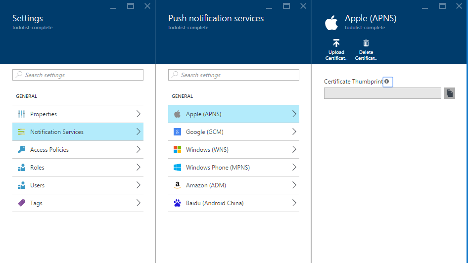
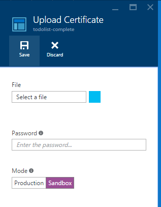

<properties
    pageTitle="Senden von Pushbenachrichtigungen zu iOS mit Azure Benachrichtigung Hubs | Microsoft Azure"
    description="In diesem Lernprogramm erfahren Sie, wie die Benachrichtigung Hubs Azure um Pushbenachrichtigungen zur iOS-Anwendung zu senden."
    services="notification-hubs"
    documentationCenter="ios"
    keywords="Drücken Sie die Benachrichtigung Pushbenachrichtigungen, Ios Pushbenachrichtigungen"
    authors="ysxu"
    manager="erikre"
    editor=""/>

<tags
    ms.service="notification-hubs"
    ms.workload="mobile"
    ms.tgt_pltfrm="mobile-ios"
    ms.devlang="objective-c"
    ms.topic="hero-article"
    ms.date="10/03/2016"
    ms.author="yuaxu"/>

# Senden von Pushbenachrichtigungen zu iOS mit Azure Benachrichtigung Hubs

[AZURE.INCLUDE [notification-hubs-selector-get-started](../../includes/notification-hubs-selector-get-started.md)]

##(Übersicht)

> [AZURE.NOTE] Um dieses Lernprogramms abgeschlossen haben, müssen Sie ein aktives Azure-Konto verfügen. Wenn Sie kein Konto haben, können Sie ein kostenloses Testversion Konto nur wenigen Minuten erstellen. Weitere Informationen finden Sie unter [Azure kostenlose Testversion](https://azure.microsoft.com/pricing/free-trial/?WT.mc_id=A0E0E5C02&amp;returnurl=http%3A%2F%2Fazure.microsoft.com%2Fen-us%2Fdocumentation%2Farticles%2Fnotification-hubs-ios-get-started).

In diesem Lernprogramm erfahren Sie, wie die Benachrichtigung Hubs Azure um Pushbenachrichtigungen zur iOS-Anwendung zu senden. Erstellen Sie eine leere iOS-app, die Pushbenachrichtigungen empfängt mithilfe der [Pushbenachrichtigung von Apple-Dienst (APNs)](https://developer.apple.com/library/ios/documentation/NetworkingInternet/Conceptual/RemoteNotificationsPG/Chapters/ApplePushService.html). 

Wenn Sie fertig sind, wird den Benachrichtigung Hub verwenden, um Pushbenachrichtigungen auf alle Ihre App Geräte übertragen werden.

## Vorbemerkung

[AZURE.INCLUDE [notification-hubs-hero-slug](../../includes/notification-hubs-hero-slug.md)]

Der vollständige Code für dieses Lernprogramms finden Sie [auf GitHub](https://github.com/Azure/azure-notificationhubs-samples/tree/master/iOS/GetStartedNH/GetStarted). 

##Erforderliche Komponenten

In diesem Lernprogramm benötigen Sie Folgendes:

+ [Services für Mobile iOS SDK Version 1.2.4]
+ Neueste Version von [Xcode]
+ Ein iOS 8 (oder höher)-Gerät
+ [Apple Developer-Programm](https://developer.apple.com/programs/) Mitgliedschaft.

   > [AZURE.NOTE] Da Konfiguration Anforderungen für Pushbenachrichtigungen müssen Sie bereitstellen und Testen Pushbenachrichtigungen auf einem Gerät physisch iOS (iPhone oder iPad) anstelle der iOS Simulator.

In diesem Lernprogramm durchführen ist eine Voraussetzung für alle anderen Benachrichtigung Hubs Lernprogramme für iOS-apps.

[AZURE.INCLUDE [Notification Hubs Enable Apple Push Notifications](../../includes/notification-hubs-enable-apple-push-notifications.md)]

##Konfigurieren Sie Ihre Benachrichtigung Hub für iOS Benachrichtigungen Pushbenachrichtigungen

In diesem Abschnitt führt Sie durch erstellen einen neuen Benachrichtigung Hub und Konfigurieren der Authentifizierung mit APNS mit den, das von Ihnen erstellten **P12** Pushbenachrichtigungen Zertifikat. Wenn Sie möchten einen Benachrichtigung Hub verwenden, den Sie bereits erstellt haben, können Sie mit Schritt 5 überspringen.

[AZURE.INCLUDE [notification-hubs-portal-create-new-hub](../../includes/notification-hubs-portal-create-new-hub.md)]

<ol start="6">
<li>

Klicken auf die Schaltfläche <b>Benachrichtigungsdienst</b> das Blade <b>Einstellungen</b> , und wählen Sie dann <b>Apple (APNS)</b>. Klicken Sie auf <b>Zertifikat hochladen</b> , und wählen Sie die <b>P12</b> -Datei, die Sie zuvor exportiert. Stellen Sie sicher, dass Sie das richtige Kennwort auch angeben.

Vergewissern Sie sich, um <b>Sandkastenmodus</b> auszuwählen, da dies für die Entwicklung ist. Verwenden Sie die <b>Herstellung</b> nur, wenn Sie Pushbenachrichtigungen für Benutzer, die Ihre app aus dem Store erworben haben, senden möchten.

</li>
</ol>
&emsp;&emsp;

&emsp;&emsp;

Ihre Benachrichtigung Hub ist jetzt so konfiguriert, dass die Arbeit mit APNS, und Sie haben die Verbindungszeichenfolgen Ihre app zu registrieren, und senden Sie Pushbenachrichtigungen.

##Herstellen einer Verbindung Benachrichtigung Hubs mit Ihrem iOS-app

1. In Xcode Erstellen eines neuen Projekts für iOS und wählen Sie die **Anwendung von einzelnen anzeigen** aus.

    ![Xcode - Einzelansicht Anwendung][8]

2. Wenn Sie die Optionen für das neue Projekt festlegen möchten, stellen Sie sicher, mit der gleichen **Artikelname** und **Organisations-ID** , die Sie verwendet werden, wenn Sie zuvor die Paket-ID für die Apple-Entwicklerportal festgelegt.

    ![Xcode - Project-Optionen][11]

3. Klicken Sie unter **Ziele**klicken Sie auf den Projektnamen, klicken Sie auf der Registerkarte **Einstellungen erstellen** und erweitern Sie **Code signieren Identität**zu und legen Sie dann unter **Debuggen**, Ihre Identität Code signieren. Ein-/ausschalten **von** **Ebenen** auf **Alle**, und legen Sie **Provisioning Profil** in das provisioning Profil, das Sie zuvor erstellt haben.

    Wenn Sie das neue provisioning Profil, das Sie in Xcode erstellt haben angezeigt werden, versuchen Sie, die Profile für Ihre Identität signierenden zu aktualisieren. Klicken Sie auf der Menüleiste auf **Xcode** , klicken Sie auf **Einstellungen**, klicken Sie auf die Registerkarte **Konto** , klicken Sie auf die Schaltfläche **Details anzeigen** , klicken Sie auf Ihre Identität signierenden, und klicken Sie dann auf die Aktualisierungsschaltfläche in der unteren rechten Ecke.

    ![Xcode - Bereitstellung Profil][9]

4. Herunterladen Sie die [Dienste für Mobile iOS SDK Version 1.2.4] und Entpacken Sie die Datei. In Xcode mit der rechten Maustaste in Ihrem Projekts, und klicken Sie auf die Option **Dateien hinzufügen, um** den Ordner **WindowsAzureMessaging.framework** Projekt Xcode hinzuzufügen. Wählen Sie das **Kopieren von Elementen bei Bedarf**aus, und klicken Sie dann auf **Hinzufügen**.

    >[AZURE.NOTE] Die Benachrichtigung untergeordneten Servern SDK unterstützt derzeit nicht Bitcode auf Xcode 7.  Sie müssen **Bitcode aktivieren** auf **Nein** in das **Erstellen von Optionen** für ein Projekt festlegen.

    ![Entzippen Azure SDK][10]

5. Hinzufügen eine neuen Datei für die Kopfzeile zu einem Projekt mit dem Namen `HubInfo.h`. Diese Datei wird die Konstanten für Ihre Benachrichtigung Hub halten.  Fügen Sie die folgenden Definitionen hinzu, und Ersetzen Sie die Zeichenfolge literal Platzhalter mit Ihrem *Hubnamen* und die *DefaultListenSharedAccessSignature* , die Sie zuvor notiert haben.

        #ifndef HubInfo_h
        #define HubInfo_h
        
            #define HUBNAME @"<Enter the name of your hub>"
            #define HUBLISTENACCESS @"<Enter your DefaultListenSharedAccess connection string"
        
        #endif /* HubInfo_h */

6. Öffnen Ihrer `AppDelegate.h` Datei hinzufügen die folgenden Richtlinien importieren:

         #import <WindowsAzureMessaging/WindowsAzureMessaging.h> 
         #import "HubInfo.h"
        
7. In Ihrer `AppDelegate.m file`, fügen Sie den folgenden Code in die `didFinishLaunchingWithOptions` Methode, basierend auf Ihrer Version von iOS. Dieser Code registriert Ihr Gerät Ziehpunkt mit APNs:

    Für iOS 8:

        UIUserNotificationSettings *settings = [UIUserNotificationSettings settingsForTypes:UIUserNotificationTypeSound |
                                                UIUserNotificationTypeAlert | UIUserNotificationTypeBadge categories:nil];

        [[UIApplication sharedApplication] registerUserNotificationSettings:settings];
        [[UIApplication sharedApplication] registerForRemoteNotifications];

    IOS-Versionen vor 8:

         [[UIApplication sharedApplication] registerForRemoteNotificationTypes: UIRemoteNotificationTypeAlert | UIRemoteNotificationTypeBadge | UIRemoteNotificationTypeSound];

8. Fügen Sie in der gleichen Datei die folgenden Methoden aus. Dieser Code verbindet an den Benachrichtigung Hub mithilfe der Verbindungsinformationen, die Sie in HubInfo.h angegeben haben. Klicken Sie dann erhalten das Gerät Token an den Hub Benachrichtigung, dass der Benachrichtigung Hub Benachrichtigungen senden kann:

        - (void)application:(UIApplication *)application didRegisterForRemoteNotificationsWithDeviceToken:(NSData *) deviceToken {
            SBNotificationHub* hub = [[SBNotificationHub alloc] initWithConnectionString:HUBLISTENACCESS
                                        notificationHubPath:HUBNAME];

            [hub registerNativeWithDeviceToken:deviceToken tags:nil completion:^(NSError* error) {
                if (error != nil) {
                    NSLog(@"Error registering for notifications: %@", error);
                }
                else {
                    [self MessageBox:@"Registration Status" message:@"Registered"];
                }
            }];
        }

        -(void)MessageBox:(NSString *)title message:(NSString *)messageText
        {
            UIAlertView *alert = [[UIAlertView alloc] initWithTitle:title message:messageText delegate:self
                cancelButtonTitle:@"OK" otherButtonTitles: nil];
            [alert show];
        }

9. Fügen Sie in derselben Datei die folgende Methode zum Anzeigen eines **UIAlert** , wenn die Benachrichtigung eingeht, während die app aktiv ist:

        - (void)application:(UIApplication *)application didReceiveRemoteNotification: (NSDictionary *)userInfo {
            NSLog(@"%@", userInfo);
            [self MessageBox:@"Notification" message:[[userInfo objectForKey:@"aps"] valueForKey:@"alert"]];
        }

10. Erstellen Sie und führen Sie die app auf Ihrem Gerät, um sicherzustellen, dass keine Fehler.

## Senden von Pushbenachrichtigungen testen

Sie können die Empfang von Benachrichtigungen in Ihrer app per Pushbenachrichtigungen im [Portal Azure] über den Abschnitt " **Problembehandlung** " in das Blade Hub (verwenden Sie die Option *Senden testen* ) testen.

![Azure-Portal - Test senden][30]

[AZURE.INCLUDE [notification-hubs-sending-notifications-from-the-portal](../../includes/notification-hubs-sending-notifications-from-the-portal.md)]

## (Optional) Senden von Pushbenachrichtigungen aus der app

>[AZURE.IMPORTANT] In diesem Beispiel Senden von Benachrichtigungen aus der Client-app werden nur zu bereitgestellt. Da dies erforderlich ist, wird die `DefaultFullSharedAccessSignature` Client-App vorhanden sind, macht Ihre Benachrichtigung-Hub an das Risiko, dass ein Benutzer um unbefugten Benachrichtigungen an Ihre Kunden senden zugreifen kann.

Wenn Sie Pushbenachrichtigungen aus innerhalb einer app senden möchten, enthält dieser Abschnitt ein Beispiel für die restlichen Schnittstelle dazu an.

1. Öffnen Sie in Xcode, `Main.storyboard` , und fügen Sie die folgenden UI-Komponenten aus der Objektbibliothek an, damit den Benutzer in der app Pushbenachrichtigungen zu senden:

    - Eine Bezeichnung mit dem kein Beschriftungstext. Es wird zum Melden von Fehlern in Benachrichtigungen senden verwendet werden. Die Eigenschaft **Linien** sollte auf **0** festgelegt sein, damit automatisch werden Größe, die auf dem rechten und linken Ränder und dem oberen Rand der Ansicht beschränkt.
    - Legen Sie ein Textfeld mit **Platzhaltertext** auf **Benachrichtigung eingeben**. Das Feld direkt unterhalb der Bezeichnung zu beschränken, wie unten dargestellt. Festlegen der View Controller als Stellvertretung Ausgang an.
    - Eine Schaltfläche mit dem Titel **Benachrichtigung senden** eingeschränkt direkt unter dem Textfeld und in der Mitte horizontal.

    Die Ansicht sollte wie folgt aussehen:

    ![Xcode-designer][32]

2. [Hinzufügen Ausgänge](https://developer.apple.com/library/ios/recipes/xcode_help-IB_connections/chapters/CreatingOutlet.html) für das Feld Beschriftung und Text verbunden Ihrer Ansicht, und aktualisieren Sie Ihre `interface` Definition zur Unterstützung von `UITextFieldDelegate` und `NSXMLParserDelegate`. Fügen Sie die drei Eigenschaftendeklarationen abgebildet unterstützen die REST-API aufrufen und Analysieren der Antwort hinzu.

    Die Datei ViewController.h sollte wie folgt aussehen:

        #import <UIKit/UIKit.h>

        @interface ViewController : UIViewController <UITextFieldDelegate, NSXMLParserDelegate>
        {
            NSXMLParser *xmlParser;
        }

        // Make sure these outlets are connected to your UI by ctrl+dragging
        @property (weak, nonatomic) IBOutlet UITextField *notificationMessage;
        @property (weak, nonatomic) IBOutlet UILabel *sendResults;

        @property (copy, nonatomic) NSString *statusResult;
        @property (copy, nonatomic) NSString *currentElement;

        @end

3. Open `HubInfo.h` und fügen Sie die folgenden Konstanten die zum Senden von Benachrichtigungen an Ihre Hub verwendet werden. Ersetzen Sie literal für die Platzhalterzeichenfolge mit der tatsächlichen *DefaultFullSharedAccessSignature* Verbindungszeichenfolge.

        #define API_VERSION @"?api-version=2015-01"
        #define HUBFULLACCESS @"<Enter Your DefaultFullSharedAccess Connection string>"

4. Fügen Sie den folgenden `#import` Anweisungen, um Ihre `ViewController.h` Datei.

        #import <CommonCrypto/CommonHMAC.h>
        #import "HubInfo.h"

5. In `ViewController.m` fügen Sie den folgenden Code für die Benutzeroberfläche Implementierung. In diesem Code wird die Verbindungszeichenfolge *DefaultFullSharedAccessSignature* analysiert werden. Wie in den [REST-API-Referenz](http://msdn.microsoft.com/library/azure/dn495627.aspx)erwähnt, wird diese analysierten Informationen ein SaS Token für die **Autorisierung** Anforderung Kopfzeile generieren verwendet werden.

        NSString *HubEndpoint;
        NSString *HubSasKeyName;
        NSString *HubSasKeyValue;

        -(void)ParseConnectionString
        {
            NSArray *parts = [HUBFULLACCESS componentsSeparatedByString:@";"];
            NSString *part;

            if ([parts count] != 3)
            {
                NSException* parseException = [NSException exceptionWithName:@"ConnectionStringParseException"
                    reason:@"Invalid full shared access connection string" userInfo:nil];

                @throw parseException;
            }

            for (part in parts)
            {
                if ([part hasPrefix:@"Endpoint"])
                {
                    HubEndpoint = [NSString stringWithFormat:@"https%@",[part substringFromIndex:11]];
                }
                else if ([part hasPrefix:@"SharedAccessKeyName"])
                {
                    HubSasKeyName = [part substringFromIndex:20];
                }
                else if ([part hasPrefix:@"SharedAccessKey"])
                {
                    HubSasKeyValue = [part substringFromIndex:16];
                }
            }
        }

6. In `ViewController.m`, aktualisieren Sie die `viewDidLoad` Methode, um die Verbindungszeichenfolge beim Laden der Ansicht zu analysieren. Fügen Sie die entsprechenden Methoden, siehe unten, um die Implementierung auch hinzu.  

        - (void)viewDidLoad
        {
            [super viewDidLoad];
            [self ParseConnectionString];
            [_notificationMessage setDelegate:self];
        }

        -(NSString *)CF_URLEncodedString:(NSString *)inputString
        {
           return (__bridge NSString *)CFURLCreateStringByAddingPercentEscapes(NULL, (CFStringRef)inputString,
                NULL, (CFStringRef)@"!*'();:@&=+$,/?%#[]", kCFStringEncodingUTF8);
        }

        -(void)MessageBox:(NSString *)title message:(NSString *)messageText
        {
            UIAlertView *alert = [[UIAlertView alloc] initWithTitle:title message:messageText delegate:self
                cancelButtonTitle:@"OK" otherButtonTitles: nil];
            [alert show];
        }

7. In `ViewController.m`, fügen Sie den folgenden Code, um die Implementierung zum Generieren des SaS Autorisierung Tokens, die in der Kopfzeile **Autorisierung** bereitgestellt werden, wie die [REST-API-Referenz](http://msdn.microsoft.com/library/azure/dn495627.aspx)angegeben.

        -(NSString*) generateSasToken:(NSString*)uri
        {
            NSString *targetUri;
            NSString* utf8LowercasedUri = NULL;
            NSString *signature = NULL;
            NSString *token = NULL;

            @try
            {
                // Add expiration
                uri = [uri lowercaseString];
                utf8LowercasedUri = [self CF_URLEncodedString:uri];
                targetUri = [utf8LowercasedUri lowercaseString];
                NSTimeInterval expiresOnDate = [[NSDate date] timeIntervalSince1970];
                int expiresInMins = 60; // 1 hour
                expiresOnDate += expiresInMins * 60;
                UInt64 expires = trunc(expiresOnDate);
                NSString* toSign = [NSString stringWithFormat:@"%@\n%qu", targetUri, expires];

                // Get an hmac_sha1 Mac instance and initialize with the signing key
                const char *cKey  = [HubSasKeyValue cStringUsingEncoding:NSUTF8StringEncoding];
                const char *cData = [toSign cStringUsingEncoding:NSUTF8StringEncoding];
                unsigned char cHMAC[CC_SHA256_DIGEST_LENGTH];
                CCHmac(kCCHmacAlgSHA256, cKey, strlen(cKey), cData, strlen(cData), cHMAC);
                NSData *rawHmac = [[NSData alloc] initWithBytes:cHMAC length:sizeof(cHMAC)];
                signature = [self CF_URLEncodedString:[rawHmac base64EncodedStringWithOptions:0]];

                // Construct authorization token string
                token = [NSString stringWithFormat:@"SharedAccessSignature sig=%@&se=%qu&skn=%@&sr=%@",
                    signature, expires, HubSasKeyName, targetUri];
            }
            @catch (NSException *exception)
            {
                [self MessageBox:@"Exception Generating SaS Token" message:[exception reason]];
            }
            @finally
            {
                if (utf8LowercasedUri != NULL)
                    CFRelease((CFStringRef)utf8LowercasedUri);
                if (signature != NULL)
                CFRelease((CFStringRef)signature);
            }

            return token;
        }

8. STRG + Ziehen aus der **Benachrichtigung senden** -Schaltfläche, um `ViewController.m` eine Aktion, die mit dem Namen **SendNotificationMessage** für das Ereignis **Tippen Sie unten** hinzuzufügen. Aktualisieren Sie Methode mit den folgenden Code zum Senden der Benachrichtigung, die REST-API verwenden.

        - (IBAction)SendNotificationMessage:(id)sender
        {
            self.sendResults.text = @"";
            [self SendNotificationRESTAPI];
        }

        - (void)SendNotificationRESTAPI
        {
            NSURLSession* session = [NSURLSession
                             sessionWithConfiguration:[NSURLSessionConfiguration defaultSessionConfiguration]
                             delegate:nil delegateQueue:nil];

            // Apple Notification format of the notification message
            NSString *json = [NSString stringWithFormat:@"{\"aps\":{\"alert\":\"%@\"}}",
                                self.notificationMessage.text];

            // Construct the message's REST endpoint
            NSURL* url = [NSURL URLWithString:[NSString stringWithFormat:@"%@%@/messages/%@", HubEndpoint,
                                                HUBNAME, API_VERSION]];

            // Generate the token to be used in the authorization header
            NSString* authorizationToken = [self generateSasToken:[url absoluteString]];

            //Create the request to add the APNs notification message to the hub
            NSMutableURLRequest *request = [NSMutableURLRequest requestWithURL:url];
            [request setHTTPMethod:@"POST"];
            [request setValue:@"application/json;charset=utf-8" forHTTPHeaderField:@"Content-Type"];

            // Signify Apple notification format
            [request setValue:@"apple" forHTTPHeaderField:@"ServiceBusNotification-Format"];

            //Authenticate the notification message POST request with the SaS token
            [request setValue:authorizationToken forHTTPHeaderField:@"Authorization"];

            //Add the notification message body
            [request setHTTPBody:[json dataUsingEncoding:NSUTF8StringEncoding]];

            // Send the REST request
            NSURLSessionDataTask* dataTask = [session dataTaskWithRequest:request
                completionHandler:^(NSData *data, NSURLResponse *response, NSError *error)
            {
                NSHTTPURLResponse* httpResponse = (NSHTTPURLResponse*) response;
                if (error || (httpResponse.statusCode != 200 && httpResponse.statusCode != 201))
                {
                    NSLog(@"\nError status: %d\nError: %@", httpResponse.statusCode, error);
                }
                if (data != NULL)
                {
                    xmlParser = [[NSXMLParser alloc] initWithData:data];
                    [xmlParser setDelegate:self];
                    [xmlParser parse];
                }
            }];
            [dataTask resume];
        }

9. In `ViewController.m`, fügen Sie die folgenden Stellvertretung Methode unterstützt, schließen die Tastatur für das Textfeld ein. STRG + Ziehen aus dem Textfeld auf das Symbol View Controller im Benutzeroberflächen-Designer, um den Controller Ansicht als Stellvertretung Ausgang festlegen.

        //===[ Implement UITextFieldDelegate methods ]===

        -(BOOL)textFieldShouldReturn:(UITextField *)textField
        {
            [textField resignFirstResponder];
            return YES;
        }

10. In `ViewController.m`, fügen Sie die folgenden Stellvertretung Methoden zum Analysieren der Antwort mit unterstützen `NSXMLParser`.

        //===[ Implement NSXMLParserDelegate methods ]===

        -(void)parserDidStartDocument:(NSXMLParser *)parser
        {
            self.statusResult = @"";
        }

        -(void)parser:(NSXMLParser *)parser didStartElement:(NSString *)elementName
            namespaceURI:(NSString *)namespaceURI qualifiedName:(NSString *)qName
            attributes:(NSDictionary *)attributeDict
        {
            NSString * element = [elementName lowercaseString];
            NSLog(@"*** New element parsed : %@ ***",element);

            if ([element isEqualToString:@"code"] | [element isEqualToString:@"detail"])
            {
                self.currentElement = element;
            }
        }

        -(void) parser:(NSXMLParser *)parser foundCharacters:(NSString *)parsedString
        {
            self.statusResult = [self.statusResult stringByAppendingString:
                [NSString stringWithFormat:@"%@ : %@\n", self.currentElement, parsedString]];
        }

        -(void)parserDidEndDocument:(NSXMLParser *)parser
        {
            // Set the status label text on the UI thread
            dispatch_async(dispatch_get_main_queue(),
            ^{
                [self.sendResults setText:self.statusResult];
            });
        }

11. Erstellen Sie das Projekt, und stellen Sie sicher, dass keine Fehler vorliegen.

> [AZURE.NOTE] Wenn Sie einen Build in Xcode7 über die Unterstützung von Bitcode Fehler, sollten Sie die **Einstellungen erstellen**ändern > **Aktivieren Bitcode (ENABLE_BITCODE)** auf **Nein** in Xcode. Die Benachrichtigung Hubs SDK unterstützt derzeit nicht Bitcode. 

Sie können alle möglichen Benachrichtigung-Fracht Apple [lokale und Pushbenachrichtigungen Benachrichtigung Programming Guide]suchen.

##Überprüft, ob Ihre app von Pushbenachrichtigungen empfangen

Klicken Sie zum Testen Pushbenachrichtigungen unter iOS müssen Sie die app auf einer physischen iOS-Gerät bereitstellen. Sie können keine Apple Pushbenachrichtigungen mithilfe der iOS Simulator senden.

1. Führen Sie die app, und stellen Sie sicher, dass die Registrierung erfolgreich ist, und drücken Sie dann auf **OK**.

    ![iOS-App Pushbenachrichtigungen Benachrichtigung Registrierung testen][33]

2. Sie können eine Testen der Pushbenachrichtigung aus dem [Azure-Portal]senden, wie zuvor beschrieben. Wenn Sie Code für das Senden von Pushbenachrichtigungen in der app hinzugefügt haben, tippen Sie in das Textfeld, geben Sie eine Benachrichtigung. Drücken Sie dann die Schaltfläche **Senden** , klicken Sie auf der Tastatur oder der **Benachrichtigung senden** -Schaltfläche in der Sicht, um die Nachricht zu senden.

    ![iOS-App Pushbenachrichtigungen Benachrichtigung Test senden][34]

3. Der Pushbenachrichtigung wird an alle Geräte gesendet, die registriert sind, um die Benachrichtigungen aus bestimmten Benachrichtigung Hub zu erhalten.

    ![iOS-App Pushbenachrichtigungen Benachrichtigung erhalten testen][35]

##Nächste Schritte

In diesem Beispiel einfach mithilfe von Sie Pushbenachrichtigungen an alle registrierten iOS-Geräte. Wir empfehlen, im nächsten Schritt in Ihren Wissensstand, die Sie in der [Azure Benachrichtigung Hubs Benutzer benachrichtigen für iOS mit .NET Back-End] -Lernprogramm leiten würde nacheinander, durch die Erstellung einer Back-End-um Pushbenachrichtigungen mithilfe von Kategorien zu senden. 

Wenn Sie Ihre Benutzer Zinsen gruppenweise segmentieren möchten, können Sie darüber hinaus zum Lernprogramm [Verwenden Benachrichtigung Hubs auf dem neusten Stand senden] verschieben, klicken Sie auf. 

Allgemeine Informationen zu Benachrichtigung Hubs finden Sie unter [Benachrichtigung Hubs Anleitungen].

<!-- Images. -->

[6]: ./media/notification-hubs-ios-get-started/notification-hubs-configure-ios.png
[8]: ./media/notification-hubs-ios-get-started/notification-hubs-create-ios-app.png
[9]: ./media/notification-hubs-ios-get-started/notification-hubs-create-ios-app2.png
[10]: ./media/notification-hubs-ios-get-started/notification-hubs-create-ios-app3.png
[11]: ./media/notification-hubs-ios-get-started/notification-hubs-xcode-product-name.png

[30]: ./media/notification-hubs-ios-get-started/notification-hubs-test-send.png

[31]: ./media/notification-hubs-ios-get-started/notification-hubs-ios-ui.png
[32]: ./media/notification-hubs-ios-get-started/notification-hubs-storyboard-view.png
[33]: ./media/notification-hubs-ios-get-started/notification-hubs-test1.png
[34]: ./media/notification-hubs-ios-get-started/notification-hubs-test2.png
[35]: ./media/notification-hubs-ios-get-started/notification-hubs-test3.png

<!-- URLs. -->
[Services für Mobile iOS SDK Version 1.2.4]: http://aka.ms/kymw2g
[Mobile Services iOS SDK]: http://go.microsoft.com/fwLink/?LinkID=266533
[Submit an app page]: http://go.microsoft.com/fwlink/p/?LinkID=266582
[My Applications]: http://go.microsoft.com/fwlink/p/?LinkId=262039
[Live SDK for Windows]: http://go.microsoft.com/fwlink/p/?LinkId=262253

[Get started with Mobile Services]: /develop/mobile/tutorials/get-started-ios
[Azure Classic Portal]: https://manage.windowsazure.com/
[Benachrichtigung Hubs Anleitungen]: http://msdn.microsoft.com/library/jj927170.aspx
[Xcode]: https://go.microsoft.com/fwLink/p/?LinkID=266532
[iOS Provisioning Portal]: http://go.microsoft.com/fwlink/p/?LinkId=272456

[Get started with push notifications in Mobile Services]: ../mobile-services-javascript-backend-ios-get-started-push.md
[Azure Benachrichtigung Hubs Benutzer benachrichtigen für iOS mit .NET Back-End-]: notification-hubs-aspnet-backend-ios-apple-apns-notification.md
[Verwenden Sie die Benachrichtigung Hubs auf dem neusten Stand zu senden]: notification-hubs-ios-xplat-segmented-apns-push-notification.md

[Lokale, und drücken Sie die Benachrichtigung Programming Guide]: http://developer.apple.com/library/mac/#documentation/NetworkingInternet/Conceptual/RemoteNotificationsPG/Chapters/ApplePushService.html#//apple_ref/doc/uid/TP40008194-CH100-SW1
[Azure-Portal]: https://portal.azure.com