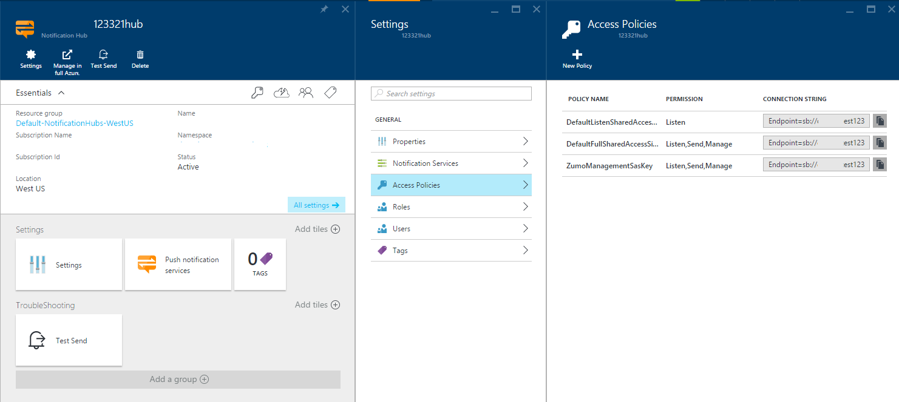

<properties
    pageTitle="Pushbenachrichtigungen mit Azure Benachrichtigung Hubs und Node.js senden"
    description="Informationen Sie zum Senden von Pushbenachrichtigungen aus einer Anwendung Node.js Benachrichtigung Hubs verwenden."
    keywords="Pushbenachrichtigung, Pushbenachrichtigungen notifications,node.js Pushbenachrichtigungen, Ios Pushbenachrichtigungen"
    services="notification-hubs"
    documentationCenter="nodejs"
    authors="ysxu"
    manager="dwrede"
    editor=""/>

<tags
    ms.service="notification-hubs"
    ms.workload="mobile"
    ms.tgt_pltfrm="na"
    ms.devlang="javascript"
    ms.topic="article"
    ms.date="10/25/2016"
    ms.author="yuaxu"/>

# Pushbenachrichtigungen mit Azure Benachrichtigung Hubs und Node.js senden
[AZURE.INCLUDE [notification-hubs-backend-how-to-selector](../../includes/notification-hubs-backend-how-to-selector.md)]

##(Übersicht)

> [AZURE.IMPORTANT] Um dieses Lernprogramms abgeschlossen haben, müssen Sie ein aktives Azure-Konto verfügen. Wenn Sie kein Konto haben, können Sie ein kostenloses Testversion Konto nur wenigen Minuten erstellen. Weitere Informationen finden Sie unter [Azure kostenlose Testversion](https://azure.microsoft.com/pricing/free-trial/?WT.mc_id=A643EE910&amp;returnurl=http%3A%2F%2Fazure.microsoft.com%2Fen-us%2Fdocumentation%2Farticles%2Fnotification-hubs-nodejs-how-to-use-notification-hubs).

Dieses Handbuch zeigt Ihnen, wie Pushbenachrichtigungen mit Hilfe der Azure-Benachrichtigung Hubs direkt aus einer Node.js-Anwendung zu senden. 

Die Szenarios dieser umfassen das Senden von Pushbenachrichtigungen für Clientanwendungen auf den folgenden Plattformen:

* Android
* iOS
* Windows Phone
* Universal Windows-Plattform 

Weitere Informationen zum Benachrichtigung Hubs finden Sie unter Abschnitt [Weitere Schritte](#next) .

##Was sind die Benachrichtigung Hubs?

Azure Benachrichtigung-Hubs bieten eine einfach zu verwendende, Multi-Plattform und skalierbare Infrastruktur für das Senden von Pushbenachrichtigungen für mobile Geräte. Einzelheiten auf die Service-Infrastruktur finden Sie auf der Seite [Azure Benachrichtigung Hubs](http://msdn.microsoft.com/library/windowsazure/jj927170.aspx) .

##Erstellen Sie eine Anwendung Node.js

Der erste Schritt in diesem Lernprogramm wird eine neue, leere Node.js Anwendung erstellen. Anweisungen zum Erstellen einer Node.js-Anwendungs finden Sie unter [Erstellen und Bereitstellen eine Anwendung Node.js zur Azure-Website][nodejswebsite], [Node.js Cloud-Dienst] [ Node.js Cloud Service] mit Windows PowerShell oder [Website mit WebMatrix].

##Konfigurieren der Anwendungs Benachrichtigung Hubs verwendet.

Um die Benachrichtigung Hubs Azure verwenden zu können, müssen Sie herunterladen und Verwenden des Node.js [Azure-Paket](https://www.npmjs.com/package/azure), das einen integrierten Satz von Helper Bibliotheken enthält, die mit der Pushbenachrichtigungen Benachrichtigung REST-Dienste kommunizieren.

### Verwenden Sie Knoten Paket Manager (NPM), um das Paket zu erhalten

1.  Verwenden Sie eine Line Schnittstelle wie **PowerShell** (Windows), **Terminal** (Mac) oder **Bash** (Linux), und navigieren Sie zu dem Ordner, in dem Sie eine leere Anwendung erstellt.

2.  Geben Sie im Befehlsfenster **Npm Azure-Sb zu installieren** .

3.  Sie können manuell ausführen des Befehls **** oder **Verzeichnis** zu überprüfen, ob ein **Knoten\_Module** Ordner erstellt wurde. Suchen Sie in diesem Ordner **Azure** -Paket, das die Bibliotheken enthält, die Sie die Benachrichtigung Hub zugreifen müssen.

>[AZURE.NOTE] Sie können weitere Informationen zum Installieren von NPM offizielle [NPM Blog](http://blog.npmjs.org/post/85484771375/how-to-install-npm). 

### Importieren des Moduls

Verwenden einen Text-Editor, fügen Sie den folgenden an den Anfang der Datei **server.js** der Anwendung:

    var azure = require('azure');

### Einrichten einer Benachrichtigung-Hub Azure-Verbindung

Das Objekt **NotificationHubService** können Sie die Benachrichtigung Hubs konzipiert. Im folgende Code wird ein Objekt **NotificationHubService** für die Meldung Hub mit dem Namen **Hubname**erstellt. Fügen sie nach der zu importierenden Azure-Modul-Anweisung am oberen Rand der Datei **server.js** hinzu:

    var notificationHubService = azure.createNotificationHubService('hubname','connectionstring');

**Connectionstring** -Wert für die Verbindung aus dem [Azure-Portal] erhalten Sie anhand der folgenden Schritte:

1. Klicken Sie im linken Navigationsbereich auf **Durchsuchen**.

2. Wählen Sie die **Benachrichtigung Hubs**, und suchen Sie dann den Hub, die, den Sie für die Stichprobe verwenden möchten. Wenn Sie Hilfe zum Erstellen einer neuen Benachrichtigung Hub benötigen, können Sie zum [Windows Store-erste Schritte-Lernprogramm](notification-hubs-windows-store-dotnet-get-started-wns-push-notification.md) verweisen.

3. Wählen Sie **Einstellungen**aus.

4. Klicken Sie auf die **Access-Richtlinien**. Beide freigegebenen und vollständigen Zugriff Verbindungszeichenfolgen werden angezeigt.

> [AZURE.NOTE] Sie können auch die Verbindungszeichenfolge verwenden das Cmdlet " **Get-AzureSbNamespace** " von [Azure PowerShell](../powershell-install-configure.md) oder den Befehl **Azure Sb Namespace anzeigen** bereitgestellt werden, mit der [Azure Line Interface (CLI Azure)](../xplat-cli-install.md)abrufen.

##Allgemeine Architektur

Das Objekt **NotificationHubService** stellt die folgenden Objektinstanzen zum Senden von Pushbenachrichtigungen an bestimmte Geräte und Programme zur Verfügung:

* **Android** - verwenden Sie das **GcmService** -Objekt, das am **notificationHubService.gcm** verfügbar ist
* **iOS** - verwenden Sie das **ApnsService** -Objekt, das am **notificationHubService.apns** zugegriffen werden kann
* **Windows Phone** – verwenden Sie das **MpnsService** -Objekt, das am **notificationHubService.mpns** verfügbar ist
* **Universal Windows-Plattform** - verwenden Sie das **WnsService** -Objekt, das am **notificationHubService.wns** verfügbar ist

### So: Senden von Pushbenachrichtigungen für Android-Clientanwendungen

Das Objekt **GcmService** bietet eine **Senden** -Methode, die zum Senden von Pushbenachrichtigungen für Android-Clientanwendungen verwendet werden kann. Die **Senden** -Methode können die folgenden Parameter:

* **Kategorien** - den Tag Bezeichner enthält. Wenn keine Kategorie angegeben ist, wird die Benachrichtigung an al-Clients gesendet werden.
* **Nutzlast** - JSON oder unformatierte Zeichenfolge Nutzlast der Nachricht.
* **Rückruf** - die Rückruffunktion.

Weitere Informationen über das Format Nutzlast finden Sie unter **der Nutzlastbereich des Dokuments [GCM Server implementieren](http://developer.android.com/google/gcm/server.html#payload) ** .

Der folgende Code wird die **GcmService** -Instanz aus, die **NotificationHubService** bereitgestellt werden, senden eine Benachrichtigung Pushbenachrichtigungen für alle registrierten Clients verwendet.

    var payload = {
      data: {
        message: 'Hello!'
      }
    };
    notificationHubService.gcm.send(null, payload, function(error){
      if(!error){
        //notification sent
      }
    });

### So: Senden von Pushbenachrichtigungen für iOS-Clientanwendungen

Dieselbe wie bei Android Applikationen oben beschriebenen, das **ApnsService** -Objekt enthält eine **Senden** -Methode, die zum Senden von Pushbenachrichtigungen für iOS-Clientanwendungen verwendet werden kann. Die **Senden** -Methode können die folgenden Parameter:

* **Kategorien** - den Tag Bezeichner enthält. Wenn keine Kategorie angegeben ist, wird die Benachrichtigung an alle Clients gesendet werden.
* **Nutzlast** - der Nachricht JSON oder Zeichenfolge Nutzlast.
* **Rückruf** - die Rückruffunktion.

Weitere Informationen das Format Nutzlast finden Sie im Abschnitt **Benachrichtigung Nutzlast** des Dokuments [lokale und Pushbenachrichtigungen Benachrichtigung Programming Guide](http://developer.apple.com/library/ios/#documentation/NetworkingInternet/Conceptual/RemoteNotificationsPG/ApplePushService/ApplePushService.html) .

Im folgenden Code wird die **ApnsService** Instanz verfügbar gemacht werden, indem Sie die **NotificationHubService** zum Senden einer Benachrichtigung an alle Clients:

    var payload={
        alert: 'Hello!'
      };
    notificationHubService.apns.send(null, payload, function(error){
      if(!error){
        // notification sent
      }
    });

### So: Senden von Pushbenachrichtigungen für Windows Phone-Clientanwendungen

Das Objekt **MpnsService** bietet eine **Senden** -Methode, die zum Senden von Pushbenachrichtigungen für Windows Phone-Clientanwendungen verwendet werden kann. Die **Senden** -Methode können die folgenden Parameter:

* **Kategorien** - den Tag Bezeichner enthält. Wenn keine Kategorie angegeben ist, wird die Benachrichtigung an alle Clients gesendet werden.
* **Nutzlast** - die Meldungsnutzlast XML.
* **TargetName**  -  `toast` für Spruch Benachrichtigungen. `token`für die Kachel Benachrichtigungen.
* **NotificationClass** - die Priorität der Benachrichtigung. Finden Sie im Abschnitt **HTTP-Kopfzeilenelemente** das Dokument [von einem Server Pushbenachrichtigungen](http://msdn.microsoft.com/library/hh221551.aspx) für gültige Werte ein.
* **Optionen** - optional Anfrage-Header.
* **Rückruf** - die Rückruffunktion.

Checken Sie für eine Liste der gültigen **TargetName**, **NotificationClass** und Kopfzeile Optionen die Seite [Pushbenachrichtigungen von einem Server](http://msdn.microsoft.com/library/hh221551.aspx) aus.

Der folgende Code verwendet die **MpnsService** Instanz verfügbar gemacht werden, indem Sie die **NotificationHubService** zum Senden einer Spruch Pushbenachrichtigungen Benachrichtigung an:

    var payload = '<?xml version="1.0" encoding="utf-8"?><wp:Notification xmlns:wp="WPNotification"><wp:Toast><wp:Text1>string</wp:Text1><wp:Text2>string</wp:Text2></wp:Toast></wp:Notification>';
    notificationHubService.mpns.send(null, payload, 'toast', 22, function(error){
      if(!error){
        //notification sent
      }
    });

### So: Senden von Pushbenachrichtigungen Applications Universal Windows-Plattform (UWP)

Das Objekt **WnsService** bietet eine **Senden** -Methode, die zum Senden von Pushbenachrichtigungen Universal Windows-Plattform Clientanwendungen verwendet werden kann.  Die **Senden** -Methode können die folgenden Parameter:

* **Kategorien** - den Tag Bezeichner enthält. Wenn keine Kategorie angegeben ist, wird die Benachrichtigung an alle registrierten Clients gesendet.
* **Nutzlast** - die XML-Meldungsnutzlast.
* **Typ** – der Typ der Benachrichtigung.
* **Optionen** - optional Anfrage-Header.
* **Rückruf** - die Rückruffunktion.

Eine Liste der gültigen Datentypen und Anfrage-Header finden Sie unter [Pushbenachrichtigungen Benachrichtigung Dienst Anfrage und Antwort Überschriften](http://msdn.microsoft.com/library/windows/apps/hh465435.aspx).

Mit dem folgende Code verwendet die **WnsService** -Instanz aus, die **NotificationHubService** bereitgestellt werden, um einer Spruch Pushbenachrichtigung an eine UWP app zu senden:

    var payload = '<toast><visual><binding template="ToastText01"><text id="1">Hello!</text></binding></visual></toast>';
    notificationHubService.wns.send(null, payload , 'wns/toast', function(error){
      if(!error){
        // notification sent
      }
    });

## Nächste Schritte

Im obigen Beispiel Codeausschnitte können Sie ganz einfach Service-Infrastruktur zum Übermitteln von Pushbenachrichtigungen an eine Vielzahl von Geräten zu erstellen. Die Grundlagen der Verwendung von Benachrichtigung Hubs mit node.js bearbeitet haben, führen Sie die folgenden Links, um weitere Informationen zu, wie Sie weiteren diese Funktionen erweitern können.

-   [Azure Benachrichtigung Hubs](https://msdn.microsoft.com/library/azure/jj927170.aspx)finden Sie unter MSDN Bezug.
-   Besuchen Sie das [Azure SDK für Knoten] Repository auf GitHub Weitere Beispiele und Implementierungsdetails ein.

  [Azure SDK für Knoten]: https://github.com/WindowsAzure/azure-sdk-for-node
  [Next Steps]: #nextsteps
  [What are Service Bus Topics and Subscriptions?]: #what-are-service-bus-topics
  [Create a Service Namespace]: #create-a-service-namespace
  [Obtain the Default Management Credentials for the Namespace]: #obtain-default-credentials
  [Create a Node.js Application]: #Create_a_Nodejs_Application
  [Configure Your Application to Use Service Bus]: #Configure_Your_Application_to_Use_Service_Bus
  [How to: Create a Topic]: #How_to_Create_a_Topic
  [How to: Create Subscriptions]: #How_to_Create_Subscriptions
  [How to: Send Messages to a Topic]: #How_to_Send_Messages_to_a_Topic
  [How to: Receive Messages from a Subscription]: #How_to_Receive_Messages_from_a_Subscription
  [How to: Handle Application Crashes and Unreadable Messages]: #How_to_Handle_Application_Crashes_and_Unreadable_Messages
  [How to: Delete Topics and Subscriptions]: #How_to_Delete_Topics_and_Subscriptions
  [1]: #Next_Steps
  [Topic Concepts]: .media/notification-hubs-nodejs-how-to-use-notification-hubs/sb-topics-01.png
  [Azure Classic Portal]: http://manage.windowsazure.com
  [image]: .media/notification-hubs-nodejs-how-to-use-notification-hubs/sb-queues-03.png
  [2]: .media/notification-hubs-nodejs-how-to-use-notification-hubs/sb-queues-04.png
  [3]: .media/notification-hubs-nodejs-how-to-use-notification-hubs/sb-queues-05.png
  [4]: .media/notification-hubs-nodejs-how-to-use-notification-hubs/sb-queues-06.png
  [5]: .media/notification-hubs-nodejs-how-to-use-notification-hubs/sb-queues-07.png
  [SqlFilter.SqlExpression]: http://msdn.microsoft.com/library/windowsazure/microsoft.servicebus.messaging.sqlfilter.sqlexpression.aspx
  [Azure Service Bus Notification Hubs]: http://msdn.microsoft.com/library/windowsazure/jj927170.aspx
  [SqlFilter]: http://msdn.microsoft.com/library/windowsazure/microsoft.servicebus.messaging.sqlfilter.aspx
  [Website mit WebMatrix]: /develop/nodejs/tutorials/web-site-with-webmatrix/
  [Node.js Cloud Service]: ../cloud-services/cloud-services-nodejs-develop-deploy-app.md
[Previous Management Portal]: .media/notification-hubs-nodejs-how-to-use-notification-hubs/previous-portal.png
  [nodejswebsite]: /develop/nodejs/tutorials/create-a-website-(mac)/
  [Node.js Cloud Service with Storage]: /develop/nodejs/tutorials/web-app-with-storage/
  [Node.js Web Application with Storage]: /develop/nodejs/tutorials/web-site-with-storage/
  [Azure-Portal]: https://portal.azure.com
