<properties
    pageTitle="Geo Geländer Pushbenachrichtigungen mit Azure Benachrichtigung Hubs und Bing raumgeometrischen Daten | Microsoft Azure"
    description="In diesem Lernprogramm erfahren Sie, wie standortbasierte Pushbenachrichtigungen mit Azure Benachrichtigung Hubs und Bing raumgeometrischen Daten übermittelt."
    services="notification-hubs"
    documentationCenter="windows"
    keywords="Pushbenachrichtigung, der Pushbenachrichtigung"
    authors="dend"
    manager="yuaxu"
    editor="dend"/>

<tags
    ms.service="notification-hubs"
    ms.workload="mobile"
    ms.tgt_pltfrm="mobile-windows-phone"
    ms.devlang="dotnet"
    ms.topic="hero-article"
    ms.date="05/31/2016"
    ms.author="dendeli"/>
    
# Geo Geländer Pushbenachrichtigungen mit Azure Benachrichtigung Hubs und räumliche Bing-Daten
 
 > [AZURE.NOTE] Um dieses Lernprogramms abgeschlossen haben, müssen Sie ein aktives Azure-Konto verfügen. Wenn Sie kein Konto haben, können Sie ein kostenloses Testversion Konto nur wenigen Minuten erstellen. Weitere Informationen finden Sie unter [Azure kostenlose Testversion](https://azure.microsoft.com/pricing/free-trial/?WT.mc_id=A0E0E5C02).

In diesem Lernprogramm erfahren Sie, wie vorführen standortbasierte Pushbenachrichtigungen mit Azure Benachrichtigung Hubs und Bing raumgeometrischen Daten, die von innerhalb einer Anwendung Universal Windows-Plattform genutzt werden.

##Erforderliche Komponenten
Zunächst müssen Sie sicherstellen, dass Sie alle die Software und Service erforderlichen Komponenten verfügen:

* [Visual Studio 2015 Update 1](https://www.visualstudio.com/en-us/downloads/download-visual-studio-vs.aspx) oder höher ([Community Edition](https://go.microsoft.com/fwlink/?LinkId=691978&clcid=0x409) kann auch). 
* Neueste Version von [Azure SDK](https://azure.microsoft.com/downloads/). 
* [Bing Maps Developer Center-Konto](https://www.bingmapsportal.com/) (Sie können eine kostenlos erstellen und verbinden es mit Ihrem Microsoft-Konto). 

##Erste Schritte

Beginnen wir mit das Projekt erstellen. Starten Sie in Visual Studio ein neues Projekt vom Typ **Leeren App (Universal Windows)**ein.

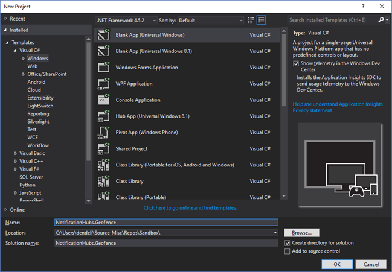

Nachdem Sie das Projekt erstellen abgeschlossen ist, sollten Sie die Umgebung zum der app ähneln verfügen. Jetzt alles für die Infrastruktur Geo-Zäune uns einrichten. Da wir für diesen Bing-Dienste verwenden möchten, gibt es ein öffentlicher REST-API Endpunkt, der uns zum Abfragen von bestimmten Stelle Frames ermöglicht:

    http://spatial.virtualearth.net/REST/v1/data/
    
Sie müssen die folgenden Parameter um dies funktioniert angeben:

* **Datenquellen-ID** und **Data Source Name** – in Bing Maps-API, Datenquellen verschiedene bucketed Metadaten, wie z. B. Orten und den üblichen Geschäftszeiten des Vorgangs enthalten. Weitere Informationen zu diesen hier. 
* **Name der Entität** – die Person, die Sie für die Benachrichtigung als Referenz verwenden möchten. 
* **Bing Maps-API-Schlüssel** – Dies ist der Schlüssel, die Sie zuvor erworben haben, wenn Sie das Konto Bing Developer Center erstellt.
 
Führen Sie eine tief greifende auf die Einrichtung wir für jede der oben genannten Elemente.

##Einrichten der Datenquelle

Sie können es in der Bing Maps Developer Center ausführen. Darauf klicken Sie in der oberen Navigationsleiste auf **Datenquellen** , und wählen Sie die **Datenquellen verwalten**.

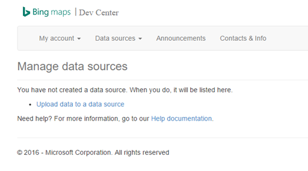

Wenn Sie nicht mit Bing Maps-API, bevor Sie gearbeitet haben, wird nicht in den meisten Fällen bestehen Datenquellen vorhanden, sodass Sie einfach eine neue, indem Sie auf Upload-Daten mit einer Datenquelle erstellen können. Stellen Sie sicher, dass Sie alle Pflichtfelder auszufüllen:

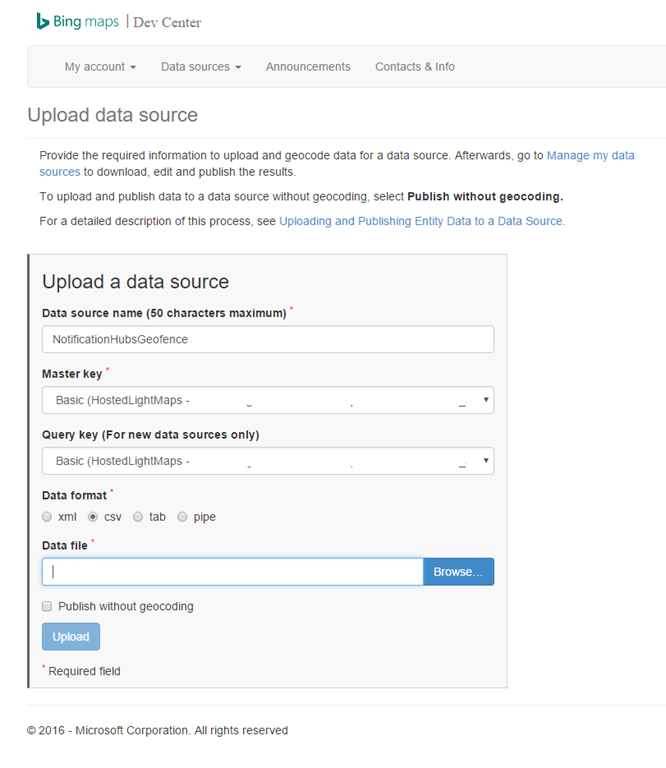

Möglicherweise Fragen Sie – Was ist mit der Datendatei und was Sie hochladen werden sollte? Für die Zwecke dieser Prüfung können wir nur die Stichprobe Pipe-basierte verwenden, die einen Bereich von der San Francisco Waterfront umgibt:

    Bing Spatial Data Services, 1.0, TestBoundaries
    EntityID(Edm.String,primaryKey)|Name(Edm.String)|Longitude(Edm.Double)|Latitude(Edm.Double)|Boundary(Edm.Geography)
    1|SanFranciscoPier|||POLYGON ((-122.389825 37.776598,-122.389438 37.773087,-122.381885 37.771849,-122.382186 37.777022,-122.389825 37.776598))
    
Die oben genannten darstellt dieser Entität:

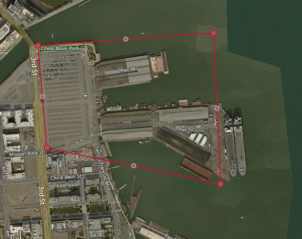

Einfach kopieren und Einfügen der oben genannten Zeichenfolge in einer neuen Datei **NotificationHubsGeofence.pipe**speichern und Laden Sie es in der Bing Developer Center hoch.

>[AZURE.NOTE]Möglicherweise werden Sie aufgefordert, einen neuen Product Key für den **Master-Shape Schlüssel** anzugeben, mit dem **Abfrage-Taste**ist. Einfach erstellen Sie einen neuen Product Key, bis das Dashboard und Aktualisieren der Daten Upload Quellseite.

Nachdem Sie die Datei hochladen, müssen Sie sicherstellen, dass Sie die Datenquelle veröffentlichen. 

Wechseln Sie zum **Verwalten von Datenquellen**, einfach wie weiter oben, finden Sie in der Liste Ihrer Datenquelle, und klicken Sie in der Spalte **Aktionen** auf **Veröffentlichen** . Eine kurze Anmerkung, sollten in Sie Ihre Datenquelle auf der Registerkarte **Datenquellen veröffentlicht** sehen:

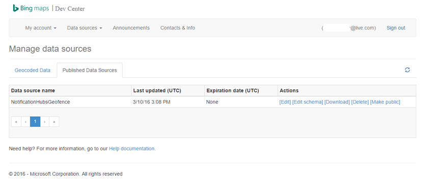

Wenn Sie auf **Bearbeiten**klicken, werden Sie möglicherweise auf einen Blick, an welchen Pfaden sehen wir darin eingeführt werden:

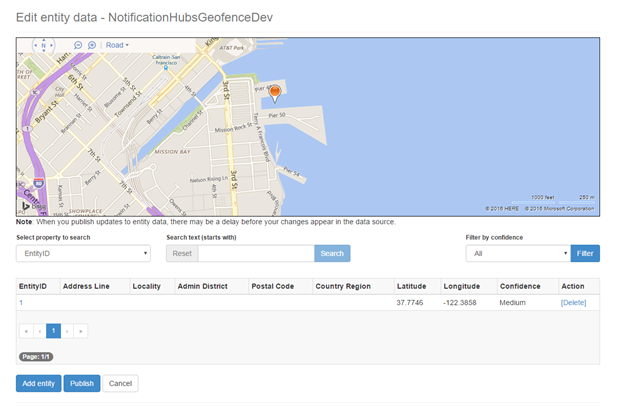

An diesem Punkt zeigt im Portal Sie keine die Begrenzung für die Geofence, dass wir erstellt haben – wir müssen lediglich eine Bestätigung, die die angegebenen Position in der richtigen Nähe ist.

Jetzt haben Sie alle Anforderungen für die Datenquelle an. Um die Details auf die Anfrage-URL für den Anruf API in der Bing Maps Developer Center zu gelangen, klicken Sie auf **Datenquellen** , und wählen Sie **Datenquelleninformationen**.

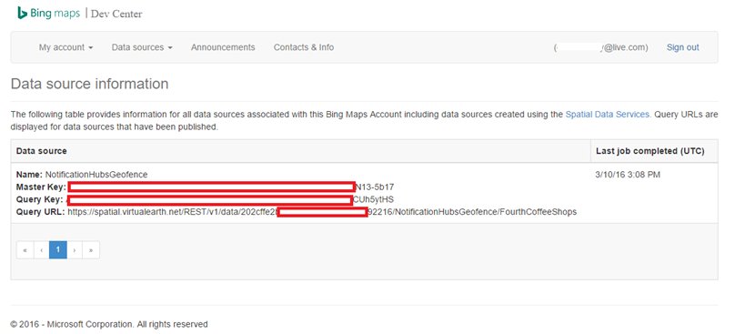

Die **Abfrage-URL** ist, was wir hier wollen. Hierbei handelt es sich um den Endpunkt, anhand, den derer wir Abfragen, um zu überprüfen, ob das Gerät derzeit innerhalb der Grenzen eines Speicherorts oder nicht ausführen können. Mit dieser Prüfung ausgeführt werden, müssen wir einfach einen Anruf GET gegen den Abfrage-URL mit den folgenden Parametern angefügt ausführen:

    ?spatialFilter=intersects(%27POINT%20LONGITUDE%20LATITUDE)%27)&$format=json&key=QUERY_KEY

Zeigen Sie auf diese Weise Sie ein Ziel angegeben haben, die wir mit dem Gerät erhalten und Bing Maps wird automatisch die Berechnungen, um festzustellen, ob es innerhalb der Geofence wird ausgeführt. Nachdem Sie die Anfrage über einen Browser (oder cURL) ausführen, werden Sie standard JSON erhalten Sie Reaktionen:

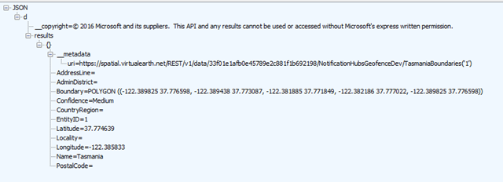

Diese Antwort passiert nur der Punkt tatsächlich innerhalb der vorgesehenen Grenzen befindet. Wenn es nicht der Fall ist, erhalten Sie eine leere **Ergebnisse** Zelle:

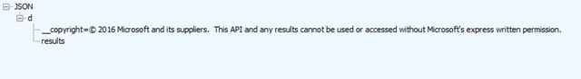

##Einrichten der Anwendung UWP

Nun verfügen wir über der Datenquelle bereit sind, können wir beginnen, klicken Sie auf die UWP-Anwendung, die wir zuvor neu gestartet zu arbeiten.

Zunächst müssen wir Speicherort-Dienste für unsere Anwendung aktivieren. Um dies zu tun, doppelklicken Sie auf `Package.appxmanifest` Datei im **Explorer Lösung**.

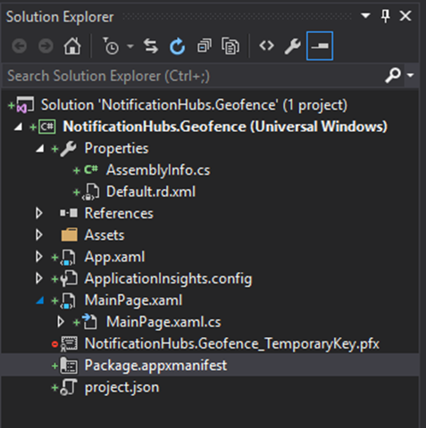

Paket Registerkarte Eigenschaften, die gerade geöffnet haben, klicken Sie auf **Funktionen** , und stellen Sie sicher, dass Sie **Position**auswählen:

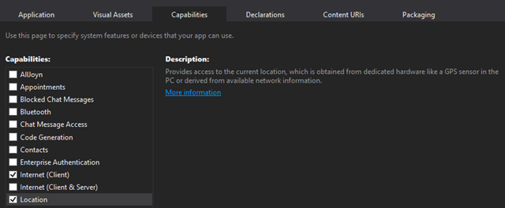

Wie die Funktion Speicherort deklariert wird, erstellen Sie einen neuen Ordner in Ihre Lösung mit dem Namen `Core`, und fügen Sie eine neue Datei darin enthaltenen namens `LocationHelper.cs`:

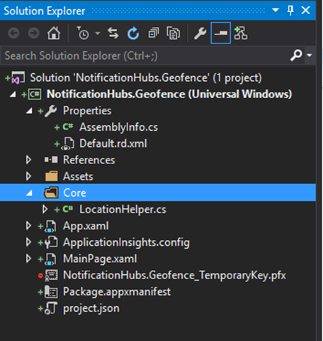

Die `LocationHelper` Klasse selbst ist ziemlich einfache zu diesem Zeitpunkt – bedeutet lediglich uns den Speicherort der System-API abzurufenden zulassen:

    using System;
    using System.Threading.Tasks;
    using Windows.Devices.Geolocation;

    namespace NotificationHubs.Geofence.Core
    {
        public class LocationHelper
        {
            private static readonly uint AppDesiredAccuracyInMeters = 10;

            public async static Task<Geoposition> GetCurrentLocation()
            {
                var accessStatus = await Geolocator.RequestAccessAsync();
                switch (accessStatus)
                {
                    case GeolocationAccessStatus.Allowed:
                        {
                            Geolocator geolocator = new Geolocator { DesiredAccuracyInMeters = AppDesiredAccuracyInMeters };

                            return await geolocator.GetGeopositionAsync();
                        }
                    default:
                        {
                            return null;
                        }
                }
            }

        }
    }

Weitere Informationen zum Aufrufen der Standort des Benutzers in UWP apps im offiziellen [MSDN-Dokument](https://msdn.microsoft.com/library/windows/apps/mt219698.aspx).

Um zu überprüfen, dass die Übernahme Speicherort tatsächlich funktioniert, öffnen Sie den Code Rand der Hauptseite (`MainPage.xaml.cs`). Erstellen einen neuen Ereignishandler für die `Loaded` Ereignis in der `MainPage` Konstruktor:

    public MainPage()
    {
        this.InitializeComponent();
        this.Loaded += MainPage_Loaded;
    }

Die Durchführung der Ereignishandler sieht wie folgt aus:

    private async void MainPage_Loaded(object sender, RoutedEventArgs e)
    {
        var location = await LocationHelper.GetCurrentLocation();

        if (location != null)
        {
            Debug.WriteLine(string.Concat(location.Coordinate.Longitude,
                " ", location.Coordinate.Latitude));
        }
    }

Beachten Sie, dass wir den Ereignishandler als asynchrone da deklariert `GetCurrentLocation` ist "awaitable" und können daher erfordert, in einem Kontext asynchrone ausgeführt werden soll. Darüber hinaus müssen wir da unter bestimmten Umständen wir einen null Speicherort einhandeln möglicherweise (z. B. die Position, die Dienste deaktiviert sind oder die Anwendung wurde Berechtigungen zum Speicherort der Zugriff verweigert), sicherzustellen, dass es mit einem Häkchen null ordnungsgemäß verarbeitet wird.

Führen Sie die Anwendung. Stellen Sie sicher, dass Sie den Speicherort Zugriff zulassen:

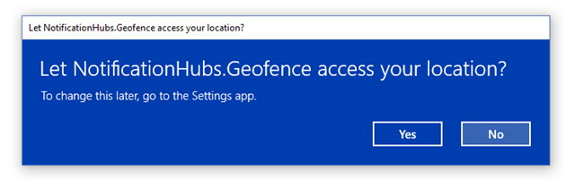

Einmal die Anwendung startet, Sie können die Koordinaten im **Ausgabefenster** finden Sie unter sollten:

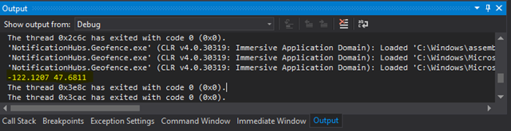

Jetzt wissen Sie, dass Speicherort Acquisition Works – sich bitte an den Test-Ereignishandler für geladen zu entfernen, da wir es wird nicht mehr verwendet werden.

Im nächsten Schritt wird zum Speicherort Änderungen zu erfassen. Für das, wechseln Sie wieder zur der `LocationHelper` Klasse, und fügen Sie den Ereignishandler für `PositionChanged`:

    geolocator.PositionChanged += Geolocator_PositionChanged;

Die Implementierung wird die Speicherort Koordinaten im **Ausgabefenster** angezeigt:

    private static async void Geolocator_PositionChanged(Geolocator sender, PositionChangedEventArgs args)
    {
        await CoreApplication.MainView.CoreWindow.Dispatcher.RunAsync(CoreDispatcherPriority.Normal, () =>
        {
            Debug.WriteLine(string.Concat(args.Position.Coordinate.Longitude, " ", args.Position.Coordinate.Latitude));
        });
    }

##Einrichten der Back-End-

Laden Sie die [Back-End-Beispiel für .NET von GitHub](https://github.com/Azure/azure-notificationhubs-samples/tree/master/dotnet/NotifyUsers). Sobald der Download abgeschlossen ist, öffnen Sie die `NotifyUsers` Ordner und anschließend – die `NotifyUsers.sln` Datei.

Festlegen der `AppBackend` als die **Start-Projekt** project, und starten Sie ihn.

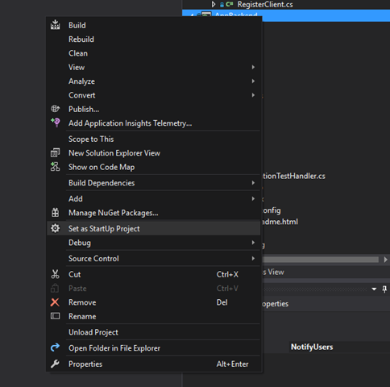

Projekt zum Senden von Pushbenachrichtigungen für Geräte bereits konfiguriert ist, damit wir müssen nur zwei Aufgaben – austauschen die richtige Verbindung für die Benachrichtigung Hub Zeichenfolge und Begrenzungslinie Kennung zum Senden der Benachrichtigung, wenn der Benutzer innerhalb der Geofence verfügt hinzufügen.

So konfigurieren Sie die Verbindungszeichenfolge in der `Models` Ordner öffnen `Notifications.cs`. Die `NotificationHubClient.CreateClientFromConnectionString` (Funktion) enthält die Informationen über Ihre Benachrichtigung Hub, das Sie in der [Azure-Portal](https://portal.azure.com) (Einblick in **Access-Richtlinien** vorher in **Einstellungen**) abrufen können. Speichern Sie die aktualisierte Konfigurationsdatei ein.

Jetzt müssen wir ein Modells für das Ergebnis Bing Maps-API zu erstellen. Die einfachste Möglichkeit, dies ist Rechtsklick auf die `Models` Ordner **Hinzufügen** > **Class**. Nennen Sie es `GeofenceBoundary.cs`. Sobald Sie fertig sind, kopieren Sie die JSON aus der API Antwort, die wir im ersten Abschnitt und **Bearbeiten**von Visual Studio verwendet besprochen > **Inhalte einfügen** > **Einfügen JSON als Klassen**. 

Auf diese Weise, die wir stellen Sie sicher, dass das Objekt genau wie beabsichtigt deserialisiert werden kann. Der resultierende Klasse festlegen sollte so aussehen:

    namespace AppBackend.Models
    {
        public class Rootobject
        {
            public D d { get; set; }
        }

        public class D
        {
            public string __copyright { get; set; }
            public Result[] results { get; set; }
        }

        public class Result
        {
            public __Metadata __metadata { get; set; }
            public string EntityID { get; set; }
            public string Name { get; set; }
            public float Longitude { get; set; }
            public float Latitude { get; set; }
            public string Boundary { get; set; }
            public string Confidence { get; set; }
            public string Locality { get; set; }
            public string AddressLine { get; set; }
            public string AdminDistrict { get; set; }
            public string CountryRegion { get; set; }
            public string PostalCode { get; set; }
        }

        public class __Metadata
        {
            public string uri { get; set; }
        }
    }

Öffnen Sie als Nächstes `Controllers`  >  `NotificationsController.cs`. Müssen wir den Beitrag Anruf Konto für die Ziel-Länge und Breite gibt. Für Sie einfach mit der Funktionssignatur – zwei Textzeichenfolgen hinzufügen `latitude` und `longitude`.

    public async Task<HttpResponseMessage> Post(string pns, [FromBody]string message, string to_tag, string latitude, string longitude)

Erstellen Sie eine neue Klasse innerhalb des Projekts aufgerufen `ApiHelper.cs` – wir verwenden diese Verbindung zum Überprüfen Bing Begrenzungslinie Schnittmengen zeigen. Implementieren eines `IsPointWithinBounds` -Funktion, wie folgt:

    public class ApiHelper
    {
        public static readonly string ApiEndpoint = "{YOUR_QUERY_ENDPOINT}?spatialFilter=intersects(%27POINT%20({0}%20{1})%27)&$format=json&key={2}";
        public static readonly string ApiKey = "{YOUR_API_KEY}";

        public static bool IsPointWithinBounds(string longitude,string latitude)
        {
            var json = new WebClient().DownloadString(string.Format(ApiEndpoint, longitude, latitude, ApiKey));
            var result = JsonConvert.DeserializeObject<Rootobject>(json);
            if (result.d.results != null && result.d.results.Count() > 0)
            {
                return true;
            }
            else
            {
                return false;
            }
        }
    }

>[AZURE.NOTE] Vergewissern Sie sich den Endpunkt API mit dem Abfrage-URL ersetzt, die Sie zuvor von der Bing Developer Center erhalten haben (dasselbe gilt für die API-Taste). 

Wenn die Ergebnisse der Abfrage vorliegen, dies bedeutet, dass der angegebene Punkt befindet sich innerhalb der Grenzen der Geofence, damit wir zurückgeben `true`. Wenn keine Ergebnisse vorliegen, Bing ist ein anderer Benutzer uns, dass der Punkt außerhalb des Rahmens nachschlagen, damit wir zurückgeben `false`.

Wieder `NotificationsController.cs`, erstellen Sie ein Häkchen unmittelbar vor der Anweisung wechseln:

    if (ApiHelper.IsPointWithinBounds(longitude, latitude))
    {
        switch (pns.ToLower())
        {
            case "wns":
                //// Windows 8.1 / Windows Phone 8.1
                var toast = @"<toast><visual><binding template=""ToastText01""><text id=""1"">" +
                            "From " + user + ": " + message + "</text></binding></visual></toast>";
                outcome = await Notifications.Instance.Hub.SendWindowsNativeNotificationAsync(toast, userTag);

                // Windows 10 specific Action Center support
                toast = @"<toast><visual><binding template=""ToastGeneric""><text id=""1"">" +
                            "From " + user + ": " + message + "</text></binding></visual></toast>";
                outcome = await Notifications.Instance.Hub.SendWindowsNativeNotificationAsync(toast, userTag);

                break;
        }
    }

Auf diese Weise wird die Benachrichtigung nur gesendet, wenn Sie der Punkt innerhalb der Grenzen befindet.

##Testen in der app UWP Pushbenachrichtigungen

Wechseln wieder zur UWP-app, sollte wir nun Benachrichtigungen testen können. Innerhalb der `LocationHelper` Klasse, erstellen Sie eine neue Funktion – `SendLocationToBackend`:

    public static async Task SendLocationToBackend(string pns, string userTag, string message, string latitude, string longitude)
    {
        var POST_URL = "http://localhost:8741/api/notifications?pns=" +
            pns + "&to_tag=" + userTag + "&latitude=" + latitude + "&longitude=" + longitude;

        using (var httpClient = new HttpClient())
        {
            try
            {
                await httpClient.PostAsync(POST_URL, new StringContent("\"" + message + "\"",
                    System.Text.Encoding.UTF8, "application/json"));
            }
            catch (Exception ex)
            {
                Debug.WriteLine(ex.Message);
            }
        }
    }

>[AZURE.NOTE] Austauschen der `POST_URL` an die Position Ihrer bereitgestellten Web-Anwendung, die wir im vorherigen Abschnitt erstellt haben. Jetzt können sie OK, um das lokal ausführen, sondern während der Arbeit auf Bereitstellen einer öffentlichen Version müssen Sie es mit einem externen Anbieter hosten.

Lassen Sie uns jetzt stellen Sie sicher, dass wir die UWP-app für Pushbenachrichtigungen registrieren. Klicken Sie auf **Projekt**, in Visual Studio > **Speichern** > **app mit dem Store zuordnen**.

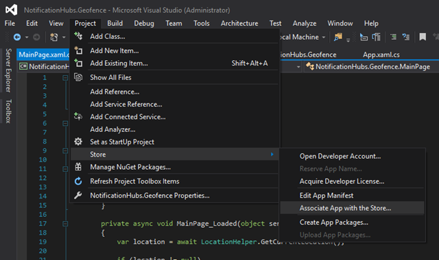

Nachdem Sie sich bei Ihrem Konto Entwicklertools anmelden, stellen Sie sicher wählen Sie aus einer vorhandenen app oder einen neuen erstellen und das Paket zuordnen. 

Wechseln Sie zu der Developer Center, und öffnen Sie die app, die Sie soeben erstellt haben. Klicken Sie auf **Dienste** > **Pushbenachrichtigungen** > **Live Services-Website**.

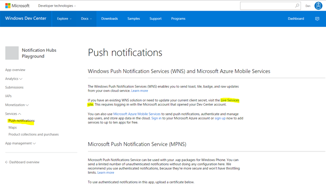

Achten Sie darauf, die **Anwendung geheim** und das **Paket SID**, auf der Website. Sie müssen sowohl der Azure-Portal – öffnen den Benachrichtigung Hub, und klicken Sie auf **Einstellungen** > **Benachrichtigung Services** > **Windows (WNS)** , und geben Sie die Informationen in die erforderlichen Felder.

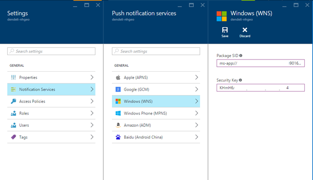

Klicken Sie auf **Speichern**.

Klicken Sie mit der rechten Maustaste auf **Verweise** im **Explorer Lösung** , und wählen Sie **NuGet-Pakete verwalten**. Müssen wir fügen Sie einen Verweis auf die **Microsoft Azure-Dienstbus verwaltete Bibliothek** – einfach suchen nach `WindowsAzure.Messaging.Managed` und dem Projekt hinzugefügt.

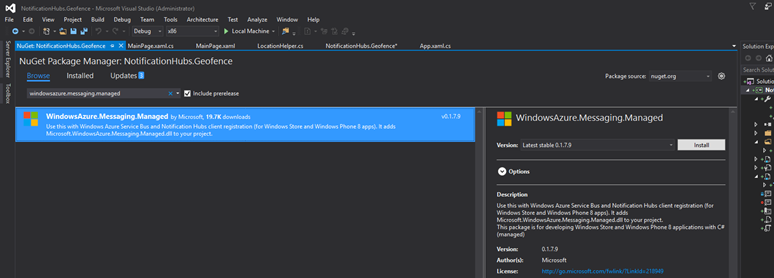

Zu Testzwecken erstellen wir die `MainPage_Loaded` Ereignishandler erneut, und fügen Sie dieser Codeausschnitt hinzu:

    var channel = await PushNotificationChannelManager.CreatePushNotificationChannelForApplicationAsync();

    var hub = new NotificationHub("HUB_NAME", "HUB_LISTEN_CONNECTION_STRING");
    var result = await hub.RegisterNativeAsync(channel.Uri);

    // Displays the registration ID so you know it was successful
    if (result.RegistrationId != null)
    {
        Debug.WriteLine("Reg successful.");
    }

Die oben genannten registriert die app mit dem Hub Benachrichtigung. Sie können nun wechseln! 

In `LocationHelper`, innerhalb der `Geolocator_PositionChanged` Ereignishandler, Sie können einen Codeabschnitt Tests zurück, der die Position innerhalb der Geofence erzwingen wird hinzufügen:

    await LocationHelper.SendLocationToBackend("wns", "TEST_USER", "TEST", "37.7746", "-122.3858");

Da wir die realen Koordinaten (die nicht innerhalb der Grenzen im Moment möglicherweise) nicht bestanden und der vordefinierten Testwerte verwenden werden, sehen wir eine Benachrichtigung bei Aktualisierung angezeigt:

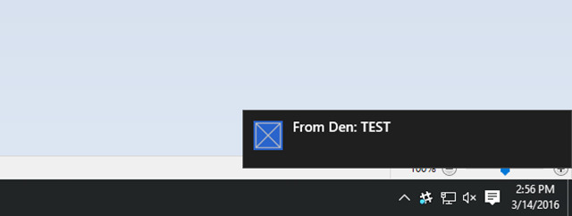

##Wie geht's weiter?

Es gibt ein paar Schritte, die Sie benötigen möglicherweise so folgen Sie zusätzlich zu den oben, um sicherzustellen, dass die Lösung einsatzbereit ist.

Zunächst müssen Sie sicherstellen, dass Geofences dynamisch sind. Dies sind einige zusätzliche Arbeit mit der Bing-API erforderlich, um neue Begrenzung innerhalb der vorhandenen Datenquelle hochladen können. Weitere Details zu diesem Thema finden Sie in der [Dokumentation Bing räumliche Data Services-API](https://msdn.microsoft.com/library/ff701734.aspx) .

Zweites, Sie arbeiten, um sicherzustellen, dass die Übermittlung an die richtigen Teilnehmer fertig ist, sollten Sie diese über [tagging](notification-hubs-tags-segment-push-message.md)werden sollen.

Die Lösung abgebildet beschreibt ein Szenario, in dem Sie möglicherweise eine Vielzahl von vorgesehenen Plattformen, damit wir die Geofencing auf System-Funktionen keine Beschränkung. Dies bedeutet, dass die Windows-Plattform universeller Funktionen zur [Erkennung von Geofences rechts von der-vordefinierten](https://msdn.microsoft.com/windows/uwp/maps-and-location/set-up-a-geofence)bietet.

Ausführlichere Informationen zum Benachrichtigung Hubs Funktionen schauen Sie sich unsere [Dokumentation Portal](https://azure.microsoft.com/documentation/services/notification-hubs/).
