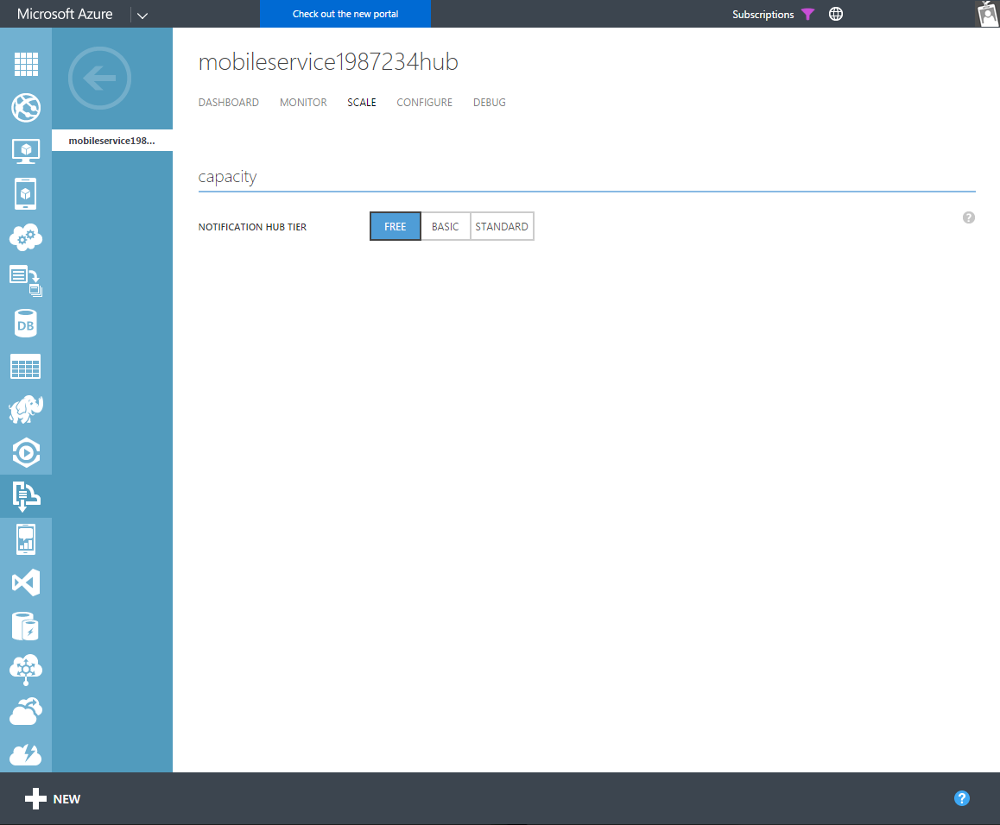

<properties
    pageTitle="Azure Benachrichtigung Hubs – häufig gestellte Fragen (FAQs)"
    description="Häufig gestellte Fragen zum Erstellen eines Konzepts/implementieren Lösungen auf Benachrichtigung Hubs"
    services="notification-hubs"
    documentationCenter="mobile"
    authors="ysxu"
    manager="erikre"
    keywords="Pushbenachrichtigung von Pushbenachrichtigungen, iOS Pushbenachrichtigungen, android Pushbenachrichtigungen, Ios Pushbenachrichtigungen, android Pushbenachrichtigungen"
    editor="" />

<tags
    ms.service="notification-hubs"
    ms.workload="mobile"
    ms.tgt_pltfrm="mobile-multiple"
    ms.devlang="multiple"
    ms.topic="article"
    ms.date="10/03/2016"
    ms.author="yuaxu" />

#Pushbenachrichtigungen Sie mit Azure Benachrichtigung Hubs – häufig gestellte Fragen

##Allgemeine
###1. Preismodell für Hubs Benachrichtigung zu Neuigkeiten
Benachrichtigung Hubs wird in drei Versionen angeboten:

* **Free** - Abrufen von bis zu 1 Millionen schiebt pro Abonnement pro Monat.
* **Grundlegende** - Get 10 Millionen schiebt pro Abonnement monatlich einen Basisplan, mit Kontingent geometrischen Optionen.
* **Standard** - 10 Millionen schiebt pro Abonnement monatlich einen Basisplan erhalten, mit Kontingent vergrößern, Optionen sowie Rich-telemetrieprotokoll-Funktionen.

Die neusten Details finden Sie auf der Seite [Benachrichtigung Hubs Preise] . Die Preise wird auf der Abonnementebene eingerichtet und ist auf der Grundlage der Anzahl von Pushbenachrichtigungen Benachrichtigung Konvergenzvorgänge, damit es wie viele Namespaces oder Benachrichtigung Hubs nichts ausmacht, die Sie in Ihrem Abonnement Azure erstellt haben.

Zweck der Entwicklung mit keine Garantie Vereinbarung zum SERVICELEVEL steht **kostenlos** Ebene zur Verfügung. Dies möglicherweise die beste Wahl für mittlere bis großen Maßstab Applikationen nicht verwenden, ist zwar diese Ebene einen guten Ausgangspunkt für diejenigen, die die Funktionen von Pushbenachrichtigungen durch Azure Benachrichtigung Hubs auswerten möchten.

**Grundlegende** & **Standard** Ebenen erhältlichen für die Herstellung Verwendung mit den folgenden Hauptfunktionen *nur für den standardmäßigen gestuft*aktiviert:

- *Rich-telemetrieprotokoll* - Benachrichtigung Hubs Angebot eine Reihe von Funktionen zum Exportieren von Daten werden als auch Pushbenachrichtigungen Benachrichtigung Registrierungsinformationen für die Offlineanzeige und Analyse.
- *Mehrere Mandanten* - Ideal, wenn Sie eine Benachrichtigung Hubs zur Unterstützung von mehreren Mandanten mit mobile-app erstellen. Dies können Sie Pushbenachrichtigungen Benachrichtigung Services (PNS) Anmeldeinformationen für die app Ebene Namespace der Benachrichtigung Hub festlegen und dann können Sie die Mandanten, und geben Sie diesen einzelne Hubs unter dieser allgemeine Namespace aufteilen. Dies ermöglicht einfache Wartung, während die SAS-Taste zum Senden und Empfangen von Pushbenachrichtigungen aus den untergeordneten Benachrichtigung Servern planmäßigen für jeden Mandanten, um nicht Cross-Mandanten Überlappung getrennt.
- *Pushbenachrichtigungen geplant* - können Sie Pushbenachrichtigungen, planen, die später in der Warteschlange nach oben und heraus gesendet werden.
- *Massenimport* - ermöglicht Registrierungen in Massen importieren.

###2 Was ist der Benachrichtigung Hubs Vereinbarung zum SERVICELEVEL?
Für **Standard-** und **Standard** Benachrichtigung Hubs Ebenen sichergestellt ist, dass mindestens 99,9 % der Zeit, einem ordnungsgemäß konfigurierte Applikationen imstande sein sollen, senden Pushbenachrichtigungen oder Registrierung Management Operationen in Bezug auf eine Benachrichtigung Hub innerhalb einer unterstützten Ebene bereitgestellt. Weitere Informationen zu unseren Vereinbarung zum SERVICELEVEL finden Sie auf der Seite [Benachrichtigung Hubs Vereinbarung zum SERVICELEVEL] .

> [AZURE.NOTE] Es gibt keine Vereinbarung zum SERVICELEVEL-Garantie für die Ausrichtung des Abschnitts zwischen dem Benachrichtigungsdienst Plattform und das Gerät, da Benachrichtigung Hubs externen Plattform Anbieter der Pushbenachrichtigung das Gerät vorführen abhängig sind.

###3 Welche Kunden Benachrichtigung Hubs verwendet werden?
Wir haben eine große Anzahl von Kunden Benachrichtigung Hubs mit ein paar wichtige wie unten verwenden:

* Sochi 2014 – 100 s Zinsen Gruppen, 3 + Millionen Geräte, 150 + Millionen Benachrichtigung in 2 Wochen verteilt. [CaseStudy - Sochi]
* Skanska - [CaseStudy - Skanska]
* Frankfurt am Main oft - [CaseStudy - Zeiten Seattle]
* Mural.ly - [CaseStudy - Mural.ly]
* 7Digital - [CaseStudy - 7Digital]
* Bing Apps – 10 s von Millionen von Geräten 3 Millionen Benachrichtigungen/Tag senden.

###4. wie ich upgrade oder downgrade Meine Hubs Benachrichtigung, um meine Service Ebene ändern?
Wechseln Sie zum [Klassischen Azure-Portal]auf Dienstbus, und klicken Sie auf Ihren Namespace dann Ihre Benachrichtigung Hub. Klicken Sie auf der Registerkarte Skalierung werden Sie ändern Ihre Benachrichtigung Hubs Dienstebene sein.

##Entwurf und Entwicklung
###1. unterstützen welche serverseitigen Plattformen Sie?
Wir erläutern die SDKs und [vollständigen Beispiele] für .NET, Java, PHP, Python, Node.js, damit eine app Back-End-Setup auf Benachrichtigung Hubs Kommunikation werden kann diese Plattformen verhindert. Benachrichtigung Hubs APIs basieren auf REST-Schnittstellen, sodass Sie direkt, mit denen stattdessen sprechen, wenn Sie eine zusätzliche Abhängigkeit hinzufügen möchten, nicht auswählen können. Weitere Informationen hierzu finden Sie auf der Seite [NH - APIs REST] .

###2. unterstützen welchen Clientplattformen Sie?
Wir Unterstützung beim Senden von Pushbenachrichtigungen [Apple iOS](notification-hubs-ios-apple-push-notification-apns-get-started.md) [Android](notification-hubs-android-push-notification-google-gcm-get-started.md), [Windows Universal](notification-hubs-windows-store-dotnet-get-started-wns-push-notification.md), [Windows Phone](notification-hubs-windows-mobile-push-notifications-mpns.md), [Kindle](notification-hubs-kindle-amazon-adm-push-notification.md), [Android China (über Baidu)](notification-hubs-baidu-china-android-notifications-get-started.md), Xamarin ([iOS](xamarin-notification-hubs-ios-push-notification-apns-get-started.md) & [Android](xamarin-notification-hubs-push-notifications-android-gcm.md)), [Apps Chrome](notification-hubs-chrome-push-notifications-get-started.md) und [Safari](https://github.com/Azure/azure-notificationhubs-samples/tree/master/PushToSafari) Plattformen. Eine vollständige Liste der erste Schritte beim Senden von Pushbenachrichtigungen auf diesen Plattformen Bekämpfung Lernprogramme finden Sie auf unserer [NH - erste Schritte-Lernprogramme] .

###3 unterstützen Sie, SMS/e-Mail-/ Web-Benachrichtigungen?
Benachrichtigung Hubs dient hauptsächlich Benachrichtigungen zu mobilen apps, die mit den oben genannten Plattformen zu senden. Wir bieten noch nicht die Möglichkeit, e-Mail oder SMS-Benachrichtigungen senden; Drittanbieter-Plattformen die folgenden Funktionen zur Verfügung stellen können jedoch zusammen mit Benachrichtigung Hubs systemeigenen Pushbenachrichtigungen [Azure Mobile-Apps]mit senden integriert werden.

Benachrichtigung Hubs bieten keine auch eine im Browser Pushbenachrichtigungen Benachrichtigung Übermittlung Dienst Out-of-the-Box. Kunden möglicherweise auch diese implementiert SignalR über die unterstützten serverseitigen Plattformen verwenden. Wenn Sie zum Senden von Benachrichtigungen zum Browser-apps in Chrome Sandkasten suchen, schauen Sie sich das [Lernprogramm Chrome-Apps].

###4 Was ist eine Beziehung zwischen Azure Mobile-Apps und Azure Benachrichtigung Hubs und wann verwende ich was?
Wenn Sie eine vorhandene mobile-app Back-End-haben und Sie die Funktion zum Senden von Pushbenachrichtigungen hinzufügen möchten, können Sie die Benachrichtigung Hubs Azure verwenden. Wenn Sie Ihre mobile-app Back-End-Seitenvorlage einrichten möchten sollten Sie berücksichtigen Azure Mobile-Apps mit. Ein Azure Mobile-App Vorschriften automatisch eine Benachrichtigung Hub für Sie Pushbenachrichtigungen ganz einfach über die mobile-app Back-End-senden können. Preise für Mobile-Apps Azure die Basis Gebühren für eine Benachrichtigung Hub enthält und Sie Zahlen nur, wenn Sie die darin enthaltenen schiebt hinausgehen. Weitere Details auf die Kosten werden auf der Seite [App Preisen] zur Verfügung.

###5 unterstützen wie vielen Geräten kann ich, wenn ich Pushbenachrichtigungen über Hubs Benachrichtigung senden?
Lizenzinformationen finden Sie die [Benachrichtigung Hubs Preise] Seite Details auf die Anzahl der unterstützten Geräte.

Für bestimmte Szenarien, wenn Sie Unterstützung für mehr als 10.000.000 registrierten Geräten benötigen bitte direkt [Kontakt](https://azure.microsoft.com/overview/contact-us/) , und wir die Lösung skalieren hilft Ihnen.

###6. wie viele Pushbenachrichtigungen können ich versenden?
Je nach der ausgewählten Ebene werden Azure automatisch basierend auf der Anzahl von Benachrichtigungen über das System entdeckt skaliert nach oben.

>[AZURE.NOTE] Die Kosten für die Verwendung des kann basierend auf der Anzahl von Pushbenachrichtigungen bereitgestellt wird steigen. Stellen Sie sicher, dass Sie vorhandene Ebene Grenzwerte auf der Seite [Benachrichtigung Hubs Preise] gegliederter kennen.

Benachrichtigung Hubs verwenden unseren bestehenden Kunden um täglich Millionen von Pushbenachrichtigungen zu senden. Sie müssen keinen etwas Besonderes, Ihre Pushbenachrichtigungen zu skalieren, die Benachrichtigungen erreicht haben, solange Sie die Benachrichtigung Hubs Azure verwenden zu können.

###7 wie lange dauert es für gesendete Pushbenachrichtigungen auf meinem Gerät erreicht haben?
Azure Benachrichtigung Hubs ist mindestens verarbeiten **der Pushbenachrichtigung von 1 Millionen sendet eine Minute um** in einen normalen Szenario, in dem die eingehende Laden ist ziemlich konsistent und ist nicht in der Art spikey, verwenden. Diese Rate sind die Anzahl der Kategorien, die Art der eingehenden sendet und externen Faktoren abhängig.

Der Dienst ist während der geschätzten Übermittlungszeitpunkt können Ziele für die einzelnen Plattform und Weiterleiten von Nachrichten zu der jeweiligen Pushbenachrichtigungen Benachrichtigung Delivery Services basierend auf die Ausdrücke registrierten Kategorien-Tag berechnet. Hier auf ist es den Zuständigkeitsbereich Pushbenachrichtigungen Dienste (PNS), die Benachrichtigung an das Gerät zu senden.

Eine PNS garantiert keine Vereinbarung zum SERVICELEVEL zum Übermitteln von Benachrichtigungen; in der Regel ein Großteil Pushbenachrichtigungen werden jedoch übermittelt für Geräte innerhalb weniger Minuten (normalerweise den Grenzwerten von 10 Minuten) ab dem Zeitpunkt an, die sie an unserer Plattform gesendet werden. Möglicherweise gibt es ein paar Ausreißern, die was mehr Zeit in Anspruch nehmen können.

>[AZURE.NOTE] Azure Benachrichtigung Hubs verfügt über eine Richtlinie in Ort, an dem alle Pushbenachrichtigungen legen Sie die nicht sehen können, an der PNS in 30 Minuten gesendet werden soll. Diese Verzögerung kann eine Reihe von Gründen, besonders häufig geschehen, da die PNS Ihrer Anwendung eingeschränkt ist.

###8 ist es eine beliebige Wartezeit Garantie?
Aufgrund der Art von Pushbenachrichtigungen (sie nach einer externen, Plattform-spezifische Pushbenachrichtigungsdienst übermittelt werden), wird keine Garantie Wartezeit. In der Regel erhalten die meisten Pushbenachrichtigungen in ein paar Minuten übermittelt.

###9. Was sind die Aspekte, die ich benötige zu berücksichtigen, beim Entwerfen einer Lösung mit Namespaces und Benachrichtigung Hubs?

####Mobile-App-Umgebung

* Es sollte eine Benachrichtigung Hub pro mobile-app pro Umgebung sein.
* Ein Szenario mit mehreren Mandanten sollte jede Mandanten einen separaten Hub enthalten.
* Sie müssen den gleichen Benachrichtigung Hub zwischen testen und Fertigung Umgebungen nie freigeben, da dies der Zeile nach unten beim Senden von Benachrichtigungen beeinträchtigen kann. Apple bietet z. B. Sandkasten-, und drücken Sie die Herstellung Endpunkte jeder mit separaten Anmeldeinformationen an.
* Standardmäßig können Sie zu Ihrer registrierten Geräte über das Azure-Portal oder im Azure integrierte Komponente in Visual Studio Test Benachrichtigungen senden. Der Schwellenwert ist auf 10 Geräte festgelegt, die aus dem Pool Registrierung zufällig ausgewählt sind.

>[AZURE.NOTE] Wenn der Hub wurde ursprünglich mit einer Apple Sandkasten-Zertifikat konfiguriert und dann neu konfiguriert, dass ein Apple Herstellung Zertifikat verwenden, würde die alte Gerät Token werden mit dem neuen Zertifikat ungültig und schiebt zum Fehlschlagen verursachen. Es empfiehlt sich, Trennen der Herstellung Umgebungen testen und anderen Hubs für die verschiedenen Umgebungen verwenden.

####PNS-Anmeldeinformationen

Wenn mobile-app mit einem Plattform-Entwicklerportal (z. B. Apple oder Google usw.) registriert ist wird dann einer app-ID und Sicherheit ist NULL eine app Back-End-Ihrer Plattform Pushbenachrichtigung Services Pushbenachrichtigungen an die Geräte senden können zur Verfügung stellen muss. Diese Sicherheitstokens, die in Form von Zertifikaten (z. B. für Apple iOS oder Windows Phone) oder Sicherheit Tasten (Google Android, Windows usw.) sein kann in der Benachrichtigung Hubs konfiguriert werden müssen. Dies geschieht in der Regel auf der Ebene der Benachrichtigung Hub jedoch Ebene der Namespace in einem Szenario mit mehreren Mandanten realisiert werden kann.

####Namespaces

Namespaces können für die Bereitstellung Gruppierung verwendet werden.  Auch kann verwendet werden, um alle Benachrichtigung Hubs für alle Mandanten der gleichen app im Szenario mit mehreren Mandanten darzustellen.

####Geo-Verteilung zurück

Geo-Verteilung ist immer in Pushbenachrichtigungen Benachrichtigungsszenarien unerheblich. Es ist darauf hinzuweisen, dass die verschiedenen Pushbenachrichtigungen Benachrichtigung Services (z. B. APNS, GCM usw.), die die Pushbenachrichtigungen zusätzlich zu den Geräten erzielt werden, sind nicht gleichmäßig verteilte entweder.

Wenn Sie eine Anwendung, die in der ganzen Welt verwendet wird haben, können Sie mehrere Hubs in verschiedenen Namespaces Nutzen der Verfügbarkeit von Benachrichtigung Hubs Dienst in unterschiedlichen Azure Regionen auf der ganzen Welt erstellen.

>[AZURE.NOTE] Dies erhöht die Verwaltungskosten - um Registrierungen, besonders, damit dies ist nicht wirklich empfohlen und nur ausgeführt werden, muss Wenn eine explizite erforderlich ist.

###10. verfahre ich Registrierungen aus der app Back-End- oder direkt über den Client Geräte?
Registrierungen aus dem app-Back-End sind nützlich, wenn Sie Client-Authentifizierung vor dem Erstellen der Registrierung ausführen oder wenn Sie Kategorien die erstellt oder von der app Back-End haben-Grundlage einer app Logik geändert werden müssen. Weitere Informationen können Sie weitere Informationen in die [Back-End-Registrierung Leitfäden] und [Back-End-Registrierung Anleitungen - 2] Seiten.

###11 Was ist eine Pushbenachrichtigungen Benachrichtigung Übermittlung Sicherheitsmodell?
Azure Benachrichtigung Hubs Verwenden einer [Freigegebenen Access Signatur (SAS)](../storage/storage-dotnet-shared-access-signature-part-1.md)– basierte Sicherheitsmodell. Sie können die SAS Token auf der Stammebene Namespace oder Ebene Benachrichtigung Hubs präzise verwenden. Diese SAS Token kann festgelegt werden mit verschiedenen Autorisierungsregeln z. B. senden Nachricht Berechtigungen, Benachrichtigungsberechtigungen usw. abhören. Weitere Details stehen im Dokument [NH Sicherheit Modell] .

###12. wie sollte ich vertrauliche Nutzlast in der Pushbenachrichtigungen behandeln?
Alle Benachrichtigungen sind für Geräte nach Ihrer Plattform Pushbenachrichtigungen Benachrichtigung Services (PNS) übermittelt. Wenn Sie ein Absender sendet eine Benachrichtigung an Azure Benachrichtigung Hubs dann wir verarbeiten und übergeben die Benachrichtigung in der jeweiligen PNS.

Alle Verbindungen aus der Absender auf den untergeordneten Servern Azure-Benachrichtigungen und dann auf die PNS verwenden HTTPS.

>[AZURE.NOTE] Azure Benachrichtigungen Hubs meldet die Nutzlast der Nachricht nicht in keiner Weise.

Zum Senden vertrauliche Fracht jedoch ein Muster Secure Pushbenachrichtigungen wird empfohlen, an der Absender eine Benachrichtigung 'ping' mit einer Nachricht-ID am Gerät ohne die vertrauliche Nutzlast und wenn die app auf dem Gerät dieser Code empfängt übermittelt, ist es Aufrufen einer secure-API direkt, um die Nachrichtendetails abrufen können. Ein Leitfaden zum Implementieren des oben beschriebenen Musters ist auf der Seite [NH - Lernprogramm Secure Pushbenachrichtigungen] verfügbar.

##Vorgänge
###1. Was ist die Geschichte Disaster Wiederherstellung (DR)?
Wir erläutern die Metadaten Wiederherstellung Schutz auf unserer Seite (Benachrichtigung Hub Name, Verbindungszeichenfolge und anderen wichtigen Informationen). Wenn ein DR-Szenario ausgelöst wird, ist die Daten Registrierungen **nur Segment** der Benachrichtigung Hubs Infrastruktur die verloren. Sie müssen eine Lösung zum Auffüllen von diese Daten in der neuen Hub nach der Wiederherstellung erneut implementieren.

- *Schritt 1* – Erstellen einer sekundären Benachrichtigung Hub in einem anderen Datencenter. Sie können dies im laufenden Betrieb zum Zeitpunkt des Ereignisses DR erstellen, oder Sie können ein Get erstellen wechseln. Es wird aber nicht von Bedeutung welche Option stellen Sie auswählen, da provisioning Benachrichtigung Hub eine relativ schnell Prozess in der Reihenfolge ein paar Sekunden ist. Mit einem ab dem Anfang wird vermieden werden Sie vom DR-Ereignis Ihre Verwaltungsfunktionen beeinträchtigen, also die Option dringend empfohlen.

- *Schritt 2* – Octahydrat im sekundären Benachrichtigung Hub mit Registrierungen aus der primäre Hub für die Benachrichtigung. Es wird nicht empfohlen, versuchen, Registrierungen auf beide Hubs verwalten, und versuchen, diese Registrierungen in – in Kürze werden in der Regel, die nicht auf der Seite PNS auch aufgrund gehörende häufig von Registrierungen abläuft bearbeitet wurden im laufenden Betrieb synchron bleiben. Benachrichtigung Hubs Aufräumen können wir PNS Feedback zu abgelaufenen oder ungültigen Registrierungen erhalten haben.  

Es wird empfohlen, eine app Back-End-denen entweder verwenden:

- Eine bestimmte Gruppe von Registrierungen an seinem Ende unterhält, so, dass es ein Massen einfügen an den Hub sekundäre Benachrichtigung bei DR ausführen können

**ODER**

- Ruft eine normale Sichern von Einträgen aus der primäre Hub als Sicherung und dann wird eine Massen einfügen in der sekundäre NH.

>[AZURE.NOTE] Registrierungen Export-/Importfunktionalität in Standard Ebene verfügbar ist im Dokument [Registrierungen importieren/exportieren] beschrieben.

Wenn Sie einer Back-End, dann besitzen Wenn die app für die Zielgeräte startet, werden diese neue Registrierung im sekundären Benachrichtigung Hub ausgeführt, und schließlich die sekundäre Benachrichtigung Hub, müssen alle aktiven Geräte registriert.

Ist, ein Zeitraum an, wo apps, von geöffnet haben, Geräten nicht Benachrichtigungen erhalten werden.

###2. gibt es Audit Log-Funktion?
Alle Vorgänge der Benachrichtigung Hubs Management wechseln Sie zu Protokolle für die in der [Klassischen Azure-Portal]verfügbar gemacht werden.

##Für die Überwachung und Problembehandlung
###1. welche zur Problembehandlung Funktionen sind verfügbar?
Azure Benachrichtigung Hubs bieten verschiedene Features, die allgemeine Problembehandlung, insbesondere in den meisten Fällen um abgelegten Benachrichtigungen führen. Anzeigen von Details in unseren [NH - Problembehandlung] Whitepaper.

###2. welche werden Features sind verfügbar?
Azure Benachrichtigung Hubs ermöglicht werden Daten in der [Klassischen Azure-Portal]anzeigen. Details der Metrik, die zur Verfügung stehen auf der Seite [NH - Kennzahlen] zur Verfügung.

>[AZURE.NOTE] Erfolgreiche Benachrichtigungen bedeuten lediglich, dass die Pushbenachrichtigungen, die externe Pushbenachrichtigungsdienst (z. B. APNS für Apple, GCM für Google usw.) geliefert wurden. Es ist auf der PNS zum Übermitteln der Benachrichtigung für Geräte. In der Regel, die PNS Übermittlung Kennzahlen an Dritte macht.  

Wir bieten auch die Möglichkeit, die Daten werden programmgesteuert (in **Standard** Stufe) exportieren. Finden Sie unter der [NH - Kennzahlen Stichprobe] Details.

[Azure klassischen-Portal]: https://manage.windowsazure.com
[Benachrichtigung Hubs Preise]: http://azure.microsoft.com/pricing/details/notification-hubs/
[Benachrichtigung Hubs Vereinbarung zum SERVICELEVEL]: http://azure.microsoft.com/support/legal/sla/
[CaseStudy - Sochi]: https://customers.microsoft.com/Pages/CustomerStory.aspx?recid=7942
[CaseStudy - Skanska]: https://customers.microsoft.com/Pages/CustomerStory.aspx?recid=5847
[CaseStudy - Zeiten Frankfurt am Main]: https://customers.microsoft.com/Pages/CustomerStory.aspx?recid=8354
[CaseStudy - Mural.ly]: https://customers.microsoft.com/Pages/CustomerStory.aspx?recid=11592
[CaseStudy - 7Digital]: https://customers.microsoft.com/Pages/CustomerStory.aspx?recid=3684
[NH - REST-APIs]: https://msdn.microsoft.com/library/azure/dn530746.aspx
[NH - Lernprogramme erste Schritte]: http://azure.microsoft.com/documentation/articles/notification-hubs-ios-get-started/
[Chrome Apps Lernprogramm]: http://azure.microsoft.com/documentation/articles/notification-hubs-chrome-get-started/
[Mobile Services Pricing]: http://azure.microsoft.com/pricing/details/mobile-services/
[Back-End-Registrierung Anleitungen]: https://msdn.microsoft.com/library/azure/dn743807.aspx
[Back-End-Registrierung Anleitungen - 2]: https://msdn.microsoft.com/library/azure/dn530747.aspx
[Sicherheit NH Modell]: https://msdn.microsoft.com/library/azure/dn495373.aspx
[NH - Lernprogramm Secure Pushbenachrichtigungen]: http://azure.microsoft.com/documentation/articles/notification-hubs-aspnet-backend-ios-secure-push/
[NH - Problembehandlung]: http://azure.microsoft.com/documentation/articles/notification-hubs-diagnosing/
[NH - Kennzahlen]: https://msdn.microsoft.com/library/dn458822.aspx
[NH - Kennzahlen Stichprobe]: https://github.com/Azure/azure-notificationhubs-samples/tree/master/FetchNHTelemetryInExcel
[Registrierungen importieren/exportieren]: https://msdn.microsoft.com/library/dn790624.aspx
[Azure Portal]: https://portal.azure.com
[vollständige Beispiele]: https://github.com/Azure/azure-notificationhubs-samples
[Azure Mobile-Apps]: https://azure.microsoft.com/en-us/services/app-service/mobile/
[App-Verwaltungsdienst Preise]: https://azure.microsoft.com/en-us/pricing/details/app-service/
