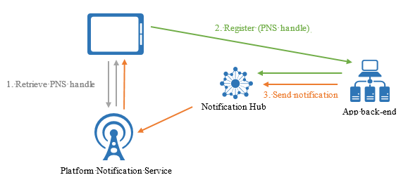

<properties
    pageTitle="Verwaltung der Registrierung"
    description="In diesem Thema wird erläutert, wie Geräte mit Benachrichtigung Hubs registrieren, um Pushbenachrichtigungen zu erhalten."
    services="notification-hubs"
    documentationCenter=".net"
    authors="ysxu"
    manager="erikre"
    editor=""/>

<tags
    ms.service="notification-hubs"
    ms.workload="mobile"
    ms.tgt_pltfrm="mobile-multiple"
    ms.devlang="dotnet"
    ms.topic="article"
    ms.date="06/29/2016"
    ms.author="yuaxu"/>

# Verwaltung der Registrierung

##(Übersicht)

In diesem Thema wird erläutert, wie Geräte mit Benachrichtigung Hubs registrieren, um Pushbenachrichtigungen zu erhalten. Das Thema beschreibt Registrierungen auf hoher Ebene, und klicken Sie dann führt die zwei Hauptfenster Muster zum Registrieren Geräte: vom Gerät direkt an den Hub Benachrichtigung registrieren und über eine Anwendung Back-End-registrieren. 

##Was ist die Registrierung von Gerät

Gerät Registration wird mit einer Benachrichtigung Hub erfolgt mithilfe einer **Registrierung** oder **Installation**.

#### Registrierungen
Eine Registrierung ordnet das Plattform Benachrichtigung Service (PNS) Handle für ein Gerät Kategorien und möglicherweise eine Vorlage. Der Ziehpunkt PNS könnte ein ChannelURI, Gerät Token oder GCM Registrierung-Id an. Tags werden verwendet, um Benachrichtigungen an den richtigen Satz von Gerät Ziehpunkte weiterzuleiten. Weitere Informationen finden Sie unter [Routing und Kategorie Ausdrücke](notification-hubs-tags-segment-push-message.md). Vorlagen werden verwendet, um die pro Registrierung Transformation implementieren. Weitere Informationen finden Sie unter [Vorlagen](notification-hubs-templates-cross-platform-push-messages.md).

#### Installationen
Eine Installation ist eine erweiterte Registrierung, die eine Sammlung von Pushbenachrichtigungen enthält verknüpfte Eigenschaften. Es ist die neueste und beste Ansatz zum Registrieren Ihrer Geräte. Es wird jedoch nicht von clientseitigen .NET SDK ([Benachrichtigung Hub SDK für Back-End-Vorgänge](https://www.nuget.org/packages/Microsoft.Azure.NotificationHubs/)) bis jetzt noch unterstützt.  Dies bedeutet, wenn Sie über das Client-Gerät selbst erfassen möchten, müssen Sie möchten die [Benachrichtigung Hubs REST-API](https://msdn.microsoft.com/library/mt621153.aspx) Ansatz zur Unterstützung von Installationen. Wenn Sie einen Back-End-Dienst verwenden, sollten Sie [Benachrichtigung Hub SDK für Back-End-Vorgänge](https://www.nuget.org/packages/Microsoft.Azure.NotificationHubs/)verwenden.

Im folgenden werden einige wichtige Vorteile der Verwendung von Installationen:

* Erstellen oder Aktualisieren einer Installation ist vollständig Idempotent. Sie können es ohne Rücksicht auf doppelte Registrierungen wiederholen.
* Das Modell Installation erleichtert das einzelne schiebt - verwendet, bestimmtes Gerät ausführen. Eine Kategorie System **"$InstallationId: [InstallationId]"** wird mit jeder Installation Grundlage Erfassung automatisch hinzugefügt. So können Sie ein bestimmtes Gerät zu adressieren, ohne zusätzliche Codierung kann dieses Tag des Empfängers aufrufen.
* Mithilfe von Installationen können Sie auch tun teilweise Registration wird aktualisiert. Das teilweise Aktualisieren einer Installation angefordert wird mit einer PATCH Methode mithilfe des [JSON-Patch Standard](https://tools.ietf.org/html/rfc6902). Dies ist besonders hilfreich, wenn die Kategorien der Registrierung aktualisiert werden sollen. Sie müssen nicht die gesamte Registrierung ermöglichte, und senden Sie alle vorherigen Tags erneut erneut.

Kann eine Installation enthalten die folgenden Eigenschaften. Um eine vollständige Liste der Installation Eigenschaften anzeigen möchten, [Erstellen oder überschreiben eine Installation mit REST-API](https://msdn.microsoft.com/library/azure/mt621153.aspx) oder [Installationseigenschaften](https://msdn.microsoft.com/library/azure/microsoft.azure.notificationhubs.installation_properties.aspx) für die.

    // Example installation format to show some supported properties
    {
        installationId: "",
        expirationTime: "",
        tags: [],
        platform: "",
        pushChannel: "",
        ………
        templates: {
            "templateName1" : {
                body: "",
                tags: [] },
            "templateName2" : {
                body: "",
                // Headers are for Windows Store only
                headers: {
                    "X-WNS-Type": "wns/tile" }
                tags: [] }
        },
        secondaryTiles: {
            "tileId1": {
                pushChannel: "",
                tags: [],
                templates: {
                    "otherTemplate": {
                        bodyTemplate: "",
                        headers: {
                            ... }
                        tags: [] }
                }
            }
        }
    }

 

Es ist zu beachten, dass Registrierungen und Installationen standardmäßig nicht mehr ablaufen.

Registrierungen und Installationen müssen ein gültiges PNS Handle für jedes Gerät-Kanal enthalten. Da PNS Ziehpunkte nur in einer Client-app auf dem Gerät abgerufen werden können, ist ein Muster direkt auf dem Gerät mit der Client-app zu registrieren. Andererseits, möglicherweise zur Sicherheit und Geschäftslogik im Zusammenhang mit Kategorien verwalten Gerät Registrierung in die Back-End-app erforderlich. 

#### Vorlagen

Wenn Sie [Vorlagen](notification-hubs-templates-cross-platform-push-messages.md)verwenden möchten, halten Sie die Geräteinstallation auch alle Vorlagen, die in einer JSON Gerät gehörenden formatieren (siehe Beispiel oben). Die Vorlagennamen Hilfe Ziel verschiedene Vorlagen für die gleichen Gerät.

Beachten Sie, dass jede Vorlagenname eine Vorlage Stelle und eine optionale Gruppe von Tags zugeordnet ist. Darüber hinaus kann jede Plattform zusätzliche Eigenschaften verfügen. Für Windows Store (Verwendung von WNS) und Windows Phone 8 (mit MPNS) kann eine Reihe von Überschriften weitere Teil der Vorlage sein. Bei APNs können Sie eine Eigenschaft nach Ablauf entweder eine Konstante oder einen Vorlagenausdruck festlegen. Um eine vollständige Liste der Installation anzeigen Eigenschaften möchten, [Erstellen oder überschreiben eine Installation mit weiteren](https://msdn.microsoft.com/library/azure/mt621153.aspx) Thema.

#### Sekundäre Kacheln für Windows Store-Apps

Für Windows Store-Clientanwendungen ist an eine andere sekundäre Kacheln Benachrichtigungen senden an die primäre eine senden identisch. Dies wird auch in Installationen unterstützt. Beachten Sie, dass sekundäre Kacheln einer anderen ChannelUri, die auf Ihre app Client das SDK transparent behandelt.

Das Wörterbuch SecondaryTiles verwendet die gleichen TileId, die zum Erstellen des SecondaryTiles-Objekts in der Windows Store-app verwendet wird.
Wie bei der primären ChannelUri können ChannelUris der sekundäre Kacheln zu einem beliebigen Zeitpunkt ändern. Um Installationen im Infobereich Hub Aktualisierung beibehalten möchten, müssen sie das Gerät mit den aktuellen ChannelUris der sekundären Kacheln aktualisieren.

##Verwaltung der Registrierung vom Gerät

Wenn Gerät Registrierung von Client-apps verwalten zu können, ist die Back-End-nur für das Senden von Benachrichtigungen verantwortlich. Client-apps PNS Ziehpunkte auf dem neuesten Stand bleiben und Tags registrieren. Die folgende Abbildung zeigt dieses Muster.

Das Gerät zunächst den Ziehpunkt PNS aus der PNS abgerufen und dann direkt mit dem Hub Benachrichtigung registriert. Nachdem die Registrierung erfolgreich ist, kann die app Back-End-eine Benachrichtigung, dass die Registrierung verwendet senden. Weitere Informationen zum Senden von Benachrichtigungen finden Sie unter [Routing und Kategorie Ausdrücke](notification-hubs-tags-segment-push-message.md).
Notiz, die Sie in diesem Fall vorgesehenen Abhören nur Zugriffsrechte für Ihre Benachrichtigung Hubs vom Gerät. Weitere Informationen finden Sie unter [Sicherheit](notification-hubs-push-notification-security.md).

Vom Gerät registriert ist die einfachste Methode, aber es hat einige Nachteile.
Der erste besteht darin, dass eine Clientanwendung nur seine Tags aktualisieren kann, wenn die app aktiv ist. Beispielsweise, wenn ein Benutzer zwei Geräten, die im Zusammenhang mit Sport Teams verfügt, wenn das erste Gerät für eine zusätzliche Kategorie (beispielsweise Seahawks) registriert Kategorien registrieren, erhalten das zweite Gerät die Benachrichtigungen über die Seahawks erst, wenn die app auf das zweite Gerät ein zweites Mal ausgeführt wird. Allgemeiner, wenn Kategorien von mehreren Geräten betroffen sind, ist die Back-End-Kategorien verwalten eine wünschenswert Option.
Die zweite Rückerstattung von Registrierung Management aus der Client-app ist, da apps Hacker werden können, die Sicherung der Registrierung zu bestimmten Tags besonders gut erfordert die wie erläutert im Abschnitt "Kategorie Ebene Sicherheit".

#### Beispielcode mit einer Benachrichtigung-Hub auf einem Gerät mit einer Installation registrieren. 

Zu diesem Zeitpunkt ist dies nur die Verwendung der [Benachrichtigung Hubs REST-API](https://msdn.microsoft.com/library/mt621153.aspx)unterstützt.

Sie können Sie auch die PATCH-Methode unter Verwendung des [Standard JSON-Patch](https://tools.ietf.org/html/rfc6902) für die Installation zu aktualisieren.

    class DeviceInstallation
    {
        public string installationId { get; set; }
        public string platform { get; set; }
        public string pushChannel { get; set; }
        public string[] tags { get; set; }
    }

    private async Task<HttpStatusCode> CreateOrUpdateInstallationAsync(DeviceInstallation deviceInstallation,
         string hubName, string listenConnectionString)
    {
        if (deviceInstallation.installationId == null)
            return HttpStatusCode.BadRequest;

        // Parse connection string (https://msdn.microsoft.com/library/azure/dn495627.aspx)
        ConnectionStringUtility connectionSaSUtil = new ConnectionStringUtility(listenConnectionString);
        string hubResource = "installations/" + deviceInstallation.installationId + "?";
        string apiVersion = "api-version=2015-04";

        // Determine the targetUri that we will sign
        string uri = connectionSaSUtil.Endpoint + hubName + "/" + hubResource + apiVersion;

        //=== Generate SaS Security Token for Authorization header ===
        // See, https://msdn.microsoft.com/library/azure/dn495627.aspx
        string SasToken = connectionSaSUtil.getSaSToken(uri, 60);

        using (var httpClient = new HttpClient())
        {
            string json = JsonConvert.SerializeObject(deviceInstallation);

            httpClient.DefaultRequestHeaders.Add("Authorization", SasToken);

            var response = await httpClient.PutAsync(uri, new StringContent(json, System.Text.Encoding.UTF8, "application/json"));
            return response.StatusCode;
        }
    }

    var channel = await PushNotificationChannelManager.CreatePushNotificationChannelForApplicationAsync();

    string installationId = null;
    var settings = ApplicationData.Current.LocalSettings.Values;

    // If we have not stored a installation id in application data, create and store as application data.
    if (!settings.ContainsKey("__NHInstallationId"))
    {
        installationId = Guid.NewGuid().ToString();
        settings.Add("__NHInstallationId", installationId);
    }

    installationId = (string)settings["__NHInstallationId"];

    var deviceInstallation = new DeviceInstallation
    {
        installationId = installationId,
        platform = "wns",
        pushChannel = channel.Uri,
        //tags = tags.ToArray<string>()
    };

    var statusCode = await CreateOrUpdateInstallationAsync(deviceInstallation, 
                        "<HUBNAME>", "<SHARED LISTEN CONNECTION STRING>");

    if (statusCode != HttpStatusCode.Accepted)
    {
        var dialog = new MessageDialog(statusCode.ToString(), "Registration failed. Installation Id : " + installationId);
        dialog.Commands.Add(new UICommand("OK"));
        await dialog.ShowAsync();
    }
    else
    {
        var dialog = new MessageDialog("Registration successful using installation Id : " + installationId);
        dialog.Commands.Add(new UICommand("OK"));
        await dialog.ShowAsync();
    }

   

#### Beispielcode mit einer Benachrichtigung-Hub auf einem Gerät mit einer Registrierung registrieren.

Diese Methoden erstellen oder aktualisieren eine Registrierung für das Gerät, auf dem sie aufgerufen werden. Dies bedeutet, dass akzeptieren, aktualisieren den Ziehpunkt oder die Kategorien, um die gesamte Registrierung überschrieben werden muss. Denken Sie daran, dass Registrierungen, sodass Sie immer einer zuverlässigen Store mit den aktuellen Tags haben soll, die ein bestimmtes Gerät muss vorübergehend sind.

    // Initialize the Notification Hub
    NotificationHubClient hub = NotificationHubClient.CreateClientFromConnectionString(listenConnString, hubName);

    // The Device id from the PNS
    var pushChannel = await PushNotificationChannelManager.CreatePushNotificationChannelForApplicationAsync();

    // If you are registering from the client itself, then store this registration id in device
    // storage. Then when the app starts, you can check if a registration id already exists or not before
    // creating.
    var settings = ApplicationData.Current.LocalSettings.Values;

    // If we have not stored a registration id in application data, store in application data.
    if (!settings.ContainsKey("__NHRegistrationId"))
    {
        // make sure there are no existing registrations for this push handle (used for iOS and Android)    
        string newRegistrationId = null;
        var registrations = await hub.GetRegistrationsByChannelAsync(pushChannel.Uri, 100);
        foreach (RegistrationDescription registration in registrations)
        {
            if (newRegistrationId == null)
            {
                newRegistrationId = registration.RegistrationId;
            }
            else
            {
                await hub.DeleteRegistrationAsync(registration);
            }
        }

        newRegistrationId = await hub.CreateRegistrationIdAsync();

        settings.Add("__NHRegistrationId", newRegistrationId);
    }
     
    string regId = (string)settings["__NHRegistrationId"];

    RegistrationDescription registration = new WindowsRegistrationDescription(pushChannel.Uri);
    registration.RegistrationId = regId;
    registration.Tags = new HashSet<string>(YourTags);

    try
    {
        await hub.CreateOrUpdateRegistrationAsync(registration);
    }
    catch (Microsoft.WindowsAzure.Messaging.RegistrationGoneException e)
    {
        settings.Remove("__NHRegistrationId");
    }

## Verwaltung der Registrierung aus einer Back-End-

Verwalten von Registrierungen über die Back-End-erfordert zusätzlichen Code. Der aktualisierten PNS handle für die Back-End jedes Mal (zusammen mit Kategorien und Vorlagen) die app gestartet wird, und die Back-End-dieses Handle auf die Benachrichtigung Hub aktualisieren muss, muss die app vom Gerät bereitstellen. Die folgende Abbildung zeigt dieses Design.

Verwalten von Registrierungen über die Back-End-Vorteile die Möglichkeit zum Ändern von Kategorien zu Registrierungen auch, wenn die entsprechende app auf dem Gerät nicht aktiv ist, und die app Client authentifiziert wird, bevor er seine Registrierung eine Markierung hinzugefügt.

#### Beispielcode mit einer Benachrichtigung Hub aus einer Back-End-mit einer Installation registrieren.

Das Client-Gerät weiterhin sein PNS Ziehpunkt und relevanten Installationseigenschaften als vor abgerufen und ruft eine benutzerdefinierte API auf die Back-End-, die die Registrierung durchführen und Tags usw. autorisieren kann. Die Back-End-kann die [Benachrichtigung Hub SDK für Back-End-Vorgänge](https://www.nuget.org/packages/Microsoft.Azure.NotificationHubs/)genutzt werden.

Sie können Sie auch die PATCH-Methode unter Verwendung des [Standard JSON-Patch](https://tools.ietf.org/html/rfc6902) für die Installation zu aktualisieren.
 

    // Initialize the Notification Hub
    NotificationHubClient hub = NotificationHubClient.CreateClientFromConnectionString(listenConnString, hubName);

    // Custom API on the backend
    public async Task<HttpResponseMessage> Put(DeviceInstallation deviceUpdate)
    {

        Installation installation = new Installation();
        installation.InstallationId = deviceUpdate.InstallationId;
        installation.PushChannel = deviceUpdate.Handle;
        installation.Tags = deviceUpdate.Tags;

        switch (deviceUpdate.Platform)
        {
            case "mpns":
                installation.Platform = NotificationPlatform.Mpns;
                break;
            case "wns":
                installation.Platform = NotificationPlatform.Wns;
                break;
            case "apns":
                installation.Platform = NotificationPlatform.Apns;
                break;
            case "gcm":
                installation.Platform = NotificationPlatform.Gcm;
                break;
            default:
                throw new HttpResponseException(HttpStatusCode.BadRequest);
        }

        // In the backend we can control if a user is allowed to add tags
        //installation.Tags = new List<string>(deviceUpdate.Tags);
        //installation.Tags.Add("username:" + username);

        await hub.CreateOrUpdateInstallationAsync(installation);

        return Request.CreateResponse(HttpStatusCode.OK);
    }

#### Beispielcode zum Registrieren einer Benachrichtigung-Hub auf einem Gerät mit einer Registrierung-id

Klicken Sie auf Ihre app Back-End-können Sie CRUDS Standardvorgänge auf Registrierungen ausführen. Beispiel:

    var hub = NotificationHubClient.CreateClientFromConnectionString("{connectionString}", "hubName");
            
    // create a registration description object of the correct type, e.g.
    var reg = new WindowsRegistrationDescription(channelUri, tags);

    // Create
    await hub.CreateRegistrationAsync(reg);

    // Get by id
    var r = await hub.GetRegistrationAsync<RegistrationDescription>("id");

    // update
    r.Tags.Add("myTag");

    // update on hub
    await hub.UpdateRegistrationAsync(r);

    // delete
    await hub.DeleteRegistrationAsync(r);

Die Back-End-muss Parallelität zwischen Registration wird aktualisiert. Dienstbus bietet optimistische Konfliktmodell für die Verwaltung der Registrierung. Auf HTTP-Ebene wird dies mit der Verwendung von ETag auf Registrierung Management Vorgänge implementiert. Dieses Feature wird von Microsoft-SDKs, die Ausnahme aus, wenn ein Update Parallelität Gründen abgelehnt wird, transparent verwendet. Die app Back-End-wird zur Behandlung von folgenden Ausnahmen, und wiederholen die Aktualisierung, falls erforderlich.