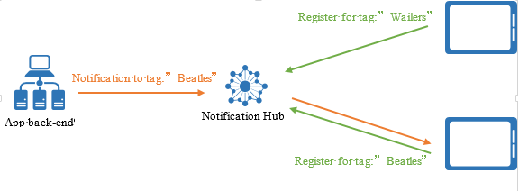
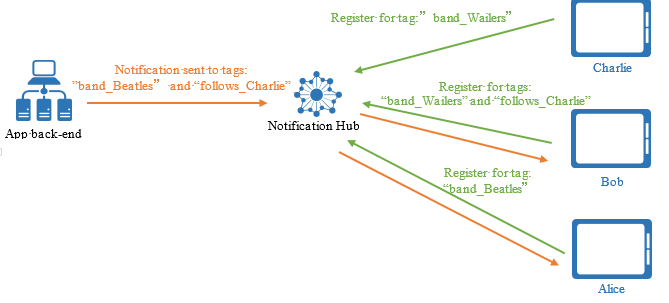
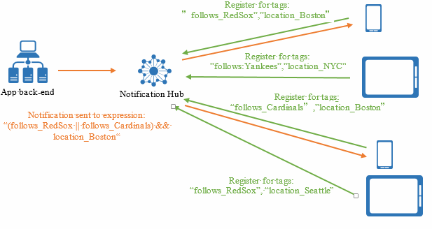

<properties
    pageTitle="Routing und Kategorie Ausdrücke"
    description="In diesem Thema wird erläutert, routing und Kategorie Ausdrücke für Azure Benachrichtigung Hubs."
    services="notification-hubs"
    documentationCenter=".net"
    authors="ysxu"
    manager="erikre"
    editor=""/>

<tags
    ms.service="notification-hubs"
    ms.workload="mobile"
    ms.tgt_pltfrm="mobile-multiple"
    ms.devlang="dotnet"
    ms.topic="article"
    ms.date="06/29/2016"
    ms.author="yuaxu"/>

# Routing und Kategorie Ausdrücken

##(Übersicht)

Kategorisieren von Ausdrücken können Sie Ziel bestimmte Sätze von Geräten oder genauer Registrierungen, beim Senden einer Benachrichtigung Pushbenachrichtigungen durch Benachrichtigung Hubs.

## Bestimmte Registrierungen verwendet

Die einzige Möglichkeit zum Ziel bestimmte Benachrichtigung Registrierungen besteht darin, Kategorien zuordnen können, klicken Sie dann als Ziel dieser Tags. Wie in der [Registrierung Management](notification-hubs-push-notification-registration-management.md)erläutert, muss um Pushbenachrichtigungen zu erhalten eine app Griff Gerät auf einem Hub Benachrichtigung registrieren. Nachdem eine Registrierung klicken Sie auf eine Benachrichtigung Hub erstellt wurde, kann die Anwendung Back-End-Pushbenachrichtigungen zu senden.
Die Anwendung Back-End-kann in eine bestimmte Benachrichtigung Ziel Registrierungen auf folgende Weise auswählen:

1. **Übertragen**: alle Registrierungen im Hub Benachrichtigung darüber informiert.
2. **Kategorie**: alle Registrierungen, die die angegebene Kategorie enthalten darüber informiert.
3. **Tag-Ausdruck**: alle Registrierungen, deren Satz von Tags entsprechen den angegebenen Ausdruck, darüber informiert.

## Kategorien

Eine Kategorie kann eine Zeichenfolge, die bis zu 120, enthält alphanumerische Zeichen und die folgenden nicht alphanumerische Zeichen sein: '_', ‘@’, '#', '. ',':', ' – '. Im folgenden Beispiel wird eine Anwendung Spruch Benachrichtigungen zu bestimmten Musik Gruppen empfangen. In diesem Szenario ist eine einfache Möglichkeit zum Routing Benachrichtigungen zu Bezeichnung Registrierungen mit Kategorien, die die verschiedenen Bereiche, wie in der nachstehenden Abbildung darstellen.

In der folgenden Abbildung erreicht die Meldung markiertes **Beatles** Tablet, die mit dem Tag **Beatles**registriert.

Weitere Informationen zum Erstellen von Registrierungen für Kategorien finden Sie unter [Registrierung Management](notification-hubs-push-notification-registration-management.md).

Sie können mithilfe der gesendeten Textnachricht Methoden der Kategorien Benachrichtigungen senden der `Microsoft.Azure.NotificationHubs.NotificationHubClient` Class in [Microsoft Azure Benachrichtigung Hubs](https://www.nuget.org/packages/Microsoft.Azure.NotificationHubs/) SDK. Sie können auch Node.js oder die Pushbenachrichtigungen Benachrichtigungen REST-APIs verwenden.  Hier ist ein Beispiel für die Verwendung des SDKS.

    Microsoft.Azure.NotificationHubs.NotificationOutcome outcome = null;

    // Windows 8.1 / Windows Phone 8.1
    var toast = @"<toast><visual><binding template=""ToastText01""><text id=""1"">" +
    "You requested a Beatles notification</text></binding></visual></toast>";
    outcome = await Notifications.Instance.Hub.SendWindowsNativeNotificationAsync(toast, "Beatles");

    // Windows 10
    toast = @"<toast><visual><binding template=""ToastGeneric""><text id=""1"">" +
    "You requested a Wailers notification</text></binding></visual></toast>";
    outcome = await Notifications.Instance.Hub.SendWindowsNativeNotificationAsync(toast, "Wailers");

Tags keine vorab bereitgestellt werden müssen, und können auf mehrere app-spezifische Konzepte verweisen. Beispielsweise können Benutzer dieser Anwendung Beispiel Bänder Kommentieren und Toasts, nicht nur für die Kommentare auf ihre bevorzugten Bänder, sondern auch für alle Kommentare von ihren Freunden, unabhängig von der Band erhalten, auf welche Weise das Kommentieren, möchten. Die folgende Abbildung zeigt ein Beispiel für dieses Szenario:

In der folgenden Abbildung Alice Aktualisierungen für die Beatles interessiert ist, und Bob Aktualisierungen für die Wailers interessiert ist. Bob ist auch Torstens Kommentare interessiert und Torsten der Wailers interessiert. Wenn für Torstens Kommentar auf die Beatles eine Benachrichtigung gesendet wird, erhalten Alice und Bob es.

Während Sie mehrere Bedenken in Kategorien (beispielsweise "Band_Beatles" oder "Follows_Charlie") codiert werden können, sind Kategorien einfache Zeichenfolgen und nicht an Eigenschaften mit Werten. Eine Registrierung ist nur in vorhanden sind oder nicht von einer bestimmten Kategorie gesucht wird.

Eine vollständige schrittweises Lernprogramm zum Verwenden von Kategorien für das Senden an Zinsen Gruppen finden Sie unter [Unterbrechen News](notification-hubs-windows-notification-dotnet-push-xplat-segmented-wns.md).

## Mithilfe von Kategorien für Zielgruppen

Eine weitere Möglichkeit zum Verwenden von Tags ist, um alle Geräte eines bestimmten Benutzers zu identifizieren. Registrierungen können mit einem Tag markiert sein, die Benutzer-Id, wie die folgende Abbildung enthält:

In der folgenden Abbildung erreicht der Uid:Alice Nachricht markiert alle Registrierungen markiertes Uid:Alice; daher alle Annas Geräte.

##Kategorie Ausdrücken

Es gibt Fälle, in denen eine Benachrichtigung aufweist, eine Reihe von Registrierungen werden sollen, die nicht durch ein einzelnes Tag, aber ein boolescher Ausdruck auf Kategorien identifiziert wird.

Erwägen Sie eine Sports-Anwendung, die eine Erinnerung für jede Person in Boston über ein Spiel zwischen Rot Sox und Cardinals sendet. Wenn die app Client Kategorien zu Zinsen in Teams und Speicherort registriert, sollte die Benachrichtigung für jede Person in Boston abgestimmt werden, entweder die Rot Sox oder die Cardinals interessiert ist. Diese Bedingung kann mit den folgenden boolescher Ausdruck formuliert werden:

    (follows_RedSox || follows_Cardinals) && location_Boston

Kategorie Ausdrücke enthalten alle boolesche Operatoren, wie und (& &), oder (|), und nicht (!). Sie können auch Klammern enthalten. Kategorie Ausdrücke sind auf 20 Kategorien beschränkt, wenn sie nur oder enthalten; Andernfalls sind sie auf 6 Kategorien beschränkt.

Hier ist ein Beispiel für das Senden von Benachrichtigungen mit Kategorie Ausdrücken mithilfe des SDK ein.

    Microsoft.Azure.NotificationHubs.NotificationOutcome outcome = null;

    String userTag = "(location_Boston && !follows_Cardinals)"; 

    // Windows 8.1 / Windows Phone 8.1
    var toast = @"<toast><visual><binding template=""ToastText01""><text id=""1"">" +
    "You want info on the Red Socks</text></binding></visual></toast>";
    outcome = await Notifications.Instance.Hub.SendWindowsNativeNotificationAsync(toast, userTag);

    // Windows 10
    toast = @"<toast><visual><binding template=""ToastGeneric""><text id=""1"">" +
    "You want info on the Red Socks</text></binding></visual></toast>";
    outcome = await Notifications.Instance.Hub.SendWindowsNativeNotificationAsync(toast, userTag);
