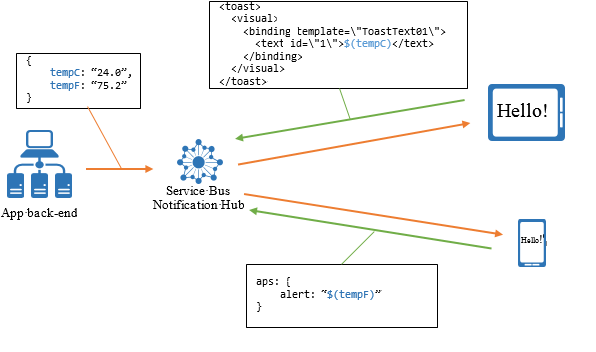

<properties
    pageTitle="Vorlagen"
    description="In diesem Thema wird Vorlagen für Azure Benachrichtigung Hubs erläutert."
    services="notification-hubs"
    documentationCenter=".net"
    authors="ysxu"
    manager="erikre"
    editor=""/>

<tags
    ms.service="notification-hubs"
    ms.workload="mobile"
    ms.tgt_pltfrm="mobile-multiple"
    ms.devlang="multiple"
    ms.topic="article"
    ms.date="06/29/2016"
    ms.author="yuaxu"/>

# Vorlagen

##(Übersicht)

Aktivieren von Vorlagen eine Clientanwendung das genaue Format der Benachrichtigungen angeben, die empfangen werden sollen. Mithilfe von Vorlagen kann eine app mehrere verschiedene, einschließlich der folgenden Vorteile:

* Eine Plattform-unabhängige Back-End-

* Individuelle Benachrichtigungen

* Client-Versionsunabhängigkeit

* Einfache Lokalisierung

Dieser Abschnitt enthält Beispiele zur Verwendung von Vorlagen für das Plattform-unabhängige Benachrichtigungen für alle Ihre Geräte auf Plattformen senden und Personalisieren von übertragenen Benachrichtigung zu jedem Gerät mit zwei detaillierte beschrieben.

##Verwenden von Vorlagen Cross-Plattform

Standardverfahren zum Senden von Pushbenachrichtigungen besteht darin, für jede Benachrichtigung zu senden, die gesendet werden sollen, wird eine bestimmte Nutzlast in Plattform Benachrichtigung Services (WNS, APNS) ist. Zum Senden einer Benachrichtigung zu APNS beträgt beispielsweise die Nutzlast ein Json-Objekt im folgenden Format an:

    {"aps": {"alert" : "Hello!" }}

Um eine ähnliche Meldung der Spruch auf einem Windows Store-Anwendung zu senden, wird die XML-Nutzlast wie folgt:

    <toast>
      <visual>
        <binding template=\"ToastText01\">
          <text id=\"1\">Hello!</text>
        </binding>
      </visual>
    </toast>

Sie können ähnliche Fracht für MPNS (Windows Phone) und GCM (Android) Plattformen erstellen.

Diese Anforderung erzwingt der app Back-End-werden verschiedene Fracht für jede Plattform und effektiv die Back-End-Teil der Präsentationsebene der app verantwortlich ist. Einige Aspekte lauten Lokalisierung und grafisch Layouts (vor allem für Windows Store-apps, die Benachrichtigungen für verschiedene Arten von Kacheln enthalten) an.

Das Benachrichtigung Hubs Vorlage Feature ermöglicht eine Client-app erstellen spezielle Registrierungen, aufgerufen Vorlage Registrierungen, die neben dem Satz von Tags, eine Vorlage enthalten. Das Benachrichtigung Hubs Vorlage Feature ermöglicht eine app Client, Geräte mit Vorlagen zugeordnet werden soll, ob Sie mit Installationen (empfohlen) oder Registrierungen arbeiten. Ausgehend von der vorherigen Beispielen Nutzlast, ist die Plattform-unabhängige Informationen der ist-Benachrichtigung (Hallo!) aus. Eine Vorlage ist eine Reihe von Anweisungen für den Hub Benachrichtigung zum Formatieren einer Nachricht Plattform-unabhängige für die Registrierung von dieser bestimmten Client-app. Im vorherigen Beispiel ist die Plattform unabhängig Nachricht eine einzelne Eigenschaft: **Nachricht = Hallo!**.

Die folgende Abbildung verdeutlicht den Vorgang des oben:

Die Vorlage für die Registrierung iOS Clients app lautet wie folgt aus:

    {"aps": {"alert": "$(message)"}}

Die entsprechende Vorlage für die Windows Store-app-Client lautet:

    <toast>
        <visual>
            <binding template=\"ToastText01\">
                <text id=\"1\">$(message)</text>
            </binding>
        </visual>
    </toast>

Beachten Sie, dass die eigentliche Nachricht für den Ausdruck $(Nachricht a13). Dieser Ausdruck weist im Hub Benachrichtigung bei jedem eine Nachricht an diese bestimmten Registrierung sendet, um eine Nachricht zu erstellen, die sie und wechselt in den vorkommenden Wert folgt.

Wenn Sie mit der Installation Modell arbeiten, enthält die Installation "Templates"-Taste eine JSON mehrere Vorlagen. Wenn Sie mit der Registrierung Modell arbeiten, kann die Clientanwendung mehrere Registrierungen erstellen, um mehrere Vorlagen zu verwenden; Angenommen, eine Vorlage für Warnhinweise und einer Vorlage für Kachel Updates. Clientanwendungen können auch systemeigenen Registrierungen (Registrierungen ohne Vorlage) und Vorlage Registrierungen kombinieren.

Die Benachrichtigung Hub sendet eine Benachrichtigung für jede Vorlage ohne überlegen, ob sie mit der gleichen Client gehören. Dieses Verhalten kann zum Übersetzen Plattform unabhängig von Benachrichtigungen in weitere Benachrichtigungen verwendet werden. Beispielsweise kann dieselbe Plattform unabhängig Nachricht an den Hub Benachrichtigung nahtlos in einer Benachrichtigung Spruch und einer Aktualisierung der Kachel übersetzt werden ohne die Back-End-bewusst sein. Beachten Sie, dass einige Plattformen (z. B. iOS) mehrere Benachrichtigungen auf dem gleichen Gerät reduzieren möglicherweise, wenn sie in einer kurzen Zeitspanne gesendet werden.

##Verwenden von Vorlagen für die Personalisierung

Ein weiterer Vorteil bei der Verwendung von Vorlagen wird die Möglichkeit, Benachrichtigung Hubs auszuführenden pro Registrierung Personalisierung von Benachrichtigungen zu verwenden. Angenommen Sie, eine app Wetter, die an einer bestimmten Stelle eine Kachel mit der Wetterbedingungen angezeigt werden. Ein Benutzer kann zwischen Celsius oder Fahrenheit Grad und eine einzelne oder 5 Tagen Planung auswählen. Mithilfe von Vorlagen kann jeder Client-app-Installation für das erforderliche Format registrieren (1 Tag Celsius, 1 Tag Fahrenheit, 5 Tage Celsius, 5 Tage Fahrenheit), und Sie haben die Back-End-eine einzelne Nachricht senden, die alle Angaben zum Füllen Sie diese Vorlagen (beispielsweise eine 5 Tage SCHÄTZER mit Celsius und Fahrenheit Grad) enthält.

Die Vorlage für die Chi-Tages-Wettervorhersage mit Celsius Temperaturen sieht wie folgt aus:

    <tile>
      <visual>
        <binding template="TileWideSmallImageAndText04">
          <image id="1" src="$(day1_image)" alt="alt text"/>
          <text id="1">Seattle, WA</text>
          <text id="2">$(day1_tempC)</text>
        </binding>  
      </visual>
    </tile>

Die Nachricht an den Hub Benachrichtigung gesendet enthält alle die folgenden Eigenschaften:

<table border="1">
<tr><td>day1_image</td><td>day2_image</td><td>day3_image</td><td>day4_image</td><td>day5_image</td></tr>
<tr><td>day1_tempC</td><td>day2_tempC</td><td>day3_tempC</td><td>day4_tempC</td><td>day5_tempC</td></tr>
<tr><td>day1_tempF</td><td>day2_tempF</td><td>day3_tempF</td><td>day4_tempF</td><td>day5_tempF</td></tr>
</table> 

Mithilfe dieses Muster sendet die Back-End-nur eine einzelne Nachricht ohne bestimmte Personalisierungsoptionen für die app-Benutzer speichern zu müssen. Die folgende Abbildung zeigt dieses Szenario:

##Wie Sie Vorlagen registrieren.

Um mit der Installation Modell (empfohlen) oder das Modell Registrierung Vorlagen registrieren, finden Sie unter [Verwaltung der Registrierung](notification-hubs-push-notification-registration-management.md).

##Vorlage Ausdruckssprache

Vorlagen sind in XML- oder JSON-Dokumentformate beschränkt. Darüber hinaus können Sie Ausdrücke nur an bestimmten Speicherorten platzieren; beispielsweise Knotenattribute oder Werte für XML Zeichenfolgenwerte Eigenschaft für JSON.

Die folgende Tabelle zeigt die Sprache, die in Vorlagen zulässig sind:

| Ausdruck | Beschreibung |
|------------|-------------|
| $(prop) | Verweis auf eine Ereigniseigenschaft mit dem angegebenen Namen. Eigenschaftennamen werden nicht beachtet. Dieser Ausdruck aufgelöst in den Wert der Eigenschaft Text oder in eine leere Zeichenfolge zurück, wenn die Eigenschaft nicht vorhanden ist. |
| $(Prop, n) | Wie oben aber der Text wird explizit abgeschnitten bei n Zeichen, beispielsweise $(Titel, 20) schneidet die-Inhalte der Title-Eigenschaft bei 20 Zeichen. |
| . (Prop, n) | Wie oben aber der Text mit den drei Punkten Suffix ist, wie sie abgeschnitten ist. Die Gesamtgröße der abgeschnittenen Zeichenfolge und das Suffix überschreitet n Zeichen nicht. . (Titel, 20) mit einer Eingabe Eigenschaft "Dies ist die Betreffzeile" ergibt **hier den Titel...** |
| %(Prop) | Ähnlich wie $(name) mit dem Unterschied, dass die Ausgabe URI-codierte ist. |
| #(Prop) | In JSON-Vorlagen verwendet (beispielsweise für iOS und Android Vorlagen).  Diese Funktion funktioniert genau wie zuvor angegeben, außer bei Verwendung in JSON-Vorlagen (z. B. Apple-Vorlagen) $(prop). In diesem Fall, wenn diese Funktion nicht von umgeben ist "{','}" (z. B. 'MyJsonProperty': "#(Name)"), und es wird als Zahl ausgewertet im Javascript-Format, beispielsweise Regexp: (0 & #124; (& #91; 1 bis 9 & #93; & #91; 0-9 und #93 ;*))(\.& #91; 0-9 & #93; +) ? ((e & #124; E) (+ & #124;-) ? & #91; 0-9 & #93; +) ?, und klicken Sie dann auf die Ausgabe JSON ist eine Zahl.  Beispielsweise ' Badge: '#(Name)' wird 'badge': 40 (und nicht '40'). |
| "Text" oder "Text" | Ein Literal. Literalen enthalten beliebigen Text in einfache oder doppelte Anführungszeichen eingeschlossen. |
| Ausdruck1 + Ausdruck2 | Verknüpfen von zwei Ausdrücken zu einer einzigen Zeichenfolge Verkettungsoperator.

Die Ausdrücke können die vorherige Formulare darstellen.

Wenn Verkettung verwenden zu können, muss der gesamte Ausdruck mit {} eingeschlossen werden. Beispielsweise {$(prop) + '-' + $(prop2)}. |

Beispielsweise ist Folgendes nicht gültige XML-Vorlage:

    <tile>
      <visual>
        <binding $(property)>
          <text id="1">Seattle, WA</text>
        </binding>  
      </visual>
    </tile>

Als dargelegt müssen bei Verkettung, Verwendung von Ausdrücken in geschweifte Klammern eingeschlossen werden. Beispiel:

    <tile>
      <visual>
        <binding template="ToastText01">
          <text id="1">{'Hi, ' + $(name)}</text>
        </binding>  
      </visual>
    </tile>

