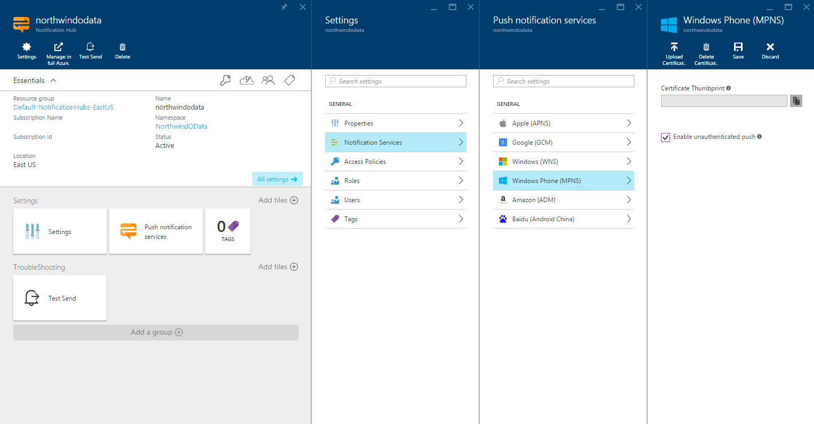

<properties
    pageTitle="Senden von Pushbenachrichtigungen mit Azure Benachrichtigung Hubs für Windows Phone | Microsoft Azure"
    description="In diesem Lernprogramm erfahren Sie, wie Azure Benachrichtigung Hubs um Pushbenachrichtigungen zu einer Windows Phone 8 oder Windows Phone 8.1 Silverlight-Anwendung zu verwenden."
    services="notification-hubs"
    documentationCenter="windows"
    keywords="Drücken Sie die Benachrichtigung, drücken Sie Benachrichtigung, Windows phone-Pushbenachrichtigungen"
    authors="ysxu"
    manager="erikre"
    editor="erikre"/>

<tags
    ms.service="notification-hubs"
    ms.workload="mobile"
    ms.tgt_pltfrm="mobile-windows-phone"
    ms.devlang="dotnet"
    ms.topic="hero-article"
    ms.date="10/03/2016"
    ms.author="yuaxu"/>

# Senden von Pushbenachrichtigungen mit Azure Benachrichtigung Hubs für Windows Phone

[AZURE.INCLUDE [notification-hubs-selector-get-started](../../includes/notification-hubs-selector-get-started.md)]

##(Übersicht)

> [AZURE.NOTE] Um dieses Lernprogramms abgeschlossen haben, müssen Sie ein aktives Azure-Konto verfügen. Wenn Sie kein Konto haben, können Sie ein kostenloses Testversion Konto nur wenigen Minuten erstellen. Weitere Informationen finden Sie unter [Azure kostenlose Testversion](https://azure.microsoft.com/pricing/free-trial/?WT.mc_id=A0E0E5C02&amp;returnurl=http%3A%2F%2Fazure.microsoft.com%2Fen-us%2Fdocumentation%2Farticles%2Fnotification-hubs-windows-phone-get-started%2F).

In diesem Lernprogramm erfahren Sie, wie Sie Azure Benachrichtigung Hubs, um Pushbenachrichtigungen zu einer Windows Phone 8 oder Windows Phone 8.1 Silverlight-Anwendung zu senden. Wenn Sie Windows Phone 8.1 (nicht-Silverlight) verwenden möchten, klicken Sie dann auf die Version [Windows universeller](notification-hubs-windows-store-dotnet-get-started-wns-push-notification.md) verweisen.
In diesem Lernprogramm erstellen Sie eine leere Windows Phone 8-app, die Pushbenachrichtigungen empfängt mithilfe der Microsoft Pushbenachrichtigungen Benachrichtigung Service (MPNS). Wenn Sie fertig sind, wird den Benachrichtigung Hub verwenden, um Pushbenachrichtigungen auf alle Ihre App Geräte übertragen werden.

> [AZURE.NOTE] Die Benachrichtigung Hubs Windows Phone SDK unterstützt mit Windows Pushbenachrichtigungen Benachrichtigung Service (WNS) mit Windows Phone 8.1 Silverlight-apps nicht. WNS (statt MPNS) mit Windows Phone 8.1 Silverlight-apps, führen Sie die [Benachrichtigung Hubs - Lernprogramm Silverlight für Windows Phone], die restlichen APIs verwendet.

Das Lernprogramm wird das einfache übertragenen Szenario sich mit Benachrichtigung Hubs veranschaulicht.

##Erforderliche Komponenten

In diesem Lernprogramm benötigen Sie Folgendes:

+ [Visual Studio 2012 Express für Windows Phone]oder einer späteren Version.

In diesem Lernprogramm durchführen ist eine Voraussetzung für alle anderen Benachrichtigung Hubs Lernprogramme für Windows Phone 8-apps.

##Erstellen Sie den Benachrichtigung hub

[AZURE.INCLUDE [notification-hubs-portal-create-new-hub](../../includes/notification-hubs-portal-create-new-hub.md)]

<ol start="6">
<li>
Klicken Sie im Abschnitt <b>Benachrichtigung Services</b> (innerhalb von <i>Einstellungen</i>) auf, klicken Sie auf <b>Windows Phone (MPNS)</b> , und klicken Sie dann auf das Kontrollkästchen <b>nicht authentifizierte Pushbenachrichtigungen aktivieren</b> .

</li>
</ol>

&emsp;&emsp;

Der Hub ist nun erstellt und so konfiguriert, dass um nicht authentifizierte Benachrichtigung für Windows Phone zu senden.

> [AZURE.NOTE] In diesem Lernprogramm verwendet MPNS in nicht authentifizierten Modus. MPNS nicht authentifizierten Modus Lieferumfang Einschränkungen Benachrichtigungen, die Sie jeden Kanal senden können. Benachrichtigung Hubs unterstützt [MPNS authentifiziert Modus](http://msdn.microsoft.com/library/windowsphone/develop/ff941099.aspx) und ermöglicht Ihnen, Ihre Zertifikat hochladen.

##Verbinden Ihre app an den Hub Benachrichtigung

1. Erstellen Sie eine neue Windows Phone 8-Anwendung in Visual Studio.

    ![Visual Studio - Projekt - Windows Phone-App][13]

    In Visual Studio 2013 Update 2 oder höher, erstellen Sie stattdessen eine Windows Phone Silverlight-Anwendung.

    ![Visual Studio - Projekt - leeren App – mit Windows Phone Silverlight][11]

2. Mit der rechten Maustaste in der Lösung in Visual Studio, und klicken Sie dann auf **NuGet-Pakete verwalten**.

    Zeigt das Dialogfeld " **NuGet-Pakete verwalten** " an.

3. Suchen Sie nach `WindowsAzure.Messaging.Managed` , und klicken Sie auf **Installieren**, und akzeptieren Sie die Nutzungsbedingungen.

    ![Visual Studio - NuGet-Paket-Manager][20]

    Diese downloads, Installationen und fügt einen Verweis auf die Bibliothek Azure Messaging für Windows mithilfe des <a href="http://nuget.org/packages/WindowsAzure.Messaging.Managed/">WindowsAzure.Messaging.Managed NuGet-Paket</a>hinzu.

4. Öffnen Sie die Datei App.xaml.cs, und fügen Sie den folgenden `using` Anweisungen:

        using Microsoft.Phone.Notification;
        using Microsoft.WindowsAzure.Messaging;

5. Fügen Sie den folgenden Code am oberen Rand der **Application_Launching** Methode in App.xaml.cs hinzu:

        var channel = HttpNotificationChannel.Find("MyPushChannel");
        if (channel == null)
        {
            channel = new HttpNotificationChannel("MyPushChannel");
            channel.Open();
            channel.BindToShellToast();
        }

        channel.ChannelUriUpdated += new EventHandler<NotificationChannelUriEventArgs>(async (o, args) =>
        {
            var hub = new NotificationHub("<hub name>", "<connection string>");
            var result = await hub.RegisterNativeAsync(args.ChannelUri.ToString());

            System.Windows.Deployment.Current.Dispatcher.BeginInvoke(() =>
            {
                MessageBox.Show("Registration :" + result.RegistrationId, "Registered", MessageBoxButton.OK);
            });
        });

    >[AZURE.NOTE] Der Wert **MyPushChannel** ist, einen Index, mit dem Sie einen vorhandenen Kanal in der Auflistung [HttpNotificationChannel](https://msdn.microsoft.com/library/windows/apps/microsoft.phone.notification.httpnotificationchannel.aspx) nachschlagen. Wenn nicht vorhanden es ist, erstellen Sie einen neuen Eintrag mit dem Namen ein.
    
    Vergewissern Sie sich auf den Namen der Hub und der Verbindungszeichenfolge aufgerufen **DefaultListenSharedAccessSignature** , die Sie für Ihren Kunden im vorherigen Abschnitt einzufügen.
    Dieser Code Ruft den Channel-URI für die app aus MPNS und registriert dann mit der Benachrichtigung Hub Channel-URI. Darüber hinaus ist gewährleistet, die den Kanal, den URI in der Benachrichtigung Hub jedes Mal registriert ist, die die Anwendung gestartet wird.

    >[AZURE.NOTE]In diesem Lernprogramm sendet eine Benachrichtigung Spruch an das Gerät. Wenn Sie eine Benachrichtigung Kachel senden, müssen Sie stattdessen die **BindToShellTile** -Methode auf dem Kanal aufrufen. Unterstützung für beide Spruch und Benachrichtigungen Kachel, rufen Sie sowohl **BindToShellTile** und **BindToShellToast**.

6. Erweitern Sie im Explorer-Lösung, **Eigenschaften**, öffnen Sie die `WMAppManifest.xml` Datei, klicken Sie auf der Registerkarte **Funktionen** , und stellen Sie sicher, dass die **ID_CAP_PUSH_NOTIFICATION** -Funktion aktiviert ist.

    ![Visual Studio - Windows Phone App-Funktionen][14]

    Dadurch wird sichergestellt, dass Ihre app Pushbenachrichtigungen empfangen kann. Ohne, tritt jeder Versuch, eine Benachrichtigung Pushbenachrichtigungen bei der app zu senden.

7. Drücken Sie die `F5` , um die app auszuführen.

    In der app wird eine Nachricht Registration wird angezeigt.

8. Schließen Sie die app.  

   >[AZURE.NOTE] Um Spruch Pushbenachrichtigungen aufzunehmen, muss die Anwendung nicht im Vordergrund ausgeführt werden.

##Senden Sie von Ihrem Back-End-Pushbenachrichtigungen

Sie können mithilfe der Benachrichtigung Hubs aus einem beliebigen Back-End-über die öffentliche <a href="http://msdn.microsoft.com/library/windowsazure/dn223264.aspx">REST-Schnittstelle</a>Pushbenachrichtigungen senden. In diesem Lernprogramm senden Sie Pushbenachrichtigungen eine .NET Console-Anwendung verwenden. 

Ein Beispiel für die Informationen zum Senden von Pushbenachrichtigungen aus einer ASP.NET WebAPI Back-End-, die in der Benachrichtigung Hubs integriert ist, finden Sie unter [Azure Benachrichtigung Hubs benachrichtigen Benutzer mit .NET Back-End](./notification-hubs-aspnet-backend-windows-dotnet-wns-notification.md).  

Ein Beispiel zum Senden von Pushbenachrichtigungen mithilfe der [REST-APIs](https://msdn.microsoft.com/library/azure/dn223264.aspx), schauen Sie sich [wie Benachrichtigung Hubs von Java verwenden](./notification-hubs-java-push-notification-tutorial.md) und [wie Sie die Benachrichtigung Hubs von PHP verwenden](./notification-hubs-php-push-notification-tutorial.md).

1. Mit der rechten Maustaste in der Lösung, wählen Sie **Hinzufügen** und **Neues Projekt...**, und klicken Sie dann unter **Visual c#**, klicken Sie auf **Windows** und **Console-Anwendung**und klicken Sie auf **OK**.

    ![Visual Studio - Projekt - Console-Anwendung][6]

    Dadurch wird eine neue Visual c# Console-Anwendung zur Lösung hinzugefügt. Sie können auch in einer separaten Lösung ausführen.

4. Klicken Sie auf **Extras**, klicken Sie auf die **Bibliothek Paket-Manager**, und klicken Sie dann auf **Paket-Manager-Konsole**.

    Dadurch werden die Paket-Manager-Konsole.

5.  Klicken Sie im **Paket-Manager-Konsole** zum Projekt Anwendung Console festlegen Sie der **Standard-Projekt** , und klicken Sie dann im Fenster Konsole führen Sie den folgenden Befehl aus:

        Install-Package Microsoft.Azure.NotificationHubs

    Dadurch wird einen Verweis auf die mit dem <a href="http://www.nuget.org/packages/Microsoft.Azure.NotificationHubs/">Microsoft.Azure.Notification Hubs NuGet-Paket</a>Azure Benachrichtigung Hubs SDK hinzugefügt.

6. Öffnen der `Program.cs` Datei, und fügen Sie den folgenden `using` Anweisung:

        using Microsoft.Azure.NotificationHubs;

6. In der `Program` Klasse, fügen Sie die folgende Methode:

        private static async void SendNotificationAsync()
        {
            NotificationHubClient hub = NotificationHubClient
                .CreateClientFromConnectionString("<connection string with full access>", "<hub name>");
            string toast = "<?xml version=\"1.0\" encoding=\"utf-8\"?>" +
                "<wp:Notification xmlns:wp=\"WPNotification\">" +
                   "<wp:Toast>" +
                        "<wp:Text1>Hello from a .NET App!</wp:Text1>" +
                   "</wp:Toast> " +
                "</wp:Notification>";
            await hub.SendMpnsNativeNotificationAsync(toast);
        }

    Vergewissern Sie sich, ersetzen die `<hub name>` Platzhalter mit dem Namen der Benachrichtigung-Hub, die im Portal angezeigt wird. Ersetzen Sie Platzhalter Zeichenfolge Verbindung auch mit der Verbindungszeichenfolge aufgerufen **DefaultFullSharedAccessSignature** , die Sie für Ihren Kunden im Abschnitt "Konfigurieren der Benachrichtigung Hub".

    >[AZURE.NOTE]Stellen Sie sicher, dass Sie die Verbindungszeichenfolge mit **Vollzugriff, nicht **Abhören** Access** verwenden. Die Listen-Access-Zeichenfolge ist nicht berechtigt, Pushbenachrichtigungen zu senden.

4. Fügen Sie die folgende Zeile in der `Main` Methode:

         SendNotificationAsync();
         Console.ReadLine();

5. Mit Ihrem Windows Phone-Emulator ausgeführt und Ihre app geschlossen, Console-Anwendungsprojekt als Projekt festlegen, und drücken Sie dann die `F5` , um die app auszuführen.

    Sie erhalten eine Spruch Pushbenachrichtigung. Tippen im Banner Spruch lädt die app.

Alle möglichen gefährliche Fracht finden Sie in den [Katalog Spruch] und [Kachel Katalog] -Themen auf MSDN.

##Nächste Schritte

In diesem Beispiel einfach mithilfe von Sie Pushbenachrichtigungen auf Ihrem Windows Phone 8-Geräte. 

Akzeptieren, um bestimmte Zielpublikum, finden Sie das Lernprogramm [Benachrichtigung Hubstandorte Pushbenachrichtigungen für Benutzer verwenden] . 

Wenn Sie Ihre Benutzer Zinsen gruppenweise segmentieren möchten, können Sie [Verwenden Benachrichtigung Hubs auf dem neusten Stand senden]lesen. 

Weitere Informationen zum Verwenden von Hubs Benachrichtigung in der [Benachrichtigung Hubs Anleitungen].

<!-- Images. -->
[6]: ./media/notification-hubs-windows-phone-get-started/notification-hub-create-console-app.png
[7]: ./media/notification-hubs-windows-phone-get-started/notification-hub-create-from-portal.png
[8]: ./media/notification-hubs-windows-phone-get-started/notification-hub-create-from-portal2.png
[9]: ./media/notification-hubs-windows-phone-get-started/notification-hub-select-from-portal.png
[10]: ./media/notification-hubs-windows-phone-get-started/notification-hub-select-from-portal2.png
[11]: ./media/notification-hubs-windows-phone-get-started/notification-hub-create-wp-silverlight-app.png
[12]: ./media/notification-hubs-windows-phone-get-started/notification-hub-connection-strings.png

[13]: ./media/notification-hubs-windows-phone-get-started/notification-hub-create-wp-app.png
[14]: ./media/notification-hubs-windows-phone-get-started/mobile-app-enable-push-wp8.png
[15]: ./media/notification-hubs-windows-phone-get-started/notification-hub-pushauth.png
[20]: ./media/notification-hubs-windows-phone-get-started/notification-hub-windows-universal-app-install-package.png
[213]: ./media/notification-hubs-windows-phone-get-started/notification-hub-create-console-app.png

<!-- URLs. -->
[Visual Studio 2012 Express für Windows Phone]: https://go.microsoft.com/fwLink/p/?LinkID=268374
[Benachrichtigung Hubs Anleitungen]: http://msdn.microsoft.com/library/jj927170.aspx
[MPNS authenticated mode]: http://msdn.microsoft.com/library/windowsphone/develop/ff941099(v=vs.105).aspx
[Verwenden Sie die Benachrichtigung Hubs um Pushbenachrichtigungen für Benutzer]: notification-hubs-aspnet-backend-windows-dotnet-wns-notification.md
[Verwenden Sie die Benachrichtigung Hubs auf dem neusten Stand zu senden]: notification-hubs-windows-phone-push-xplat-segmented-mpns-notification.md
[Spruch-Katalog]: http://msdn.microsoft.com/library/windowsphone/develop/jj662938(v=vs.105).aspx
[Kachel-Katalog]: http://msdn.microsoft.com/library/windowsphone/develop/hh202948(v=vs.105).aspx
[Benachrichtigung Hubs - Lernprogramm Silverlight für Windows Phone]: https://github.com/Azure/azure-notificationhubs-samples/tree/master/PushToSLPhoneApp

