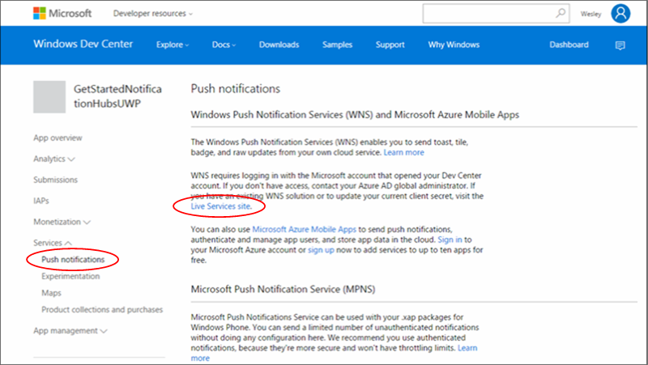

<properties
    pageTitle="Erste Schritte mit Azure Benachrichtigung Hubs für Windows universeller Plattform Apps | Microsoft Azure"
    description="In diesem Lernprogramm erfahren Sie, wie Azure Benachrichtigung Hubs Pushbenachrichtigungen an eine Anwendung Universal Windows-Plattform verwenden."
    services="notification-hubs"
    documentationCenter="windows"
    authors="ysxu"
    manager="erikre"
    editor="erikre"/>

<tags
    ms.service="notification-hubs"
    ms.workload="mobile"
    ms.tgt_pltfrm="mobile-windows"
    ms.devlang="dotnet"
    ms.topic="hero-article"
    ms.date="10/03/2016"
    ms.author="yuaxu"/>

# Erste Schritte mit Benachrichtigung Hubs für Windows Universal Plattform Apps

[AZURE.INCLUDE [notification-hubs-selector-get-started](../../includes/notification-hubs-selector-get-started.md)]

##(Übersicht)

In diesem Lernprogramm erfahren Sie, wie Sie Azure Benachrichtigung Hubs zum Senden von Pushbenachrichtigungen zu einer app Universal Windows-Plattform (UWP).

In diesem Lernprogramm erstellen Sie eine leere Windows Store-app, die Pushbenachrichtigungen empfängt mithilfe der Windows-Pushbenachrichtigungen Benachrichtigung Service (WNS). Wenn Sie fertig sind, wird den Benachrichtigung Hub verwenden, um Pushbenachrichtigungen auf alle Ihre App Geräte übertragen werden.

## Vorbemerkung

[AZURE.INCLUDE [notification-hubs-hero-slug](../../includes/notification-hubs-hero-slug.md)]

Der vollständige Code für dieses Lernprogramms finden Sie auf GitHub [hier](https://github.com/Azure/azure-notificationhubs-samples/tree/master/dotnet/GetStartedWindowsUniversal).

##Erforderliche Komponenten

In diesem Lernprogramm benötigen Sie Folgendes:

+ [Microsoft Visual Studio Community 2015](https://www.visualstudio.com/products/visual-studio-community-vs) oder höher

+ [Universal Windows-App-Entwicklungstools installiert](https://msdn.microsoft.com/windows/uwp/get-started/get-set-up)

+ Ein aktives Azure-Konto  Wenn Sie kein Konto haben, können Sie ein kostenloses Testversion Konto nur wenigen Minuten erstellen. Details finden Sie [Kostenlose Testversion Azure](https://azure.microsoft.com/pricing/free-trial/?WT.mc_id=A0E0E5C02&amp;returnurl=http%3A%2F%2Fazure.microsoft.com%2Fen-us%2Fdocumentation%2Farticles%2Fnotification-hubs-windows-store-dotnet-get-started%2F).

+ Ein aktives Windows Store-Konto

In diesem Lernprogramm durchführen ist eine Voraussetzung für alle anderen Benachrichtigung Hubs Lernprogramme für Universal Windows-Plattform apps.

##Registrieren Sie Ihre app für Windows Store

Um Pushbenachrichtigungen zu UWP apps zu senden, müssen Sie Ihre app im Windows Store zuordnen. Sie müssen Ihre Benachrichtigung Hub für die Integration von WNS konfigurieren.

1. Wenn Sie Ihre app nicht bereits registriert haben, navigieren Sie zum [Windows Developer Center](https://dev.windows.com/overview), melden Sie sich mit Ihrem Microsoft-Konto und klicken Sie dann auf **erstellen eine neue app**.

2. Geben Sie einen Namen für Ihre app ein, und klicken Sie auf **den Namen Anwendung reservieren**.

    

    Dadurch wird eine neue Windows Store-Registrierung für Ihre app erstellt.

3. In Visual Studio Erstellen eines neuen Projekts von Visual C#-Store-Apps mithilfe der **App leeren** Vorlage, und klicken Sie auf **OK**.

    

4. Übernehmen Sie die Standardeinstellungen für das Ziel und minimale Plattformversionen.

5. Im Explorer-Lösung mit der rechten Maustaste im Windows Store-app-Projekts, klicken Sie auf **Speichern**, und klicken Sie dann auf **App zuordnen, mit dem Store...**.

    

    Das **Verknüpfen Ihrer App mit dem Windows Store** -Assistent wird angezeigt.

6. Klicken Sie auf **Melden Sie sich** im Assistenten und melden Sie sich mit Ihrem Microsoft-Konto.

7. Klicken Sie auf die app, die Sie in Schritt 2 registriert haben, klicken Sie auf **Weiter**, und klicken Sie dann auf **Verbinden**.

    

    Dadurch wird die erforderliche Windows Store-Registrierungsinformationen Anwendungsmanifest hinzugefügt.

8. Klicken Sie auf der Seite [Windows Developer Center](http://go.microsoft.com/fwlink/p/?LinkID=266582) für Ihre neue app klicken Sie auf **Dienste**, klicken Sie auf **Pushbenachrichtigungen**, und klicken Sie dann auf **Live Services-Website** unter **Windows Pushbenachrichtigungen Benachrichtigung Services (WNS) und Microsoft Azure Mobile-Apps**.

    

9. Klicken Sie auf der Registrierungsseite für Ihre app Notieren Sie das Kennwort für die **Anwendung geheim** und der **Paket-Sicherheits-ID (SID)** befindet sich in der **Windows Store** -Plattform-Einstellungen.

    

    > [AZURE.WARNING]
    Die Anwendung geheim und Paket SID sind wichtige Sicherheitsanmeldeinformationen. Teilen Sie diese Werte mit jedem oder verteilen Sie diese App nicht.

##Konfigurieren Sie den Benachrichtigung hub

[AZURE.INCLUDE [notification-hubs-portal-create-new-hub](../../includes/notification-hubs-portal-create-new-hub.md)]

<ol start="6">
<li>
Wählen Sie die Option <b>Benachrichtigungsdienste</b> und der Option <b>Windows (WNS)</b> . Geben Sie dann das <b>Anwendung geheim</b> Kennwort im Feld <b>Schlüssel Sicherheit</b> . Geben Sie den Wert von <b>Paket SID</b> , den Sie von WNS im vorherigen Abschnitt erhalten haben, und klicken Sie dann auf <b>Speichern</b>.

</li>
</ol>

&emsp;&emsp;

Ihre Benachrichtigung Hub ist jetzt so konfiguriert, dass die WNS konzipiert, und Sie haben die Verbindungszeichenfolgen zum Registrieren der app und Benachrichtigungen senden.

##Schließen Sie Ihre app an der Benachrichtigung-hub

1. In Visual Studio mit der rechten Maustaste in der Lösung, und klicken Sie dann auf **NuGet-Pakete verwalten**.

    Zeigt das Dialogfeld " **NuGet-Pakete verwalten** " an.

2. Suchen Sie nach `WindowsAzure.Messaging.Managed` , und klicken Sie auf **Installieren**, und akzeptieren der Vereinbarung.

    ![][20]

    Diese downloads, Installationen und fügt einen Verweis auf die Bibliothek Azure Messaging für Windows mithilfe des <a href="http://nuget.org/packages/WindowsAzure.Messaging.Managed/">WindowsAzure.Messaging.Managed NuGet-Paket</a>.

3. Öffnen Sie die Projektdatei App.xaml.cs, und fügen Sie Folgendes `using` Anweisungen. 

        using Windows.Networking.PushNotifications;
        using Microsoft.WindowsAzure.Messaging;
        using Windows.UI.Popups;

4. Auch in App.xaml.cs, die Definition der folgende **InitNotificationsAsync** -Methode der **App** Klasse hinzufügen:

        private async void InitNotificationsAsync()
        {
            var channel = await PushNotificationChannelManager.CreatePushNotificationChannelForApplicationAsync();

            var hub = new NotificationHub("< your hub name>", "<Your DefaultListenSharedAccessSignature connection string>");
            var result = await hub.RegisterNativeAsync(channel.Uri);

            // Displays the registration ID so you know it was successful
            if (result.RegistrationId != null)
            {
                var dialog = new MessageDialog("Registration successful: " + result.RegistrationId);
                dialog.Commands.Add(new UICommand("OK"));
                await dialog.ShowAsync();
            }

        }

    Dieser Code Ruft den Channel-URI für die app von WNS und registriert dann mit der Benachrichtigung Hub Channel-URI.

    >[AZURE.NOTE] Denken Sie daran die "Ihr Name Hub" Platzhalter mit dem Namen der Benachrichtigung-Hub, die im Portal Azure angezeigt wird. Ersetzen Sie die Verbindung Zeichenfolge Platzhalter auch mit der Verbindungszeichenfolge **DefaultListenSharedAccessSignature** , die Sie von der Seite **Richtlinien** Ihrer Benachrichtigung Hub im vorherigen Abschnitt erhalten haben.

5. Fügen Sie am oberen Rand der **OnLaunched** Ereignishandler in App.xaml.cs den folgenden Anruf an die neue Methode **InitNotificationsAsync** hinzu:

        InitNotificationsAsync();

    Hierdurch wird gewährleistet, Channel, den URI in der Benachrichtigung Hub jedes Mal registriert ist, die die Anwendung gestartet wird.

6. Drücken Sie **F5** , um die app ausführen. In einem Popupmenü, die der Registrierungsschlüssel enthält Dialog.

    ![][19]

Ihre app kann nun Spruch Benachrichtigungen erhalten.

##Senden von Benachrichtigungen 

Sie können schnell testen Empfang von Benachrichtigungen per Textnachricht im [Azure-Portal](https://portal.azure.com/) auf die Benachrichtigung-Hub mit der Schaltfläche **Senden testen** , wie in der nachstehenden Abbildung gezeigt in Ihrer app.

Pushbenachrichtigungen werden normalerweise in einer Back-End-Service wie Mobile Services oder ASP.NET mithilfe einer kompatiblen Bibliothek geleitet. Die REST-API können Sie auch direkt zum Senden von Nachrichten, wenn eine Bibliothek nicht für Ihre Back-End verfügbar ist. 

In diesem Lernprogramm wir die Würze und einfach veranschaulichen, Testen Ihre app Client durch Senden von Benachrichtigungen über .NET SDK für Benachrichtigung Hubs in einer Console-Anwendung kein Back-End-Dienst. Wir empfehlen des Lernprogramms [Verwenden Benachrichtigung Hubstandorte Pushbenachrichtigungen für Benutzer] zum Senden von Benachrichtigungen von einer ASP.NET Back-End-im nächsten Schritt aus. Die folgenden Vorgehensweisen können jedoch verwendet werden, zum Senden von Benachrichtigungen:

* **REST-Schnittstelle**: Benachrichtigung können Sie auf einer beliebigen Back-End-Plattform über die [REST-Schnittstelle](http://msdn.microsoft.com/library/windowsazure/dn223264.aspx)unterstützen.

* **Microsoft Azure Benachrichtigung Hubs .NET SDK**: In der Nuget Package Manager für Visual Studio ausführen [Microsoft.Azure.NotificationHubs Paket installieren](https://www.nuget.org/packages/Microsoft.Azure.NotificationHubs/).

* **Node.js** : [wie Benachrichtigung Hubs von Node.js verwendet](notification-hubs-nodejs-push-notification-tutorial.md).

* **Azure Mobile-Apps**: ein Beispiel für die Informationen zum Senden von Benachrichtigungen aus einer Azure Mobile-App, die in der Benachrichtigung Hubs integriert ist, finden Sie unter [Hinzufügen von Pushbenachrichtigungen für Mobile-Apps](../app-service-mobile/app-service-mobile-windows-store-dotnet-get-started-push.md).

* **Java / PHP**: ein Beispiel für Benachrichtigungen senden mithilfe der REST-APIs, finden Sie unter "How to Benachrichtigung Hubs von Java/PHP verwenden" ([Java](notification-hubs-java-push-notification-tutorial.md) | [PHP](notification-hubs-php-push-notification-tutorial.md)).

## (Optional) Senden von Benachrichtigungen in einer Console-app

Zum Senden von Benachrichtigungen mithilfe einer .NET Console-Anwendungs Sie wie folgt vor. 

1. Mit der rechten Maustaste in der Lösung, wählen Sie **Hinzufügen** und **Neues Projekt...**, und klicken Sie dann unter **Visual c#**, klicken Sie auf **Windows** und **Console-Anwendung**und klicken Sie auf **OK**.

    ![][13]

    Dadurch wird eine neue Visual c# Console-Anwendung zur Lösung hinzugefügt. Sie können auch in einer separaten Lösung ausführen.

2. Klicken Sie in Visual Studio auf **Extras**, klicken Sie auf **NuGet-Paket-Manager**und klicken Sie dann auf **Paket-Manager-Konsole**.

    Dadurch werden die Paket-Manager-Konsole in Visual Studio.

3. Klicken Sie im Paket-Manager-Konsole zum Projekt Anwendung Console festlegen Sie der **Standard-Projekt** , und klicken Sie dann im Fenster Konsole führen Sie den folgenden Befehl aus:

        Install-Package Microsoft.Azure.NotificationHubs

    Dadurch wird einen Verweis auf die mit dem <a href="http://www.nuget.org/packages/Microsoft.Azure.NotificationHubs/">Microsoft.Azure.Notification Hubs NuGet-Paket</a>Azure Benachrichtigung Hubs SDK hinzugefügt.

    

4. Öffnen Sie die Datei Program.cs, und fügen Sie den folgenden `using` Anweisung:

        using Microsoft.Azure.NotificationHubs;

5. Fügen Sie die folgende Methode in der Klasse **Programm** hinzu:

        private static async void SendNotificationAsync()
        {
            NotificationHubClient hub = NotificationHubClient
                .CreateClientFromConnectionString("<connection string with full access>", "<hub name>");
            var toast = @"<toast><visual><binding template=""ToastText01""><text id=""1"">Hello from a .NET App!</text></binding></visual></toast>";
            await hub.SendWindowsNativeNotificationAsync(toast);
        }

    Vergewissern Sie sich zu den Platzhalter "Hub Name" mit dem Namen der Benachrichtigung-Hub zu ersetzen, wie er im Portal Azure angezeigt wird. Ersetzen Sie Platzhalter Zeichenfolge Verbindung auch mit der Verbindungszeichenfolge **DefaultFullSharedAccessSignature** , die Sie auf der Seite **Access-Richtlinien** für Ihre Benachrichtigung Hub im Abschnitt "Konfigurieren der Benachrichtigung Hub" bezeichnet für Ihren Kunden

    >[AZURE.NOTE]Stellen Sie sicher, dass Sie die Verbindungszeichenfolge verwenden, **vollständige** hat, Access, Access nicht **hören** . Die Zeichenfolge Abhören Zugriff ist nicht berechtigt, Benachrichtigungen zu senden.

6. Fügen Sie die folgenden Zeilen in der **Main** -Methode hinzu:

         SendNotificationAsync();
         Console.ReadLine();

7. Mit der rechten Maustaste Console-Anwendung in Visual Studio Projekt, und klicken Sie auf **als beim Startprojekt festlegen** , um als die Startprojekt festlegen. Drücken Sie **F5** , um die Anwendung ausführen.

    ![][14]

    Sie erhalten eine Benachrichtigung Spruch auf allen registrierten Geräten aus. Laden die app, klicken oder tippen im Banner Spruch.

Alle unterstützten gefährliche Fracht finden Sie in der [Spruch Katalog], [Kachel Katalog]und [Übersicht Badge] -Themen auf MSDN.

##Nächste Schritte

In diesem Beispiel einfachen Sie übertragenen Benachrichtigungen an alle Ihren mithilfe des Portals oder eine app Console Windows-Geräten gesendet. Wir empfehlen des Lernprogramms [Verwenden Benachrichtigung Hubstandorte Pushbenachrichtigungen für Benutzer] im nächsten Schritt aus. Es werden Informationen zum Senden von Benachrichtigungen aus einer ASP.NET Back-End-mithilfe von Kategorien den Adressieren von bestimmter Benutzer angezeigt.

Wenn Sie Ihre Benutzer Zinsen gruppenweise segmentieren möchten, finden Sie unter [Verwenden von Benachrichtigung Hubs auf dem neusten Stand zu senden]. 

Weitere allgemeine Informationen zu Benachrichtigung Hubs finden Sie unter [Benachrichtigung Hubs Anleitungen](notification-hubs-push-notification-overview.md).

<!-- Images. -->
[13]: ./media/notification-hubs-windows-store-dotnet-get-started/notification-hub-create-console-app.png
[14]: ./media/notification-hubs-windows-store-dotnet-get-started/notification-hub-windows-toast.png
[19]: ./media/notification-hubs-windows-store-dotnet-get-started/notification-hub-windows-reg.png
[20]: ./media/notification-hubs-windows-store-dotnet-get-started/notification-hub-windows-universal-app-install-package.png

<!-- URLs. -->

[Verwenden Sie die Benachrichtigung Hubs um Pushbenachrichtigungen für Benutzer]: notification-hubs-aspnet-backend-windows-dotnet-wns-notification.md
[Verwenden Sie die Benachrichtigung Hubs auf dem neusten Stand zu senden]: notification-hubs-windows-notification-dotnet-push-xplat-segmented-wns.md

[Spruch-Katalog]: http://msdn.microsoft.com/library/windows/apps/hh761494.aspx
[Kachel-Katalog]: http://msdn.microsoft.com/library/windows/apps/hh761491.aspx
[Badge (Übersicht)]: http://msdn.microsoft.com/library/windows/apps/hh779719.aspx
