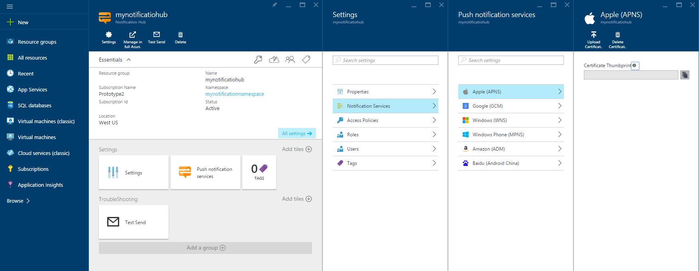
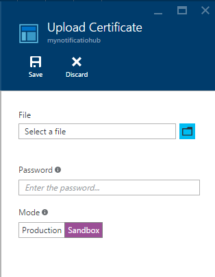
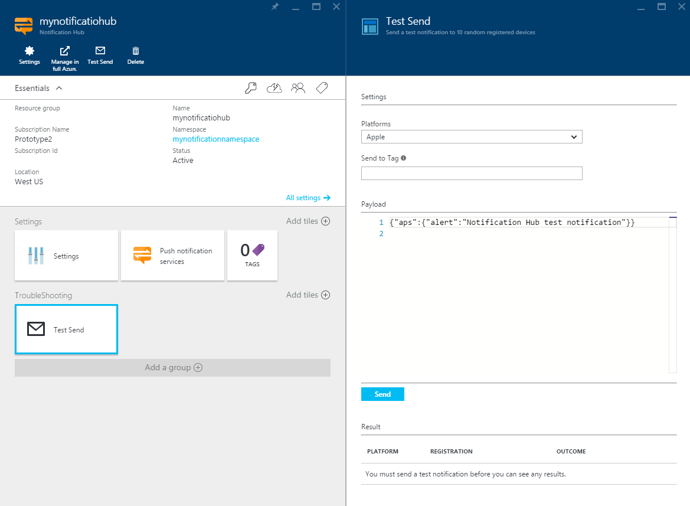

<properties
    pageTitle="iOS Pushbenachrichtigungen mit Benachrichtigung Hubs für apps Xamarin | Microsoft Azure"
    description="In diesem Lernprogramm erfahren Sie, wie Sie Azure Benachrichtigung Hubs, um Pushbenachrichtigungen zu einer Xamarin iOS-Anwendung zu senden."
    services="notification-hubs"
    keywords="IOS Pushbenachrichtigungen, Pushbenachrichtigungen Nachrichten Pushbenachrichtigungen, drücken Sie die Nachricht"
    documentationCenter="xamarin"
    authors="ysxu"
    manager="erikre"
    editor=""/>

<tags
    ms.service="notification-hubs"
    ms.workload="mobile"
    ms.tgt_pltfrm="mobile-xamarin-ios"
    ms.devlang="dotnet"
    ms.topic="hero-article"
    ms.date="06/29/2016"
    ms.author="yuaxu"/>

# iOS Pushbenachrichtigungen mit Benachrichtigung Hubs für Xamarin-apps

[AZURE.INCLUDE [notification-hubs-selector-get-started](../../includes/notification-hubs-selector-get-started.md)]

##(Übersicht)
> [AZURE.IMPORTANT] Um dieses Lernprogramms abgeschlossen haben, müssen Sie ein aktives Azure-Konto verfügen. Wenn Sie kein Konto haben, können Sie ein kostenloses Testversion Konto nur wenigen Minuten erstellen. Weitere Informationen finden Sie unter [Azure kostenlose Testversion](https://azure.microsoft.com/pricing/free-trial/?WT.mc_id=A643EE910&amp;returnurl=http%3A%2F%2Fazure.microsoft.com%2Fen-us%2Fdocumentation%2Farticles%2Fpartner-xamarin-notification-hubs-ios-get-started).

In diesem Lernprogramm erfahren Sie, wie die Benachrichtigung Hubs Azure um Pushbenachrichtigungen zur iOS-Anwendung zu senden.
Erstellen Sie eine leere Xamarin.iOS app, die Pushbenachrichtigungen empfängt mithilfe des [Apple-Pushbenachrichtigungsdienst (APNs)](https://developer.apple.com/library/ios/documentation/NetworkingInternet/Conceptual/RemoteNotificationsPG/Chapters/ApplePushService.html). Wenn Sie fertig sind, wird den Benachrichtigung Hub verwenden, um Pushbenachrichtigungen auf alle Ihre App Geräte übertragen werden. Der fertige Code steht in der [app NotificationHubs] [ GitHub] Stichprobe.

In diesem Lernprogramm veranschaulicht das einfachen Pushbenachrichtigungen Nachricht übertragenen Szenario mit Benachrichtigung Hubs.

##Erforderliche Komponenten

In diesem Lernprogramm benötigen Sie Folgendes:

+ [Xcode 6.0][Install Xcode]
+ Ein iOS 7.0 (oder höhere Version)-Gerät
+ iOS Mitgliedschaft Developer-Programm
+ [Xamarin Studio]

   > [AZURE.NOTE] Aufgrund der Konfiguration Anforderungen für iOS Benachrichtigungen, Pushbenachrichtigungen müssen bereitstellen und testen die Stichprobe Anwendung auf einem Gerät physisch iOS (iPhone oder iPad) statt in der Simulator.

In diesem Lernprogramm durchführen ist eine Voraussetzung für alle anderen Benachrichtigung Hubs Lernprogramme für Xamarin iOS-apps.

[AZURE.INCLUDE [Notification Hubs Enable Apple Push Notifications](../../includes/notification-hubs-enable-apple-push-notifications.md)]

##Konfigurieren Sie den Benachrichtigung hub

In diesem Abschnitt führt Sie durch erstellen einen neuen Benachrichtigung Hub und Konfigurieren der Authentifizierung mit APNS mit den, das von Ihnen erstellten **P12** Pushbenachrichtigungen Zertifikat. Wenn Sie möchten einen Benachrichtigung Hub verwenden, den Sie bereits erstellt haben, können Sie mit Schritt 5 überspringen.

[AZURE.INCLUDE [notification-hubs-portal-create-new-hub](../../includes/notification-hubs-portal-create-new-hub.md)]

<ol start="7">
<li>

Wie wir die Verbindung APNS im Portal Azure konfigurieren möchten, öffnen Sie Ihre Einstellungen Benachrichtigung Hub, Ande klicken Sie auf <b>Dienste Benachrichtigung</b>, und klicken Sie dann auf das Element <b>Apple (APNS)</b> in der Liste. Sobald Sie fertig sind, klicken Sie auf <b>Zertifikat hochladen</b> , und wählen Sie das <b>P12</b> Zertifikat, das Sie zuvor, sowie das Kennwort für das Zertifikat exportiert.

Vergewissern Sie sich zum <b>Sandkastenmodus</b> ausgewählt werden, da Sie Pushbenachrichtigungen Nachrichten in einer Umgebung Development senden. Verwenden Sie die Einstellung für die <b>Herstellung</b> nur, wenn Sie Pushbenachrichtigungen für Benutzer, die bereits Ihre app aus dem Store erworben haben, senden möchten.

</li>
</ol>
&emsp;&emsp;

&emsp;&emsp;

Ihre Benachrichtigung Hub ist jetzt so konfiguriert, dass die Arbeit mit APNS, und Sie haben die Verbindungszeichenfolgen Ihre app zu registrieren, und senden Sie Pushbenachrichtigungen.

##Herstellen einer Verbindung im Infobereich Hub mit der app

#### Erstellen eines neuen Projekts

1. Klicken Sie in Xamarin Studio Erstellen eines neuen Projekts für iOS, und wählen Sie die **API Unified** > **Einzelne Ansicht Anwendung** Vorlage.

    ![Xamarin Studio - Select Anwendungstyp][31]

2. Fügen Sie einen Verweis auf die Azure Messaging-Komponente hinzu. Klicken Sie in der Ansicht Lösung mit der rechten Maustaste in des Ordners **Komponenten** für Ihr Projekt, und wählen Sie **Weitere Komponenten**. Suchen Sie nach der **Azure Messaging** -Komponente, und fügen Sie die Komponente zu Ihrem Projekt hinzu.

3. **AppDelegate.cs**, fügen Sie folgende Anweisung verwenden:

        using WindowsAzure.Messaging;

4. Eine Instanz des **SBNotificationHub**deklariert:

        private SBNotificationHub Hub { get; set; }

5. Erstellen Sie eine **Constants.cs** -Klasse mit den folgenden Variablen:

        // Azure app-specific connection string and hub path
        public const string ConnectionString = "<Azure connection string>";
        public const string NotificationHubPath = "<Azure hub path>";

6. Aktualisieren Sie in **AppDelegate.cs**, **FinishedLaunching()** entsprechend dem folgenden Beispiel:

        public override bool FinishedLaunching(UIApplication application, NSDictionary launchOptions)
        {
            if (UIDevice.CurrentDevice.CheckSystemVersion (8, 0)) {
                var pushSettings = UIUserNotificationSettings.GetSettingsForTypes (
                       UIUserNotificationType.Alert | UIUserNotificationType.Badge | UIUserNotificationType.Sound,
                       new NSSet ());

                UIApplication.SharedApplication.RegisterUserNotificationSettings (pushSettings);
                UIApplication.SharedApplication.RegisterForRemoteNotifications ();
            } else {
                UIRemoteNotificationType notificationTypes = UIRemoteNotificationType.Alert | UIRemoteNotificationType.Badge | UIRemoteNotificationType.Sound;
                UIApplication.SharedApplication.RegisterForRemoteNotificationTypes (notificationTypes);
            }

            return true;
        }

7. Überschreiben Sie die Methode **RegisteredForRemoteNotifications()** in **AppDelegate.cs**:

        public override void RegisteredForRemoteNotifications(UIApplication application, NSData deviceToken)
        {
            Hub = new SBNotificationHub(Constants.ConnectionString, Constants.NotificationHubPath);

            Hub.UnregisterAllAsync (deviceToken, (error) => {
                if (error != null)
                {
                    Console.WriteLine("Error calling Unregister: {0}", error.ToString());
                    return;
                }

                NSSet tags = null; // create tags if you want
                Hub.RegisterNativeAsync(deviceToken, tags, (errorCallback) => {
                    if (errorCallback != null)
                        Console.WriteLine("RegisterNativeAsync error: " + errorCallback.ToString());
                });
            });
        }

8. Überschreiben Sie die Methode **ReceivedRemoteNotification()** in **AppDelegate.cs**:

        public override void ReceivedRemoteNotification(UIApplication application, NSDictionary userInfo)
        {
            ProcessNotification(userInfo, false);
        }

9. Erstellen Sie die folgende **ProcessNotification()** -Methode in **AppDelegate.cs**aus:

        void ProcessNotification(NSDictionary options, bool fromFinishedLaunching)
        {
            // Check to see if the dictionary has the aps key.  This is the notification payload you would have sent
            if (null != options && options.ContainsKey(new NSString("aps")))
            {
                //Get the aps dictionary
                NSDictionary aps = options.ObjectForKey(new NSString("aps")) as NSDictionary;

                string alert = string.Empty;

                //Extract the alert text
                // NOTE: If you're using the simple alert by just specifying
                // "  aps:{alert:"alert msg here"}  ", this will work fine.
                // But if you're using a complex alert with Localization keys, etc.,
                // your "alert" object from the aps dictionary will be another NSDictionary.
                // Basically the JSON gets dumped right into a NSDictionary,
                // so keep that in mind.
                if (aps.ContainsKey(new NSString("alert")))
                    alert = (aps [new NSString("alert")] as NSString).ToString();

                //If this came from the ReceivedRemoteNotification while the app was running,
                // we of course need to manually process things like the sound, badge, and alert.
                if (!fromFinishedLaunching)
                {
                    //Manually show an alert
                    if (!string.IsNullOrEmpty(alert))
                    {
                        UIAlertView avAlert = new UIAlertView("Notification", alert, null, "OK", null);
                        avAlert.Show();
                    }
                }
            }
        }

    > [AZURE.NOTE] Sie können auch **FailedToRegisterForRemoteNotifications()** um Kontexten beispielsweise keine Verbindung zum Netzwerk außer Kraft setzen. Dies ist besonders wichtig, wo der Benutzer möglicherweise eine Anwendung gestartet, im Offlinemodus (z. B. Flugzeug) und Szenarien, die speziell für Ihre app messaging Pushbenachrichtigungen verarbeitet werden sollen.

10. Führen Sie die app auf Ihrem Gerät aus.

## Senden von Pushbenachrichtigungen

Testen Sie Pushbenachrichtigungen durch Senden von Benachrichtigungen im [Portal Azure] über die Funktion **Testen senden** , in die **Problembehandlung** Extras, rechts in der Benachrichtigung Hub Seite in Ihrer app empfangen, wie in der folgenden Abbildung gezeigt.

Pushbenachrichtigungen werden normalerweise durch einen Back-End-Service wie Mobile Services oder ASP.NET mithilfe einer kompatiblen Bibliothek geleitet. Die REST-API können Sie auch direkt an um Pushbenachrichtigungen Nachrichten zu senden, wenn eine Bibliothek nicht in Ihrem Szenario verfügbar ist. 

In diesem Lernprogramm wir die Würze und einfach veranschaulichen, Testen Ihre app Client durch Senden von Benachrichtigungen über .NET SDK für Benachrichtigung Hubs in einer Console-Anwendung kein Back-End-Dienst. Wir empfehlen des Lernprogramms [Verwenden Benachrichtigung Hubstandorte Pushbenachrichtigungen für Benutzer](notification-hubs-aspnet-backend-ios-apple-apns-notification.md) im nächsten Schritt für das Senden von Benachrichtigungen über eine ASP.NET Back-End. Die folgenden Vorgehensweisen können jedoch für das Senden von Benachrichtigungen verwendet werden:

* **REST-Schnittstelle**: Pushbenachrichtigung können auf einer beliebigen Back-End-Plattform über die [REST-Schnittstelle](http://msdn.microsoft.com/library/windowsazure/dn223264.aspx)unterstützen.

* **Microsoft Azure Benachrichtigung Hubs .NET SDK**: In der Nuget Package Manager für Visual Studio ausführen [Microsoft.Azure.NotificationHubs Paket installieren](https://www.nuget.org/packages/Microsoft.Azure.NotificationHubs/).

* **Node.js** : [wie Benachrichtigung Hubs von Node.js verwendet](notification-hubs-nodejs-push-notification-tutorial.md).

**Mobile-Apps**: ein Beispiel für so eine Azure App Dienst Mobile-Apps Back-End-Benachrichtigungen senden, die in der Benachrichtigung Hubs integriert ist, finden Sie unter [Hinzufügen von Pushbenachrichtigungen zu Ihrer mobilen Anwendung](../app-service-mobile/app-service-mobile-ios-get-started-push.md).

* **Java / PHP**: ein Beispiel für Pushbenachrichtigungen mithilfe der REST-APIs senden, finden Sie unter "How to Benachrichtigung Hubs von Java/PHP verwenden" ([Java](notification-hubs-java-push-notification-tutorial.md) | [PHP](notification-hubs-php-push-notification-tutorial.md)).

####(Optional) Senden von Pushbenachrichtigungen von einer Konsole.

In diesem Abschnitt schicken wir Pushbenachrichtigungen mithilfe einer einfachen .NET Console-app. Aus Gründen der in diesem Beispiel wird zu einem Windows-Entwicklungsumgebung wechseln, die Visual Studio bereits installiert wurde.

1. Erstellen Sie eine neue Visual c# Console-Anwendung in Visual Studio:

    ![Visual Studio – Erstellen einer neuen Console-Anwendung][213]

2. Klicken Sie in Visual Studio auf **Extras**, klicken Sie auf **NuGet-Paket-Manager**und klicken Sie dann auf **Paket-Manager-Konsole**.

    Die Paket-Manager-Konsole sollte angedockten an das Ende der Visual Studio-Arbeitsbereich angezeigt werden.

3. Klicken Sie im Paket-Manager-Konsole zum Projekt Anwendung Console festlegen Sie der **Standard-Projekt** , und klicken Sie dann im Fenster Konsole führen Sie den folgenden Befehl aus:

        Install-Package Microsoft.Azure.NotificationHubs

    Dadurch wird einen Verweis auf die mit dem <a href="http://www.nuget.org/packages/Microsoft.Azure.NotificationHubs/">Microsoft.Azure.Notification Hubs NuGet-Paket</a>Azure Benachrichtigung Hubs SDK hinzugefügt.

    

4. Öffnen der `Program.cs` Datei, und fügen Sie den folgenden `using` -Anweisung, um sicherzustellen, dass wir Azure Klassen und Funktionen innerhalb der Klasse in main verwenden können:

        using Microsoft.Azure.NotificationHubs;

3. In Ihrer `Program` Klasse, fügen Sie die folgende Methode (vergessen Sie nicht die **Verbindungszeichenfolge** und **Hubnamen**ersetzen):

        private static async void SendNotificationAsync()
        {
            NotificationHubClient hub = NotificationHubClient.CreateClientFromConnectionString("<connection string with full access>", "<hub name>");
            var alert = "{\"aps\":{\"alert\":\"Hello from .NET!\"}}";
            await hub.SendAppleNativeNotificationAsync(alert);
        }

4. Fügen Sie die folgenden Zeilen in der `Main` Methode:

         SendNotificationAsync();
         Console.ReadLine();

5. Drücken Sie F5, um die app ausführen. Finden Sie innerhalb von Sekunden ein Pushbenachrichtigung auf Ihrem Gerät angezeigt werden. Ob Sie WLAN oder ein Datennetz verwendet werden, stellen Sie sicher, dass Sie auf dem Gerät aktive Verbindung zum Internet haben.

Sie können alle möglichen gefährliche Fracht Apple [lokale und Pushbenachrichtigungen Benachrichtigung Programming Guide]suchen.

####(Optional) Senden von Benachrichtigungen aus einer Mobile Service

In diesem Abschnitt werden wir Pushbenachrichtigungen mithilfe einen mobilen Service durch ein Skript Knoten senden.

Um eine Benachrichtigung senden mithilfe eines mobilen Diensts, führen Sie die [Erste Schritte mit Mobile-Dienste], und klicken Sie dann:

1. Melden Sie sich bei der [Klassischen Azure-Portal]an, und wählen Sie den mobilen Dienst.

2. Wählen Sie im oberen Bereich die Registerkarte **Scheduler** an.

    ![Azure klassischen Portal - Scheduler][215]

3. Erstellen eines neuen geplanten Auftrags, fügen Sie einen Namen ein, und wählen Sie **bei Bedarf**.

    ![Klassische-Portal Azure - neues Projekt erstellen][216]

4. Wenn Sie der Auftrag erstellt wurde, klicken Sie auf den Namen der Position. Klicken Sie dann auf die Registerkarte **Skript** in der oberen Leiste.

5. Fügen Sie das folgende Skript innerhalb der Scheduler (Funktion). Vergewissern Sie sich mit Ihrem Benachrichtigung Hub-Namen und die Verbindungszeichenfolge die Platzhalter für *DefaultFullSharedAccessSignature* ersetzen, die Sie zuvor für Ihren Kunden. Klicken Sie auf **Speichern**.

        var azure = require('azure');
        var notificationHubService = azure.createNotificationHubService('<Hubname>', '<SAS Full access >');
        notificationHubService.apns.send(
            null,
            {"aps":
                {
                "alert": "Hello from Mobile Services!"
                }
            },
            function (error)
            {
                if (!error) {
                    console.warn("Notification successful");
                }
            }
        );

6. Klicken Sie auf **Einmal ausführen** , in der unteren Leiste. Sie erhalten eine Benachrichtigung auf Ihrem Gerät.

##Nächste Schritte

In diesem Beispiel einfach mithilfe von Sie Pushbenachrichtigungen auf Ihrem iOS-Geräte. Akzeptieren, um bestimmte Zielpublikum, finden Sie das Lernprogramm [Benachrichtigung Hubstandorte Pushbenachrichtigungen für Benutzer verwenden]. Wenn Sie Ihre Benutzer Zinsen gruppenweise segmentieren möchten, können Sie [Verwenden Benachrichtigung Hubs auf dem neusten Stand senden]lesen. Weitere Informationen zum Verwenden von Benachrichtigung Hubs im [Infobereich Hubs Anleitungen] und in der- [Benachrichtigung Hubs unterstützenden für iOS]

<!-- Images. -->

[213]: ./media/partner-xamarin-notification-hubs-ios-get-started/notification-hub-create-console-app.png

[215]: ./media/partner-xamarin-notification-hubs-ios-get-started/notification-hub-scheduler1.png
[216]: ./media/partner-xamarin-notification-hubs-ios-get-started/notification-hub-scheduler2.png

[31]: ./media/partner-xamarin-notification-hubs-ios-get-started/notification-hub-create-ios-app.png

<!-- URLs. -->
[Mobile Services iOS SDK]: http://go.microsoft.com/fwLink/?LinkID=266533
[Submit an app page]: http://go.microsoft.com/fwlink/p/?LinkID=266582
[My Applications]: http://go.microsoft.com/fwlink/p/?LinkId=262039
[Live SDK for Windows]: http://go.microsoft.com/fwlink/p/?LinkId=262253

[Erste Schritte mit Mobile-Dienste]: /develop/mobile/tutorials/get-started-xamarin-ios
[Azure klassischen-Portal]: https://manage.windowsazure.com/
[Benachrichtigung Hubs Anleitungen]: http://msdn.microsoft.com/library/jj927170.aspx
[Benachrichtigung Hubs unterstützenden für iOS]: http://msdn.microsoft.com/library/jj927168.aspx
[Install Xcode]: https://go.microsoft.com/fwLink/p/?LinkID=266532
[iOS Provisioning Portal]: http://go.microsoft.com/fwlink/p/?LinkId=272456

[Verwenden Sie die Benachrichtigung Hubs um Pushbenachrichtigungen für Benutzer]: /manage/services/notification-hubs/notify-users-aspnet
[Verwenden Sie die Benachrichtigung Hubs auf dem neusten Stand zu senden]: /manage/services/notification-hubs/breaking-news-dotnet

[Lokale, und drücken Sie die Benachrichtigung Programming Guide]: http://developer.apple.com/library/mac/#documentation/NetworkingInternet/Conceptual/RemoteNotificationsPG/Chapters/ApplePushService.html#//apple_ref/doc/uid/TP40008194-CH100-SW1
[Apple Push Notification Service]: http://go.microsoft.com/fwlink/p/?LinkId=272584

[Azure Mobile Services Component]: http://components.xamarin.com/view/azure-mobile-services/
[GitHub]: http://go.microsoft.com/fwlink/p/?LinkId=331329
[Xamarin Studio]: http://xamarin.com/download
[WindowsAzure.Messaging]: https://github.com/infosupport/WindowsAzure.Messaging.iOS
[Azure-Portal]: https://portal.azure.com
