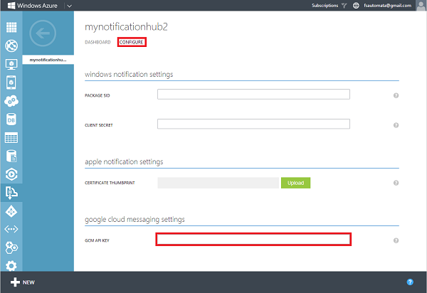
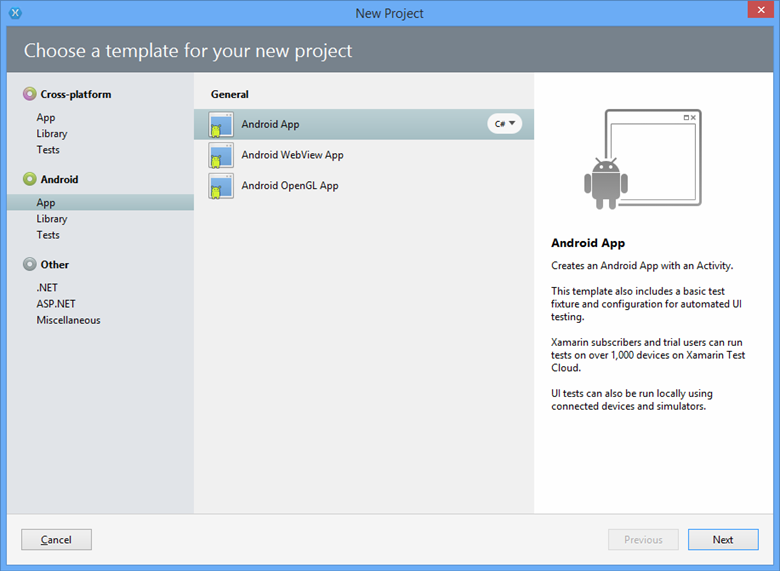
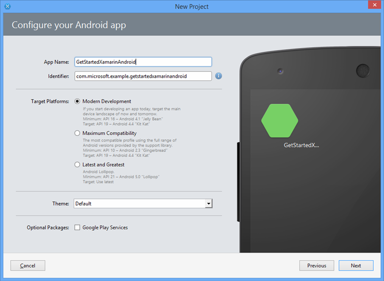
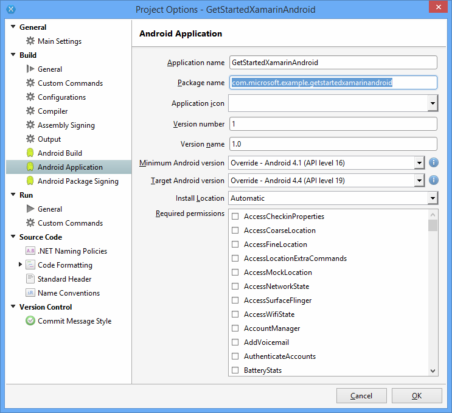

<properties
    pageTitle="Erste Schritte mit Benachrichtigung Hubs für apps Xamarin.Android | Microsoft Azure"
    description="In diesem Lernprogramm erfahren Sie, wie Sie Azure Benachrichtigung Hubs, um Pushbenachrichtigungen zu einer Xamarin Android-Anwendung zu senden."
    authors="ysxu"
    manager="erikre"
    editor=""
    services="notification-hubs"
    documentationCenter="xamarin"/>

<tags
    ms.service="notification-hubs"
    ms.workload="mobile"
    ms.tgt_pltfrm="mobile-xamarin-android"
    ms.devlang="dotnet"
    ms.topic="hero-article"
    ms.date="06/29/2016"
    ms.author="yuaxu"/>

# Erste Schritte mit Benachrichtigung Hubs mit Xamarin für Android

[AZURE.INCLUDE [notification-hubs-selector-get-started](../../includes/notification-hubs-selector-get-started.md)]

##(Übersicht)

In diesem Lernprogramm erfahren Sie, wie Azure Benachrichtigung Hubs um Pushbenachrichtigungen an einer Xamarin.Android Anwendung zu senden.
Erstellen Sie eine leere Xamarin.Android app, die Pushbenachrichtigungen empfängt mithilfe von Google Cloud Messaging (GCM). Wenn Sie fertig sind, wird den Benachrichtigung Hub verwenden, um Pushbenachrichtigungen auf alle Ihre App Geräte übertragen werden. Der fertige Code steht in der [app NotificationHubs] [ GitHub] Stichprobe.

In diesem Lernprogramm veranschaulicht das übertragenen einfache Szenario in Benachrichtigung Hubs verwenden.

## Vorbemerkung

[AZURE.INCLUDE [notification-hubs-hero-slug](../../includes/notification-hubs-hero-slug.md)]

Der vollständige Code für dieses Lernprogramms finden Sie auf GitHub [hier](https://github.com/Azure/azure-notificationhubs-samples/tree/master/dotnet/Xamarin/GetStartedXamarinAndroid).

##Erforderliche Komponenten

In diesem Lernprogramm benötigen Sie Folgendes:

+ Visual Studio mit Xamarin unter Windows oder Xamarin Studio unter Mac OS x vollständige Installation Anweisungen sind [für die Einrichtung](https://msdn.microsoft.com/library/mt613162.aspx)und für Visual Studio und Xamarin installieren.
+ Aktive Gmail-Konto
+ [Azure Messaging Komponente]
+ [Google Cloud Messaging-Client-Komponente]

In diesem Lernprogramm durchführen ist eine Voraussetzung für alle anderen Benachrichtigung Hubs Lernprogramme für Xamarin.Android-apps.

> [AZURE.IMPORTANT] Um dieses Lernprogramms abgeschlossen haben, müssen Sie ein aktives Azure-Konto verfügen. Wenn Sie kein Konto haben, können Sie ein kostenloses Testversion Konto nur wenigen Minuten erstellen. Weitere Informationen finden Sie unter [Azure kostenlose Testversion](https://azure.microsoft.com/pricing/free-trial/?WT.mc_id=A9C9624B5&amp;returnurl=http%3A%2F%2Fazure.microsoft.com%2Fen-us%2Fdocumentation%2Farticles%2Fpartner-xamarin-notification-hubs-android-get-started%2F).

##Aktivieren von Google-Cloud Messaging

[AZURE.INCLUDE [mobile-services-enable-Google-cloud-messaging](../../includes/mobile-services-enable-google-cloud-messaging.md)]

##Konfigurieren Sie den Benachrichtigung hub

[AZURE.INCLUDE [notification-hubs-portal-create-new-hub](../../includes/notification-hubs-portal-create-new-hub.md)]

<ol start="7">
<li>
Klicken Sie auf die Registerkarte <b>Konfigurieren</b> am oberen, geben Sie den Wert von <b>API-Schlüssel</b> , die, den Sie im vorherigen Abschnitt erhalten haben, und klicken Sie dann auf <b>Speichern</b>.

</li>
</ol>
&emsp;&emsp;

Ihre Benachrichtigung Hub ist jetzt so konfiguriert, dass die Arbeit mit GCM, und Sie haben die Verbindungszeichenfolgen zum Registrieren der app-Benachrichtigungen erhalten und um Pushbenachrichtigungen zu senden.

##Herstellen einer Verbindung im Infobereich Hub mit der app

###Erstellen eines neuen Projekts

1. Klicken Sie auf **Neue Lösung**in Xamarin Studio, **Android-App**klicken Sie auf, und klicken Sie auf **Weiter**.

    

2. Geben Sie Ihre **App-Name** und der **Bezeichner enthält**. Klicken Sie auf die **Ziel-Plattformen** unterstützen, und klicken Sie dann auf **Weiter** und **Erstellen**möchten.

    

    Dadurch wird ein neues Android Projekt erstellt.

2. Öffnen Sie die Projekteigenschaften, indem Sie mit der rechten Maustaste in des neuen Projekts in der Ansicht Lösung und **Optionen**auswählen. Wählen Sie das Element **Android Anwendung** im Abschnitt **Erstellen** .

    Stellen Sie sicher, dass der erste Buchstabe neben Ihrem **Namen Paket** Kleinbuchstaben ist.

    > [AZURE.IMPORTANT] Der erste Buchstaben des Namens Paket muss Kleinbuchstaben. Andernfalls erhalten Sie Manifesten Anwendungsfehler, wenn Sie Ihre **BroadcastReceiver** und **IntentFilter** für Pushbenachrichtigungen unten registrieren.

    

3. Legen Sie gegebenenfalls die **Minimum Android-Version** zu einer anderen API Ebene.

4. Legen Sie gegebenenfalls die **Ziel Android-Version** auf die eine andere API-Version, die Sie gezielt ansprechen möchten (muss API Ebene 8 oder höher).

Klicken Sie auf **OK** , und schließen Sie das Dialogfeld Project-Optionen.

###Hinzufügen der erforderlichen Komponenten zu einem Projekt

Die Google Cloud Messaging-Client verfügbar auf dem Xamarin Komponente Store vereinfacht das unterstützen von Pushbenachrichtigungen in Xamarin.Android.

1. Mit der rechten Maustaste in des Ordners Komponenten Xamarin.Android app, und wählen Sie **Weitere Komponenten**aus.

2. Suchen Sie nach der Komponente **Azure Messaging** und dem Projekt hinzuzufügen.

3. Suchen Sie nach der **Google Cloud Messaging-Client** -Komponente und dem Projekt hinzuzufügen.

###Einrichten von Benachrichtigung Hubs in Ihrem Projekt

1. Sammeln Sie die folgende Informationen für Ihre Android-app und Benachrichtigung-Hub an:

    - **GoogleProjectNumber**: Dieser Wert Projektnummer aus den Überblick über Ihre app auf der Google-Entwicklerportal abrufen. Notieren Sie sich diesen Wert in einer früheren Version wird vorgenommen, wenn Sie die app auf das Portal erstellt.
    - **Abhören Verbindungszeichenfolge**: auf dem Dashboard in der [Klassischen Azure-Portal], klicken Sie auf **Ansicht Verbindungszeichenfolgen**. Kopieren Sie die Verbindungszeichenfolge *DefaultListenSharedAccessSignature* für diesen Wert ein.
    - **Hubnamen**: Dies ist der Name Ihrer Hub vom [Klassischen Azure-Portal]. Beispielsweise *mynotificationhub2*.

    Erstellen Sie eine **Constants.cs** Klasse für Ihr Projekt Xamarin, und definieren Sie die folgende Konstante Werte in der Klasse. Ersetzen Sie die Platzhalter mit Ihren Werten aus.

        public static class Constants
        {
            public const string SenderID = "<GoogleProjectNumber>"; // Google API Project Number
            public const string ListenConnectionString = "<Listen connection string>";
            public const string NotificationHubName = "<hub name>";
        }

2. Fügen Sie den folgenden Anweisungen **MainActivity.cs**verwenden:

        using Android.Util;
        using Gcm.Client;

3. Hinzufügen eine Instanzvariable zu den `MainActivity` Klasse, die verwendet wird, um eine Warnung angezeigt, wenn die app ausgeführt wird:

        public static MainActivity instance;

3. Erstellen Sie die folgende Methode in der Klasse **MainActivity** an:

        private void RegisterWithGCM()
        {
            // Check to ensure everything's set up right
            GcmClient.CheckDevice(this);
            GcmClient.CheckManifest(this);

            // Register for push notifications
            Log.Info("MainActivity", "Registering...");
            GcmClient.Register(this, Constants.SenderID);
        }

4. In der `OnCreate` Methode zum **MainActivity.cs**, Initialisierung der `instance` Variable und fügen Sie einen Anruf an `RegisterWithGCM`:

        protected override void OnCreate (Bundle bundle)
        {
            instance = this;

            base.OnCreate (bundle);

            // Set your view from the "main" layout resource
            SetContentView (Resource.Layout.Main);

            // Get your button from the layout resource,
            // and attach an event to it
            Button button = FindViewById<Button> (Resource.Id.myButton);

            RegisterWithGCM();
        }

4. Erstellen Sie eine neue Klasse, **MyBroadcastReceiver**.

    > [AZURE.NOTE] Es wird erläutert, wie eine **BroadcastReceiver** Klasse unten Seitenvorlage erstellen. Eine schnelle Alternative zum manuellen Erstellen von **MyBroadcastReceiver.cs** ist jedoch auf dem Inhalt der Datei **GcmService.cs** im Lieferumfang der [NotificationHubs Beispiele]Stichprobe Xamarin.Android Projekt verweisen[GitHub]. Duplizieren **GcmService.cs** und Klassennamen ändern können hervorragend ebenfalls gestartet werden.

5. Fügen Sie den folgenden Anweisungen **MyBroadcastReceiver.cs** (verweisen auf die Komponente und Assembly, die Sie zuvor hinzugefügt haben) verwenden:

        using System.Collections.Generic;
        using System.Text;
        using Android.App;
        using Android.Content;
        using Android.Util;
        using Gcm.Client;
        using WindowsAzure.Messaging;

5. Fügen Sie in **MyBroadcastReceiver.cs**die folgenden berechtigungsanforderungen zwischen der **Verwendung von** Anweisungen und die Deklaration **Namespace** hinzu:

        [assembly: Permission(Name = "@PACKAGE_NAME@.permission.C2D_MESSAGE")]
        [assembly: UsesPermission(Name = "@PACKAGE_NAME@.permission.C2D_MESSAGE")]
        [assembly: UsesPermission(Name = "com.google.android.c2dm.permission.RECEIVE")]

        //GET_ACCOUNTS is needed only for Android versions 4.0.3 and below
        [assembly: UsesPermission(Name = "android.permission.GET_ACCOUNTS")]
        [assembly: UsesPermission(Name = "android.permission.INTERNET")]
        [assembly: UsesPermission(Name = "android.permission.WAKE_LOCK")]

6. In **MyBroadcastReceiver.cs**ändern Sie die **MyBroadcastReceiver** -Klasse, um die folgenden Kriterien entsprechen:

        [BroadcastReceiver(Permission=Gcm.Client.Constants.PERMISSION_GCM_INTENTS)]
        [IntentFilter(new string[] { Gcm.Client.Constants.INTENT_FROM_GCM_MESSAGE },
            Categories = new string[] { "@PACKAGE_NAME@" })]
        [IntentFilter(new string[] { Gcm.Client.Constants.INTENT_FROM_GCM_REGISTRATION_CALLBACK },
            Categories = new string[] { "@PACKAGE_NAME@" })]
        [IntentFilter(new string[] { Gcm.Client.Constants.INTENT_FROM_GCM_LIBRARY_RETRY },
            Categories = new string[] { "@PACKAGE_NAME@" })]
        public class MyBroadcastReceiver : GcmBroadcastReceiverBase<PushHandlerService>
        {
            public static string[] SENDER_IDS = new string[] { Constants.SenderID };

            public const string TAG = "MyBroadcastReceiver-GCM";
        }

7. Hinzufügen einer anderen Klasse **MyBroadcastReceiver.cs** mit dem Namen **PushHandlerService**, die von **GcmServiceBase**abgeleitet wird. Vergewissern Sie sich auf das Attribut **Service** der Klasse angewendet:

        [Service] // Must use the service tag
        public class PushHandlerService : GcmServiceBase
        {
            public static string RegistrationID { get; private set; }
            private NotificationHub Hub { get; set; }

            public PushHandlerService() : base(Constants.SenderID)
            {
                Log.Info(MyBroadcastReceiver.TAG, "PushHandlerService() constructor");
            }
        }

8. **GcmServiceBase** implementiert Methoden **OnRegistered()**, **OnUnRegistered()**, **OnMessage()**, **OnRecoverableError()**und **OnError()**. Unsere **PushHandlerService** Implementierungsklasse muss diese Methoden überschreiben, und diese Methoden werden als Antwort auf die Interaktion mit dem Hub Benachrichtigung ausgelöst.

9. Überschreiben Sie die **OnRegistered()** -Methode in **PushHandlerService** mit dem folgenden Code ein:

        protected override void OnRegistered(Context context, string registrationId)
        {
            Log.Verbose(MyBroadcastReceiver.TAG, "GCM Registered: " + registrationId);
            RegistrationID = registrationId;

            createNotification("PushHandlerService-GCM Registered...",
                                "The device has been Registered!");

            Hub = new NotificationHub(Constants.NotificationHubName, Constants.ListenConnectionString,
                                        context);
            try
            {
                Hub.UnregisterAll(registrationId);
            }
            catch (Exception ex)
            {
                Log.Error(MyBroadcastReceiver.TAG, ex.Message);
            }

            //var tags = new List<string>() { "falcons" }; // create tags if you want
            var tags = new List<string>() {};

            try
            {
                var hubRegistration = Hub.Register(registrationId, tags.ToArray());
            }
            catch (Exception ex)
            {
                Log.Error(MyBroadcastReceiver.TAG, ex.Message);
            }
        }

    > [AZURE.NOTE] Beachten Sie im obigen **OnRegistered()** Code die Möglichkeit zum Angeben von Tags für bestimmte messaging Kanäle registrieren.

10. Überschreiben Sie die **OnMessage** -Methode in **PushHandlerService** mit dem folgenden Code ein:

        protected override void OnMessage(Context context, Intent intent)
        {
            Log.Info(MyBroadcastReceiver.TAG, "GCM Message Received!");

            var msg = new StringBuilder();

            if (intent != null && intent.Extras != null)
            {
                foreach (var key in intent.Extras.KeySet())
                    msg.AppendLine(key + "=" + intent.Extras.Get(key).ToString());
            }

            string messageText = intent.Extras.GetString("message");
            if (!string.IsNullOrEmpty (messageText))
            {
                createNotification ("New hub message!", messageText);
            }
            else
            {
                createNotification ("Unknown message details", msg.ToString ());
            }
        }

11. Fügen Sie die folgenden **CreateNotification** und **DialogNotify** -Methoden zum **PushHandlerService** für Benachrichtigungsoption für eine Benachrichtigung empfangen wurde.

    >[AZURE.NOTE] Benachrichtigung Entwurf im Android Version 5.0 oder höher stellt eine signifikante Abweichung aus früheren Versionen. Wenn Sie dies auf Android 5.0 oder höher testen, müssen die app ausgeführt werden, damit eine Benachrichtigung. Weitere Informationen finden Sie unter [Android Benachrichtigungen](http://go.microsoft.com/fwlink/?LinkId=615880).

        void createNotification(string title, string desc)
        {
            //Create notification
            var notificationManager = GetSystemService(Context.NotificationService) as NotificationManager;

            //Create an intent to show UI
            var uiIntent = new Intent(this, typeof(MainActivity));

            //Create the notification
            var notification = new Notification(Android.Resource.Drawable.SymActionEmail, title);

            //Auto-cancel will remove the notification once the user touches it
            notification.Flags = NotificationFlags.AutoCancel;

            //Set the notification info
            //we use the pending intent, passing our ui intent over, which will get called
            //when the notification is tapped.
            notification.SetLatestEventInfo(this, title, desc, PendingIntent.GetActivity(this, 0, uiIntent, 0));

            //Show the notification
            notificationManager.Notify(1, notification);
            dialogNotify (title, desc);
        }

        protected void dialogNotify(String title, String message)
        {

            MainActivity.instance.RunOnUiThread(() => {
                AlertDialog.Builder dlg = new AlertDialog.Builder(MainActivity.instance);
                AlertDialog alert = dlg.Create();
                alert.SetTitle(title);
                alert.SetButton("Ok", delegate {
                    alert.Dismiss();
                });
                alert.SetMessage(message);
                alert.Show();
            });
        }

12. Überschreiben Sie abstrakte Member **OnUnRegistered()**, **OnRecoverableError()**und **OnError()** , sodass der Code kompiliert wird:

        protected override void OnUnRegistered(Context context, string registrationId)
        {
            Log.Verbose(MyBroadcastReceiver.TAG, "GCM Unregistered: " + registrationId);

            createNotification("GCM Unregistered...", "The device has been unregistered!");
        }

        protected override bool OnRecoverableError(Context context, string errorId)
        {
            Log.Warn(MyBroadcastReceiver.TAG, "Recoverable Error: " + errorId);

            return base.OnRecoverableError (context, errorId);
        }

        protected override void OnError(Context context, string errorId)
        {
            Log.Error(MyBroadcastReceiver.TAG, "GCM Error: " + errorId);
        }

##Führen Sie die app im emulator

Wenn Sie diese app im Emulator ausführen, stellen Sie sicher, dass Sie eine Android virtuelle Gerät (AVD) verwenden, die Google-APIs unterstützt.

> [AZURE.IMPORTANT] Um Pushbenachrichtigungen zu erhalten, müssen Sie auf Ihrem Android-Gerät virtuelle Gmail-Konto einrichten. (Im Emulator, navigieren Sie zu **Einstellungen** , und klicken Sie auf **Konto hinzufügen**.) Darüber hinaus stellen Sie sicher, dass der Emulator mit dem Internet verbunden ist.

>[AZURE.NOTE] Benachrichtigung Entwurf im Android Version 5.0 oder höher stellt eine signifikante Abweichung aus früheren Versionen. Weitere Informationen finden Sie unter [Android Benachrichtigungen](http://go.microsoft.com/fwlink/?LinkId=615880).

1. **Tools**klicken Sie auf **Öffnen Android Geräteemulator-Manager**, wählen Sie das Gerät aus und klicken Sie dann auf **Bearbeiten**.

    ![][18]

2. Wählen Sie auf der Registerkarte **Ziel** **Google-APIs** aus, und klicken Sie dann auf **OK**.

    ![][19]

3. Klicken Sie auf der oberen Symbolleiste klicken Sie auf **Ausführen**, und wählen Sie dann Ihre app. Dies der Emulator gestartet und führt die app.

  Die app Ruft die *Attribute* von GCM und mit dem Hub Benachrichtigung registriert.

##Senden Sie von Ihrem Back-End-Benachrichtigungen

Testen Sie Benachrichtigungen per Textnachricht im [Klassischen Azure-Portal] über die Registerkarte "Debuggen" auf die Benachrichtigung-Hub in Ihrer app empfangen, wie in der folgenden Abbildung gezeigt.

![][30]

Pushbenachrichtigungen werden normalerweise in einer Back-End-Service wie Mobile Services oder ASP.NET über ein kompatibles Bibliothek geleitet. Die REST-API können Sie auch direkt zum Senden von Nachrichten, wenn eine Bibliothek nicht für Ihre Back-End-verfügbar ist.

Hier ist eine Liste der einige andere Lernprogramme, die Sie zum Senden von Benachrichtigungen überprüfen möchten:

- ASP.NET: Finden Sie unter [Verwenden Benachrichtigung Hubstandorte Pushbenachrichtigungen für Benutzer]aus.
- Azure Benachrichtigung Hubs Java SDK: finden Sie unter [Benachrichtigung Hubs von Java verwenden](notification-hubs-java-push-notification-tutorial.md) zum Senden von Benachrichtigungen von Java. Dies wurde in "Ellipse" für Android Entwicklung getestet.
- PHP: Finden Sie unter [Benachrichtigung Hubs von PHP verwenden](notification-hubs-php-push-notification-tutorial.md).

In den nächsten Abschnitten des Lernprogramms senden Sie Benachrichtigungen mithilfe einer .NET Console-app und mithilfe eines mobilen Diensts durch ein Skript Knoten.

####(Optional) Senden von Benachrichtigungen mithilfe einer app für .NET

In diesem Abschnitt werden wir Benachrichtigungen senden, mithilfe einer .NET Console-app

1. Erstellen Sie eine neue Visual c#:

    ![][20]

2. Klicken Sie in Visual Studio auf **Extras**, klicken Sie auf **NuGet-Paket-Manager**und klicken Sie dann auf **Paket-Manager-Konsole**.

    Dadurch werden die Paket-Manager-Konsole in Visual Studio.

3. Klicken Sie im Paket-Manager-Konsole zum Projekt Anwendung Console festlegen Sie der **Standard-Projekt** , und klicken Sie dann im Fenster Konsole führen Sie den folgenden Befehl aus:

        Install-Package Microsoft.Azure.NotificationHubs

    Dadurch wird einen Verweis auf die mit dem <a href="http://www.nuget.org/packages/Microsoft.Azure.NotificationHubs/">Microsoft.Azure.Notification Hubs NuGet-Paket</a>Azure Benachrichtigung Hubs SDK hinzugefügt.

    

4. Öffnen Sie die Datei Program.cs, und fügen Sie den folgenden `using` Anweisung:

        using Microsoft.Azure.NotificationHubs;

5. In Ihrer `Program` Klasse, fügen Sie die folgende Methode hinzu. Aktualisieren Sie den Platzhaltertext mit Ihrer *DefaultFullSharedAccessSignature* Zeichenfolge und Hub Verbindungsnamen vom [Klassischen Azure-Portal]an.

        private static async void SendNotificationAsync()
        {
            NotificationHubClient hub = NotificationHubClient.CreateClientFromConnectionString("<connection string with full access>", "<hub name>");
            await hub.SendGcmNativeNotificationAsync("{ \"data\" : {\"message\":\"Hello from Azure!\"}}");
        }

6. Fügen Sie die folgenden Zeilen in der **Main** -Methode hinzu:

         SendNotificationAsync();
         Console.ReadLine();

7. Drücken Sie F5, um die app ausführen. Sie erhalten eine Benachrichtigung in der app.

    ![][21]

####(Optional) Senden von Benachrichtigungen mithilfe eines mobilen Diensts

1. Führen Sie die [Erste Schritte mit Mobile-Dienste].

1. Melden Sie sich bei der [Klassischen Azure-Portal]an, und wählen Sie den mobilen Dienst.

2. Wählen Sie im oberen Bereich die Registerkarte **Scheduler** an.

    ![][22]

3. Erstellen eines neuen geplanten Auftrags, fügen Sie einen Namen ein, und wählen Sie **bei Bedarf**.

    ![][23]

4. Wenn Sie der Auftrag erstellt wurde, klicken Sie auf den Namen der Position. Klicken Sie dann auf die Registerkarte **Skript** in der oberen Leiste.

5. Fügen Sie das folgende Skript innerhalb der Scheduler (Funktion). Vergewissern Sie sich mit Ihrem Benachrichtigung Hub-Namen und die Verbindungszeichenfolge die Platzhalter für *DefaultFullSharedAccessSignature* ersetzen, die Sie zuvor für Ihren Kunden. Klicken Sie auf **Speichern**.

        var azure = require('azure');
        var notificationHubService = azure.createNotificationHubService('<hub name>', '<connection string>');
        notificationHubService.gcm.send(null,'{"data":{"message" : "Hello from Mobile Services!"}}',
          function (error)
          {
            if (!error) {
               console.warn("Notification successful");
            }
            else
            {
              console.warn("Notification failed" + error);
            }
          }
        );

6. Klicken Sie auf **Einmal ausführen** , in der unteren Leiste. Sie erhalten eine Benachrichtigung Spruch.

##Nächste Schritte

In diesem Beispiel einfach mithilfe von Sie Benachrichtigungen zu allen Ihren Android-Geräten. Akzeptieren, um bestimmte Zielpublikum, finden Sie das Lernprogramm [Benachrichtigung Hubstandorte Pushbenachrichtigungen für Benutzer verwenden]. Wenn Sie Ihre Benutzer Zinsen gruppenweise segmentieren möchten, können Sie [Verwenden Benachrichtigung Hubs auf dem neusten Stand senden]lesen. Weitere Informationen zum Benachrichtigung Hubs im [Infobereich Hubs Anleitungen] und in der- [Benachrichtigung Hubs unterstützenden für Android]verwenden.

<!-- Anchors. -->
[Enable Google Cloud Messaging]: #register
[Configure your Notification Hub]: #configure-hub
[Connecting your app to the Notification Hub]: #connecting-app
[Run your app with the emulator]: #run-app
[Send notifications from your back-end]: #send
[Next steps]:#next-steps

<!-- Images. -->

[11]: ./media/partner-xamarin-notification-hubs-android-get-started/notification-hub-configure-android.png

[13]: ./media/partner-xamarin-notification-hubs-android-get-started/notification-hub-create-xamarin-android-app1.png
[15]: ./media/partner-xamarin-notification-hubs-android-get-started/notification-hub-create-xamarin-android-app3.png

[18]: ./media/partner-xamarin-notification-hubs-android-get-started/notification-hub-create-android-app7.png
[19]: ./media/partner-xamarin-notification-hubs-android-get-started/notification-hub-create-android-app8.png

[20]: ./media/partner-xamarin-notification-hubs-android-get-started/notification-hub-create-console-app.png
[21]: ./media/partner-xamarin-notification-hubs-android-get-started/notification-hub-android-toast.png
[22]: ./media/partner-xamarin-notification-hubs-android-get-started/notification-hub-scheduler1.png
[23]: ./media/partner-xamarin-notification-hubs-android-get-started/notification-hub-scheduler2.png

[30]: ./media/partner-xamarin-notification-hubs-android-get-started/notification-hubs-debug-hub-gcm.png

<!-- URLs. -->
[Submit an app page]: http://go.microsoft.com/fwlink/p/?LinkID=266582
[My Applications]: http://go.microsoft.com/fwlink/p/?LinkId=262039
[Live SDK for Windows]: http://go.microsoft.com/fwlink/p/?LinkId=262253
[Erste Schritte mit Mobile-Dienste]: /develop/mobile/tutorials/get-started-xamarin-android/#create-new-service
[JavaScript and HTML]: /develop/mobile/tutorials/get-started-with-push-js

[Azure klassischen-Portal]: https://manage.windowsazure.com/
[wns object]: http://go.microsoft.com/fwlink/p/?LinkId=260591
[Benachrichtigung Hubs Anleitungen]: http://msdn.microsoft.com/library/jj927170.aspx
[Benachrichtigung Hubs Anleitungen für Android]: http://msdn.microsoft.com/library/dn282661.aspx

[Verwenden Sie die Benachrichtigung Hubs um Pushbenachrichtigungen für Benutzer]: /manage/services/notification-hubs/notify-users-aspnet
[Verwenden Sie die Benachrichtigung Hubs auf dem neusten Stand zu senden]: /manage/services/notification-hubs/breaking-news-dotnet
[GCMClient Component page]: http://components.xamarin.com/view/GCMClient
[Xamarin.NotificationHub GitHub page]: https://github.com/SaschaDittmann/Xamarin.NotificationHub
[GitHub]: http://go.microsoft.com/fwlink/p/?LinkId=331329
[Google Cloud Messaging-Client-Komponente]: http://components.xamarin.com/view/GCMClient/
[Azure Messaging Komponente]: http://components.xamarin.com/view/azure-messaging
