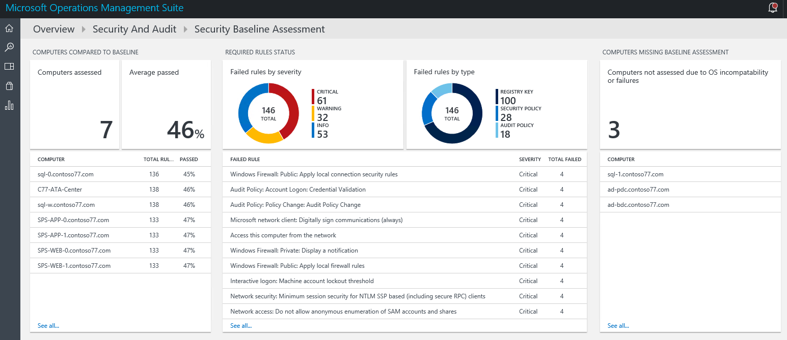
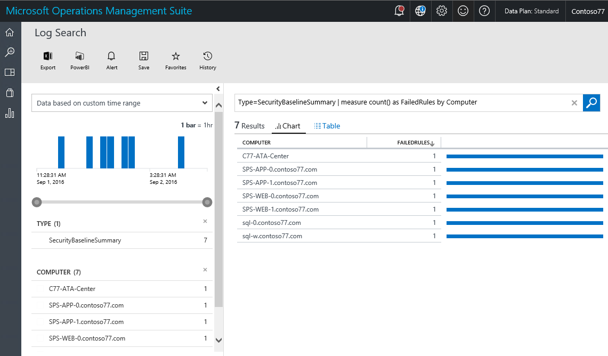
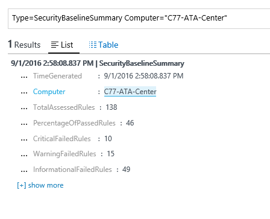
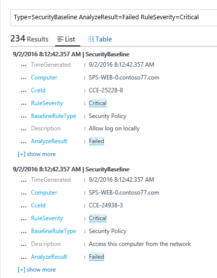

<properties
   pageTitle="Vorgänge Management Suite Sicherheit zu gewährleisten und Audit Lösung geplante | Microsoft Azure"
   description="Dieses Dokument wird erläutert, wie OMS Sicherheit verwenden und Überwachungsrichtlinien Lösung eine geplante Bewertung aller überwachten Computer für Compliance- und Zweck ausführen."
   services="operations-management-suite"
   documentationCenter="na"
   authors="YuriDio"
   manager="swadhwa"
   editor=""/>

<tags
   ms.service="operations-management-suite"
   ms.devlang="na"
   ms.topic="hero-article"
   ms.tgt_pltfrm="na"
   ms.workload="na"
   ms.date="09/08/2016"
   ms.author="yurid"/>

# Bewertung der geplanten Vorgänge Management Suite Sicherheit und Audit-Lösung

Dieses Dokument hilft Ihnen, [Vorgänge Management Suite (OMS) Sicherheit und Audit Lösung](operations-management-suite-overview.md) geplante Bewertung Funktionen zu verwenden, um die sicheren Status überwachten Ressourcen zuzugreifen.

## Was ist die geplante Bewertung?

Microsoft definiert zusammen mit Industry und Government Organisationen weltweit, eine Windows-Konfiguration, die sehr sicheren Server-Bereitstellungen darstellt. Diese Konfiguration ist eine Reihe von Registrierungsschlüsseln, Richtlinie überwachungseinstellungen und Richtlinieneinstellungen zusammen mit Microsoft empfohlenen Werte für diese Einstellungen Sicherheit. Dieses Regelsatzes ist Sicherheit Basisplan bekannt. OMS Sicherheit und Audit geplante Bewertung Videofunktionen kann alle Ihre Computer für Compliance nahtlos scannen. 

Es gibt drei Typen von Regeln:

- **Registrierungspfadregeln**: Überprüfen Sie, dass die Registrierungsschlüssel ordnungsgemäß festgelegt sind.
- **Überwachen von Regeln**: Rechtschreibregeln Richtlinien zur Überwachung.
- **Sicherheit Richtlinienregeln**: Rechtschreibregeln Berechtigungen auf dem Computer des Benutzers.

> [AZURE.NOTE] Lesen Sie [Verwenden OMS Sicherheit, um die Grundlage für die Konfiguration der Sicherheit bewerten](https://blogs.technet.microsoft.com/msoms/2016/08/12/use-oms-security-to-assess-the-security-configuration-baseline/) für eine kurze Übersicht über dieses Feature.

## Sicherheit geplante Bewertung

Überprüfen Sie Ihre aktuelle Bewertung der Sicherheit Basisplan für alle Computer, die von OMS Sicherheits- und mit dem Dashboard überwacht werden.  Führen Sie die folgenden Schritte aus, um die Sicherheit geplante Bewertung Dashboard zuzugreifen:

1. Klicken Sie im Hauptfenster **Microsoft Operations Management Suite** Dashboard auf **Sicherheit und Audit** Kachel.
2. Klicken Sie im Dashboard **Sicherheit und Audit** auf **Geplante Bewertung** unter **Sicherheitsdomänen**. Das **Geplanten Bestandsaufnahme** Dashboard angezeigt wird, wie in der folgenden Abbildung dargestellt:
    
    

In diesem Dashboard ist in drei Hauptbereichen unterteilt:

- **Computern im Vergleich zu Basisplan**: in diesem Abschnitt finden Sie eine Zusammenfassung der Anzahl der Computer, auf die zugegriffen wurden und den Prozentsatz der Computer, auf denen die Bewertung übergeben. Darüber hinaus haben den Top 10-Computern und das Ergebnis der Prozentsatz für die Bewertung.
- **Regeln Status erforderlich**: in diesem Abschnitt weist die Absicht, Präsenz fehlgeschlagene Regeln durch schwere anzuzeigen und Fehler bei der Regeln nach Typ. Nach dem ersten Diagramm gefunden können Sie schnell bestimmen, ob die meisten die fehlgeschlagenen Regeln kritische, werden. Darüber hinaus haben eine Liste der obersten 10 fehlgeschlagenen Regeln und deren schwere. Das zweite Diagramm zeigt den Typ der Regel, die während der Bewertung fehlgeschlagen ist. 
- **Computer fehlen geplante Bewertung**: in diesem Abschnitt Listen Sie Computer auf, die aufgrund von Betriebssystem Inkompatibilität oder Fehlern nicht zugegriffen wurden. 

### Zugreifen auf Computern im Vergleich zu Basisplan

Idealerweise sein alle Ihre Computer sind mit geplanten Bestandsaufnahme kompatibel. Jedoch erwartet wird, dass in einige Umstände dies nicht der Fall sein. Als Teil der Sicherheit-Prozess ist es wichtig, überprüfen den Computer, auf denen konnten nicht erfolgreich aller Sicherheitstests Bewertung einzubeziehen. Eine schnelle Möglichkeit zum visualisieren, die durch die Option befindet sich im Abschnitt **Computern im Vergleich zu Basisplan** **Computer zugegriffen** wird. Mit der Liste der Computern, die in der folgenden Abbildung zeigt Log Suchergebnis sollte angezeigt werden:

Im Suchergebnis wird angezeigt, in einem Tabellenformat, wo die erste Spalte hat den Namen des Computers und die zweite Farbe hat die Anzahl von Regeln, die fehlgeschlagen ist. Um die Informationen zu den Typ der Regel abzurufen, die fehlgeschlagen ist, klicken Sie auf die Anzahl der fehlgeschlagene Regeln neben dem Namen des Computers. Finden Sie ein Ergebnis ähnlich wie in der folgenden Abbildung dargestellt:

In diesem Suchergebnis müssen Sie die Summe aller verwendeter Regeln, die Anzahl der kritischen Regeln, die fehlgeschlagen ist, die Warnungsregeln und die Regeln Informationen fehlgeschlagen ist.

### Zugreifen auf erforderlichen Regeln status

Wenn die Informationen in Bezug auf die Anzahl der Prozentsatz der Computer, die die Bewertung übergeben erhalten haben, sollten Sie erhalten Sie weitere Informationen darüber, welche Regeln entsprechend der Wichtigkeit weiß nicht sind. Diese Visualisierung hilft Ihnen, priorisieren, welchen Computern zuerst erledigt werden müssen, um sicherzustellen, dass diese in die nächste Bewertung kompatibel sein werden. Zeigen Sie auf den kritischen Teil des Diagramms befindet sich in der Kachel **konnte nicht durch schwere Regeln** unter **Regeln Status erforderlich** , und klicken Sie darauf. Ein Bildschirm ähnlich wie der folgende Ergebnis sollte angezeigt werden:

 

In diesem Ergebnis Log finden Sie unter den Typ der geplanten Regel, die die Beschreibung der diese Regel, und die allgemeine Konfiguration Enumeration (CCE)-ID des dieser Regel fehlgeschlagen. Diese Attribute sollten genug, um eine Maßnahme zum Beheben dieses Problems in der Zielcomputer ausführen.

> [AZURE.NOTE] Weitere Informationen zu CCE Zugriff auf die [Nationalen Sicherheitsrisiko-Datenbank](https://nvd.nist.gov/cce/index.cfm).

### Zugreifen auf Computern fehlen geplante Bewertung

OMS unterstützt das Domäne Mitglied geplante Profil unter Windows Server 2008 R2 nach Zeitphasen bis zum Windows Server 2012 R2. Windows Server 2016 geplante ist noch nicht abgeschlossen und eingefügt werden soll, sobald sie veröffentlicht wird. Alle anderen Betriebssysteme gescanntes über OMS Sicherheit und Audit geplante Bewertung wird unter dem Abschnitt **Computer fehlen geplante Bewertung** angezeigt.

## Siehe auch

In diesem Dokument aus Sie OMS Sicherheit und Audit geplante Bewertung gelernt. Weitere Informationen zum OMS-Sicherheit finden Sie unter den folgenden Artikeln:

- [Vorgänge Management Suite (OMS) (Übersicht)](operations-management-suite-overview.md)
- [Für die Überwachung und Beantworten von Sicherheitshinweisen Vorgänge Management Suite Sicherheit und Audit-Lösung](oms-security-responding-alerts.md)
- [Überwachen von Ressourcen in Vorgänge Management Suite Sicherheit und Audit-Lösung](oms-security-monitoring-resources.md)

