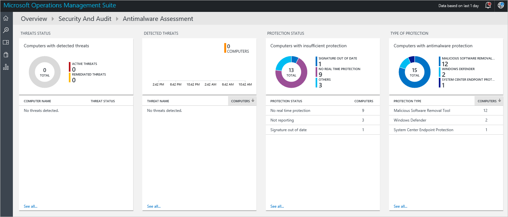

<properties
   pageTitle="Erste Schritte mit Operations Management Suite Sicherheit und Audit Lösung | Microsoft Azure"
   description="Dieses Dokument hilft Ihnen beim Einstieg in die Vorgänge Management Suite Sicherheit zu gewährleisten und Audit Lösung Funktionen zum Überwachen der Hybriden Cloud."
   services="operations-management-suite"
   documentationCenter="na"
   authors="YuriDio"
   manager="swadhwa"
   editor=""/>

<tags
   ms.service="operations-management-suite"
   ms.topic="get-started-article" 
   ms.devlang="na"
   ms.tgt_pltfrm="na"
   ms.workload="na"
   ms.date="09/20/2016"
   ms.author="yurid"/>
 
# Erste Schritte mit Operations Management Suite Sicherheit und Audit-Lösung
Dieses Dokument hilft Ihnen der schnell mit Vorgänge Management Suite (OMS) Sicherheit zu gewährleisten und Audit-Funktionen, die Lösung beginnen, indem er Sie durch die einzelnen Optionen begleitet.

## Was ist OMS?
Microsoft Operations Management Suite (OMS) ist die Microsoft Cloud-basierte IT Management Lösung, die Sie verwalten und Schützen von Ihrem lokalen & cloud-Infrastruktur. Weitere Informationen zu OMS, lesen Sie den Artikel [Vorgänge Management Suite](https://technet.microsoft.com/library/mt484091.aspx).

## OMS Sicherheit und Audit dashboard

Die Lösung OMS Sicherheit und Audit bietet eine umfassende Ansicht in Ihrer Organisation IT-Sicherheitslage mit integrierten Suchabfragen für wichtige Punkte, die Ihre Aufmerksamkeit erfordern. **Sicherheit und Audit** -Dashboard ist die Startseite für alle Elemente im Zusammenhang mit Sicherheit in OMS. Darüber auf hoher Ebene Einblicke in das Sicherheit Ihrer Computer. Darüber hinaus die Möglichkeit, alle Ereignisse in den letzten 24 Stunden, 7 Tage oder einer beliebigen anderen benutzerdefinierten Zeitrahmens anzuzeigen. Um die **Sicherheit zu gewährleisten und Audit** Dashboard zuzugreifen, gehen Sie folgendermaßen vor:

1. Klicken Sie im Hauptfenster **Microsoft Operations Management Suite** Dashboard Kachel " **Einstellungen** " im linken Bereich auf.
2. Klicken Sie in das Blade **Einstellungen** unter **Lösungen** auf **Sicherheit und Audit** Option.
3. **Sicherheit und Audit** -Dashboard wird angezeigt:

    

Wenn Sie den Zugriff auf diese Dashboard zum ersten Mal, und Sie nicht von OMS überwacht Geräte haben, werden die Kacheln nicht mit Daten aus der Agent ausgefüllt werden. Nach der Installation des Agents dauert einige Zeit gefüllt wird, daher zuerst angezeigt werden fehlt möglicherweise einige Daten wie er immer noch in der Cloud hochladen.  In diesem Fall ist es normal, um einige Kacheln ohne Sachanlagen Informationen anzuzeigen. Lesen Sie [Verbinden Windows-Computer direkt an OMS](https://technet.microsoft.com/library/mt484108.aspx) für Weitere Informationen zum OMS-Agent in einen Windows-System und [Verbinden Linux Computern zu OMS](https://technet.microsoft.com/library/mt622052.aspx) für Weitere Informationen zum Ausführen dieser Aufgabe in einem Linux System zu installieren.

> [AZURE.NOTE] Der Agent sammelt die Informationen basierend auf den aktuellen Ereignissen, die aktiviert sind, z. B. Computernamen, IP-Adresse und Benutzer Namen. Jedoch keine Dokumente/Dateien, Datenbank- oder privaten Daten erfasst wurden.   

Solutions sind eine Sammlung von Logik, Visualisierung und Daten Acquisition Regeln, die wichtigsten Kunden Probleme. Sicherheit und Audit ist eine Lösung, die andere separat hinzugefügt werden können. Lesen Sie im Artikel [Hinzufügen Lösungen](https://technet.microsoft.com/library/mt674635.aspx) für Weitere Informationen zum Hinzufügen einer neuen Lösung.

Das Dashboard OMS Sicherheit und Audit ist in vier Bereiche Kategorien unterteilt:

- **Sicherheitsdomänen**: Untersuchen Sie in diesem Bereich weitere mehr werden Sicherheit Datensätze über einen Zeitraum, Schadsoftware Bewertung zugreifen, Bewertung, Netzwerk Sicherheit, Identität und Access Informationen Computern mit Sicherheitsereignisse zu aktualisieren und schnell Zugriff auf Sicherheitscenter Azure Dashboard haben.
- **Wichtige Punkte beachten**: Diese Option können Sie die Anzahl der aktiven Probleme und der Schwere der diese Probleme schnell zu erkennen.
- **Erkennung (Preview)**: ermöglicht es Ihnen, mit einer Visualisierung von Sicherheitshinweisen aus, wie sie anhand Ihrer Ressourcen eintreten Angriffsmuster zu identifizieren.
- **Bedrohungsanalyse**: ermöglicht es Ihnen, mit einer Visualisierung der Gesamtzahl der Server mit ausgehenden Datenverkehr für bösartiger IP, der bösartiger Bedrohungstyp und ein Schema, das zeigt, wo diese IP-Adressen aus stammen sind Angriffsmuster zu identifizieren. 
- **Allgemeine Sicherheitsabfragen**: Diese Option bietet Ihnen eine Übersicht über die am häufigsten verwendeten Sicherheitsabfragen, mit denen Sie Ihre Umgebung überwachen. Wenn Sie in einem dieser Abfragen klicken, wird das **Suche** Blade mit den Ergebnissen für die Abfrage geöffnet.

> [AZURE.NOTE] Lesen Sie weitere Informationen wie OMS Ihre Daten secure behält wie OMS Ihrer Daten mit geschützt.

## Sicherheitsdomänen

Wenn Ressourcen zu überwachen, ist es wichtig, um den aktuellen Status Ihrer Umgebung schnell zugreifen können. Jedoch ist es auch wichtig kann wieder Ereignisse zu verfolgen, die in der Vergangenheit liegt, die zum besseren Verständnis was passiert in Ihrer Umgebung zu bestimmten Zeitpunkt führen können. 

> [AZURE.NOTE] Daten Aufbewahrung erfolgt die OMS gemäß Preise planen. Weitere Informationen finden Sie auf der Seite Preise [Microsoft Operations Management Suite](https://www.microsoft.com/server-cloud/operations-management-suite/pricing.aspx) .

Vorfall Antwort und Analysen Untersuchung Szenarien profitieren direkt von der Ergebnisse in der Kachel **Sicherheit Datensätze über einen Zeitraum** zur Verfügung.

Wenn Sie auf diese Kachel klicken, das Blade **Suchen** wird geöffnet, mit einem Abfrageergebnis für **Sicherheitsereignisse** (Typ = SecurityEvents) mit Daten basierend auf der letzten sieben Tage, wie unten dargestellt:

Im Suchergebnis ist in zwei Bereiche unterteilt: im linke Bereich gibt Ihnen einen Überblick über die Anzahl der Sicherheitsereignisse, die gefunden wurden die Computer in der folgenden Ereignisse gefunden wurden, der die Anzahl der Konten, die auf den betreffenden Computern entdeckt wurden und die Typen von Aktivitäten,. Im rechte Bereich bietet Ihnen die Gesamtergebnisse und eine chronologische Ansicht der Sicherheitsereignisse mit Namen und Ereignis-Aktivität des Computers. Sie können auch **Weitere anzeigen** , wenn Sie weitere Details zu diesem Ereignis, wie die Daten, die Ereignis-ID und die Quelle anzeigen klicken.

> [AZURE.NOTE] Weitere Informationen zu OMS Suchabfrage finden Sie unter [OMS Bezug zu suchen](https://technet.microsoft.com/library/mt450427.aspx).

### Modul Bewertung

Diese Option können Sie schnell zu erkennen Computern mit unzureichender Schutz und Computern, die durch einen Teil der Malware beeinträchtigt werden. Schadsoftware Bewertung Status und erkannten Risiken auf den überwachten Servern gelesen wurden, und klicken Sie dann die Daten an den OMS-Dienst in der Cloud für die Verarbeitung gesendet werden. Risiken und Servern mit unzureichender Schutz im Dashboard Bewertung Schadsoftware angezeigt werden die zugegriffen werden kann, nachdem Sie in der Kachel **Modul Bewertung** klicken Sie auf Servern mit erkannt. 

Beim Klicken auf, wird das **Suche** Blade genau wie alle anderen live Kachel in OMS Dashboard zur Verfügung mit dem Abfrageergebnis geöffnet. Für diese Option Wenn Sie die Option **Nicht Reporting** unter **Schutzstatus**, klicken Sie auf müssen das Abfrageergebnis Sie, das diesen einen Eintrag, der den Namen des Computers und Rang aus, enthält zeigt, wie unten dargestellt:

> [AZURE.NOTE] *Rang* ist eine Noten gemäß den Status des Schutzes zugewiesen (, deaktivieren, aktualisiert, usw.) und Risiken, die gefunden werden. Probleme, die als eine Zahl Aggregationen vornehmen können.

Wenn Sie in den Namen des Computers klicken, haben Sie die chronologische Ansicht Schutz Status für diesen Computer. Dies ist sehr nützlich für Szenarien, in die Sie benötigen, zu verstehen, wenn das Modul einmal installiert wurde und an einem bestimmten Punkt, ihn entfernt haben.   

### Aktualisieren Sie die Bewertung 

Diese Option ermöglicht es Ihnen, die allgemeine anzeigen auf potenzielle Sicherheitsprobleme, schnell zu ermitteln und ob oder wie wichtig die Updates für Ihre Umgebung sind. OMS Sicherheit und Audit Lösung nur die Visualisierung dieser Updates bereitstellen, die tatsächlichen Daten stammen aus [System Updates Lösungen](https://technet.microsoft.com/library/mt484096.aspx), also ein anderes Modul in OMS. Hier ein Beispiel für die Updates:

> [AZURE.NOTE] Weitere Informationen zu Updates Lösung finden Sie unter [Aktualisieren des Servers, mit der Lösung System-Updates](https://technet.microsoft.com/library/mt484096.aspx).

### Identität und Zugriff

Identität sollten die Kontrollebene für Ihr Unternehmen und Schutz Ihrer Identität sollten Ihre oberste Priorität. Während in der Vergangenheit Perimetern um Organisationen vorhanden sind, und diese Perimeter eine der die primäre defensive Begrenzung wurden, wird heutzutage mit mehr Daten und weitere apps, die in der Cloud Die Identität des neuen Umfangs. 

> [AZURE.NOTE] aktuell Daten basiert nur auf Sicherheitsereignisse Login Daten (Ereignis-ID 4624) in die zukünftigen Office365-Benutzernamen und Azure AD-Daten auch enthalten sein.

Durch Überwachen der Aktivitäten Identität werden Sie möglicherweise proaktive Aktionen ausführen, bevor ein Vorfall Speicherort oder reaktivieren Aktionen Angriffsversuch beenden wird. Das **Identität und Access** -Dashboard bietet Ihnen einen Überblick über Ihre Identität Zustand, einschließlich der Anzahl fehlgeschlagener Versuche, sich anzumelden, das Benutzerkonto, das verwendet wurden, während Sie diese Versuche, Konten, die gesperrt wurden, Konten mit geändert oder diese zurückzusetzen Kennwort und derzeit die Anzahl der Konten, die angemeldet sind. 

Wenn Sie in der Kachel **Identität und Access** klicken Sie auf sehen Sie das folgende Dashboard:

Die Informationen in diesem Dashboard können Sie einen möglichen verdächtigen Aktivitäten zu identifizieren sofort unterstützen. Es gibt beispielsweise 338 Versuche, melden Sie sich als **Administrator** und 100 % des diese Versuche fehlgeschlagen ist. Dies kann durch eine Hackerübergriffen mit diesem Konto verursacht werden. Wenn Sie dieses Konto klicken, erhalten Sie weitere Informationen, die zum Bestimmen der Zielressource für diese Angriffen helfen können:

Der Detailbericht bietet wichtige Informationen zu diesem Ereignis, einschließlich: die Zielcomputer, die Art der Anmeldung (in diesem Fall Netzwerk-Anmeldung), die Aktivität (in diesem Fall Ereignis 4625) und eine umfassende Zeitachse der einzelnen versuchen. 

### Computern

Auf alle Computer zuzugreifen, die Sicherheitsereignisse aktiv zu haben, kann diese Kachel verwendet werden. Wenn Sie in diese Kachel klicken Sie auf sehen Sie die Liste der Computer mit Sicherheitsereignisse und die Anzahl der Ereignisse auf jedem Computer:

Sie können weiterhin Ihre Untersuchung, indem Sie auf jedem Computer, und überprüfen Sie die Sicherheitsereignisse, die gekennzeichnet wurden.

### Azure-Sicherheitscenter

Diese Kachel ist im Grunde eine Verknüpfung zur Azure-Sicherheitscenter Dashboard zugreifen. Lesen Sie [Erste Schritte mit Azure-Sicherheitscenter](../security-center/security-center-get-started.md) für Weitere Informationen zu dieser Lösung.

## Wichtige Punkte

Die wichtigste Absicht dieser Gruppe von Optionen besteht darin einen schnellen Überblick über die Probleme bereitzustellen, die Sie in Ihrer Umgebung haben, indem Sie sie in kritisch, Warnung und Information gliedern. Die aktive Problem Typ Kachel eine Visualisierung der diese Probleme, aber es ist zulassen nicht zu durchsuchen Weitere Details zu können, für, müssen Sie den unteren Teil dieses Kachel verwenden, bei dem der Name des Problems (NAME), wie viele Objekte (Anzahl) hierfür hat und wie wichtig es (schwere) ist.

Sie können sehen, dass diese Probleme bereits in der Gruppe **Sicherheitsdomänen** verschiedenen Bereichen behandelt wurden die verstärkt den Zweck dieser Ansicht: Visualisieren der wichtigsten Probleme in Ihrer Umgebung von einem einzigen Ort.

## Erkennung (Preview)

Diese Option ist Hauptfenster dürfen IT, um potenzielle Risiken für ihre Umgebung über und der Schwere der dieses Risiko schnell zu erkennen.

Diese Option kann auch verwendet werden während der Reaktion Untersuchung zu führen die Bewertung und erhalten weitere Informationen zu den Angriffen.

> [AZURE.NOTE] Weitere Informationen zum Verwenden von OMS für Vorfall Antwort sehen Sie [wie das Sicherheitscenter Azure und Microsoft Operations Management Suite für eine Antwort Vorfall nutzen an](https://channel9.msdn.com/Blogs/Taste-of-Premier/ToP1703).

## Bedrohungsanalyse

Der neue Bedrohung Intelligence Abschnitt der Lösung Sicherheit und Audit Visualisierung die möglichen Angriffsmustern auf verschiedene Weise: die Gesamtzahl der Server mit ausgehenden bösartiger IP-Verkehr, der bösartiger Bedrohungstyp und ein Schema, das zeigt, wo diese IP-Adressen entnommen werden. Sie können interagieren mit der Karte, und klicken Sie auf die IP-Adressen für Weitere Informationen.

Gelbe Pins auf der Karte zeigen eingehenden Datenverkehr von bösartiger IP-Adressen an. Es kommt für Server, die mit dem Internet eingehenden bösartiger Datenverkehr finden Sie unter verfügbar gemacht werden, aber es empfiehlt sich, überprüfen diese Versuche, um sicherzustellen, dass keine von ihnen erfolgreich war. Diese Indikatoren basieren auf IIS-Protokolle, WireData und Windows-Firewall protokolliert.  

## Allgemeine Sicherheitsabfragen

Die Liste der verfügbaren allgemeine Sicherheitsabfragen können Sie schnell Informationen Ressource zugreifen und es basierend auf Ihre Umgebung hinsichtlich Anforderungen anpassen, hilfreich sein. Diese allgemeinen Abfragen sind:

- Alle Sicherheitsaktivitäten
- Sicherheitsaktivitäten auf dem Computer "computer01.contoso.com" (ersetzen durch den Namen Ihres eigenen Computers)
- Sicherheitsaktivitäten auf dem Computer "computer01.contoso.com" für das Konto "Administrator" (ersetzen durch den Namen des eigenen Computers und Konto)
- Melden Sie sich vom Computer Aktivität
- Konten, die Microsoft-Modul auf jedem Computer beendet
- Computer, in dem der Microsoft-Modul-Prozess beendet wurde
- Computer, bei denen "hash.exe" war, ausgeführt (ersetzen durch anderen Prozessname)
- Alle Prozessnamen, die ausgeführt wurden
- Melden Sie sich bei Aktivität nach Firma
- Konten, der per Remotezugriff angemeldet auf dem Computer "computer01.contoso.com" (ersetzen durch den Namen Ihres eigenen Computers)

## Siehe auch

In diesem Dokument wurden OMS Sicherheit und Audit Lösung vorgestellt. Weitere Informationen zum OMS-Sicherheit finden Sie unter den folgenden Artikeln:

- [Vorgänge Management Suite (OMS) (Übersicht)](operations-management-suite-overview.md)
- [Für die Überwachung und Beantworten von Sicherheitshinweisen Vorgänge Management Suite Sicherheit und Audit-Lösung](oms-security-responding-alerts.md)
- [Überwachen von Ressourcen in Vorgänge Management Suite Sicherheit und Audit-Lösung](oms-security-monitoring-resources.md)
