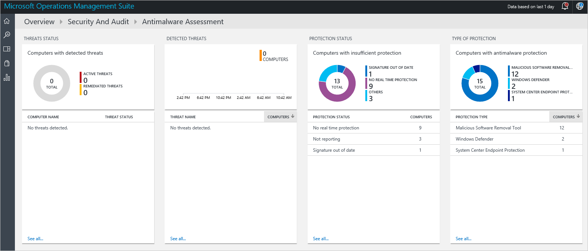
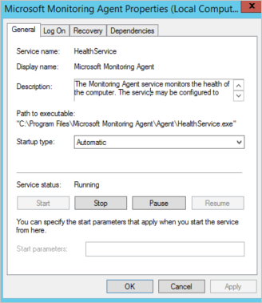
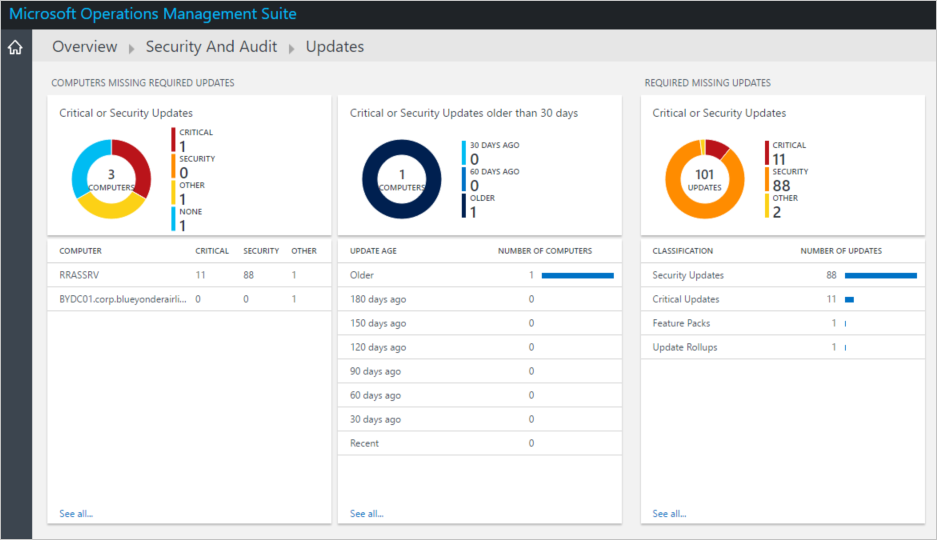
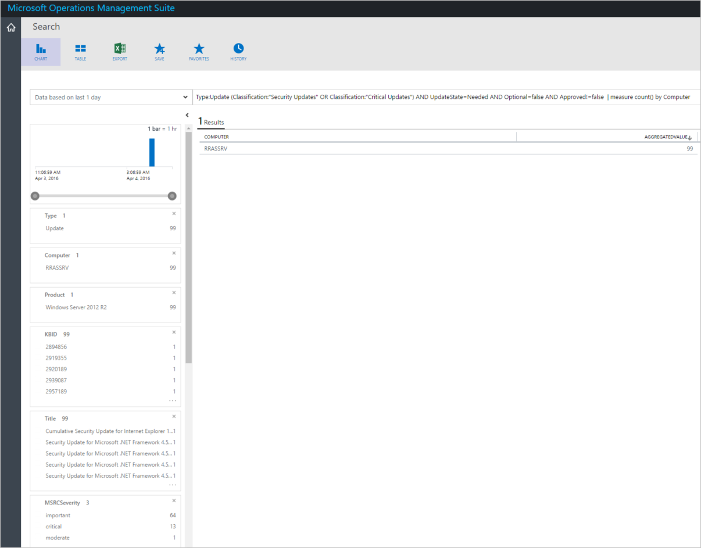
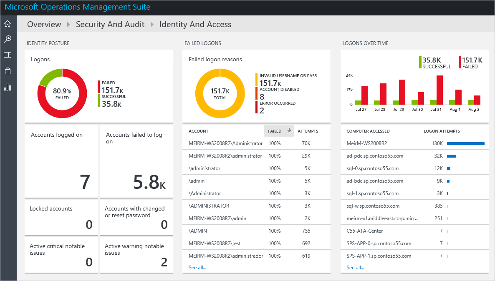
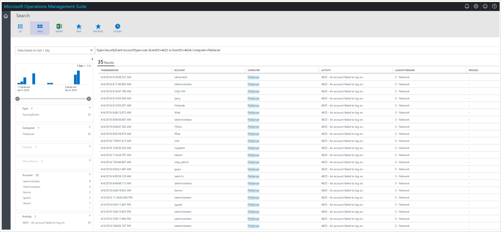

<properties
   pageTitle="Überwachen von Ressourcen in Vorgänge Management Suite Sicherheit und Audit Lösung | Microsoft Azure"
   description="Dieses Dokument hilft Ihnen OMS-Sicherheit verwendet und Überwachungsrichtlinien Funktionen Ressourcen überwachen und Sicherheitsprobleme erkennen."
   services="operations-management-suite"
   documentationCenter="na"
   authors="YuriDio"
   manager="swadhwa"
   editor=""/>

<tags
   ms.service="operations-management-suite"
   ms.topic="article" 
   ms.devlang="na"
   ms.tgt_pltfrm="na"
   ms.workload="na"
   ms.date="10/18/2016"
   ms.author="yurid"/>

# Ressourcen Vorgängen Management Suite Sicherheit und Audit-Lösung für die Überwachung

Dieses Dokument hilft Ihnen OMS Sicherheit und Audit-Funktionen, die Ihre Ressourcen überwachen und Sicherheitsprobleme erkennen.

## Was ist OMS?

Microsoft Operations Management Suite (OMS) ist Microsoft Cloud IT-Lösung basierend auf, das Sie verwalten und Schützen von Ihrem lokalen & cloud-Infrastruktur unterstützt. Weitere Informationen zu OMS, lesen Sie den Artikel [Vorgänge Management Suite](https://technet.microsoft.com/library/mt484091.aspx).

## Überwachen von Ressourcen

Bei jedem ist möglich, Sie sollten verhindern, dass Sicherheitsvorfälle an erster Stelle. Es ist jedoch nicht aller Sicherheitsvorfälle verhindert werden kann. Wenn ein Sicherheitsvorfall geschieht, müssen Sie sicherstellen, dass deren Einfluss minimiert ist.  Es gibt drei wichtige Empfehlungen, die verwendet werden können, um die Anzahl und den Einfluss der Sicherheit Anfragen zu minimieren:

- Bewerten Sie regelmäßig Sicherheitsrisiko in Ihrer Umgebung.
- Prüfen Sie regelmäßig alle Computersysteme und Netzwerkgeräte, um sicherzustellen, dass sie alle der neuesten Updates installiert haben.
- Prüfen Sie regelmäßig alle Protokolle und Protokollierung Verfahren, einschließlich Betriebssystem-Ereignisprotokollen, anwendungsspezifische Protokolle sowie die Systemprotokolle von Angriffserkennungssystemen.

Minimieren den Einfluss der Sicherheit Anfragen OMS Sicherheit und Audit Lösung ermöglicht IT aktiv Überwachen von alle Ressourcen, die Ihnen helfen. OMS Sicherheit und Audit weist Sicherheitsdomänen, die für die Überwachung von Ressourcen verwendet werden können. Die Sicherheitsdomänen bietet schnellen Zugriff auf eine Optionen zum Überwachen der Sicherheit, die die folgenden Domänen noch ausführlicher behandelt werden:

- Schadsoftware Bewertung
- Aktualisieren Sie die Bewertung
- Identität und Zugriff

> [AZURE.NOTE] einen Überblick über alle diese Optionen finden Sie unter [Erste Schritte mit Operations Management Suite Sicherheit und Audit-Lösung](oms-security-getting-started.md).

### Überwachung Systemschutz

In einen Schutz Tiefe und systematisch wird jede zusätzliche Schutzebene wichtig für den gesamten Sicherheitsstatus Ihrer Ressource. Computer mit erkannten Risiken und Computer mit nicht genügend Schutz dargestellt werden in der Kachel Schadsoftware Bewertung unter Sicherheitsdomänen. Die Informationen in die Bewertung Schadsoftware verwenden, können Sie einen Plan zum Schutz auf die Server anwenden, die sie benötigen, identifizieren. Zugriff auf diese Option, führen Sie die folgenden Schritte aus:

1. Klicken Sie im Hauptfenster **Microsoft Operations Management Suite** Dashboard auf **Sicherheit und Audit** Kachel.

    

2. Klicken Sie im Dashboard **Sicherheit und Audit** **Modul Bewertung** unter **Sicherheitsdomänen**auf. Das **Modul Bewertung** Dashboard angezeigt wird, wie unten dargestellt:

Das **Schadsoftware Bewertung** Dashboard können Sie die folgenden Sicherheitsprobleme erkennen:

- **Aktive Risiken**: Computer, gefährdet wurden und aktive Risiken im System.
- **Remediated Risiken**: auf Computern, die gefährdet wurden jedoch die Risiken diese beseitigt wurden.
- **Signatur, die älter**: auf Computern, die Schadsoftware Schutz aktiviert haben, aber die Signatur ist veraltet.
- **Keine Echtzeit Schutz**: Computern, die keine Modul installiert haben.

### Überwachen von updates 

Installieren der neuesten Sicherheitsupdates aus Sicherheitsgründen ist, und es sollte in Ihrer Strategie für die Verwaltung aufgenommen. Überwachen von Microsoft-Agent-Dienst (HealthService.exe) liest Aktualisieren von überwachten Computern und dann diese aktualisierte Daten an den OMS-Dienst in der Cloud für die Verarbeitung gesendet. Der Überwachung Microsoft-Agent-Dienst als automatischen Dienst konfiguriert ist, und es sollte immer in der Zielcomputer ausgeführt werden.

Logik wird angewendet, um die Aktualisierungsdaten und der Cloud-Dienst Einträge die Daten. Wenn Sie fehlende Updates gefunden werden, werden auf dem Dashboard **Updates** angezeigt. Das **Updates** Dashboard können Sie mit fehlenden Updates funktionieren, und entwickeln einen Plan für diese auf die Server anwenden, die sie benötigen. Gehen Sie folgendermaßen vor, auf das Dashboard **Updates** zugreifen:

1. Klicken Sie im Hauptfenster **Microsoft Operations Management Suite** Dashboard auf **Sicherheit und Audit** Kachel.
2. Klicken Sie im Dashboard **Sicherheit und Audit** unter **Sicherheitsdomänen**auf **Update Bewertung** . Das Update-Dashboard angezeigt wird, wie unten dargestellt:

In diesem Dashboard können Sie eine Bewertung aktualisieren, um grundlegende Informationen zu den aktuellen Status der Computer und die wichtigsten Risiken Adresse ausführen. Mithilfe der Kachel **kritisch oder Sicherheitsupdates bereitgestellt** werden IT-Administratoren auf detaillierte Informationen zu den Updates zugreifen, die fehlen wie unten dargestellt:

Dieser Bericht enthalten wichtigen Informationen, der verwendet werden kann, um die Art der Bedrohung, die diesem System gefährdet ist an, einschließlich Sicherheitsupdates und das MS Bulletin, die weitere Details über das Sicherheitsrisiko weist zugeordnet Microsoft KB-Artikel zu identifizieren.

### Überwachen von Identität und Zugriff

Für Benutzer von überall und arbeiten, verwenden verschiedene Geräte und den Zugriff auf einen riesigen Cloud und lokale apps ist es erforderlich, dass ihre Anmeldeinformationen geschützt sind. Anmeldeinformationen Diebstahl Angriffen sind diejenigen, in denen ein Hacker Zugriff auf ein normaler Benutzer Anmeldeinformationen Zugriff auf ein System innerhalb des Netzwerks Anfangs verschafft. In vielen Fällen diese anfänglichen Angriffen ist nur eine Möglichkeit, erhalten Zugriff auf das Netzwerk, das ultimative Ziel Recht Konten zu ermitteln. 

Angreifer verbleibt mit frei verfügbaren Tools zum Extrahieren von Anmeldeinformationen aus der Sitzungen von anderen Konten angemeldet im Netzwerk. Abhängig von der Systemkonfiguration können diese Anmeldeinformationen in Form von Hashes, Tickets oder sogar nur-Text-Kennwörter extrahiert werden.  

> [AZURE.NOTE] Maschinen, die direkt mit dem Internet verbunden sind, sehen viele Versuche, die sich mit allen Arten von bekannten Benutzernamen (z. B. Administrator) ausprobieren. In den meisten Fällen ist es OK, wenn die bekannten Benutzernamen nicht verwendet werden und das Kennwort stark genug ist.

Es ist möglich, diese Eindringlinge zu erkennen, bevor sie ein Konto mit Berechtigungen manipulieren. Sie können **OMS Sicherheit und Audit Lösung** zum Überwachen der Identität und Access nutzen. Gehen Sie folgendermaßen vor, auf das Dashboard **Identität und Access** zugreifen:

1. Klicken Sie im Hauptfenster **Microsoft Operations Management Suite** Dashboard auf Sicherheit und Audit Kachel.
2. Klicken Sie im Dashboard **Sicherheit und Audit** unter **Sicherheitsdomänen**auf **Identität und Access** . Das **Identität und Access** -Dashboard angezeigt wird, wie unten dargestellt:

Als Teil Ihrer regulären Überwachung Strategie müssen Sie für die Überwachung Identität einschließen. IT-Administrator sollte aussehen, wenn es gibt ein bestimmter gültiger Benutzernamen, der viele Versuche enthält. Dies möglicherweise entweder Angreifer, die den Real-Username erworben anzugeben, und versuchen, Bruteforce oder eine automatische Tool das hartcodierte Kennwort verwendet, das abgelaufen sind.

Diese Dashboard kann die IT potenzielle Risiken im Hinblick auf Identität und den Zugriff auf Ressourcen des Unternehmens schnell zu erkennen. Es ist insbesondere wichtig, um potenzielle Trends auch zu identifizieren, beispielsweise die Kachel Anmeldung im Zeitverlauf können Sie entnehmen über einen Zeitraum wie oft eine fehlgeschlagene Anmeldung durchgeführt wurde. In diesem Fall erhalten der Computer **Dateiserver** 35 Anmeldung Versuche. Sie können weitere Details zu diesem Computer vertraut machen, indem Sie darauf klicken. 

Der Bericht für diesen Computer generiert bringt wertvolle Details dieses Muster. Schon festgestellt, dass die Spalte **Konto** Ihnen das Benutzerkonto, das verwendet wurde bietet, um den Zugriff auf das System versuchen, die Spalte **TIMEGENERATED** bietet Ihnen den Zeitraum aus, in dem der Versuch durchgeführt wurde, und die Spalte **LOGONTYPENAME** bietet Ihnen den Speicherort aus, in denen dieser Versuch durchgeführt wurde. Wenn diese Versuche lokal von einem Programm im System ausgeführt wurde, sollte die Spalte **Prozess** des Prozesses Namen angezeigt. In Szenarien, woher die Versuch der Anmeldung von einem Programm stammt, bereits der Name des Prozesses, und Sie können jetzt ausführen weiteren Untersuchung im betreffenden System.

## Siehe auch

In diesem Dokument aus Sie gelernt, OMS Sicherheit und Überwachungsrichtlinien Lösung für Ressourcen zu überwachen. Weitere Informationen zum OMS-Sicherheit finden Sie unter den folgenden Artikeln:

- [Vorgänge Management Suite (OMS) (Übersicht)](operations-management-suite-overview.md)
- [Erste Schritte mit Operations Management Suite Sicherheit und Audit-Lösung](oms-security-getting-started.md)
- [Für die Überwachung und Beantworten von Sicherheitshinweisen Vorgänge Management Suite Sicherheit und Audit-Lösung](oms-security-responding-alerts.md)