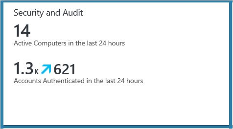
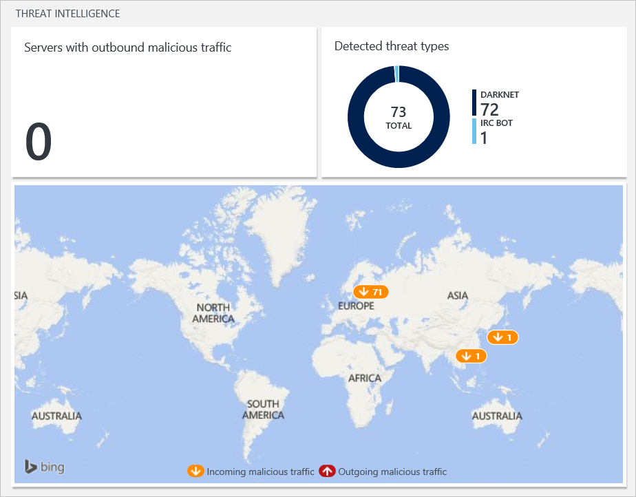
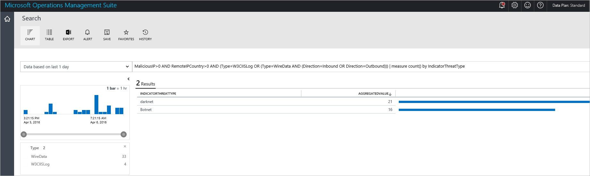
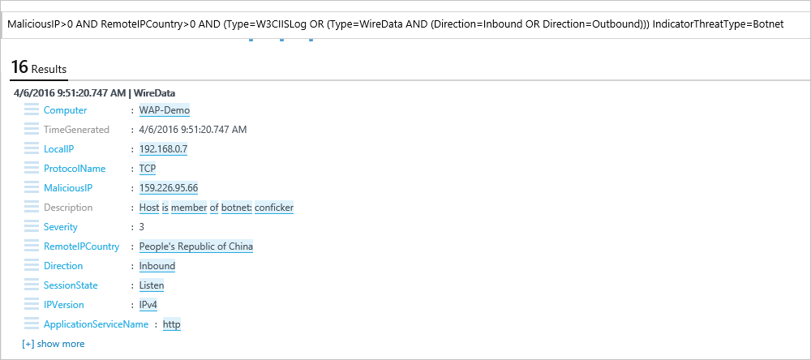
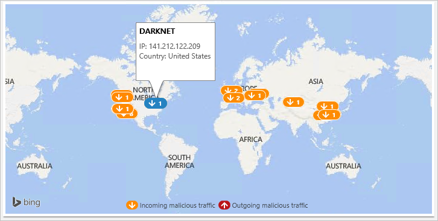

<properties
   pageTitle="Für die Überwachung und Beantworten von Sicherheitshinweisen Vorgänge Management Suite Sicherheit und Audit Lösung | Microsoft Azure"
   description="Dieses Dokument hilft Ihnen, die in OMS Sicherheit und Audit verfügbar Threat Intelligence Option zu überwachen und Beantworten von Sicherheitswarnungen zu verwenden."
   services="operations-management-suite"
   documentationCenter="na"
   authors="YuriDio"
   manager="swadhwa"
   editor=""/>

<tags
   ms.service="operations-management-suite"
   ms.topic="article" 
   ms.devlang="na"
   ms.tgt_pltfrm="na"
   ms.workload="na"
   ms.date="10/18/2016"
   ms.author="yurid"/>

# Für die Überwachung und Beantworten von Sicherheitshinweisen Vorgänge Management Suite Sicherheit und Audit-Lösung

Dieses Dokument hilft Ihnen die Bedrohung Intelligence Option verfügbar in OMS Sicherheit und Audit zum Überwachen und Beantworten von Sicherheitshinweisen.

## Was ist OMS?

Microsoft Operations Management Suite (OMS) ist Microsoft Cloud IT-Lösung basierend auf, das Sie verwalten und Schützen von Ihrem lokalen & cloud-Infrastruktur unterstützt. Weitere Informationen zu OMS, lesen Sie den Artikel [Vorgänge Management Suite](https://technet.microsoft.com/library/mt484091.aspx).

## Bedrohungsanalyse

In einer Enterprise-Umgebung, in dem Benutzer allgemeinen Zugriff auf das Netzwerk haben und eine Vielzahl von Geräten auf Unternehmensdaten Verbindung verwenden, ist es erforderlich, dass Sie aktiv Ressourcen überwachen und schnell auf Sicherheitsvorfälle reagieren können. Dies ist besonders wichtig aus der Sicherheit Lebenszyklus Perspektive, da einige Sicherheit im Internet, die Risiken nicht auslösen können benachrichtigt oder verdächtigen Aktivitäten, die vom technischen Steuerelemente traditionelle Sicherheitsmaßnahmen identifiziert werden können. 

IT-Administratoren können mithilfe der Option **Bedrohungsanalyse** OMS Sicherheit und Audit zur Verfügung, Sicherheitsrisiken anhand der Umgebung, beispielsweise identifizieren, zu identifizieren, wenn ein bestimmter Computer Teil einer [Botnet](https://www.microsoft.com/security/sir/story/default.aspx#!botnetsection)befindet. Wenn Angreifern unrechtmäßig Schadsoftware installieren, das heimlich diesem Computer mit dem Befehl und dem Steuerelement verbindet, können Computern Knoten in einem Botnet werden. Sie können auch potenzielle Risiken aus unter Tage Kommunikationskanäle, wie z. B. [Darknet](https://www.microsoft.com/security/sir/story/default.aspx#!botnetsection_honeypots_darkents)stammen identifizieren. 

Akzeptieren, um diese Bedrohungsanalyse erstellen möchten, verwenden Sie OMS Sicherheit und Audit Daten aus mehreren Quellen in Microsoft. OMS Sicherheit und Audit wird diese Daten zum Identifizieren potenzieller Risiken anhand Ihrer Umgebung nutzen.

Klicken Sie im Bereich Bedrohungsanalyse besteht aus drei wichtigsten Optionen:
- Servern mit ausgehenden bösartiger Datenverkehr
- Typen von Risiken erkannt
- Threat Intelligence Karte

> [AZURE.NOTE] einen Überblick über alle diese Optionen finden Sie unter [Erste Schritte mit Operations Management Suite Sicherheit und Audit-Lösung](oms-security-getting-started.md).

### Beantworten von Sicherheitshinweisen

Einer der Schritte eines Prozesses [Sicherheit Vorfall Antwort](https://technet.microsoft.com/library/cc512623.aspx) ist zum Identifizieren der Schwere der Kompromisse Systeme. In dieser Phase sollten Sie die folgenden Aufgaben ausführen:

- Bestimmen Sie die Art von der Angriffen
- Ermitteln des Angriffen Punktes
- Ermitteln Sie den Zweck von den Angriffen. Wurde die Angriffen gezielt auf Ihre Organisation auf bestimmte Informationen zu erhalten, oder war er zufällig?
- Die betroffenen Systeme zu identifizieren
- Identifizieren Sie die Dateien, die auf die zugegriffen wurde und Bestimmen der Vertraulichkeit dieser Dateien

Sie können Informationen OMS Sicherheit und Audit-Lösung mit folgenden Aufgaben helfen **Bedrohungsanalyse** nutzen. Gehen Sie folgendermaßen vor, auf diese **Bedrohungsanalyse** Optionen zugreifen:

1. Klicken Sie im Hauptfenster **Microsoft Operations Management Suite** Dashboard auf **Sicherheit und Audit** Kachel.

    

2. Im Dashboard **Sicherheit und Audit** sehen Sie die Optionen **Bedrohungsanalyse** rechts, wie unten dargestellt:

    

Diese drei Kacheln erhalten Sie einen Überblick über die aktuellen Risiken. Auf dem **Server mit ausgehenden bösartiger Datenverkehr** , die Sie imstande sein sollen, um festzustellen, ob es alle Computer, die Sie überwachen sind (innerhalb oder außerhalb des Netzwerks) ist, die mit dem Internet bösartigen Datenverkehr senden. 

Die Kachel **erkannt Bedrohungstypen** enthält eine Übersicht über die Risiken, die aktuell "in der Natur" sind, wenn Sie diese Kachel klicken, werden weitere Details über diese Risiken wie unten angezeigt:

Sie können weitere Informationen zu jeder Gefahr extrahieren, indem Sie darauf klicken. Das folgende Beispiel zeigt weitere Details Botnet:

Wie in den Anfang der in diesem Abschnitt beschrieben, kann diese Informationen während einer Reaktion Fall sehr nützlich sein. Es kann auch wichtig sein bei eine gerichtliche Untersuchung, müssen Sie die Quelle der Angriffen, welches System gefährdet wird und der Zeitachse finden. In diesem Bericht können Sie problemlos identifizieren einige wichtige Details zu den Angriffen, z. B.: die Quelle, die lokale IP-Adresse, die gefährdet wird und die aktuelle Sitzungszustand der Verbindung. 

Die **Bedrohung Intelligence Karte** hilft Ihnen der aktuellen Orte auf der ganzen Welt zu identifizieren, die bösartigen Datenverkehr auftreten. Es gibt Orange (eingehende) und Rot (ausgehenden) Pfeile in dieser Zuordnung, die die Richtung des Datenverkehrs zu identifizieren, wenn Sie auf eine der folgenden Pfeile klicken Sie auf, zeigen sie den Typ der Bedrohung und die Richtung des Datenverkehrs wie unten dargestellt:

> [AZURE.NOTE] Sie können eine Demo sehen, zum Verwenden dieser Funktion während ein Vorfall Antwort Prozess, indem Sie die Präsentation [mindern Datacenter Sicherheitsrisiken mit schrittweisen Untersuchung mit Vorgänge Management Suite](https://myignite.microsoft.com/videos/5000) heraus bei Microsoft Ignite übermittelt.

## Siehe auch

In diesem Dokument gelernt Sie die Option **Bedrohungsanalyse** in OMS Sicherheit und Audit Lösung von Sicherheitshinweisen Antworten verwenden. Weitere Informationen zum OMS-Sicherheit finden Sie unter den folgenden Artikeln:

- [Vorgänge Management Suite (OMS) (Übersicht)](operations-management-suite-overview.md)
- [Erste Schritte mit Operations Management Suite Sicherheit und Audit-Lösung](oms-security-getting-started.md)
- [Überwachen von Ressourcen in Vorgänge Management Suite Sicherheit und Audit-Lösung](oms-security-monitoring-resources.md)
