<properties
    pageTitle="Aktualisieren von Management-Lösung in OMS | Microsoft Azure"
    description="In diesem Artikel soll helfen zu verstehen, wie diese Lösung zum Verwalten von Updates für Windows und Linux Computer verwendet."
    services="operations-management-suite"
    documentationCenter=""
    authors="MGoedtel"
    manager="jwhit"
    editor=""
    />
<tags
    ms.service="operations-management-suite"
    ms.workload="tbd"
    ms.tgt_pltfrm="na"
    ms.devlang="na"
    ms.topic="get-started-article"
    ms.date="10/14/2016"
    ms.author="magoedte"/>

#  Lösung für die Verwaltung in OMS

Die Update-Management-Lösung in OMS können Sie Updates für Windows und Linux Computer verwalten.  Schnell können Sie den Status der verfügbaren Updates auf allen Agentcomputern bewerten und beim Installieren von erforderlichen Updates für Server einleiten. 

## Erforderliche Komponenten

-   Windows-Agents müssen entweder zum Kommunizieren mit einem Server Windows Server Update Services (WSUS) oder Zugang zu Microsoft Update konfiguriert sein.  

    >[AZURE.NOTE] Der Windows-Agent kann nicht gleichzeitig vom System Center-Konfigurations-Manager verwaltet werden.  
  
-   Linux-Agents müssen Zugriff auf ein Repository aktualisieren.  Der OMS-Agent für Linux kann von [GitHub](https://github.com/microsoft/oms-agent-for-linux)heruntergeladen werden. 

## Konfiguration

Führen Sie die folgenden Schritte aus, um die Lösung für die Verwaltung von dem Arbeitsbereich OMS hinzuzufügen, und fügen Sie Linux Agents.  Windows-Agents werden automatisch mit keine zusätzliche Konfiguration hinzugefügt.

1.  Hinzufügen der Update Management-Lösung in Ihren OMS Arbeitsbereich mithilfe des Prozesses [OMS hinzufügen Lösungen](../log-analytics/log-analytics-add-solutions.md) aus dem Lösungskatalog beschrieben.  
2.  Wählen Sie im Portal OMS **Einstellungen** und dann auf **Datenquellen verbunden**.  Beachten Sie die **Arbeitsbereich-ID** und dem **Primärschlüssel** oder **sekundären Schlüssel**.
3.  Führen Sie die folgenden Schritte aus, für jeden Computer Linux.

    ein.  Installieren der neuesten Version von der OMS-Agent für Linux durch Ausführen der folgenden Befehle.  Ersetzen Sie <Workspace ID> mit der Arbeitsbereich-ID und <Key> mit dem primären oder sekundären Schlüssel.

        cd ~
        wget https://github.com/Microsoft/OMS-Agent-for-Linux/releases/download/v1.2.0-75/omsagent-1.2.0-75.universal.x64.sh
        sudo bash omsagent-1.2.0-75.universal.x64.sh --upgrade -w <Workspace ID> -s <Key>

     b. Wenn den Agent entfernen möchten, führen Sie den folgenden Befehl ein.

        sudo bash omsagent-1.2.0-75.universal.x64.sh --purge

## Management packs

Wenn Ihre System Center Operations Manager Management Group unter zu dem Arbeitsbereich OMS angeschlossen ist, werden dann die folgenden Management Packs in Operations Manager installiert, wenn Sie diese Lösung hinzufügen. Es gibt keine Konfiguration oder Wartung der diese Management Packs erforderlich. 

-   Microsoft System Center Advisor Update Bewertung Intelligence Pack (Microsoft.IntelligencePacks.UpdateAssessment)
-   Microsoft.IntelligencePack.UpdateAssessment.Configuration (Microsoft.IntelligencePack.UpdateAssessment.Configuration)
-   Aktualisieren der Bereitstellung MP

Weitere Informationen darüber, wie die Lösung Management Packs aktualisiert werden finden Sie unter [Log Analytics Operations Manager verbinden](../log-analytics/log-analytics-om-agents.md).

## Datensammlung

### Unterstützte agents

Die folgende Tabelle beschreibt die verbundenen Datenquellen, die durch diese Lösung unterstützt werden.

Verbundenen Datenquellen | Unterstützt | Beschreibung|
----------|----------|----------|
Windows-agents | Ja | Die Lösung sammelt Informationen zu System-Updates von Windows-Agents und Installation von erforderlichen Updates eingestellt.|
Linux-agents | Ja | Die Lösung sammelt Informationen zu Systemupdates für von Agents Linux.|
Manager Management Group unter Vorgänge | Ja | Die Lösung sammelt Informationen zu Systemupdates für von Agents in einer verbundenen Management Group unter. Eine direkte Verbindung des Operations Manager-Agents mit Log Analytics ist nicht erforderlich. An den OMS Repository werden Daten aus der Verwaltungsgruppe weitergeleitet.|
Azure-Speicher-Konto | Nein | Informationen zu Systemupdates für enthält Azure-Speicher nicht.|  

### Häufigkeit Collection

Für jeden verwalteten Windows-Computer wird eine Überprüfung zweimal pro Tag durchgeführt.  Wenn Sie ein Update installiert ist, werden deren Informationen innerhalb von 15 Minuten aktualisiert.  

Für jeden verwalteten Linux-Computer wird eine Überprüfung alle 3 Stunden ausgeführt.  

## Verwenden die Lösung

Wenn Sie die Lösung für die Verwaltung von dem Arbeitsbereich OMS hinzufügen, wird die Kachel **Update Management** des Dashboards OMS hinzugefügt werden. Diese Kachel zeigt die Anzahl und grafisch dargestellt, die Anzahl der Computer in Ihrer Umgebung aktuell mit Anforderung der System-Updates.  
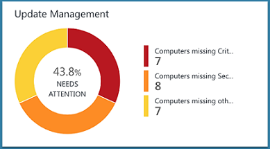  

## Anzeige aktualisieren Bewertung

Klicken Sie auf die Kachel **Der Verwaltung von** So öffnen Sie das **Update Management** Dashboard. Das Dashboard enthält die Spalten in der folgenden Tabelle. Jede Spalte enthält bis zu zehn Elemente Kriterien der Spalte für den angegebenen Bereich und Zeitraums. Sie können ein Protokoll suchen ausführen, die alle Datensätze zurückgibt, indem Sie auf **Alles anzeigen** am unteren Rand der Spalte oder indem Sie auf die Überschrift der Spalte.

Spalte | Beschreibung|
----------|----------|
**Fehlende Updates Computern** ||
Kritische oder Sicherheitsupdates | Listen, die im oberen Bereich zehn Computern, die fehlen aktualisiert durch die Anzahl der Updates sortiert sind sie nicht vorhanden. Klicken Sie auf einen Computernamen zum Ausführen einer Log Suche zurückgeben, dass alle Datensätze für diesen Computer zu aktualisieren.|
Kritisch oder Sicherheitsupdates, die älter als 30 Tage| Anzahl von Computern, die sind identifiziert fehlen kritische oder Sicherheitsupdates gruppiert durch die Länge der Zeit, da das Update veröffentlicht wurde. Klicken Sie auf einen der Einträge können eine Log-Suche zurückgeben alle fehlenden und wichtige Updates ausführen.|
**Fehlende Updates erforderlich**||
Kritische oder Sicherheitsupdates | Listet die Klassifizierung von Updates, dass Computer durch die Anzahl der Computer fehlen Updates, die in der Kategorie sortiert. Klicken Sie auf eine Klassifizierung zum Ausführen einer Log Suche zurückgeben, dass alle Datensätze für Klassifikation zu aktualisieren.|
**Aktualisieren von Bereitstellungen**||
Aktualisieren von Bereitstellungen | Anzahl der aktuell berechneten Update-Bereitstellungen und die Dauer bis zum nächsten geplanten Ausführung.  Klicken Sie auf die Kachel Pläne anzeigen, das aktuell ausführen und abgeschlossenen Updates oder eine neue Bereitstellung planen.|  
   
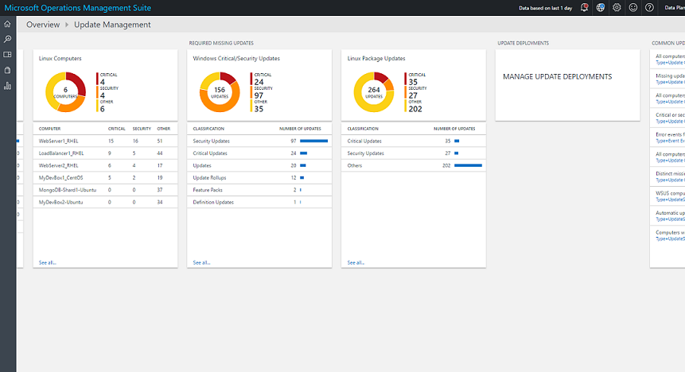   
 
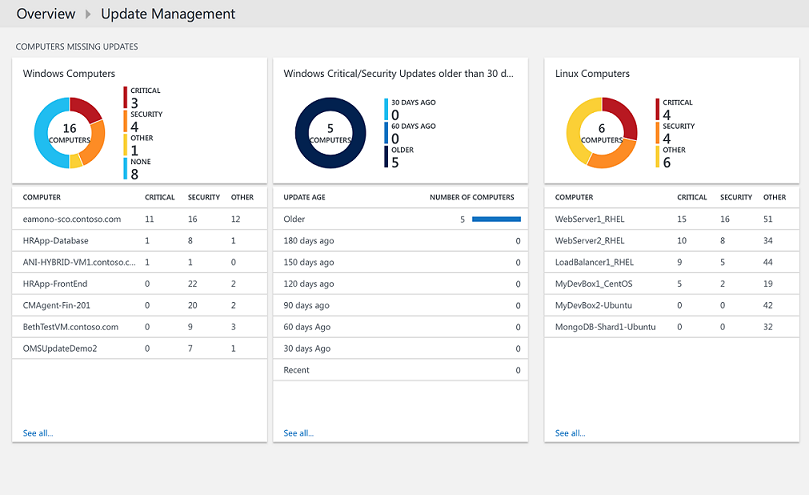   
 
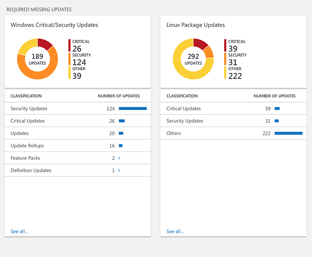   

## Installieren von updates

Sobald Updates für alle Windows-Computer in Ihrer Umgebung bewertet wurden, haben Sie können Updates installiert durch Erstellen einer *Update-Bereitstellung*erforderlich.  Ein Update-Bereitstellung ist eine geplante Installation von erforderlichen Updates für einen oder mehrere Windows-Computer an.  Sie angeben, das Datum und die Uhrzeit für die Bereitstellung über einen Computer oder eine Gruppe von Computern, die eingeschlossen werden sollen.  

Updates werden von Runbooks in Azure Automatisierung installiert.  Diese Runbooks können nicht aktuell angezeigt werden, und keine Konfiguration erfordern.  Beim Erstellen einer Bereitstellung aktualisieren, erstellt es einen Zeitplan in dieser beginnt eine Runbooks master Update zu dem angegebenen Zeitpunkt für die darin enthaltenen Computer.  Diese master Runbooks startet eine untergeordnete Runbooks jeder Windows-Agent, für die Installation von erforderlichen Updates ausführt.  

### Update-Bereitstellungen anzeigen

Klicken Sie auf die Kachel **Update-Bereitstellung** zum Anzeigen der Liste der vorhandenen Bereitstellung auf aktualisieren.  Sie werden nach Status – **Geplante**, **ausgeführt**und **erledigt**gruppiert.   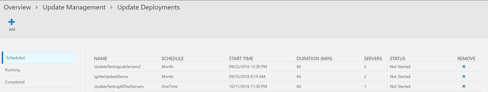   

In der folgenden Tabelle werden die Eigenschaften angezeigt, die für jeden Update-Bereitstellung beschrieben.

Eigenschaft | Beschreibung|
----------|----------|
Namen | Name der Bereitstellung des Updates.|
Zeitplan | Typ des Zeitplans.  *OneTime* gibt es zurzeit der einzige mögliche Wert.|
Startzeit|Datum und Uhrzeit, an der Bereitstellung Update zu starten.|
Dauer | Anzahl der Minuten, die Bereitstellung des Updates ausgeführt werden darf.  Wenn alle Updates nicht innerhalb dieser Dauer installiert sind, und klicken Sie dann die verbleibenden Updates, bis die Bereitstellung des nächsten Updates warten müssen.|
Servers | Anzahl der Computer die Update-Bereitstellung auswirken.|
Status | Aktuellen Status der Bereitstellung des Updates.  Mögliche Werte sind: -Nicht gestartet -Ausführung -Abgeschlossen|  

Klicken Sie auf eine Bereitstellung von deren Detailbildschirm anzeigen, wozu auch die Spalten in der folgenden Tabelle.  In diesen Spalten werden nicht ausgefüllt werden, wenn die Update-Bereitstellung noch nicht gestartet wurde. 

Spalte | Beschreibung|
----------|----------|
**Computer-Ergebnisse**||
Wurde erfolgreich abgeschlossen | Listen die Anzahl der Computer in der Bereitstellung aktualisieren nach Status aus.  Klicken Sie auf einen Status zum Ausführen einer Log Suche zurückgeben, dass alle Datensätze mit diesem Status für die Bereitstellung aktualisieren zu aktualisieren.|
Installation Computerstatus| Listet die Computer im Zusammenhang mit der Bereitstellung aktualisieren und den Prozentsatz der Updates, das erfolgreich installiert. Klicken Sie auf einen der Einträge können eine Log-Suche zurückgeben alle fehlenden und wichtige Updates ausführen.|
**Aktualisieren Sie die Instanz als Ergebnis**||
Status der Instanz-Installation | Listet die Klassifizierung von Updates, dass Computer durch die Anzahl der Computer fehlen Updates, die in der Kategorie sortiert. Klicken Sie auf einem Computer zum Ausführen einer Log Suche zurückgeben, dass alle Datensätze für diesen Computer zu aktualisieren.|  
   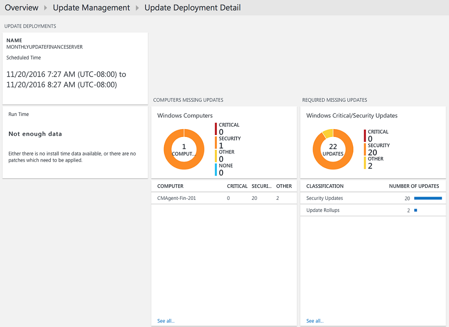

### Erstellen einer Update-Bereitstellungs

Erstellen Sie eine neue Update-Bereitstellung, indem Sie auf die Schaltfläche " **Hinzufügen** " oben auf dem Bildschirm, um die **Neue Bereitstellung von Update** -Seite zu öffnen.  Sie müssen die Werte für die Eigenschaften in der folgenden Tabelle angeben.

Eigenschaft | Beschreibung|
----------|----------|
Namen | Eindeutiger Name zum Identifizieren der bereitstellungs aktualisieren.|
Zeitzone | Zeitzone für die Startzeit verwendet werden soll.|
Startzeit | So starten Sie die Bereitstellung von Datum und Uhrzeit.|
Dauer | Anzahl der Minuten, die Bereitstellung des Updates ausgeführt werden darf.  Wenn alle Updates nicht innerhalb dieser Dauer installiert sind, und klicken Sie dann die verbleibenden Updates, bis die Bereitstellung des nächsten Updates warten müssen.|
Computern | Namen der Computer oder Computergruppen in der Bereitstellung von aufnehmen möchten.  Wählen Sie einen oder mehrere Einträge aus der Dropdownliste aus.|
   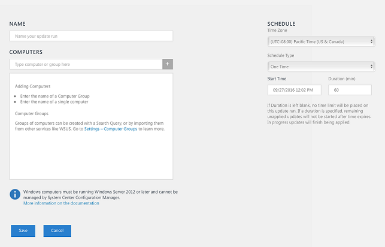

### Zeitraums

Standardmäßig ist der Bereich der analysiert in die Lösung für die Verwaltung von Daten aus allen verbundenen Management Gruppen in den letzten 24 Stunden generiert. 

Um den Zeitbereich des die Daten zu ändern, wählen Sie am oberen Rand des Dashboards **ausgehend von Daten** aus. Sie können Datensätze erstellt oder aktualisiert, die innerhalb der letzten 7 Tage, 1 Tag oder 6 Stunden auswählen. Oder Sie können **benutzerdefinierte** auswählen, und geben Sie einen benutzerdefinierten Datumsbereich.   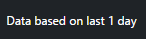  

## Analytics Protokolldatensätze

Die Update-Lösung erstellt zwei Arten von Datensätzen im OMS Repository an.

### Aktualisieren von Datensätzen

Ein Datensatz mit einem Typ von **Aktualisieren** wird für jedes Update erstellt, das installiert oder auf jedem Computer erforderlich ist. Aktualisieren von Datensätzen verfügen über die Eigenschaften in der folgenden Tabelle.

Eigenschaft | Beschreibung|
----------|----------|
Typ | *Aktualisieren*|
SourceSystem | Die Datenquelle, die Installation des Updates genehmigt. Mögliche Werte sind: – Microsoft Update -Windows Update -SCCM -Linux Servern (abgerufen von Paket-Managern)|
Genehmigt | Gibt an, ob die Aktualisierung für die Installation genehmigt wurde.  Linux-Servern Dies ist derzeit als optional OMS Patch nicht verwaltet wird.|
Klassifizierung für Windows | Klassifizierung des Updates. Mögliche Werte sind: -Anwendungen -Wichtige Updates -Definition Updates -Feature Packs -Sicherheits-Updates -Service Sprachpakete -Updaterollups -Updates|
Klassifizierung für Linux | Cassification des Updates. Mögliche Werte sind: -Wichtige Updates -Sicherheits-Updates -Andere Updates|
Computer | Name des Computers.|
InstallTimeAvailable | Gibt an, ob die Uhrzeit für die Installation von anderen Agents zur Verfügung, die dasselbe Update installiert.|
InstallTimePredictionSeconds | Geschätzte Installationszeit in Sekunden basierend auf andere Agents, die das gleiche Update installiert.|
KBID | ID des KB-Artikel, der das Update beschreibt.|
"Verwaltungsgruppenname" | Name der Management Group für SCOM-Agents.  Für andere Agents, dies ist AOI -<workspace ID>.|
MSRCBulletinID | ID zum Microsoft-Sicherheitsupdate, beschreibt das aktualisieren.|
MSRCSeverity | Schwere zum Microsoft-Sicherheitsupdate. Mögliche Werte sind: -Kritische -Wichtige – Moderieren|
Optional | Gibt an, ob die Aktualisierung optional ist.|
Produkt | Name des Produkts, das Update erstellt wurde.  Klicken Sie auf **Ansicht** , um den Artikel in einem Browser zu öffnen.|
PackageSeverity | Die schwere das Sicherheitsrisiko dieses Update, sobald die Linux Distro Lieferanten gemeldet behebt. | 
PublishDate | Datum und Uhrzeit, die das Update installiert wurde.|
RebootBehavior | Gibt an, ob die Aktualisierung einen Neustart erzwingt. Mögliche Werte sind: -Canrequestreboot -Neverreboots|
RevisionNumber | Die Revisionsnummer des Updates.|
SourceComputerId | GUID des Computers eindeutig identifizieren müssen.|
TimeGenerated | Datum und Uhrzeit der letzten Aktualisierung der Eintrag.|
Titel | Titel des Updates.|
UpdateID | GUID die Aktualisierung eindeutig identifizieren.|
UpdateState | Gibt an, ob das Update auf diesem Computer installiert ist. Mögliche Werte sind: -Installierten - ist das Update auf diesem Computer installiert. -Erforderlich - das Update nicht installiert ist und auf diesem Computer erforderlich ist.|  

 
Wenn Sie alle Log Suchen ausführen, die Datensätze mit einer Art des **Updates** zurückgibt können Sie die Ansicht **Updates** auswählen, die eine Zusammenfassung der Updates, die von der Suche zurückgegebenen Kacheln angezeigt. Klicken Sie auf den Einträgen in **fehlt und angewendeten Updates** und **erforderliche und optionale Updates** Kacheln, um den Bereich der Sicht, um diese Reihe von Updates. Wählen Sie aus der **Liste** oder **Tabelle** anzeigen, um die einzelnen Datensätze zurückzukehren.  

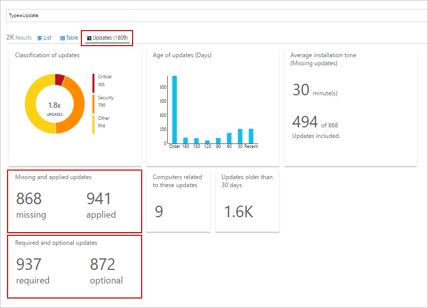  

In der **Tabelle** befinden können Sie die **KBID** für einen beliebigen Datensatz, um einen Browser mit dem KB-Artikel zu öffnen klicken. So können Sie schnell zu den Details des bestimmten Updates zu lesen.  

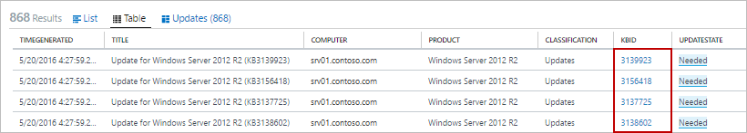

In **der Listenansicht** klicken Sie auf den Hyperlink der **Ansicht** neben der KBID KB-Artikel zu öffnen. 

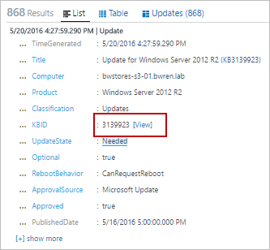

###UpdateSummary Datensätze

Ein Datensatz mit einem Typ von **UpdateSummary** ist für jede Windows-Agent-Computer erstellt. Dieser Eintrag wird aktualisiert, jedes Mal, wenn der Computer überprüft wird nach Updates suchen. **UpdateSummary** Datensätze verfügen über die Eigenschaften in der folgenden Tabelle.

Eigenschaft | Beschreibung|
----------|----------|
Typ | UpdateSummary|
SourceSystem | OpsManager |
Computer | Name des Computers.|
CriticalUpdatesMissing | Anzahl von wichtigen Updates auf dem Computer fehlt.|
"Verwaltungsgruppenname" | Name der Management Group für SCOM-Agents. Für andere Agents, dies ist AOI -<workspace ID>.|
NETRuntimeVersion | Version der .NET Runtime auf dem Computer installiert.|
OldestMissingSecurityUpdateBucket | Periode können die Uhrzeit zugewiesen werden, da das älteste fehlende Sicherheitsupdate auf diesem Computer wurde veröffentlicht. Mögliche Werte sind: -Ältere -180 Tage zurück -150 Tage zurück -120 Tage zurück -90 Tage zurück -60 Tage zurück -Wechseln Sie 30 Tage -Zuletzt verwendete|
OldestMissingSecurityUpdateInDays | Anzahl der Tage, da das älteste fehlende Sicherheitsupdate auf diesem Computer wurde veröffentlicht.|
OsVersion | Version des Betriebssystems auf dem Computer installiert.|
OtherUpdatesMissing | Anzahl der anderen noch nicht auf dem Computer installiert sind.|
SecurityUpdatesMissing | Anzahl der Sicherheitsupdates fehlen auf dem Computer.|
SourceComputerId | GUID des Computers eindeutig identifizieren müssen.|
TimeGenerated | Datum und Uhrzeit der letzten Aktualisierung der Eintrag.|
TotalUpdatesMissing |Die Gesamtzahl der noch nicht auf dem Computer installiert sind.|
WindowsUpdateAgentVersion | Versionsnummer der Windows Update-Agent auf dem Computer.|
WindowsUpdateSetting | Einstellung für wie der Computer wichtige Updates installiert werden. Mögliche Werte sind: -Deaktiviert -Benachrichtigen vor der installation -Geplante installation|
WSUSServer | URL der der zentrale, wenn der Computer so konfiguriert ist, um eine verwenden.|  

## Beispiel für Log Suchbegriffe

Die folgende Tabelle enthält die Stichprobe Log gegen Datensätze aktualisieren, die von dieser Lösung erfasst. 

Abfrage | Beschreibung|
----------|----------|
Alle Computer mit fehlenden updates | Typ = Update UpdateState = erforderlich, Optional = falsch & #124; Wählen Sie Computer, Titel, KBID, Klassifizierung, UpdateSeverity, PublishedDate|
Fehlende Updates für Computer "COMPUTER01.contoso.com" (ersetzen durch den Namen Ihres eigenen Computers) | Typ = Update UpdateState = erforderlich, Optional = false Computer = "COMPUTER01.contoso.com" & #124; Wählen Sie Computer, Titel, KBID, Produkt, UpdateSeverity, PublishedDate|
Alle Computer mit fehlender kritisch oder Sicherheitsupdates | Typ = Update UpdateState = erforderlich, Optional = falsch (Klassifizierung = "Sicherheitsupdates" oder "Klassifikation" = "Wichtige Updates")|
Kritisch oder Sicherheit Updates von Computern, wo Updates manuell angewendet sind, erforderlich | Typ = Update UpdateState = erforderlich, Optional = falsch (Klassifizierung = "Sicherheitsupdates" oder "Klassifikation" = "Wichtige Updates") Computer IN {Typ = UpdateSummary WindowsUpdateSetting = manueller & #124; Verschiedene Computer} & #124; DISTINCT KBID|
Fehlerereignisse für Computer, auf denen kritische fehlende oder Sicherheit erforderlichen updates | Typ = Ereignis EventLevelName = Fehler Computer IN {Typ = Update (Klassifizierung = "Sicherheitsupdates" oder "Klassifikation" = "Wichtige Updates") UpdateState = erforderlich, Optional = falsch & #124; Verschiedene Computer}|
Alle Computer mit fehlenden Updaterollups | Typ = Update Optional = false "Klassifikation" = "Updaterollups" UpdateState = erforderlich & #124; Wählen Sie Computer, Titel, KBID, Klassifizierung, UpdateSeverity, PublishedDate|
DISTINCT fehlende Updates auf allen Computern | Typ = Update UpdateState = erforderlich, Optional = falsch & #124; DISTINCT Titel|
WSUS Computermitgliedschaft | Typ = UpdateSummary & #124; Messen count() durch WSUSServer|
Automatische Aktualisierungskonfiguration | Typ = UpdateSummary & #124; Messen count() durch WindowsUpdateSetting|
Computer mit Automatische Updates deaktiviert | Typ = UpdateSummary WindowsUpdateSetting = manuelle|  
Liste aller Linux Computer denen ein Paket Update verfügbar | Typ = aktualisieren und OSType = Linux und UpdateState! = "Nicht erforderlich" & #124; Messen count() vom Computer|
Liste aller Linux Computer denen ein Paket Update zur Verfügung, in dem kritisch oder Sicherheit Sicherheitsrisiko behandelt. | Typ = aktualisieren und OSType = Linux und UpdateState! "Nicht erforderlich" = und (Klassifizierung = "Wichtige Updates" oder "Klassifikation" = "Sicherheitsupdates") & #124; Messen count() vom Computer|
Liste aller Pakete, die ein Update verfügbar aufweisen | Typ = aktualisieren und OSType = Linux und UpdateState! = "Nicht erforderlich"|
Liste aller Pakete, die ein Update verfügbar aufweisen, in dem kritisch oder Sicherheit Sicherheitsrisiko behandelt. | Typ = aktualisieren und OSType = Linux und UpdateState! "Nicht erforderlich" = und (Klassifizierung = "Wichtige Updates" oder "Klassifikation" = "Sicherheitsupdates")|
Liste aller "Ubuntu" Computer bei jeder Aktualisierung verfügbar | Typ = aktualisieren und OSType = Linux und OSName = Ubuntu & #124; Messen count() vom Computer|

## Nächste Schritte

- Verwenden von Log Suchvorgänge in [Log Analytics](../log-analytics/log-analytics-log-searches.md) detaillierten Updatedaten anzeigen.

- [Erstellen eigener Dashboards](../log-analytics/log-analytics-dashboards.md) mit Update Richtlinientreue für verwaltete Computer.

- [Erstellen von Benachrichtigungen](../log-analytics/log-analytics-alerts.md) , wenn wichtige Updates festgestellt werden als fehlende vom Computer oder einem Computer verfügt über automatische Updates deaktiviert.  

