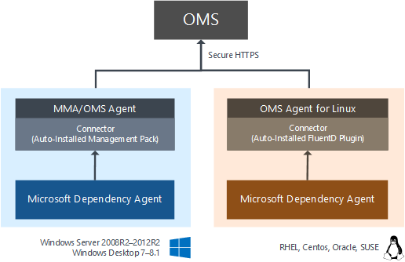
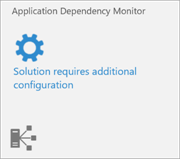

<properties
   pageTitle="Konfigurieren von Anwendung Abhängigkeit Monitor (ADM) in Vorgänge Management Suite (OMS) | Microsoft Azure"
   description="Anwendung Abhängigkeit Monitor (ADM) ist die Lösung, die automatisch erkennt Komponenten der Anwendung unter Windows und Linux Betriebssystemen und die Kommunikation zwischen Diensten maps Vorgänge Management Suite (OMS).  Dieser Artikel enthält Details zum Bereitstellen von ADM in Ihrer Umgebung und verwenden es in einer Vielzahl von Szenarien."
   services="operations-management-suite"
   documentationCenter=""
   authors="daseidma"
   manager="jwhit"
   editor="tysonn" />
<tags
   ms.service="operations-management-suite"
   ms.devlang="na"
   ms.topic="article"
   ms.tgt_pltfrm="na"
   ms.workload="infrastructure-services"
   ms.date="09/28/2016"
   ms.author="daseidma;bwren" />

# Konfigurieren von Anwendung Abhängigkeit Monitor-Lösung in Vorgänge Management Suite (OMS)
 Anwendung Abhängigkeit Monitor (ADM) automatisch erkennt Komponenten der Anwendung unter Windows und Linux Betriebssystemen und die Kommunikation zwischen Diensten maps. Sie können Sie Ihre Server so anzuzeigen, wie Sie diese – als verbundener Systeme vorstellen, mit die kritische Dienste vorführen.  Anwendung Abhängigkeit Monitor zeigt die Verbindungen zwischen Servern, Prozesse, und Ports über alle TCP verbundenen Architektur ohne Konfiguration erforderlich nur die Installation von Agent.

In diesem Artikel werden die Details der Anwendung Abhängigkeit überwachen und Onboarding-Agents konfigurieren.  Informationen zur Verwendung von ADM finden Sie unter [verwenden Application Abhängigkeit Monitor-Lösung in Vorgänge Management Suite (OMS)](operations-management-suite-application-dependency-monitor.md)

>[AZURE.NOTE]Anwendung Abhängigkeit Monitor gibt es zurzeit in der Vorschau als "Privat".  Sie können den Zugriff auf die privaten ADM-Vorschau an [https://aka.ms/getadm](https://aka.ms/getadm)anfordern.
>
>Bei privaten Vorschau alle OMS-Konten haben unbeschränkten Zugriff auf ADM  ADM-Knoten sind kostenlos, aber Log Analytics-Daten für die Typen AdmComputer_CL und AdmProcess_CL werden wie andere Lösung getaktete werden.
>
>Nachdem ADM public Preview-Version eingegeben wurde, wird er nur für frei / kostenpflichtiges Kunden von Einblicke und Analysen in OMS Preise planen verfügbar sein.  Kostenlose Ebene Konten werden nur 5 ADM-Knoten.  Wenn Sie in der Vorschau private Teilnahme sind und nicht in OMS Preise planen registriert sind, wenn ADM public Preview-Version eingibt, wird zu diesem Zeitpunkt ADM deaktiviert. 

## Verbundenen Datenquellen
Die folgende Tabelle beschreibt die verbundenen Datenquellen, die von der ADM-Lösung unterstützt werden.

| Verbundenen Datenquellen | Unterstützt | Beschreibung |
|:--|:--|:--|
| [Windows-agents](../log-analytics/log-analytics-windows-agents.md) | Ja | ADM-analysiert und sammelt Daten von Windows-Agent-Computern.    Beachten Sie, dass zusätzlich zu den OMS-Agent, Windows-Agents Abhängigkeit Microsoft Agent erforderlich.  Bitte finden Sie unter den [Betriebssystemen unterstützt](#supported-operating-systems) eine vollständige Liste Versionen des Betriebssystems. |
| [Linux-agents](../log-analytics/log-analytics-linux-agents.md) | Ja | ADM-analysiert und sammelt Daten von Agent-Computern Linux.    Beachten Sie, dass neben der Agent OMS Linux Agents Abhängigkeit Microsoft Agent erforderlich.  Bitte finden Sie unter den [Betriebssystemen unterstützt](#supported-operating-systems) eine vollständige Liste Versionen des Betriebssystems. |
| [Management Group unter SCOM](../log-analytics/log-analytics-om-agents.md) | Ja | ADM-analysiert und sammelt Daten von Windows und Linux-Agents in einer verbundenen Management Group unter SCOM.   Eine direkte Verbindung vom Computer SCOM Agent zum OMS ist erforderlich. Daten aus der Gruppe Management zum OMS Repository weitergeleitet direkt aus gesendet.|
| [Azure-Speicher-Konto](../log-analytics/log-analytics-azure-storage.md) | Nein | ADM sammelt Daten von Agent-Computern, damit keine daraus zum Sammeln von Azure-Speicher Daten. |

Beachten Sie, dass ADM nur 64-Bit-Plattformen unterstützt.

Unter Windows, Microsoft Überwachung Agent (MMA) zum Sammeln und Senden von SCOM und OMS verwendet Überwachung Daten.  (Dieser Agent wird der SCOM Agent, OMS Agent, MMA oder direkte Agent, je nach Kontext bezeichnet.)  SCOM und OMS bieten unterschiedliche außerhalb des im Feld Versionen MMA, aber diese Versionen können jeder Bericht an SCOM und/oder an OMS.  Klicken Sie auf Linux, der OMS-Agent für Linux sammeln und Überwachen von Daten zu OMS sendet.  Sie können ADM, auf Servern mit direkter OMS-Agents oder auf Servern, die über SCOM Management Gruppen OMS zugeordnet sind.  Im Sinne dieser Dokumentation bezeichnen wir all diesen Agents – auf Linux oder Windows, ob eine SCOM MG oder direkt OMS – als "OMS Agent," verbunden, es sei denn, der bestimmte Bereitstellung Namen des Agents für Kontext erforderlich ist.

Der ADM-Agent wird nicht mehr alle Daten selbst übertragen, und es sind keine Änderungen Firewalls oder Ports erforderlich.  ADM der Daten werden immer durch die OMS-Agent OMS, direkt oder über das Gateway OMS übertragen.

Wenn Sie einen Kunden SCOM mit einer Management Group unter mit OMS verbunden sind:

- Wenn Ihre SCOM-Agents im Internet Verbindung zum OMS zugreifen können, ist keine zusätzliche Konfiguration erforderlich.  
- Wenn Ihre SCOM Agents OMS über das Internet zugreifen können, müssen Sie für die Arbeit mit SCOM Gateways OMS konfigurieren.
  
Wenn Sie die direkte OMS-Agent verwenden, müssen Sie den OMS-Agent selbst OMS oder Schlüsselaufgaben OMS Verbindung konfigurieren.  Das Gateway OMS kann von [https://www.microsoft.com/en-us/download/details.aspx?id=52666](https://www.microsoft.com/en-us/download/details.aspx?id=52666) heruntergeladen werden

### Vermeiden doppelte Daten

Wenn Sie eine SCOM-Kunde sind, sollten Sie Ihre SCOM Agents direkt an OMS kommunizieren nicht konfigurieren oder Daten werden zweimal gemeldet werden.  In ADM führt dies zu Computer zweimal in der Liste der Computer angezeigt werden.

Konfiguration von OMS sollten nur in einem der folgenden Orte Aktionen umgesetzt:

- Klicken Sie im Bereich SCOM Console Vorgänge Management Suite für verwaltete Computer
- In den Eigenschaften MMA Azure Betrieb Einsichten-Konfiguration

Verwenden beide Konfigurationen mit dem gleichen Arbeitsbereich in den einzelnen bewirkt, dass Kopien von Daten. Verwenden beide mit unterschiedlichen Arbeitsbereichen kann in Konflikt stehenden Konfiguration (diejenige mit ADM-Lösung aktiviert und das andere ohne) ergeben, die vollständig in ADM parallelen Daten verhindern können.  

Beachten Sie, dass auch wenn der Computer selbst in der SCOM-Konsole OMS-Konfiguration nicht zur Verfügung und einer Gruppe Instanz, z. B. "Windows Server Instanzen Gruppe" aktiv ist angegebenen, es immer noch in der OMS Konfiguration über SCOM empfangen führen kann.

## Management packs
Wenn in einem Arbeitsbereich OMS ADM aktiviert ist, wird eine 300 KB Management Pack an alle Microsoft Überwachung Agents in diesem Arbeitsbereich gesendet.  Wenn Sie in einer [verbunden Management Group unter](../log-analytics/log-analytics-om-agents.md)SCOM-Agents verwenden, wird das ADM Management Pack von SCOM bereitgestellt werden.  Wenn die Agents direkt verbunden sind, wird die VA von OMS übermittelt.

Die VA heißt Microsoft.IntelligencePacks.ApplicationDependencyMonitor*.  Bezieht sich auf *%Programfiles%\Microsoft Überwachung Agent\Agent\Health State\Management Servicepacks\*.  Die Datenquelle verwendet, die vom Management Pack ist *Files%\Microsoft Überwachung Agent\Agent\Health Dienst State\Resources\<AutoGeneratedID > \Microsoft.EnterpriseManagement.Advisor.ApplicationDependencyMonitorDataSource.dll*.

## Konfiguration
Zusätzlich zu Windows und Linux Computern Agent installiert und mit OMS verbunden haben, das Installationsprogramm Abhängigkeit Agent muss aus der ADM-Lösung heruntergeladen und dann als Stamm oder Administrator auf jedem verwalteten Server installiert werden.  Sobald der ADM-Agent auf einem Server mit OMS installiert ist, werden ADM Abhängigkeit Karten innerhalb von 10 Minuten angezeigt.  Wenn Sie Probleme auftreten, e-Mail- [oms-adm-support@microsoft.com](mailto:oms-adm-support@microsoft.com).

### Migrieren von BlueStripe FactFinder
Anwendung Abhängigkeit Monitor wird BlueStripe Technologie in OMS in Phasen vorführen. FactFinder ist weiterhin für vorhandene Kunden unterstützt, aber es ist nicht mehr einzelne kaufen.  Diese Vorschauversion von der Abhängigkeit Agent kann nur mit OMS kommunizieren.  Wenn Sie eine aktuelle FactFinder-Kunde sind, identifizieren Sie eine Reihe von Testservern für ADM, die nicht von FactFinder verwaltet werden. 

### Herunterladen des Agents Abhängigkeit
Zusätzlich zu den Microsoft Management-Agent (MMA) und OMS Linux Agent die Verbindung zwischen dem Computer und dem OMS bereitstellen, müssen alle Computer nach der Anwendung Abhängigkeit Monitor analysiert der Abhängigkeit Agent installiert.  Unter Linux muss der OMS-Agent für Linux vor der Abhängigkeit Agent installiert sein. 

Akzeptieren, um die Abhängigkeit Agent herunterladen möchten, klicken Sie auf die Kachel der **Anwendung Abhängigkeit Monitor** So öffnen Sie das Blade **Abhängigkeit Agent** **Lösung konfigurieren** .  Das Blade Agent Abhängigkeit enthält Links für Windows und die Linux-Agents an. Klicken Sie auf den entsprechenden Link, um jeden Agent herunterladen. Finden Sie in den folgenden Abschnitten Weitere Informationen zum Installieren von des Agents auf verschiedenen Systemen ein.

### Installieren Sie den Agent Abhängigkeit

#### Microsoft Windows
Installieren oder Deinstallieren des Agents sind Administratorrechte erforderlich.

Der Abhängigkeit-Agent ist auf Computern mit Windows mit ADM-Agent-Windows.exe installiert. Wenn Sie diese EXE-Datei ohne Optionen ausführen, wird es einen Assistenten starten, den Sie folgen können, um die Installation interaktiv durchzuführen.  

Verwenden Sie die folgenden Schritte aus, um der Abhängigkeit Agent auf jedem Windows-Computer installieren.

1.  Stellen Sie sicher, dass der OMS-Agent anhand der Anweisungen am verbinden Computern direkt an OMS installiert ist.
2.  Herunterladen des Windows-Agents, und führen Sie es mit den folgenden Befehl aus. *ADM-Agent-Windows.exe*
3.  Führen Sie den Assistenten zum Installieren des Agents aus.
4.  Wenn der Abhängigkeit Agent kann nicht gestartet werden, überprüfen Sie die Protokolle für detaillierte Fehlerinformationen. Klicken Sie auf Windows-Agents ist Log-Verzeichnis *C:\Programme\Microsoft Files\BlueStripe\Collector\logs*. 

Abhängigkeit Agent für Windows kann von einem Administrator über die Systemsteuerung deinstalliert werden.

#### Linux
Root-Zugriff ist erforderlich, installieren oder den Agent konfigurieren.

Der Abhängigkeit-Agent ist auf Linux-Computern mit ADM-Agent-Linux64.bin Shellskript mit einer selbst extrahierenden Binärdatei installiert. Sie führen Sie die Datei mit sh oder hinzufügen können Berechtigungen für die Datei selbst ausführen.
 
Verwenden Sie die folgenden Schritte aus, um der Abhängigkeit Agent auf jedem Computer Linux installieren.

1.  Stellen Sie sicher, dass der OMS-Agent installiert ist, verwenden die Anweisungen am [Sammeln und Verwalten von Daten aus Computern Linux.  Dies muss installiert sein, bevor der Linux Abhängigkeit Agent](https://technet.microsoft.com/library/mt622052.aspx).
2.  Installieren Sie den Linux Abhängigkeit-Agent als Stamm mit dem folgenden Befehl ein. *sh ADM-Agent-Linux64.bin*.
3.  Wenn der Abhängigkeit Agent kann nicht gestartet werden, überprüfen Sie die Protokolle für detaillierte Fehlerinformationen. Auf Linux-Agents ist das Protokollverzeichnis */var/opt/microsoft/dependency-agent/log*.

### Deinstallieren des Abhängigkeit Agents unter Linux
Um der Agent Abhängigkeit von Linux vollständig zu deinstallieren, müssen Sie Entfernen der Agent selbst und der Proxy die automatisch mit dem Agent installiert wird.  Sie können beide mit den folgenden Befehl deinstallieren.

    rpm -e dependency-agent dependency-agent-connector

### Installieren über die Befehlszeile
Im vorhergehenden Abschnitt enthält Anleitungen auf den Abhängigkeit Monitor-Agent, der mit den Standardoptionen installieren.  Die folgenden Abschnitte enthalten Anleitung zum Installieren des Agents über die Befehlszeile mit benutzerdefinierten Optionen.

#### Windows
Mit Optionen aus der nachstehenden Tabelle können Sie die Installation über die Befehlszeile ausführen. Anzeigen eine Liste der Installation Kennzeichen führen Sie das Installationsprogramm mit der /? kennzeichnen Sie wie folgt.

    ADM-Agent-Windows.exe /?

| Kennzeichnung | Beschreibung |
|:--|:--|
| / S | Ausführen einer Hintergrundinstallation mit keine Benutzer-Anweisungen. |

Dateien für den Windows-Abhängigkeit-Agent werden standardmäßig in *C:\Programme\Microsoft Files\BlueStripe\Collector* platziert.

#### Linux
Mit Optionen aus der nachstehenden Tabelle können Sie die Installation durchzuführen. Zum Anzeigen einer Liste der Installation, das Kennzeichen ausführen die Installation Programm mit - Hilfe Kennzeichnung wie folgt.

    ADM-Agent-Linux64.bin -help

| Beschreibung der Kennzeichnung
|:--|:--|
| -s | Ausführen einer Hintergrundinstallation mit keine Benutzer-Anweisungen. |
| – Aktivieren | Berechtigungen und Betriebssystem überprüft, aber den Agent wird nicht installiert. |

Dateien für den Abhängigkeit Agent werden in den folgenden Verzeichnissen abgelegt.

| Dateien | Speicherort |
|:--|:--|
| Core-Dateien | /usr/lib/bluestripe-Collector |
| Protokolldateien | /var/OPT/Microsoft/Dependency-Agent/log |
| Config-Dateien | /etc/opt/Microsoft/Dependency-Agent/config |
| Dienst ausführbare Dateien | /sbin/bluestripe-Collector /sbin/bluestripe-Collector-Manager |
| Binäre Speicherdateien | /var/OPT/Microsoft/Dependency-Agent/Storage |

## Behandlung von Problemen
Wenn Sie bei Anwendung Abhängigkeit Monitor Probleme auftreten, können Sie Informationen zur Problembehandlung aus mehreren Komponenten, die mit den folgenden Informationen sammeln.

### Windows-Agents

#### Abhängigkeit von Microsoft Agent
Daten zur Problembehandlung aus der Abhängigkeit Agent zu erstellen, öffnen Sie ein Eingabeaufforderungsfenster als Administrator aus, und führen Sie das CollectBluestripeData.vbs-Skript mit dem folgenden Befehl.  Sie können Hinzufügen der – Hilfe-Kennzeichen, um weitere Optionen anzuzeigen.

    cd C:\Program Files\Bluestripe\Collector\scripts
    cscript CollectDependencyData.vbs

Der Support-Daten-Paket wird im Verzeichnis BENUTZERPROFILS für den aktuellen Benutzer gespeichert.  Sie können die – Datei <filename> Option aus, um ihn in einem anderen Speicherort zu speichern.

#### Abhängigkeit von Microsoft Agent Management Pack für MMA
In Microsoft Management Agent wird das Abhängigkeit Agent Management Pack ausgeführt.  Empfängt Daten von der Agent Abhängigkeit, und an die ADM-Cloud-Dienst weiterleitet.
  
Stellen Sie sicher, dass das Management Pack heruntergeladen wurde, indem Sie die folgenden Schritte ausführen.

1.  Suchen Sie nach einer Datei namens Microsoft.IntelligencePacks.ApplicationDependencyMonitor.mp in c:\Programme\Microsoft c:\Programme\Microsoft Überwachung Agent\Agent\Health State\Management Servicepacks.  
2.  Wenn die Datei nicht vorhanden ist, und der Agent mit einer Management Group unter SCOM verbunden ist, überprüfen Sie, ob sie in SCOM importiert wurde, indem Sie Management Packs im Arbeitsbereich für die Verwaltung der Konsole Vorgänge.

Die VA ADM schreibt Ereignisse in Operations Manager Windows-Ereignisprotokoll an.  Das Protokoll kann über die System Log-Lösung [in OMS durchsucht](../log-analytics/log-analytics-log-searches.md) , in dem Sie die Protokolldateien hochladen konfigurieren.  Wenn Debuggen Ereignisse aktiviert sind, werden sie zu Ereignisprotokoll der Anwendung, mit der Quelle *AdmProxy*geschrieben.

#### Überwachen von Microsoft-Agent
Um diagnostic Spuren zu erfassen, öffnen Sie ein Eingabeaufforderungsfenster als Administrator aus, und führen Sie die folgenden Befehle: 

    cd \Program Files\Microsoft Monitoring Agent\Agent\Tools
    net stop healthservice 
    StartTracing.cmd ERR
    net start healthservice

Auf werden c:\Windows\Logs\OpsMgrTrace geschrieben.  Sie können die Protokollierung mit StopTracing.cmd beenden.

### Linux-Agents

#### Abhängigkeit von Microsoft Agent
Daten zur Problembehandlung aus der Abhängigkeit Agent, melden Sie sich mit einem Konto mit Sudo oder Root-Berechtigungen generieren, und führen Sie den folgenden Befehl aus.  Sie können Hinzufügen der – Hilfe-Kennzeichen, um weitere Optionen anzuzeigen.

    /usr/lib/bluestripe-collector/scripts/collect-dependency-agent-data.sh

Der Support-Datenpaket in /var/opt/microsoft/dependency-agent/log gespeichert wird (wenn Stamm) im Stammverzeichnis des Benutzers Ausführen des Skripts (sofern nicht-Root) oder unter Installationsverzeichnis des Kundendienstmitarbeiters.  Sie können die – Datei <filename> Option aus, um ihn in einem anderen Speicherort zu speichern.

#### Abhängigkeit von Microsoft Agent Fluentd-Plug-In für Linux
Abhängigkeit Agent Fluentd-Plug-in, die innerhalb der OMS Linux-Agent wird ausgeführt.  Empfängt Daten von der Agent Abhängigkeit, und an die ADM-Cloud-Dienst weiterleitet.  

Protokolle werden in den folgenden beiden Dateien geschrieben.

- /var/OPT/Microsoft/omsagent/log/omsagent.log
- / Messages

#### OMS-Agent für Linux
Eine Ressource zur Problembehandlung, zum Herstellen einer OMS Linux-Servern finden Sie hier: [https://github.com/Microsoft/OMS-Agent-for-Linux/blob/master/docs/Troubleshooting.md](https://github.com/Microsoft/OMS-Agent-for-Linux/blob/master/docs/Troubleshooting.md) 

Die Protokolle für den OMS-Agent für Linux befinden sich */Var/Suchbegriffen/Microsoft/Omsagent/Log/*.  

Die Protokolle für Omsconfig (Agent-Konfiguration) befinden sich */Var/Suchbegriffen/Microsoft/Omsconfig/Log/*.
 
Das Protokoll für die OMI und SCX Komponenten die Leistung Kennzahlen Daten bieten befinden sich */Var/Suchbegriffen/Omi/Log/* und */var/opt/microsoft/scx/log*.

## Datensammlung
Sie können jeder Agent übertragen ungefähr 25MB pro Tag, je nachdem wie komplex sind von Ihrem System Abhängigkeiten erwartet.  ADM Abhängigkeit Daten durch jeden Agent alle 15 Sekunden gesendet.  

Der ADM-Agent verbraucht normalerweise 0,1 % des Speichers und 0,1 % des Systems CPU.

## Unterstützte Betriebssysteme
In den folgenden Abschnitten eine Liste der unterstützten Betriebssysteme für die Abhängigkeit Agent.   32-Bit-Architekturen werden für jedes Betriebssystem nicht unterstützt.

### WindowsServer
- Windows Server 2012 R2
- WindowsServer 2012
- Windows Server 2008 R2 SP1

### Windows-Desktop
- Hinweis: Windows 10 wird noch nicht unterstützt
- Windows 8.1
- Windows 8
- Windows 7

### Red Hat Enterprise Linux, CentOS Linux und Oracle Linux (mit RHEL Kernel)
- Nur Standard- und SMP Linux Kernel Versionen werden unterstützt.
- Nicht standardmäßige Kernel frei, wie PAE und Xen, wird für alle Linux Verteilung nicht unterstützt. Beispielsweise wird ein System mit der Version Zeichenfolge "2.6.16.21-0.8-xen" nicht unterstützt.
- Benutzerdefinierte Kernels, einschließlich der standard-Kernels Kompilierungen werden nicht unterstützt.
- CentOS Plus Kernel wird nicht unterstützt.
- Oracle unverwüstliche Kernel (UEK) wird in einen anderen Abschnitt unten behandelt.

#### Red Hat Linux 7
| Version des Betriebssystems | Kernelversion |
|:--|:--|
| 7.0 | 3.10.0-123 |
| 7.1 | 3.10.0-229 |
| 7.2 | 3.10.0-327 |

#### Red Hat Linux 6
| Version des Betriebssystems | Kernelversion |
|:--|:--|
| 6.0 | 2.6.32-71 |
| 6.1 | 2.6.32-131 |
| 6.2 | 2.6.32-220 |
| 6.3 | 2.6.32-279 |
| 6.4 | 2.6.32-358 |
| 6.5 | 2.6.32-431 |
| 6.6 | 2.6.32-504 |
| 6,7 | 2.6.32-573 |
| 6.8 | 2.6.32-642 |

#### Red Hat Linux 5
| Version des Betriebssystems | Kernelversion |
|:--|:--|
| 5.8 | 2.6.18-308 |
| 5,9 auf | 2.6.18-348 |
| 5.10 | 2.6.18-371 |
| 5.11 | 2.6.18-398 2.6.18-400 2.6.18-402 2.6.18-404 2.6.18-406 2.6.18-407 2.6.18-408 2.6.18-409 2.6.18-410 2.6.18-411 |

#### Oracle Enterprise Linux mit unverwüstliche Kernel (UEK)

#### Oracle Linux 6
| Version des Betriebssystems | Kernelversion
|:--|:--|
| 6.2 | Oracle-2.6.32-300 (UEK R1) |
| 6.3 | Oracle-2.6.39-200 (UEK R2) |
| 6.4 | Oracle-2.6.39-400 (UEK R2) |
| 6.5 | Oracle-2.6.39-400 (UEK R2 i386) |
| 6.6 | Oracle-2.6.39-400 (UEK R2 i386) |

#### Oracle Linux 5

| Version des Betriebssystems | Kernelversion
|:--|:--|
| 5.8 | Oracle-2.6.32-300 (UEK R1) |
| 5,9 auf | Oracle-2.6.39-300 (UEK R2) |
| 5.10 | Oracle-2.6.39-400 (UEK R2) |
| 5.11 | Oracle-2.6.39-400 (UEK R2) |

#### SUSE Linux Enterprise Server

#### SUSE Linux 11
| Version des Betriebssystems | Kernelversion
|:--|:--|
| 11 | 2.6.27 |
| 11 SP1 | 2.6.32 |
| 11 SP2 | 3.0.13 |
| 11 SP3 | 3.0.76 |
| 11 SP4 | 3.0.101 |

#### SUSE Linux 10
| Version des Betriebssystems | Kernelversion
|:--|:--|
| 10 SP4 | 2.6.16.60 |

## Diagnose- und die Verwendung von Daten
Microsoft sammelt automatisch Verwendung und Leistung von Daten über Ihre Verwendung des Diensts Application Abhängigkeit Monitor aus. Microsoft verwendet diese Daten zur Verfügung und verbessert die Qualität, Sicherheit und die Integrität des Diensts Anwendung Abhängigkeit überwachen. Daten enthält Informationen zur Konfiguration Ihrer Software wie Betriebssystem und Version sowie IP-Adresse, DNS-Namen und Arbeitsstationen Namen um genau und effiziente zur Problembehandlung Funktionen bereitstellen. Es weder Namen, Adressen oder andere Kontaktinformationen erfasst.

Weitere Informationen zu den Datensammlung und Verwendung finden Sie unter den [Datenschutzbestimmungen für Microsoft Online Services](https://go.microsoft.com/fwlink/?LinkId=512132).

## Nächste Schritte
- Erfahren Sie, wie einmal [Application Abhängigkeit Monitor verwenden](operations-management-suite-application-dependency-monitor.md) sie bereitgestellt und konfiguriert wurde.
