<properties
   pageTitle="Anwendung Abhängigkeit Monitor (ADM) in Vorgänge Management Suite (OMS) | Microsoft Azure"
   description="Anwendung Abhängigkeit Monitor (ADM) ist die Lösung, die automatisch erkennt Komponenten der Anwendung unter Windows und Linux Betriebssystemen und die Kommunikation zwischen Diensten maps Vorgänge Management Suite (OMS).  Dieser Artikel enthält Details zum Bereitstellen von ADM in Ihrer Umgebung und verwenden es in einer Vielzahl von Szenarien."
   services="operations-management-suite"
   documentationCenter=""
   authors="daseidma"
   manager="jwhit"
   editor="tysonn" />
<tags
   ms.service="operations-management-suite"
   ms.devlang="na"
   ms.topic="article"
   ms.tgt_pltfrm="na"
   ms.workload="infrastructure-services"
   ms.date="09/28/2016"
   ms.author="daseidma;bwren" />

# Verwenden von Application Abhängigkeit Monitor-Lösung in Vorgänge Management Suite (OMS)
 Anwendung Abhängigkeit Monitor (ADM) automatisch erkennt Komponenten der Anwendung unter Windows und Linux Betriebssystemen und die Kommunikation zwischen Diensten maps. Sie können Sie Ihre Server so anzuzeigen, wie Sie diese – als verbundener Systeme vorstellen, mit die kritische Dienste vorführen.  Anwendung Abhängigkeit Monitor zeigt die Verbindungen zwischen Servern, Prozesse, und Ports über alle TCP verbundenen Architektur ohne Konfiguration erforderlich nur die Installation von Agent.

In diesem Artikel werden die Details der Anwendung Abhängigkeit Monitor verwenden.  Informationen zum Konfigurieren von ADM- und Onboarding-Agents finden Sie unter [Konfigurieren von Anwendung Abhängigkeit Monitor-Lösung in Vorgänge Management Suite (OMS)](operations-management-suite-application-dependency-monitor-configure.md)

>[AZURE.NOTE]Anwendung Abhängigkeit Monitor gibt es zurzeit in der Vorschau als "Privat".  Sie können den Zugriff auf die privaten ADM-Vorschau an [https://aka.ms/getadm](https://aka.ms/getadm)anfordern.
>
>Bei privaten Vorschau alle OMS-Konten haben unbeschränkten Zugriff auf ADM  ADM-Knoten sind kostenlos, aber Log Analytics-Daten für die Typen AdmComputer_CL und AdmProcess_CL werden wie andere Lösung getaktete werden.
>
>Nachdem ADM public Preview-Version eingegeben wurde, wird er nur für frei / kostenpflichtiges Kunden von Einblicke und Analysen in OMS Preise planen verfügbar sein.  Kostenlose Ebene Konten werden nur 5 ADM-Knoten.  Wenn Sie in der Vorschau private Teilnahme sind und nicht in OMS Preise planen registriert sind, wenn ADM public Preview-Version eingibt, wird zu diesem Zeitpunkt ADM deaktiviert. 

## Verwenden von Fällen: Stellen Sie Ihre IT verarbeitet bewusst Abhängigkeit

### Suche
ADM erstellt automatisch eine allgemeine Bezug Karte Abhängigkeiten über Ihre Server, Prozesse und 3rd Party-Dienste.  Es erkennt und ordnet alle TCP Abhängigkeiten, identifizieren remote-Verbindungen plötzlich 3rd Party Systeme, hängt davon ab, und Abhängigkeiten zu herkömmlichen dunkle Bereiche des Netzwerks wie DNS und AD.  ADM erkennt Fehler beim Netzwerk-Verbindungen, die Ihre verwalteten Systeme machen möchten, hilft Ihnen der potenziellen Server fehlerhaften Konfiguration, Ausfall eines Dienstes und Netzwerkproblemen identifizieren.

### Problem-Management
ADM kann die Ungenauigkeit Problem Isolationsgrad, zeigt, wie Systeme verbunden sind und Auswirkungen miteinander zu unterdrücken.  Über das fehlgeschlagene Verbindungen identifizieren unauffindbar Lastenausgleich, überraschende oder übermäßige Belastung kritischen Dienste und rogue-Clients wie z. B. Entwicklertools Autos ein Gespräch mit genutzten Informationen verbundenen Clients unterstützen.  Integrierte Workflows mit OMS ändern Überwachung auch ermöglicht es Ihnen, herauszufinden, ob ein Änderungsereignis auf einem Back-End-Computer oder Dienst wird erläutert, die Ursache für einen Vorfall.

### Migration Assurance
ADM können Sie effektiv planen, Beschleunigung und Azure Migration, überprüfen, um sicherzustellen, dass nichts hinterlassen wurden ist, und es keine plötzlich Ausfall werden.  Sie können alle voneinander Systeme ermitteln, die zum Migrieren gemeinsam bewerten Systemkonfiguration und Kapazität und feststellen, ob sich ein laufendes System immer noch Benutzer erstellen ist oder ein Kandidat ist für anstelle der Migration außer Betrieb benötigen.  Nach das Verschieben fertig ist, können Sie überprüfen auf Client laden und Identität zu überprüfen, ob der Test Betriebssysteme und Kunden eine Verbindung herstellen möchten.  Ihrem Subnetz Planung und Firewall Definitionen Problem vorliegt, werden Fehler beim Verbindungen ADM-Karten zeigen Sie auf die Systeme, die Verbindung zu benötigen.

### Geschäftskontinuität
Wenn Sie Azure Website Wiederherstellung und definieren die Reihenfolge der Wiederherstellung für Ihre Umgebung Anwendung, ADM-Hilfe können automatisch, Sie miteinander anzeigen müssen, um sicherzustellen, dass wie Systeme abhängig ist Ihr Wiederherstellungsplan zuverlässig.  Durch Auswählen eines kritischen Servers und seinen Clients anzeigen, können Sie die Front-End-Systeme identifizieren, die wiederhergestellt werden soll, erst nach diesem kritische Server wiederhergestellten und verfügbar ist.  Umgekehrt können Sie durch den Chatroom, bei einem kritischen Server Back-End-Abhängigkeiten, diese Systeme identifizieren, die wiederhergestellt werden müssen, bevor das Fokus System wiederhergestellt wird.

### Patch Management
ADM kann Ihre Verwendung von OMS System Update Bewertung verbessert werden, mit dem anderen Teams und Servern Ihrem Dienst abhängig sind, damit Sie diese, bevor Sie Ihre Systeme für Patch, nach unten ausführen im Voraus benachrichtigen können.  ADM kann auch Patch Management in OMS verbessert werden, mit der Sie, ob Ihre Dienste verfügbar und ordnungsgemäß verbunden sind nach dem korrigiert und neu gestartet. 

## Zuordnung (Übersicht)
ADM-Agents Sammeln von Informationen zu allen TCP verbundenen Prozesse auf dem Server, auf dem sie installiert sind, sowie Details zu den eingehenden und ausgehenden Verbindungen für jeden Prozess.  Verwenden die Liste der Computer auf der linken Seite der ADM-Lösung, können Computer mit ADM-Agents zur Visualisierung von deren abhängigen Dateien über einen ausgewählten Zeitbereich ausgewählt werden.  Maschinelle Abhängigkeit maps Fokus auf einem bestimmten Computer, und blenden alle Computer, die direkte TCP-Clients oder Servern des Computers sind.

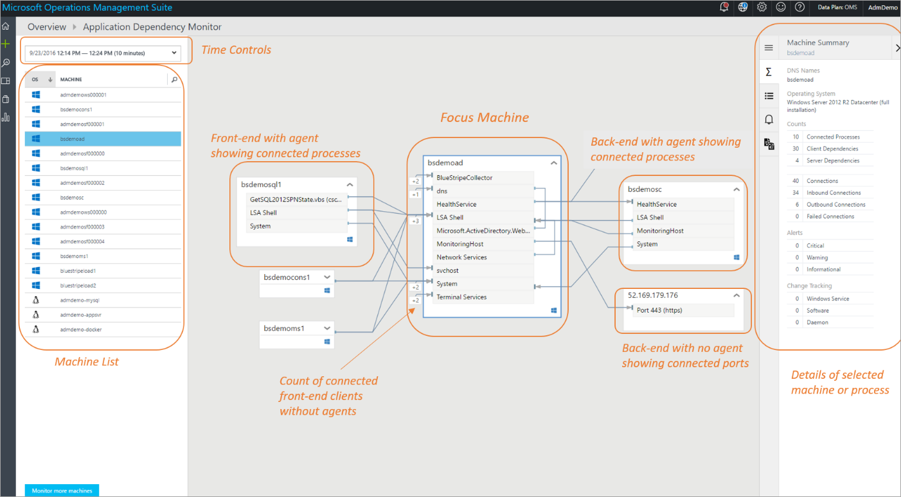

Klicken Sie in der Karte, um die laufenden Prozesse mit aktiven Netzwerk Verbindungen während des ausgewählten Zeitraums anzeigen können Maschinen erweitert werden.  Bei ein Remotecomputer mit einem ADM-Agent zum Verarbeiten von Details anzeigen erweitert ist, werden nur die Kommunikation mit dem Fokus Computer Prozesse angezeigt.  Die Anzahl der ohne Agents Front-End-Computern herstellen einer Verbindung in den Fokus Computer ist auf der linken Seite der Prozesse angegeben, die sie eine Verbindung herstellen.  Wenn Sie der Fokus Computer herstellen einer Verbindung mit einem Back-End-Computer ohne einen Agent, ist Back-End mit einem Knoten in der Karte, die seine IPv4-Adresse zeigt dargestellt ist, und der Knoten zum Anzeigen der einzelnen Ports und Dienste, denen mit der Fokus Computer kommuniziert erweitert werden kann.

Standardmäßig anzeigen ADM Karten die letzten 10 Minuten Abhängigkeitsinformationen an.  Verwenden die Zeitsteuerelemente in der oberen linken Ecke, können Karten zurückliegenden Zeiträume, bis abgefragt werden in einer Stunde Wide, um anzuzeigen, wie vergeblich Abhängigkeiten der Vergangenheit, z. B. während ein Vorfall oder vor einer Änderung.    ADM Daten 30 Tage lang in bezahlte Arbeitsbereichen und in kostenlosen Arbeitsbereiche, 7 Tage lang gespeichert.

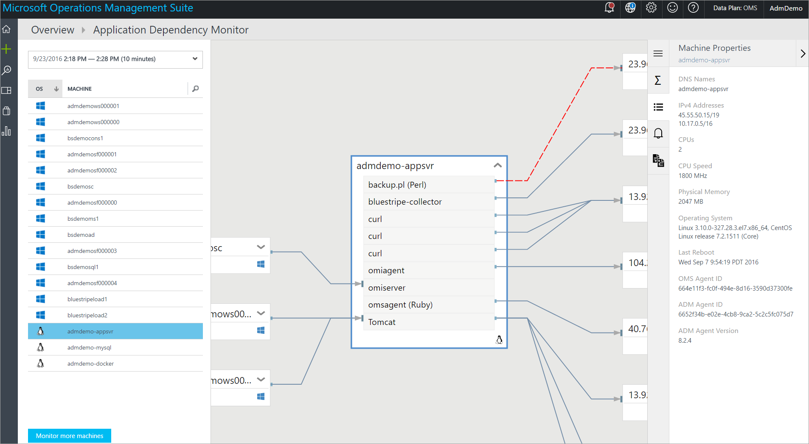

## Fehler beim Verbindungen
Fehler beim Verbindungen werden ADM-Karten für Prozesse und Computern, angezeigt, mit einer mit gestrichelte rote Linie, ob ein Client-System zum Erreichen eines Prozesses oder Port fehlschlägt.  Fehler beim Verbindungen werden von einem beliebigen System mit einem bereitgestellten ADM-Agent gemeldet, ist das System der eine fehlgeschlagene Verbindungsversuch.  ADM misst dies, indem Sie TCP-Sockets, die nicht zum Herstellen einer Verbindung zu beobachten.  Ursache könnte eine Firewall, eine falsche Konfiguration in einen Remotedienst nicht verfügbar ist, der Client oder Server hierfür sein. 

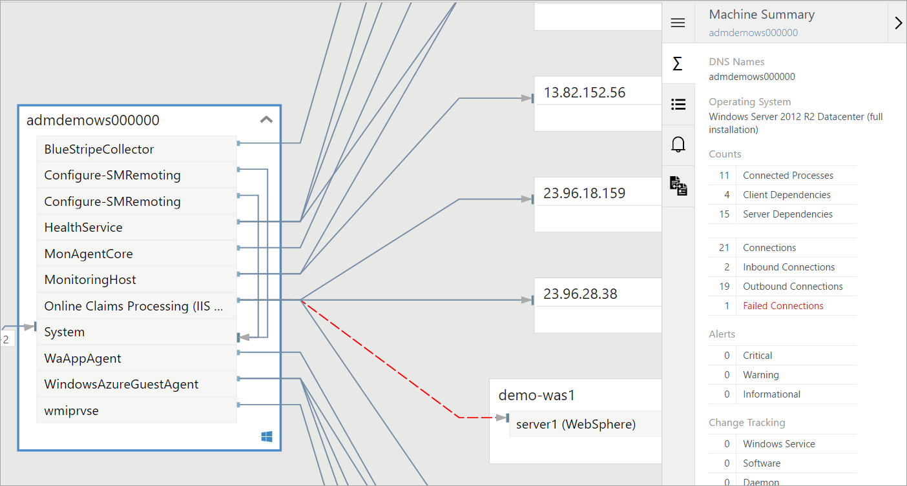

Fehler beim Verbindungen können Unterstützung bei der Problembehandlung "," Migration Überprüfung, Analyse der Sicherheit und insgesamt Architektur Grundlegendes zu verstehen.  Manchmal Fehler beim Verbindungen sind harmlos, aber sie häufig direkt an ein Problem aufgetreten, beispielsweise ein Failover-Umgebung ist plötzlich nicht erreichbar ist, zeigen... oder zwei Ebenen der Anwendung, nicht mehr nach der Migration Cloud sprechen.  Klicken Sie in das vorstehende Abbildung IIS und WebSphere beide ausgeführt werden, jedoch kann keine Verbindung herstellen. 

## Computer und Prozesseigenschaften
Beim Navigieren durch eine Zuordnung ADM können Sie Computern und Prozesse zu gewinnen zusätzlichen Kontext über ihre Eigenschaften auswählen.  Computer bereitzustellen, Informationen zu DNS-Name, IPv4-Adressen, CPU- und -Kapazität, virtueller Computer Typ, Version des Betriebssystems, Zeit letzten neu zu starten und die IDs von deren OMS und ADM-Agents.

Prozessdetails werden vom Betriebssystem-Metadaten zum Ausführen von Prozessen, einschließlich Prozessname, Beschreibung des Prozesses, Benutzername und Domäne (unter Windows), Firmenname, Produktname, Version des Produkts, geöffneten Verzeichnis, Befehlszeile und Startzeit Prozess erfasst.

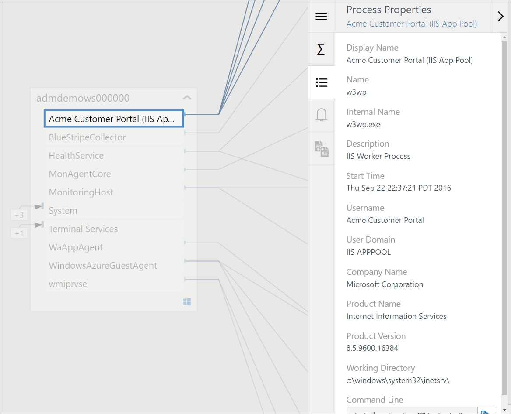

Klicken Sie im Bereich Prozess Zusammenfassung bietet zusätzliche Informationen zu seinen gebundenen Ports, eingehende und ausgehende Verbindungen, einschließlich des Prozesses-Konnektivität und Fehler bei Verbindungen. 

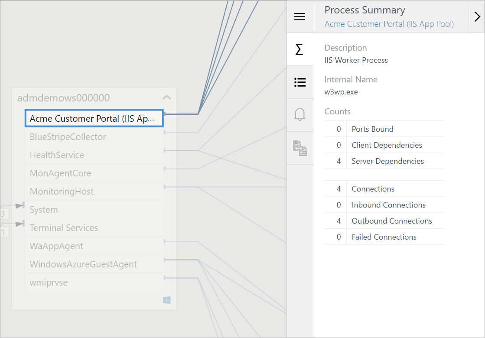

## Änderungsnachverfolgung OMS-Integration
Der ADM-Integration in das Änderungsprotokoll ist automatische, wenn beide Lösungen aktiviert und konfiguriert, in dem Arbeitsbereich OMS ist sind.

Die Zusammenfassung Maschinen gibt an, ob das Änderungsprotokoll Ereignisse auf dem ausgewählten Computer während des ausgewählten Zeitraums aufgetreten sind.

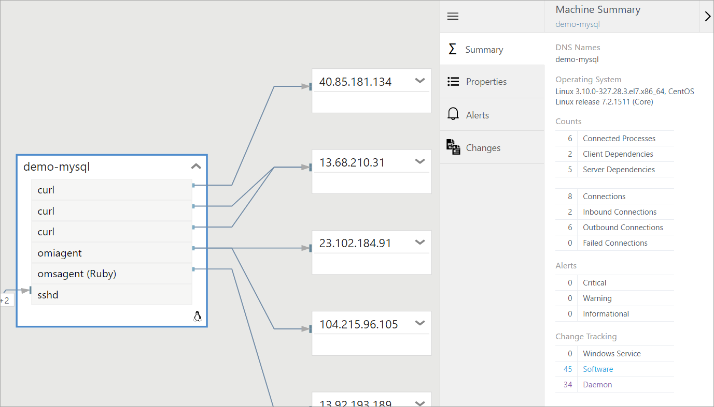

Die Änderung nachverfolgen Maschinen zeigt eine Liste der alle Änderungen, die mit dem letzten ersten, zusammen mit einem Link zum Drillup in Log-Suche für weitere Details an.
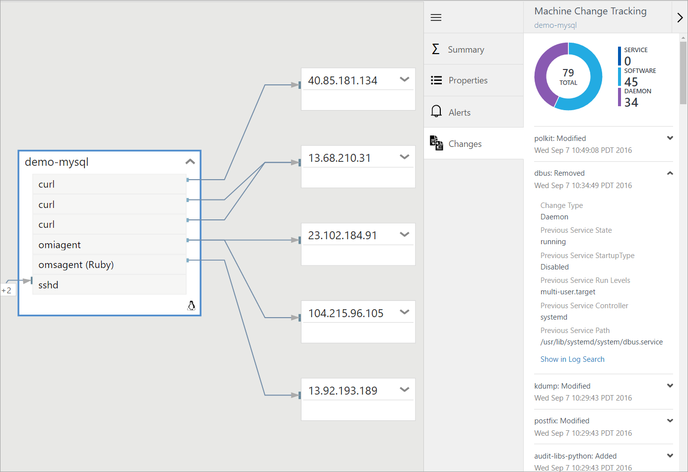

Im folgenden sehen einen Drilldown Ansicht des Ereignisses Konfiguration ändern nach der Auswahl **in Log Analytics anzeigen**.
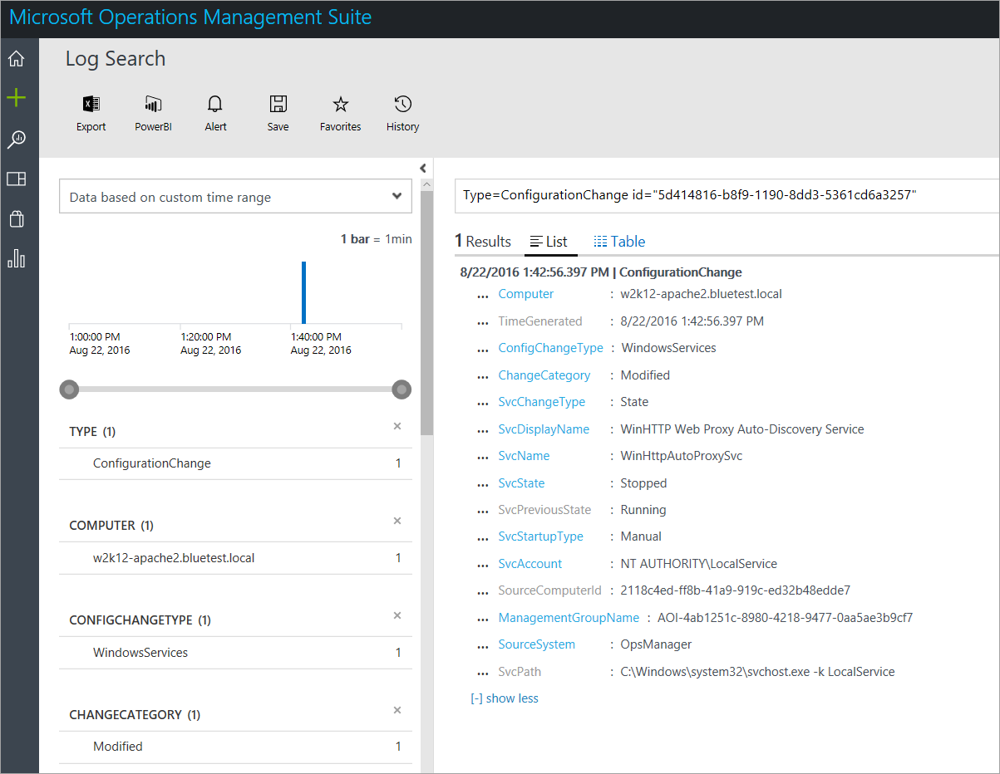

## Analytics Protokolldatensätze
ADM des Computers und Prozess Lagerbestandsdaten steht für die [Suche](../log-analytics/log-analytics-log-searches.md) in Log Analytics.  Dies kann auf Szenarien einschließlich Planung der Migration, Kapazitätsanalyse, Suche und ad-hoc-Leistung Problembehandlung angewendet werden. 

Ein Datensatz ist pro Stunde für jeden eindeutigen Computer und Prozesse neben der Datensätze generiert beim, Prozess oder Computer beginnt, oder auf-umgeben zu ADM ist  Diese Datensätze verfügen über die Eigenschaften in den folgenden Tabellen. 

Es gibt intern generierte Eigenschaften, die Sie zum Identifizieren von eindeutigen Prozesse und Computer verwenden können:

- PersistentKey_s eindeutig durch die Prozesskonfiguration definiert ist, z. B. Befehlszeile und Benutzer-ID an.  Es ist eindeutig für einen bestimmten Computer, aber Sie können auf Computern wiederholt werden.
- ProcessId_s und ComputerId_s sind im Modell ADM global eindeutig.

### AdmComputer_CL Datensätze
Datensätze mit einem Typ von **AdmComputer_CL** haben Lagerbestandsdaten für Server mit ADM-Agents.  Diese Datensätze verfügen über die Eigenschaften in der folgenden Tabelle.  

| Eigenschaft | Beschreibung |
|:--|:--|
| Typ | *AdmComputer_CL* |
| SourceSystem | *OpsManager* |
| ComputerName_s | Windows oder Linux Computernamen |
| CPUSpeed_d | CPU-Geschwindigkeit in MHz |
| DnsNames_s | Liste aller DNS-Namen für diesen computer |
| IPv4s_s | Liste aller IPv4-Adressen von diesem Computer verwendet |
| IPv6s_s | Liste aller IPv6-Adressen von diesem Computer verwendet.  (ADM IPv6-Adressen identifiziert aber erkennt IPv6 Abhängigkeiten nicht). |
| Is64Bit_b | WAHR oder falsch basierend auf OS |
| MachineId_s | Eine interne GUID, eindeutig für ein OMS-Arbeitsbereich  |
| OperatingSystemFamily_s | Windows oder Linux |
| OperatingSystemVersion_s | Lange OS Versionszeichenfolge |
| TimeGenerated | Datum und Uhrzeit, zu der der Eintrag erstellt wurde. |
| TotalCPUs_d | Anzahl der CPUs |
| TotalPhysicalMemory_d | Speicherkapazität in MB |
| VirtualMachine_b | WAHR oder falsch, je nachdem, ob OS Gast virtueller Computer ist |
| VirtualMachineID_g | Virtueller Hyper-V-Computer-ID |
| VirtualMachineName_g | Name des virtuellen Computers die Hyper-V |
| VirtualMachineType_s | Hyper-v, Vmware, Xen, Kvm, Ldom, Lpar, Virtualpc |

### AdmProcess_CL Typ Datensätze 
Datensätze mit einem Typ von **AdmProcess_CL** haben Lagerbestandsdaten für TCP verbundenen Prozesse auf Servern mit ADM-Agents an.  Diese Datensätze verfügen über die Eigenschaften in der folgenden Tabelle.

| Eigenschaft | Beschreibung |
|:--|:--|
| Typ | *AdmProcess_CL* |
| SourceSystem | *OpsManager* |
| CommandLine_s | Vollständige Befehlszeile des Prozesses |
| CompanyName_s | Firmenname (aus dem Windows PE oder Linux u/min) |
| Description_s | Beschreibung der langen Prozess (aus dem Windows PE oder Linux u/min) |
| FileVersion_s | Ausführbare Dateiversion (aus Windows PE, nur Windows) |
| FirstPid_d | OS Prozess-ID |
| InternalName_s | Ausführbare Datei internen Hyperlinknamen (aus Windows PE, nur Windows) |
| MachineId_s | Interner GUID eindeutig für ein OMS-Arbeitsbereich  |
| Name_s | Der Name des Prozesses ausführbare |
| Path_s | Ausführbare Datei des Datei-System Ordnerpfad |
| PersistentKey_s | In diesem Computer eindeutig internen GUID |
| PoolId_d | Interne ID zum Aggregieren von Prozessen basierend auf ähnliche Befehl Positionen. |
| ProcessId_s | Interner GUID eindeutig für ein OMS-Arbeitsbereich  |
| ProductName_s | Produkt-Zeichenfolge (aus dem Windows PE oder Linux u/min) |
| ProductVersion_s | Produkt Versionszeichenfolge (aus dem Windows PE oder Linux u/min) |
| StartTime_t | Startzeit auf dem lokalen Computeruhr Prozess |
| TimeGenerated | Datum und Uhrzeit, zu der der Eintrag erstellt wurde. |
| UserDomain_s | Domäne der Besitzer des Prozesses (nur Windows) |
| UserName_s | Namen der Besitzer des Prozesses (nur Windows) |
| WorkingDirectory_s | Prozess geöffneten Verzeichnis |

## Beispiel für Log Suchbegriffe

### Liste der physischen Speicherkapazität des alle verwalteten Computer an. 
Typ = AdmComputer_CL | Wählen Sie TotalPhysicalMemory_d, ComputerName_s | Dedup ComputerName_s

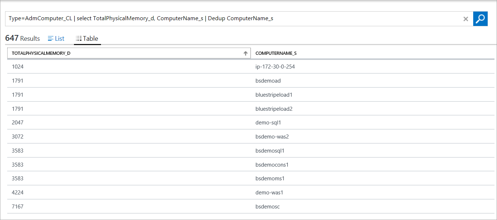

### Liste Computernamen, DNS, IP- und OS-Version.
Typ = AdmComputer_CL | Wählen Sie ComputerName_s, OperatingSystemVersion_s, DnsNames_s, IPv4s_s | Dedup ComputerName_s

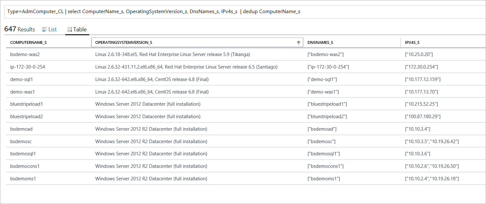

### Suchen Sie aller Prozesse mit "Sql" in der Befehlszeile
Typ = AdmProcess_CL CommandLine_s = \*Sql\* | Dedup ProcessId_s

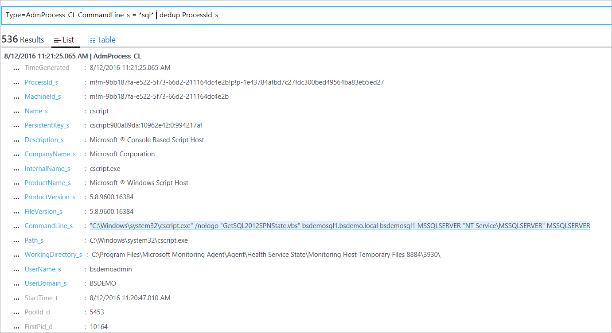

### Nach dem Ereignisdaten anzeigen, für die angegebenen verarbeiten Sie, deren Computer-ID den Namen des Computers ab
Typ = AdmComputer_CL "M!m-9bb187fa-e522-5f73-66d2-211164dc4e2b" | DISTINCT ComputerName_s

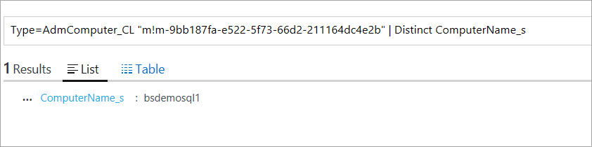

### Liste aller SQL-Computern
Typ = AdmComputer_CL MachineId_s IN {Typ = AdmProcess_CL \*Sql\* | DISTINCT MachineId_s} | DISTINCT ComputerName_s

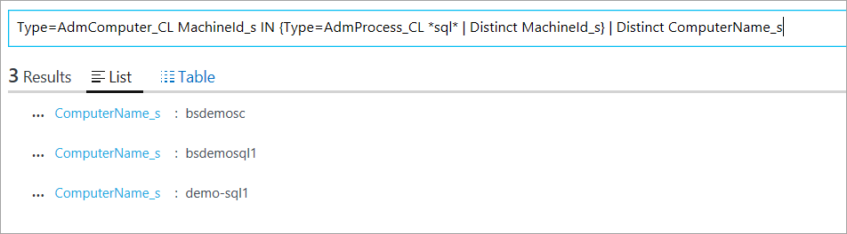

### Liste aller eindeutigen Produktversionen von Curl in meinem Datencenter
Typ = AdmProcess_CL Name_s = Curl | DISTINCT ProductVersion_s

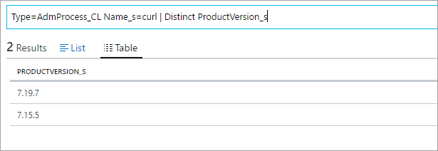

### Erstellen einer Gruppe Computer von allen Computern unter CentOS

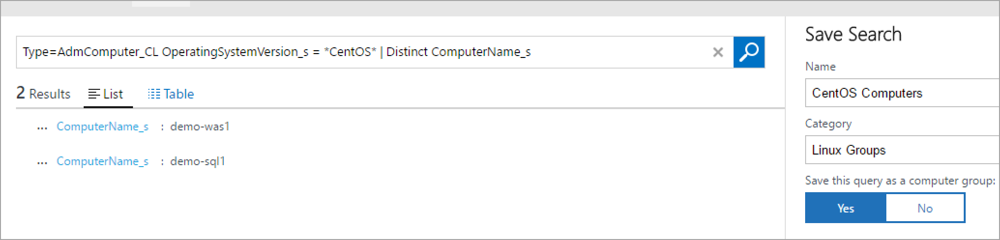

## Diagnose- und die Verwendung von Daten
Microsoft sammelt automatisch Verwendung und Leistung von Daten über Ihre Verwendung des Diensts Application Abhängigkeit Monitor aus. Microsoft verwendet diese Daten zur Verfügung und verbessert die Qualität, Sicherheit und die Integrität des Diensts Anwendung Abhängigkeit überwachen. Daten enthält Informationen zur Konfiguration Ihrer Software wie Betriebssystem und Version sowie IP-Adresse, DNS-Namen und Arbeitsstationen Namen um genau und effiziente zur Problembehandlung Funktionen bereitstellen. Es weder Namen, Adressen oder andere Kontaktinformationen erfasst.

Weitere Informationen zu den Datensammlung und Verwendung finden Sie unter den [Datenschutzbestimmungen für Microsoft Online Services](hhttps://go.microsoft.com/fwlink/?LinkId=512132).

## Nächste Schritte
- Weitere Informationen zum [Melden der Suchbegriffe](../log-analytics/log-analytics-log-searches.md] in Log Analytics to retrieve data collected by Application Dependency Monitor.)
