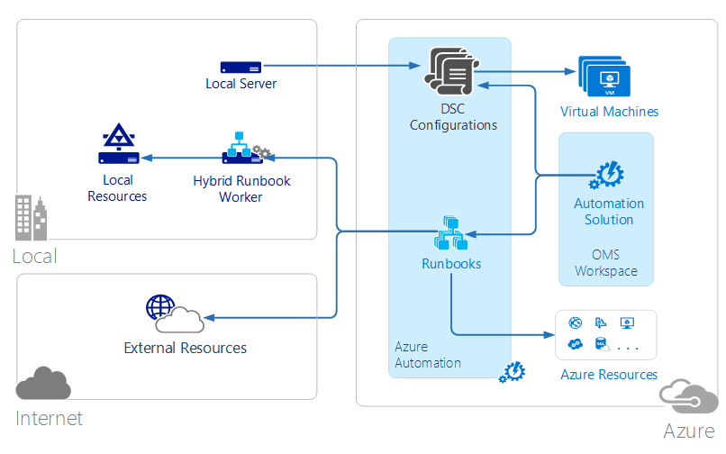
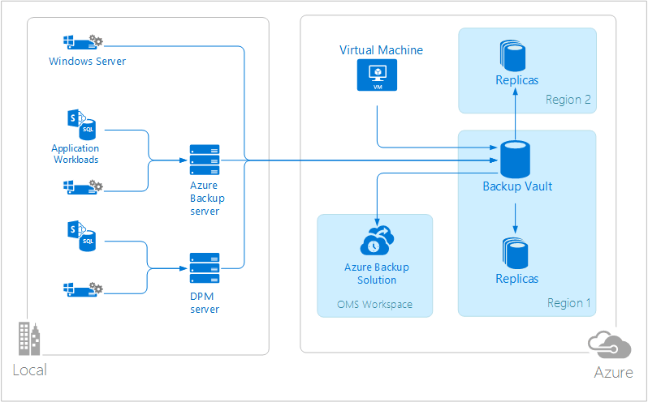
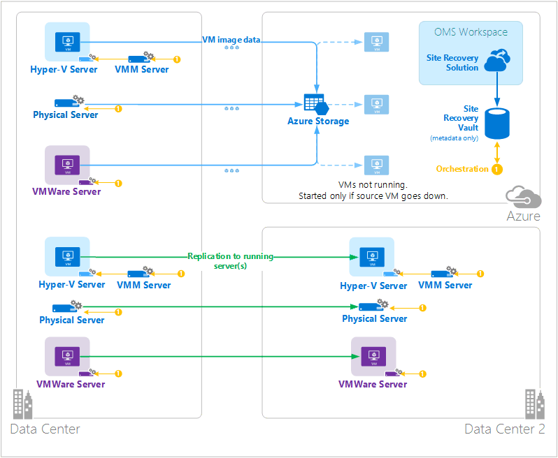

<properties 
   pageTitle="Vorgänge Management Suite (OMS) Architektur | Microsoft Azure"
   description="Microsoft Operations Management Suite (OMS) ist die Microsoft Cloud-basierte IT Management Lösung, die Sie verwalten und Schützen von Ihrem lokalen & cloud-Infrastruktur.  In diesem Artikel die verschiedenen Dienste, die im Lieferumfang von OMS bezeichnet und enthält Links zu ihren detaillierte Inhalt."
   services="operations-management-suite"
   documentationCenter=""
   authors="bwren"
   manager="jwhit"
   editor="tysonn" />
<tags 
   ms.service="operations-management-suite"
   ms.devlang="na"
   ms.topic="get-started-article"
   ms.tgt_pltfrm="na"
   ms.workload="infrastructure-services"
   ms.date="10/27/2016"
   ms.author="bwren" />

# OMS-Architektur

[Vorgänge Management Suite (OMS)](https://azure.microsoft.com/documentation/services/operations-management-suite/) ist eine Sammlung von Cloud-basierte Services für die Verwaltung von Ihrem lokalen und cloud-Umgebungen.  In diesem Artikel werden die unterschiedlichen lokalen und Cloud-Komponenten OMS und deren hoher Ebene Cloud computing-Architektur.  Sie können in der Dokumentation für jeden Dienst Weitere Details verweisen.

## Log Analytics

Alle von [Log Analytics](https://azure.microsoft.com/documentation/services/log-analytics/) gesammelte Daten werden im Repository OMS die in Azure gehostet wird gespeichert.  Verbundene Datenquellen generieren in das Repository OMS gesammelte Daten.  Es gibt aktuell drei Arten von verbundenen Datenquellen unterstützt.

- Auf einem Computer mit [Windows](../log-analytics/log-analytics-windows-agents.md) oder [Linux](../log-analytics/log-analytics-linux-agents.md) installiert Agent direkt mit OMS verbunden ist.
- Ein System Center Operations Manager (SCOM) Management Gruppe [mit Log Analytics verbunden ist](../log-analytics/log-analytics-om-agents.md) .  SCOM Agents weiterhin zur Kommunikation mit Management-Servern die Ereignisse und Leistungsdaten an Log Analytics weiterleitet.
- Ein [Azure-Speicher-Konto](../log-analytics/log-analytics-azure-storage.md) , das [Diagnose Azure](../cloud-services/cloud-services-dotnet-diagnostics.md) -Daten aus einer Worker-Rolle, Webrolle oder virtuellen Computern in Azure erfasst.

Datenquellen definieren, die von Log Analytics von verbundenen Datenquellen, einschließlich Ereignisprotokollen und Leistungsindikatoren gesammelten Daten.  Lösungen zusätzliche Funktionen für OMS und können einfach zu dem Arbeitsbereich aus dem [Lösungskatalog OMS](../log-analytics/log-analytics-add-solutions.md)hinzugefügt werden.  Einige Lösungen möglicherweise müssen eine direkte Verbindung Log Analytics von SCOM Agents während andere erfordert einen zusätzlichen Agent installiert sein.

Log Analytics verfügt über eine Web-basierte Portal, die Sie verwenden können, um OMS Ressourcen verwalten, hinzufügen und Konfigurieren von OMS-Lösungen und anzeigen und Analysieren von Daten im Repository OMS.

## Azure Automatisierung

[Azure Automatisierung Runbooks](http://azure.microsoft.com/documentation/services/automation) werden in der Cloud Azure ausgeführt und Zugriff auf Ressourcen, die in Azure, in anderen Cloud Services oder über das Internet öffentlich zugänglich sind.  Sie können auch den lokalen Computer festlegen, in Ihrem lokalen Datencenter mit [Hybrid Runbooks Worker](../automation/automation-hybrid-runbook-worker.md) , sodass Runbooks lokale Ressourcen zugreifen können.

[DSC Konfigurationen](../automation/automation-dsc-overview.md) Azure Automatisierung gehörende Kehrmatrix können direkt auf Azure-virtuellen Computern angewendet werden.  Andere physischen und virtuellen Computern können Konfigurationen vom Server Abruf Azure Automatisierung DSC anfordern.

Azure Automatisierung verfügt über eine OMS-Lösung, die Statistiken und Links zu starten das Azure-Portal für alle Vorgänge angezeigt werden.

## Azure Sicherung

Geschützte Daten in [Azure Sicherung](http://azure.microsoft.com/documentation/services/backup) werden in einem Sicherung Tresor befindet sich in einer bestimmten geografischen Region gespeichert.  Die Daten werden innerhalb derselben Region repliziert und je nach Art der Tresor, möglicherweise auch repliziert werden in eine andere Region weiteren Redundanzgründen.

Azure Sicherung enthält drei grundlegende Szenarios an.

- Windows-Computer mit Azure Sicherung Agent.  Dies können Sie Dateien und Ordner von jedem Windows-Server oder Client direkt an Ihre Azure Sicherung Tresor.  
- System Center Data Protection Manager (DPM) oder zusätzliche Microsoft Azure-Server. So können Sie DPM oder zusätzliche Microsoft Azure-Server zum Sichern von Dateien und Ordnern sowie Auslastung wie SQL und SharePoint in den lokalen Speicher, und klicken Sie dann auf Ihrem Azure Sicherung Tresor Replikation nutzen.
- Azure-virtuellen Computern Erweiterungen.  So können Sie Azure-virtuellen Computern zu Ihrem Azure Sicherung Tresor sichern.

Azure Sicherung verfügt über eine OMS-Lösung, die Statistiken und Links zu starten das Azure-Portal für alle Vorgänge angezeigt werden.

## Wiederherstellung Azure-Website

[Azure Website Wiederherstellung](http://azure.microsoft.com/documentation/services/site-recovery) koordiniert Replikation, Failover und Failback von virtuellen Computern und physische Server. Von Replikationsdaten zwischen Hyper-V-Hosts, VMware Hypervisoren und in Rechenzentren von primären und sekundären physischen Servern oder zwischen Datacenter und Azure-Speicher ausgetauscht.  Website Wiederherstellung speichert Metadaten in Depots befindet sich in einer bestimmten geografischen Azure Region. Keine replizierten Daten vom Dienst Wiederherstellung Website gespeichert.

Drei grundlegende Replikation Szenarios verfügt Azure Website Wiederherstellung

**Die Replikation von Hyper-V-virtuellen Computern**
- Wenn Hyper-V virtuelle Computer in VMM Wolken verwaltet werden, können Sie einem sekundären Data Center oder Azure-Speicher repliziert.  Die Replikation in Azure ist über eine sichere Verbindung zum Internet.  Die Replikation in einem sekundären Datencenter ist über das LAN.
- Wenn Sie Hyper-V-virtuellen Computern von VMM verwaltet nicht zur Verfügung, können Sie auf Azure-Speicher repliziert.  Die Replikation in Azure ist über eine sichere Verbindung zum Internet.
 
**Replikation von VMWare virtuellen Computern**
- VMware virtuellen Computern können in einem sekundären Datencenter VMware ausgeführt oder zum Azure-Speicher repliziert werden.  Die Replikation auf Azure kann über eine Website-zu-Standort VPN oder Azure ExpressRoute oder über eine sichere Verbindung zum Internet auftreten. Replikation in einem sekundären Datencenter erfolgt über den InMage Scout Daten erstellen.
 
**Replikation wenige Windows und Linux-Server** 
- Physische Server können in einem sekundären Datencenter oder zum Azure-Speicher repliziert werden. Die Replikation auf Azure kann über eine Website-zu-Standort VPN oder Azure ExpressRoute oder über eine sichere Verbindung zum Internet auftreten. Replikation in einem sekundären Datencenter erfolgt über den InMage Scout Daten erstellen.  Azure Website Wiederherstellung hat eine OMS-Lösung, die einige Statistiken angezeigt werden, aber Sie Azure-Portal für alle Vorgänge verwenden müssen.

## Nächste Schritte

- Informationen Sie zu [Log Analytics](http://azure.microsoft.com/documentation/services/log-analytics).
- Informationen Sie zu [Azure Automatisierung](https://azure.microsoft.com/documentation/services/automation).
- Informationen Sie zu [Azure sichern](http://azure.microsoft.com/documentation/services/backup).
- Informationen Sie zu [Wiederherstellung Azure-Website](http://azure.microsoft.com/documentation/services/site-recovery).
