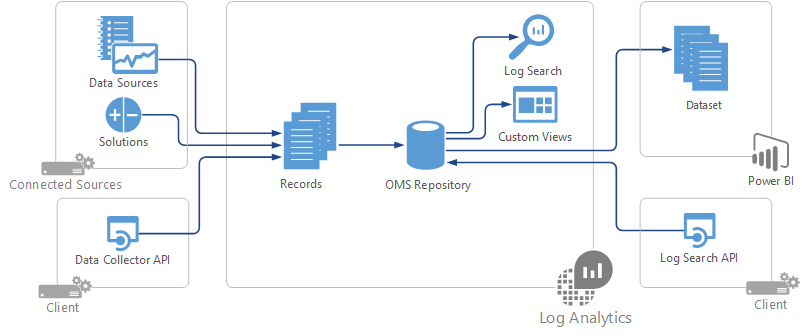
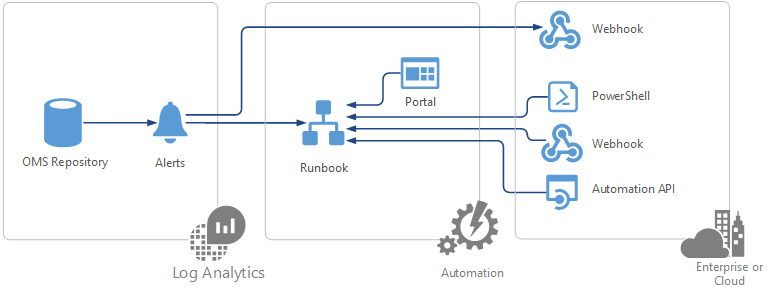

<properties
   pageTitle="Integration mit Vorgänge Management Suite (OMS) | Microsoft Azure"
   description="Zusätzlich zur Verwendung der Standardfeatures des OMS, können Sie sie in andere Programme für die Verwaltung integrieren und Bereitstellen eine Management-hybridumgebung, benutzerdefinierte Management-Szenarien in Ihrer Umgebung eindeutig angeben oder Bereitstellen eine benutzerdefinierte Management Services für Ihre Kunden auftreten.  Dieser Artikel enthält eine Übersicht über die verschiedenen Optionen für die Integration mit OMS und Links zu Artikeln, die ausführliche technische Informationen bereitstellen."
   services="operations-management-suite"
   documentationCenter=""
   authors="bwren"
   manager="jwhit"
   editor="tysonn" />
<tags
   ms.service="operations-management-suite"
   ms.devlang="na"
   ms.topic="article"
   ms.tgt_pltfrm="na"
   ms.workload="infrastructure-services"
   ms.date="09/23/2016"
   ms.author="bwren" />

# Integration mit Vorgänge Management Suite (OMS)

Vorgänge Management Suite ist Microsoft Cloud-basierte IT Management Lösung, die Sie verwalten und Schützen von Ihrem lokalen & cloud-Infrastruktur.  Zusätzlich zur Verwendung der Standardfeatures des OMS, können Sie sie in andere Programme für die Verwaltung integrieren und Bereitstellen eine Management-hybridumgebung, benutzerdefinierte Management-Szenarien in Ihrer Umgebung eindeutig angeben oder Bereitstellen eine benutzerdefinierte Management Services für Ihre Kunden auftreten.  Dieser Artikel enthält eine Übersicht über die anderen Optionen für die Integration mit OMS Services und Links zu Artikeln, die ausführliche technische Informationen bereitstellen. 

## Log Analytics
Von gesammelte Verwaltungsdaten werden Log Analytics werden in einem Repository gespeichert, die in Azure gehostet wird.  Alle Daten im Repository gespeichert steht in Log Suchbegriffe die schnellanalyse über extrem große Datenmengen zur Verfügung zu stellen.  Ihren Anforderungen Integration möglicherweise gefüllt Repository mit neuen Daten für die Analyse verfügbar machen oder zum Extrahieren von Daten in das Repository eine neue Visualisierung bereitstellen oder mit einem anderen Verwaltungstool integriert werden soll.

Als Datensatz wird jedes Datenelement im Repository gespeichert.  Wenn Sie das Repository auffüllen, sollten Sie Benutzer mit den Datensatztyp, den Ihre Lösung verwendet und eine Beschreibung der Eigenschaften bereitstellen.  Beim Abrufen von Daten, benötigen Sie diese Informationen über die Daten, die, denen Sie beim Arbeiten mit.

### Füllen Sie das Protokoll Analytics repository
Es gibt mehrere Methoden zum Auffüllen von OMS Repository aus.  Die Methode, die Sie verwenden, hängt von Faktoren wie z. B., wo sich die Quelldaten befindet, das Format der Daten, und die Clients unterstützt werden müssen.  Es spielt keine Rolle, die wie gesammelten, nachdem die Daten im Repository gespeichert ist.

Den folgenden Abschnitten werden die verschiedenen Optionen zum Füllen des OMS Repositorys.

#### Verbundenen Datenquellen und Datenquellen 
Verbundene Datenquellen werden die Speicherorte, in dem Daten für das Repository OMS abgerufen werden können.  Datenquellen und Lösungen Datenquellen verbunden ausgeführt und definieren die speziellen Daten, die erfasst werden.  Wenn die Anwendung Daten auf einen der folgenden Datenquellen schreibt, können dann Sie es sammeln, indem der Datenquelle konfigurieren.  Beispielsweise wenn die Anwendung Syslog-Ereignis erstellt, können dann diese von der Datenquelle Syslog auf einem Linux-Agent erfasst werden.

- [Log Analytics Datenquellen](../log-analytics/log-analytics-data-sources.md)

#### Lösungen

Die Funktionen von OMS Lösungen zu erweitern.  Eine Lösung möglicherweise Sammeln von Daten aus der verbundenen Quelle oder es möglicherweise Analyse ausführen, auf die Datensätze, die bereits im Repository erfasst.  Jede Lösung, die von Microsoft bereitgestellt hat einen einzelnen Artikel, der die Details auf der Registerkarte Daten enthält, die sie sammelt.

- [Lösungen in Log Analytics](../log-analytics/log-analytics-add-solutions.md)

#### HTTP-Datensammlung API

Log Analytics HTTP Data Collection-API ist ein REST-API, die Sie JSON-Daten in das Protokoll Analytics Repository hinzufügen können.  Sie können diese API nutzen, wenn Sie eine Anwendung haben, die Daten über eine der anderen Datenquellen oder Lösungen zur Verfügung steht.  Sie können das Repository von einem beliebigen Client gefüllt wird, die die-API aufrufen können, und basiert nicht auf den Terminplan Sammlung von Datenquelle oder Lösung verwendet werden.

- [Melden Sie sich Analytics HTTP-Datensammlung API](../log-analytics/log-analytics-data-collector-api.md)

### Abrufen von Daten aus dem Log Analytics repository

Es gibt mehrere Methoden zum Abrufen von Daten aus dem OMS Repository aus.  Möglicherweise möchten, dass Benutzer zum Abrufen von Daten mithilfe der Verwaltungskonsole OMS und stellen sie mit verschiedenen Arten von Visualisierungen und Analyse zur Verfügung.  Sie können auch die Daten aus einem externen Prozess wie ein anderes Management-Lösung abrufen.

#### Log Suchbegriffe

Alle Daten im OMS Repository gespeichert ist über Log Suchvorgänge verfügbar.  Benutzer möglicherweise eigene ad-hoc-Analyse ausführen, in der Verwaltungskonsole OMS oder erstellen Sie ein Dashboard mit einer Visualisierung für ein bestimmtes Protokoll suchen.  Lösungen können benutzerdefinierte Ansichten mit Visualisierungen auf Grundlage der vordefinierten Suche enthalten.  Sie können die Log suchen-API mit Access-Daten in das Repository OMS aus einer externen Anwendung oder Management-Tools verwenden.  

- [Log durchsucht Log Analytics](../log-analytics/log-analytics-log-searches.md)
- [Log Analytics Log Suche REST-API](../log-analytics/log-analytics-log-search-api.md)
- [Melden Sie sich Analytics-cmdlets](https://msdn.microsoft.com/library/mt188224.aspx)

#### Benutzerdefinierte Ansichten 
Die Ansicht-Designer können Sie benutzerdefinierte Ansichten erstellen, in der OMS-Verwaltungskonsole, die Benutzer mit der Visualisierung und Analyse der Daten in Ihrer Lösung bereitstellen.  Jede Ansicht enthält eine Kachel, die angezeigt wird, klicken Sie auf der Hauptseite von der Konsole und eine beliebige Anzahl von Visualisierung Webparts, die auf Log Suchbegriffe basieren, die Sie definieren.
  
- [Log Analytics Ansicht-Designer](../log-analytics/log-analytics-view-designer.md)

#### Power BI

Log Analytics können automatisch Exportieren von Daten aus dem OMS Repository in Power BI, sodass Sie deren Bandbreite von Darstellungen und Analysetools nutzen können.  Es führt diese exportieren nach einem Zeitplan, damit die Daten auf dem aktuellen Stand ist. 

- [Exportieren von Log Analytics-Daten in Power BI](../log-analytics/log-analytics-powerbi.md)

## Automatisierung

OMS können Prozesse auf gesammelten Daten reagieren oder andere Verwaltungsfunktionen ausführen zu automatisieren.  Es möglicherweise Sammeln von Daten aus der Anwendung, und fügen Sie es in das Repository OMS, oder Sie können die Korrektur des ein bekanntes Problem in Antwort auf Daten im Repository gefunden automatisieren. 

### Runbooks

Runbooks in Azure Automatisierung PowerShell-Skripts und Workflows in der Cloud Azure ausführen.  Sie können zum Verwalten von Ressourcen in Azure oder eine beliebige andere Ressourcen, die aus der Cloud zugegriffen werden können.  Runbooks kann auch in einem lokalen Datencenter mit Hybrid Runbooks Worker ausgeführt werden.  Sie können eine Runbooks vom Azure-Portal oder aus externen Prozessen, die mit einer Reihe von Methoden, z. B. PowerShell oder der Automation API starten.

- [Starten Sie eine Runbooks in Azure Automatisierung](../automation/automation-starting-a-runbook.md)
- [Azure Automatisierung cmdlets](https://msdn.microsoft.com/library/dn690262.aspx)
- [Automatisierung REST-API](https://msdn.microsoft.com/library/mt662285.aspx)
- [Automatisierung .NET](https://msdn.microsoft.com//library/mt465763.aspx)

### Benachrichtigungen

Warnungsregeln werden automatisch Log sucht nach einem Zeitplan ausgeführt.  Wenn die Ergebnisse bestimmte Kriterien entsprechen kann die resultierende Benachrichtigung Starten einer Runbooks in Azure Automatisierung oder rufen Sie eine Webhook, die in einem externen Prozess begonnen werden kann.  Beide dieser Antworten können Details der Warnung, einschließlich der Log-Suche zurückgegebenen Daten enthalten.

- [Warnungen im Log Analytics](../log-analytics/log-analytics-alerts.md)
- [Benachrichtigen Log Analytics-API](../log-analytics/log-analytics-api-alerts.md)

## Sicherung und Wiederherstellung der Website

Bieten Sie Dienstleistungen für Ihre Unternehmensdaten Schutz und Sicherstellung der Verfügbarkeit von Servern und Anwendungen, Azure Sicherung und Wiederherstellung-Website.  Sie können diese Dienste zum Ausführen von Szenarien wie zusätzliche Dienste für eine Anwendung bereitstellen oder Initiierung eines Failovers eines virtuellen Computers nutzen.

- [Cmdlets für die Sicherung Azure](https://msdn.microsoft.com/library/mt619253.aspx)
- [Azure Website Wiederherstellung REST-API](https://msdn.microsoft.com/library/azure/mt750497.aspx)
- [Azure Website Wiederherstellung Cmdlets](https://msdn.microsoft.com/library/mt637930.aspx)

## Benutzerdefinierten Lösungen

Sie können in einer benutzerdefinierten Lösung, in dem Arbeitsbereich oder im Arbeitsbereich des Kunden ausführen Integrationslogik schließen.  Ihre Lösung kann eines der Integration Verfahren in diesem Artikel sowie weitere Ressourcen, die ein vollständiges Management Szenario einbeziehen.  Derart, dass die Lösung entfernt wird, alle Ressourcen, die sie erstellt haben, aus dem Arbeitsbereich OMS und Azure-Abonnement entfernt werden, werden die Ressourcen in die Lösung verpackt.

Beispielsweise könnten Ihre Lösung eine Automatisierung Runbooks zum Sammeln und Verarbeiten von Daten aus, und füllen Sie dann das Protokoll Analytics Repository mithilfe der HTTP-Daten Collection-API enthalten.  Sie können auch eine benutzerdefinierte Ansicht enthalten, die präsentiert und analysiert die gesammelten Daten.  

- Erstellen von benutzerdefinierten Lösungen (in Kürze verfügbar)    

## Nächste Schritte
- Verwiesen Sie die [OMS SDK](operations-management-suite-sdk.md) technische Informationen zum Automatisieren von OMS Services werden.  
