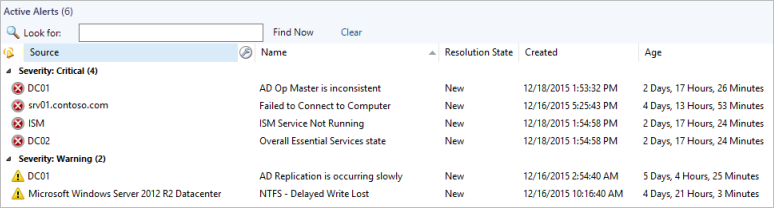
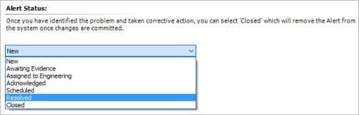
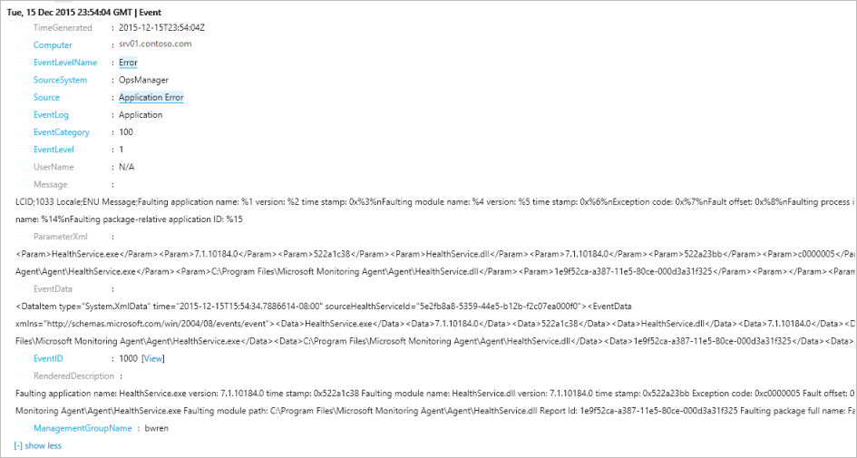
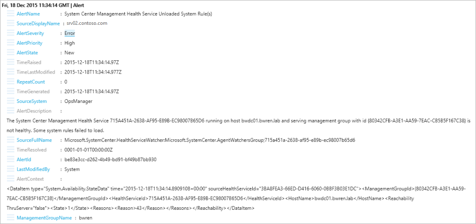
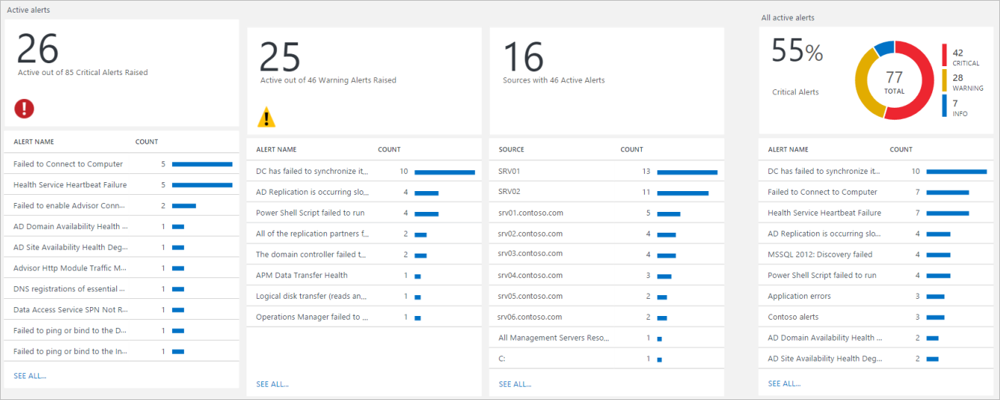
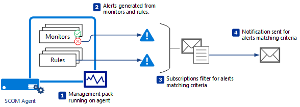
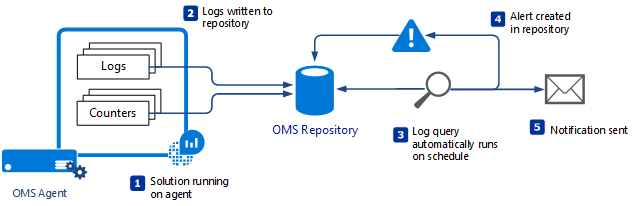

<properties 
   pageTitle="Benachrichtigen Management in Microsoft-Produkten für die Überwachung | Microsoft Azure"
   description="Eine Warnung gibt an, einige Problem, das Aufmerksamkeit des Administrators erfordert.  In diesem Artikel werden die Unterschiede wie Benachrichtigungen erstellt und verwaltet in System Center Operations Manager (SCOM) und Log Analytics und sind die optimalen Methoden bei der Nutzung von zwei Produkte für eine Strategie der Hybrid alert-Management." 
   services="operations-management-suite"
   documentationCenter=""
   authors="bwren"
   manager="jwhit"
   editor="tysonn" />
<tags 
   ms.service="operations-management-suite"
   ms.devlang="na"
   ms.topic="article"
   ms.tgt_pltfrm="na"
   ms.workload="infrastructure-services"
   ms.date="09/06/2016"
   ms.author="bwren" />

# Verwalten von Benachrichtigungen mit Microsoft Überwachung 

Eine Warnung gibt an, einige Problem, das Aufmerksamkeit des Administrators erfordert.  Es gibt deutliche Unterschiede zwischen System Center Operations Manager (SCOM) und Analytics Log in Vorgänge Management Suite (OMS) im Hinblick auf wie Benachrichtigungen erstellt werden, wie sie verwaltete und analysiert werden und wie Sie benachrichtigt werden, dass ein kritisches Problem erkannt wurde.

## Warnungen im Operations Manager
Warnungen im SCOM werden von einzelne Regeln oder Monitore an, dass ein bestimmtes Problem generiert.  Ein Monitor kann eine Warnung generieren, wenn sie einen Fehlerstatus eingibt, während eine Regel möglicherweise generieren eine Benachrichtigung, um einige kritisches Problem anzugeben, das nicht direkt mit den Dienststatus eines verwalteten Objekts verknüpft ist.  Management Packs beinhalten eine Vielzahl von Workflows, die erstellen Benachrichtigungen für die Anwendung oder den Dienst, die sie verwalten.  Teil der Verfahren zum Konfigurieren eines neuen Management Packs ist optimieren, um sicherzustellen, dass Sie keine übermäßige Benachrichtigungen Probleme erhalten, die Sie nicht als kritische berücksichtigen.

SCOM bietet vollständige alert Management mit Benachrichtigungen Probleme einen Status, der von Administratoren geändert werden kann, wie sie funktionieren, um das Problem zu beheben.  Wenn das Problem behoben wurde, legt der Administrator die Benachrichtigung nach geschlossen welche gleichzeitig es nicht mehr angezeigt wird in Ansichten aktive Benachrichtigungen anzeigen.  Benachrichtigungen, die von Monitoren generiert werden können automatisch gelöst werden, wenn der Monitor zu einem ordnungsgemäßen Zustand zurück.

## Warnungen im Log Analytics
Eine Benachrichtigung in Log Analytics wird aus einer Abfrage Protokolldateien erstellt, die automatisch in regelmäßigen Abständen ausgeführt wird.  Sie können eine Regel aus einem beliebigen Log-Abfrage erstellen.  Wenn die Abfrage Ergebnisse, die den Kriterien entsprechen, die Sie angeben zurückgibt, wird eine Benachrichtigung erstellt.  Dies können einer bestimmten Abfrage, die eine Benachrichtigung erstellt wird, wenn ein bestimmtes Ereignis erkannt wird, oder Sie können eine weitere allgemeine Abfrage, die für alle Ereignisses Fehler im Zusammenhang mit einer bestimmten Anwendung aussieht.

Log Analytics Benachrichtigungen zum OMS Repository als Ereignis geschrieben werden und mit einer Log Abfrage abgerufen werden können.  Einen Status wie SCOM Ereignisse verfügen, damit Sie angeben können, wenn das Problem behoben wurde.

Wenn SCOM Log Analytics als Datenquelle verwendet wird, sind Benachrichtigungen SCOM OMS Repository geschrieben wie erstellt und geändert.  

Die [Benachrichtigung Management-Lösung](http://technet.microsoft.com/library/mt484092.aspx) bietet eine Zusammenfassung der aktiven Benachrichtigungen und mehrere allgemeine Abfragen zum Abrufen von anderen Kriteriengruppen Benachrichtigungen.  Dies bietet Ihnen die Benachrichtigungen als einen Bericht in SCOM effektiver Analysen.  Sie können ein Drilldown in die Übersichten mit Detaildaten und ad-hoc-Abfragen zum Abrufen von unterschiedliche Optionssätze Benachrichtigungen erstellen.

## Benachrichtigungen
In SCOM Benachrichtigungen senden einer e-Mail-Nachrichten oder Text als Antwort auf Benachrichtigungen, die bestimmte Kriterien entsprechen.  Sie können verschiedene Benachrichtigungsabonnements, die von anderen Personen benachrichtigt werden, je nach solche Kriterien als das Objekt überwacht wird, die Schwere der Warnung, die Art des Problems, die erkannt oder die Uhrzeit erstellen.

Einige Abonnements können verwendet werden, eine Strategie abgeschlossen Benachrichtigung für eine große Anzahl von Management Packs implementiert.

Log Analytics können über e-Mail benachrichtigt, dass eine Benachrichtigung erstellt wurde, indem Sie eine e-Mail-Benachrichtigungsaktion für jede [Regel](http://technet.microsoft.com/library/mt614775.aspx)festlegen.  Es hat die Möglichkeit, von SCOM abonnieren eine große Anzahl Benachrichtigungen für eine einzelne Regel keinen.  Sie müssen auch eigene Warnungsregeln erstellen, da keine OMS eine vorkonfiguriert bereitstellt.

Sie können nicht SCOM Warnungen im Log Analytics vollständig durch verwalten, da Sie nur in der Operations ändern können.  Log Analytics eignet sich als Teil einer Benachrichtigung Management verarbeiten durch für bereitstellen Analysetools dieser alleine SCOM aufweist.

## Benachrichtigen Behebung
[Behebung](http://technet.microsoft.com/library/mt614775.aspx) bezieht sich auf Versuch, das Problem durch eine Benachrichtigung identifiziert automatisch korrigiert.
  
SCOM können Sie als Antwort auf einen Monitor eingeben eines fehlerhaften Zustands Diagnose und Wiederherstellung ausführen.  In diesem Fall Gleichzeitiges an den Monitor, erstellen die Benachrichtigung.  Diagnose und Wiederherstellung werden in der Regel als Skript implementiert, die auf dem Agent ausgeführt wird.  Eine Diagnose versucht, um weitere Informationen zu dem Problem erkannt während eine Wiederherstellung zur Behebung des Problems versucht zu erfassen.

Log Analytics ermöglicht das Starten einer [Azure Automatisierung Runbooks](https://azure.microsoft.com/documentation/services/automation/) oder eine Webhook als Antwort auf eine Warnung Log Analytics anrufen.  Runbooks können komplexe Logik in PowerShell implementiert enthalten.  Das Skript in Azure ausgeführt wird und Azure Ressourcen oder externer Ressourcen verfügbar aus der Cloud zugreifen kann.  Azure Automatisierung hat die Möglichkeit, Runbooks auf einem Server in Ihrer lokalen Datencenter auszuführen, aber dieses Feature ist nicht beim Starten des Runbooks Reaktion auf Log Analytics Benachrichtigungen derzeit verfügbar.

Können sowohl Wiederherstellung in SCOM Runbooks in OMS PowerShell-Skripts enthalten, aber Wiederherstellung sind schwieriger zu erstellen und verwalten, da sie in einem Management Pack enthalten sein müssen.  Runbooks werden in Azure Automatisierung gespeichert, die Features für die Erstellung, testen und Verwalten von Runbooks bereitstellt.

Wenn Sie SCOM für Protokoll Analytics als Datenquelle verwenden, motivieren Sie eine Protokoll Analytics Benachrichtigung mithilfe einer Log-Abfrage zum Abrufen von SCOM Benachrichtigungen im OMS Repository gespeichert.  Diese würde eine Azure Automatisierung Runbooks als Antwort auf eine Warnung SCOM ausgeführt werden.  Natürlich, da des Runbooks in Azure ausgeführt werden können, würde dies keine geeignete Strategie für die Wiederherstellung der lokalen Probleme sein.

## Nächste Schritte

- Hier erfahren Sie die Details der [Benachrichtigungen in System Center Operations Manager (SCOM)](https://technet.microsoft.com/library/hh212913.aspx).