<properties 
   pageTitle="Vergleich von Produkten für die Überwachung Microsoft | Microsoft Azure"
   description="Microsoft Operations Management Suite (OMS) ist Microsoft Cloud IT-Lösung basierend auf, das Sie verwalten und Schützen von Ihrem lokalen & cloud-Infrastruktur unterstützt.  In diesem Artikel die verschiedenen Dienste, die im Lieferumfang von OMS bezeichnet und enthält Links zu ihren detaillierte Inhalt."
   services="operations-management-suite"
   documentationCenter=""
   authors="bwren"
   manager="jwhit"
   editor="tysonn" />
<tags 
   ms.service="operations-management-suite"
   ms.devlang="na"
   ms.topic="article"
   ms.tgt_pltfrm="na"
   ms.workload="infrastructure-services"
   ms.date="10/27/2016"
   ms.author="bwren" />

# Vergleich der Überwachung Product Microsoft

Dieser Artikel enthält einen Vergleich zwischen System Center Operations Manager (SCOM) und Log Analytics in Vorgänge Management Suite (OMS) im Hinblick auf ihre Architektur, die Logik der wie diese Ressourcen überwachen und wie sie die Daten analysieren, die sie sammeln.  Dies ist Ihnen die Grundlagen von deren Unterschiede und Stärken mitzuteilen.  

## Grundlegende Architektur
### System Center Operations Manager

Alle SCOM Komponenten werden in Ihrem Data Center installiert.  [Agents installiert werden](http://technet.microsoft.com/library/hh551142.aspx) , auf dem Computer für Windows und Linux, die von SCOM verwaltet werden.  Agents Verbinden mit [Server für die Verwaltung](https://technet.microsoft.com/library/hh301922.aspx) der Kommunikation mit dem SCOM Datenbank und Data Warehouse.  Agents basieren auf Domänenauthentifizierung zu Management-Servern herstellen.  Andere außerhalb einer vertrauenswürdigen Domäne können verbinden mit einem [Gateway-Server](https://technet.microsoft.com/library/hh212823.aspx)oder Zertifikatauthentifizierung durchführen.

SCOM erfordert zwei SQL-Datenbanken, eine für die Betrieb Daten und einem anderen Datawarehouse zur Unterstützung von reporting und Datenanalyse.  Einen [Berichtsserver](https://technet.microsoft.com/library/hh298611.aspx) ausgeführt wird, SQL Reporting Services Daten aus dem Datawarehouse Berichten. 

SCOM kann mithilfe von Management Packs für Produkte wie [Azure](https://www.microsoft.com/download/details.aspx?id=38414), [Office 365](https://www.microsoft.com/download/details.aspx?id=43708)und [AWS](http://docs.aws.amazon.com/AWSEC2/latest/WindowsGuide/AWSManagementPack.html)Cloudressourcen überwachen.  Diese Management Packs Formular mit einem oder mehreren lokalen Agents als Proxys für die Ermittlung von Cloudressourcen und laufenden Workflows messen die Leistung und Verfügbarkeit.  Proxy-Agents werden auch [Monitor Netzwerkgeräte](https://technet.microsoft.com/library/hh212935.aspx) und andere externen Ressourcen verwendet werden.

Die Vorgänge-Konsole ist eine Windows-Anwendung, eine Verbindung mit einem der Management Server kann der Administrator zum Anzeigen und Analysieren der gesammelten Daten und die SCOM-Umgebung konfigurieren.  Eine Web-basierte Konsole auf IIS-Servern gehostet werden und Datenanalyse über einen Browser bietet.

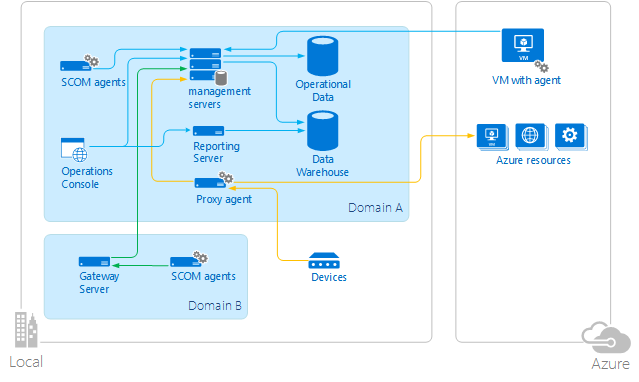

### Log Analytics

Die meisten OMS-Komponenten sind in der Cloud Azure, damit Sie bereitstellen und sich mit minimalen Kosten und Verwaltungsaufwand verwalten können.  Alle von Log Analytics gesammelte Daten werden im OMS Repository gespeichert.

Log Analytics können das Sammeln von Daten aus einem der drei Quellen:

- Physischen und virtuellen Computern unter Windows und der [Microsoft Überwachung Agent (MMA)](https://technet.microsoft.com/library/mt484108.aspx) oder Linux und der [Vorgänge Management Suite Agent für Linux](https://technet.microsoft.com/library/mt622052.aspx).  Diesen Computern können es sich um lokale oder virtuellen Computern in Azure oder einer anderen Cloud.
- Ein Azure-Speicher Konto mit [Azure-Diagnose](../cloud-services/cloud-services-dotnet-diagnostics.md) Daten von Azure Worker-Rolle, Webrolle oder virtuellen Computern erfasst.
- [Verbindung mit einer Management Group unter SCOM](https://technet.microsoft.com/library/mt484104.aspx).  In dieser Konfiguration kommunizieren Sie die Agents mit SCOM Management-Servern die Daten in der Datenbank SCOM vorführen, wird es dann OMS Datenspeicher gesendet.
Administratoren gesammelte Daten analysieren und Konfigurieren von Log Analytics mit dem OMS-Portal an, die in Azure gehostet wird und einen beliebigen Browser zugegriffen werden kann.  Mobile apps Zugriff auf diese Daten sind für den standard-Plattformen verfügbar.

### Integration von SCOM und Log Analytics

Wenn SCOM für Protokoll Analytics als Datenquelle verwendet wird, können Sie die Funktionen beider Produkte in einer Umgebung für die Überwachung Hybrid nutzen.  Sie können vorhandene SCOM-Agents über die Vorgänge Verwaltungskonsole von OMS, verwaltet werden sollen, sowie Management Packs von SCOM ausführen zu konfigurieren.  
Daten aus einem verbundenen Management Group unter SCOM ist an Log Analytics übermittelt, mithilfe einer der folgenden Methoden:

- Ereignisse und Leistungsdaten werden vom Agent gesammelte und an SCOM übermittelt.  Die Daten werden von Management Server in SCOM dann für Protokoll Analytics bereitstellen.
- Einige Ereignisse wie z. B. IIS-Protokolle und Sicherheit weiterhin direkt an Log Analytics des Agents übermittelt werden.
- Einige Lösungen werden zusätzlichen Software an den Agent vorführen oder erfordern, dass die Software installiert werden, um weitere Daten zu sammeln.  Diese Daten werden in der Regel direkt an Log Analytics gesendet werden.
- Einige Lösungen sammeln Daten direkt von SCOM Management-Servern, die nicht von der Agent stammt.  Beispielsweise sammelt die [Alert Management-Lösung](https://technet.microsoft.com/library/mt484092.aspx) Benachrichtigungen von SCOM, nachdem er erstellt wurden.

## Überwachung Logik
SCOM und Log Analytics arbeiten mit ähnlichen von Agents gesammelten Daten jedoch grundsätzliche Unterschiede in ihrer definieren und Implementieren der Logik zum Sammeln von Daten und wie sie die Daten analysieren, die sie sammeln müssen.

### Operations Manager
Überwachung Logik für SCOM ist in implementiert [Management Packs](https://technet.microsoft.com/library/hh457558.aspx) die Logik für Komponenten zu überwachen, entdecken enthalten messen die Integrität dieser Komponenten und zum Sammeln von Daten zu analysieren.  Überwachen von Daten könnte so einfach wie das Sammeln ein Ereignis oder Leistung Zähler, oder es konnte komplexe Logik implementiert in einem Skript verwenden.  Management Packs, die vollständige Überwachung enthalten sind für eine Vielzahl von [Microsoft und Drittanbieter-Anwendungen](http://go.microsoft.com/fwlink/?LinkId=82105) sowie Hardware und Netzwerk-Geräte verfügbar.  Sie können für benutzerdefinierte Applikationen [Verfassen Sie Ihre eigenen Management Packs](http://aka.ms/mpauthor) .

Management Packs enthalten mehrere Workflows, dass jede einige Überwachung distinct-Funktion wie einen Performance-Zähler Stichproben, überprüfen den Status eines Diensts oder Ausführen eines Skripts ausführt.  Jeden Workflow ausgeführt wird, unabhängig voneinander und definiert eigene Ergebnisse wie die, denen Datenbank zu schreiben wird und ob eine Warnung ausgelöst wird. 

Sie können die Details des Workflows, z. B. die Häufigkeit, die sie ausführen, die den oberen Schwellenwert der Stelle, an der sie einen Fehler erachten, und die Schwere der Warnung ihnen generierten überschreiben.  Sie können auch zusätzliche Funktionen bereitstellen, indem Sie Ihre eigenen Workflows hinzufügen.

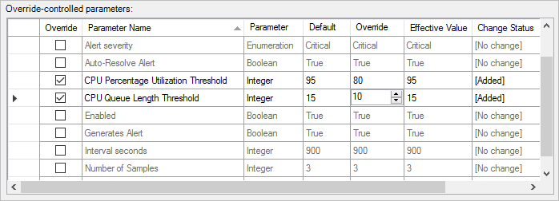

Management Packs werden in der Datenbank Operations Manager installiert und automatisch von Management-Servern zu Agents verteilt.  Jeder Agent wird automatisch herunterladen von Management Packs und Laden von Workflows für die Programme, die sie installiert haben.  Vom Agent gesammelte Daten werden an den Server Management bei Bedarf in das SCOM Datenbank und Data Warehouse übermittelt.  Die Vorgänge Konsole können Sie zum Anzeigen und analysieren diese Daten über benutzerdefinierte Ansichten, Dashboards und Berichte im Management Pack enthalten.

Die Verteilung der Management Packs ist in der folgenden Abbildung dargestellt.

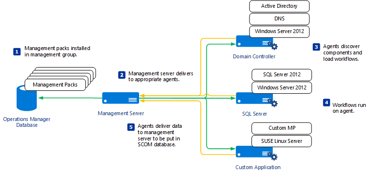

### Log Analytics
#### Ereignis und Leistung Websitesammlung
Log Analytics sammelt Ereignisse und Leistungsindikatoren von Agent Systemen Quellen wie Windows-Ereignisprotokolls, IIS-Protokolle und Syslog zu verwenden.  Sie können Kriterien für die Daten über das Protokoll Analytics-Portal zusammengestellten und erstellen Sie dann auf Log Abfragen zum Analysieren der gesammelten Daten definieren.  Wenn Sie Ihre OMS-Arbeitsbereich erstellen, und Sie können weitere Daten für bestimmte Applikationen definieren, wird eine Reihe von standard Kriterien definiert. 

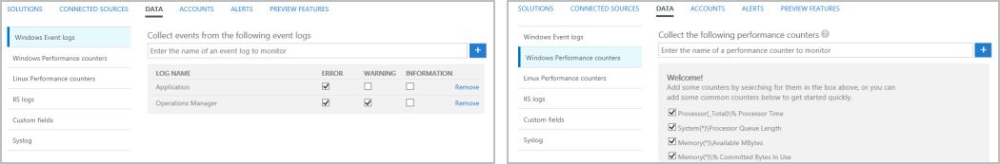

Während SCOM viele detaillierte Workflows vorhanden, die in der Regel definieren bestimmte Kriterien für die Daten und die Aktion, die Antwort durchgeführt werden soll sind, weist Log Analytics Weitere allgemeine Kriterien zum Sammeln von Daten aus.  Log-Abfragen und Lösungen bieten weitere zielgerichtete Kriterien für die Analyse und gilt für bestimmte Daten in der Cloud, nachdem es gesammelt wurden.

#### Lösungen
Lösungen bereitstellen zusätzliche Logik für Datensammlung und Analyse.  Sie können die Lösungen für Ihr Abonnement OMS aus den Lösungskatalog hinzufügen auswählen.

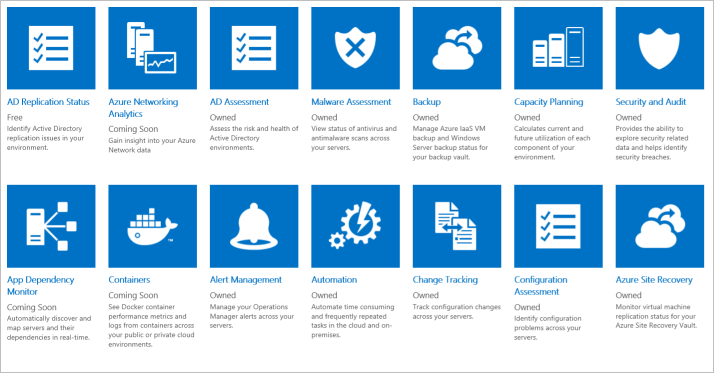

Lösungen ausführen hauptsächlich in der Cloud bereitstellen Analyse von Ereignissen und Leistungsindikatoren im Repository OMS erfasst.  Sie möglicherweise auch zusätzliche Daten für die Erfassung definieren, die mit Log Abfragen oder von zusätzlichen Benutzeroberfläche, die von der Lösung im Dashboard OMS bereitgestellten analysiert werden können. 

Angenommen, die [Lösung Änderungsprotokoll muss](https://technet.microsoft.com/library/mt484099.aspx) erkennt Konfiguration Änderungen auf Agent Systemen und schreibt, dass Ereignisse im OMS Repository, die mit mehreren grafisch Sichten analysiert werden können, in denen zusammengefasst Änderungen erkannt.  Sie können aus der zusammengefasste Ansicht in Abfragen protokollieren Drilldown, die die von der Lösung erfassten Daten werden detaillierten angezeigt.

Während Sie die Lösungen markieren können Sie Ihr Abonnement hinzu, haben Sie derzeit keine die Möglichkeit zum Erstellen Ihrer eigenen Lösungen.  Sie können die Ereignisse und Leistungsindikatoren zu sammeln und erstellen Sie benutzerdefinierte Ansichten basierend auf Ihrer eigenen Abfragen protokollieren auswählen.

Im folgenden Diagramm wird die Überwachung Logik für das Protokoll Analytics zusammengefasst.

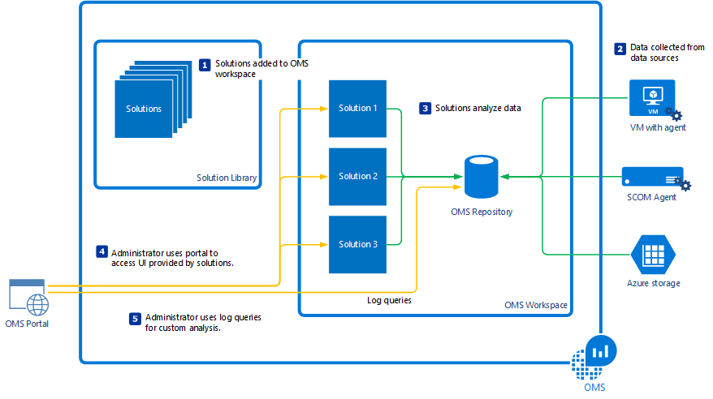

## Überwachen des Systemzustands
### Operations Manager
SCOM kann modellieren die verschiedenen Komponenten einer Anwendung und Bereitstellen einer in Echtzeit Gesundheit für jede.  Dadurch können Sie nicht nur Fehler erkannt anzeigen und Leistung über einen Zeitraum, sondern auch auf den tatsächlichen Zustand der Anwendung oder im externen System und jeder Komponente zu einem beliebigen Zeitpunkt zu überprüfen.  Da es sich um die Zeiträume, die eine Anwendung zur Verfügung versteht, unterstützt die Dienststatus-Engine in SCOM auch Service Level Agreements SERVICELEVEL analysieren und Erstellen von Berichten die Verfügbarkeit der Anwendung über einen Zeitraum aus.

Die Ansicht unten zeigt beispielsweise den in Echtzeit Integritätsstatus SQL-Datenbank-Module von SCOM überwacht wird.  Die Integrität des beider Datenbanken für eine Datenbank Modulen wird der unteren Hälfte der Ansicht angezeigt.

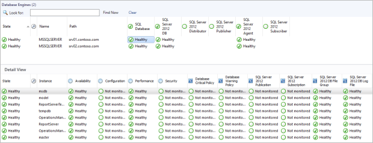

Health Explorer für eine Datenbank Modulen wird unten mit den Monitoren angezeigt, die verwendet werden, um den allgemeinen Zustand zu bestimmen.  Diese Monitore in SQL Management Pack definiert sind, und führen Sie für alle SQL-Datenbank-Module von SCOM erkannt.

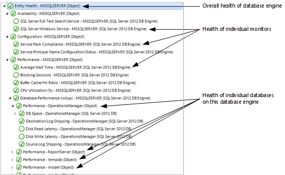

Komponenten auf mehreren Systemen können kombiniert werden, um die Integrität einer verteilten Anwendung messen.  Dies kann für branchenanwendungen besonders hilfreich sein, die mehrere verteilte Komponenten enthalten.  Sie können erstellen ein Modell, das die Integrität der einzelnen Komponenten, ob das Rollup in Verfügbarkeit für die Anwendung.

Active Directory ist ein Beispiel für ein Management Pack, die ein Modell zum Analysieren ihrer verteilten Komponenten bereitgestellt.  Im folgenden Beispieldiagramm zeigt die Integrität des gesamten Umgebung und die Beziehung zwischen, Domänen, und Domänencontroller.  Jede dieser Komponenten berücksichtigt Unterkomponenten und mehrere Monitore ähnlich wie die oben genannten Beispiel SQL.

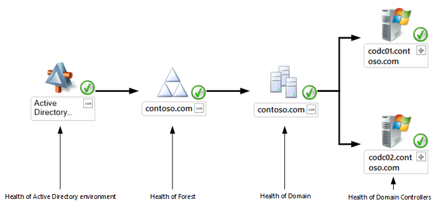

### Log Analytics
OMS gehört zum Modell Applikationen eine allgemeine-Engine oder deren in Echtzeit Gesundheit messen nicht.  Einzelne-Lösungen enthalten möglicherweise den allgemeinen Zustand des jeweiligen Dienste basierend auf gesammelten Daten bewerten, und sie können benutzerdefinierten Logik auf dem Agent in Echtzeit kompliziertere installieren.  Da Lösungen in der Cloud mit Zugriff auf das Repository OMS ausgeführt werden, können sie häufig tieferen Analyse als in der Regel durch Management Packs Restwert bieten. 

Angenommen, die [AD-Bewertung und SQL-Bewertung Lösungen](https://technet.microsoft.com/library/mt484102.aspx) gesammelte Daten analysieren und bieten eine Bewertung für verschiedene Aspekte der Umgebung.  Er enthält Empfehlungen für Verbesserungen, die zur Verbesserung der Verfügbarkeit und Leistung der Umgebung bereitgestellt werden können.

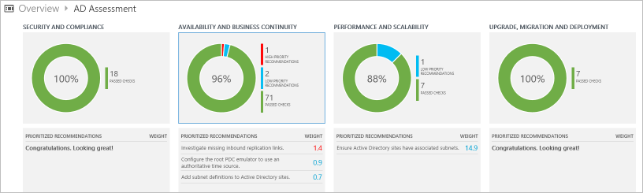

## Analyse-Funktionen
SCOM und Log Analytics bieten abweichenden Features zum gesammelte Daten zu analysieren.  SCOM weist Ansichten und Dashboards in der Operations für die Analyse die zuletzt verwendete Daten in einer Vielzahl von Formaten und Berichte zum Präsentieren von Daten aus dem Datawarehouse in tabellarischer Form.  Log Analytics bietet ein vollständiges Protokoll Abfragesprache und die Benutzeroberfläche zum Analysieren von Daten im Repository OMS an.  Wenn SCOM Log Analytics als Datenquelle verwendet wird, enthält das Repository von gesammelte Daten werden SCOM, damit die Log Analytics-Tools zum Analysieren von Daten aus beiden Systemen verwendet werden können.

### Operations Manager

#### Ansichten
Ansichten in der Operations können Sie verschiedene Datentypen von SCOM zusammengestellten in unterschiedlichen Formaten, in der Regel tabellarischen für Ereignisse, Hinweise und Bundesstaat Daten anzeigen und Liniendiagramme für Performance-Daten.  Ansichten führen minimale Analyse oder eine Konsolidierung der Daten jedoch lassen Sie nach bestimmten Kriterien filtern. 

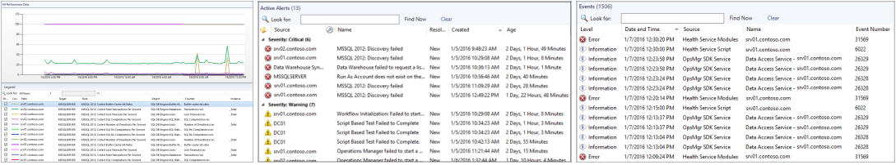

Management Packs werden in der Regel mehrere Ansichten unterstützen die Anwendung oder Systems, das sie überwacht bereitstellen.  Dies kann Zustand Ansichten für die einzelnen Objekte, die das Management Pack erkennt, benachrichtigen Ansichten für erkannte Probleme und von Leistungsansichten für Indikatoren einschließen.

Ansichten eignen sich besonders für den aktuellen Status der Umgebung einschließlich öffnen Benachrichtigungen und des Integritätsstatus überwachten Systeme und Objekte zu analysieren.  Sie können einen detaillierten Ereignis oder Performance-Daten, die einer bestimmten unterstützen, damit deren Ursachen diagnostizieren Drilldown. Auf ähnliche Weise können Sie die Leistung und der Zustand der verschiedenen Komponenten einer Anwendung, deren aktuellen Status bewerten anzeigen.

#### Dashboards
Dashboards in der Operations arbeiten hauptsächlich mit den gleichen Daten wie Ansichten aber weitere anpassbare sind und umfangreichere Visualisierungen enthalten.  Eine Reihe von standard-Dashboards stehen für eigene Zwecke einfach anpassen können.  Sie können auch ein PowerShell-Widget verwenden, die aus einer PowerShell-Abfrage zurückgegebene Daten anzeigen können.

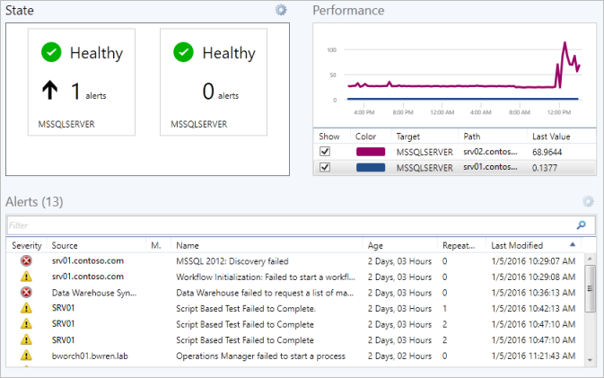

Entwickler haben die Möglichkeit zum Hinzufügen von benutzerdefinierter Komponenten zu Dashboards, die sie in ihren Management Packs umfassen.  Dies möglicherweise auf eine bestimmte Anwendung wie dem Dashboard im unten gezeigten SQL Management Pack hochgradig spezielle werden.  Mit diesem Dashboard kann auch als Vorlage für benutzerdefinierte Versionen verwendet werden.

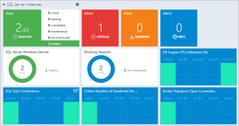

#### Berichte
Berichte in SCOM Analysieren von Daten aus dem Datawarehouse in tabellarischer Form.  Diese werden gedruckt und für die automatische Übermittlung in verschiedenen Dateiformaten PDF, CSV und Word einschließlich geplant.  Berichte mit Daten aus dem Datawarehouse ausgeführt werden, damit sie für die Analyse von Trends langfristig besonders geeignet sind.

Management Packs werden in der Regel benutzerdefinierte Berichte für eine bestimmte Anwendung bereitstellen.  Sie können auch aus einer Bibliothek mit generische Berichte auswählen, die Sie für Ihre eigenen Applikationen oder zur Durchführung von ad-hoc-Analyse anpassen können.

Im folgenden sehen Leistung Beispielbericht von Active Directory Management Packs gesammelte Daten angezeigt.

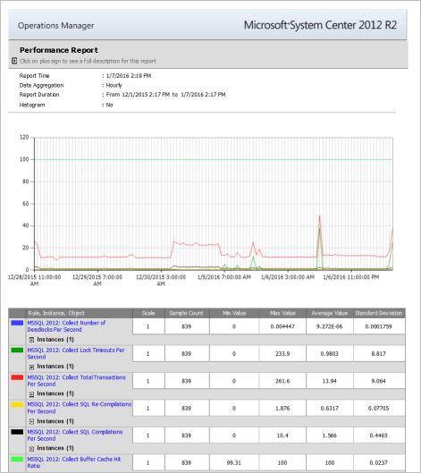

### Log Analytics
Log Analytics weist eine [Abfragesprache](https://technet.microsoft.com/library/mt484120.aspx) , die Sie kompliziertere über Daten aus mehreren Applikationen ohne erforderlich, erstellen eine benutzerdefinierte Ansicht oder eines Berichts verwenden können.  Da in der Cloud OMS implementiert ist, wird Leistungsfähigkeit von Abfragen und Datenanalyse unterliegen Einschränkungen Hardware nicht und können schnell zu analysieren Abfragen, einschließlich Millionen von Datensätzen. 

Abfragen in Log Analytics sind auch die Grundlage für andere Funktionen.  Sie können eine Abfrage speichern, deren Ergebnisse nach Excel exportieren, oder automatisch in regelmäßigen Abständen ausführen und eine Warnung generieren, wenn die Ergebnisse bestimmte Kriterien entsprechen.  

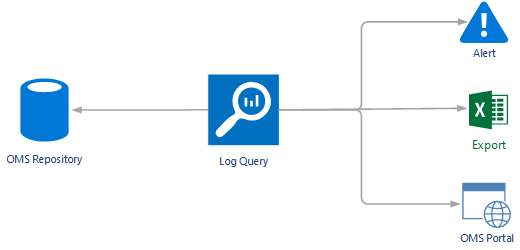

Es folgt ein Beispiel für eine Abfrage Log Analytics.  In diesem Beispiel alle Ereignisse mit den Namen "Schritte" zurückgegeben werden, und gruppiert nach Ereignis-ID an.  Der Benutzer gibt einfach die Abfrage, und Log Analytics dynamisch generiert die Benutzeroberfläche zum Ausführen der Analysis.  Alle Elemente in der Liste auswählen, gibt die detaillierten Daten zurück.

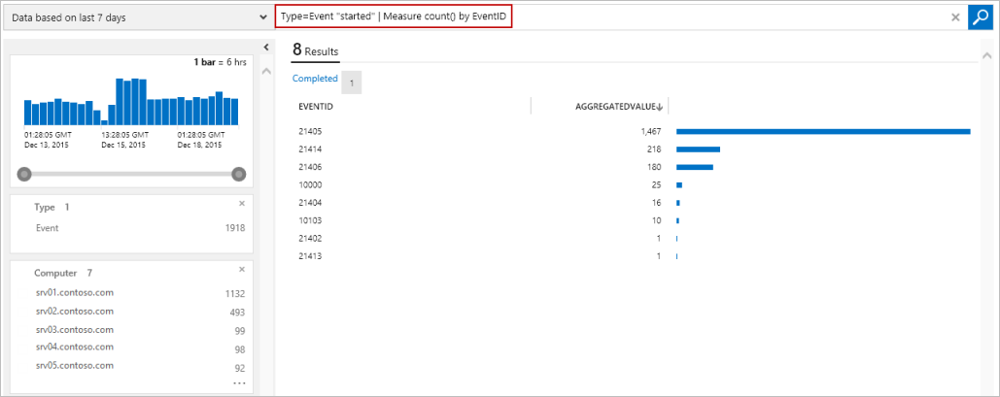

Zusätzlich zur Bereitstellung von ad-hoc-Analyse, können Abfragen in Log Analytics für eine zukünftige Verwendung gespeichert und auch zu Ihrem [OMS Dashboard](http://technet.microsoft.com/library/mt484090.aspx) hinzugefügt, wie im folgenden Beispiel gezeigt.

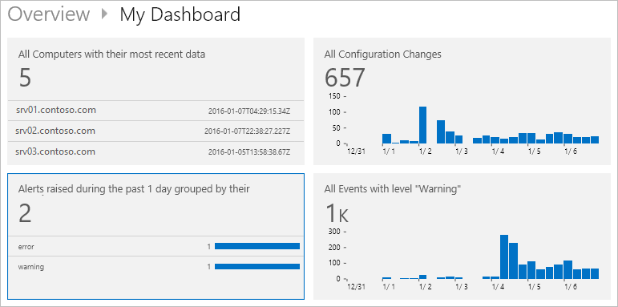

## Nächste Schritte

- Bereitstellen von [System Center Operations Manager (SCOM)](https://technet.microsoft.com/library/hh205987.aspx).
- Registrieren Sie sich für [Protokoll Analytics](https://azure.microsoft.com/documentation/services/log-analytics)an.  
