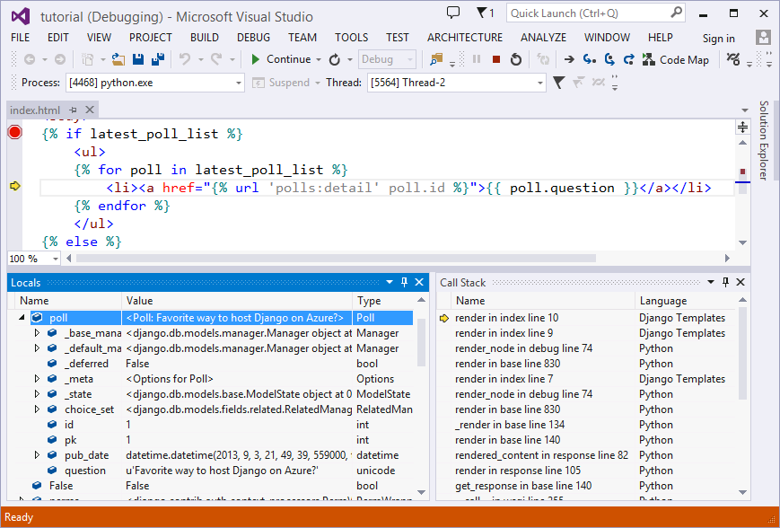

<properties
    pageTitle="Installieren Sie Python und das SDK - Azure"
    description="Informationen Sie zum Installieren von Python und das SDK zur Verwendung mit Azure."
    services=""
    documentationCenter="python"
    authors="lmazuel"
    manager="wpickett"
    editor=""/>

<tags
    ms.service="multiple"
    ms.workload="na"
    ms.tgt_pltfrm="na"
    ms.devlang="python"
    ms.topic="article"
    ms.date="09/06/2016"
    ms.author="lmazuel"/>

# <a name="installing-python-and-the-sdk"></a>Installieren von Python und das SDK

Python leicht mit Windows Setup und dann kommt vorinstalliert [Bash für Windows](https://msdn.microsoft.com/commandline/wsl/about), Linux und Mac. Dieses Handbuch führt Sie durch die Installation und Abrufen von Ihrem Computer für die Verwendung mit Azure bereit.

## <a name="whats-in-the-python-azure-sdk"></a>Neuigkeiten in der Python Azure SDK?

Die Azure SDK für Python enthält Komponenten, mit denen Sie entwickeln, bereitstellen und Verwalten von Python Applikationen für Azure. Insbesondere umfasst das Azure SDK für Python Folgendes:

* **Projektmanagement-Bibliotheken**. Diese Klassenbibliotheken bieten eine Benutzeroberfläche Azure Ressourcen, wie z. B. virtuellen Computern Speicherkonten verwalten.

* **Laufzeitbibliotheken**. Diese Klassenbibliotheken bieten eine Schnittstelle für den Zugriff auf Azure Features, wie z. B. Speicher und Service Bus.

## <a name="which-python-and-which-version-to-use"></a>Welche Python und welche Version verwendet werden soll

Es gibt verschiedene Arten von Python Interpreter verfügbar – Beispiele für sind:

* CPython - der Standard- und am häufigsten verwendeten Python interpreter
* PyPy - schnelle und kompatible Alternativen Implementierung zu CPython
* IronPython - Python Interpreter, die für .net-CLR ausgeführt wird
* Jython - Python Interpreter, die die Java virtuellen Computern ausgeführt wird.

**CPython** Version 2.7 sind oder v3. 3 + PyPy 5.4.0 getestet und für die Python Azure SDK unterstützt.

## <a name="where-to-get-python"></a>Wo Python erhalten?

Es gibt mehrere Methoden zum Abrufen von CPython aus:

* Direkt aus [www.python.org][]
* Aus einer vertrauenswürdigen Distro wie [www.continuum.io][], [www.enthought.com][] oder [www.activestate.com][]
* Erstellen von Quelle!

Es sei denn, Sie bestimmte benötigen, empfehlen wir die ersten beiden Optionen aus.

## <a name="sdk-installation-on-windows-linux-and-macos-client-libraries-only"></a>SDK-Installation unter Windows, Linux und Mac OS (nur Clientbibliotheken)

Wenn Sie bereits Python installiert haben, können Sie Pip, bündeln alle Clientbibliotheken in Ihrer vorhandenen Python 2.7 oder Python 3.3 +-Umgebung zu installieren. Dadurch wird die Pakete aus dem [Python Paket Index][] (PyPI) herunterladen.

Benötigen Sie Administratorrechte:

- Verwenden von Linux und Mac OS, die `sudo` Befehl: `sudo pip install azure-mgmt-compute`.
- Windows: Öffnen Sie die PowerShell-Befehl zur Parametereingabe als administrator

Sie können einzeln jede Bibliothek für jeden Dienst Azure installieren:

```console
   $ pip install azure-batch          # Install the latest Batch runtime library
   $ pip install azure-mgmt-scheduler # Install the latest Storage management library
```

Vorschau-Paketen können mithilfe von installiert werden die `--pre` kennzeichnen:

```console
   $ pip install --pre azure-mgmt-compute # will install only the latest Compute Management library
```

Sie können auch eine Reihe von Azure Bibliotheken in einer einzigen Zeile mit Installieren der `azure` Metatag-Paket. Da noch nicht alle Pakete in diesem Metatag-Paket Stabilität veröffentlicht werden die `azure` Metatag-Paket befindet sich noch in der Vorschau. Können es aber die Core-Paketen aus Code Qualität/Vollständigkeit Perspektiven "unveränderliche" zu diesem Zeitpunkt angesehen werden
- Es ist formal als solche synchron mit anderen Sprachen so früh wie möglich gekennzeichnet. Wir werden nicht auf alle weiteren wichtigsten Änderungen bis zu diesem Zeitpunkt planen.

Da es sich um eine Preview-Version ist, müssen Sie verwenden die `--pre` kennzeichnen:

```console
   $ pip install --pre azure
```
   
direkt oder

```console
   $ pip install azure==2.0.0rc6
```

## <a name="getting-more-packages"></a>Erste weitere Pakete

[Python Paket Index][] (PyPI) weist eine umfangreiche Auswahl Python Bibliotheken.  Wenn Sie eine Distro installiert haben, müssen Sie bereits die meisten der interessante Bits für verschiedene Szenarien aus dem Web Development technische am Computer.


## <a name="python-tools-for-visual-studio"></a>Python-Tools für Visual Studio

[Python-Tools für Visual Studio][] (PTVS) ist ein Plug-in/OSS von Microsoft, die im Vergleich mit einer in ein vollwertiges Python IDE aktiviert wird:



Verwenden von PTVS ist optional, aber wird empfohlen, weil es Ihnen Python und Web Project/Lösung Support und für das Debuggen, ein Profil erstellen, interaktiven Fenster, Vorlage bearbeiten und Intellisense bietet.

PTVS erleichtert auch Microsoft Azure mit Unterstützung für die Bereitstellung [Cloud-Diensten][] und [Websites][]bereitstellen.

PTVS funktioniert mit Ihrer vorhandenen Visual Studio 2013 oder 2015 Installation.  Dokumentation, Downloads und Diskussionen finden Sie unter [Python-Tools für Visual Studio].  

## <a name="python-azure-scenarios-for-linux-and-macos"></a>Python Azure Szenarien Linux und Mac OS

Für Linux oder Mac OS, Hauptfenster Azure Szenarien, die unterstützt werden:

1. Nutzung der Azure-Dienste für Python mithilfe von Client-Bibliotheken

2. Die app ausführen in einen Linux virtuellen Computer

3. Entwickeln und Veröffentlichen von zu Azure-Websites, die mit Git

Im erste Szenario können Sie Rich-Web apps zu erstellen, in denen die Funktionen PaaS Azure [Blob-Speicher][], [Warteschlangenspeicher][], [Tabellenspeicher][] usw. über Pythonic Wrapper für die restlichen-APIs Azure nutzen. Diese funktioniert analog für Windows, Mac und Linux.  Sie können auch diese Clientbibliotheken von Ihrem lokalen Entwicklungscomputer oder einem Linux VM auf Windows Azure ausgeführte verwenden.

Für das Szenario virtueller Computer Sie einfach eine Linux VM Ihrer Wahl (Ubuntu, CentOS Suse) starten und Ausführen/verwalten wie Sie.  Beispielsweise können Sie [IPython][] REPL/Notizbuch auf Ihrem Computer Windows/Mac/Linux ausführen und zeigen Sie Ihrem Browser zu einem Linux oder Multi-Prozedur virtueller Computer für Windows Azure die IPython-Engine ausgeführt. Finden Sie im [IPython Notizbuch auf Azure][] -Lernprogramm für Weitere Informationen ein.

Informationen zum Einrichten einer Linux VM finden Sie in das [Erstellen eines virtuellen Computern ausgeführt Linux][] Lernprogramm.

Git Bereitstellung können Sie eine Web-Anwendung Python entwickeln und aus einem beliebigen Betriebssystem auf eine Website zu Azure veröffentlichen.  Wenn Sie Ihr Repository in Azure drücken, erstellt automatisch eine virtuelle Umgebung Pip Pakete und Installieren der erforderlich.

Weitere Informationen zur Entwicklung und Azure-Websites zu veröffentlichen finden Sie unter den Lernprogrammen für [Websites mit Django erstellen][], [Erstellen von Websites mit Flaschen][]und [Erstellen von Websites mit wird][]. Weitere allgemeine Informationen zur Verwendung von einem beliebigen WSGI-kompatiblen Framework finden Sie unter [Konfigurieren von Python mit Azure-Websites][].


## <a name="additional-software-and-resources"></a>Zusätzliche Software und Ressourcen:

* [Azure SDK für Python ReadTheDocs](http://azure-sdk-for-python.readthedocs.io/en/latest/)
* [Azure SDK für Python Github](https://github.com/Azure/azure-sdk-for-python)
* [Offizielle Azure Beispiele für Python](https://azure.microsoft.com/documentation/samples/?platform=python)
* [Kontinuierliche Analytics Python Verteilung][]
* [Enthought Python Verteilung][]
* [ActiveState Python Verteilung][]
* [SciPy - eine Suite von wissenschaftlichen Python-Bibliotheken][]
* [NumPy - eine Bibliothek numerische Werte für Python][]
* [Django Project – ein Reifen Web Framework/CMS][]
* [IPython - eine erweiterte REPL/Notizbuch für Python][]
* [IPython Notizbuch auf Azure][]
* [Python-Tools für Visual Studio auf GitHub][]
* [Python-Entwicklercenter](/develop/python/)

[Kontinuierliche Analytics Python Verteilung]: http://continuum.io
[Enthought Python Verteilung]: http://www.enthought.com
[ActiveState Python Verteilung]: http://www.activestate.com
[www.Python.org]: http://www.python.org
[www.Continuum.IO]: http://continuum.io
[www.enthought.com]: http://www.enthought.com
[www.ActiveState.com]: http://www.activestate.com
[SciPy - eine Suite von wissenschaftlichen Python-Bibliotheken]: http://www.scipy.org
[NumPy - eine Bibliothek numerische Werte für Python]: http://www.numpy.org
[Django Project – ein Reifen Web Framework/CMS]: http://www.djangoproject.com
[IPython - eine erweiterte REPL/Notizbuch für Python]: http://ipython.org
[IPython]: http://ipython.org
[IPython Notizbuch auf Azure]: virtual-machines-linux-jupyter-notebook.md
[Cloud-Dienste]: cloud-services-python-ptvs.md
[Websites]: web-sites-python-ptvs-django-mysql.md
[Python-Tools für Visual Studio]: http://aka.ms/ptvs
[Python-Tools für Visual Studio auf GitHub]: https://github.com/microsoft/ptvs
[Python Paket Index]: http://pypi.python.org/pypi
[Microsoft Azure SDK for Python 2.7]: http://go.microsoft.com/fwlink/?LinkId=254281
[Microsoft Azure SDK for Python 3.4]: http://go.microsoft.com/fwlink/?LinkID=516990
[Setting up a Linux VM via the Azure portal]: create-and-configure-opensuse-vm-in-portal.md
[How to use the Azure Command-Line Interface]: crossplat-cmd-tools.md
[Erstellen eines virtuellen Computers mit Linux]: virtual-machines-linux-quick-create-cli.md
[Erstellen von Websites mit Django]: web-sites-python-create-deploy-django-app.md
[Erstellen von Websites mit Flaschen]: web-sites-python-create-deploy-bottle-app.md
[Erstellen von Websites mit wird]: web-sites-python-create-deploy-flask-app.md
[Konfigurieren von Python mit Azure Websites]: web-sites-python-configure.md
[Tabellenspeicher]: storage-python-how-to-use-table-storage.md
[Warteschlangenspeicher]: storage-python-how-to-use-queue-storage.md
[BLOB-Speicher]: storage-python-how-to-use-blob-storage.md
