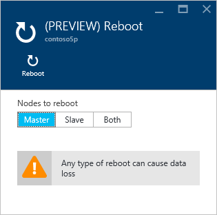
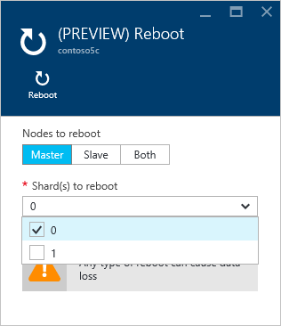

<properties 
    pageTitle="Zum Verwalten von Azure Redis Cache | Microsoft Azure"
    description="Informationen Sie zum Ausführen von administrativen Aufgaben, wie z. B. Neustart und Zeitplan Updates für Azure Redis Cache"
    services="redis-cache"
    documentationCenter="na"
    authors="steved0x"
    manager="douge"
    editor="tysonn" />
<tags 
    ms.service="cache"
    ms.devlang="na"
    ms.topic="article"
    ms.tgt_pltfrm="cache-redis"
    ms.workload="tbd"
    ms.date="09/27/2016"
    ms.author="sdanie" />

# Zum Verwalten von Azure Redis Cache

In diesem Thema beschrieben, wie z. B. Neustarten, Planen von Updates für Ihre Azure Redis Cache Instanzen Verwaltungsaufgaben ausführen.

>[AZURE.IMPORTANT] Einstellungen und in diesem Artikel beschriebenen Features sind nur für Premium Ebene Caches verfügbar.

## Einstellungen für die communityverwaltung

Die Einstellungen für die Azure Redis Cache **Administration** können Sie die folgenden Verwaltungsaufgaben für Ihren Cache Premium durchführen. Um Administration Einstellungen zuzugreifen, klicken Sie auf **Einstellungen** oder **Alle Einstellungen** aus dem Cache Redis Blade und führen Sie einen Bildlauf zum Abschnitt **Verwaltung** in den **Einstellungen** Blade.

-   [Neustart](#reboot)
-   [Planen von updates](#schedule-updates)

## Neustart

Das Blade **neu starten,** können Sie einen oder mehrere Knoten mit dem Cache neu zu starten. So können Sie die Anwendung für Stabilität im Fall eines Fehlers testen.

Wenn Sie einen Cache Premium mit Cluster aktiviert haben, können Sie die mehrere Shards hinweg des Caches neu starten auswählen.

Um einen oder mehrere Knoten mit dem Cache neu zu starten, wählen Sie die gewünschten Knoten aus, und klicken Sie auf **neu starten**. Wenn Sie einen Cache Premium mit Cluster aktiviert haben, wählen Sie die Shard(s) neu zu starten, und klicken Sie dann auf **neu starten**. Nach ein paar Minuten Onlineschalten der ausgewählten Knoten Neustart und sind ein paar Minuten später.

Die Auswirkung auf die Clientanwendungen abhängig von der Knoten, die Sie neu starten.

-   **Master-Shape** - beim master-Knoten neu gestartet wird, Azure Redis Cache wechselt auf den Knoten Replikat und höher gestuft sie auf Master-Shape. Bei diesem Failover wird möglicherweise eine kurze Zeit in der Verbindungen im Cache fehlschlagen.
-   **Untergeordnete** – Wenn der untergeordnete Knoten neu gestartet wird, es ist in der Regel wirkt sich nicht auf Cache Clients.
-   **Beide Gestaltungsvorlagen und slave** -, wenn beide Knoten Cache neu gestartet werden, alle Daten geht verloren im Cache und Verbindungen mit den Cache Fail bis primäre Knoten wieder online ist. Wenn Sie [Daten Beibehaltung](cache-how-to-premium-persistence.md)konfiguriert haben, wird die letzte Sicherung wiederhergestellt, wenn der Cache wieder online ist. Beachten Sie, dass alle Cache schreibt, die nach der letzten Sicherung stattgefunden verloren gegangen sind.
-   **Knoten eines Caches Premium mit Cluster aktiviert** – Wenn Sie die Knoten des einen Cache Premium mit Cluster aktiviert neu starten, ist das Verhalten identisch mit Wenn Sie Knoten eines nicht gruppierten Caches neu starten.

>[AZURE.IMPORTANT] Neustart ist nur für Premium Ebene Caches verfügbar.

## Häufig gestellte Fragen zu starten

-   [Welche Knoten sollte ich neu starten, um meine Anwendung zu testen?](#which-node-should-i-reboot-to-test-my-application)
-   [Können den Cache, um Clientverbindungen deaktivieren neu starten?](#can-i-reboot-the-cache-to-clear-client-connections)
-   [Gehen ich Daten aus meiner Cache verloren, wenn ich einen Neustart tun?](#will-i-lose-data-from-my-cache-if-i-do-a-reboot)
-   [Kann ich meine Cache mithilfe der PowerShell, CLI oder andere Tools zum Projektmanagement neu starten?](#can-i-reboot-my-cache-using-powershell-cli-or-other-management-tools)
-   [Welche Preise leisten kann die Funktionalität Neustart verwendet werden?](#what-pricing-tiers-can-use-the-reboot-functionality)

### Welche Knoten sollte ich neu starten, um meine Anwendung zu testen?

Starten Sie zum Testen der Stabilität Ihrer Anwendung vor einem Ausfall des primären Knotens von dem Cache den **Master** -Knoten neu. Starten Sie zum Testen der Stabilität Ihrer Anwendung vor einem Ausfall des sekundären Knotens des **untergeordnete** Knotens ein. Klicken Sie zum Testen der Stabilität Ihrer Anwendung für insgesamt Fehler des Caches starten Sie **beide** Knoten neu.

### Können den Cache, um Clientverbindungen deaktivieren neu starten?

Ja, wenn Sie den Cache neu starten, werden alle Clientverbindungen gelöscht. Dies kann sinnvoll sein, in den Fall, in dem alle Clientverbindungen nach oben, beispielsweise aufgrund einer logischen Fehler oder einen Fehler in der Clientanwendung verwendet werden. Pro Ebene Preisgestaltung weist verschiedene [Client Verbindung Grenzwerte](cache-configure.md#default-redis-server-configuration) für die verschiedenen Größen, und nachdem diese Grenzwerte erreicht werden, werden keine weiteren Clientverbindungen akzeptiert. Einem Neustart des Caches bietet eine Möglichkeit, alle Clientverbindungen zu deaktivieren.

>[AZURE.IMPORTANT] Wenn Ihre Clientverbindungen aufgrund einer logischen Fehler oder einem Fehler im Clientcode verwendet werden, beachten Sie, dass StackExchange.Redis automatisch erneut verbunden werden, sobald der Redis Knoten wieder online ist ein. Wenn das zugrunde liegende Problem weiterhin besteht, weiterhin im Clientverbindungen verwendet werden.

### Gehen ich Daten aus meiner Cache verloren, wenn ich einen Neustart tun?

Wenn Sie sowohl **Haupt-** als auch **untergeordnete** Knoten neu starten alle Daten im Cache (oder in die Shard, wenn Sie einen Cache Premium mit Cluster aktiviert) gehen verloren. Wenn Sie [Daten Beibehaltung](cache-how-to-premium-persistence.md)konfiguriert haben, wird die letzte Sicherung wiederhergestellt werden, wenn der Cache wieder online ist. Beachten Sie, dass alle Cache schreibt, die aufgetreten sind, nachdem die Sicherung vorgenommen wurde verloren gegangen sind.

Wenn Sie nur eine der Knoten neu starten, Daten sind nicht in der Regel verloren, aber es möglicherweise weiterhin. Für Beispiel, wenn der master-Knoten neu gestartet wird und ein Cache schreiben wird ausgeführt, die Daten aus dem Cache schreiben verloren. Ein weiteres Szenario für Datenverlust wäre, wenn Sie starten Sie einen Knoten und der anderen Knoten geschieht zu einem Fehler zur gleichen Zeit wechseln nach unten. Weitere Informationen zu den möglichen Ursachen für Datenverlust finden Sie unter [Meine Daten in Redis geblieben?](https://gist.github.com/JonCole/b6354d92a2d51c141490f10142884ea4#file-whathappenedtomydatainredis-md).

### Kann ich meine Cache mithilfe der PowerShell, CLI oder andere Tools zum Projektmanagement neu starten?

Ja, finden Sie unter PowerShell Anweisungen [, einen Redis Cache neu zu starten](cache-howto-manage-redis-cache-powershell.md#to-reboot-a-redis-cache).

### Welche Preise leisten kann die Funktionalität Neustart verwendet werden?

Neustart ist nur in der Premium Preise Ebene verfügbar.

## Planen von updates

**Planen von Updates** Blades können Sie ein Wartungsfenster für Ihren Cache festzulegen. Wenn Sie das Wartungsfenster angegeben ist, wurden Redis Serverupdates während dieses Fenster vorgenommen. Beachten Sie, dass das Wartungsfenster bezieht sich nur auf Redis Server-Updates und nicht zu einem beliebigen Azure aktualisiert oder an das Betriebssystem von der virtuellen Maschinen, die den Cache hosten aktualisiert.

Um ein Wartungsfenster angeben möchten, aktivieren Sie die gewünschten Tage und geben Sie die Wartung Fenster Startstunde für jeden Tag an, und klicken Sie auf **OK**. Beachten Sie, dass das Fenster Wartung in UTC ist. 

>[AZURE.NOTE] Im Wartungsfenster nach Updates suchen ist fünf Stunden. Dieser Wert lässt sich nicht aus dem Azure-Portal, aber Sie können sich mit PowerShell konfigurieren die `MaintenanceWindow` Parameter des Cmdlets [New-AzureRmRedisCacheScheduleEntry](https://msdn.microsoft.com/library/azure/mt763833.aspx) . Weitere Informationen finden Sie unter [kann geplante Updates mithilfe der PowerShell, CLI oder andere Tools zum Projektmanagement verwaltet?](#can-i-managed-scheduled-updates-using-powershell-cli-or-other-management-tools)

## Planen von Updates häufig gestellte Fragen

-   [Wann führen Sie Updates ausgeführt, wenn das Feature für Terminplan Updates nicht verwendet wird?](#when-do-updates-occur-if-i-dont-use-the-schedule-updates-feature)
-   [Welche Art von Aktualisierungen vorgenommen wurden, während das Fenster geplante Wartung?](#what-type-of-updates-are-made-during-the-scheduled-maintenance-window)
-   [Kann ich die geplante Updates mithilfe der PowerShell, CLI oder andere Tools zum Projektmanagement verwaltet?](#can-i-managed-scheduled-updates-using-powershell-cli-or-other-management-tools)
-   [Welche Preise leisten kann die Funktionalität der Terminplan Updates verwenden?](#what-pricing-tiers-can-use-the-schedule-updates-functionality)

### Wann führen Sie Updates ausgeführt, wenn das Feature für Terminplan Updates nicht verwendet wird?

Wenn Sie ein Wartungsfenster nicht angeben, können Updates zu einem beliebigen Zeitpunkt vorgenommen werden.

### Welche Art von Aktualisierungen vorgenommen wurden, während das Fenster geplante Wartung?

Nur Redis Server vorgenommene Aktualisierungen im Zeitfenster geplante Wartung. Das Wartungsfenster gilt nicht Azure Updates oder Updates für das Betriebssystem virtueller Computer.

### Kann ich die geplante Updates mithilfe der PowerShell, CLI oder andere Tools zum Projektmanagement verwaltet?

Ja, können Sie Ihre geplanten Aktualisierungen mithilfe der folgenden PowerShell-Cmdlets verwalten.

-   [Get-AzureRmRedisCachePatchSchedule](https://msdn.microsoft.com/library/azure/mt763835.aspx)
-   [Neue AzureRmRedisCachePatchSchedule](https://msdn.microsoft.com/library/azure/mt763834.aspx)
-   [Neue AzureRmRedisCacheScheduleEntry](https://msdn.microsoft.com/library/azure/mt763833.aspx)
-   [Entfernen-AzureRmRedisCachePatchSchedule](https://msdn.microsoft.com/library/azure/mt763837.aspx)

### Welche Preise leisten kann die Funktionalität der Terminplan Updates verwenden?

Planen von Updates ist nur in der Premium Preise Ebene verfügbar.

## Nächste Schritte

-   Sollten Sie weitere [Azure Redis Cache Premium Ebene](cache-premium-tier-intro.md) befassen.

