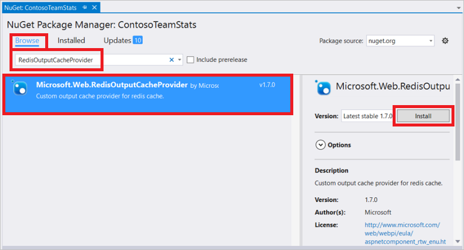

<properties
    pageTitle="ASP.NET Ausgabecacheanbieter Cache"
    description="Erfahren Sie, wie ASP.NET Seitenausgabe mit Azure Redis Cache zwischengespeichert"
    services="redis-cache"
    documentationCenter="na"
    authors="steved0x"
    manager="douge"
    editor="tysonn" />
<tags
    ms.service="cache"
    ms.devlang="na"
    ms.topic="article"
    ms.tgt_pltfrm="cache-redis"
    ms.workload="tbd"
    ms.date="09/27/2016"
    ms.author="sdanie" />

# ASP.NET Ausgabe Cache Datenanbieter für Azure Redis Cache

Die Redis Ausgabe Cacheanbieter sind Out-of-Process-Speicher für den Cache Ausgabedaten. Diese Daten ist speziell für vollständige HTTP-Antworten (Seite Zwischenspeichern der Ausgabe). Der Anbieter schließt an die neue Ausgabe Cache Anbieter Erweiterbarkeitspunkt, der in ASP.NET 4 eingeführt wurde.

Verwenden Sie den Redis Ausgabe-Cache-Anbieter, zuerst Ihren Cache konfigurieren, und konfigurieren Sie die ASP.NET-Anwendung, die mit der Redis Ausgabe Cache Anbieter NuGet-Paket. Dieses Thema enthält Anleitungen zum Konfigurieren Ihrer Anwendungs zu den Redis Ausgabe Cacheanbieter verwenden. Weitere Informationen zum Erstellen und Konfigurieren einer Instanz Azure Redis Cache finden Sie unter [Erstellen eines Cache](cache-dotnet-how-to-use-azure-redis-cache.md#create-a-cache).

## Speichern der Ausgabe von ASP.NET Seite im cache

Um eine Clientanwendung in Visual Studio mit der Redis Ausgabe Cache Anbieter NuGet-Paket konfigurieren, mit der rechten Maustaste im Projekts im **Solution Explorer** , und wählen Sie **NuGet-Pakete verwalten**.

Geben Sie **RedisOutputCacheProvider** in das Suchtextfeld ein, wählen Sie ihn in den Suchergebnissen aus, und klicken Sie auf **Installieren**.

Das Redis Ausgabe Cache Anbieter NuGet-Paket ist abhängig von der StackExchange.Redis.StrongName-Paket. Wenn das Paket StackExchange.Redis.StrongName nicht im Projekt vorhanden ist, wird es installiert. Beachten Sie, dass zusätzlich zu den starken Namen StackExchange.Redis.StrongName Paket auch die StackExchange.Redis signifikante-unbenannten Version ist. Wenn Ihr Projekt StackExchange.Redis signifikante-unbenannten Version, dass Sie es vor oder verwendet nach der Installation von der Redis Ausgabe Cache Anbieter NuGet-Paket deinstallieren müssen, werden andernfalls wird Sie Konflikte in Ihrem Projekt benennen abrufen. Weitere Informationen zu diesen Paketen finden Sie unter [Konfigurieren von .NET Cache Clients](cache-dotnet-how-to-use-azure-redis-cache.md#configure-the-cache-clients).

NuGet-Paket downloads und fügt die erforderlichen Verweise hinzu und fügt im folgenden Abschnitt in der Datei web.config, die die erforderliche Konfiguration für eine Anwendung ASP.NET mit den Redis Ausgabe Cacheanbieter enthält.

    <caching>
      <outputCachedefault Provider="MyRedisOutputCache">
        <providers>
          <!--
          <add name="MyRedisOutputCache"
            host = "127.0.0.1" [String]
            port = "" [number]
            accessKey = "" [String]
            ssl = "false" [true|false]
            databaseId = "0" [number]
            applicationName = "" [String]
            connectionTimeoutInMilliseconds = "5000" [number]
            operationTimeoutInMilliseconds = "5000" [number]
          />
          -->
          <add name="MyRedisOutputCache" type="Microsoft.Web.Redis.RedisOutputCacheProvider" host="127.0.0.1" accessKey="" ssl="false"/>
        </providers>
      </outputCache>
    </caching>

Der kommentierte Abschnitt enthält ein Beispiel für die Attribute und Stichprobe Einstellungen für jedes Attribut.

Konfigurieren Sie die Attribute mit den Werten aus der Cache-vorher in Microsoft Azure-Portal an, und konfigurieren Sie die anderen Werte nach Bedarf. Anweisungen zum Zugriff auf Ihre Eigenschaften von Cache finden Sie unter [Einstellungen des Caches Redis konfigurieren](cache-configure.md#configure-redis-cache-settings).

-   **Host** – den Cache Endpunkt angeben.
-   **Port** – entweder Ihren nicht SSL-Anschluss oder Ihre SSL port, je nachdem, welche Ssl verwenden.
-   **AccessKey** – die primäre oder sekundäre Taste für Ihren Cache verwenden.
-   **Ssl** – true zurück, wenn Sie Cache-Client-Kommunikation mit Ssl sichern möchten; andernfalls False. Achten Sie darauf, um den richtigen Port anzugeben.
    -   Der Port nicht SSL ist standardmäßig für neue Caches deaktiviert. Geben Sie True für diese Einstellung, um den SSL-Anschluss verwenden. Weitere Informationen zu den Port nicht SSL aktivieren finden Sie unter Abschnitt [Access Ports](cache-configure.md#access-ports) im Thema [Konfigurieren eines Cache](cache-configure.md) .
-   **DatabaseId** – angegeben, welche Datenbank für Ausgabedaten Cache verwendet werden soll. Wenn nicht angegeben, ist der Standardwert 0 verwendet.
-   **ApplicationName** – Schlüssel befinden sich am Redis als <AppName>_<SessionId>_Data. Dadurch werden mehrere Applikationen demselben Schlüssel freigeben. Für diesen Parameter ist optional, und wenn Sie nicht bereitstellen, wird ein Standardwert verwendet.
-   **ConnectionTimeoutInMilliseconds** – mit dieser Einstellung können Sie die Einstellung ConnectTimeout im Client StackExchange.Redis außer Kraft. Wenn nicht angegeben, wird die Standardeinstellung für die ConnectTimeout von 5000 verwendet. Weitere Informationen finden Sie unter [StackExchange.Redis Konfigurationsmodell](http://go.microsoft.com/fwlink/?LinkId=398705).
-   **OperationTimeoutInMilliseconds** – mit dieser Einstellung können Sie die Einstellung SyncTimeout im Client StackExchange.Redis außer Kraft. Wenn nicht angegeben, wird die Standardeinstellung für die SyncTimeout von 1000 verwendet. Weitere Informationen finden Sie unter [StackExchange.Redis Konfigurationsmodell](http://go.microsoft.com/fwlink/?LinkId=398705).

Hinzufügen einer Richtlinie OutputCache auf jeder Seite die Ausgabe zwischengespeichert werden soll.

    <%@ OutputCache Duration="60" VaryByParam="*" %>

Die zwischengespeicherte Seitendaten bleibt in diesem Beispiel wird im Cache für 60 Sekunden, und eine andere Version von der Seite für jeden Parameterkombination zwischengespeichert. Weitere Informationen über die Richtlinie OutputCache finden Sie unter [@OutputCache](http://go.microsoft.com/fwlink/?linkid=320837).

Nachdem Sie diese Schritte ausgeführt werden, ist eine Anwendung so konfiguriert, dass die Redis Ausgabe Cacheanbieter verwenden.

## Nächste Schritte

Schauen Sie sich die [ASP.NET Session State Provider für Azure Redis Cache](cache-aspnet-session-state-provider.md).
