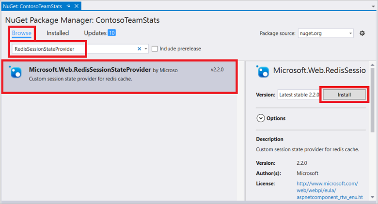

<properties
    pageTitle="Cache ASP.NET Session State Provider | Microsoft Azure"
    description="Informationen Sie zum Speichern von ASP.NET Session State mit Azure Redis Cache"
    services="redis-cache"
    documentationCenter="na"
    authors="steved0x"
    manager="douge"
    editor="tysonn" />
<tags
    ms.service="cache"
    ms.devlang="na"
    ms.topic="article"
    ms.tgt_pltfrm="cache-redis"
    ms.workload="tbd"
    ms.date="09/01/2016"
    ms.author="sdanie" />

# ASP.NET Session State-Anbieter für Azure Redis Cache

Azure Redis Cache bietet ein Anbieters für Sitzung, das Sie verwenden können, Ihre Sitzungszustand in einem Cache anstatt im Speicher oder in einer SQL Server-Datenbank gespeichert. Um den Zwischenspeichern Sitzung Zustand Anbieter verwenden zu können, zuerst konfigurieren Sie Ihren Cache zu, und konfigurieren Sie die Anwendung ASP.NET für das Paket Redis Cache Sitzung Zustand NuGet-Cache.

Es ist oft nicht in einer realen Cloud app zu vermeiden Sie das Speichern einer Form von Bundesstaat für eine Sitzung Benutzer praktisch, jedoch einige Ansätze beeinflussen, Leistung und Skalierbarkeit mehr als andere. Wenn Sie Zustand gespeichert haben, ist die bestmögliche Lösung halten Sie die Menge des Status klein und speichern Sie es in Cookies. Die nicht soweit möglich ist, ist die beste nächste Lösung zur Verwendung von ASP.NET Session State mit einem Anbieter für verteilten Cache in-Memory. Die schlechtesten Lösung Leistung und Skalierbarkeit Sicht ist mit der Verwendung einer Datenbank gesicherten Sitzung Zustand Anbieter. Dieses Thema enthält Anleitungen zur Verwendung der ASP.NET Session State Provider für Azure Redis Cache. Informationen zu anderen Sitzung Zustand Optionen finden Sie unter [ASP.NET Session State-Optionen](#aspnet-session-state-options).

## ASP.NET Session State im Cache speichern

Um eine Clientanwendung in Visual Studio mit der Redis Cache Sitzung Zustand NuGet-Paket konfigurieren, mit der rechten Maustaste im Projekts im **Solution Explorer** , und wählen Sie **NuGet-Pakete verwalten**.

Geben Sie **RedisSessionStateProvider** in das Suchtextfeld ein, wählen Sie ihn in den Suchergebnissen aus, und klicken Sie auf **Installieren**.

>[AZURE.IMPORTANT] Wenn Sie die von der Ebene Premium Cluster-Funktion verwenden, müssen Sie [RedisSessionStateProvider](https://www.nuget.org/packages/Microsoft.Web.RedisSessionStateProvider) 2.0.1 verwenden oder höher oder eine Ausnahme wird ausgelöst. Dies ist eine Änderung abgeschnitten werden. Weitere Informationen finden Sie unter [Version 2.0.0 Details der Bruchfestigkeit ändern](https://github.com/Azure/aspnet-redis-providers/wiki/v2.0.0-Breaking-Change-Details).

Das Redis Sitzung Zustand Anbieter NuGet-Paket weist eine Abhängigkeit auf dem Paket StackExchange.Redis.StrongName. Wenn das Paket StackExchange.Redis.StrongName nicht im Projekt vorhanden ist, wird es installiert. Beachten Sie, dass zusätzlich zu den starken Namen StackExchange.Redis.StrongName Paket auch die StackExchange.Redis signifikante-unbenannten Version ist. Wenn Ihr Projekt StackExchange.Redis signifikante-unbenannten Version, dass Sie es vor oder verwendet nach der Installation von der Redis Sitzung Zustand Anbieter NuGet-Paket deinstallieren müssen, werden andernfalls wird Sie Konflikte in Ihrem Projekt benennen abrufen. Weitere Informationen zu diesen Paketen finden Sie unter [Konfigurieren von .NET Cache Clients](cache-dotnet-how-to-use-azure-redis-cache.md#configure-the-cache-clients).

NuGet-Paket downloads und addiert die erforderliche Assembly verweist auf und addiert, dass die folgenden im folgenden Abschnitt in der Datei web.config hinzu, die die erforderliche Konfiguration für eine Anwendung ASP.NET mit Redis Cache Session State Provider enthält.

    <sessionState mode="Custom" customProvider="MySessionStateStore">
        <providers>
        <!--
        <add name="MySessionStateStore"
            host = "127.0.0.1" [String]
            port = "" [number]
            accessKey = "" [String]
            ssl = "false" [true|false]
            throwOnError = "true" [true|false]
            retryTimeoutInMilliseconds = "0" [number]
            databaseId = "0" [number]
            applicationName = "" [String]
            connectionTimeoutInMilliseconds = "5000" [number]
            operationTimeoutInMilliseconds = "5000" [number]
        />
        -->
        <add name="MySessionStateStore" type="Microsoft.Web.Redis.RedisSessionStateProvider" host="127.0.0.1" accessKey="" ssl="false"/>
        </providers>
    </sessionState>

Der kommentierte Abschnitt enthält ein Beispiel für die Attribute und Stichprobe Einstellungen für jedes Attribut.

Konfigurieren Sie die Attribute mit den Werten aus der Cache-vorher in das Microsoft Azure-Portal an, und konfigurieren Sie die anderen Werte nach Bedarf. Anweisungen zum Zugriff auf Ihre Eigenschaften von Cache finden Sie unter [Einstellungen des Caches Redis konfigurieren](cache-configure.md#configure-redis-cache-settings).

-   **Host** – den Cache Endpunkt angeben.
-   **Port** – entweder Ihren nicht SSL-Anschluss oder Ihre SSL port, je nachdem, welche Ssl verwenden.
-   **AccessKey** – die primäre oder sekundäre Taste für Ihren Cache verwenden.
-   **Ssl** – true zurück, wenn Sie Cache-Client-Kommunikation mit Ssl sichern möchten; andernfalls False. Achten Sie darauf, um den richtigen Port anzugeben.
    -   Der Port nicht SSL ist standardmäßig für neue Caches deaktiviert. Geben Sie True für diese Einstellung, um den SSL-Anschluss verwenden. Weitere Informationen zu den Port nicht SSL aktivieren finden Sie unter Abschnitt [Access Ports](cache-configure.md#access-ports) im Thema [Konfigurieren eines Cache](cache-configure.md) .
-   **ThrowOnError** – true, wenn Sie möchten eine Ausnahme im Fall eines Fehlers oder falsch ausgelöst wird, wenn Sie den Vorgang im Hintergrund treten möchten. Sie können für einen Fehler überprüfen, indem Sie die statische Microsoft.Web.Redis.RedisSessionStateProvider.LastException-Eigenschaft. Die Standardeinstellung ist wahr.
-   während dieses Intervalls, in Millisekunden angegeben, werden **RetryTimeoutInMilliseconds** – Vorgänge, die nicht wiederholt. Die erste Wiederholung tritt nach 20 Millisekunden und dann treten Wiederholungsversuche pro Sekunde, bis das RetryTimeoutInMilliseconds Intervall abgelaufen ist. Unmittelbar nach dieser Zeitspanne wird der Vorgang abgeschlossen einmal wiederholt. Wenn der Vorgang weiterhin fehlschlägt, wird die Ausnahme zurück zum Anrufer, je nach der Einstellung ThrowOnError ausgelöst. Der Standardwert ist 0 keine Wiederholungsversuche bedeutet.
-   **DatabaseId** – gibt an, die die zu verwendende für Datenbank Zwischenspeichern Ausgabedaten. Wenn nicht angegeben, ist der Standardwert 0 verwendet.
-   **ApplicationName** – Schlüssel befinden sich am Redis als `{<Application Name>_<Session ID>}_Data`. Dadurch werden mehrere Applikationen demselben Schlüssel freigeben. Für diesen Parameter ist optional, und wenn Sie nicht bereitstellen, wird ein Standardwert verwendet.
-   **ConnectionTimeoutInMilliseconds** – mit dieser Einstellung können Sie die Einstellung ConnectTimeout im Client StackExchange.Redis außer Kraft. Wenn nicht angegeben, wird die Standardeinstellung für die ConnectTimeout von 5000 verwendet. Weitere Informationen finden Sie unter [StackExchange.Redis Konfigurationsmodell](http://go.microsoft.com/fwlink/?LinkId=398705).
-   **OperationTimeoutInMilliseconds** – mit dieser Einstellung können Sie die Einstellung SyncTimeout im Client StackExchange.Redis außer Kraft. Wenn nicht angegeben, wird die Standardeinstellung für die SyncTimeout von 1000 verwendet. Weitere Informationen finden Sie unter [StackExchange.Redis Konfigurationsmodell](http://go.microsoft.com/fwlink/?LinkId=398705).

Weitere Informationen zu diesen Eigenschaften finden Sie unter der ursprünglichen Blog Beitrag Ankündigung am [Ankündigung ASP.NET Session State Provider für Redis](http://blogs.msdn.com/b/webdev/archive/2014/05/12/announcing-asp-net-session-state-provider-for-redis-preview-release.aspx).

Vergessen Sie nicht, standard InProc Sitzung Zustand Anbieter Abschnitt in web.config kommentiert.

    <!-- <sessionState mode="InProc"
         customProvider="DefaultSessionProvider">
         <providers>
            <add name="DefaultSessionProvider"
                  type="System.Web.Providers.DefaultSessionStateProvider,
                        System.Web.Providers, Version=1.0.0.0, Culture=neutral,
                        PublicKeyToken=31bf3856ad364e35"
                  connectionStringName="DefaultConnection" />
          </providers>
    </sessionState> -->

Nachdem Sie diese Schritte ausgeführt werden, ist eine Anwendung so konfiguriert, dass die Redis Cache Session State Provider verwenden. Wenn Sie die Sitzungszustand in Ihrer Anwendung verwenden, wird es in eine Instanz Azure Redis Cache gespeichert werden.

>[AZURE.NOTE] Beachten Sie, dass die Daten im Cache gespeicherte serialisierbar sein müssen, im Gegensatz zu den Daten, die in der standardmäßigen gespeichert werden, können in-Memory ASP.NET Session State Anbieter. Wenn die Session State Provider für Redis verwendet wird, achten Sie darauf, dass die Datentypen, die Sitzung Zustand gespeichert werden serialisierbar sind.

## ASP.NET Session State-Optionen

- Im Speicher Session State Anbieter - speichert diese Anbieter den Status der Sitzung im Arbeitsspeicher. Der Vorteil der Verwendung von diesem Anbieter ist, dass es einfacher und schneller ist. Sie können keine jedoch von Web Apps skalieren, wenn Sie in Memory-Anbieter verwenden, da es nicht verteilt ist.

- Anbieter für SQL Server Session State - dieser Anbieter speichert die Session State in Sql Server. Sie sollten diesen Anbieter verwenden, wenn die Session State in einem permanenten Speicher beibehalten werden sollen. Sie können Ihre Online skalieren bleibt mithilfe von Sql Server für die Sitzung jedoch eine Auswirkung auf die Leistung auf Web App.

- Verteilt In Arbeitsspeicher Session State Provider wie Redis Cache Session State Provider - dieser Anbieter bietet Ihnen die Vorteile beider. Der Web-App kann eine einfache, schnelle und skalierbare Session State Provider verfügen. Sie müssen jedoch Aspekte beachten Sie, dass dieser Anbieter die Session State im Cache speichert und Ihre app Aspekte alle Merkmale verknüpft ist, wenn ein Gespräch an einen Cache im Arbeitsspeicher verteilt, wie z. B. vorübergehenden Network-Fehlern erstellen. Bewährte Methoden zum Cache verwenden finden Sie unter [Anleitungen Zwischenspeichern](../best-practices-caching.md) von Microsoft Patterns & Practices [Azure Cloud Anwendungsentwurf und Implementierung Anleitungen](https://github.com/mspnp/azure-guidance).

Weitere Informationen zu Sitzungszustand und andere empfohlene Vorgehensweisen finden Sie unter [Web Development Best Practices (Gebäude praktisches Cloud Apps mit Azure)](http://www.asp.net/aspnet/overview/developing-apps-with-windows-azure/building-real-world-cloud-apps-with-windows-azure/web-development-best-practices).

## Nächste Schritte

Schauen Sie sich die [ASP.NET Ausgabe-Cache-Anbieter für Azure Redis Cache](cache-aspnet-output-cache-provider.md).
