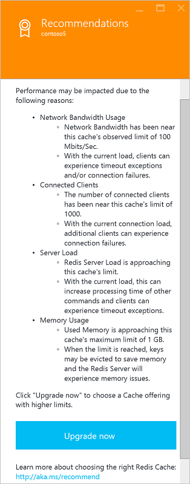
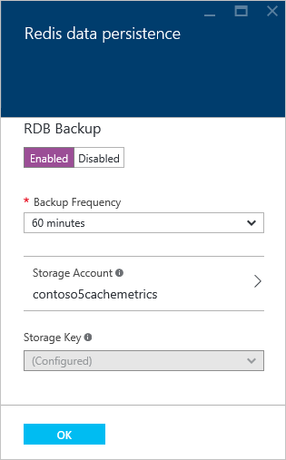
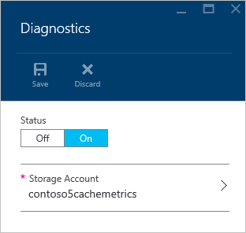
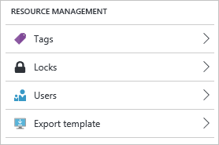
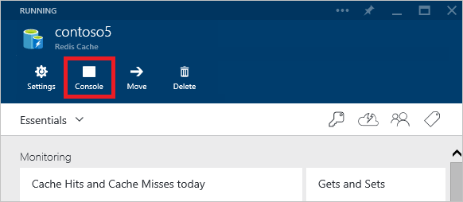
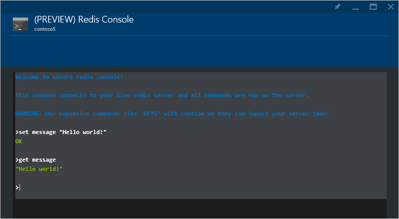

<properties 
    pageTitle="So konfigurieren Sie Azure Redis Cache | Microsoft Azure"
    description="Verstehen Sie die standardmäßige Redis-Konfiguration für Azure Redis Cache und erfahren Sie, wie Ihre Azure Redis Cache Instanzen zu konfigurieren"
    services="redis-cache"
    documentationCenter="na"
    authors="steved0x"
    manager="douge"
    editor="tysonn" />
<tags 
    ms.service="cache"
    ms.devlang="na"
    ms.topic="article"
    ms.tgt_pltfrm="cache-redis"
    ms.workload="tbd"
    ms.date="08/25/2016"
    ms.author="sdanie" />

# So konfigurieren Sie Azure Redis Cache

In diesem Thema beschrieben, wie Sie überprüfen und aktualisieren Sie die Konfiguration für Ihre Azure Redis Cache Instanzen, und die standardmäßige Redis Server-Konfiguration für Azure Redis Cache Instanzen behandelt.

>[AZURE.NOTE] Weitere Informationen zum Konfigurieren und Verwenden von Premium Cachefeatures finden Sie unter [Beibehaltung für einen Premium Azure Redis Cache konfigurieren](cache-how-to-premium-persistence.md), [wie Sie für einen Premium Azure Redis Cache Cluster konfigurieren](cache-how-to-premium-clustering.md)und [Virtual Network-Unterstützung für einen Premium Azure Redis Cache konfigurieren](cache-how-to-premium-vnet.md).

## Konfigurieren von Einstellungen des Caches für Redis

[AZURE.INCLUDE [redis-cache-create](../../includes/redis-cache-browse.md)]

Azure Redis Cache bietet die folgenden Einstellungen in den **Einstellungen** Blade.

-   [Support und Problembehandlung Einstellungen](#support-amp-troubleshooting-settings)
-   [Allgemeine Einstellungen](#general-settings)
    -   [Eigenschaften](#properties)
    -   [Tastenkombinationen](#access-keys)
    -   [Erweiterte Einstellungen](#advanced-settings)
    -   [Redis Cache Advisor](#redis-cache-advisor)
-   [Skalierungseinstellungen](#scale-settings)
    -   [Preise Ebene](#pricing-tier)
    -   [Redis Clustergröße](#cluster-size)
-   [Einstellungen für die Daten](#data-management-settings)
    -   [Redis Beibehaltung der Daten](#redis-data-persistence)
    -   [Import/Export](#importexport)
-   [Einstellungen für die communityverwaltung](#administration-settings)
    -   [Neustart](#reboot)
    -   [Planen von updates](#schedule-updates)
-   [Diagnose](#diagnostics-settings)
-   [Netzwerkeinstellungen](#network-settings)
-   [Einstellungen für die Ressource](#resource-management-settings)

## Support und Problembehandlung Einstellungen

Die Einstellungen im Abschnitt **Support + Problembehandlung** bieten Ihnen Optionen zum Lösen von Problemen mit dem Cache.

Klicken Sie auf **Konfigurationsprobleme und Beheben von Problemen mit** Lösungsvorschläge für häufige Probleme und Strategien bereitgestellt werden.

Klicken Sie auf **Aufzeichnen** , um auf Ihren Cache ausgeführten Aktionen anzeigen. Sie können auch verwenden filtern, um diese Ansicht, um weitere Ressourcen zu erweitern. Weitere Informationen zum Arbeiten mit Überwachungsprotokolle finden Sie unter [Anzeigen von Ereignissen und Überwachungsprotokolle](../monitoring-and-diagnostics/insights-debugging-with-events.md) und [Überwachen von Vorgängen mit Ressourcenmanager](../resource-group-audit.md). Weitere Informationen zum Überwachen von Ereignissen Azure Redis Cache finden Sie unter [Vorgänge und Benachrichtigungen](cache-how-to-monitor.md#operations-and-alerts).

**Ressource Gesundheit** Überwachungen die Ressource und Sie erfahren, wenn er wie erwartet ausgeführt wird. Weitere Informationen zum Dienst Gesundheit Azure Ressource finden Sie unter [Azure Ressourcenübersicht Dienststatus](../resource-health/resource-health-overview.md).

>[AZURE.NOTE] Ressource Dienststatus kann derzeit keine Meldung auf die Integrität des Azure Redis Cache Instanzen in einem virtuellen Netzwerk gehostet wird. Weitere Informationen finden Sie unter [Alle Cachefeatures funktionieren, wenn einen Cache in einem VNET Hostinganbieter?](cache-how-to-premium-vnet.md#do-all-cache-features-work-when-hosting-a-cache-in-a-vnet)

Klicken Sie auf **neu support-Anfragen** , um eine Supportanfrage für Ihren Cache zu öffnen.

## Allgemeine Einstellungen

Die Einstellungen im Abschnitt **Allgemein** können Sie zugreifen, und konfigurieren die folgenden Einstellungen für Ihren Cache.

-   [Eigenschaften](#properties)
-   [Tastenkombinationen](#access-keys)
-   [Erweiterte Einstellungen](#advanced-settings)
-   [Redis Cache Advisor](#redis-cache-advisor)

### Eigenschaften

Klicken Sie auf **Eigenschaften** , um Informationen zu Ihren Cache, einschließlich Cache Endpunkt und Ports anzuzeigen.

### Tastenkombinationen

Klicken Sie auf die **Tastenkombinationen** zum Anzeigen oder die Tastenkombinationen für Ihren Cache neu zu generieren. Diese Tasten werden zusammen mit den Hostnamen und Ports aus dem Blade **Eigenschaften** von der Herstellen einer Verbindung mit dem Cache Clients verwendet.

### Erweiterte Einstellungen

Klicken Sie auf das **Erweiterte Einstellungen** Blade, sind die folgenden Einstellungen konfigurieren.

-   [Access-Ports](#access-ports)
-   [Maxmemory-Richtlinie und Maxmemory reserviert](#maxmemory-policy-and-maxmemory-reserved)
-   [Schlüssellänge zur Verfügung Benachrichtigungen (Erweiterte Einstellungen)](#keyspace-notifications-advanced-settings)

### Access-Ports

Nicht SSL Access wird standardmäßig für neue Caches deaktiviert. Um den nicht-SSL-Anschluss zu aktivieren, klicken Sie auf **Nein** , für den **Zugriff gewähren nur über SSL** auf das **Blade Erweiterte Einstellungen** , und klicken Sie dann auf **Speichern**.

### Maxmemory-Richtlinie und Maxmemory reserviert

Die **Richtlinie Maxmemory** und **Maxmemory reserviert** Einstellungen das Blade **Erweiterte Einstellungen** konfigurieren die Arbeitsspeicher Richtlinien für den Cache. Die **Maxmemory -** Einstellung konfiguriert die Entfernung Richtlinie für den Cache und den Speicher für nicht-Cache-Prozesse reserviert **Maxmemory reserviert** konfiguriert.

**Maxmemory Richtlinie** können Sie die folgenden Richtlinien für Entfernung auswählen.

-   permanenten-Lru - Dies ist der Standardwert.
-   AllKeys-lru
-   permanenten Zufallszahl
-   AllKeys Zufallszahl
-   Ttl-temporär
-   noeviction

Weitere Informationen zu den Richtlinien Maxmemory finden Sie unter [Richtlinien Entfernung](http://redis.io/topics/lru-cache#eviction-policies).

Die Einstellung **Maxmemory reserviert** konfiguriert die Speichermenge in MB, die für nicht-Cache-Operationen wie z. B. Replikation während des Failovers reserviert ist. Sie können auch verwendet werden, wenn Sie eine hohe Fragmentierung Verhältnisses verfügen. Dieser Wert festlegen kann, dass Sie eine konsistente Redis Server-Umgebung besitzen, wenn Ihre Last variiert. Dieser Wert sollte für Auslastung die fett schreiben sind höhere festgelegt werden. Wenn Arbeitsspeicher für solche Operationen reserviert ist, ist es zum Speichern von zwischengespeicherten Daten nicht verfügbar.

>[AZURE.IMPORTANT] Die Einstellung **Maxmemory reserviert** steht nur zur Verfügung, für die Standard- und Premium zwischengespeichert.

### Schlüssellänge zur Verfügung Benachrichtigungen (Erweiterte Einstellungen)

Redis Schlüssellänge zur Verfügung, die auf das **Erweiterte Einstellungen** Blade Benachrichtigungen konfiguriert sind. Schlüssellänge zur Verfügung Benachrichtigungen ermöglichen Clients Benachrichtigungen erhalten, wenn bestimmte Ereignisse auftreten.

>[AZURE.IMPORTANT] Benachrichtigungen Schlüssellänge zur Verfügung und die Einstellung **Benachrichtigen-Schlüssellänge zur Verfügung-Ereignisse** sind nur verfügbar, für die Standard- und Premium zwischengespeichert.

Weitere Informationen finden Sie unter [Benachrichtigungen für Redis Schlüssellänge zur Verfügung](http://redis.io/topics/notifications). Beispiel-Code finden Sie unter der [KeySpaceNotifications.cs](https://github.com/rustd/RedisSamples/blob/master/HelloWorld/KeySpaceNotifications.cs) -Datei in der Stichprobe [Hallo Welt](https://github.com/rustd/RedisSamples/tree/master/HelloWorld) .

## Redis Cache Advisor

Das Blade **Empfehlungen** zeigt Empfehlungen für Ihren Cache. Bei normalen Vorgängen werden keine Empfehlungen angezeigt. 

Wenn alle Zustände während der Datenoperationen für Ihren Cache wie hoch arbeitsspeicherauslastung, Netzwerk-Bandbreite oder Server Laden auftreten, wird eine Warnung auf das Blade **Redis Cache** angezeigt.

Weitere Informationen finden Sie auf das **Empfehlungen** Blade.

Sie können diese Kennzahlen an den Abschnitten [Überwachung Diagramme](cache-how-to-monitor.md#monitoring-charts) und [Diagramme Verwendung](cache-how-to-monitor.md#usage-charts) des Blades **Cache Redis** überwachen.

Pro Ebene Preisgestaltung weist unterschiedliche Grenzwerte für Clientverbindungen, Arbeitsspeicher und Bandbreite an. Wenn Ihr Cache maximale Leistungsfähigkeit für diese Kennzahlen über eine längere Zeitspanne erreicht, wird ein Empfehlungen erstellt. Weitere Informationen zu den Kennzahlen und Grenzwerte überprüft, indem Sie das Tool **Empfehlungen** finden Sie in der folgenden Tabelle.

| Redis Cache Metrisch      | Weitere Informationen finden Sie unter                                                  |
|-------------------------|---------------------------------------------------------------------------|
| Verwendung der Netzwerk-Bandbreite | [Cache Performance - verfügbare Bandbreite](cache-faq.md#cache-performance) |
| Verbundene clients       | [Standard Redis Server-Konfigurations - maxclients](#maxclients)            |
| Server laden             | [Verwendung Diagrammen - Server laden Redis](cache-how-to-monitor.md#usage-charts)  |
| Arbeitsspeicherauslastung            | [Cache Performance - Größe](cache-faq.md#cache-performance)                |

Klicken Sie auf **Jetzt aktualisieren** , um die [Preise Ebene](#pricing-tier) ändern und den Cache skalieren, um Ihren Cache zu aktualisieren. Weitere Informationen zum Auswählen einer Preisgestaltung Ebene, finden Sie unter [welche Redis Cache Angebot und Größe sollte ich verwenden?](cache-faq.md#what-redis-cache-offering-and-size-should-i-use).

## Skalierungseinstellungen

Die Einstellungen im Abschnitt **Skalieren** können Sie zugreifen, und konfigurieren die folgenden Einstellungen für Ihren Cache.

-   [Preise Ebene](#pricing-tier)
-   [Redis Clustergröße](#cluster-size)

### Preise Ebene

Klicken Sie auf die **Preise Ebene** zum Anzeigen oder Ändern der Preisgestaltung Ebene für Ihr Cache. Weitere Informationen zu skalieren finden Sie unter [So skalieren Azure Redis Cache](cache-how-to-scale.md).

### Redis Clustergröße

Klicken Sie auf **Redis Cluster-Größe (PREVIEW)** zum Ändern der Clustergröße für fortlaufendes Premium Cache mit Cluster aktiviert.

>[AZURE.NOTE] Beachten Sie, dass während die Ebene Azure Redis Cache Premium zur allgemeinen Verfügbarkeit gebracht freigegeben wurde, das Größe der Zuordnungseinheiten Redis Feature derzeit in der Vorschau.

Um die Clustergröße zu ändern, verwenden Sie den Schieberegler oder geben Sie eine Zahl zwischen 1 und 10 in das Textfeld **Shard zählen** , und klicken Sie auf **OK** , um zu speichern.

>[AZURE.IMPORTANT] Redis Cluster ist nur für Premium Caches verfügbar. Weitere Informationen finden Sie unter [So konfigurieren Sie für einen Premium Azure Redis Cache Cluster](cache-how-to-premium-clustering.md).

## Einstellungen für die Daten

Die Einstellungen im Abschnitt **Verwaltung von Daten** können Sie zugreifen, und konfigurieren die folgenden Einstellungen für Ihren Cache.

-   [Redis Beibehaltung der Daten](#redis-data-persistence)
-   [Import/Export](#importexport)

### Redis Beibehaltung der Daten

Klicken Sie zum Aktivieren, deaktivieren oder konfigurieren Beibehaltung der Daten für Ihren Cache Premium **Redis Beibehaltung der Daten** auf.

Um Redis Speicherung zu aktivieren, klicken Sie auf **aktiviert** , um RDB (Redis Datenbank) Sicherung aktivieren. Um Redis Beibehaltung zu deaktivieren, klicken Sie auf **deaktiviert**.

Um die Sicherung Intervall konfigurieren, wählen Sie eine **Sicherungskopie Häufigkeit** aus der Dropdownliste aus. Auswahlmöglichkeiten gehören **15 Minuten**, **30 Minuten**, **60 Minuten**, **6 Stunden**, **12 Stunden**und **24 Stunden**. Dieses Intervall wird gestartet, nach der vorherigen Sicherung erfolgreich abgeschlossen, und wenn es abläuft, wird eine neue Sicherung initiiert Countdown durchzuführen.

Klicken Sie auf **Speicher-Konto** das Speicherkonto verwenden aus, und wählen Sie entweder den **Primärschlüssel** oder **sekundären Schlüssel** aus der Dropdownliste **Storage Key** zu verwenden. Sie müssen ein Speicherkonto in derselben Region als Cache auswählen, und ein Konto **Premium Speicher** wird empfohlen, weil Premium Speicher höheren Durchsatz weist. Jedes Mal, wenn die Taste Speicherplatz für Ihr Konto Beibehaltung erneut generiert wird, müssen Sie den gewünschten Schlüssel aus der Dropdownliste **Storage Key** erneut auswählen.

Klicken Sie auf **OK** , um die Konfiguration Beibehaltung zu speichern.

>[AZURE.IMPORTANT] Redis Daten Beibehaltung steht nur für Premium Caches. Weitere Informationen finden Sie unter [Beibehaltung für einen Premium Azure Redis Cache konfigurieren](cache-how-to-premium-persistence.md).

### Import/Export

Import/Export ist ein Azure Redis Cache Daten Verwaltungsvorgang wodurch Sie Daten in Azure Redis Cache importieren oder Exportieren von Daten aus Azure Redis Cache durch Importieren und Exportieren von Momentaufnahme Redis-Cache-Datenbank (RDB) aus einem Cache Premium auf einer Seitenblob in einem Azure-Speicher-Konto an. So können Sie zwischen verschiedenen Azure Redis Cache Instanzen migrieren oder den Cache mit Daten vor der Verwendung zu füllen.

Importieren kann Redis kompatibel RDB Datei(en) aus einem beliebigen Redis Server ausgeführt in einem beliebigen Cloud oder -Umgebung, einschließlich Redis unter Linux, Windows oder eine beliebige Cloudanbieter, z. B. Amazon-Webdiensten und andere einbinden verwendet werden. Importieren von Daten ist eine einfache Möglichkeit, einen Cache mit vorab eingetragenen Daten zu erstellen. Während des Importvorgangs Azure Redis Cache lädt die Dateien RDB aus Azure-Speicher in den Speicher und anschließend die Tasten in den Cache eingefügt.

Exportieren können Sie die Daten aus Azure Redis Cache zu kompatibel RDB Datei(en) Redis exportieren. Sie können dieses Feature zum Verschieben von Daten aus einer Instanz von Azure Redis Cache in ein anderes oder einen anderen Redis Server verwenden. Während des Exportvorgangs erstellt eine temporäre Datei des virtuellen Computers, der die Redis Azure-Cache-Server-Instanz hostet, und die Datei mit dem Speicherkonto vorgesehenen hochgeladen wird. Nach Abschluss des Exportvorgangs mit entweder Status Erfolg oder Fehler, wird die temporäre Datei gelöscht.

>[AZURE.IMPORTANT] Import/Export ist nur für Premium Ebene Caches verfügbar. Weitere Informationen und Anweisungen finden Sie unter [Importieren und Exportieren von Daten in Azure Redis Cache](cache-how-to-import-export-data.md).

## Einstellungen für die communityverwaltung

Die Einstellungen im Abschnitt **Verwaltung** können Sie die folgenden Verwaltungsaufgaben für Ihren Cache Premium durchführen. 

-   [Neustart](#reboot)
-   [Planen von updates](#schedule-updates)

>[AZURE.IMPORTANT] Die Einstellungen in diesem Abschnitt sind nur für Premium Ebene Caches verfügbar.

### Neustart

Das Blade **neu starten,** können Sie einen oder mehrere Knoten mit dem Cache neu zu starten. So können Sie die Anwendung für Stabilität im Fall eines Fehlers testen.

Wenn Sie einen Cache Premium mit Cluster aktiviert haben, können Sie die mehrere Shards hinweg des Caches neu starten auswählen.

Mindestens einen Neustart mehr Knoten mit dem Cache, wählen Sie die gewünschten Knoten, und klicken Sie auf **neu starten**. Wenn Sie einen Cache Premium mit Cluster aktiviert haben, wählen Sie die Shard(s) neu zu starten, und klicken Sie dann auf **neu starten**. Nach ein paar Minuten Onlineschalten der ausgewählten Knoten Neustart und sind ein paar Minuten später.

>[AZURE.IMPORTANT] Neustart ist nur für Premium Ebene Caches verfügbar. Weitere Informationen und Anweisungen finden Sie unter [Redis Azure-Cache-Verwaltung - neu zu starten](cache-administration.md#reboot).

### Planen von updates

**Planen von Updates** Blades können Sie ein Wartungsfenster für Redis Server-Updates für Ihren Cache festzulegen. 

>[AZURE.IMPORTANT] Beachten Sie, dass das Wartungsfenster bezieht sich nur auf Redis Server-Updates und nicht zu einem beliebigen Azure aktualisiert oder an das Betriebssystem von der virtuellen Maschinen, die den Cache hosten aktualisiert.

Um ein Wartungsfenster angeben möchten, aktivieren Sie die gewünschten Tage und geben Sie die Wartung Fenster Startstunde für jeden Tag an, und klicken Sie auf **OK**. Beachten Sie, dass das Fenster Wartung in UTC ist. 

>[AZURE.IMPORTANT] Planen von Updates ist nur für Premium Ebene Caches verfügbar. Weitere Informationen und Anweisungen finden Sie unter [Redis Azure-Cache-Verwaltung - Planen von Updates](cache-administration.md#schedule-updates).

## Diagnose

Abschnitt **Diagnose** können Sie Diagnose für Ihren Cache Redis konfigurieren.

Klicken Sie auf **Diagnose** zum Speichern von Cache Diagnose [Speicher-Konto konfigurieren](cache-how-to-monitor.md#enable-cache-diagnostics) .

Klicken Sie auf **Redis Kennzahlen** für Ihre Cache und **Warnungsregeln** [Warnungsregeln](cache-how-to-monitor.md#operations-and-alerts)einrichten [Kennzahlen anzeigen](cache-how-to-monitor.md#how-to-view-metrics-and-customize-charts) .

Weitere Informationen zur Azure Redis Cache Diagnose finden Sie unter [So Azure Redis Cache zu überwachen](cache-how-to-monitor.md).

## Netzwerkeinstellungen

Die Einstellungen im Abschnitt **Netzwerk** zulassen den Zugriff auf und konfigurieren Sie die folgenden Einstellungen für Ihren Cache.

>[AZURE.IMPORTANT] Virtuelle Netzwerkeinstellungen stehen nur für Premium Caches, die so konfiguriert wurden mit VNET Support während der Erstellung des Caches für. Weitere Informationen zum Erstellen eines Caches Premium mit VNET unterstützen Sie, und Aktualisieren der Einstellungen an, erfahren Sie, [wie virtuelle Netzwerk Unterstützung für einen Premium Azure Redis Cache konfigurieren](cache-how-to-premium-vnet.md).

## Einstellungen für die Ressource

Im Abschnitt **Kategorien** können Sie Ihre Ressourcen zu organisieren. Weitere Informationen finden Sie unter [Verwenden von Kategorien, um Ihre Azure Ressourcen zu organisieren](../resource-group-using-tags.md).

Im Abschnitt **sperrt** ermöglicht Ihnen ein Abonnement, Ressourcengruppe oder Ressource, um zu verhindern, dass andere Benutzer in Ihrer Organisation versehentlich löschen oder Ändern von kritischen Ressourcen sperren. Weitere Informationen finden Sie unter [Sperrenressourcen Azure Ressourcenmanager](../resource-group-lock-resources.md).

Im Abschnitt **Benutzer** bietet Unterstützung für rollenbasierte Access-Steuerelement (RBAC) im Azure-Portal helfen Organisationen, die ihren Anforderungen an Access einfach und genau entsprechen. Weitere Informationen finden Sie unter [rollenbasierte Access Control Azure-Portal](../active-directory/role-based-access-control-configure.md).

Klicken Sie auf **Exportieren Vorlage** zum Erstellen und Exportieren einer Vorlage bereitgestellten Ressourcen für zukünftige Bereitstellungen. Weitere Informationen zum Arbeiten mit Vorlagen finden Sie unter [Bereitstellen von Ressourcen mit Azure Ressourcenmanager Vorlagen](../resource-group-template-deploy.md).

## Standard Redis Server-Konfiguration

Neue Instanzen von Azure Redis Cache werden mit den folgenden standardmäßigen Redis Konfiguration Werten konfiguriert.

>[AZURE.NOTE] Die Einstellungen in diesem Abschnitt können nicht geändert werden, mit der `StackExchange.Redis.IServer.ConfigSet` Methode. Wenn diese Methode mit einem der Befehle in diesem Abschnitt aufgerufen wird, wird eine ähnlich wie die folgende Ausnahme ausgelöst:  
>
>`StackExchange.Redis.RedisServerException: ERR unknown command 'CONFIG'`
>  
>Alle Werte, die konfiguriert ist, wie z. B. **Max-Speicher-Policy**, werden, die durch die Azure-Portal oder Befehlszeile Verwaltungstools wie Azure CLI oder PowerShell können konfiguriert werden.

|Einstellung|Standardwert|Beschreibung|
|---|---|---|
|Datenbanken|16|Die Standardanzahl von Datenbanken ist 16, aber Sie können basierend auf der Ebene Preisgestaltung unterschiedlich konfigurieren. 1 -die standardmäßige Datenbank DB 0 ist, können Sie eine andere auf einem pro Verbindung Basis mit auswählen `connection.GetDatabase(dbid)` wobei Dbid ist eine Zahl zwischen `0` und `databases - 1`.|
|MaxClients|Abhängig von der Preisgestaltung Ebene2|Dies ist die maximale Anzahl von verbundenen Clients gleichzeitig zulässig. Sobald die erreicht werden Redis alle senden einen Fehler 'maximale Anzahl von Clients erreicht' neuen Verbindungen schließen.|
|Maxmemory-Richtlinie|permanenten-lru|Maxmemory Richtlinie ist die Einstellung für wie Redis auswählen zu entfernen, wenn Maxmemory (die Größe des Caches Geschenk, dass Sie ausgewählt haben, wenn Sie den Cache erstellt haben) erreicht wird. Die Standardeinstellung ist mit Azure Redis Cache permanenten-Lru, der die Tasten mit einer ablaufen, legen Sie unter Verwendung eines LRU-Algorithmus entfernt wird. Mit dieser Einstellung kann der Azure-Portal konfiguriert werden. Weitere Informationen finden Sie unter [Maxmemory-Richtlinie und Maxmemory reserviert](#maxmemory-policy-and-maxmemory-reserved).|
|Maxmemory-Beispiele|3|LRU und minimale TTL Algorithmen sind nicht präzise Algorithmen aber angenähert Algorithmen (um Speicherplatz zu sparen), damit Sie auch der Stichprobenumfang überprüfen auswählen können. Z. B. zur standardmäßigen Redis drei Schlüssel überprüft und wählen Sie das Schema, das weniger zuletzt verwendet wurde.|
|LUA Zeitlimit|5.000|Max Ausführungszeit eines Lua Skripts in Millisekunden. Wenn die maximale Zeitdauer für die Ausführung erreicht ist meldet Redis, die ein Skript immer noch in Ausführung ist, nachdem die maximal Zeit zulässige und beginnt, um Abfragen mit einem Fehler zu antworten.|
|LUA-Ereignis-limit|500|Dies ist die maximale Größe des Skript Ereigniswarteschlange.|
|Client-Ausgabe-Puffer-Limit Normalclient Ausgabe Puffer Grenzwert für pubsub|0 0 032mb 8mb 60|Trennung der Clients erzwungen, das keine Daten aus einem beliebigen Grund vom Server schnell genug gelesen werden (ein häufiger Grund ist, dass ein Pub/Sub-Client kann verwenden Nachrichten so schnell wie Herausgeber generiert werden kann), können der Client Ausgabe Puffer Grenzwerte verwendet werden. Weitere Informationen finden Sie unter [http://redis.io/topics/clients](http://redis.io/topics/clients).|

1 Den Grenzwert für `databases` unterscheidet sich für jede Azure Redis Cache Ebene Preise und zur Erstellung des Caches festgelegt werden können. Wenn keine `databases` Einstellung während der Erstellung des Caches, angegeben ist der Standardwert ist 16.

-   Grundlegende und Standard Caches
    -   C0 (250 MB) Cache – bis zu 16 Datenbanken
    -   C1 (1 GB) Cache – bis zu 16 Datenbanken
    -   C2 (2,5 GB) Cache – bis zu 16 Datenbanken
    -   C3 (6 GB) Cache – bis zu 16 Datenbanken
    -   C4 (13 GB) Cache – bis zu 32 Datenbanken
    -   C5 (26 GB) Cache – bis zu 48 Datenbanken
    -   C6 (53 GB) Cache – bis zu 64 Datenbanken
-   Premium caches
    -   P1 (6 bis 60 GB) – bis zu 16 Datenbanken
    -   P2 (13 bis 130 GB) – bis zu 32 Datenbanken
    -   P3 (26 bis 260 GB) – bis zu 48 Datenbanken
    -   P4 (53 bis 530 GB) – bis zu 64 Datenbanken
    -   Alle Premium Caches mit Redis Cluster aktiviert - Redis Cluster unterstützt nur das Verwenden der Datenbank 0 also das `databases` beschränken für einen beliebigen Cache Premium mit Redis Cluster aktiviert effektiv 1 ist und der Befehl [Select](http://redis.io/commands/select) ist nicht zulässig. Weitere Informationen finden Sie unter [muss ich meine Clientanwendung Cluster verwenden ändern?](#do-i-need-to-make-any-changes-to-my-client-application-to-use-clustering)

>[AZURE.NOTE] Die `databases` Einstellung kann nur während der Erstellung des Caches für konfiguriert und nur mithilfe der PowerShell, CLI oder anderen Management-Clients sein. Ein Beispiel für das Konfigurieren von `databases` während der Erstellung des Caches für PowerShell verwenden, finden Sie unter [New-AzureRmRedisCache](cache-howto-manage-redis-cache-powershell.md#databases).

2 `maxclients` für jede Azure Redis Cache Preise Ebene unterscheidet.

-   Grundlegende und Standard Caches
    -   C0 (250 MB) Cache – bis zu 256 Verbindungen
    -   C1 (1 GB) Cache – bis zu 1.000 Verbindungen
    -   C2 (2,5 GB) Cache – bis zu 2.000 Verbindungen
    -   C3 (6 GB) Cache – bis zu 5.000 Verbindungen
    -   C4 (13 GB) Cache – bis zu 10.000 Verbindungen
    -   C5 (26 GB) Cache – bis zu 15.000 Verbindungen
    -   C6 (53 GB) Cache – bis zu 20.000 Verbindungen
-   Premium caches
    -   P1 (6 bis 60 GB) – bis zu 7.500 Verbindungen
    -   P2 (13 bis 130 GB) – bis zu 15.000 Verbindungen
    -   P3 (26 bis 260 GB) – bis zu 30.000 Verbindungen
    -   P4 (53 bis 530 GB) – bis zu 40.000 Verbindungen

## Redis Befehle in Azure Redis Cache nicht unterstützt.

>[AZURE.IMPORTANT] Die folgenden Befehle sind deaktiviert, da konfigurieren und Verwalten eines Azure Redis Cache Instanzen von Microsoft verwaltet wird. Wenn Sie versuchen, sie aufzurufen, Sie erhalten eine Fehlermeldung angezeigt, `"(error) ERR unknown command"`.
>
>-  BGREWRITEAOF
>-  BGSAVE
>-  CONFIG
>-  DEBUGGEN
>-  MIGRIEREN VON
>-  SPEICHERN
>-  WAR(EN)
>-  SLAVEOF
>-  CLUSTER – Cluster schreiben, die Befehle deaktiviert sind, aber schreibgeschützt Cluster Befehle zulässig sind.

Weitere Informationen zu Redis Befehle finden Sie unter [http://redis.io/commands](http://redis.io/commands).

## Redis Konsole

Sie können sicher Ausgeben von Befehlen auf Ihre Azure Redis Cache Instanzen mithilfe der **Konsole Redis**, die für Standard verfügbar ist, und Premium zwischengespeichert.

>[AZURE.IMPORTANT] Die Konsole Redis funktioniert nicht mit VNET, Cluster, und andere als 0-Datenbanken funktionieren. 
>
>-  [VNET](cache-how-to-premium-vnet.md) – Wenn der Cache Teil einer VNET ist, können nur Clients in der VNET den Cache zugreifen. Da der Konsole Redis den Redis-cli.exe Client gehostet auf virtuellen Computern, die nicht Bestandteil Ihrer VNET sind verwendet, können nicht mit dem Cache verbunden werden.
>-  [Cluster](cache-how-to-premium-clustering.md) - The Redis Console verwendet den Redis-cli.exe-Client, der zu diesem Zeitpunkt Cluster nicht unterstützt wird. Das Programm Redis Cli Datenbank in den [instabil](http://redis.io/download) Zweig des Redis Repository am GitHub implementiert grundlegende Unterstützung beim Start mit der `-c` wechseln. Weitere Informationen finden Sie im [Bereich mit den Cluster](http://redis.io/topics/cluster-tutorial#playing-with-the-cluster) auf [http://redis.io](http://redis.io) in der [Redis Cluster Lernprogramm](http://redis.io/topics/cluster-tutorial).
>-  Die Redis Console können Sie eine neue Verbindung mit 0 jedes Mal Database-Sie einen Befehl senden. Sie können keine verwenden der `SELECT` Befehl aus, um eine andere Datenbank, auswählen, da die Datenbank auf 0 bei jedem Befehl zurückgesetzt wird. Informationen zum Ausführen von Redis Befehle, einschließlich des Änderns zu einer anderen Datenbank, finden Sie unter [wie kann ich die Redis Befehle ausführen?](cache-faq.md#how-can-i-run-redis-commands)

Um die Redis-Verwaltungskonsole zugreifen zu können, klicken Sie auf **Konsole** aus dem **Cache Redis** Blade.

So führen Sie die Befehle auf die Cacheinstanz aus, geben Sie einfach den gewünschten Befehl in die Konsole.

Liste der Redis Befehle, die für Azure Redis Cache deaktiviert sind, finden Sie im vorherigen Abschnitt [Redis Befehle in Azure Redis Cache nicht unterstützt](#redis-commands-not-supported-in-azure-redis-cache) . Weitere Informationen zu Redis Befehle finden Sie unter [http://redis.io/commands](http://redis.io/commands). 

## Verschieben Sie Ihren Cache zu einem neuen Abonnement

Sie können Ihren Cache zu einem neuen Abonnement verschieben, indem Sie auf **Verschieben**.

Informationen zum Verschieben von Ressourcen aus einer Ressourcengruppe und aus einem Abonnement zu einem anderen finden Sie unter [Verschieben von Ressourcen zu neuen Ressourcengruppe oder das Abonnement](../resource-group-move-resources.md).

## Nächste Schritte
-   Weitere Informationen zum Arbeiten mit Redis Befehle finden Sie unter [wie kann ich die Redis Befehle ausführen?](cache-faq.md#how-can-i-run-redis-commands).
