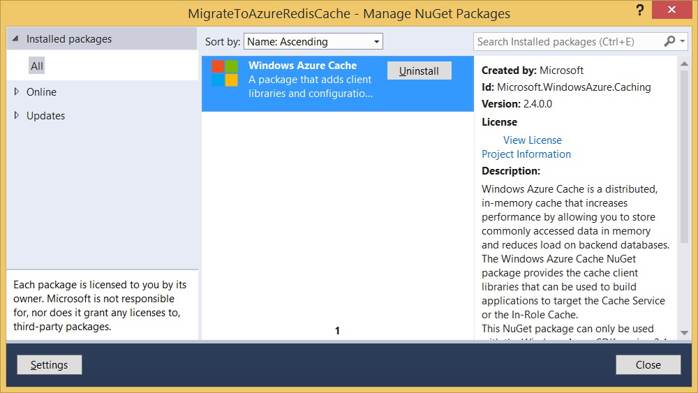

<properties 
    pageTitle="Migrieren von Cache zu Redis | Microsoft Azure"
    description="Informationen Sie zum Migrieren von Cache dienstanwendungen verwaltete Azure Redis Cache"
    services="redis-cache"
    documentationCenter="na"
    authors="steved0x"
    manager="douge"
    editor="tysonn" />
<tags 
    ms.service="cache"
    ms.devlang="na"
    ms.topic="article"
    ms.tgt_pltfrm="cache-redis"
    ms.workload="tbd"
    ms.date="09/30/2016"
    ms.author="sdanie" />

# Migrieren von verwalteten Cachediensts in Azure Redis Cache

Migrieren einer Anwendung, die Azure verwaltete Cachediensts Azure Redis Cache verwenden kann mit minimalen Änderungen an Ihrer Anwendung, je nach den Cachediensts verwaltete Features, die von der Anwendung Zwischenspeichern verwendeten erfolgen. Während die APIs nicht identisch sind ähnlich und viele Ihrer vorhandenen Code, der Cachediensts verwaltet wird verwendet, um einen Cache zugreifen, die mit minimalen Änderungen wiederverwendet werden kann. In diesem Thema veranschaulicht, wie die erforderlichen Konfigurationsschritte und Anwendung Änderungen Migrieren Ihrer verwaltete Cache-dienstanwendungen Azure Redis Cache verwendet werden kann, und zeigt, wie einige der Features von Azure Redis Cache zum Implementieren der Funktionen eines verwalteten Cachediensts Caches verwendet werden können.

## Die Migration – Schritte

Die folgenden Schritte sind erforderlich, zum Migrieren einer verwalteten Cachediensts-Anwendungs zu Azure Redis Cache verwenden.

-   Zuordnen von Cachediensts verwaltete Features zur Azure Redis Cache
-   Wählen Sie ein Angebot Cache
-   Erstellen Sie einen Cache
-   Konfigurieren der Cache-Clients
    -   Entfernen Sie die Dienstkonfiguration verwalteten Cache
    -   Konfigurieren eines Cache-Clients mithilfe der StackExchange.Redis NuGet-Paket
-   Migrieren von Cachediensts verwalteten code
    -   Herstellen einer Verbindung mit der Klasse ConnectionMultiplexer im Cache mit
    -   Access-Grunddatentypen im cache
    -   Arbeiten Sie mit .NET Objekte im cache
-   Migrieren von ASP.NET Session State und Zwischenspeichern der Ausgabe Azure Redis Cache 

## Zuordnen von Cachediensts verwaltete Features zur Azure Redis Cache

Azure Cachediensts verwaltet und Azure Redis Cache ähneln, jedoch einige deren Features auf unterschiedliche Weise implementieren. In diesem Abschnitt werden einige der Unterschiede beschrieben, und erfahren Sie, klicken Sie auf die Features von verwalteten Cachediensts in Azure Redis Cache implementieren.

|Verwaltete Cachediensts-Funktion|Verwaltete Cachediensts support|Azure Cache Redis support|
|---|---|---|
|Benannten caches|Ein Standardcache konfiguriert ist, und im Cache Standard- und Premium Angebote, bis zu neun zusätzliche benannten Caches gegebenenfalls konfiguriert werden können.|Azure Redis Caches verfügen über eine konfigurierbare Anzahl von Datenbanken (Standard von 16), die verwendet werden können, um eine ähnliche Funktionalität benannten Caches implementieren. Weitere Informationen finden Sie unter [Redis Standard-Server-Konfiguration](cache-configure.md#default-redis-server-configuration).|
|Hohe Verfügbarkeit|Hohe Verfügbarkeit bereitgestellt für Elemente im Cache in der Standard- und Premium Cache Angebote. Wenn Elemente aufgrund eines Fehlers verloren gehen, sind Sicherungskopien der Elemente im Cache weiterhin verfügbar. In der sekundäre Cache schreibt wurden synchron vorgenommen.|Hohe Verfügbarkeit ist in der Standard- und Premium Cache Angebote, denen eine Konfiguration mit zwei Knoten primär/Replikat (jedes Shard in einem Cache Premium hat ein paar primär/Replikat) verfügbar. Schreibt an die wurden asynchrone vorgenommen. Weitere Informationen finden Sie unter [Azure Redis Cache Preise](https://azure.microsoft.com/pricing/details/cache/).|
|Benachrichtigungen|Ermöglicht Clients asynchrone Benachrichtigungen erhalten, wenn eine Vielzahl von Cache Vorgänge auf einem benannten Cache auftreten.|Clientanwendungen können Redis Pub/Sub oder [Benachrichtigungen Schlüssellänge zur Verfügung](cache-configure.md#keyspace-notifications-advanced-settings) verwenden, um eine ähnliche Funktionalität Benachrichtigungen zu erzielen.|
|Lokalen cache|Speichert eine Kopie der zwischengespeicherten Objekte lokal für besonders schnellen Zugriff auf dem Client.|Clientanwendungen müssten diese Funktionalität mithilfe einer Wörterbuch oder ähnliche Datenstruktur implementieren.|
|Entfernung Richtlinie|Keine LRU. Die Standardrichtlinie ist LRU.|Azure Redis Cache unterstützt folgende Richtlinien für den Entfernung: permanenten-Lru, Allkeys-Lru, permanenten Zufallszahl, Allkeys-Zufallszahlen permanenten Ttl Noeviction. Die Standardrichtlinie ist permanenten-Lru. Weitere Informationen finden Sie unter [Redis Standard-Server-Konfiguration](cache-configure.md#default-redis-server-configuration).|
|Ablaufrichtlinie|Die standardmäßige Ablaufrichtlinie ist der Absolute und das standardmäßige Ablaufintervall beträgt zehn Minuten. Gleitende und nie Richtlinien stehen auch zur Verfügung.|Standardmäßig Elemente im Cache laufen nicht, aber ein Benutzerkennwort mit Cache festlegen überladenen pro schreiben einzelne konfiguriert werden kann. Weitere Informationen finden Sie unter [Hinzufügen und Abrufen von Objekten aus dem Cache](cache-dotnet-how-to-use-azure-redis-cache.md#add-and-retrieve-objects-from-the-cache).|
|Regionen und kategorisieren|Bereiche sind Untergruppen für zwischengespeicherte Elemente. Bereiche unterstützt auch Anmerkungen von zwischengespeicherten Elementen mit zusätzlichen beschreibenden Zeichenfolgen Tags bezeichnet. Bereiche unterstützt die Möglichkeit zum Ausführen von Suchvorgängen auf eine beliebige markierte Elemente in diesem Bereich. Alle Elemente in einem Bereich befinden sich in einem einzelnen Knoten im Cache Cluster.|Ein Redis Cache besteht aus einem einzelnen Knoten (es sei denn, Redis Cluster aktiviert ist), damit des Konzepts der Cachediensts verwaltete Regionen nicht angewendet werden kann. Unterstützt die Suche und Platzhalterzeichen Vorgänge redis, beim Abrufen von Tasten, sodass beschreibenden Tags in den Namen der Schlüssel eingebettet und verwendet, um die Elemente später abrufen können. Ein Beispiel für die Implementierung einer tagging Lösung Redis verwenden finden Sie unter [Cache in Verbindung mit Redis implementieren](http://stackify.com/implementing-cache-tagging-redis/).|
|Serialisierung|Verwaltete Cache unterstützt NetDataContractSerializer, BinaryFormatter und die Verwendung von benutzerdefinierten Serialisierungsprogrammen. Die Standardeinstellung ist NetDataContractSerializer.|Es ist den Zuständigkeitsbereich der Clientanwendung .NET Objekte serialisieren, bevor Sie sie in den Cache, mit der Auswahl des Serialisierungsprogramms bis Entwickler der Client-Anwendung zu platzieren. Weitere Informationen und Beispiel-Code finden Sie unter [Arbeiten mit .NET Objekte im Cache](cache-dotnet-how-to-use-azure-redis-cache.md#work-with-net-objects-in-the-cache).|
| Cache emulator | Verwaltete Cache bietet einen lokalen Cache Emulator. | Azure Redis Cache verfügt nicht über einen Emulator, aber Sie können [die MSOpenTech Erstellen von Redis-server.exe lokal ausführen](cache-faq.md#cache-emulator) , um ein Emulator zu unterstützen. |

## Wählen Sie ein Angebot Cache

Microsoft Azure Redis Cache ist in den folgenden Ebenen verfügbar:

-   **Grundlegende** – einzelnen Knoten. Vielfache Größen bis zu 53 GB.
-   **Standard** – zwei Knoten primär/Replikat. Vielfache Größen bis zu 53 GB. 99,9 VEREINBARUNG ZUM SERVICELEVEL %.
-   **Premium** – zwei Knoten primär/Replikat mit bis zu 10 mehrere Shards hinweg. Mehrere Größen von 6 GB zu 530 GB (wenden Sie sich an uns Weitere). Alle Ebenen Standard-Funktionen und weitere einschließlich Unterstützung für [Redis Cluster](cache-how-to-premium-clustering.md), [dauerhaften Redis](cache-how-to-premium-persistence.md)und [Azure-virtuellen Netzwerk](cache-how-to-premium-vnet.md). 99,9 VEREINBARUNG ZUM SERVICELEVEL %.

Pro Ebene unterscheidet sich in Bezug auf die Features und Preise. Die Features werden weiter unten in diesem Handbuch, sowie weitere Informationen zu Preisen behandelt, finden Sie unter [Cache Preise Details](https://azure.microsoft.com/pricing/details/cache/).

Diese als Ausgangsbasis für die Migration besteht darin wählen Sie den Schriftgrad, der die Größe der vorherigen Cachediensts verwaltete Cache entspricht, und klicken Sie dann je nach den Anforderungen Ihrer Anwendung zu skalieren nach oben oder unten. Weitere Hilfe bei der Auswahl des richtigen Azure Redis Cache Angebots, finden Sie unter [welche Redis Cache Angebot und Größe sollte ich verwenden?](cache-faq.md#what-redis-cache-offering-and-size-should-i-use).

## Erstellen Sie einen Cache

[AZURE.INCLUDE [redis-cache-create](../../includes/redis-cache-create.md)]

## Konfigurieren der Cache-Clients

Sobald der Cache erstellt und konfiguriert ist, wird im nächste Schritt besteht darin, die verwaltete Cache Dienstkonfiguration entfernen, und fügen Sie das Hinzufügen der Konfiguration Azure Redis Cache und verweisen, damit Kunden Cache Cache zugreifen können.

-   Entfernen Sie die Dienstkonfiguration verwalteten Cache
-   Konfigurieren eines Cache-Clients mithilfe der StackExchange.Redis NuGet-Paket

### Entfernen Sie die Dienstkonfiguration verwalteten Cache

Bevor Sie die Clientanwendungen können Azure Redis Cache, die vorhandene verwaltete Cache Dienstkonfiguration konfiguriert werden, und Verweise auf Assemblys müssen entfernt werden, indem Sie das verwaltete Cache Dienst NuGet-Paket deinstallieren.

Deinstallieren das verwaltete Cache Dienst NuGet-Paket, mit der rechten Maustaste im Client-Projekts im **Solution Explorer** , und wählen Sie **NuGet-Pakete verwalten**. Wählen Sie den Knoten **Installierte Pakete** aus, und geben Sie W**indowsAzure.Caching** in das Suchfeld der installierten Pakete. Wählen Sie aus **Windows** **Azure-Cache** (oder **Windows** **Azure Zwischenspeichern** , je nach der Version von NuGet-Paket), klicken Sie auf **Deinstallieren**, und klicken Sie dann auf **Schließen**.

Deinstallieren das verwaltete Cache Dienst NuGet-Paket entfernt die Cachediensts verwaltete Assemblys und die Einträge im Cache verwaltet in der app.config oder web.config der Clientanwendung. Da einige benutzerdefinierten Einstellungen nicht entfernt werden können, wenn das NuGet-Paket deinstallieren, öffnen Sie web.config oder app.config, und stellen Sie sicher, dass die folgenden Elemente vollständig entfernt werden.

Sicherstellen, dass die `dataCacheClients` Eintrag wird entfernt, aus der `configSections` Element. Entfernen Sie nicht die gesamte `configSections` Element. Entfernen Sie einfach die `dataCacheClients` Eintrag, wenn er vorhanden ist.

    <configSections>
      <!-- Existing sections omitted for clarity. -->
      <section name="dataCacheClients"type="Microsoft.ApplicationServer.Caching.DataCacheClientsSection, Microsoft.ApplicationServer.Caching.Core" allowLocation="true" allowDefinition="Everywhere"/>
    </configSections>

Sicherstellen, dass die `dataCacheClients` Abschnitt wird entfernt. Die `dataCacheClients` Abschnitt werden ähnlich wie im folgenden Beispiel.

    <dataCacheClients>
      <dataCacheClientname="default">
        <!--To use the in-role flavor of Azure Cache, set identifier to be the cache cluster role name -->
        <!--To use the Azure Managed Cache Service, set identifier to be the endpoint of the cache cluster -->
        <autoDiscoverisEnabled="true"identifier="[Cache role name or Service Endpoint]"/>

        <!--<localCache isEnabled="true" sync="TimeoutBased" objectCount="100000" ttlValue="300" />-->
        <!--Use this section to specify security settings for connecting to your cache. This section is not required if your cache is hosted on a role that is a part of your cloud service. -->
        <!--<securityProperties mode="Message" sslEnabled="true">
          <messageSecurity authorizationInfo="[Authentication Key]" />
        </securityProperties>-->
      </dataCacheClient>
    </dataCacheClients>

Sobald die verwaltete Cache Dienstkonfiguration entfernt wird, können Sie den Cacheclient konfigurieren, wie im folgenden Abschnitt beschrieben.

### Konfigurieren eines Cache-Clients mithilfe der StackExchange.Redis NuGet-Paket

[AZURE.INCLUDE [redis-cache-configure](../../includes/redis-cache-configure-stackexchange-redis-nuget.md)]

## Migrieren von Cachediensts verwalteten code

Die API für den StackExchange.Redis Cacheclient ähnelt der Cachediensts verwaltet. Dieser Abschnitt enthält eine Übersicht über die Unterschiede.

### Herstellen einer Verbindung mit der Klasse ConnectionMultiplexer im Cache mit

In Cachediensts verwaltete Verbindungen mit dem Cache behandelt wurden, indem die `DataCacheFactory` und `DataCache` Klassen. In Azure Redis Cache, werden diese Verbindungen von verwaltet die `ConnectionMultiplexer` Class.

Fügen Sie die folgende using-Anweisung an den Anfang aller Dateien aus der Sie den Cache zugreifen möchten.

    using StackExchange.Redis
                                
Wenn dieser Namespace nicht behoben wird, achten Sie darauf, dass Sie das StackExchange.Redis NuGet-Paket hinzugefügt haben, wie in [den Cache Clients konfigurieren](cache-dotnet-how-to-use-azure-redis-cache.md#configure-the-cache-clients)beschrieben.

>[AZURE.NOTE] Beachten Sie, dass der Client StackExchange.Redis .NET Framework 4 oder höher ist erforderlich.

Rufen Sie die Verbindung zu einer Instanz Azure Redis Cache die statische `ConnectionMultiplexer.Connect` Methode, und übergeben den Endpunkt und -Taste. Eine Möglichkeit zum Freigeben einer `ConnectionMultiplexer` Instanz in Ihrer Anwendung besteht darin, eine statische Eigenschaft, die eine verbundene Instanz, ähnlich wie im folgenden Beispiel gibt. Auf diese Weise Thread-sicher nur ein einzelnes verbunden Initialisierung `ConnectionMultiplexer` Instanz. In diesem Beispiel `abortConnect` auf False, was bedeutet, dass der Anruf erfolgreich ist, auch wenn keine Verbindung zum Cache hergestellt wird festgelegt ist. Eine der wichtigsten Features von `ConnectionMultiplexer` besteht darin, dass Connectivity automatisch an den Cache einmal das Netzwerkproblem wiederherstellen wird oder andere Ursachen aufgelöst werden.

    private static Lazy<ConnectionMultiplexer> lazyConnection = new Lazy<ConnectionMultiplexer>(() =>
    {
        return ConnectionMultiplexer.Connect("contoso5.redis.cache.windows.net,abortConnect=false,ssl=true,password=...");
    });
    
    public static ConnectionMultiplexer Connection
    {
        get
        {
            return lazyConnection.Value;
        }
    }

Der Endpunkt Cache, Tasten und Ports können aus dem **Cache Redis** Blade für Ihre Cacheinstanz abgerufen werden. Weitere Informationen finden Sie unter [Cache Redis Eigenschaften](cache-configure.md#properties).

Nachdem die Verbindung hergestellt wurde, einen Verweis auf die Redis-Cache-Datenbank zurückkehren, indem die `ConnectionMultiplexer.GetDatabase` Methode. Das Objekt, das zurückgegeben wird, aus der `GetDatabase` Methode wird ein einfaches Pass-Through-Objekt und nicht gespeichert werden müssen.

    IDatabase cache = Connection.GetDatabase();
    
    // Perform cache operations using the cache object...
    // Simple put of integral data types into the cache
    cache.StringSet("key1", "value");
    cache.StringSet("key2", 25);
    
    // Simple get of data types from the cache
    string key1 = cache.StringGet("key1");
    int key2 = (int)cache.StringGet("key2");

Der StackExchange.Redis-Client verwendet die `RedisKey` und `RedisValue` Datentypen für den Zugriff auf und Speichern von Elementen im Cache. Diese Dateitypen zuordnen auf nahezu Sprache Grundtypen, einschließlich der Zeichenfolge an, und häufig sind nicht direkt verwendet. Redis Zeichenfolgen sind die einfachste Art von Redis Wert und können viele Arten von Daten, einschließlich serialisierte binäre Streams, enthalten und während Sie den Typ nicht direkt verwenden können, verwenden Sie Methoden, die enthalten `String` in den Namen. Für die meisten primitiven Datentypen speichern und Abrufen von Elementen aus dem Cache mithilfe der `StringSet` und `StringGet` Methoden, es sei denn, die Websitesammlungen oder andere Datentypen Redis im Cache gespeichert sind. 

`StringSet`und `StringGet` sind sehr ähnlich des verwalteten Cachediensts `Put` und `Get` Methoden, mit einem wichtigen Unterschied, dass Sie vor dem Einrichten und ein Objekt .NET in den Cache erhalten Sie es zuerst serialisieren müssen. 

Beim Aufrufen von `StringGet`, wenn das Objekt vorhanden ist, wird es zurückgegeben und Null wird zurückgegeben, wenn dies nicht der Fall. In diesem Fall können Sie den Wert aus der Quelle für die gewünschten Daten abzurufen und im Cache zur späteren Verwendung zu speichern. Dies wird als Cache-Aside Muster bezeichnet.

Um den Ablauf eines Elements im Cache angeben möchten, verwenden Sie die `TimeSpan` Parameter der `StringSet`.

    cache.StringSet("key1", "value1", TimeSpan.FromMinutes(90));

Azure Redis Cache mit .NET Objekte als auch einfache Datentypen arbeiten können, aber bevor ein Objekt .NET zwischengespeichert werden kann es serialisiert werden muss. Dies ist der Zuständigkeitsbereich Entwickler der Anwendung. Dadurch werden die Entwicklertools Flexibilität bei der Auswahl des Serialisierungsprogramms. Weitere Informationen und Beispiel-Code finden Sie unter [Arbeiten mit .NET Objekte im Cache](cache-dotnet-how-to-use-azure-redis-cache.md#work-with-net-objects-in-the-cache).

## Migrieren von ASP.NET Session State und Zwischenspeichern der Ausgabe Azure Redis Cache

Anbieter für ASP.NET Session State und Zwischenspeichern der Seite Ausgabe verfügt Azure Redis Cache Zum Migrieren von Ihrer Anwendungs, die die verwaltete Cachediensts Versionen dieser Anbieter verwendet, entfernen Sie zuerst die vorhandenen Abschnitten aus Ihrer web.config, und konfigurieren Sie die Azure Redis Cache Versionen der Anbieter. Anweisungen Azure Redis Cache ASP.NET-Anbieter verwenden finden Sie unter [ASP.NET Session State Provider für Azure Redis Cache](cache-aspnet-session-state-provider.md) und [ASP.NET Ausgabe-Cache-Anbieter für Azure Redis Cache](cache-aspnet-output-cache-provider.md).

## Nächste Schritte

Untersuchen der [Dokumentation Azure Redis Cache](https://azure.microsoft.com/documentation/services/cache/) für Lernprogramme, Beispiele, Videos und vieles mehr.

