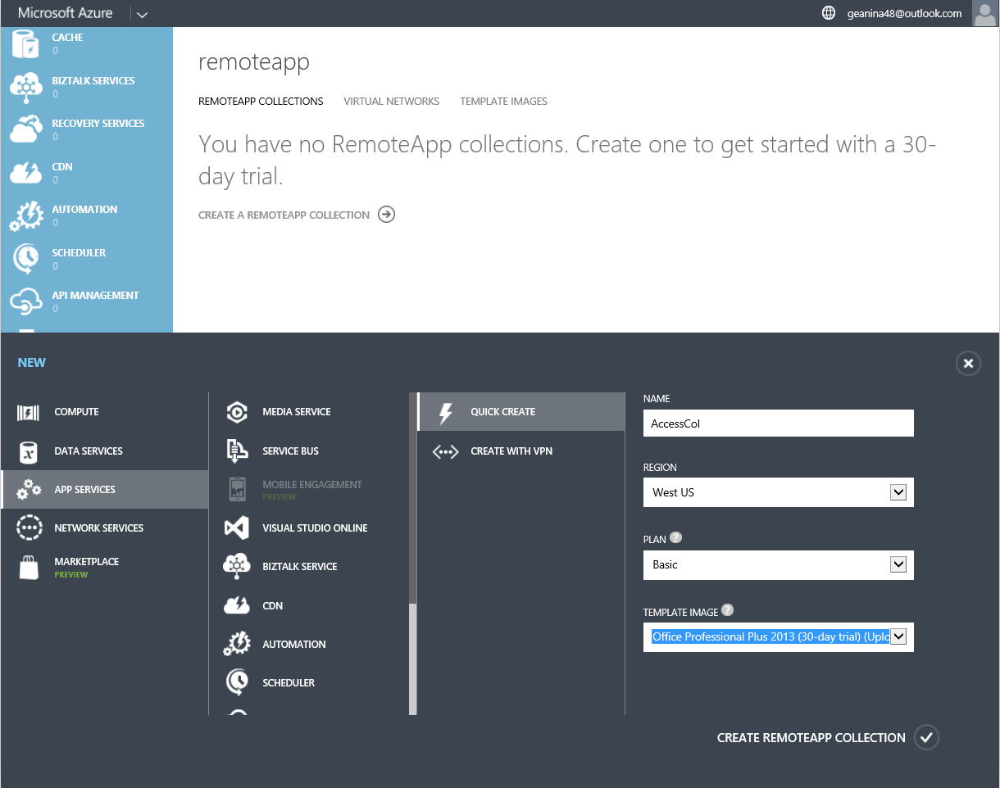
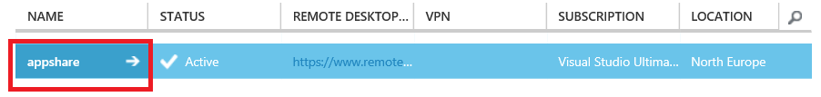
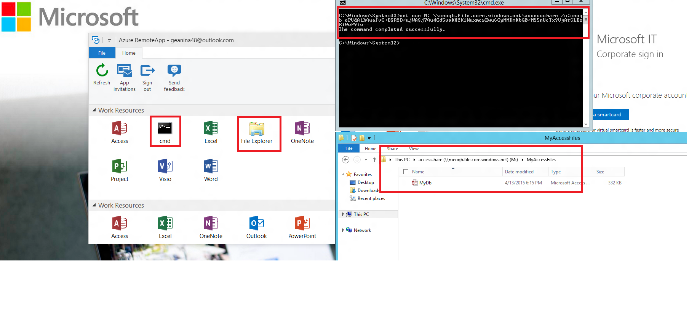

<properties
   pageTitle="Führen Sie eine beliebige Windows-app auf jedem Gerät mit Azure RemoteApp | Microsoft Azure"
   description="Erfahren Sie, wie eine beliebige Windows-app für Ihre Benutzer freizugeben, mithilfe von Azure RemoteApp."
   services="remoteapp"
   documentationCenter=""
   authors="lizap"
   manager="mbaldwin"
   editor=""/>

<tags
   ms.service="remoteapp"
   ms.devlang="na"
   ms.topic="hero-article"
   ms.tgt_pltfrm="na"
   ms.workload="compute"
   ms.date="08/15/2016"
   ms.author="elizapo"/>

# Führen Sie eine beliebige Windows-app auf jedem Gerät mit Azure RemoteApp

> [AZURE.IMPORTANT]
> Azure RemoteApp ist nicht mehr verwendet werden. Lesen Sie die Details der [Ankündigung](https://go.microsoft.com/fwlink/?linkid=821148) .

Sie können an einer beliebigen Stelle eine Windows-Anwendung auf jedem Gerät sofort, sehr ernst - ausführen, indem Sie einfach mit Azure RemoteApp. Ob sie eine benutzerdefinierte Anwendung vor 10 Jahren geschrieben oder eine Office-Anwendung ist, müssen die Benutzer nicht mehr auf ein bestimmtes Betriebssystem (wie Windows XP) für diese einige Applikationen verknüpft werden.

Mit Azure RemoteApp können die Benutzer auch eigene Android oder Apple-Geräte verwenden und erhalten sie unter Windows (oder unter Windows Phones) auf Ihrem System genauso. Dies geschieht durch Hosten der Windows-Anwendung in eine Auflistung von auf Azure-virtuellen Computern Windows – können die Benutzer greifen sie von überall eine Verbindung zum Internet besteht. 

Lesen Sie weiter ein Beispiel genau wie Sie dies tun.

In diesem Artikel werden wir zum Freigeben von Access für alle Mitglieder. Sie können jedoch eine beliebige app verwenden. Solange Sie Ihre app auf einem Windows Server 2012 R2 Computer installieren können, können Sie es mit folgenden Schritten freigeben. Überprüfen Sie die [app-Anforderungen](remoteapp-appreqs.md) , um sicherzustellen, dass Ihre app funktionieren.

Bitte beachten Sie, dass, da Access eine Datenbank ist, und die Datenbank nützlich sein sollen, wir ein paar zusätzliche Schritte Benutzern den Zugriff zulassen, dass die Freigabe der Access-Daten tun werden wird. Wenn die app keiner Datenbank ist, oder Sie nicht erforderlich, dass die Benutzer eine Dateifreigabe zugreifen können, können Sie diese Schritte in diesem Lernprogramm überspringen.

> [AZURE.NOTE] Benötigen Sie ein Azure-Konto zum Bearbeiten dieses Lernprogramms:
> - Sie können [ein Azure-Konto kostenlos öffnen](https://azure.microsoft.com/free/?WT.mc_id=A261C142F): Abrufen von Gutschriften können Sie kostenpflichtiges Azure Services ausprobieren und sogar nachdem sie es gewohnt sind bis können Sie das Konto behalten und Verwendung frei Azure Dienste, wie z. B. Websites. Ihre Kreditkarte wird nie belastet, sofern Sie explizit der Einstellungen für ändern und festlegen, dass Sie in Rechnung gestellt.
> - Können Sie die [Vorteile der MSDN-Abonnent aktivieren](https://azure.microsoft.com/pricing/member-offers/msdn-benefits-details/?WT.mc_id=A261C142F): Ihr MSDN-Abonnement bietet Ihnen Gutschriften jeden Monat, die Sie für kostenpflichtiges Azure-Dienste verwenden können.

## Erstellen einer Websitesammlung in RemoteApp

Starten Sie durch Erstellen einer Websitesammlungs. Die Sammlung dient als Container für Ihre apps und Benutzer. Jede Websitesammlung basiert auf ein Bild – Sie können eigene Farbschemas erstellen oder verwenden Sie eine der in Ihrem Abonnement inbegriffen. In diesem Lernprogramm verwenden wir das Office 2013-Testversion Bild – es enthält die app, die wir gemeinsam nutzen möchten.

1. Im Azure-Portal führen Sie einen Bildlauf nach unten in der linken Navigationsstruktur bis RemoteApp angezeigt wird. Öffnen Sie das Zeichenblatt.
2. Klicken Sie auf **Erstellen einer Websitesammlung RemoteApp**.
3. Klicken Sie auf **Quick erstellen** , und geben Sie einen Namen für Ihre Websitesammlung.
4. Wählen Sie die Region ein, die Sie verwenden, um Ihre Sammlung erstellen möchten. Wählen Sie für optimale Ergebnisse das Region, das geografischen der Position am nächsten ist, in dem die Benutzer die app zugreifen. Beispielsweise werden in diesem Lernprogramm Benutzer in Redmond, Washington befinden. Die nächste Azure Region liegt **Westen US**
5. Wählen Sie den Abrechnung Plan, die, den Sie verwenden möchten. Der grundlegende Abrechnung Plan verschoben 16 Benutzer einer großen Azure virtuellen Computers zwar der standard Abrechnung Plan einer großen Azure-virtuellen Computers 10 Benutzer verfügt. Als eine allgemeine Beispiel funktioniert der grundlegende Plan großartig für Daten Eintragstyp Workflow an. Für eine app Produktivität, wie Office sollten Sie den standard-Plan.
6. Wählen Sie abschließend das Office 2013 Professional Bild ein. Diese Abbildung enthält apps für Office 2013. Nur eine Erinnerung – diese Abbildung ist nur für Websitesammlungen zur Testversion und-Ausgereiftheit gute. Sie ' können dieses Bild in einer Websitesammlung Herstellung verwenden.
7. Klicken Sie nun auf **Erstellen RemoteApp-Sammlung**.

Hierdurch wird der Websitesammlung erstellen, aber es kann bis zu einer Stunde dauern.

Jetzt sind Sie bereit sind, Ihre Benutzer hinzufügen.

## Freigeben der app für Benutzer

Nachdem Sie Ihre Sammlung erfolgreich erstellt wurde, ist es Zeit zum Veröffentlichen von Access für Benutzer, und fügen Sie die Benutzer, die darauf zugreifen können soll.

Wenn Sie während der Erstellung der Auflistung nicht an den Knoten Azure RemoteApp navigiert sind, starten Sie, indem Sie zurecht zurück zur Startseite der Azure machen.

2. Klicken Sie auf die Auflistung, die Sie Zugriff auf Weitere Optionen, und konfigurieren Sie die Gruppe früheren erstellt.

3. Klicken Sie auf der Registerkarte **Veröffentlichen** klicken Sie auf **Veröffentlichen** am unteren Rand des Bildschirms, und klicken Sie dann auf **Programme im Menü Start veröffentlichen**.

4. Wählen Sie die apps, die Sie aus der Liste veröffentlichen möchten. Für unsere Zwecke entschieden wir uns Access. Klicken Sie auf **abgeschlossen**. Warten Sie auf die apps, um die Veröffentlichung abzuschließen.

1. Sobald die app für die Veröffentlichung, Kopf über zur Registerkarte **Des Benutzerzugriffs abgeschlossen ist** auf alle Benutzer hinzuzufügen, die Zugriff auf Ihre apps benötigen. Geben Sie den Namen (e-Mail-Adresse) Ihre Benutzer ein, und klicken Sie dann auf **Speichern**.

1. Nun ist es an der Zeit, informieren Ihre Benutzer über die neuen apps und wie darauf zugreifen. Hierzu senden Sie Ihre Benutzer eine e-Mail-Nachricht auf der Remote Desktop-Client-Download-URL.

## Zugriff auf Access konfigurieren

Einige apps benötigen zusätzliche Konfiguration, nachdem Sie diese über RemoteApp bereitstellen. Vor allem für Access wird gezeigt, eine Dateifreigabe auf Azure zu erstellen, die jeder Benutzer zugreifen kann. (Wenn Sie nicht erledigen möchten, Sie können Erstellen einer [Websitesammlung Hybrid](remoteapp-create-hybrid-deployment.md) [statt unsere Cloud-Websitesammlung], in dem Ihre Benutzer können Zugriff auf Dateien und Informationen in Ihrem lokalen Netzwerk.) Klicken Sie dann müssen wir unsere Benutzer ein lokales Laufwerk, auf deren Computern Azure Dateisystem zuordnen zu informieren.

Im ersten Teil, die, den Sie als Administrator ausführen. Klicken Sie dann haben wir einige Schritte für Ihre Benutzer.

1. Zunächst die Veröffentlichung der Befehl-Oberfläche (cmd.exe). In der Registerkarte **Veröffentlichen** **Cmd**wählen Sie aus, und klicken Sie dann auf **Veröffentlichen > Veröffentlichen Programm mit Pfad**.
2. Geben Sie den Namen der app und den Pfad ein. Verwenden Sie für unsere Zwecke "Datei-Explorer" als Name und "% SYSTEMDRIVE%\windows\explorer.exe" als den Pfad ein.

3. Jetzt müssen Sie ein Azure- [Speicher-Konto](../storage/storage-create-storage-account.md)zu erstellen. Wir mit dem Namen unsere "Accessstorage", wählen Sie einen Namen ein, die Ihnen sinnvoll ist. (Um Highlander misquote, können bestehen nur ein "Accessstorage.") 
4. Jetzt kehren Sie zu Ihrem Dashboard, damit Sie den Pfad zu Ihrem Speicherort (Endpunkt) zugreifen können. Sie erhalten Hiermit in ein bisschen, daher sollten Sie sicherstellen, dass Sie an einer beliebigen Stelle kopieren.

5. Nachdem das Speicherkonto erstellt wurde, benötigen Sie als Nächstes die primäre Zugriffstaste an. Klicken Sie auf **Zugriffstasten verwalten**, und kopieren Sie die primäre Zugriffstaste.
6. Nun festlegen Sie den Kontext des Speicherkontos, und erstellen Sie eine neue Dateifreigabe für den Zugriff. Führen Sie die folgenden Cmdlets in einem erhöhten Windows PowerShell-Fenster ein:

        $ctx=New-AzureStorageContext <account name> <account key>
        $s = New-AzureStorageShare <share name> -Context $ctx

    Daher sind für unsere freigeben, diese die Cmdlets, das, die wir ausführen:

        $ctx=New-AzureStorageContext accessstorage <key>
        $s = New-AzureStorageShare <share name> -Context $ctx

Nun ist es des Benutzers aktivieren. Zuerst müssen Sie Ihre Benutzer einen [RemoteApp Client](remoteapp-clients.md)installieren. Als Nächstes müssen die Benutzer ein Laufwerk aus ihrem Konto, um die Azure Dateifreigabe erstellten zuordnen und die Zugriff auf Dateien hinzufügen. Dies ist er wie folgt:

1. Access-im RemoteApp-Client der veröffentlichten apps. Starten Sie das Programm cmd.exe ein.
2. Führen Sie den folgenden Befehl ein Laufwerk von Ihrem Computer, um die Dateifreigabe zuordnen:

        net use z: \\<accountname>.file.core.windows.net\<share name> /u:<user name> <account key>

    Wenn Sie den Parameter **/ beständigen** Ja festlegen, wird das zugeordnete Laufwerk über Sitzungen beibehalten.
1. Starten Sie nun die Datei-Explorer app RemoteApp. Kopieren Sie alle Access-Dateien, die Sie in der freigegebenen app auf die Dateifreigabe verwenden möchten.

1. Schließlich öffnen Sie Access, und öffnen Sie die Datenbank, die Sie gerade freigegeben. Die Daten in Access aus der Cloud unter sollte angezeigt werden.

Mittlerweile Zugriff auf Ihre Geräte - nur sicherzustellen Sie, dass Sie einen RemoteApp Client installieren.

<!--Every topic should have next steps and links to the next logical set of content to keep the customer engaged-->
## Nächste Schritte

Jetzt, da Sie eine Websitesammlung erstellen beherrschen, versuchen Sie, erstellen eine [Websitesammlung, die Office 365 verwendet](remoteapp-tutorial-o365anywhere.md). Oder erstellen Sie eine [Auflistung Hybrid ](remoteapp-create-hybrid-deployment.md), die Ihr lokale Netzwerk zugreifen können.

<!--Image references-->
 
