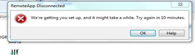
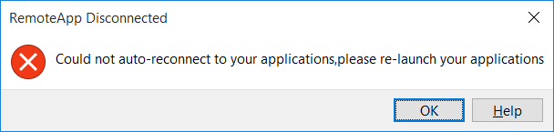
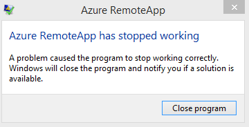
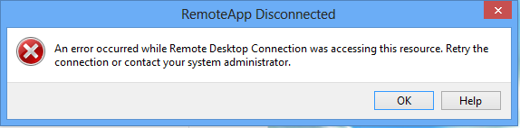

<properties 
    pageTitle="Problembehandlung bei Azure RemoteApp - Schnellstartleiste und Verbindung Anwendungsfehler | Microsoft Azure" 
    description="Informationen Sie zum Behandeln von Problemen mit starten und Verbindung mit Applications in Azure RemoteApp." 
    services="remoteapp" 
    documentationCenter="" 
    authors="ericorman" 
    manager="mbaldwin" />

<tags 
    ms.service="remoteapp" 
    ms.workload="compute" 
    ms.tgt_pltfrm="na" 
    ms.devlang="na" 
    ms.topic="article" 
    ms.date="08/15/2016" 
    ms.author="elizapo" />

#Behandeln von Problemen mit Azure RemoteApp - Anwendungsfehler Launch und Verbindung 

> [AZURE.IMPORTANT]
> Azure RemoteApp ist nicht mehr verwendet werden. Lesen Sie die Details der [Ankündigung](https://go.microsoft.com/fwlink/?linkid=821148) .

Applikationen in Azure RemoteApp gehostet können fehl, um es verschiedene Ursachen zu starten. In diesem Artikel werden verschiedene Ursachen und Fehlermeldungen Benutzer können auftreten, wenn beim Starten der Applications. Es spricht auch über Verbindungsfehlern. (Sie können jedoch in diesem Artikel beschreibt nicht Probleme beim Anmelden bei der RemoteApp Azure-Client.)  

Lesen Sie weiter Informationen allgemeine Fehlermeldungen aufgrund von app starten und Verbindung Fehlern.

##Wir haben Sie Einrichten von erste... Versuchen Sie es in 10 Minuten erneut.

Dieser Fehler bedeutet, dass Azure RemoteApp Skalierung nach oben, um Kapazität müssen Benutzer entsprechen. Im Hintergrund werden weitere Azure RemoteApp virtueller Computer Instanzen um Kapazität gerecht Benutzer erstellt. In der Regel dies dauert ungefähr fünf Minuten aber kann bis zu 10 Minuten dauern. Manchmal ist es nicht schnell genug erfolgen und Ressourcen sofort erforderlich sind. Beispielsweise ein 9 Uhr Szenario, in denen viele Benutzer Ihre app in Azure RemoteAppn zur gleichen Zeit zu verwenden müssen. Wenn dies auf Sie zutrifft, können wir **Kapazität Modus** Back-End aktivieren. Zweck ein Azure-Support-Ticket öffnen und oder uns eine e-Mail an [remoteappforum@microsoft.com](mailto:remoteappforum@microsoft.com). Werden Sie sicher, dass Ihr Abonnement-ID in der Besprechungsanfrage.  

## Konnte nicht automatisch verbinden den Clientanwendungen, wenden Sie sich bitte erneut starten Ihrer Anwendung  

Diese Fehlermeldung wird häufig angezeigt, wenn bisher Azure RemoteApp verwendet und setzen Sie Ihren Computer länger als 4 Stunden deaktiviert und dann aktiv sind Ihrem PC nach oben, und versuchen Sie der Azure RemoteApp Client automatisch wiederherzustellen und Timeout überschritten wurde.  Weisen Sie Benutzer an, navigieren Sie wieder zur Anwendung, und versuchen Sie, die sie im Desktopclient Azure RemoteApp zu öffnen.

 

## Probleme mit dem temp-Profil 

Dieser Fehler tritt auf, wenn der Benutzer erhalten ein temporäres Profil konnte nicht bereitgestellt werden Ihrem Benutzerprofil (Benutzer Profil Datenträger).  Administratoren sollten navigieren Sie zu der Sammlung Azure-Portal, und klicken Sie dann wechseln Sie zur Registerkarte **Sitzungen** und versucht, **Abmelden** den Benutzer. Dies wird erzwingen, dass ein vollständiges Protokoll vom Benutzer - Sitzung dann lassen Sie die Benutzer versuchen, eine app erneut zu starten. Wenn dies fehlschlägt Azure Support und oder uns eine e-Mail an [remoteappforum@microsoft.com](mailto:remoteappforum@microsoft.com).

## Azure RemoteApp funktioniert nicht mehr

Diese Fehlermeldung bedeutet, dass der Client Azure RemoteApp ist ein Problem Probleme und muss neu gestartet werden. Weisen Sie Benutzer zu schließen: Wählen Sie das **Programm schließen** aus, und starten Sie den Client Azure RemoteApp dann erneut.  Wenn das Problem weiterhin besteht, öffnen und Azure-Support-Ticket und oder uns eine e-Mail an [remoteappforum@microsoft.com](mailto:remoteappforum@microsoft.com).

  

## Remotedesktop-Verbindung Zugriff auf diese Ressource wurde, ist ein Fehler aufgetreten. Wiederholen Sie die Verbindung, oder wenden Sie sich an Ihren Systemadministrator

Dies ist eine allgemeine Fehlermeldung – Azure Support und oder uns eine e-Mail an [remoteappforum@microsoft.com](mailto:remoteappforum@microsoft.com) , damit wir ermitteln können. 

 