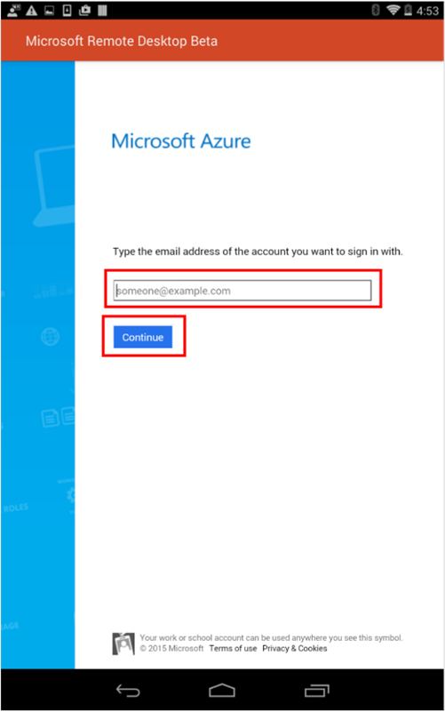
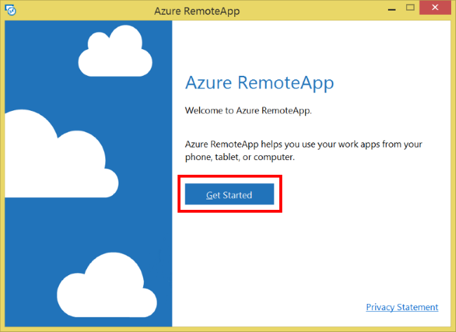
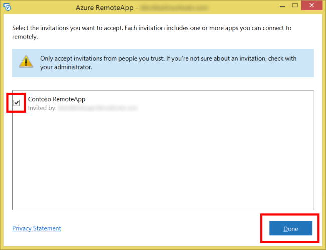
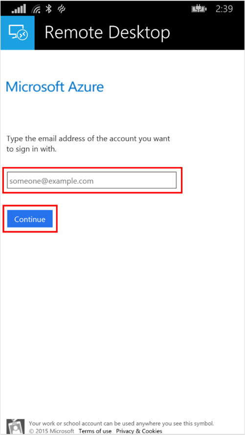
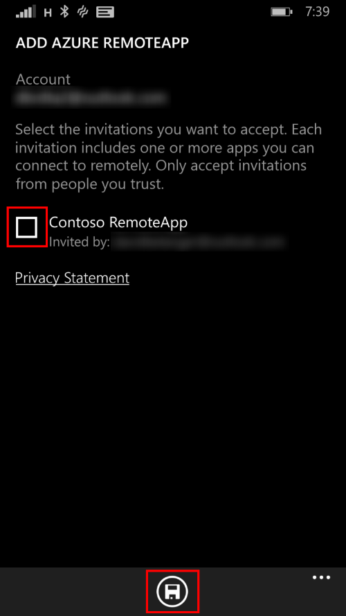

<properties
    pageTitle="Zugreifen auf Ihre apps aus einem beliebigen Gerät | Microsoft Azure"
    description="Erfahren Sie, welche Clients für Azure RemoteApp unterstützt werden und wie Sie Ihre apps zugreifen."
    services="remoteapp"
    documentationCenter=""
    authors="lizap"
    manager="mbaldwin" />

<tags
    ms.service="remoteapp"
    ms.workload="compute"
    ms.tgt_pltfrm="na"
    ms.devlang="na"
    ms.topic="article"
    ms.date="08/15/2016"
    ms.author="elizapo" />

# Zugreifen auf Ihre apps im Azure RemoteApp

> [AZURE.IMPORTANT]
> Azure RemoteApp ist nicht mehr verwendet werden. Lesen Sie die Details der [Ankündigung](https://go.microsoft.com/fwlink/?linkid=821148) .

Einer der Vorzüge bei der Azure RemoteApp ist, dass Sie von jedem Ihrer Geräte apps zugreifen können. Sie können sogar mit der Arbeit an einem Computer und nahtlos mit einem zweiten Gerät Übergabe und wählen Sie oben rechts, wo Sie aufgehört. Schritte müssen Sie den entsprechenden Client für Ihr Gerät herunterladen, und melden Sie sich bei dem Dienst.

In diesem Thema werden wir überprüfen Sie den aktuell unterstützten Clients und wie Sie sie herunterladen, bevor ich Sie aus jeder der Clients RemoteApp anmelden anzeigen.

## Unterstützte clients

Sie können zugreifen RemoteApp verwenden die folgenden Schritte aus, wenn Ihr Gerät eine der folgenden Betriebssysteme ausgeführt wird:

 - Windows-10 
 - Windows 8.1
 - Windows 8
 - Windows 7 Servicepack 1
 - Windows Phone 8.1
 - iOS
 - Mac OS X
 - Android

 Wissenswertes zu dünnen clients Die folgenden Windows Embedded dünnen Clients werden unterstützt:

- Windows Embedded Standard 7
- Windows Embedded-8 Standard
- Windows Embedded 8.1 Industry Pro
- Windows 10 IoT Enterprise

## Herunterladen des Clients

Unabhängig davon, welche Plattform, die Sie verwenden, kann der benötigten RemoteApp Zugriff auf Client auf der Seite [Remote Desktop Client herunterladen](https://www.remoteapp.windowsazure.com/ClientDownload/AllClients.aspx) gefunden werden.

Klicken auf die verschiedenen Links entweder direkt beginnt den Client herunterladen oder sendet, dass Sie an den Client-Seite im app Store für die betreffende Plattform herunterladen. Installieren Sie den Client anhand der Anweisungen auf dem Bildschirm.

Nachdem Sie den Kunden auf Ihrem Gerät installiert, und er gestartet, wechseln Sie zu der entsprechenden Abschnitt unten, um zu erfahren, wie diese Desktopclient RemoteApp anmelden.

## Android

Nachdem Sie die Microsoft Remote Desktop-app aus dem Google Play Store installiert haben, können Sie es in Ihre app-Liste unter **Remotedesktop**auffinden.

1. Starten die app Ruft die eines leeren Verbindung Centers, es sei denn, Sie bereits die app verwendet haben. Um mit Azure RemoteApp anzufangen, tippen Sie auf die hinzufügen Schaltfläche **"" +""** , und tippen Sie auf **Azure RemoteApp**. 

     

2. Sie müssen sich mit Ihrer e-Mail-Adresse, den Zugriff auf Dienste. Tippen Sie auf **Erste Schritte**.

    

3. Klicken Sie auf der nächsten Seite Geben Sie Ihre **e-Mail-Adresse** ein, und tippen Sie auf **Weiter**. Dies Anmeldevorgang die Anmeldung mit Azure Active Directory.

    

4. Folgen Sie den Anweisungen auf dem Bildschirm zu melden Sie sich mit Ihrem Microsoft-Konto (vormals "Live-ID" bezeichnet) oder Organisations-ID. Sobald Sie angemeldet haben, können Sie mit einer Seite mit der Liste alle Einladungen, die Sie erhalten haben bereitgestellt werden. Wenn Sie sind, wählen Sie die Einladungen Sie vertrauen, und tippen Sie auf **Fertig**. 

    

5. Nach dem Annehmen der Einladungen an, die Liste der apps, die, denen Sie Zugriff haben, auf Ihr Gerät heruntergeladen und in der Mitte der Verbindung zur Verfügung gestellt. Tippen Sie auf eine der apps zu arbeiten beginnen.

    

6. Wenn Sie eine Einladung noch nicht haben, können Sie den Dienst noch ausprobieren. Tippen Sie dazu auf **zur kostenlosen Testversion wechseln** , wenn Sie dazu aufgefordert werden.

    

7. Dadurch erhalten Sie Zugriff auf einen einfachen Satz von apps, um Ihnen den Einstieg in RemoteApp erhalten.

    

## iOS

Nachdem Sie die Microsoft Remote Desktop-app aus dem App Store installiert haben, können Sie es in Ihre app-Liste unter **RD-Client**auffinden.

1. Starten die app Ruft die eines leeren Verbindung Centers, es sei denn, Sie bereits die app verwendet haben. Um mit Azure RemoteApp anzufangen, tippen Sie auf die hinzufügen Schaltfläche **"" +""** , und tippen Sie auf **Azure RemoteApp hinzufügen**.

    

2. Sie müssen sich mit Ihrer e-Mail-Adresse den Zugriff auf Dienste, um den Prozess, starten Geben Sie Ihre **e-Mail-Adresse** und tippen Sie auf **Weiter**.

    

3. Folgen Sie den Anweisungen auf dem Bildschirm, um sich mit Ihrem Microsoft-Konto (Live ID) oder Organisation ID anmelden Sobald Sie angemeldet haben, können Sie mit einer Seite mit der Liste alle Einladungen, die Sie erhalten haben bereitgestellt werden. Wenn Sie sind, wählen Sie die Einladungen Sie vertrauen, und tippen Sie auf **Fertig**.

    

4. Nach dem Annehmen der Einladungen an, die Liste der apps, die, denen Sie Zugriff haben, auf Ihr Gerät heruntergeladen und in der Mitte der Verbindung zur Verfügung gestellt. Tippen Sie auf Starten Sie ihn, und verwenden sie die apps.

    

5. Wenn Sie eine Einladung noch nicht haben, können Sie den Dienst noch ausprobieren. Tippen Sie dazu auf **zur kostenlosen Testversion wechseln** , wenn Sie dazu aufgefordert werden.

    

6. Dadurch erhalten Sie Zugriff auf einen einfachen Satz von apps, um Ihnen den Einstieg in RemoteApp erhalten.

    

## Mac OS X

Nachdem Sie die Microsoft Remote Desktop-app aus dem App Store installiert haben, können Sie es in Ihre app-Liste unter **Microsoft Remote Desktop**auffinden.

1. Starten die app Ruft die eines leeren Verbindung Centers, es sei denn, Sie bereits die app verwendet haben. Um mit Azure RemoteApp anzufangen, klicken Sie auf die Schaltfläche **Azure RemoteApp** .

    

2. Sie müssen sich mit Ihrer e-Mail-Adresse den Zugriff auf Dienste, um den Prozess, starten **Erste Schritte**tippen.

    

3. Klicken Sie auf der nächsten Seite Geben Sie Ihre **e-Mail-Adresse** ein, und tippen Sie auf **Weiter**. Dadurch wird der Anmeldung mit Azure Active Directory Prozess gestartet.

    

4. Folgen Sie den Anweisungen auf dem Bildschirm, um sich mit Ihrem Microsoft-Konto (Live ID) oder Organisation ID anmelden Sobald Sie angemeldet haben, können Sie mit einer Seite mit der Liste alle Einladungen, die Sie erhalten haben bereitgestellt werden. Wenn Sie sind, wählen Sie die Einladungen Sie vertrauen, und schließen Sie das Dialogfeld.

    

5. Nach dem Annehmen der Einladungen an, die Liste der apps, die, denen Sie Zugriff haben, auf Ihr Gerät heruntergeladen und in der Mitte der Verbindung zur Verfügung gestellt. Doppelklicken Sie auf eine der starten Sie ihn, und verwenden sie die apps.

    

6. Wenn Sie eine Einladung noch nicht haben, können Sie den Dienst noch ausprobieren. Klicken Sie hierzu auf **zur kostenlosen Testversion wechseln** , wenn Sie dazu aufgefordert werden.

    

7. Dadurch erhalten Sie Zugriff auf einen einfachen Satz von apps, um Ihnen den Einstieg in RemoteApp erhalten.

    

## Windows-(alle unterstützten Versionen mit Ausnahme von Windows Phone)

Der Client wird automatisch gestartet, nachdem die Installation, jedoch wenn Sie darauf zugreifen müssen später es in Ihre app-Liste unter dem Namen **Azure RemoteApp**gefunden werden kann.

1. Ebenso den Client, der ersten Seite, die angezeigt werden, Ater Begrüßung Azure RemoteApp angezeigt. Klicken Sie auf die **Erste Schritte**, um den Vorgang fortzusetzen.

    

2. Die nächste Seite beginnt die Vorzeichen in Bearbeitung für Azure RemoteApp Azure Active Directory verwenden. Dieses Verfahren sollte aussehen vertraut, wenn Sie Microsoft Services in der Vergangenheit verwendet haben. Beginnen Sie, indem Sie Ihre **e-Mail-Adresse** eingeben, und klicken Sie auf **Weiter**.

    

3. Folgen Sie den Anweisungen auf dem Bildschirm, um sich mit Ihrem Microsoft-Konto (Live ID) oder Organisation ID anmelden Sobald Sie angemeldet haben, können Sie mit einer Seite mit der Liste alle Einladungen, die Sie erhalten haben bereitgestellt werden. Wenn Sie sind, wählen Sie die Einladungen Sie vertrauen, und klicken Sie auf **Fertig**.

    

4. Nach dem Annehmen der Einladungen an, die Liste der apps, die, denen Sie Zugriff haben, auf Ihr Gerät heruntergeladen und in der Mitte der Verbindung zur Verfügung gestellt. Doppelklicken Sie auf eine der starten Sie ihn, und verwenden sie die apps.

    

5. Wenn keine noch eine Einladung gesendet hat, keine Sorge wir haben Sie verdeckt! Sie haben weiterhin Zugriff auf eine Auflistung Demo, damit Sie den Dienst testen können.

    

## Windows Phone 8.1

Nachdem Sie die Microsoft Remote Desktop-app aus dem Windows Phone 8.1 Store installiert haben, können Sie es in Ihre app-Liste unter **Remotedesktop**auffinden.

1. Starten die app gelangen Sie ist direkt mit einem leeren Verbindung Center, es sei denn, Sie bereits die app verwendet haben. Um mit Azure RemoteApp anzufangen, tippen Sie auf die hinzufügen Schaltfläche **"" +""** am unteren Rand des Bildschirms.

    

2. Tippen Sie auf Weiter, klicken Sie auf **Azure RemoteApp**.

    

3. Sie müssen sich mit Ihrer e-Mail-Adresse den Zugriff auf Dienste, um den Prozess, starten **Verbinden**tippen.

    

4. Klicken Sie auf der nächsten Seite Geben Sie Ihre **e-Mail-Adresse** ein, und tippen Sie auf **Weiter**. Dadurch wird der Anmeldung mit Azure Active Directory Prozess gestartet.

    

5. Folgen Sie den Anweisungen auf dem Bildschirm, um sich mit Ihrem Microsoft-Konto (Live ID) oder Organisation ID anmelden Sobald Sie angemeldet haben, können Sie mit einer Seite mit der Liste alle Einladungen, die Sie erhalten haben bereitgestellt werden. Wenn Sie sind, wählen Sie die Einladungen Sie vertrauen, und tippen Sie auf **Speichern**.

    

6. Nach dem Annehmen der Einladungen an, die Liste der apps, die, denen Sie Zugriff haben, auf Ihr Gerät heruntergeladen und in der Mitte der Verbindung zur Verfügung gestellt. Tippen Sie auf Starten Sie ihn, und verwenden sie die apps.

    

7. Wenn Sie eine Einladung noch nicht haben, können Sie den Dienst noch ausprobieren. Um dies zu tun, tippen Sie auf **Ja,** Wenn Sie dazu aufgefordert werden.

    

8. Dadurch erhalten Sie Zugriff auf einen einfachen Satz von apps, um Ihnen den Einstieg in RemoteApp erhalten.

    
 