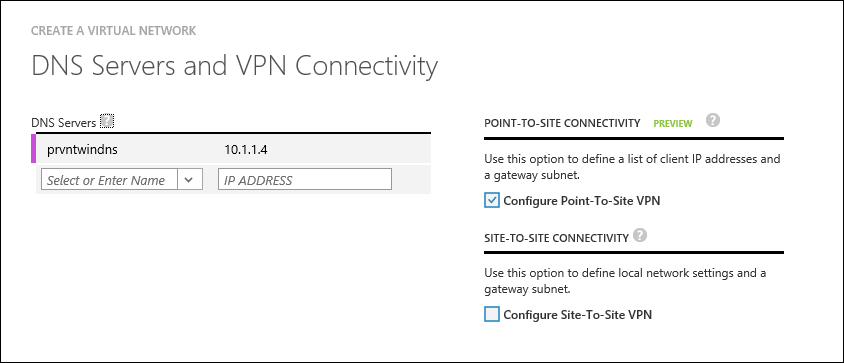

<properties
    pageTitle="Behandeln von Problemen mit erstellen RemoteApp Hybrid Websitesammlungen | Microsoft Azure"
    description="Informationen Sie zum Behandeln von Problemen mit der RemoteApp Hybrid Websitesammlung Erstellung Fehlern"
    services="remoteapp"
    documentationCenter=""
    authors="vkbucha"
    manager="mbaldwin" />

<tags
    ms.service="remoteapp"
    ms.workload="compute"
    ms.tgt_pltfrm="na"
    ms.devlang="na"
    ms.topic="article"
    ms.date="08/15/2016"
    ms.author="elizapo" />

# Behandeln von Problemen mit erstellen Azure RemoteApp Hybrid Websitesammlungen

> [AZURE.IMPORTANT]
> Azure RemoteApp ist nicht mehr verwendet werden. Lesen Sie die Details der [Ankündigung](https://go.microsoft.com/fwlink/?linkid=821148) .

Eine Auflistung Hybrid in gehostet wird, und speichert die Daten in der Cloud Azure aber auch ermöglicht Benutzern Zugriff auf Daten und Ressourcen, die in Ihrem lokalen Netzwerk gespeichert. Benutzer können apps durch Anmelden mit ihrer corporate synchronisiert oder Verbund mit Azure Active Directory-Anmeldeinformationen zugreifen. Sie können eine Hybrid-Auflistung, die einem vorhandenen Azure-virtuellen Netzwerk verwendet bereitstellen, oder Sie können ein neues virtuelles Netzwerk erstellen. Es empfiehlt sich, dass Sie erstellen, oder verwenden ein virtuelles Netzwerksubnetz mit einem CIDR Bereich groß genug für erwarteten zukünftiges Wachstum für Azure RemoteApp.

Werden um Ihre Sammlung noch nicht geschehen ist erstellt? Die Schritte finden Sie unter [Erstellen einer Hybrid-Sammlung](remoteapp-create-hybrid-deployment.md) .

Wenn Sie Probleme beim Erstellen der Websitesammlung oder, wenn die Sammlung wie gewünscht funktioniert nicht zur Verfügung stellen Sie denken, dass es sollte, schauen Sie sich die folgenden Informationen.

## Das Bild ist ungültig ##
Wenn eine Meldung wie "GoldImageInvalid" wird angezeigt, wenn Sie zur Azure zur Bereitstellung Ihrer Websitesammlung anstehen, bedeutet Vorlagenbild im [Bild Anforderungen definiert](remoteapp-imagereqs.md)nicht entsprechen. Wechseln Sie Ja, lesen Sie diese [Anforderungen](remoteapp-imagereqs.md), beheben das Bild, und versuchen Sie erneut eine Auflistung erstellen.

## Verfügt Ihre VNET Netzwerk Sicherheitsgruppen definiert? ##
Wenn Sie Netzwerk-Sicherheitsgruppen im Subnetz definiert haben Sie für Ihre Websitesammlung verwenden, vergewissern Sie sich diese [URLs und Ports](remoteapp-ports.md) aus Ihr Subnetz zugegriffen werden.

Sie können mit den virtuellen Computern bereitgestellt, indem Sie in das Subnetz für eine stärkere Kontrolle zusätzliche Netzwerk-Sicherheitsgruppen hinzufügen.

## Verwenden Sie Ihre eigenen DNS-Server? Und sie von Ihrem Subnetz gehören, VNET zugegriffen werden kann? ##
>[AZURE.NOTE] Sie müssen stellen Sie sicher, dass die DNS-Server in Ihrem VNET immer von aufweisen und immer den virtuellen Computern in der VNET gehostet auflösen können. Verwenden Sie keine Google DNS für diese.

Für Websitesammlungen Hybrid verwenden Sie Ihre eigenen DNS-Servers ein. Sie geben Sie diese in Ihrem Netzwerk Konfigurationsschema oder über das Verwaltungsportal beim Erstellen von virtuellen Netzwerks. DNS-Server werden in der Reihenfolge verwendet, dass sie in einer Weise Failover (im Gegensatz zum Runden Robert) angegeben sind.  
Näheres [Auflösung für virtuellen Computern und Rolleninstanzen](../virtual-network/virtual-networks-name-resolution-for-vms-and-role-instances.md) um sicherzustellen, dass Ihre DNS-Server Correcly konfiguriert sind.

Vergewissern Sie sich die DNS-Server für Ihre Websitesammlung zugegriffen werden kann und stellt die VNET Subnetz angegebenen für diese Websitesammlung.

Beispiel:

    <VirtualNetworkConfiguration>
    <Dns>
      <DnsServers>
        <DnsServer name="" IPAddress=""/>
      </DnsServers>
    </Dns>
    </VirtualNetworkConfiguration>

## Verwenden Sie einen Active Directory-Domänencontroller in Ihrer Websitesammlung? ##
Aktuell nur eine Active Directory-Domäne Azure RemoteApp zugeordnet werden kann. Die Sammlung Hybrid unterstützt nur Azure Active Directory-Konten, die mithilfe von Dirsync-Tool aus einer Bereitstellung von Windows Server Active Directory synchronisiert wurden. insbesondere entweder mit der Option für die Synchronisierung von Kennwörtern synchronisiert oder mit Active Directory Federation Services (AD FS) Föderation konfiguriert synchronisiert. Sie müssen zum Erstellen einer benutzerdefinierten Domänennamens, die das UPN Domänensuffix für Ihre Domäne lokalen entspricht und Verzeichnisintegration einrichten.

Weitere Informationen finden Sie unter [Konfigurieren von Active Directory für Azure RemoteApp](remoteapp-ad.md) .

Vergewissern Sie sich die Angaben Domäne gültig sind und Domain Controller aus den virtuellen Computer erstellt haben, in dem Subnetz for Remote Azure-App verwendet erreichbar ist. Vergewissern Sie sich außerdem die Anmeldeinformationen für Dienstkonten bereitgestellt hat Berechtigungen zum Hinzufügen von Computern zu der angegebenen Domäne besitzen und, dass der angegebene AD-Name aufgelöst, aus der DNS-Einträge in der VNET bereitgestellt werden kann.

## Welche Domänennamen haben Sie angegeben, wenn Sie Ihre Sammlung erstellt haben? ##

Der Domänennamen ein, den Sie erstellt oder hinzugefügt muss einen internen Domänennamen (nicht Ihren Domänennamen ein Azure AD-) und muss aufgelöst werden DNS-Format (contoso.local) aufweisen. Angenommen, Sie internen Active Directory-Namen (contoso.local) und eine Active Directory-UPN (contoso.com) - müssen Sie den internen Namen zu verwenden, wenn Sie Ihre Websitesammlung erstellen.
