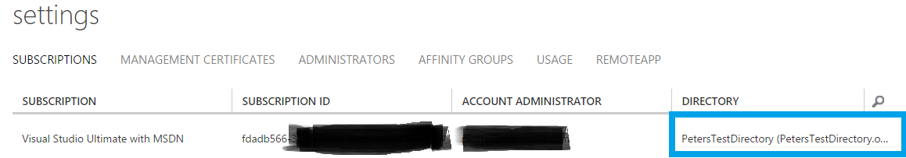

<properties 
    pageTitle="Verwenden von Azure RemoteApp mit Office 365 Benutzerkonten | Microsoft Azure"
    description="Informationen Sie zum Verwenden von Azure RemoteApp mit mein Office 365 Benutzerkonten"
    services="remoteapp"
    documentationCenter="" 
    authors="piotrci" 
    manager="mbaldwin" />

<tags 
    ms.service="remoteapp" 
    ms.workload="compute" 
    ms.tgt_pltfrm="na" 
    ms.devlang="na" 
    ms.topic="article" 
    ms.date="08/15/2016" 
    ms.author="elizapo" />

# Verwenden von Azure RemoteApp mit Office 365 Benutzerkonten

> [AZURE.IMPORTANT]
> Azure RemoteApp ist nicht mehr verwendet werden. Lesen Sie die Details der [Ankündigung](https://go.microsoft.com/fwlink/?linkid=821148) .

Wenn Sie ein Office 365-Abonnement besitzen müssen Sie eine Azure-Active Directory, die Ihren Benutzernamen und Kennwörter zum Zugreifen auf Office 365-Diensten verwendet werden gespeichert. Wenn Ihre Benutzer Office 365 ProPlus aktivieren authentifiziert werden sie beispielsweise gegen Azure AD Lizenzen überprüfen. Die meisten Kunden möchte dasselbe Verzeichnis mit Azure RemoteApp verwendet.

Wenn Sie Azure RemoteApp bereitstellen verwenden Sie wahrscheinlich ein Azure-Abonnement, die mit einer anderen Azure AD verknüpft ist. Ihr Office 365-Verzeichnis verwenden möchten, müssen Sie das Abonnement Azure in dieses Verzeichnis zu verschieben.

Informationen zum Bereitstellen von Office 365-Clientanwendungen finden Sie unter [wie Ihr Office 365-Abonnement mit Azure RemoteApp verwendet](remoteapp-officesubscription.md).
 
## Phase 1: Registrieren Sie sich Ihr kostenlose Abonnement von Office 365 Azure Active Directory
Wenn Sie das klassische Azure-Portal verwenden, führen Sie die Schritte in [Ihr kostenloses Azure Active Directory-Abonnement registrieren](https://technet.microsoft.com/library/dn832618.aspx) Administratorzugriff auf Ihre Azure AD über die Azure-Verwaltungsportal abgerufen. Als Ergebnis dieses Verfahren werden melden Sie sich bei der Azure-Portal und finden Sie unter Ihrem Verzeichnis es – zu diesem Zeitpunkt werden Sie viel mehr nicht angezeigt, da das vollständige Azure Abonnement mit Azure RemoteApp derzeit in einem anderen Verzeichnis wird angezeigt.

Denken Sie daran, den Namen und das Kennwort für das Administratorkonto in diesem Schritt erstellte – diese in Phase 2 benötigt werden.

Wenn Sie das Portal Azure verwenden, schauen Sie sich [zum Registrieren und einer kostenlosen Azure Active Directory mithilfe von Office 365-Portal aktivieren](http://azureblogger.com/2016/01/how-to-register-and-activate-a-free-azure-active-directory-using-office-365-portal/).

## Phase 2: Ändern des Azure AD mit Ihrer Azure-Abonnement verknüpft ist.
Wir werden nun Azure Ändern Ihres Abonnements von deren aktuellen Verzeichnisses in Office 365-Verzeichnis, die wir in Phase 1 mit gearbeitet haben.

Führen Sie die Anweisungen unter [Ändern der Azure-Active Directory-Mandanten in Azure RemoteApp](remoteapp-changetenant.md)beschrieben. Achten Sie vor allem, um die folgenden Schritte aus:

- Schritt #1: Wenn Sie Azure RemoteApp (ARA) in diesem Abonnement bereitgestellt haben, stellen Sie sicher, dass Sie alle Azure AD-Benutzerkonten aus alle ARA Sammlungen zuerst entfernen, bevor Sie versuchen, Sonstiges. Alternativ können Sie berücksichtigen, löschen alle vorhandenen Sammlungen.
- Schritt #2: Dies ist ein wichtiger Schritt. Sie müssen ein Microsoft-Konto verwenden (z. B. @outlook.com) als ein Dienstadministrator auf das Abonnement, da wir alle Benutzerkonten vom vorhandenen Azure AD mit dem Abonnement – verbunden haben, kann dies ist ist dies der Fall, wir können nicht mehr in eine andere Azure Anzeige zu verschieben.
- Schritt 4 #: Wenn Sie ein vorhandenes Verzeichnis hinzufügen, wird das System in melden Sie sich mit dem Administratorkonto für dieses Verzeichnis aufgefordert werden. Vergewissern Sie sich mit dem Administratorkonto von Phase 1.
- Schritt 5 #: Ändern des übergeordneten Verzeichnisses des Abonnements in Ihr Office 365-Verzeichnis. Das Ergebnis sollten, dass unter Einstellungen -> Abonnements Ihres Abonnements über Office 365 Verzeichnis Listen. 

 

An diesem Punkt ist Ihr Abonnement Azure RemoteApp Ihrer Office 365 Azure AD zugeordnet. Sie können die vorhandenen Office 365 Benutzerkonten mit Azure RemoteApp verwenden!

