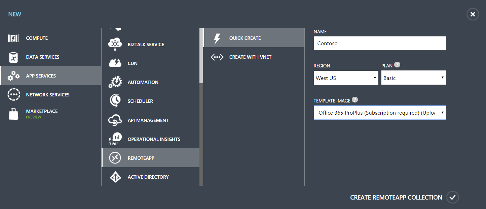

<properties 
    pageTitle="Verwenden von Ihrem Office 365-Abonnement mit Azure RemoteApp | Microsoft Azure"
    description="Erfahren Sie, wie Sie Ihre Office 365-Abonnement in Azure RemoteApp zum Freigeben von apps für Office verwenden können."
    services="remoteapp"
    documentationCenter="" 
    authors="piotrci" 
    manager="mbaldwin" />

<tags 
    ms.service="remoteapp" 
    ms.workload="compute" 
    ms.tgt_pltfrm="na" 
    ms.devlang="na" 
    ms.topic="article" 
    ms.date="08/15/2016" 
    ms.author="elizapo" />

# Verwenden von Ihrem Office 365-Abonnement mit Azure RemoteApp

> [AZURE.IMPORTANT]
> Azure RemoteApp ist nicht mehr verwendet werden. Lesen Sie die Details der [Ankündigung](https://go.microsoft.com/fwlink/?linkid=821148) .

Wussten Sie schon, dass Sie zum Office-apps aus der Cloud Freigeben Ihrer vorhandene Office 365-Abonnement in Azure RemoteApp verwenden können? Stellen Sie lesen Sie weiter Informationen zu Ihrer Office 365 + Azure RemoteApp Optionen, einschließlich Links zu Artikeln zu Office 365, mit denen Sie optimal für Ihr Abonnement.

## Wie verwende ich Office 365-Konten auf Azure RemoteApp?
Auschecken von Peters neuer Beitrag für alle Informationen: [wie Azure RemoteApp mit Office 365 Benutzerkonten verwendet.](remoteapp-o365user.md)

## Kann ich mein Office 365-Abonnement zum Ausführen von Office-Programme in Azure RemoteApp verwenden?

Ja! Tatsächlich ist das mit Ihrem Office 365-Abonnement die einzige Möglichkeit, Ihre Office-Anwendung zur Azure RemoteApp anzuzeigen.

(Notiz: Wenn eine RemoteApp Azure-Bereitstellung von einem Hostinganbieter Partner übermittelt wird, diese möglicherweise beschleunigen Lizenzen basierend auf einem [Service Provider-Lizenzvertrag](http://www.microsoft.com/en-us/Licensing/licensing-programs/spla-program.aspx)für Office)

Das beste an Ihr Office 365-Abonnement ist, dass Sie die gleichen Benutzerlizenz auf vielen verschiedenen Plattformen und Umgebungen, einschließlich der Azure Cloud verwenden können. Bei Verwendung von Office-Programme in Azure RemoteApp brauchen Sie weitere Lizenzen erwerben oder Ihre vorhandenen Lizenzen in keiner Weise Inhalte konfigurieren. Sie müssen lediglich ein Office 365-Abonnement, die [Office 365 ProPlus](https://technet.microsoft.com/library/Gg702619.aspx)enthält.

Office 365 ProPlus ermöglicht die [Aktivierung des freigegebenen](https://technet.microsoft.com/library/Dn782860.aspx) : mit diesem Feature können temporäre Benutzer-basierte Aktivierung für Office in virtuellen und Cloud-Umgebungen wie Azure RemoteApp (und Remote Desktop Services).

Welche Office 365-Plänen ist Office 365 ProPlus enthalten? Schauen Sie sich die [Verfügbarkeit von Diensten innerhalb jeder Plan](https://technet.microsoft.com/library/office-365-plan-options.aspx) Tabelle. Beachten Sie, dass nicht alle-Plänen ist Office 365 ProPlus (beispielsweise die Office 365-Business-Plan) enthalten. Wenn Ihr Plan nicht der Fall, in Erwägung ein Plan, der (beispielsweise Office 365 Education E3) unterstützt.

## Soweit, wie werden der Office 365 ProPlus Lizenzen mit Azure RemoteApp verwendet?

Jede Benutzerlizenz für Office 365 ProPlus können einen einzelnen Benutzer, die Office-Clientanwendungen auf bis zu 5 Computern plus Tablets und Telefone aktivieren. Jede Aktivierung ist für den Benutzer registriert, bis sie Office auf dem Gerät deaktivieren. (Benutzer können ihre Geräte im [Office 365-Portal](https://portal.office365.com/)verwalten).

Mit Azure RemoteApp möglicherweise ein einzelner Benutzer in mehreren Computern am gleichen Tag melden Sie sich ohne Ihr Wissen. Dies liegt daran der Dienst automatisch verwaltet und Ressourcen in der Cloud, skaliert, während der Benutzer sieht nur apps und Programme, die Sie freigegeben haben. Für dieses Szenario Office 365 ProPlus einen freigegebenen Computer Aktivierungs-Modus bietet – dies, dass der Benutzer muss keine Lizenzmanagement bedeutet Zugriff auf diese Ressourcen und die zählen die einzelnen Computer mit der Grenzwert 5 Computer Aktivierung nicht.

Solange Sie (der Administrator) Ihre Benutzer Office 365 ProPlus Lizenzen zuweisen, können sie Office auf ihren persönlichen Geräten und in der Sammlung Azure RemoteApp verwenden.

## Welche Office-Clientanwendungen kann ich in Office 365 und Azure RemoteApp verwenden?

Sie können Ihr Office 365-Abonnement aktivieren und Office 2013 in Azure RemoteApp Bereitstellungen Teilen verwenden. Die Verwendung von anderen Versionen von Office mit Azure RemoteApp wir derzeit nicht unterstützt. Dies umfasst Office 2003, Office 2007, Office 2010 und Office 2016.

## Wissenswertes zu Visio Pro oder Project Pro?

Das Office 365 ProPlus Bild in Ihrem Abonnement RemoteApp enthalten enthält Visio Pro und Project Pro. Aber Sie können Ihr Office 365 ProPlus Abonnement verwenden, um diesen Programmen aktivieren – sie jeweils über eigene Lizenz verfügen. Sie können sie in der [Office 365-Portal](https://portal.office365.com/)aktivieren. 

Sie müssen diese Programme lizenzieren, wenn Sie nicht, verwenden sie möchten nicht. Aktivieren Sie nur die Programme, die Sie verwenden möchten – und die anderen überspringen. Wird diese in das Bild weiterhin angezeigt, jedoch können Sie nicht. 

## Wie Schritte kann ich mit Office 365 und Azure RemoteApp?

Jetzt, da Sie die Details einer Lizenzierung von Office 365 wissen, lassen Sie uns erhalten Sie die Schritte im RemoteApp Azure verwenden – es ist sehr einfach:

Wenn Sie Ihre Azure RemoteApp-Websitesammlung erstellen, verwenden Sie das Bild mit **Office 365 ProPlus (Abonnement erforderlich)** .

Diese Abbildung enthält die neueste Version von Windows Server und Office 365 ProPlus. Nachdem Sie Ihre Sammlung (einschließlich publishing apps), die Benutzer einfach konfigurieren melden Sie sich bei Azure RemoteApp (mithilfe von deren RemoteApp Client) und Angabe ihrer Office 365-Anmeldeinformationen für alle Office-apps. Lizenzen werden automatisch ohne eine Menge von übermittelt oder Management erforderlich.

## Kann ich ein benutzerdefiniertes Bild mit Office 365 ProPlus erstellen?

Sie können ein benutzerdefiniertes Bild für Ihre Websitesammlung erstellen, die Office 365 ProPlus enthält. 2 Optionen vorhanden sind –, die, das wir erläutern die notwendigen, Azure Katalog Bild verwenden oder können Sie ein eigenes benutzerdefinierte Bild erstellen und es installieren von Office 365 ProPlus.

### Verwenden Sie das Bild Azure-Katalog

Die einfachste Methode zum Bereitstellen von Office 365 ProPlus eine Auflistung besteht darin [beginnen mit einem der Azure-Katalog Bilder](remoteapp-image-on-azurevm.md) in Ihrem Abonnement Azure RemoteApp enthalten. Stellen Sie sicher, dass Sie die **Windows Server Remote Desktop Session Host mit Office 365 ProPlus vorinstalliert** Grafik auswählen. Installieren von anderen apps, die gewünschten klicken Sie dann auf, die diesem Bild, und Sie sind mit der glänzen.

### Verwenden Sie ein benutzerdefiniertes Bild

Können Sie ein benutzerdefiniertes Bild immer erstellen – Sie erstellen eine [Azure-virtuellen Computer](remoteapp-image-on-azurevm.md) oder [das Bild lokal erstellen](remoteapp-create-custom-image.md) und auf Azure hochladen können. Stellen Sie in beiden Fällen sicher, dass Sie Office 365 ProPlus mithilfe des Aktivierungs-Knotens freigegebenen Computer installieren. Verwenden Sie das [Office-Bereitstellungstools für](http://blogs.technet.com/b/odsupport/archive/2014/07/11/using-the-office-deployment-tool.aspx) , und folgen Sie den [Anweisungen](https://technet.microsoft.com/library/Dn782858.aspx) für die Installation.  

### Deaktivieren von automatischen Updates für Office 365 ProPlus in Ihr benutzerdefiniertes Bild - wichtig

Das benutzerdefinierte Abbild Azure RemoteApp als Vorlage dient zum Hinzufügen von zusätzlichen Ressourcen wie die Anforderung aus Ihrer Benutzer erhöht. Wenn verzögert und Verbindungsprobleme verhindern möchten, Deaktivieren von automatischen Updates für Office im Bild. Wenn Sie nicht der Fall ist, wird jeder Ressource mit dieser Vorlage erstellt automatisch aktualisiert, wenn er gestartet wird. Verwenden Sie stattdessen den standardmäßigen Azure RemoteApp Prozess zum Aktualisieren des benutzerdefinierten Bilds ein. Auf diese Weise aktualisieren die Office-Programme, klicken Sie einmal auf das Vorlagenbild, und lassen Sie Azure RemoteApp übernehmen für Ihre Benutzer die Updates herunterzuladen.

Fügen Sie den folgenden zum Deaktivieren von automatischen Updates in die Office-Bereitstellungstools für Konfigurationsdatei:

        <Updates Enabled="FALSE" />

Nun sollte die Konfigurationsdatei diese Zeilen enthalten:
    
        <Display Level="NONE" AcceptEULA="TRUE" />
        <Property Name="SharedComputerLicensing" Value="1" />
        <Updates Enabled="FALSE" />

## Wie kann ich ein Bild mit Office 365 ProPlus aktualisieren?

Es gibt viele Gründe für das Bild in Ihrer Websitesammlung zu aktualisieren. Hier sind ein paar:

- Erhalten Sie die neuesten Updates für Windows 
- Erhalten Sie die neuesten Updates für Office 365 ProPlus-Anwendung
- Aktualisieren Sie Ihre benutzerdefinierten app
- Ändern Sie Einstellungen für das Bild selbst Konfiguration

Die End-to-End-Schritte zum Aktualisieren der Websitesammlung, um das Bild zu verwenden, die aktualisiert, wird, finden Sie [hier](remoteapp-update.md). Informationen zum Aktualisieren Sie das Bild und Office 365 ProPlus, aktivieren Sie die folgenden Informationen jedoch.

Sie haben zwei Möglichkeiten zum Aktualisieren Ihr Bilds – ersetzen Sie das Bild durch ein vollständig neues oder manuell aktualisieren Sie das vorhandene Bild.

### Ersetzen Sie das Bild mit dem neuesten Azure Katalog Bild + fügen Anpassungen hinzu
Mit dieser Option können Sie Microsoft Windows Server und Office 365 ProPlus-Updates erledigen. Statt aktualisieren das vorhandene Bild, erstellen Sie ein vollständig neues Bild, basierend auf dem neuesten Katalog Bild. Wiederholen Sie dann auf alle Schritte vorher passen Sie das Bild – installieren benutzerdefinierte apps, die Konfiguration Image usw. ändern.

Katalog Bilder werden regelmäßig aktualisiert, damit Sie wissen, dass Ihre Windows Server und Office 365 ProPlus-apps auf dem neuesten Stand sind einfache und positionieren können. Das Verhältnis ist natürlich, dass Sie Ihre Anpassungen anwenden jedes Mal, wenn Sie ein neues Bild erhalten haben. Sie können Skripts zum Automatisieren von festlegen Ihrer Anpassungen erstellen.

### Das vorhandene Bild manuell aktualisiert werden.

Mit dieser Option verwenden Sie Windows-Standardprogramme Updates zu dem Bild zuzuweisen. Verwenden Sie für Office 365 ProPlus des Office-Bereitstellungstools herunterladen und Installieren der neuesten Updates oder Versionen von Office 365 ProPlus.

> [AZURE.IMPORTANT] Denken Sie daran: Deaktivieren der Office 365 ProPlus automatische Updates.

Benötigen Sie weitere Informationen zur Verwendung des Office-Bereitstellungstools nach Updates suchen?

- [Bereitstellen von Klick-und-Los für Office 365-Produkte mithilfe des Office-Bereitstellungstools](https://technet.microsoft.com/library/JJ219423.aspx)
- [Bereitstellen und Aktualisieren von Office 365 ProPlus mithilfe des Office-Bereitstellungstools für](https://channel9.msdn.com/Events/Ignite/2015/BRK3168) (Video)
- [Konfigurieren von Update-Einstellungen für Office 365 ProPlus](https://technet.microsoft.com/library/dn761708.aspx)
