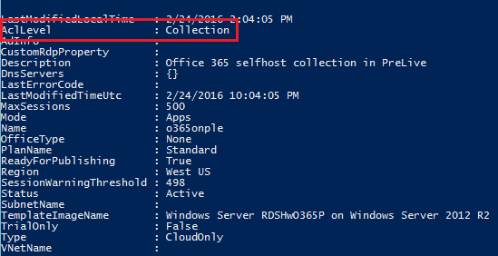

<properties
   pageTitle="Veröffentlichen von Applications für einzelne Benutzer in einer Websitesammlung Azure RemoteApp (Preview) | Microsoft Azure"
   description="Erfahren Sie, wie Sie apps für einzelne Benutzer anstelle von je nach den Gruppen in Azure RemoteApp veröffentlichen können."
   services="remoteapp-preview"
   documentationCenter=""
   authors="piotrci"
   manager="mbaldwin"
   editor=""/>

<tags
   ms.service="remoteapp"
   ms.devlang="na"
   ms.topic="hero-article"
   ms.tgt_pltfrm="na"
   ms.workload="compute"
   ms.date="08/15/2016"
   ms.author="piotrci"/>

# Veröffentlichen von Applications für einzelne Benutzer in einer Websitesammlung Azure RemoteApp (Preview)

> [AZURE.IMPORTANT]
> Azure RemoteApp ist nicht mehr verwendet werden. Lesen Sie die Details der [Ankündigung](https://go.microsoft.com/fwlink/?linkid=821148) .

In diesem Artikel wird erläutert, wie Applikationen für einzelne Benutzer in einer Websitesammlung Azure RemoteApp veröffentlichen. Hierbei handelt es sich um neue Funktionalität in Azure-RemoteApp, derzeit in "als" Privat "Vorschau" und steht nur frühen Anwender Testzwecken auswählen.

Ursprünglich Azure RemoteApp nur eine Möglichkeit von Applications "Veröffentlichen" aktiviert: der Administrator apps aus dem Bild veröffentlichen möchten, und diese für alle Benutzer in der Auflistung sichtbar sein sollte.

Häufig wird zu viele Clientanwendungen in ein einzelnes Bild und Bereitstellen einer Websitesammlung, um die Verwaltungskosten. Häufig Suchfunktionen nicht alle Programme für alle Benutzer relevant sind – Administratoren bevorzugen zum Veröffentlichen von apps für einzelne Benutzer, damit diese unnötige Applications in ihrer Anwendung-Feeds angezeigt werden.

Dies ist jetzt möglich in Azure RemoteApp – aktuell als ein Vorschaufeature eingeschränkte. Hier ist eine kurze Übersicht über die neuen Funktionen:

1. Eine Auflistung kann in einer von zwei Modi festgelegt werden:
 
  - die ursprüngliche "Websitesammlung Modus" alle Benutzer in einer Websitesammlung, wo erhält veröffentlicht alle Applikationen. Dies ist der Standardmodus.
  - neue "Anwendungsmodus", wo Benutzer nur Applications angezeigt, die wurden explizit zugewiesen werden

2. Momentan kann der Anwendungsmodus nur aktiviert werden Azure RemoteApp PowerShell-Cmdlets verwenden.

  - In Anwendungsmodus beim Festlegen, kann Benutzer Zuordnung in der Auflistung über das Portal Azure verwaltet werden. Benutzer Zuordnung muss über PowerShell-Cmdlets verwaltet werden.

3. Benutzer wird nur die Programme, die direkt an diese veröffentlicht angezeigt. Jedoch kann es immer noch für einen Benutzer in anderen Anwendungen verfügbar ist, klicken Sie auf das Bild zu starten, indem Sie den Zugriff auf die sie direkt in das Betriebssystem möglich sein.
  - Dieses Feature bietet keine sichere Sperrung von Applications. ein-oder Ausblenden in der Anwendung-Feeds nur beschränkt.
  - Wenn Sie Benutzer von Applications isolieren müssen, müssen Sie separate Websitesammlungen für das verwenden.

## So erhalten Sie Azure RemoteApp PowerShell-cmdlets

Wenn Sie die neuen Funktionen für Vorschau versuchen, müssen Sie Azure PowerShell-Cmdlets verwenden zu können. Es ist derzeit nicht möglich, Azure Verwaltungsportal verwenden, um den neuen Anwendung veröffentlichen Modus zu aktivieren.

Vergewissern Sie sich, dass Sie die [Azure PowerShell-Modul](../powershell-install-configure.md) installiert haben.

Klicken Sie dann starten Sie die PowerShell-Konsole im Administratormodus, und führen Sie das folgende Cmdlet aus:

        Add-AzureAccount

Es fordert Sie für Ihren Azure Benutzernamen und Ihr Kennwort ein. Sobald Sie angemeldet haben, werden Sie Azure RemoteApp-Cmdlets für Ihre Azure-Abonnements ausgeführt sein.

## So überprüfen Sie, welchen Modus eine Auflistung befindet

Führen Sie das folgende Cmdlet aus:

        Get-AzureRemoteAppCollection <collectionName>

Die Eigenschaft AclLevel kann die folgenden Werte aufweisen:

- Sammlung: der ursprünglichen Veröffentlichung Modus. Alle Benutzer angezeigt, dass alle apps veröffentlicht.
- Anwendung: der neuen publishing Modus. Benutzer finden Sie unter nur die apps, die direkt an diese veröffentlicht.

## Wie Sie zur Anwendung veröffentlichen Modus wechseln

Führen Sie das folgende Cmdlet aus:

        Set-AzureRemoteAppCollection -CollectionName -AclLevel Application

Anwendung veröffentlichen Zustand beibehalten wird: zunächst alle Benutzer werden alle der ursprünglichen veröffentlichten apps angezeigt.

## Wie Benutzer aufgelistet, wer eine bestimmte Anwendung sehen kann

Führen Sie das folgende Cmdlet aus:

        Get-AzureRemoteAppUser -CollectionName <collectionName> -Alias <appAlias>

Dies sind alle Benutzer, die der Anwendung sehen können.

Hinweis: Sie können finden Sie unter die Anwendung Aliases (in der obigen Syntax als "app-Alias" bezeichnet) durch Ausführen der Get-AzureRemoteAppProgram - CollectionName <collectionName>.

## So weisen Sie eine Anwendung einem Benutzer

Führen Sie das folgende Cmdlet aus:

        Add-AzureRemoteAppUser -CollectionName <collectionName> -UserUpn <user@domain.com> -Type <OrgId|MicrosoftAccount> -Alias <appAlias>

Der Benutzer wird nun die Anwendung im Client Azure RemoteApp angezeigt und sind in der Lage, eine Verbindung herstellen.

## So entfernen Sie eine Anwendung eines Benutzers

Führen Sie das folgende Cmdlet aus:

        Remove-AzureRemoteAppUser -CollectionName <collectionName> -UserUpn <user@domain.com> -Type <OrgId|MicrosoftAccount> -Alias <appAlias>

## Übermitteln von feedback
Vielen Dank für Ihr Feedback und Vorschläge zu dieser Funktion. Füllen Sie die [Umfrage](http://www.instant.ly/s/FDdrb) zu teilen Sie uns Ihre Meinung.

## Hatten noch nicht können Sie das Vorschaufeature ausprobieren?
Wenn Sie in der Vorschau noch nicht teilgenommen haben, verwenden Sie diese [Umfrage](http://www.instant.ly/s/AY83p) Zugriff anfordern.
